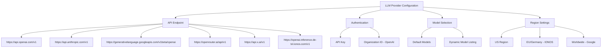
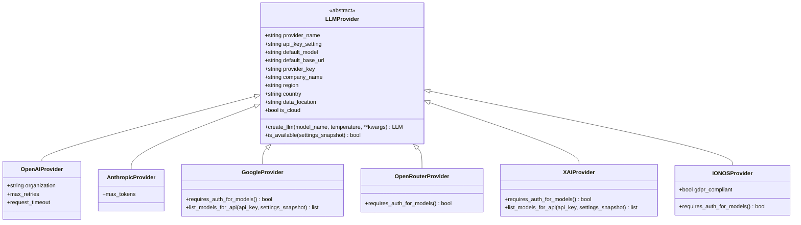
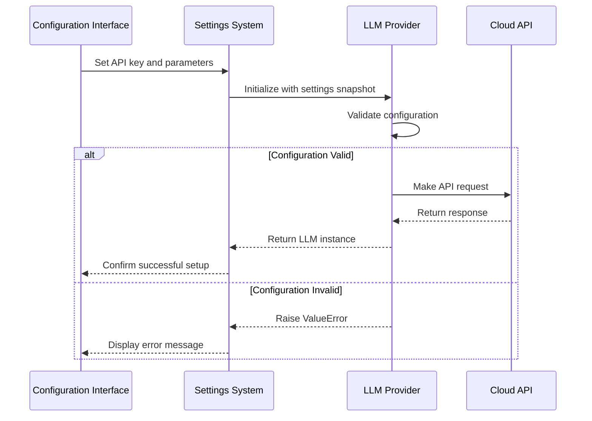
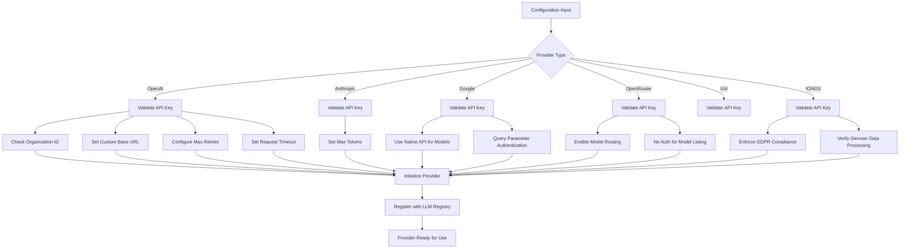
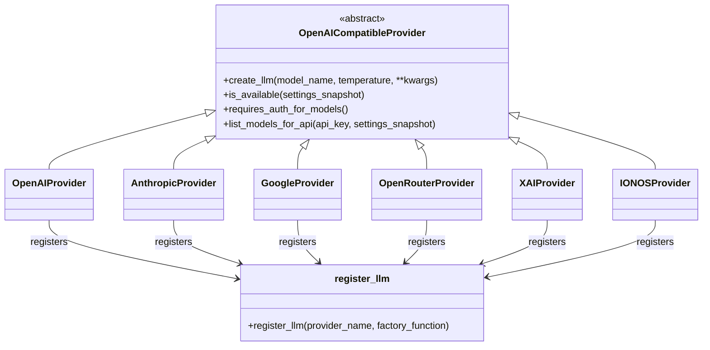

# Cloud LLM Providers

<cite>
**Referenced Files in This Document**   
- [openai.py](file://src/local_deep_research/llm/providers/implementations/openai.py)
- [anthropic.py](file://src/local_deep_research/llm/providers/implementations/anthropic.py)
- [google.py](file://src/local_deep_research/llm/providers/implementations/google.py)
- [openrouter.py](file://src/local_deep_research/llm/providers/implementations/openrouter.py)
- [xai.py](file://src/local_deep_research/llm/providers/implementations/xai.py)
- [ionos.py](file://src/local_deep_research/llm/providers/implementations/ionos.py)
- [openai_base.py](file://src/local_deep_research/llm/providers/openai_base.py)
- [google_settings.json](file://src/local_deep_research/defaults/llm_providers/google_settings.json)
- [ionos_settings.json](file://src/local_deep_research/defaults/llm_providers/ionos_settings.json)
- [openrouter_settings.json](file://src/local_deep_research/defaults/llm_providers/openrouter_settings.json)
- [xai_settings.json](file://src/local_deep_research/defaults/llm_providers/xai_settings.json)
</cite>

## Table of Contents
1. [Introduction](#introduction)
2. [Provider Configuration Parameters](#provider-configuration-parameters)
3. [API Key Management](#api-key-management)
4. [Provider-Specific Features](#provider-specific-features)
5. [Advanced Configuration Options](#advanced-configuration-options)
6. [Initialization Process](#initialization-process)
7. [Security Considerations](#security-considerations)

## Introduction
This document provides comprehensive guidance on configuring cloud-based LLM providers within the Local Deep Research system. It covers the setup and configuration of OpenAI, Anthropic, Google, OpenRouter, IONOS, and XAI providers, detailing their specific parameters, authentication methods, and initialization processes. The system uses an OpenAI-compatible base class architecture to standardize interactions across different providers while maintaining provider-specific configurations.

**Section sources**
- [openai.py](file://src/local_deep_research/llm/providers/implementations/openai.py#L1-L218)
- [anthropic.py](file://src/local_deep_research/llm/providers/implementations/anthropic.py#L1-L162)

## Provider Configuration Parameters

### API Endpoints and Base URLs
Each provider has a specific API endpoint configuration that determines where requests are sent:

- **OpenAI**: Default base URL is `https://api.openai.com/v1`
- **Anthropic**: Default base URL is `https://api.anthropic.com/v1`
- **Google**: Uses OpenAI-compatible endpoint at `https://generativelanguage.googleapis.com/v1beta/openai`
- **OpenRouter**: Configured with `https://openrouter.ai/api/v1`
- **XAI**: Base URL set to `https://api.x.ai/v1`
- **IONOS**: German-based inference endpoint `https://openai.inference.de-txl.ionos.com/v1`

### Model Identifiers
Default models are configured for each provider:
- OpenAI: `gpt-3.5-turbo`
- Anthropic: `claude-3-sonnet-20240229`
- Google: `gemini-1.5-flash`
- OpenRouter: `meta-llama/llama-3.2-3b-instruct:free`
- XAI: `grok-beta`
- IONOS: `meta-llama/llama-3.2-3b-instruct`

### Region and Data Location Settings
Providers have specific geographical configurations:
- **IONOS** is GDPR-compliant with data processing in Germany
- **Google** has worldwide data locations
- Most other providers are US-based with data locations in the United States

**Diagram sources**
- [openai.py](file://src/local_deep_research/llm/providers/implementations/openai.py#L35)
- [anthropic.py](file://src/local_deep_research/llm/providers/implementations/anthropic.py#L35)
- [google.py](file://src/local_deep_research/llm/providers/implementations/google.py#L19)
- [openrouter.py](file://src/local_deep_research/llm/providers/implementations/openrouter.py#L19)
- [xai.py](file://src/local_deep_research/llm/providers/implementations/xai.py#L17)
- [ionos.py](file://src/local_deep_research/llm/providers/implementations/ionos.py#L19)

**Section sources**
- [openai.py](file://src/local_deep_research/llm/providers/implementations/openai.py#L32-L44)
- [anthropic.py](file://src/local_deep_research/llm/providers/implementations/anthropic.py#L32-L43)
- [google.py](file://src/local_deep_research/llm/providers/implementations/google.py#L17-L28)
- [openrouter.py](file://src/local_deep_research/llm/providers/implementations/openrouter.py#L17-L30)
- [xai.py](file://src/local_deep_research/llm/providers/implementations/xai.py#L15-L26)
- [ionos.py](file://src/local_deep_research/llm/providers/implementations/ionos.py#L17-L29)

## API Key Management

### Environment Variables
API keys are configured through environment variables or settings system with specific key names:
- OpenAI: `llm.openai.api_key`
- Anthropic: `llm.anthropic.api_key`
- Google: `llm.google.api_key`
- OpenRouter: `llm.openrouter.api_key`
- XAI: `llm.xai.api_key`
- IONOS: `llm.ionos.api_key`

### JSON Configuration Files
Default settings for providers are stored in JSON configuration files:
- `google_settings.json`
- `ionos_settings.json`
- `openrouter_settings.json`
- `xai_settings.json`

These files contain provider-specific defaults and metadata used during initialization and auto-discovery.

**Diagram sources**
- [openai_base.py](file://src/local_deep_research/llm/providers/openai_base.py)
- [openai.py](file://src/local_deep_research/llm/providers/implementations/openai.py)
- [anthropic.py](file://src/local_deep_research/llm/providers/implementations/anthropic.py)
- [google.py](file://src/local_deep_research/llm/providers/implementations/google.py)
- [openrouter.py](file://src/local_deep_research/llm/providers/implementations/openrouter.py)
- [xai.py](file://src/local_deep_research/llm/providers/implementations/xai.py)
- [ionos.py](file://src/local_deep_research/llm/providers/implementations/ionos.py)

**Section sources**
- [openai.py](file://src/local_deep_research/llm/providers/implementations/openai.py#L33)
- [anthropic.py](file://src/local_deep_research/llm/providers/implementations/anthropic.py#L33)
- [google.py](file://src/local_deep_research/llm/providers/implementations/google.py#L18)
- [openrouter.py](file://src/local_deep_research/llm/providers/implementations/openrouter.py#L18)
- [xai.py](file://src/local_deep_research/llm/providers/implementations/xai.py#L16)
- [ionos.py](file://src/local_deep_research/llm/providers/implementations/ionos.py#L18)

## Provider-Specific Features

### OpenAI Specific Configuration
OpenAI provider supports additional configuration options:
- **Organization ID**: Configured via `llm.openai.organization` setting
- **Custom API Base**: Override default endpoint with `llm.openai.api_base`
- **Streaming**: Controlled by `llm.streaming` setting
- **Max Retries**: Configured globally via `llm.max_retries`
- **Request Timeout**: Set using `llm.request_timeout`

### Anthropic Configuration
Anthropic provider includes:
- **Max Tokens**: Configured through `llm.max_tokens` setting
- No organization-level configuration required

### Google Vertex AI Configuration
Google provider uses:
- Native API for model listing due to OpenAI endpoint bug
- API key required as query parameter (not header)
- Access to all Gemini models through unified endpoint
- Worldwide data processing locations

### OpenRouter Model Routing
OpenRouter enables access to multiple models through unified routing:
- Supports models from various providers (OpenAI, Anthropic, etc.)
- Free tier available with rate limits
- Model names follow provider/model-name format
- No authentication required for model listing

### IONOS GDPR Compliance
IONOS provider features:
- Data processing exclusively in Germany
- GDPR-compliant operations
- Free service until September 30, 2025
- Enterprise-grade security

**Diagram sources**
- [openai.py](file://src/local_deep_research/llm/providers/implementations/openai.py#L46-L160)
- [anthropic.py](file://src/local_deep_research/llm/providers/implementations/anthropic.py#L46-L104)
- [google.py](file://src/local_deep_research/llm/providers/implementations/google.py#L30-L96)

**Section sources**
- [openai.py](file://src/local_deep_research/llm/providers/implementations/openai.py#L100-L108)
- [google.py](file://src/local_deep_research/llm/providers/implementations/google.py#L50-L96)
- [openrouter.py](file://src/local_deep_research/llm/providers/implementations/openrouter.py#L32-L35)
- [ionos.py](file://src/local_deep_research/llm/providers/implementations/ionos.py#L27)

## Advanced Configuration Options

### Custom Base URLs
All providers support custom base URLs through their respective settings:
- Overrides default endpoints for self-hosted or proxy scenarios
- Configured through provider-specific settings (e.g., `llm.openai.api_base`)

### Request Timeouts
Configurable request timeouts:
- Set globally via `llm.request_timeout` setting
- Applied to all API requests
- Prevents hanging requests and improves system responsiveness

### Proxy Settings
The system supports proxy configurations through:
- Environment variables (HTTP_PROXY, HTTPS_PROXY)
- Network utilities in security module
- Safe request handling with connection verification

### Maximum Retries
Retry configuration:
- Global setting `llm.max_retries` controls retry attempts
- Applied to all cloud providers
- Helps with transient network issues

**Diagram sources**
- [openai.py](file://src/local_deep_research/llm/providers/implementations/openai.py#L88-L140)
- [google.py](file://src/local_deep_research/llm/providers/implementations/google.py#L50-L96)
- [openrouter.py](file://src/local_deep_research/llm/providers/implementations/openrouter.py#L32-L35)

**Section sources**
- [openai.py](file://src/local_deep_research/llm/providers/implementations/openai.py#L88-L140)
- [google.py](file://src/local_deep_research/llm/providers/implementations/google.py#L50-L96)

## Initialization Process

### Base Provider Class
All cloud providers extend the `OpenAICompatibleProvider` base class which provides:
- Standardized interface for LLM creation
- Consistent error handling
- Uniform settings retrieval
- Common logging patterns

### Implementation Pattern
Each provider follows the same implementation pattern:
1. Define provider-specific constants (name, API key setting, default model, base URL)
2. Implement `create_llm` factory method
3. Implement `is_available` health check
4. Register provider with global registry

### Registration Process
Providers are registered through dedicated functions:
- `register_openai_provider()`
- `register_anthropic_provider()`
- `register_google_provider()`
- `register_openrouter_provider()`
- `register_xai_provider()`
- `register_ionos_provider()`

These functions register the provider with the LLM registry using the provider name and factory function.

**Diagram sources**
- [openai_base.py](file://src/local_deep_research/llm/providers/openai_base.py)
- [openai.py](file://src/local_deep_research/llm/providers/implementations/openai.py#L214-L217)
- [anthropic.py](file://src/local_deep_research/llm/providers/implementations/anthropic.py#L158-L161)
- [google.py](file://src/local_deep_research/llm/providers/implementations/google.py#L129-L132)
- [openrouter.py](file://src/local_deep_research/llm/providers/implementations/openrouter.py#L68-L71)
- [xai.py](file://src/local_deep_research/llm/providers/implementations/xai.py#L77-L80)
- [ionos.py](file://src/local_deep_research/llm/providers/implementations/ionos.py#L67-L70)

**Section sources**
- [openai.py](file://src/local_deep_research/llm/providers/implementations/openai.py#L26-L218)
- [anthropic.py](file://src/local_deep_research/llm/providers/implementations/anthropic.py#L26-L162)
- [google.py](file://src/local_deep_research/llm/providers/implementations/google.py#L9-L133)
- [openrouter.py](file://src/local_deep_research/llm/providers/implementations/openrouter.py#L9-L72)
- [xai.py](file://src/local_deep_research/llm/providers/implementations/xai.py#L9-L81)
- [ionos.py](file://src/local_deep_research/llm/providers/implementations/ionos.py#L9-L71)

## Security Considerations

### API Key Management
Best practices for API key security:
- Never hardcode keys in source code
- Use environment variables or secure settings system
- Regularly rotate keys
- Restrict key permissions to minimum required

### Network Security
The system implements several network security measures:
- Secure HTTP requests through `safe_get` utility
- SSRF protection in URL validation
- Input sanitization for all external inputs
- Rate limiting to prevent abuse

### Data Privacy
Provider-specific data privacy considerations:
- **IONOS**: GDPR-compliant with data processing in Germany
- **Google**: Data may be processed in multiple regions worldwide
- Other providers: Primarily US-based data processing

### Authentication Security
Security features include:
- API key validation before any requests
- Error handling that doesn't expose sensitive information
- Logging that redacts sensitive credentials
- Secure storage of settings in the database

**Section sources**
- [security/safe_get.py](file://src/local_deep_research/security/safe_requests.py)
- [security/url_validator.py](file://src/local_deep_research/security/url_validator.py)
- [security/ssrf_validator.py](file://src/local_deep_research/security/ssrf_validator.py)
- [openai.py](file://src/local_deep_research/llm/providers/implementations/openai.py#L69-L74)
- [anthropic.py](file://src/local_deep_research/llm/providers/implementations/anthropic.py#L69-L74)
- [ionos.py](file://src/local_deep_research/llm/providers/implementations/ionos.py#L27)