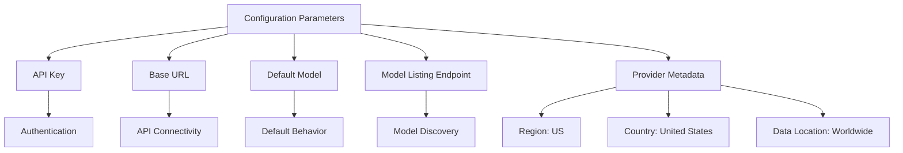
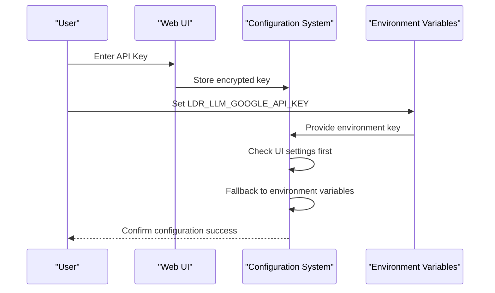
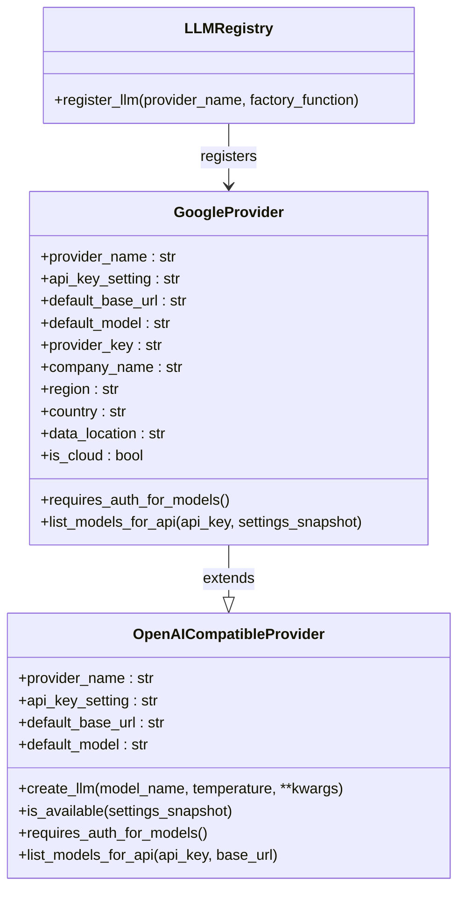
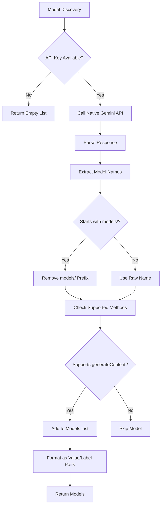

# Google AI Configuration

<cite>
**Referenced Files in This Document**   
- [google.py](file://src/local_deep_research/llm/providers/implementations/google.py)
- [google_settings.json](file://src/local_deep_research/defaults/llm_providers/google_settings.json)
- [openai_base.py](file://src/local_deep_research/llm/providers/openai_base.py)
- [search_engine_google_pse.py](file://src/local_deep_research/web_search_engines/engines/search_engine_google_pse.py)
- [unraid.md](file://docs/deployment/unraid.md)
- [local-deep-research.xml](file://unraid-templates/local-deep-research.xml)
</cite>

## Table of Contents
1. [Introduction](#introduction)
2. [Configuration Parameters](#configuration-parameters)
3. [Authentication Methods](#authentication-methods)
4. [Provider Implementation](#provider-implementation)
5. [Model Management](#model-management)
6. [Advanced Configuration](#advanced-configuration)
7. [Security Best Practices](#security-best-practices)
8. [Network and Environment Considerations](#network-and-environment-considerations)

## Introduction
This document provides comprehensive guidance for configuring Google AI as a cloud LLM provider within the Local Deep Research system. The integration leverages Google's Vertex AI platform through its OpenAI-compatible API endpoint, enabling access to Gemini models with minimal configuration. The system is designed to support both simple and advanced use cases, with flexible authentication options and robust security practices.

**Section sources**
- [google.py](file://src/local_deep_research/llm/providers/implementations/google.py#L1-L133)

## Configuration Parameters
The Google AI provider requires several key configuration parameters to establish connectivity and define operational behavior:

- **API Key**: The primary authentication credential for accessing Google's AI services, stored under the setting key `llm.google.api_key`
- **Base URL**: The endpoint URL for the OpenAI-compatible API, defaulting to `https://generativelanguage.googleapis.com/v1beta/openai`
- **Default Model**: The fallback model used when none is specified, currently set to `gemini-1.5-flash`
- **Model Listing Endpoint**: Uses Google's native API endpoint for model discovery due to limitations in the OpenAI-compatible models endpoint

The configuration also includes provider metadata such as region (US), country (United States), and data location (Worldwide), which informs users about the geographical aspects of the service.

**Diagram sources**
- [google.py](file://src/local_deep_research/llm/providers/implementations/google.py#L16-L27)

**Section sources**
- [google.py](file://src/local_deep_research/llm/providers/implementations/google.py#L16-L27)
- [google_settings.json](file://src/local_deep_research/defaults/llm_providers/google_settings.json#L1-L17)

## Authentication Methods
Google AI authentication can be configured through multiple methods, providing flexibility for different deployment scenarios:

### Environment Variables
The system supports environment variable-based authentication with the following variables:
- `LDR_LLM_GOOGLE_API_KEY`: Locks the Google API key at the environment level, preventing UI modifications

### JSON Configuration Files
Configuration can be managed through JSON settings files that define the API key and other parameters. The system uses a hierarchical settings approach where environment variables can override file-based configurations.

### Web UI Configuration
Users can configure the API key through the web interface, where it is stored securely in the application's settings database. The UI presents the field as a password input to protect the sensitive credential.

The authentication system follows a validation chain where the provider checks for the API key in multiple locations, ensuring robust fallback behavior while maintaining security.

**Diagram sources**
- [google.py](file://src/local_deep_research/llm/providers/implementations/google.py#L18)
- [unraid.md](file://docs/deployment/unraid.md#L164)
- [local-deep-research.xml](file://unraid-templates/local-deep-research.xml#L49)

**Section sources**
- [google.py](file://src/local_deep_research/llm/providers/implementations/google.py#L18)
- [google_settings.json](file://src/local_deep_research/defaults/llm_providers/google_settings.json#L2-L13)
- [unraid.md](file://docs/deployment/unraid.md#L164)
- [local-deep-research.xml](file://unraid-templates/local-deep-research.xml#L49)

## Provider Implementation
The Google AI provider is implemented as an extension of the base `OpenAICompatibleProvider` class, leveraging the shared functionality while implementing Google-specific behaviors.

### Class Hierarchy
The `GoogleProvider` class inherits from `OpenAICompatibleProvider`, which provides the foundational implementation for OpenAI-compatible endpoints. This inheritance pattern enables code reuse while allowing for provider-specific customizations.

### Key Implementation Features
- **OpenAI Compatibility**: Uses the OpenAI-compatible endpoint to access Gemini models, ensuring compatibility with existing tooling
- **Native API Fallback**: Implements a custom model listing method that uses Google's native API due to limitations in the OpenAI-compatible models endpoint
- **Automatic Model Support**: The OpenAI-compatible endpoint automatically supports all current and future Gemini models without requiring code updates

### Registration Process
The provider is registered with the LLM registry through the `register_google_provider` function, which associates the "google" provider key with the `create_google_llm` factory function.

**Diagram sources**
- [google.py](file://src/local_deep_research/llm/providers/implementations/google.py#L9-L132)
- [openai_base.py](file://src/local_deep_research/llm/providers/openai_base.py#L25-L340)

**Section sources**
- [google.py](file://src/local_deep_research/llm/providers/implementations/google.py#L9-L132)
- [openai_base.py](file://src/local_deep_research/llm/providers/openai_base.py#L25-L340)

## Model Management
The Google AI provider implements a sophisticated model management system that addresses the unique challenges of Google's API implementation.

### Model Discovery
Due to a known limitation in Google's OpenAI-compatible API (the models endpoint returns 401), the provider uses Google's native Gemini API endpoint for model discovery. This approach requires the API key to be passed as a query parameter rather than in headers, following Google's documented approach.

### Model Filtering
The model listing process includes filtering to ensure only generative models are exposed to users. Models are filtered based on their supported generation methods, specifically including only those that support the "generateContent" method.

### Model Metadata
For each available model, the system extracts the model ID from the full resource name (e.g., extracting "gemini-1.5-flash" from "models/gemini-1.5-flash") and presents it in a user-friendly format with both value and label fields.

**Diagram sources**
- [google.py](file://src/local_deep_research/llm/providers/implementations/google.py#L40-L96)

**Section sources**
- [google.py](file://src/local_deep_research/llm/providers/implementations/google.py#L40-L96)

## Advanced Configuration
The Google AI provider supports several advanced configuration options that enhance its flexibility and performance in various deployment scenarios.

### Custom Endpoints
While the default configuration uses Google's standard endpoint, the system architecture allows for custom endpoints through the base provider's URL setting mechanism. This enables potential use of private endpoints or regional variations.

### Request Timeout Settings
The provider inherits request timeout capabilities from the base implementation, allowing users to configure how long the system waits for responses from Google's API. This is particularly useful for managing performance in high-latency network environments.

### Provider Metadata
The implementation includes comprehensive provider metadata that informs the user interface about the characteristics of the Google AI service, including:
- Cloud provider status (cloud-based)
- Geographic region (US)
- Data location (worldwide)
- GDPR compliance status

This metadata enables the UI to present users with important information about data sovereignty and compliance considerations.

**Section sources**
- [google.py](file://src/local_deep_research/llm/providers/implementations/google.py#L22-L28)
- [openai_base.py](file://src/local_deep_research/llm/providers/openai_base.py#L129-L138)

## Security Best Practices
Implementing Google AI as a cloud LLM provider requires careful attention to security practices to protect credentials and ensure system integrity.

### Credential Management
- Store API keys in secure configuration storage rather than in code
- Use environment variables for production deployments to prevent accidental exposure
- Leverage the UI's password input field to protect keys during entry
- Consider using the environment variable locking mechanism to prevent UI modifications in production

### Network Security
- Ensure secure transmission of API keys over HTTPS connections
- Implement proper error handling to prevent credential leakage in logs
- Use the system's built-in safe_get functionality for API requests

### Access Control
- Limit access to the API key configuration to authorized personnel
- Regularly rotate API keys as part of security maintenance
- Monitor API usage for unusual patterns that might indicate compromise

The system's design incorporates these security practices by default, with the API key validation occurring before any model creation and comprehensive error handling to prevent information disclosure.

**Section sources**
- [google.py](file://src/local_deep_research/llm/providers/implementations/google.py#L58-L60)
- [openai_base.py](file://src/local_deep_research/llm/providers/openai_base.py#L54-L71)
- [security.py](file://src/local_deep_research/security/safe_requests.py)

## Network and Environment Considerations
Deploying Google AI as a cloud LLM provider involves several network and environment considerations that impact performance and reliability.

### Network Connectivity
The provider requires outbound connectivity to Google's API endpoints:
- `generativelanguage.googleapis.com` for the OpenAI-compatible API
- The same domain for the native Gemini API used for model discovery

Firewall rules should allow HTTPS traffic to these domains, and network monitoring should track latency and availability.

### Environment Variables
The system supports environment variable configuration for Google AI, with the primary variable being `LDR_LLM_GOOGLE_API_KEY`. This variable can be used to lock the API key at the environment level, preventing changes through the UI.

### Deployment Templates
For containerized deployments, the Unraid template includes specific configuration for the Google API key, allowing administrators to set and lock the credential at the container level. This approach provides an additional layer of security by preventing runtime modifications.

### Performance Optimization
- Configure appropriate request timeouts based on network conditions
- Cache model listings to reduce API calls
- Monitor API rate limits and implement appropriate retry logic

These considerations ensure reliable operation of the Google AI provider in various deployment environments, from local development to production cloud deployments.

**Section sources**
- [google.py](file://src/local_deep_research/llm/providers/implementations/google.py#L56)
- [unraid.md](file://docs/deployment/unraid.md#L164)
- [local-deep-research.xml](file://unraid-templates/local-deep-research.xml#L49)