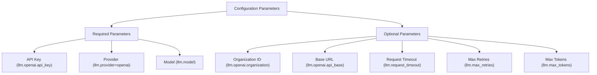
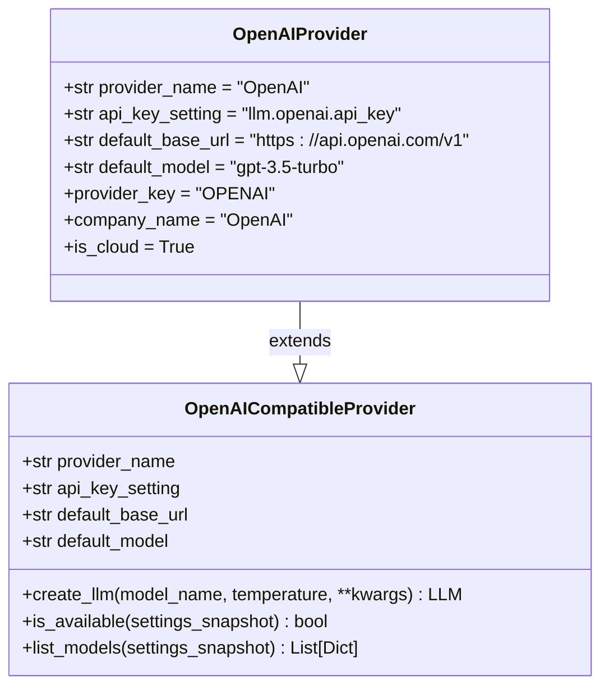
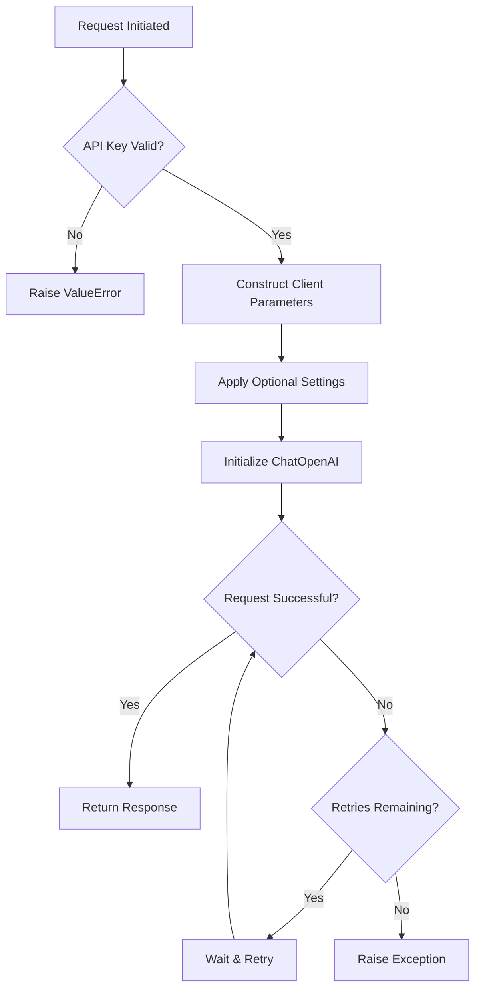
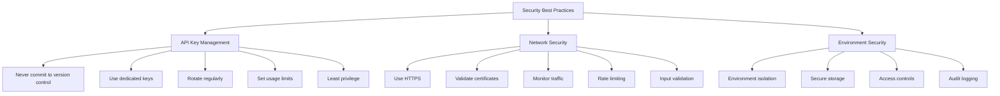

# OpenAI Configuration

<cite>
**Referenced Files in This Document**   
- [openai.py](file://src/local_deep_research/llm/providers/implementations/openai.py)
- [openai_base.py](file://src/local_deep_research/llm/providers/openai_base.py)
- [custom_openai_endpoint.py](file://src/local_deep_research/llm/providers/implementations/custom_openai_endpoint.py)
- [llm_config.py](file://src/local_deep_research/config/llm_config.py)
- [default_settings.json](file://src/local_deep_research/defaults/default_settings.json)
- [troubleshooting-openai-api-key.md](file://docs/troubleshooting-openai-api-key.md)
</cite>

## Table of Contents
1. [Introduction](#introduction)
2. [Configuration Parameters](#configuration-parameters)
3. [Authentication Setup](#authentication-setup)
4. [Implementation Details](#implementation-details)
5. [Advanced Configurations](#advanced-configurations)
6. [Security Best Practices](#security-best-practices)
7. [Troubleshooting](#troubleshooting)

## Introduction
This document provides comprehensive guidance on configuring OpenAI as a cloud LLM provider within the Local Deep Research application. It covers all aspects of configuration, from basic setup to advanced deployment scenarios, including authentication methods, implementation details, and security considerations. The OpenAI provider implementation follows a standardized pattern for cloud LLM providers, extending the base OpenAI-compatible provider class with specific configuration options for the official OpenAI API service.

**Section sources**
- [openai.py](file://src/local_deep_research/llm/providers/implementations/openai.py#L1-L218)

## Configuration Parameters
The OpenAI provider requires several configuration parameters to establish a connection and customize behavior. These parameters are organized into required and optional categories.

### Required Parameters
The following parameters are essential for establishing a connection to the OpenAI API:

- **API Key**: The primary authentication credential for accessing OpenAI services, stored in the setting `llm.openai.api_key`
- **Provider Selection**: The LLM provider must be set to "openai" via the `llm.provider` setting
- **Model Identifier**: The specific model to use, such as "gpt-3.5-turbo" or "gpt-4o", configured through `llm.model`

### Optional Parameters
Additional parameters provide fine-grained control over the OpenAI integration:

- **Organization ID**: For users with multiple OpenAI organizations, specified via `llm.openai.organization`
- **Base URL**: Custom endpoint URL for non-standard deployments, configured with `llm.openai.api_base`
- **Request Timeout**: Maximum time to wait for API responses, set through `llm.request_timeout`
- **Max Retries**: Number of retry attempts for failed requests, controlled by `llm.max_retries`
- **Max Tokens**: Limit on the number of tokens in model responses, configured via `llm.max_tokens`

The default model for the OpenAI provider is "gpt-3.5-turbo", with a default base URL of "https://api.openai.com/v1". These defaults can be overridden through configuration.



**Diagram sources **
- [openai.py](file://src/local_deep_research/llm/providers/implementations/openai.py#L34-L35)
- [llm_config.py](file://src/local_deep_research/config/llm_config.py#L555-L629)

**Section sources**
- [openai.py](file://src/local_deep_research/llm/providers/implementations/openai.py#L34-L35)
- [llm_config.py](file://src/local_deep_research/config/llm_config.py#L555-L629)
- [default_settings.json](file://src/local_deep_research/defaults/default_settings.json#L437-L465)

## Authentication Setup
Authentication for the OpenAI provider can be configured through multiple methods, providing flexibility for different deployment scenarios and security requirements.

### Environment Variables
The recommended method for production deployments is using environment variables, which keeps sensitive credentials out of configuration files:

```bash
export OPENAI_API_KEY=sk-your-api-key
export OPENAI_ORGANIZATION=org-your-org-id
python -m local_deep_research.web.app
```

When using environment variables, the application automatically maps `OPENAI_API_KEY` to the `llm.openai.api_key` setting and `OPENAI_ORGANIZATION` to `llm.openai.organization`. This approach follows the principle of least privilege and prevents accidental exposure of credentials in version control systems.

### JSON Configuration Files
For development and testing environments, authentication can be configured through JSON settings files. The default settings file includes the OpenAI API key field:

```json
{
  "llm.openai.api_key": {
    "category": "llm_general",
    "description": "API key to use for the OpenAI provider.",
    "editable": true,
    "max_value": null,
    "min_value": null,
    "name": "OpenAI API Key",
    "options": null,
    "step": null,
    "type": "SEARCH",
    "ui_element": "password",
    "value": "",
    "visible": true
  }
}
```

### Programmatic Configuration
For programmatic access and testing, settings can be configured directly through the application's settings manager:

```python
from local_deep_research.settings import CachedSettingsManager
from local_deep_research.database.session_context import get_user_db_session

with get_user_db_session(username="user", password="pass") as session:
    settings_manager = CachedSettingsManager(session, "user")
    settings_manager.set_setting("llm.provider", "openai")
    settings_manager.set_setting("llm.openai.api_key", "sk-your-api-key")
    settings_manager.set_setting("llm.openai.organization", "org-your-org-id")
```

**Section sources**
- [troubleshooting-openai-api-key.md](file://docs/troubleshooting-openai-api-key.md#L40-L55)
- [openai.py](file://src/local_deep_research/llm/providers/implementations/openai.py#L63-L74)
- [llm_config.py](file://src/local_deep_research/config/llm_config.py#L555-L565)

## Implementation Details
The OpenAI provider implementation follows a modular design pattern, extending the base OpenAI-compatible provider class with specific functionality for the official OpenAI API service.

### Class Hierarchy and Inheritance
The OpenAI provider class inherits from the `OpenAICompatibleProvider` base class, which provides common functionality for all OpenAI-compatible endpoints:



**Diagram sources **
- [openai_base.py](file://src/local_deep_research/llm/providers/openai_base.py#L25-L340)
- [openai.py](file://src/local_deep_research/llm/providers/implementations/openai.py#L26-L218)

### Provider Registration
The OpenAI provider is registered with the LLM registry through a factory pattern that enables dynamic provider discovery:

```python
def register_openai_provider():
    """Register the OpenAI provider with the LLM registry."""
    register_llm("openai", create_openai_llm)
    logger.info("Registered OpenAI LLM provider")
```

This registration mechanism allows the application to dynamically discover and load LLM providers at runtime, supporting extensibility without requiring code changes to the core application.

### Rate Limiting and Request Management
The implementation includes comprehensive error handling and request management features:

- **Automatic Retry Logic**: Configurable retry attempts through the `llm.max_retries` parameter
- **Request Timeout**: Configurable timeout duration via `llm.request_timeout`
- **Streaming Support**: Optional streaming of responses controlled by `llm.streaming`
- **Error Detection**: Built-in detection of rate limit errors (HTTP 429) and quota exhaustion

The request flow follows a standardized pattern:
1. Validate API key availability
2. Construct OpenAI client parameters from settings
3. Apply optional configuration (timeout, retries, streaming)
4. Initialize the ChatOpenAI instance
5. Wrap with think-tag removal functionality

**Section sources**
- [openai.py](file://src/local_deep_research/llm/providers/implementations/openai.py#L46-L161)
- [openai_base.py](file://src/local_deep_research/llm/providers/openai_base.py#L39-L146)
- [llm_config.py](file://src/local_deep_research/config/llm_config.py#L555-L637)

## Advanced Configurations
The OpenAI provider supports several advanced configuration scenarios for specialized deployment requirements.

### Azure OpenAI Deployments
For Azure-hosted OpenAI services, custom base URLs and deployment-specific configurations are supported:

```python
settings_manager.set_setting("llm.provider", "openai")
settings_manager.set_setting("llm.openai.api_key", "your-azure-key")
settings_manager.set_setting("llm.openai.api_base", "https://your-resource.openai.azure.com/")
settings_manager.set_setting("llm.model", "your-deployment-name")
```

This configuration routes requests to the Azure OpenAI endpoint while maintaining compatibility with the standard OpenAI API interface.

### Custom Base URLs
The provider supports custom base URLs for OpenAI-compatible endpoints, enabling integration with proxy services or alternative deployments:

```python
settings_manager.set_setting("llm.provider", "openai")
settings_manager.set_setting("llm.openai.api_key", "your-api-key")
settings_manager.set_setting("llm.openai.api_base", "https://your-endpoint.com/v1")
```

### Proxy Settings
While not directly configured in the OpenAI provider, proxy settings can be managed through the underlying HTTP client configuration. The application's security module provides safe request handling that can be extended to support proxy configurations.

### Request Retry Strategies
The implementation supports configurable retry strategies through the `llm.max_retries` parameter. When set, the OpenAI client automatically retries failed requests according to the specified policy. This is particularly useful for handling transient network issues and rate limiting scenarios.



**Diagram sources **
- [openai.py](file://src/local_deep_research/llm/providers/implementations/openai.py#L55-L161)
- [troubleshooting-openai-api-key.md](file://docs/troubleshooting-openai-api-key.md#L205-L220)

**Section sources**
- [troubleshooting-openai-api-key.md](file://docs/troubleshooting-openai-api-key.md#L205-L227)
- [custom_openai_endpoint.py](file://src/local_deep_research/llm/providers/implementations/custom_openai_endpoint.py#L25-L73)
- [openai.py](file://src/local_deep_research/llm/providers/implementations/openai.py#L87-L141)

## Security Best Practices
Proper security configuration is critical when working with cloud LLM providers and API credentials.

### API Key Management
Follow these best practices for API key security:

- **Never commit keys to version control**: Use environment variables or secure credential stores
- **Use dedicated API keys**: Create specific keys for different applications or environments
- **Rotate keys regularly**: Implement a key rotation policy to minimize exposure
- **Set usage limits**: Configure spending limits in the OpenAI dashboard to prevent unexpected charges
- **Restrict permissions**: Use the principle of least privilege when configuring API key permissions

### Network Security
When communicating with OpenAI endpoints, consider the following network security measures:

- **Use HTTPS**: All communications with OpenAI endpoints should use encrypted connections
- **Validate SSL certificates**: Ensure proper certificate validation is enabled
- **Monitor network traffic**: Implement logging and monitoring for API calls
- **Implement rate limiting**: Use application-level rate limiting to prevent abuse
- **Validate input data**: Sanitize all input data before sending to the LLM API

### Environment Security
The application provides several security features for protecting API credentials:

- **Environment variable isolation**: Sensitive settings are loaded from environment variables before database initialization
- **Secure storage**: API keys are stored in encrypted databases when persisted
- **Access controls**: Role-based access controls limit who can view or modify API keys
- **Audit logging**: All configuration changes are logged for security auditing



**Diagram sources **
- [troubleshooting-openai-api-key.md](file://docs/troubleshooting-openai-api-key.md#L245-L249)
- [env_settings.py](file://src/local_deep_research/settings/env_settings.py#L1-L348)
- [security.py](file://src/local_deep_research/security/safe_requests.py)

**Section sources**
- [troubleshooting-openai-api-key.md](file://docs/troubleshooting-openai-api-key.md#L245-L249)
- [env_settings.py](file://src/local_deep_research/settings/env_settings.py#L1-L348)
- [security.py](file://src/local_deep_research/security/safe_requests.py)

## Troubleshooting
Common issues with OpenAI configuration and their solutions.

### Common Issues
The most frequent configuration problems include:

- **Missing API key**: Ensure the `llm.openai.api_key` setting is configured
- **Invalid API key**: Verify the key format (starts with "sk-") and validity
- **Rate limit exceeded**: Check usage quotas and consider upgrading the subscription
- **Settings not persisting**: Ensure proper application shutdown and database permissions
- **API key not being used**: Verify the `llm.provider` is set to "openai"

### Diagnostic Tools
The application provides several tools for diagnosing configuration issues:

- **End-to-end test**: Run `test_openai_api_key_e2e.py` to verify the complete configuration
- **Simple API test**: Test LLM initialization and response generation
- **Full research test**: Validate end-to-end functionality with a complete research workflow
- **Log analysis**: Check application logs for OpenAI-related error messages

### Resolution Steps
Follow these steps to resolve common issues:

1. Verify API key format and validity
2. Check provider setting is correctly configured
3. Test connectivity to the OpenAI endpoint
4. Validate all required settings are present
5. Check for network connectivity issues
6. Review application logs for error details

**Section sources**
- [troubleshooting-openai-api-key.md](file://docs/troubleshooting-openai-api-key.md#L25-L160)
- [test_openai_api_key_e2e.py](file://tests/test_openai_api_key_e2e.py#L44-L83)
- [llm_config.py](file://src/local_deep_research/config/llm_config.py#L555-L565)