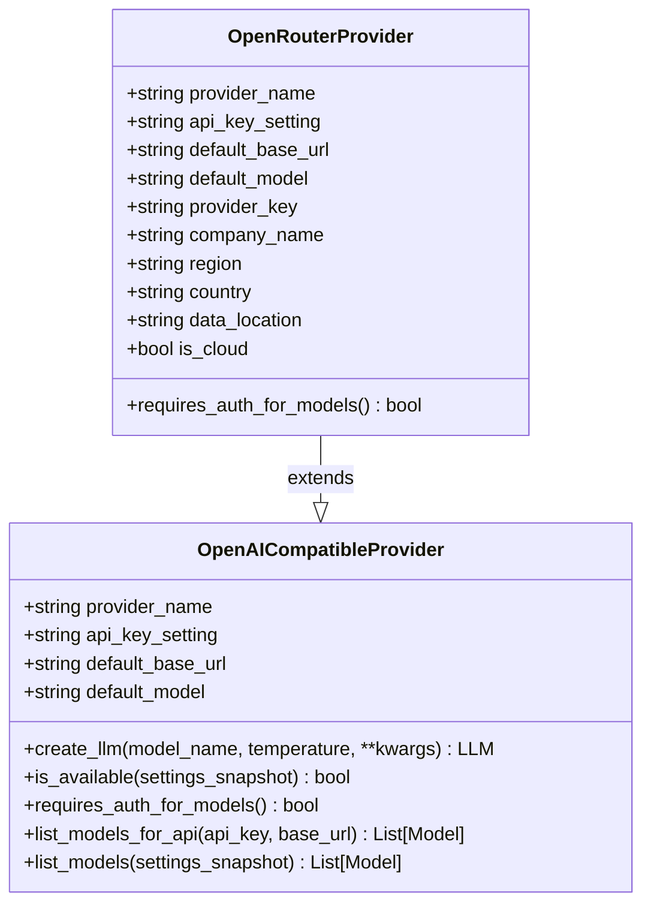
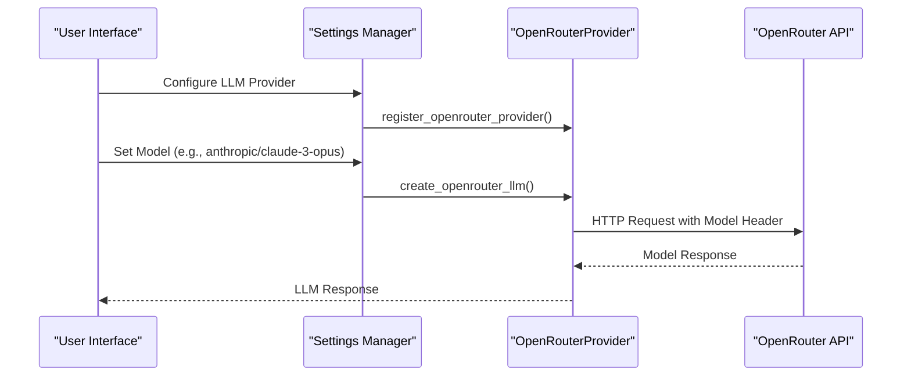

# OpenRouter Configuration

<cite>
**Referenced Files in This Document**   
- [openrouter.py](file://src/local_deep_research/llm/providers/implementations/openrouter.py)
- [openai_base.py](file://src/local_deep_research/llm/providers/openai_base.py)
- [openrouter_settings.json](file://src/local_deep_research/defaults/llm_providers/openrouter_settings.json)
- [env_configuration.md](file://docs/env_configuration.md)
- [faq.md](file://docs/faq.md)
- [cost_calculator.py](file://src/local_deep_research/metrics/pricing/cost_calculator.py)
- [pricing_fetcher.py](file://src/local_deep_research/metrics/pricing/pricing_fetcher.py)
</cite>

## Table of Contents
1. [Introduction](#introduction)
2. [Configuration Parameters](#configuration-parameters)
3. [Authentication Setup](#authentication-setup)
4. [OpenRouter Provider Implementation](#openrouter-provider-implementation)
5. [Provider-Specific Capabilities](#provider-specific-capabilities)
6. [Advanced Configuration](#advanced-configuration)
7. [Security Considerations](#security-considerations)
8. [Conclusion](#conclusion)

## Introduction
OpenRouter provides a unified API gateway to access over 100 different large language models from various providers through a single OpenAI-compatible interface. This documentation details the configuration process for integrating OpenRouter as a cloud LLM provider in the Local Deep Research system. The implementation leverages OpenRouter's API compatibility to maintain seamless integration while providing access to diverse model options from providers like OpenAI, Anthropic, Google, and Meta.

**Section sources**
- [openrouter.py](file://src/local_deep_research/llm/providers/implementations/openrouter.py#L1-L72)
- [env_configuration.md](file://docs/env_configuration.md#L90-L113)

## Configuration Parameters
The OpenRouter configuration requires several key parameters to establish a successful connection and enable model routing. The primary configuration elements include the API key, base URL, and model selection options.

The default base URL for OpenRouter is `https://openrouter.ai/api/v1`, which serves as the endpoint for all API requests. The system uses a free model `meta-llama/llama-3.2-3b-instruct:free` as the default when no specific model is specified. Users can override this default by specifying any available model through the configuration system.

Model names in OpenRouter follow a provider/model-name format (e.g., "openai/gpt-4", "anthropic/claude-3-opus"), enabling explicit routing to specific providers. The configuration system supports both environment variable setup and UI-based configuration, with the environment variable approach being recommended for Docker, CI/CD, and production deployments.

**Section sources**
- [openrouter.py](file://src/local_deep_research/llm/providers/implementations/openrouter.py#L19-L22)
- [env_configuration.md](file://docs/env_configuration.md#L108-L112)

## Authentication Setup
Authentication for OpenRouter can be configured through environment variables or configuration files. The system supports multiple methods for API key management, with environment variables being the recommended approach for security reasons.

For environment variable configuration, users should set the following variables:
- `LDR_LLM_PROVIDER=openai_endpoint`
- `LDR_LLM_OPENAI_ENDPOINT_URL=https://openrouter.ai/api/v1`
- `LDR_LLM_OPENAI_ENDPOINT_API_KEY=<your-api-key>`
- `LDR_LLM_MODEL=anthropic/claude-3.5-sonnet` (or any desired model)

Alternatively, users can configure OpenRouter through the web UI by navigating to Settings → LLM Provider, selecting "Custom OpenAI Endpoint", entering the OpenRouter URL and API key, and selecting the desired model from the dropdown menu. The API key is stored securely with password field protection in the configuration system.

**Section sources**
- [openrouter_settings.json](file://src/local_deep_research/defaults/llm_providers/openrouter_settings.json#L1-L16)
- [faq.md](file://docs/faq.md#L285-L315)

## OpenRouter Provider Implementation
The OpenRouter provider is implemented as an extension of the OpenAI base class, maintaining compatibility while adding OpenRouter-specific features. The implementation follows a class-based approach with the `OpenRouterProvider` class inheriting from `OpenAICompatibleProvider`.

The provider class defines metadata including provider name, API key setting path, default base URL, and default model. It also includes metadata for auto-discovery such as company name, region, and data location. The implementation includes a factory function `create_openrouter_llm` for backward compatibility and registration purposes.

The provider does not require authentication for listing available models, which enables dynamic model discovery without exposing API credentials. This feature allows the system to automatically populate the model selection dropdown with all available OpenRouter models.

**Diagram sources**
- [openrouter.py](file://src/local_deep_research/llm/providers/implementations/openrouter.py#L9-L72)
- [openai_base.py](file://src/local_deep_research/llm/providers/openai_base.py#L25-L340)

**Section sources**
- [openrouter.py](file://src/local_deep_research/llm/providers/implementations/openrouter.py#L9-L72)
- [openai_base.py](file://src/local_deep_research/llm/providers/openai_base.py#L25-L340)

## Provider-Specific Capabilities
OpenRouter offers several unique capabilities that enhance the flexibility and cost-effectiveness of LLM usage. The primary advantage is access to multiple model providers through a single unified interface, enabling seamless switching between models from different vendors.

The system supports usage-based pricing with automatic cost calculation for different models. Pricing data is maintained in the system and used to calculate costs based on prompt and completion tokens. The cost calculator component processes usage records and applies the appropriate pricing model for each LLM.

Model routing is implemented through the model name format, where the prefix indicates the provider (e.g., "openai/", "anthropic/", "google/"). This allows users to explicitly route requests to specific providers while maintaining a consistent API interface. The system automatically handles the routing based on the model name specified in the configuration.

**Diagram sources**
- [openrouter.py](file://src/local_deep_research/llm/providers/implementations/openrouter.py#L38-L72)
- [cost_calculator.py](file://src/local_deep_research/metrics/pricing/cost_calculator.py#L82-L192)

**Section sources**
- [pricing_fetcher.py](file://src/local_deep_research/metrics/pricing/pricing_fetcher.py#L39-L62)
- [cost_calculator.py](file://src/local_deep_research/metrics/pricing/cost_calculator.py#L82-L192)

## Advanced Configuration
Advanced configuration options for OpenRouter include custom headers for model selection and request optimization. The system supports setting specific models through the LLM_MODEL environment variable or configuration setting, allowing for precise control over which model processes requests.

For Docker deployments, the configuration can be specified in the docker-compose.yml file with environment variables. This approach is particularly useful for CI/CD pipelines and production deployments where consistent configuration is required across environments.

The system also supports fallback mechanisms when specific models are not available. If the configured model cannot be found, the system can automatically fall back to alternative models or use predefined fallback options to ensure service continuity.

**Section sources**
- [faq.md](file://docs/faq.md#L304-L313)
- [env_configuration.md](file://docs/env_configuration.md#L106-L112)

## Security Considerations
Security considerations for OpenRouter configuration focus on API key management and data privacy. The system implements several safeguards to protect sensitive credentials and ensure secure communication with the OpenRouter service.

API keys are treated as sensitive data and are redacted in logs and error messages. The data sanitizer component automatically replaces API key values with "[REDACTED]" text when processing data for logging or debugging purposes. This prevents accidental exposure of credentials in system logs or error reports.

The system follows the principle of least privilege by only requiring the API key for authentication, without storing additional sensitive information. Environment variables are recommended for API key storage as they provide better isolation compared to configuration files, especially in containerized environments.

When using OpenRouter's proxy service, users should be aware that their requests are routed through OpenRouter's infrastructure. While this provides the benefit of unified access to multiple models, it also means that request data passes through an intermediary service. Users handling sensitive or confidential information should evaluate this aspect based on their specific security requirements.

**Section sources**
- [test_data_sanitizer.py](file://tests/security/test_data_sanitizer.py#L153-L182)
- [test_api_security.py](file://tests/security/test_api_security.py#L389-L421)

## Conclusion
Configuring OpenRouter as a cloud LLM provider offers significant advantages in terms of model diversity and implementation simplicity. By leveraging the OpenAI-compatible API, the system maintains compatibility while providing access to a wide range of models from different providers. The configuration process is straightforward, supporting both environment variable and UI-based setup methods. Security is prioritized through proper API key management and data sanitization practices. The implementation effectively balances flexibility, security, and ease of use, making OpenRouter a powerful option for users seeking access to multiple LLM providers through a single interface.