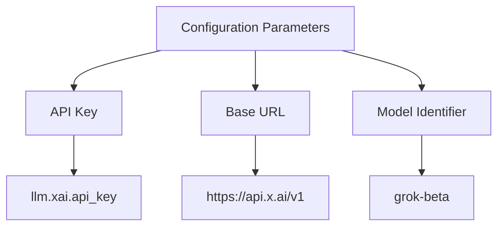
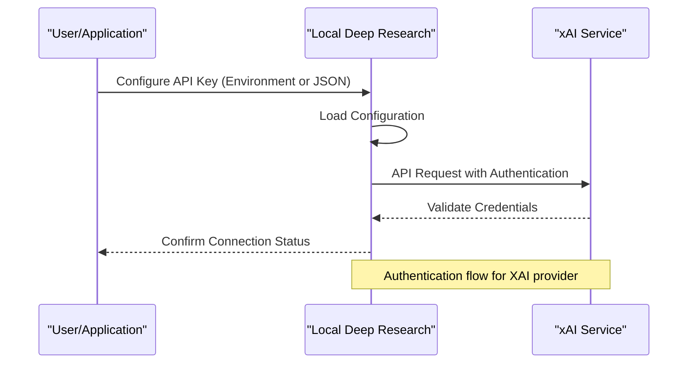
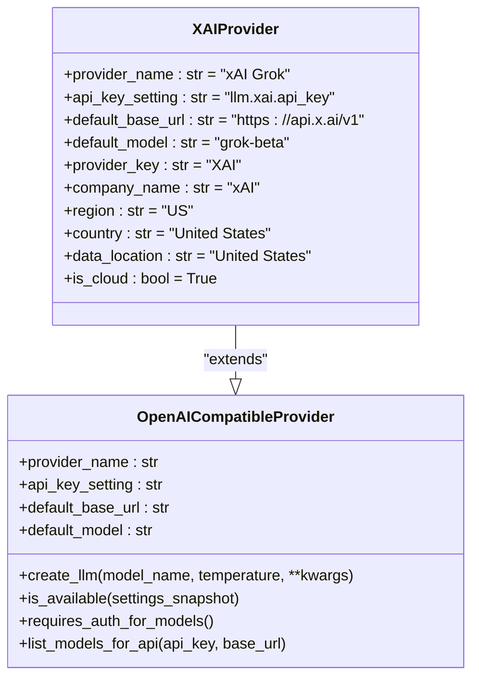
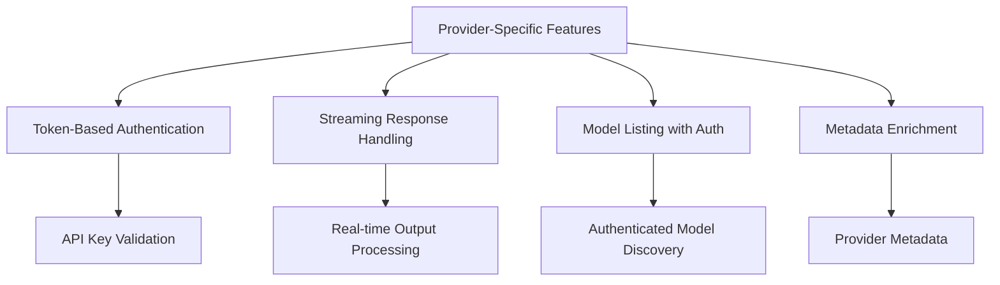
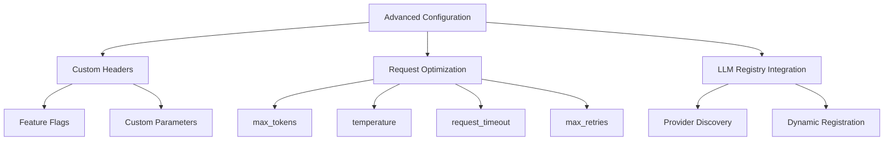
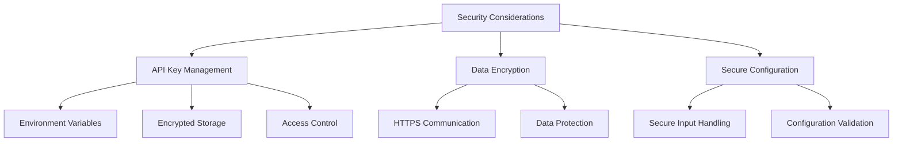

# XAI Configuration

<cite>
**Referenced Files in This Document**   
- [xai.py](file://src/local_deep_research/llm/providers/implementations/xai.py)
- [xai_settings.json](file://src/local_deep_research/defaults/llm_providers/xai_settings.json)
- [openai_base.py](file://src/local_deep_research/llm/providers/openai_base.py)
- [llm_registry.py](file://src/local_deep_research/llm/llm_registry.py)
- [thread_settings.py](file://src/local_deep_research/config/thread_settings.py)
</cite>

## Table of Contents
1. [Introduction](#introduction)
2. [Configuration Parameters](#configuration-parameters)
3. [Authentication Setup](#authentication-setup)
4. [XAI Provider Implementation](#xai-provider-implementation)
5. [Provider-Specific Features](#provider-specific-features)
6. [Advanced Configuration](#advanced-configuration)
7. [Security Considerations](#security-considerations)

## Introduction
This document provides comprehensive guidance for configuring XAI as a cloud LLM provider within the Local Deep Research system. It covers the necessary configuration parameters, authentication methods, implementation details, and security considerations for integrating with XAI's Grok models through their OpenAI-compatible API endpoint.

**Section sources**
- [xai.py](file://src/local_deep_research/llm/providers/implementations/xai.py#L1-L81)
- [xai_settings.json](file://src/local_deep_research/defaults/llm_providers/xai_settings.json#L1-L16)

## Configuration Parameters
The XAI provider requires specific configuration parameters to establish a connection to the Grok models. These parameters include the API key, base URL, and model identifiers.

The primary configuration parameter is the API key, which is required for authentication with the XAI service. The default base URL for the XAI API is `https://api.x.ai/v1`, which provides access to the OpenAI-compatible endpoint. The default model is set to "grok-beta", though other available models can be specified.

**Diagram sources**
- [xai.py](file://src/local_deep_research/llm/providers/implementations/xai.py#L15-L18)
- [xai_settings.json](file://src/local_deep_research/defaults/llm_providers/xai_settings.json#L2-L15)

**Section sources**
- [xai.py](file://src/local_deep_research/llm/providers/implementations/xai.py#L15-L18)
- [xai_settings.json](file://src/local_deep_research/defaults/llm_providers/xai_settings.json#L2-L15)

## Authentication Setup
Authentication for the XAI provider can be configured through environment variables or JSON configuration files. The system supports both methods to accommodate different deployment scenarios and security requirements.

The primary authentication method uses the `XAI_API_KEY` environment variable, which should contain the valid API key for accessing the XAI service. Alternatively, the API key can be stored in a JSON configuration file following the structure defined in the system's settings schema.

**Diagram sources**
- [xai.py](file://src/local_deep_research/llm/providers/implementations/xai.py#L16)
- [xai_settings.json](file://src/local_deep_research/defaults/llm_providers/xai_settings.json#L2-L15)
- [thread_settings.py](file://src/local_deep_research/config/thread_settings.py#L35-L127)

**Section sources**
- [xai.py](file://src/local_deep_research/llm/providers/implementations/xai.py#L16)
- [xai_settings.json](file://src/local_deep_research/defaults/llm_providers/xai_settings.json#L2-L15)
- [thread_settings.py](file://src/local_deep_research/config/thread_settings.py#L35-L127)

## XAI Provider Implementation
The XAI provider is implemented as a specialized class that extends the base OpenAI-compatible provider. This implementation leverages the existing infrastructure for OpenAI-compatible endpoints while adding XAI-specific configurations and metadata.

The `XAIProvider` class inherits from `OpenAICompatibleProvider` and overrides specific attributes to configure the connection parameters for the XAI service. The implementation includes metadata about the provider, such as the company name (xAI), region (US), and data location (United States), which is used for provider discovery and selection.

**Diagram sources**
- [xai.py](file://src/local_deep_research/llm/providers/implementations/xai.py#L9-L27)
- [openai_base.py](file://src/local_deep_research/llm/providers/openai_base.py#L25-L38)

**Section sources**
- [xai.py](file://src/local_deep_research/llm/providers/implementations/xai.py#L9-L27)
- [openai_base.py](file://src/local_deep_research/llm/providers/openai_base.py#L25-L38)

## Provider-Specific Features
The XAI provider implementation includes several provider-specific features that enhance the integration with the XAI service. These features include token-based authentication, streaming response handling, and model listing capabilities.

One key feature is the requirement for authentication when listing available models. Unlike some providers that allow unauthenticated access to model listings, XAI requires a valid API key to retrieve the list of available models. This is implemented through the `requires_auth_for_models()` method which returns `True`, and the `list_models_for_api()` method which validates the API key before making the request.

The implementation also supports streaming responses, which can be configured through the system settings. This allows for real-time processing of model outputs as they are generated, improving the user experience for interactive applications.

**Diagram sources**
- [xai.py](file://src/local_deep_research/llm/providers/implementations/xai.py#L28-L44)
- [openai_base.py](file://src/local_deep_research/llm/providers/openai_base.py#L214-L308)

**Section sources**
- [xai.py](file://src/local_deep_research/llm/providers/implementations/xai.py#L28-L44)
- [openai_base.py](file://src/local_deep_research/llm/providers/openai_base.py#L214-L308)

## Advanced Configuration
The XAI provider supports advanced configuration options that allow for customization of the request parameters and behavior. These options include custom headers for feature flags, request optimization parameters, and integration with the system's LLM registry.

Custom headers can be added to requests to enable specific features or behaviors in the XAI service. Request optimization parameters such as max_tokens, temperature, and request_timeout can be configured through the system settings to fine-tune the model's behavior and performance characteristics.

The provider is automatically registered with the LLM registry through the `register_xai_provider()` function, which makes it available for use throughout the system. This registration process ensures that the XAI provider can be discovered and selected by the system's provider discovery mechanism.

**Diagram sources**
- [xai.py](file://src/local_deep_research/llm/providers/implementations/xai.py#L48-L80)
- [openai_base.py](file://src/local_deep_research/llm/providers/openai_base.py#L84-L137)
- [llm_registry.py](file://src/local_deep_research/llm/llm_registry.py#L102-L162)

**Section sources**
- [xai.py](file://src/local_deep_research/llm/providers/implementations/xai.py#L48-L80)
- [openai_base.py](file://src/local_deep_research/llm/providers/openai_base.py#L84-L137)
- [llm_registry.py](file://src/local_deep_research/llm/llm_registry.py#L102-L162)

## Security Considerations
When using XAI services, several security considerations must be addressed to protect sensitive information and ensure secure communication. These considerations include API key management, data encryption, and secure configuration practices.

API key management is critical for maintaining the security of the XAI integration. The API key should be treated as a secret and protected accordingly. The system uses environment variables and encrypted storage to prevent unauthorized access to the API key. The configuration schema specifies the API key field as a password-type input, ensuring it is masked in user interfaces.

Data encryption is required for all communications with the XAI service, which uses HTTPS for secure transmission. The system should also implement appropriate data handling practices to protect any sensitive information processed through the LLM.

**Diagram sources**
- [xai_settings.json](file://src/local_deep_research/defaults/llm_providers/xai_settings.json#L12)
- [xai.py](file://src/local_deep_research/llm/providers/implementations/xai.py#L16)
- [openai_base.py](file://src/local_deep_research/llm/providers/openai_base.py#L56-L71)

**Section sources**
- [xai_settings.json](file://src/local_deep_research/defaults/llm_providers/xai_settings.json#L12)
- [xai.py](file://src/local_deep_research/llm/providers/implementations/xai.py#L16)
- [openai_base.py](file://src/local_deep_research/llm/providers/openai_base.py#L56-L71)