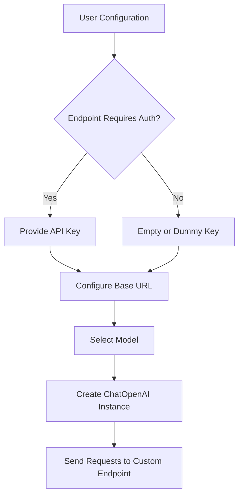
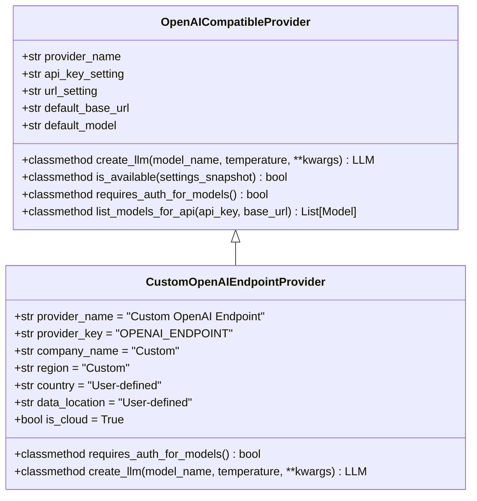
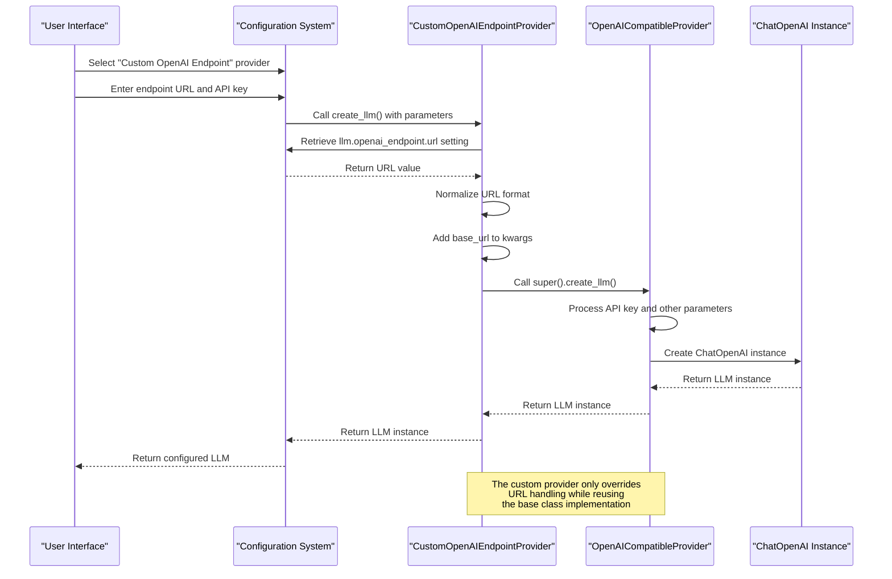
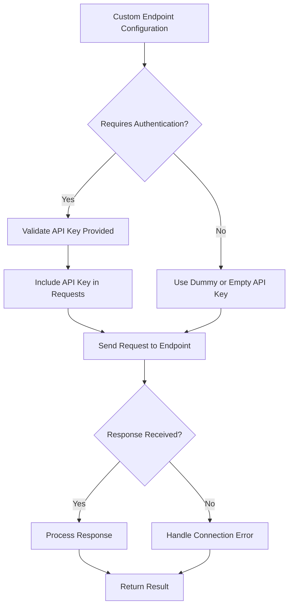

# Custom LLM Endpoints

<cite>
**Referenced Files in This Document**   
- [custom_openai_endpoint.py](file://src/local_deep_research/llm/providers/implementations/custom_openai_endpoint.py)
- [openai_base.py](file://src/local_deep_research/llm/providers/openai_base.py)
- [llm_config.py](file://src/local_deep_research/config/llm_config.py)
- [default_settings.json](file://src/local_deep_research/defaults/default_settings.json)
- [CUSTOM_LLM_INTEGRATION.md](file://docs/CUSTOM_LLM_INTEGRATION.md)
- [env_configuration.md](file://docs/env_configuration.md)
- [test_custom_openai_endpoint.py](file://tests/llm_providers/test_custom_openai_endpoint.py)
</cite>

## Table of Contents
1. [Introduction](#introduction)
2. [Configuration Parameters](#configuration-parameters)
3. [Implementation Details](#implementation-details)
4. [Integration with Popular LLM Platforms](#integration-with-popular-llm-platforms)
5. [Security Considerations](#security-considerations)
6. [Advanced Configuration](#advanced-configuration)
7. [Troubleshooting](#troubleshooting)
8. [References](#references)

## Introduction

The Local Deep Research system supports integration with custom OpenAI-compatible LLM endpoints, enabling users to connect to self-hosted or third-party language model services that implement the OpenAI API specification. This functionality is implemented through the `CustomOpenAIEndpointProvider` class, which extends the base `OpenAICompatibleProvider` to support arbitrary endpoints while maintaining compatibility with the existing LLM provider interface.

The custom endpoint feature allows researchers and developers to leverage various open-source LLM platforms such as LocalAI, vLLM, Text Generation Inference, LM Studio, and Ollama, as well as commercial services like OpenRouter. This flexibility enables users to choose the most appropriate model for their specific research needs, whether that's a specialized domain model, a privacy-focused local deployment, or a high-performance cloud service.

The implementation follows a provider-based architecture where the custom OpenAI endpoint is registered as a distinct provider option alongside built-in providers like OpenAI, Anthropic, and Google. When selected, the system routes LLM requests to the specified custom endpoint while maintaining the same interface and functionality as other providers.

**Section sources**
- [custom_openai_endpoint.py](file://src/local_deep_research/llm/providers/implementations/custom_openai_endpoint.py#L1-L112)
- [CUSTOM_LLM_INTEGRATION.md](file://docs/CUSTOM_LLM_INTEGRATION.md#L1-L276)

## Configuration Parameters

### Base URL Configuration

The primary configuration parameter for custom OpenAI endpoints is the base URL, which specifies the location of the OpenAI-compatible API. This is configured through the `llm.openai_endpoint.url` setting, with a default value of `https://openrouter.ai/api/v1`. The URL can point to various types of endpoints:

- **Local development servers**: `http://localhost:8000/v1` or `http://127.0.0.1:11434/v1`
- **Docker container networks**: `http://172.19.0.5:8000/v1`
- **Private network deployments**: `http://10.0.0.100:8000/v1` or `http://192.168.1.100:11434/v1`
- **Remote cloud instances**: `https://your-llm-service.com/v1`

The system automatically normalizes the URL format, ensuring proper handling regardless of whether the `/v1` path suffix is included in the configuration.

### API Key Management

API authentication is managed through the `llm.openai_endpoint.api_key` setting. The implementation includes special handling for endpoints that may not require authentication:

- **Authenticated endpoints**: Provide a valid API key in the configuration
- **Unauthenticated endpoints**: Leave the API key field empty or use a dummy value

The system distinguishes between these cases through the `requires_auth_for_models()` method, which returns `False` to accommodate self-hosted servers like vLLM and Ollama that often don't require authentication for model listing.

### Model Name Mapping

Model selection is handled through the standard model configuration system. When using a custom endpoint, users can select from available models either through:

1. **Automatic discovery**: The system queries the endpoint's `/models` endpoint to retrieve available models
2. **Manual specification**: Users can directly specify any model name supported by the endpoint

The model name is passed to the underlying `ChatOpenAI` instance, which forwards it to the custom endpoint for processing.



**Diagram sources**
- [custom_openai_endpoint.py](file://src/local_deep_research/llm/providers/implementations/custom_openai_endpoint.py#L34-L35)
- [openai_base.py](file://src/local_deep_research/llm/providers/openai_base.py#L35-L37)

**Section sources**
- [custom_openai_endpoint.py](file://src/local_deep_research/llm/providers/implementations/custom_openai_endpoint.py#L34-L74)
- [default_settings.json](file://src/local_deep_research/defaults/default_settings.json#L437-L450)
- [llm_config.py](file://src/local_deep_research/config/llm_config.py#L638-L670)

## Implementation Details

### Provider Architecture

The custom OpenAI endpoint functionality is implemented as a provider class that extends the `OpenAICompatibleProvider` base class. This architecture enables consistent behavior across different LLM providers while allowing for endpoint-specific customization.



**Diagram sources**
- [custom_openai_endpoint.py](file://src/local_deep_research/llm/providers/implementations/custom_openai_endpoint.py#L25-L74)
- [openai_base.py](file://src/local_deep_research/llm/providers/openai_base.py#L25-L37)

### Request Flow

The implementation follows a specific request flow when creating LLM instances for custom endpoints:

1. **Configuration Retrieval**: The system retrieves the custom endpoint URL from settings using the `get_setting_from_snapshot` function
2. **URL Normalization**: The URL is normalized to ensure consistent formatting
3. **Parameter Injection**: The normalized URL is injected into the kwargs dictionary as the `base_url` parameter
4. **Parent Method Invocation**: The method calls the parent class's `create_llm` method with the modified parameters
5. **LLM Instance Creation**: The parent method creates a `ChatOpenAI` instance configured with the custom endpoint

This approach leverages the existing OpenAI-compatible provider infrastructure while adding the flexibility to specify custom endpoints.



**Diagram sources**
- [custom_openai_endpoint.py](file://src/local_deep_research/llm/providers/implementations/custom_openai_endpoint.py#L57-L74)
- [openai_base.py](file://src/local_deep_research/llm/providers/openai_base.py#L40-L146)

### Model Discovery

The system implements a robust model discovery mechanism that can list available models from the custom endpoint. This functionality is critical for user interfaces that need to present available model options.

The `list_models_for_api` method accepts direct parameters for `api_key` and `base_url`, enabling integration with the settings interface without requiring access to the full settings infrastructure. This design choice was made to prevent regression issues that occurred in previous versions.

Key features of the model discovery implementation:
- **Direct parameter access**: Accepts `api_key` and `base_url` as direct parameters
- **Authentication flexibility**: Returns a dummy API key for endpoints that don't require authentication
- **Error resilience**: Returns empty lists on connection failures rather than raising exceptions
- **Private IP support**: Properly handles private IP addresses commonly used in Docker and local deployments

**Section sources**
- [custom_openai_endpoint.py](file://src/local_deep_research/llm/providers/implementations/custom_openai_endpoint.py#L47-L55)
- [openai_base.py](file://src/local_deep_research/llm/providers/openai_base.py#L250-L309)
- [test_custom_openai_endpoint.py](file://tests/llm_providers/test_custom_openai_endpoint.py#L74-L149)

## Integration with Popular LLM Platforms

### LocalAI Integration

LocalAI provides a drop-in replacement for the OpenAI API that can run locally with various open-source models. To integrate with LocalAI:

1. **Configuration**:
   - Base URL: `http://localhost:8080/v1` (or your LocalAI server address)
   - API Key: Optional (can be left empty)
   - Model: Any model loaded in your LocalAI instance

2. **Environment Variables**:
```bash
export LDR_LLM_PROVIDER=openai_endpoint
export LDR_LLM_OPENAI_ENDPOINT_URL=http://localhost:8080/v1
export LDR_LLM_MODEL=ggml-gpt4all-j
```

3. **Special Considerations**:
   - Ensure LocalAI is running and accessible from the Local Deep Research application
   - Model names must match those configured in LocalAI
   - Some LocalAI configurations may require API key authentication

### vLLM Integration

vLLM is a high-throughput and memory-efficient inference engine for LLMs. The integration process:

1. **Prerequisites**:
   - vLLM must be installed and running
   - The target model must be available to vLLM

2. **Configuration**:
   - Base URL: `http://localhost:8000/v1` (default vLLM server)
   - API Key: Not required for most vLLM deployments
   - Model: The model name as registered with vLLM

3. **Example Configuration**:
```python
# In settings or environment variables
llm_provider = "openai_endpoint"
llm_openai_endpoint_url = "http://localhost:8000/v1"
llm_model = "meta-llama/Llama-2-7b-chat-hf"
```

4. **Performance Notes**:
   - vLLM provides excellent throughput and low latency
   - The PagedAttention technology enables efficient memory usage
   - Multiple concurrent requests are handled efficiently

### Text Generation Inference (TGI) Integration

Text Generation Inference is a Rust, Python, and gRPC server developed by Hugging Face for text generation. Integration steps:

1. **Server Setup**:
   - Deploy TGI server with your desired model
   - Ensure the server is accessible from the Local Deep Research application

2. **Configuration Parameters**:
   - Base URL: `http://tgi-server:8080` (adjust for your deployment)
   - API Key: Required if authentication is enabled on TGI
   - Model: Must match the model loaded in TGI

3. **Advanced Configuration**:
   - TGI supports various generation parameters that can be passed through
   - The system automatically handles TGI's OpenAI-compatible API endpoints
   - Streaming responses are supported if enabled in TGI

4. **Example Use Case**:
```yaml
# docker-compose.yml snippet
services:
  local-deep-research:
    environment:
      - LDR_LLM_PROVIDER=openai_endpoint
      - LDR_LLM_OPENAI_ENDPOINT_URL=http://tgi:8080
      - LDR_LLM_MODEL=bigscience/bloom
```

### LM Studio and Ollama Integration

Both LM Studio and Ollama provide user-friendly interfaces for running local LLMs with OpenAI-compatible APIs.

**LM Studio Configuration**:
- Base URL: `http://localhost:1234/v1` (default LM Studio port)
- API Key: Not required
- Model: Selected model in LM Studio interface

**Ollama Configuration**:
- Base URL: `http://localhost:11434/v1` (default Ollama port)
- API Key: Not required
- Model: Name of the Ollama model (e.g., `llama3`, `mistral`)

Both platforms automatically expose an OpenAI-compatible API, making integration straightforward. The system detects these services through their model listing endpoints and presents available models to the user.

**Section sources**
- [CUSTOM_LLM_INTEGRATION.md](file://docs/CUSTOM_LLM_INTEGRATION.md#L1-L276)
- [env_configuration.md](file://docs/env_configuration.md#L89-L142)
- [default_settings.json](file://src/local_deep_research/defaults/default_settings.json#L508-L510)

## Security Considerations

### Endpoint Validation

The system implements several security measures when connecting to custom endpoints:

1. **URL Validation**: All endpoint URLs are normalized and validated for proper format
2. **Private Network Access**: The system explicitly supports private IP addresses (10.x, 172.16-31.x, 192.168.x) commonly used in local and Docker deployments
3. **Connection Security**: HTTP and HTTPS endpoints are both supported, with HTTPS recommended for production use

The implementation includes specific tests to ensure that private IP addresses and localhost connections work correctly, addressing previous regression issues.

### Authentication Handling

Authentication is managed with flexibility to accommodate different endpoint requirements:

1. **Optional Authentication**: The `requires_auth_for_models()` method returns `False`, allowing model listing without authentication
2. **API Key Security**: API keys are stored securely in the application settings
3. **Environment Variable Support**: API keys can be provided through environment variables for enhanced security



**Diagram sources**
- [custom_openai_endpoint.py](file://src/local_deep_research/llm/providers/implementations/custom_openai_endpoint.py#L47-L55)
- [openai_base.py](file://src/local_deep_research/llm/providers/openai_base.py#L263-L273)

### Certificate Verification

For HTTPS endpoints, the system relies on the underlying `openai` library's certificate verification:

1. **Default Behavior**: Standard certificate verification is performed
2. **Custom CA Support**: Can be configured through environment variables or system settings
3. **Insecure Connections**: HTTP endpoints are supported for local development but discouraged for production

When deploying in enterprise environments with custom certificate authorities, users may need to configure their system's certificate store or use environment variables to specify custom CA bundles.

### Proxy Configuration

The system inherits proxy configuration from the underlying HTTP client libraries:

1. **Environment Variables**: Respects standard proxy environment variables (`HTTP_PROXY`, `HTTPS_PROXY`, `NO_PROXY`)
2. **System Configuration**: Uses system-wide proxy settings when available
3. **Direct Connections**: Can bypass proxies for private network endpoints

For enterprise deployments behind firewalls, ensure that the necessary endpoints are accessible and that proxy settings are correctly configured in the environment.

**Section sources**
- [custom_openai_endpoint.py](file://src/local_deep_research/llm/providers/implementations/custom_openai_endpoint.py#L47-L55)
- [openai_base.py](file://src/local_deep_research/llm/providers/openai_base.py#L263-L309)
- [test_custom_openai_endpoint.py](file://tests/llm_providers/test_custom_openai_endpoint.py#L74-L149)

## Advanced Configuration

### Environment Variable Configuration

Custom OpenAI endpoints can be fully configured using environment variables, which is particularly useful for Docker deployments and CI/CD pipelines.

**Basic Configuration**:
```bash
# Set the provider to custom OpenAI endpoint
export LDR_LLM_PROVIDER=openai_endpoint

# Set the custom endpoint URL
export LDR_LLM_OPENAI_ENDPOINT_URL=https://your-llm-service.com/v1

# Set the API key (optional for some endpoints)
export LDR_LLM_OPENAI_ENDPOINT_API_KEY=your-api-key

# Set the default model
export LDR_LLM_MODEL=your-model-name
```

**Docker Compose Example**:
```yaml
version: '3'
services:
  local-deep-research:
    image: local-deep-research:latest
    ports:
      - "5000:5000"
    environment:
      - LDR_LLM_PROVIDER=openai_endpoint
      - LDR_LLM_OPENAI_ENDPOINT_URL=http://vllm-server:8000/v1
      - LDR_LLM_MODEL=meta-llama/Llama-2-7b-chat-hf
      - LDR_LLM_TEMPERATURE=0.7
    depends_on:
      - vllm-server

  vllm-server:
    image: vllm/vllm-openai:latest
    command:
      - --model=meta-llama/Llama-2-7b-chat-hf
      - --host=0.0.0.0
      - --port=8000
    ports:
      - "8000:8000"
```

### Programmatic Configuration

For advanced use cases, the custom endpoint can be configured programmatically through the API:

```python
from local_deep_research.api import quick_summary
from local_deep_research.llm.providers.implementations.custom_openai_endpoint import CustomOpenAIEndpointProvider

# Create a custom LLM instance
custom_llm = CustomOpenAIEndpointProvider.create_llm(
    model_name="custom-model",
    temperature=0.7,
    base_url="https://your-endpoint.com/v1",
    api_key="your-api-key"
)

# Use in research functions
result = quick_summary(
    query="Your research question",
    llms={"custom": custom_llm},
    provider="custom"
)
```

### Multiple Endpoint Configuration

The system supports configuring multiple custom endpoints simultaneously:

1. **Registry Pattern**: Each custom endpoint can be registered with a unique name
2. **Provider Selection**: Users can switch between different endpoints
3. **Context-Aware Routing**: Different research tasks can use different endpoints

This enables sophisticated use cases such as:
- Using different models for different research domains
- Implementing fallback strategies when primary endpoints are unavailable
- Conducting comparative analysis across multiple models

### Performance Optimization

Several configuration options can optimize performance when using custom endpoints:

1. **Connection Pooling**: The underlying `openai` library manages connection pooling automatically
2. **Request Timeout**: Configure appropriate timeouts for your network conditions
3. **Retry Logic**: Implement retry strategies for unreliable endpoints
4. **Caching**: Leverage response caching when appropriate for your use case

The system automatically handles many performance aspects, but users can fine-tune settings like `max_retries` and `request_timeout` through the configuration system.

**Section sources**
- [env_configuration.md](file://docs/env_configuration.md#L104-L126)
- [default_settings.json](file://src/local_deep_research/defaults/default_settings.json#L437-L450)
- [llm_config.py](file://src/local_deep_research/config/llm_config.py#L638-L670)

## Troubleshooting

### Common Issues and Solutions

**Issue**: "Invalid provider" error when using custom endpoint
- **Cause**: The custom endpoint provider is not properly registered
- **Solution**: Ensure the provider is registered by checking the available providers list
- **Verification**: Look for "Custom OpenAI Endpoint" in the provider selection dropdown

**Issue**: Connection timeout to custom endpoint
- **Cause**: Network connectivity issues or incorrect URL
- **Solution**: 
  1. Verify the endpoint URL is correct
  2. Check that the target service is running
  3. Test connectivity using tools like curl or Postman
  4. Ensure firewall rules allow the connection

**Issue**: Model not found errors
- **Cause**: The specified model is not available on the endpoint
- **Solution**:
  1. Use the model discovery feature to list available models
  2. Verify the model name matches exactly (case-sensitive)
  3. Check that the model is properly loaded on the target service

**Issue**: Authentication failures
- **Cause**: Incorrect or missing API key
- **Solution**:
  1. Verify the API key is correctly configured
  2. Check if the endpoint actually requires authentication
  3. For endpoints that don't require auth, try leaving the API key field empty

### Diagnostic Steps

When troubleshooting custom endpoint issues, follow these diagnostic steps:

1. **Verify Configuration**: Double-check all configuration parameters (URL, API key, model name)
2. **Test Endpoint Directly**: Use curl or a REST client to test the endpoint independently
```bash
curl http://your-endpoint/v1/models -H "Authorization: Bearer your-api-key"
```
3. **Check Logs**: Examine application logs for detailed error messages
4. **Network Connectivity**: Verify network connectivity between the application and endpoint
5. **Firewall Rules**: Ensure no firewall rules are blocking the connection

### Validation of Response Formats

The system includes built-in validation to ensure response formats from custom endpoints are compatible:

1. **Standard Response Structure**: Validates that responses follow the OpenAI API format
2. **Error Handling**: Properly handles and reports API errors from the endpoint
3. **Content Extraction**: Ensures response content can be properly extracted and processed

If response format issues occur, verify that the custom endpoint fully implements the OpenAI API specification, particularly the chat completion endpoints.

**Section sources**
- [CUSTOM_LLM_INTEGRATION.md](file://docs/CUSTOM_LLM_INTEGRATION.md#L251-L270)
- [test_custom_openai_endpoint.py](file://tests/llm_providers/test_custom_openai_endpoint.py#L74-L149)
- [openai_base.py](file://src/local_deep_research/llm/providers/openai_base.py#L302-L308)

## References

For comprehensive setup instructions and additional details, refer to the following documentation:

- [CUSTOM_LLM_INTEGRATION.md](file://docs/CUSTOM_LLM_INTEGRATION.md): Complete guide to custom LLM integration
- [env_configuration.md](file://docs/env_configuration.md): Environment variable configuration guide
- [default_settings.json](file://src/local_deep_research/defaults/default_settings.json): Default configuration settings
- [openai_base.py](file://src/local_deep_research/llm/providers/openai_base.py): Base implementation for OpenAI-compatible providers
- [custom_openai_endpoint.py](file://src/local_deep_research/llm/providers/implementations/custom_openai_endpoint.py): Custom endpoint provider implementation

These resources provide detailed information on configuration options, implementation details, and best practices for integrating with custom OpenAI-compatible LLM endpoints.

**Section sources**
- [CUSTOM_LLM_INTEGRATION.md](file://docs/CUSTOM_LLM_INTEGRATION.md#L271-L276)
- [env_configuration.md](file://docs/env_configuration.md#L1-L202)