# LLM Provider Setup

<cite>
**Referenced Files in This Document**   
- [llm_config.py](file://src/local_deep_research/config/llm_config.py)
- [llm_registry.py](file://src/local_deep_research/llm/llm_registry.py)
- [auto_discovery.py](file://src/local_deep_research/llm/providers/auto_discovery.py)
- [openai.py](file://src/local_deep_research/llm/providers/implementations/openai.py)
- [anthropic.py](file://src/local_deep_research/llm/providers/implementations/anthropic.py)
- [google.py](file://src/local_deep_research/llm/providers/implementations/google.py)
- [ollama.py](file://src/local_deep_research/llm/providers/implementations/ollama.py)
- [openrouter_settings.json](file://src/local_deep_research/defaults/llm_providers/openrouter_settings.json)
- [google_settings.json](file://src/local_deep_research/defaults/llm_providers/google_settings.json)
- [ionos_settings.json](file://src/local_deep_research/defaults/llm_providers/ionos_settings.json)
- [xai_settings.json](file://src/local_deep_research/defaults/llm_providers/xai_settings.json)
</cite>

## Table of Contents
1. [Introduction](#introduction)
2. [LLM Configuration Overview](#llm-configuration-overview)
3. [Cloud Provider Setup](#cloud-provider-setup)
4. [Local Model Configuration](#local-model-configuration)
5. [Custom Endpoint Integration](#custom-endpoint-integration)
6. [LLM Registry System](#llm-registry-system)
7. [Advanced Configuration Options](#advanced-configuration-options)
8. [Security Best Practices](#security-best-practices)
9. [Performance Tuning](#performance-tuning)
10. [Extending the System](#extending-the-system)

## Introduction

This document provides comprehensive guidance for configuring LLM providers in the Local Deep Research system. It covers setup procedures for cloud-based providers (OpenAI, Anthropic, Google), local models (Ollama), and custom endpoints. The documentation explains the JSON configuration format used in the defaults/llm_providers/ directory and how settings are merged with environment variables. It also details advanced configuration options, the LLM registry system, security best practices, and performance tuning parameters.

The system supports multiple LLM providers through a flexible architecture that allows for easy integration of new providers. The configuration system is designed to be both user-friendly through the UI and powerful enough for advanced users who need fine-grained control over their LLM settings.

**Section sources**
- [llm_config.py](file://src/local_deep_research/config/llm_config.py#L1-L1041)
- [llm_registry.py](file://src/local_deep_research/llm/llm_registry.py#L1-L162)

## LLM Configuration Overview

The LLM provider configuration system uses a hierarchical approach that combines default settings, user-defined configurations, and environment variables. The configuration files are stored in JSON format in the `defaults/llm_providers/` directory, with each provider having its own configuration file.

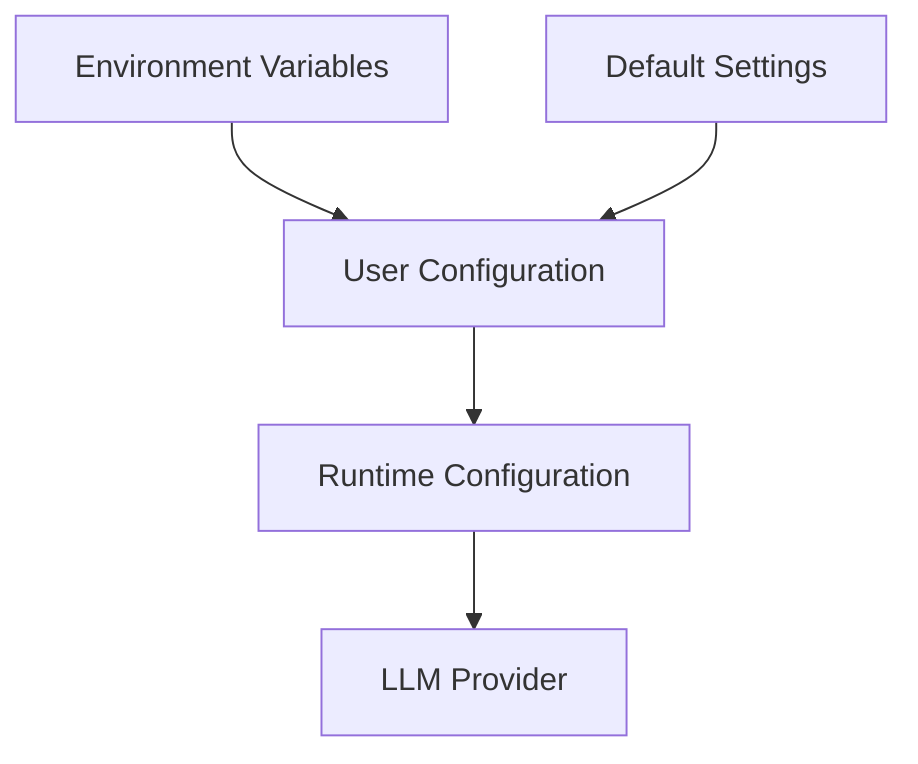

**Diagram sources**
- [llm_config.py](file://src/local_deep_research/config/llm_config.py#L1-L1041)
- [auto_discovery.py](file://src/local_deep_research/llm/providers/auto_discovery.py#L1-L270)

The configuration system follows a specific precedence order:
1. Environment variables (highest priority)
2. User configuration (from database or settings file)
3. Default settings (lowest priority)

Each provider configuration file contains settings in a standardized format with metadata that defines how the setting should be presented in the UI. For example, the OpenRouter configuration includes:

```json
{
    "llm.openrouter.api_key": {
        "category": "llm_general",
        "description": "API key to use for the OpenRouter provider.",
        "editable": true,
        "name": "OpenRouter API Key",
        "type": "SEARCH",
        "ui_element": "password",
        "value": null,
        "visible": true
    }
}
```

**Section sources**
- [openrouter_settings.json](file://src/local_deep_research/defaults/llm_providers/openrouter_settings.json#L1-L17)
- [google_settings.json](file://src/local_deep_research/defaults/llm_providers/google_settings.json#L1-L17)
- [ionos_settings.json](file://src/local_deep_research/defaults/llm_providers/ionos_settings.json#L1-L17)
- [xai_settings.json](file://src/local_deep_research/defaults/llm_providers/xai_settings.json#L1-L17)

## Cloud Provider Setup

### OpenAI Configuration

To configure the OpenAI provider, you need to provide your API key through the settings interface or environment variables. The system supports all OpenAI models including GPT-3.5, GPT-4, and future models.

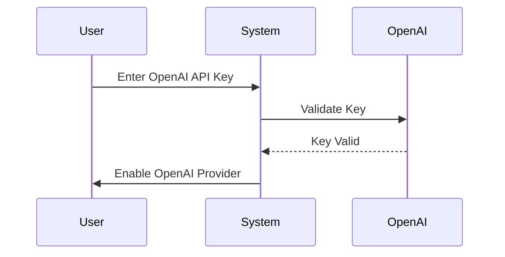

**Diagram sources**
- [openai.py](file://src/local_deep_research/llm/providers/implementations/openai.py#L1-L218)
- [llm_config.py](file://src/local_deep_research/config/llm_config.py#L555-L637)

The OpenAI provider supports additional configuration options:
- `llm.openai.api_base`: Custom API base URL for proxy services
- `llm.openai.organization`: Organization ID for multi-organization accounts
- `llm.streaming`: Enable or disable streaming responses
- `llm.max_retries`: Number of retry attempts for failed requests
- `llm.request_timeout`: Request timeout in seconds

### Anthropic Configuration

The Anthropic provider configuration is similar to OpenAI, requiring an API key for authentication. It supports all Claude models including Claude 3 Sonnet, Opus, and Haiku.

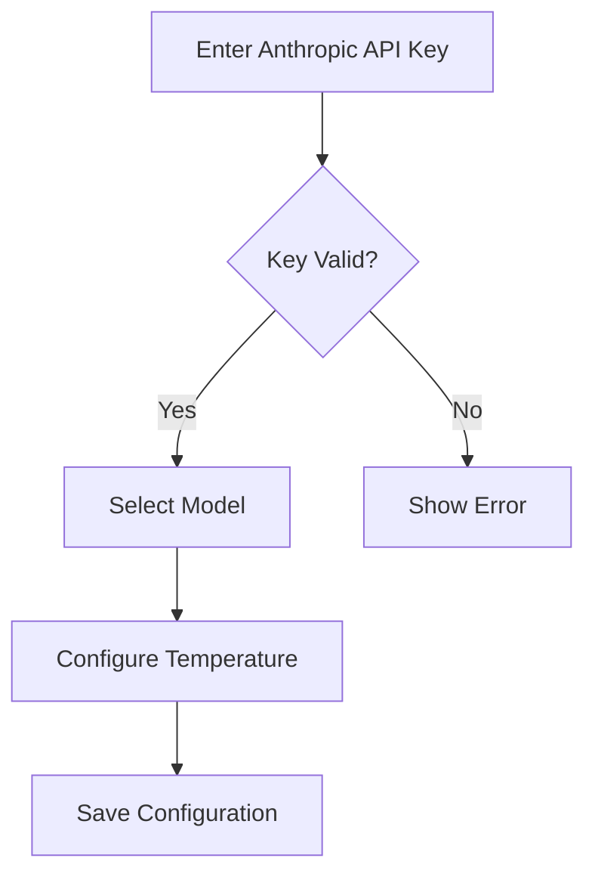

**Diagram sources**
- [anthropic.py](file://src/local_deep_research/llm/providers/implementations/anthropic.py#L1-L162)
- [llm_config.py](file://src/local_deep_research/config/llm_config.py#L533-L554)

### Google Gemini Configuration

The Google Gemini provider uses Google's OpenAI-compatible API endpoint to access Gemini models. This approach automatically supports all current and future Gemini models without requiring code updates.

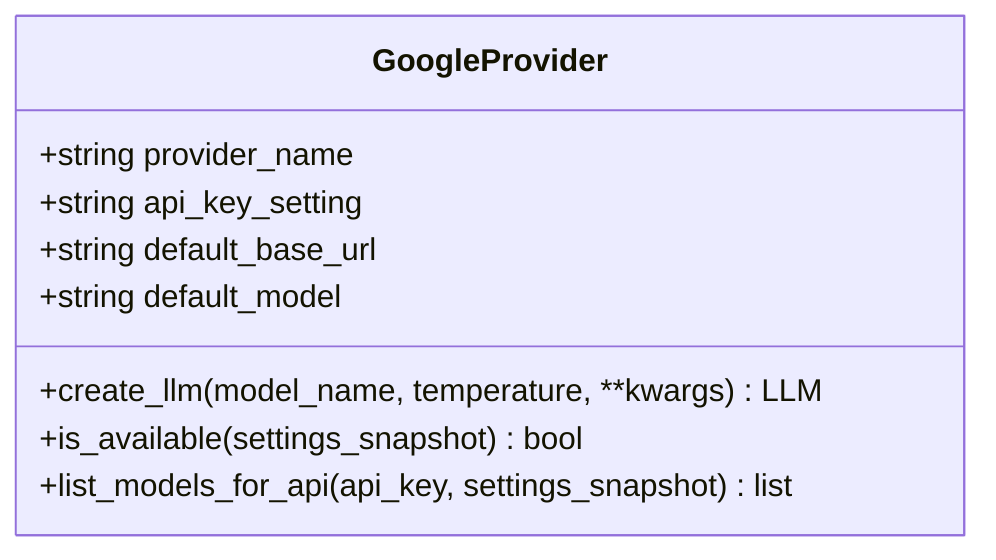

**Diagram sources**
- [google.py](file://src/local_deep_research/llm/providers/implementations/google.py#L1-L133)
- [llm_config.py](file://src/local_deep_research/config/llm_config.py#L213-L235)

The Google provider has a unique implementation detail: it uses the native Gemini API endpoint for listing models because Google's OpenAI-compatible /models endpoint has a known bug that returns 401 errors.

**Section sources**
- [openai.py](file://src/local_deep_research/llm/providers/implementations/openai.py#L1-L218)
- [anthropic.py](file://src/local_deep_research/llm/providers/implementations/anthropic.py#L1-L162)
- [google.py](file://src/local_deep_research/llm/providers/implementations/google.py#L1-L133)

## Local Model Configuration

### Ollama Setup

Ollama is supported as a local model provider, allowing users to run LLMs directly on their machines. The configuration requires specifying the Ollama server URL and ensuring the desired models are available.

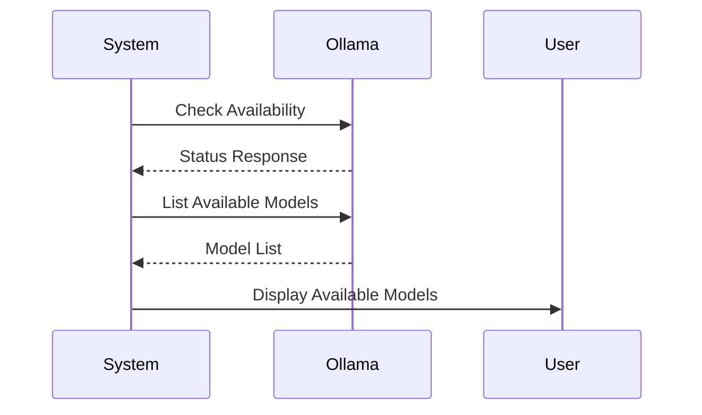

**Diagram sources**
- [ollama.py](file://src/local_deep_research/llm/providers/implementations/ollama.py#L1-L345)
- [llm_config.py](file://src/local_deep_research/config/llm_config.py#L700-L799)

Key configuration options for Ollama:
- `llm.ollama.url`: URL of the Ollama server (default: http://localhost:11434)
- `llm.ollama.api_key`: Optional API key for authenticated Ollama instances
- `llm.local_context_window_size`: Context window size for local models
- `llm.ollama.enable_thinking`: Enable or disable model thinking/reasoning

The system automatically checks for model availability by querying the Ollama API's `/api/tags` endpoint and validates that the requested model exists before attempting to use it.

**Section sources**
- [ollama.py](file://src/local_deep_research/llm/providers/implementations/ollama.py#L1-L345)

## Custom Endpoint Integration

The system supports custom OpenAI-compatible endpoints, allowing integration with services like LM Studio, VLLM, and other providers that implement the OpenAI API specification.

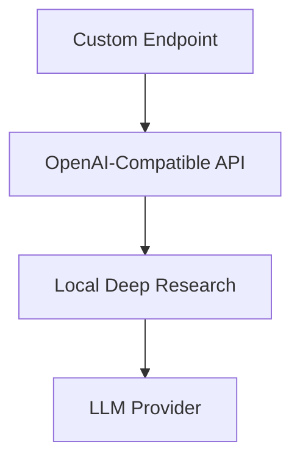

**Diagram sources**
- [llm_config.py](file://src/local_deep_research/config/llm_config.py#L638-L670)

To configure a custom endpoint:
1. Set the provider to "openai_endpoint"
2. Provide the API key for authentication
3. Specify the endpoint URL (default: https://openrouter.ai/api/v1)
4. Select the model name supported by the endpoint

The system performs validation by checking the availability of the endpoint and ensuring the API key is properly configured before allowing the provider to be used.

**Section sources**
- [llm_config.py](file://src/local_deep_research/config/llm_config.py#L638-L670)

## LLM Registry System

The LLM registry system provides a thread-safe mechanism for registering and managing custom LLM providers at runtime. It uses a singleton pattern to ensure global access to the registry.

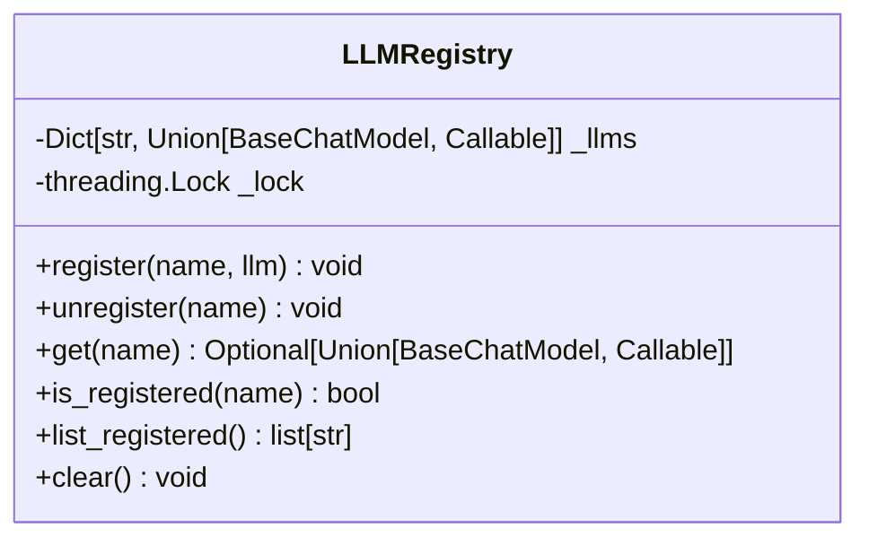

**Diagram sources**
- [llm_registry.py](file://src/local_deep_research/llm/llm_registry.py#L1-L162)

The registry supports two types of LLM registrations:
1. **BaseChatModel instances**: Pre-configured LLM instances
2. **Callable factory functions**: Functions that create and return LLM instances

The auto-discovery system automatically scans the `llm/providers/implementations/` directory for provider classes and registers them with the global registry. Providers are discovered by looking for classes that:
- End with "Provider"
- Have a `provider_name` attribute
- Are not the base `OpenAICompatibleProvider` class

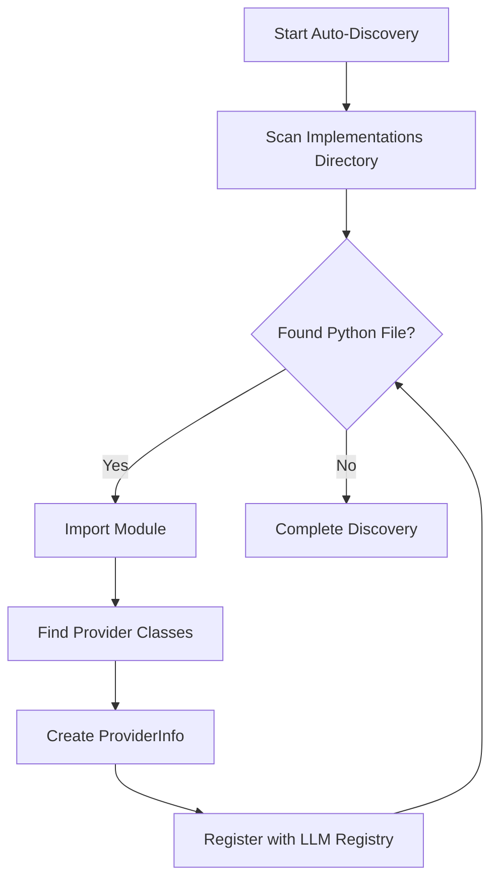

**Diagram sources**
- [auto_discovery.py](file://src/local_deep_research/llm/providers/auto_discovery.py#L1-L270)

**Section sources**
- [llm_registry.py](file://src/local_deep_research/llm/llm_registry.py#L1-L162)
- [auto_discovery.py](file://src/local_deep_research/llm/providers/auto_discovery.py#L1-L270)

## Advanced Configuration Options

### Model Selection and Parameters

The system supports comprehensive configuration of LLM parameters:

| Parameter | Description | Default Value | Provider Support |
|---------|-----------|--------------|----------------|
| model_name | Name of the LLM to use | gemma:latest | All |
| temperature | Controls randomness (0.0-1.0) | 0.7 | All |
| max_tokens | Maximum tokens in response | 100000 | Most |
| context_window_size | Context window size | 128000 | Cloud |
| local_context_window_size | Local model context size | 4096 | Local |

The system automatically adjusts the max_tokens parameter to 80% of the context window size to leave room for prompts and system messages.

### Multiple Provider Configuration

The system supports configuring multiple providers for fallback and load balancing scenarios. When multiple providers are configured, the system will:

1. Check availability of each provider
2. Use the selected provider if available
3. Fall back to alternative providers if the primary is unavailable
4. Use a dummy model if no providers are available

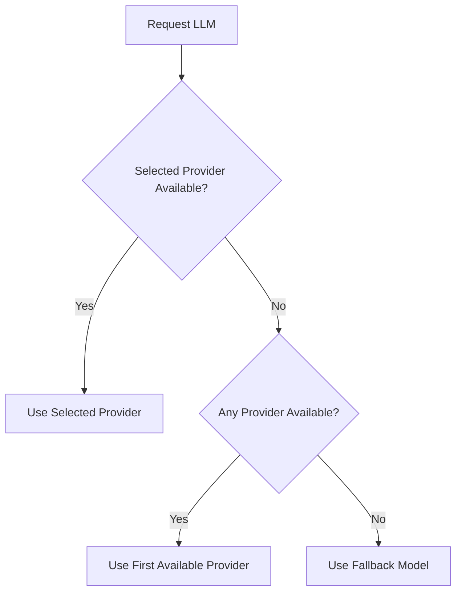

**Diagram sources**
- [llm_config.py](file://src/local_deep_research/config/llm_config.py#L237-L274)

### Custom Headers

Custom headers can be added to API requests through the configuration system. This is particularly useful for:
- Authentication tokens
- Rate limit management
- Custom API routing
- Enterprise API gateways

For Ollama, custom headers are supported through the `headers` parameter in the ChatOllama constructor, allowing for Bearer token authentication with proxied Ollama instances.

**Section sources**
- [llm_config.py](file://src/local_deep_research/config/llm_config.py#L457-L531)

## Security Best Practices

### API Key Management

The system implements several security measures for API key management:

1. **Secure Storage**: API keys are stored securely in the database with appropriate access controls
2. **Environment Variable Support**: Keys can be provided via environment variables to avoid hardcoding
3. **UI Protection**: API key fields are rendered as password inputs in the UI
4. **Validation**: Keys are validated before being stored or used

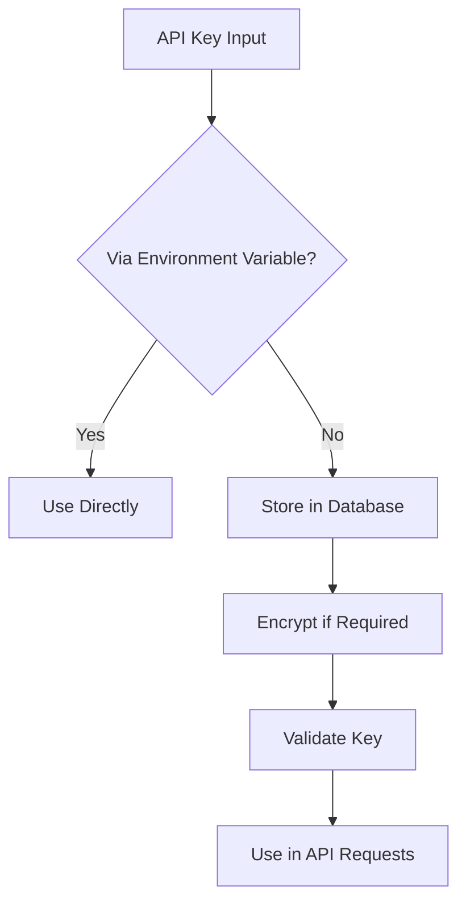

**Diagram sources**
- [llm_config.py](file://src/local_deep_research/config/llm_config.py#L53-L63)
- [llm_config.py](file://src/local_deep_research/config/llm_config.py#L66-L76)

### Network Configuration

The system includes security features for network configuration:

- **Localhost Access**: Safe access to localhost services for local models
- **Private IP Access**: Support for private network services
- **URL Validation**: Normalization and validation of endpoint URLs
- **Request Security**: Use of safe_get function for HTTP requests

The `safe_get` function implements security checks to prevent SSRF (Server-Side Request Forgery) attacks while allowing necessary access to local and private services.

**Section sources**
- [llm_config.py](file://src/local_deep_research/config/llm_config.py#L95-L138)
- [ollama.py](file://src/local_deep_research/llm/providers/implementations/ollama.py#L97-L105)

## Performance Tuning

### Timeout Settings

The system allows configuration of request timeouts to balance between responsiveness and reliability:

- `llm.request_timeout`: Global request timeout (default: None, uses provider default)
- Provider-specific timeouts can also be configured

The system uses reasonable defaults for timeout values while allowing users to adjust them based on their network conditions and requirements.

### Retry Policies

Configurable retry policies help improve reliability:

- `llm.max_retries`: Maximum number of retry attempts (default: provider default)
- Automatic retry on transient failures
- Exponential backoff strategy

The retry mechanism is implemented at the provider level, with each provider handling retries according to its specific requirements and capabilities.

### Connection Pooling

While not explicitly configured, the underlying LangChain libraries handle connection pooling automatically. The system benefits from these optimizations without requiring additional configuration.

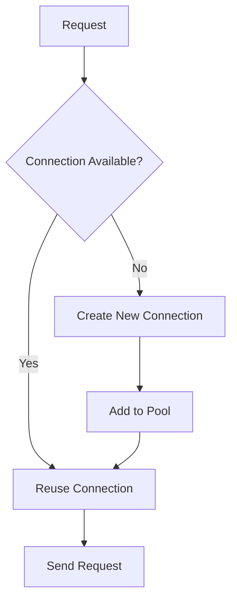

**Diagram sources**
- [llm_config.py](file://src/local_deep_research/config/llm_config.py#L608-L617)

**Section sources**
- [llm_config.py](file://src/local_deep_research/config/llm_config.py#L608-L617)

## Extending the System

### Creating New Provider Implementations

To extend the system with new LLM provider implementations:

1. Create a new Python file in `llm/providers/implementations/`
2. Define a provider class that inherits from `OpenAICompatibleProvider`
3. Implement required methods and attributes
4. Add a registration function
5. Create a corresponding JSON configuration file

The auto-discovery system will automatically detect and register the new provider.

### Provider Class Requirements

A valid provider implementation must include:

- `provider_name`: Display name for the provider
- `api_key_setting`: Settings key for the API key
- `default_model`: Default model to use
- `create_llm()`: Factory method to create LLM instances
- `is_available()`: Method to check provider availability
- `register_provider()`: Function to register the provider

The system's modular design makes it easy to add support for new providers while maintaining consistency across the codebase.

**Section sources**
- [auto_discovery.py](file://src/local_deep_research/llm/providers/auto_discovery.py#L1-L270)
- [openai_base.py](file://src/local_deep_research/llm/providers/openai_base.py)