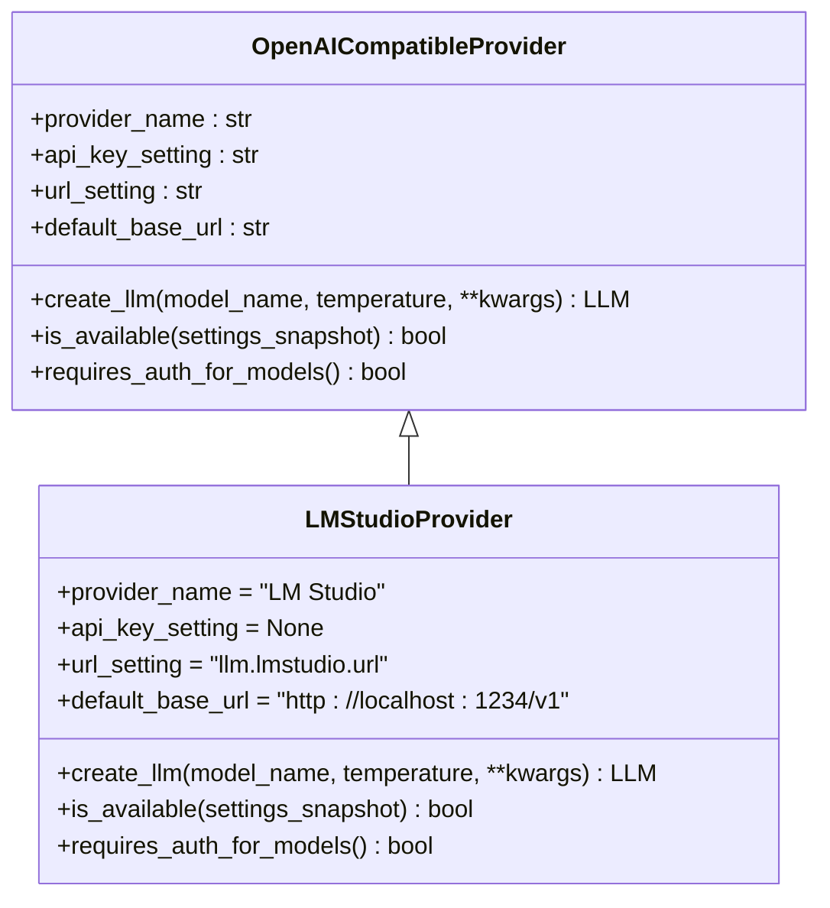
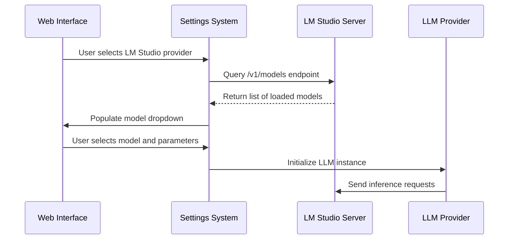
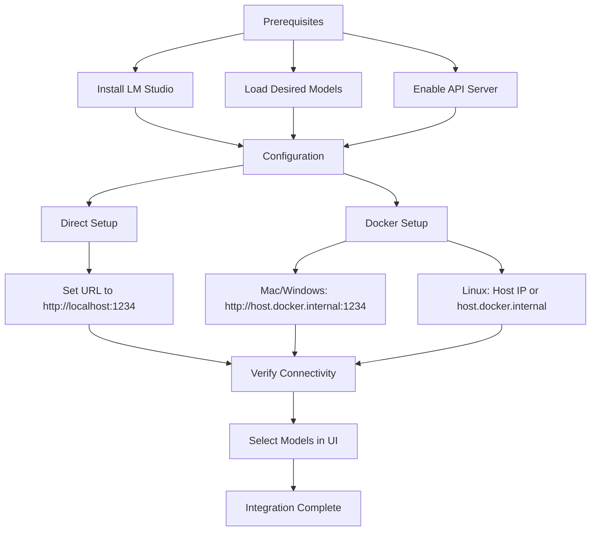
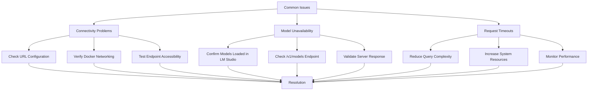
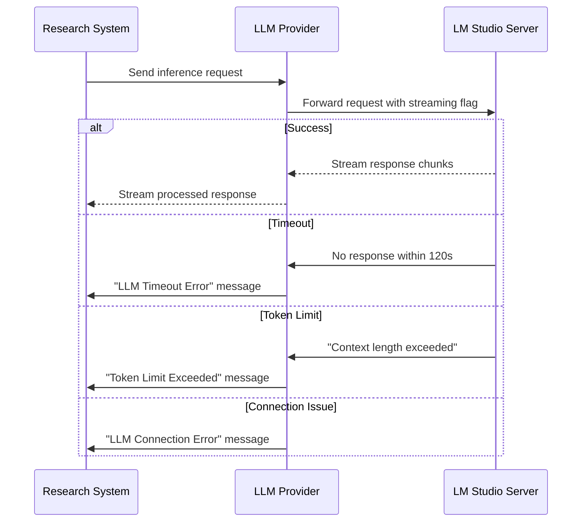

# LM Studio Integration

<cite>
**Referenced Files in This Document**   
- [lmstudio.py](file://src/local_deep_research/llm/providers/implementations/lmstudio.py)
- [openai_base.py](file://src/local_deep_research/llm/providers/openai_base.py)
- [llm_config.py](file://src/local_deep_research/config/llm_config.py)
- [research.html](file://src/local_deep_research/web/templates/pages/research.html)
- [default_settings.json](file://src/local_deep_research/defaults/default_settings.json)
- [faq.md](file://docs/faq.md)
- [docker-compose.yml](file://docker-compose.yml)
</cite>

## Table of Contents
1. [Introduction](#introduction)
2. [Configuration Parameters](#configuration-parameters)
3. [OpenAI-Compatible API Implementation](#openai-compatible-api-implementation)
4. [Model Selection and Inference Configuration](#model-selection-and-inference-configuration)
5. [Setup Instructions](#setup-instructions)
6. [Troubleshooting Guide](#troubleshooting-guide)
7. [Streaming and Error Handling](#streaming-and-error-handling)
8. [Conclusion](#conclusion)

## Introduction
LM Studio integration enables Local Deep Research to interface with locally hosted language models through LM Studio's OpenAI-compatible API server. This integration allows users to leverage powerful local models without relying on cloud-based services, providing enhanced privacy and reduced latency. The implementation is designed to seamlessly integrate with the existing LLM provider architecture, treating LM Studio as a first-class provider alongside other local and cloud-based options.

**Section sources**
- [lmstudio.py](file://src/local_deep_research/llm/providers/implementations/lmstudio.py#L1-L28)

## Configuration Parameters
The LM Studio integration requires specific configuration parameters to establish connectivity with the local server. These parameters are managed through the application's settings system and can be configured via the web interface or environment variables.

The primary configuration parameter is the server URL, which specifies the endpoint for the LM Studio API. By default, this is set to `http://localhost:1234`, reflecting LM Studio's default port configuration. This URL setting is stored in the application configuration as `llm.lmstudio.url` and is used to construct the complete API endpoint by appending the `/v1` path.

Unlike cloud-based LLM providers, LM Studio does not require authentication via API keys. The integration handles this by using a placeholder API key value of "not-required" when initializing the connection. This approach allows the system to maintain a consistent interface with OpenAI-compatible providers while accommodating LM Studio's authentication-free design.

```mermaid
flowchart TD
A[Configuration Parameters] --> B[Server URL]
A --> C[Port Number]
A --> D[API Key Handling]
B --> E[llm.lmstudio.url setting]
C --> F[Default: 1234]
D --> G[Placeholder: "not-required"]
```

**Diagram sources**
- [lmstudio.py](file://src/local_deep_research/llm/providers/implementations/lmstudio.py#L15-L18)
- [llm_config.py](file://src/local_deep_research/config/llm_config.py#L835-L839)

**Section sources**
- [lmstudio.py](file://src/local_deep_research/llm/providers/implementations/lmstudio.py#L15-L18)
- [default_settings.json](file://src/local_deep_research/defaults/default_settings.json#L310-L323)

## OpenAI-Compatible API Implementation
The LM Studio integration implements an OpenAI-compatible API client through the `LMStudioProvider` class, which extends the `OpenAICompatibleProvider` base class. This inheritance structure allows the integration to leverage existing OpenAI client functionality while customizing behavior for LM Studio's specific requirements.

The implementation overrides key methods to handle LM Studio's unique characteristics. The `create_llm` method retrieves the configured LM Studio URL from settings and constructs the appropriate base URL by appending the `/v1` endpoint path. It then sets a placeholder API key value, as LM Studio does not require actual authentication credentials. The method delegates to the parent class's `_create_llm_instance` to instantiate the ChatOpenAI client with these parameters.

The integration also implements availability checking through the `is_available` method, which performs a health check by attempting to access the `/v1/models` endpoint. This check uses a 1.0-second timeout and returns true if the response status code is 200, indicating that the LM Studio server is running and accessible.



**Diagram sources**
- [lmstudio.py](file://src/local_deep_research/llm/providers/implementations/lmstudio.py#L9-L51)
- [openai_base.py](file://src/local_deep_research/llm/providers/openai_base.py#L25-L146)

**Section sources**
- [lmstudio.py](file://src/local_deep_research/llm/providers/implementations/lmstudio.py#L9-L51)
- [openai_base.py](file://src/local_deep_research/llm/providers/openai_base.py#L25-L146)

## Model Selection and Inference Configuration
Model selection in the LM Studio integration is handled through the standard LLM provider interface, allowing users to select from models currently loaded in LM Studio. The integration automatically populates the model dropdown in the web interface by querying the LM Studio server's `/v1/models` endpoint when the provider is selected.

Inference parameters such as temperature, top_k, and repetition_penalty are configured through the application's global LLM settings. The temperature parameter, which controls the randomness of the model's output, defaults to 0.7 and can be adjusted in the settings interface. While LM Studio supports additional inference parameters, the current integration focuses on the core parameters that are most commonly used and supported across different LLM providers.

The integration also handles context window sizing, with a default local context window size of 4096 tokens. This value can be adjusted in the settings to accommodate different model capabilities and system resources. The maximum tokens parameter is set to 80% of the context window size to ensure sufficient space for prompts and system messages.



**Diagram sources**
- [lmstudio.py](file://src/local_deep_research/llm/providers/implementations/lmstudio.py#L53-L74)
- [llm_config.py](file://src/local_deep_research/config/llm_config.py#L463-L473)
- [research.html](file://src/local_deep_research/web/templates/pages/research.html#L106-L117)

**Section sources**
- [lmstudio.py](file://src/local_deep_research/llm/providers/implementations/lmstudio.py#L53-L74)
- [llm_config.py](file://src/local_deep_research/config/llm_config.py#L463-L473)

## Setup Instructions
Setting up LM Studio integration involves several steps to ensure proper connectivity between Local Deep Research and the LM Studio server. First, ensure that LM Studio is installed and running on your system, with the desired language models loaded. The API server must be enabled in LM Studio's settings, which is typically enabled by default.

For direct integration, configure the LM Studio URL in Local Deep Research settings. In the web interface, navigate to the research settings and select "LM Studio" as the LLM provider. The endpoint field will automatically appear, pre-populated with the default `http://localhost:1234` address. Verify that this matches your LM Studio server configuration.

When using Docker deployment, special network configuration is required since containers cannot directly access the host's localhost. For Docker Desktop on Mac or Windows, use `http://host.docker.internal:1234` as the endpoint URL. For Linux systems, you have two options: use your host machine's IP address (e.g., `http://192.168.1.xxx:1234`) or modify the docker-compose.yml file to include the host gateway mapping.



**Diagram sources**
- [faq.md](file://docs/faq.md#L244-L267)
- [docker-compose.yml](file://docker-compose.yml#L106-L112)
- [research.html](file://src/local_deep_research/web/templates/pages/research.html#L106-L109)

**Section sources**
- [faq.md](file://docs/faq.md#L244-L267)
- [docker-compose.yml](file://docker-compose.yml#L106-L112)

## Troubleshooting Guide
Common issues with LM Studio integration typically fall into connectivity, model availability, and request timeout categories. Connectivity issues often arise from incorrect URL configuration, particularly in Docker environments. If models do not appear in the dropdown menu, verify that the endpoint URL is correctly configured and that LM Studio's API server is accessible from the Local Deep Research application.

CORS (Cross-Origin Resource Sharing) errors are not typically an issue with this integration since requests are made server-to-server rather than from browser clients. However, network connectivity problems can manifest as connection errors. For Docker deployments, ensure that the container can reach the host machine by using the appropriate hostname (`host.docker.internal` for Mac/Windows, host IP for Linux).

Model unavailability issues usually indicate that either no models are loaded in LM Studio or the connection between the applications is failing. Verify that models are properly loaded in LM Studio and that the `/v1/models` endpoint returns a valid response when accessed directly via a web browser or curl command.

Request timeout errors may occur when processing complex queries or when system resources are constrained. The integration includes a 120-second timeout for LLM invocations, after which a fallback response is provided. To mitigate timeout issues, consider simplifying research queries or ensuring adequate system resources are available for both applications.



**Diagram sources**
- [faq.md](file://docs/faq.md#L244-L267)
- [advanced_search_system/findings/repository.py](file://src/local_deep_research/advanced_search_system/findings/repository.py#L356-L384)
- [web/static/js/services/socket.js](file://src/local_deep_research/web/static/js/services/socket.js#L208-L232)

**Section sources**
- [faq.md](file://docs/faq.md#L244-L267)
- [advanced_search_system/findings/repository.py](file://src/local_deep_research/advanced_search_system/findings/repository.py#L356-L384)

## Streaming and Error Handling
The LM Studio integration handles streaming responses through the underlying ChatOpenAI client, which supports streaming natively. Streaming behavior is controlled by the `llm.streaming` setting in the application configuration. When enabled, responses are delivered incrementally to the client, providing a more responsive user experience during lengthy inference operations.

Error handling in the integration is comprehensive, capturing various failure modes and providing meaningful feedback to users. The system distinguishes between different error types, including timeout, token limit, rate limiting, connection, and authentication issues. When an error occurs during LLM invocation, the system analyzes the error message to determine the specific type and provides an appropriate user-friendly message.

For timeout errors, the system implements a 120-second timeout period after which a fallback response is generated. Token limit errors occur when the context window is exceeded, prompting users to simplify their queries. Connection errors indicate network issues between Local Deep Research and the LM Studio server, while authentication errors are unlikely with LM Studio but are handled for consistency with other providers.

The error handling system also includes fallback mechanisms, attempting to provide useful responses even when primary inference fails. This resilience ensures that research operations can continue, albeit with potentially reduced quality, rather than failing completely.



**Diagram sources**
- [openai_base.py](file://src/local_deep_research/llm/providers/openai_base.py#L104-L113)
- [advanced_search_system/findings/repository.py](file://src/local_deep_research/advanced_search_system/findings/repository.py#L356-L384)
- [web/static/js/services/socket.js](file://src/local_deep_research/web/static/js/services/socket.js#L208-L232)

**Section sources**
- [openai_base.py](file://src/local_deep_research/llm/providers/openai_base.py#L104-L113)
- [advanced_search_system/findings/repository.py](file://src/local_deep_research/advanced_search_system/findings/repository.py#L356-L384)

## Conclusion
The LM Studio integration provides a robust and user-friendly interface for leveraging local language models within the Local Deep Research ecosystem. By implementing an OpenAI-compatible API client, the integration seamlessly connects to LM Studio's server mode, enabling access to powerful local models without cloud dependencies. The configuration system handles the unique requirements of LM Studio, including its authentication-free design and local endpoint structure.

Setup and troubleshooting guidance ensures that users can successfully configure the integration across different deployment scenarios, from direct installation to Docker-based deployments. Comprehensive error handling and streaming support enhance the user experience, providing resilience and responsiveness during research operations. As local AI capabilities continue to evolve, this integration positions Local Deep Research to take full advantage of advancements in on-premises language model technology.