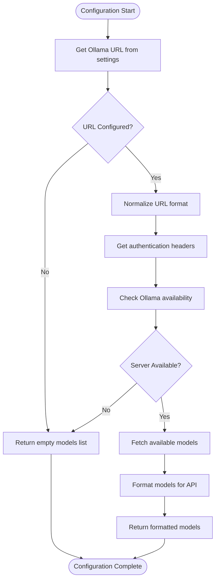
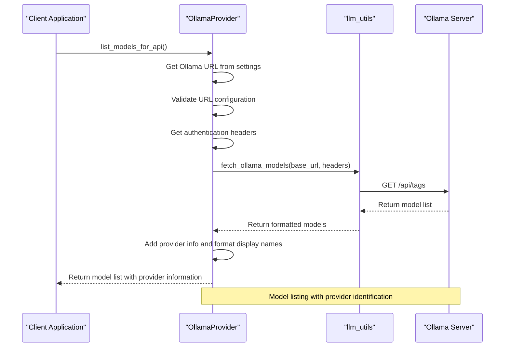
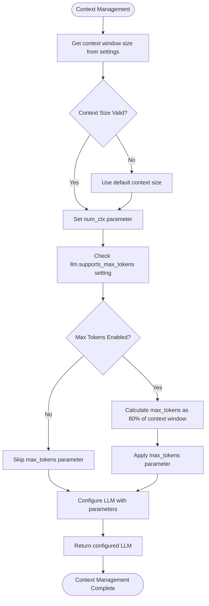

# Ollama Integration

<cite>
**Referenced Files in This Document**   
- [ollama.py](file://src/local_deep_research/llm/providers/implementations/ollama.py)
- [ollama.py](file://src/local_deep_research/embeddings/providers/implementations/ollama.py)
- [llm_registry.py](file://src/local_deep_research/llm/llm_registry.py)
- [llm_utils.py](file://src/local_deep_research/utilities/llm_utils.py)
- [default_settings.json](file://src/local_deep_research/defaults/default_settings.json)
- [settings_ollama_embeddings.json](file://src/local_deep_research/defaults/settings_ollama_embeddings.json)
- [test_ollama_provider.py](file://tests/llm_providers/test_ollama_provider.py)
- [ollama_entrypoint.sh](file://scripts/ollama_entrypoint.sh)
</cite>

## Table of Contents
1. [Introduction](#introduction)
2. [Configuration Parameters](#configuration-parameters)
3. [Model Management](#model-management)
4. [Advanced Configuration](#advanced-configuration)
5. [LLM Provider Registry Integration](#llm-provider-registry-integration)
6. [Troubleshooting Guide](#troubleshooting-guide)
7. [Performance Optimization](#performance-optimization)
8. [Conclusion](#conclusion)

## Introduction

Ollama integration enables Local Deep Research to leverage locally running Ollama servers for language model inference and embeddings generation. The integration provides a robust interface for connecting to Ollama instances, managing models, and configuring advanced parameters for optimal performance. This document details the implementation, configuration options, and best practices for integrating with Ollama servers.

The Ollama provider is designed as a local LLM provider with comprehensive support for model listing, completion requests, and streaming responses. It integrates seamlessly with the LLM provider registry and supports both LLM operations and embeddings generation through configurable endpoints.

**Section sources**
- [ollama.py](file://src/local_deep_research/llm/providers/implementations/ollama.py#L1-L50)

## Configuration Parameters

### Connection Configuration

The Ollama integration supports comprehensive configuration for connecting to locally running Ollama servers. The primary configuration parameters are stored in the application settings system and can be modified through the UI or configuration files.

#### LLM Configuration
The main configuration for Ollama LLM operations uses the following settings:

- **`llm.ollama.url`**: Base URL for the Ollama server (default: `http://localhost:11434`)
- **`llm.ollama.api_key`**: Optional API key for authenticated Ollama instances
- **`llm.local_context_window_size`**: Context window size for local providers (default: 4096)
- **`llm.supports_max_tokens`**: Flag indicating whether max_tokens parameter is supported
- **`llm.max_tokens`**: Maximum tokens to generate (default: 100000)

#### Embeddings Configuration
For embeddings generation, a separate endpoint can be configured:

- **`embeddings.ollama.url`**: URL of the Ollama endpoint for embedding models
- **Fallback behavior**: If not set, the system falls back to the LLM Ollama URL

The connection process follows a specific sequence:
1. Retrieve the Ollama URL from settings
2. Normalize the URL format
3. Apply authentication headers if configured
4. Validate server availability before use



**Diagram sources**
- [ollama.py](file://src/local_deep_research/llm/providers/implementations/ollama.py#L84-L116)
- [llm_utils.py](file://src/local_deep_research/utilities/llm_utils.py#L104-L159)

**Section sources**
- [ollama.py](file://src/local_deep_research/llm/providers/implementations/ollama.py#L36-L45)
- [settings_ollama_embeddings.json](file://src/local_deep_research/defaults/settings_ollama_embeddings.json#L1-L17)

## Model Management

### Model Listing

The Ollama provider implements a robust model listing mechanism that retrieves available models from the Ollama server's API. The process involves:

1. **URL Configuration**: The system first retrieves the Ollama URL from settings using the `llm.ollama.url` configuration key.
2. **Authentication**: If an API key is configured, it's included in the request headers using Bearer token authentication.
3. **API Request**: The system makes a GET request to the `/api/tags` endpoint to retrieve the list of available models.
4. **Response Handling**: The implementation handles both newer and older Ollama API formats, extracting model information from either the "models" array or the root response object.
5. **Formatting**: Retrieved models are formatted with display names and provider information for consistent UI presentation.

The model listing function returns a list of dictionaries with the following structure:
- **`value`**: The actual model name (e.g., "llama2:latest")
- **`label`**: Display name with provider information (e.g., "llama2 (Ollama)")
- **`provider`**: Provider identifier ("OLLAMA")



**Diagram sources**
- [ollama.py](file://src/local_deep_research/llm/providers/implementations/ollama.py#L74-L116)
- [llm_utils.py](file://src/local_deep_research/utilities/llm_utils.py#L104-L159)

### Completion Requests

The Ollama integration handles completion requests through the `create_llm` method, which follows a comprehensive validation and configuration process:

1. **Model Validation**: Before creating a completion request, the system verifies that the requested model exists on the Ollama server by checking against the list of available models.
2. **Server Availability**: The system confirms that the Ollama server is available and responsive.
3. **Parameter Configuration**: The implementation configures various parameters including:
   - Model name
   - Temperature
   - Context window size
   - Maximum tokens
   - Authentication headers

4. **Streaming Support**: The integration supports streaming responses through the underlying ChatOllama implementation.

The completion request process includes error handling for common issues such as:
- Missing URL configuration
- Unavailable Ollama server
- Non-existent models
- Network connectivity issues

**Section sources**
- [ollama.py](file://src/local_deep_research/llm/providers/implementations/ollama.py#L119-L252)
- [test_ollama_provider.py](file://tests/llm_providers/test_ollama_provider.py#L197-L304)

## Advanced Configuration

### GPU Layer Allocation

While the Ollama integration itself doesn't directly manage GPU layer allocation, it supports the underlying Ollama server's GPU capabilities through proper configuration. The actual GPU layer allocation is managed by the Ollama server based on its configuration and available hardware resources.

To optimize GPU usage:
1. Configure the Ollama server with appropriate GPU settings
2. Ensure proper CUDA drivers and libraries are installed
3. Monitor GPU memory usage during model loading

### Context Window Management

The integration provides comprehensive context window management through the following settings:

- **`llm.local_context_window_size`**: Sets the context window size for local providers (default: 4096)
- **`llm.context_window_size`**: Global context window size setting
- **`llm.supports_max_tokens`**: Controls whether max_tokens parameter is used
- **`llm.max_tokens`**: Maximum tokens to generate (default: 100000)

The system implements context window management by:
1. Retrieving the configured context window size
2. Setting the `num_ctx` parameter in the Ollama request
3. Calculating max_tokens as 80% of the context window to leave room for prompts
4. Applying truncation detection when context limits are exceeded



**Diagram sources**
- [ollama.py](file://src/local_deep_research/llm/providers/implementations/ollama.py#L218-L243)
- [llm_config.py](file://src/local_deep_research/config/llm_config.py#L482-L516)

### Batch Size Tuning

The Ollama integration doesn't expose direct batch size configuration, as this is managed internally by the Ollama server. However, performance can be optimized by:
1. Adjusting the context window size to balance memory usage and performance
2. Configuring appropriate max_tokens values to control response length
3. Using quantized models that are optimized for the available hardware

**Section sources**
- [ollama.py](file://src/local_deep_research/llm/providers/implementations/ollama.py#L218-L243)
- [token_counter.py](file://src/local_deep_research/metrics/token_counter.py#L301-L323)

## LLM Provider Registry Integration

### Registration Process

The Ollama provider integrates with the LLM provider registry through a well-defined registration process:

1. **Provider Class**: The `OllamaProvider` class implements the required interface with methods for model listing, LLM creation, and availability checking.
2. **Factory Functions**: Standalone functions (`create_ollama_llm`, `is_ollama_available`) provide backward compatibility and registration hooks.
3. **Registration Function**: The `register_ollama_provider` function registers the provider with the global LLM registry.

The registration process follows these steps:
1. Call `register_ollama_provider()` to initiate registration
2. The function calls `register_llm("ollama", create_ollama_llm)`
3. The provider is added to the global registry with the key "ollama"
4. A success message is logged

```mermaid
classDiagram
class OllamaProvider {
+provider_name : str
+default_model : str
+api_key_setting : str
+url_setting : str
+provider_key : str
+is_cloud : bool
+_get_auth_headers(api_key, settings_snapshot)
+list_models_for_api(api_key, settings_snapshot)
+create_llm(model_name, temperature, **kwargs)
+is_available(settings_snapshot)
}
class LLMRegistry {
-_llms : Dict[str, Union[BaseChatModel, Callable]]
-_lock : threading.Lock
+register(name, llm)
+unregister(name)
+get(name)
+is_registered(name)
+list_registered()
+clear()
}
class llm_registry {
+register_llm(name, llm)
+unregister_llm(name)
+get_llm_from_registry(name)
+is_llm_registered(name)
+list_registered_llms()
+clear_llm_registry()
}
OllamaProvider --> LLMRegistry : "registered via"
LLMRegistry <.. llm_registry : "exposes"
OllamaProvider ..> ChatOllama : "creates"
note right of OllamaProvider
Implements the LLM provider interface
Handles Ollama-specific configuration
Manages model listing and LLM creation
end
note right of LLMRegistry
Thread-safe registry for LLM providers
Centralized management of LLM instances
Case-insensitive name storage
end
```

**Diagram sources**
- [ollama.py](file://src/local_deep_research/llm/providers/implementations/ollama.py#L27-L344)
- [llm_registry.py](file://src/local_deep_research/llm/llm_registry.py#L1-L162)

### Configuration File Structure

The Ollama settings are defined in JSON configuration files that integrate with the LLM provider registry. The structure follows the application's settings schema:

```json
{
    "embeddings.ollama.url": {
        "category": "embeddings",
        "description": "URL of the Ollama endpoint for embedding models. This setting allows you to use a different Ollama server for embeddings than for LLM operations. If not set, the system will fall back to the LLM Ollama URL.",
        "editable": true,
        "max_value": null,
        "min_value": null,
        "name": "Ollama Embeddings Endpoint URL",
        "options": null,
        "step": null,
        "type": "APP",
        "ui_element": "text",
        "value": "http://localhost:11434",
        "visible": true
    }
}
```

Key configuration properties:
- **`category`**: Settings category (embeddings, llm, etc.)
- **`description`**: Detailed description of the setting
- **`editable`**: Whether the setting can be modified
- **`name`**: Display name for the UI
- **`type`**: Setting type (APP, USER, etc.)
- **`ui_element`**: UI element type (text, dropdown, etc.)
- **`value`**: Default value
- **`visible`**: Whether the setting is visible in the UI

**Section sources**
- [ollama.py](file://src/local_deep_research/llm/providers/implementations/ollama.py#L341-L344)
- [settings_ollama_embeddings.json](file://src/local_deep_research/defaults/settings_ollama_embeddings.json#L1-L17)
- [llm_registry.py](file://src/local_deep_research/llm/llm_registry.py#L102-L162)

## Troubleshooting Guide

### Connection Timeouts

Connection timeouts occur when the application cannot establish a connection to the Ollama server within the specified timeout period. Common causes and solutions:

**Symptoms**:
- "Request error when checking Ollama" in logs
- "Ollama not available" error messages
- Timeout exceptions during model listing

**Causes**:
- Ollama server not running
- Network connectivity issues
- Firewall blocking the connection
- Incorrect URL configuration

**Solutions**:
1. Verify Ollama server is running: `ps aux | grep ollama`
2. Check the configured URL in settings
3. Test connectivity: `curl http://localhost:11434/api/tags`
4. Ensure the server is bound to the correct interface
5. Adjust timeout settings if needed

### Model Download Failures

Model download failures occur when attempting to use a model that doesn't exist on the Ollama server.

**Symptoms**:
- "Model 'model_name' not found in Ollama" error
- 404 errors when accessing model endpoints
- Empty model list in UI

**Causes**:
- Model not pulled to local Ollama server
- Typo in model name
- Network issues during model download

**Solutions**:
1. Pull the model manually: `ollama pull model_name`
2. Verify available models: `ollama list`
3. Check model naming format (e.g., "llama2:latest" vs "llama2")
4. Ensure internet connectivity for model downloads
5. Check Ollama server logs for download errors

### CUDA Out-of-Memory Errors

CUDA out-of-memory errors occur when the GPU doesn't have sufficient memory to load the requested model.

**Symptoms**:
- "CUDA out of memory" errors
- Model loading failures
- High GPU memory usage
- Application crashes during model loading

**Solutions**:
1. Use smaller or quantized models
2. Close other GPU-intensive applications
3. Reduce context window size
4. Use CPU instead of GPU if available
5. Upgrade GPU hardware

**Section sources**
- [ollama.py](file://src/local_deep_research/llm/providers/implementations/ollama.py#L254-L308)
- [test_ollama_provider.py](file://tests/llm_providers/test_ollama_provider.py#L75-L144)

## Performance Optimization

### Quantized Model Selection

Quantized models offer significant performance benefits for Ollama integration:

**Benefits**:
- Reduced memory footprint
- Faster loading times
- Lower GPU memory requirements
- Improved inference speed

**Selection Strategy**:
1. Use quantized versions when available (e.g., "llama2:7b-q4_0")
2. Match model size to available hardware resources
3. Consider 4-bit or 5-bit quantization for constrained environments
4. Test different quantization levels for quality vs. performance trade-offs

### Response Chunking

The integration supports response chunking through the underlying ChatOllama streaming capabilities:

**Implementation**:
- Streaming responses are handled automatically by the ChatOllama implementation
- The system processes response chunks as they arrive
- Memory usage is optimized by processing chunks incrementally
- Error handling is implemented for partial response failures

**Best Practices**:
1. Enable streaming for long responses
2. Implement proper error handling for interrupted streams
3. Monitor memory usage during streaming
4. Consider response size limits for very large outputs

**Section sources**
- [ollama.py](file://src/local_deep_research/llm/providers/implementations/ollama.py#L204-L244)
- [llm_utils.py](file://src/local_deep_research/utilities/llm_utils.py#L203-L217)

## Conclusion

The Ollama integration in Local Deep Research provides a comprehensive solution for connecting to locally running Ollama servers. The implementation offers robust configuration options, model management capabilities, and seamless integration with the LLM provider registry. Key features include support for separate endpoints for LLM and embeddings operations, comprehensive error handling, and performance optimization through context window management and quantized model support.

The integration follows a modular design with clear separation of concerns, making it easy to configure and troubleshoot. By understanding the configuration parameters, advanced settings, and troubleshooting techniques outlined in this document, users can effectively leverage Ollama's capabilities for their research needs.