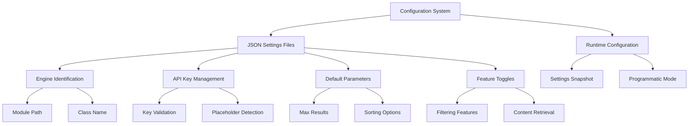
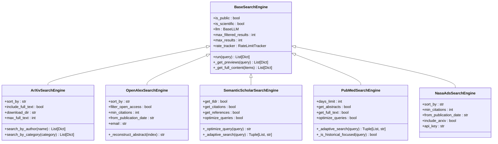
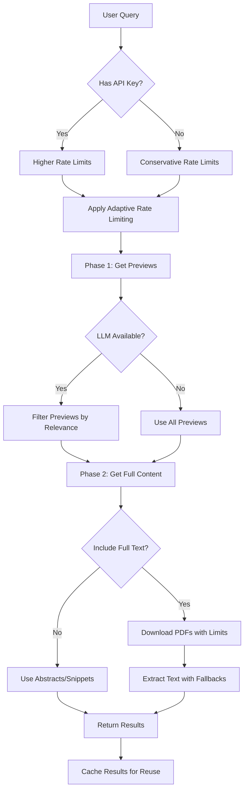
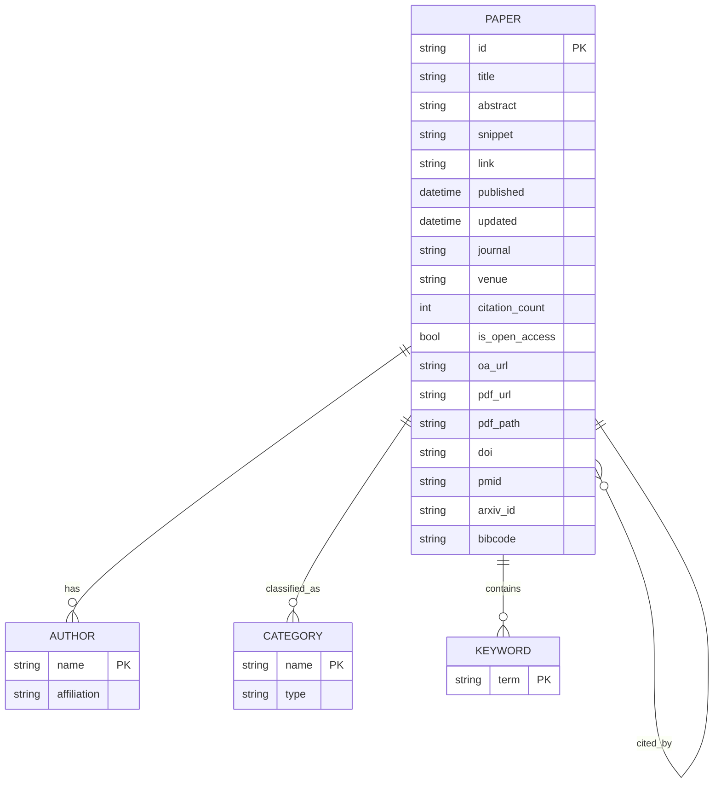
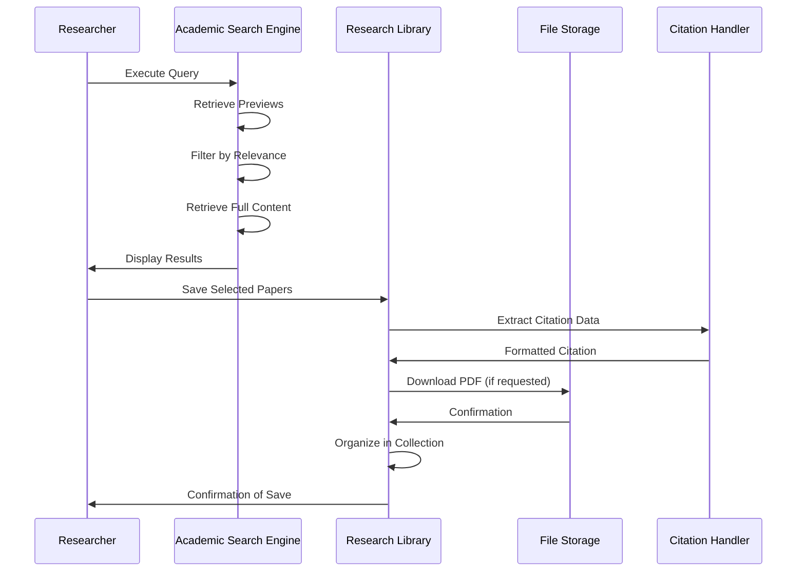

# Academic Search Engines

<cite>
**Referenced Files in This Document**   
- [search_engine_arxiv.py](file://src/local_deep_research/web_search_engines/engines/search_engine_arxiv.py)
- [search_engine_openalex.py](file://src/local_deep_research/web_search_engines/engines/search_engine_openalex.py)
- [search_engine_semantic_scholar.py](file://src/local_deep_research/web_search_engines/engines/search_engine_semantic_scholar.py)
- [search_engine_pubmed.py](file://src/local_deep_research/web_search_engines/engines/search_engine_pubmed.py)
- [search_engine_nasa_ads.py](file://src/local_deep_research/web_search_engines/engines/search_engine_nasa_ads.py)
- [settings_openalex.json](file://src/local_deep_research/defaults/settings_openalex.json)
- [settings_semantic_scholar.json](file://src/local_deep_research/defaults/settings_semantic_scholar.json)
- [settings_nasa_ads.json](file://src/local_deep_research/defaults/settings_nasa_ads.json)
- [settings_search_config.json](file://src/local_deep_research/defaults/settings_search_config.json)
- [search_engine_base.py](file://src/local_deep_research/web_search_engines/search_engine_base.py)
</cite>

## Table of Contents
1. [Introduction](#introduction)
2. [Configuration and API Key Management](#configuration-and-api-key-management)
3. [Academic Search Engine Specifications](#academic-search-engine-specifications)
4. [Query Parameter Reference](#query-parameter-reference)
5. [Rate Limiting and Performance Optimization](#rate-limiting-and-performance-optimization)
6. [Metadata Handling and Citation Extraction](#metadata-handling-and-citation-extraction)
7. [Integration with Research Library](#integration-with-research-library)
8. [Troubleshooting Common Issues](#troubleshooting-common-issues)

## Introduction
This document provides comprehensive guidance on configuring and utilizing academic search engines within the research system. The platform supports specialized academic databases including arXiv, OpenAlex, Semantic Scholar, PubMed, and NASA ADS, each offering unique capabilities for scholarly research. These academic search engines are designed with scientific research workflows in mind, providing access to peer-reviewed literature, preprints, and specialized academic metadata. The system implements a two-phase retrieval approach that first identifies relevant papers through preview information, then retrieves full content only for the most relevant results, optimizing both performance and resource usage. Each academic engine supports natural language queries and provides specialized parameters for filtering by publication date, author, citation metrics, and subject categories.

**Section sources**
- [search_engine_base.py](file://src/local_deep_research/web_search_engines/search_engine_base.py#L35-657)

## Configuration and API Key Management
Academic search engines require specific configuration through JSON settings files that define engine parameters, authentication requirements, and default behaviors. The configuration system distinguishes between engines that require API keys and those that operate without authentication. For engines requiring API keys, the system automatically retrieves credentials from the configuration, with validation to prevent the use of placeholder values. The configuration files are structured with hierarchical keys that specify engine properties, default parameters, and UI display settings.

OpenAlex operates without requiring an API key, making it accessible for immediate use, though users can optionally provide an email address to access the "polite pool" with higher rate limits. In contrast, NASA ADS requires a mandatory API key that must be obtained from the ADSABS portal. Semantic Scholar, PubMed, and arXiv support optional API keys that provide higher rate limits and improved performance. The system validates API keys by checking for common placeholder patterns and empty values, automatically disabling engines when valid credentials are not configured.

Configuration parameters are organized into categories including engine identification, reliability scoring, default search parameters, and feature toggles. Each engine's configuration includes metadata about its strengths and weaknesses, helping users select the appropriate database for their research domain. The system also supports programmatic mode, which disables database operations and uses memory-only tracking for automated workflows.

**Diagram sources**
- [settings_openalex.json](file://src/local_deep_research/defaults/settings_openalex.json#L1-253)
- [settings_semantic_scholar.json](file://src/local_deep_research/defaults/settings_semantic_scholar.json#L1-276)
- [settings_nasa_ads.json](file://src/local_deep_research/defaults/settings_nasa_ads.json#L1-255)

**Section sources**
- [settings_openalex.json](file://src/local_deep_research/defaults/settings_openalex.json#L1-253)
- [settings_semantic_scholar.json](file://src/local_deep_research/defaults/settings_semantic_scholar.json#L1-276)
- [settings_nasa_ads.json](file://src/local_deep_research/defaults/settings_nasa_ads.json#L1-255)

## Academic Search Engine Specifications
The system implements specialized search engines for each academic database, inheriting from a common base class that provides consistent functionality across all engines. Each engine is designed to leverage the unique features and API capabilities of its respective database, while maintaining a uniform interface for integration with the research system. The engines are classified as scientific/academic search engines, with specific optimizations for retrieving scholarly content.

arXiv Search Engine provides access to preprints in physics, mathematics, computer science, and related fields. It supports sorting by relevance, last updated date, or submission date, and can optionally download and process PDFs to extract full text content. The engine maintains a cache of paper objects to avoid redundant API calls when retrieving detailed information.

OpenAlex Search Engine offers comprehensive coverage of 250+ million academic papers across all disciplines. It supports natural language queries and provides extensive filtering options including open access status, minimum citation counts, and publication date ranges. The engine reconstructs abstracts from inverted index format and includes detailed metadata about citation metrics and journal information.

Semantic Scholar Search Engine specializes in computer science and related fields, offering AI-powered features such as TLDR summaries, citation graphs, and semantic search. It implements query optimization using LLMs to transform natural language questions into effective search queries, and includes adaptive search strategies that adjust based on result volume.

PubMed Search Engine focuses on biomedical literature and implements adaptive search strategies that adjust time filters based on topic volume. It can determine whether a query is focused on historical information and adjust search parameters accordingly. The engine supports complex query optimization and simplification strategies to improve retrieval effectiveness.

NASA ADS Search Engine provides access to astronomy, astrophysics, and physics papers, including both ArXiv preprints and published papers. It requires an API key for optimal performance and supports filtering by citation count, publication date, and inclusion of ArXiv preprints.

**Diagram sources**
- [search_engine_arxiv.py](file://src/local_deep_research/web_search_engines/engines/search_engine_arxiv.py#L1-520)
- [search_engine_openalex.py](file://src/local_deep_research/web_search_engines/engines/search_engine_openalex.py#L1-427)
- [search_engine_semantic_scholar.py](file://src/local_deep_research/web_search_engines/engines/search_engine_semantic_scholar.py#L1-648)
- [search_engine_pubmed.py](file://src/local_deep_research/web_search_engines/engines/search_engine_pubmed.py#L1-1782)
- [search_engine_nasa_ads.py](file://src/local_deep_research/web_search_engines/engines/search_engine_nasa_ads.py#L1-364)
- [search_engine_base.py](file://src/local_deep_research/web_search_engines/search_engine_base.py#L35-657)

**Section sources**
- [search_engine_arxiv.py](file://src/local_deep_research/web_search_engines/engines/search_engine_arxiv.py#L1-520)
- [search_engine_openalex.py](file://src/local_deep_research/web_search_engines/engines/search_engine_openalex.py#L1-427)
- [search_engine_semantic_scholar.py](file://src/local_deep_research/web_search_engines/engines/search_engine_semantic_scholar.py#L1-648)
- [search_engine_pubmed.py](file://src/local_deep_research/web_search_engines/engines/search_engine_pubmed.py#L1-1782)
- [search_engine_nasa_ads.py](file://src/local_deep_research/web_search_engines/engines/search_engine_nasa_ads.py#L1-364)

## Query Parameter Reference
Each academic search engine supports specialized query parameters that enable precise control over search results. These parameters can be configured through the settings system or passed directly to engine constructors, allowing researchers to tailor their queries to specific research needs.

### arXiv Query Parameters
| Parameter | Type | Default | Description |
|---------|------|---------|-------------|
| max_results | int | 10 | Maximum number of search results |
| sort_by | str | relevance | Sorting criteria (relevance, lastUpdatedDate, submittedDate) |
| sort_order | str | descending | Sort order (ascending or descending) |
| include_full_text | bool | false | Whether to download and process PDFs |
| download_dir | str | null | Directory to download PDFs to |
| max_full_text | int | 1 | Maximum number of PDFs to process |

### OpenAlex Query Parameters
| Parameter | Type | Default | Description |
|---------|------|---------|-------------|
| max_results | int | 25 | Maximum number of search results |
| email | str | null | Email for polite pool access (faster responses) |
| sort_by | str | relevance | Sort order (relevance, cited_by_count, publication_date) |
| filter_open_access | bool | false | Only return open access papers |
| min_citations | int | 0 | Minimum citation count filter |
| from_publication_date | str | null | Filter papers from this date (YYYY-MM-DD) |

### Semantic Scholar Query Parameters
| Parameter | Type | Default | Description |
|---------|------|---------|-------------|
| max_results | int | 10 | Maximum number of search results |
| api_key | str | null | API key for higher rate limits |
| year_range | tuple | null | Filter results by publication year range |
| get_abstracts | bool | true | Fetch abstracts for all results |
| get_tldr | bool | true | Fetch AI-generated TLDR summaries |
| get_citations | bool | false | Fetch citation information |
| get_references | bool | false | Fetch reference information |
| optimize_queries | bool | true | Use LLM to optimize natural language queries |
| fields_of_study | list | null | Filter by fields of study |
| publication_types | list | null | Filter by publication types |

### PubMed Query Parameters
| Parameter | Type | Default | Description |
|---------|------|---------|-------------|
| max_results | int | 10 | Maximum number of search results |
| api_key | str | null | NCBI API key for higher rate limits |
| days_limit | int | null | Limit results to N days |
| get_abstracts | bool | true | Fetch abstracts for all results |
| get_full_text | bool | false | Fetch full text content from PMC |
| full_text_limit | int | 3 | Maximum number of full-text articles to retrieve |
| optimize_queries | bool | true | Optimize natural language queries for PubMed |

### NASA ADS Query Parameters
| Parameter | Type | Default | Description |
|---------|------|---------|-------------|
| max_results | int | 25 | Maximum number of search results |
| api_key | str | required | NASA ADS API key |
| sort_by | str | relevance | Sort order (relevance, citation_count, date) |
| min_citations | int | 0 | Minimum citation count filter |
| from_publication_date | str | null | Filter papers from this date (YYYY-MM-DD) |
| include_arxiv | bool | true | Include ArXiv preprints in results |

**Section sources**
- [search_engine_arxiv.py](file://src/local_deep_research/web_search_engines/engines/search_engine_arxiv.py#L25-75)
- [search_engine_openalex.py](file://src/local_deep_research/web_search_engines/engines/search_engine_openalex.py#L24-96)
- [search_engine_semantic_scholar.py](file://src/local_deep_research/web_search_engines/engines/search_engine_semantic_scholar.py#L26-107)
- [search_engine_pubmed.py](file://src/local_deep_research/web_search_engines/engines/search_engine_pubmed.py#L25-96)
- [search_engine_nasa_ads.py](file://src/local_deep_research/web_search_engines/engines/search_engine_nasa_ads.py#L24-82)

## Rate Limiting and Performance Optimization
The system implements sophisticated rate limiting and performance optimization strategies tailored to the specific characteristics of academic search engines. Unlike commercial search engines with strict rate limits, academic databases have varying policies that require adaptive approaches to ensure reliable access while respecting API constraints.

The rate limiting system uses an adaptive tracker that monitors API response patterns and adjusts wait times accordingly. For engines like PubMed and NASA ADS, the system applies conservative rate limiting by default, with the ability to increase limits when API keys are provided. The tracker records outcomes of each request, including success/failure status and response times, to continuously refine its rate limiting strategy.

Performance optimization is achieved through a two-phase retrieval approach that minimizes API usage and network overhead. In the first phase, the system retrieves preview information (titles, snippets, metadata) for a larger number of results. In the second phase, only the most relevant results are selected for full content retrieval, significantly reducing bandwidth usage and processing time. This approach is particularly effective for academic databases where full content retrieval may involve downloading PDFs or making additional API calls.

Query optimization techniques are employed to improve search effectiveness and reduce the number of required API calls. For engines with LLM integration, natural language queries are transformed into optimized search syntax that better matches the database's indexing structure. The system also implements query simplification strategies that progressively remove filters and constraints when initial searches return no results, increasing the likelihood of finding relevant papers.

Caching mechanisms are used to store frequently accessed metadata and prevent redundant API calls. The system maintains caches of paper objects, author information, and journal metadata, reducing the need for repeated lookups. For PDF content, the system supports configurable download directories and limits on the number of PDFs processed per query to manage storage and processing resources.

**Diagram sources**
- [search_engine_base.py](file://src/local_deep_research/web_search_engines/search_engine_base.py#L299-433)
- [search_engine_arxiv.py](file://src/local_deep_research/web_search_engines/engines/search_engine_arxiv.py#L127-173)
- [search_engine_pubmed.py](file://src/local_deep_research/web_search_engines/engines/search_engine_pubmed.py#L581-646)

**Section sources**
- [search_engine_base.py](file://src/local_deep_research/web_search_engines/search_engine_base.py#L193-207)
- [search_engine_arxiv.py](file://src/local_deep_research/web_search_engines/engines/search_engine_arxiv.py#L117-123)
- [search_engine_pubmed.py](file://src/local_deep_research/web_search_engines/engines/search_engine_pubmed.py#L618-623)

## Metadata Handling and Citation Extraction
The system provides comprehensive metadata handling and citation extraction capabilities across all academic search engines, normalizing diverse metadata formats into a consistent structure for downstream processing. Each engine implements specialized methods for extracting and reconstructing metadata from its respective database, ensuring high-quality information is available for research analysis.

Metadata normalization follows a hierarchical structure with core fields including title, authors, publication date, journal/conference, abstract, and citation information. Additional fields such as DOIs, PMIDs, arXiv IDs, and bibliographic codes are preserved to enable precise referencing and cross-database linking. The system handles variations in metadata availability and format, providing fallback mechanisms when specific fields are missing.

Citation data is extracted and structured to support bibliometric analysis and reference management. For engines that provide citation information (Semantic Scholar, NASA ADS), the system retrieves both incoming citations (papers that cite the work) and outgoing references (papers cited by the work). Citation counts are normalized and made available as metadata fields, enabling filtering and sorting by impact metrics.

Abstract reconstruction is implemented for databases that store abstracts in non-standard formats. OpenAlex, for example, stores abstracts as inverted indexes mapping words to their positions, requiring reconstruction into coherent text. The system implements robust reconstruction algorithms that handle edge cases and preserve the original content structure.

Metadata enrichment is performed through integration with LLMs, which can extract additional context from paper content. For example, when full text is available, the system can use LLMs to identify key contributions, methodologies, and findings, enhancing the metadata beyond what is provided by the database.

**Diagram sources**
- [search_engine_openalex.py](file://src/local_deep_research/web_search_engines/engines/search_engine_openalex.py#L251-358)
- [search_engine_semantic_scholar.py](file://src/local_deep_research/web_search_engines/engines/search_engine_semantic_scholar.py#L549-567)
- [search_engine_pubmed.py](file://src/local_deep_research/web_search_engines/engines/search_engine_pubmed.py#L721-747)
- [search_engine_nasa_ads.py](file://src/local_deep_research/web_search_engines/engines/search_engine_nasa_ads.py#L307-322)

**Section sources**
- [search_engine_openalex.py](file://src/local_deep_research/web_search_engines/engines/search_engine_openalex.py#L251-358)
- [search_engine_semantic_scholar.py](file://src/local_deep_research/web_search_engines/engines/search_engine_semantic_scholar.py#L549-567)
- [search_engine_pubmed.py](file://src/local_deep_research/web_search_engines/engines/search_engine_pubmed.py#L721-747)
- [search_engine_nasa_ads.py](file://src/local_deep_research/web_search_engines/engines/search_engine_nasa_ads.py#L307-322)

## Integration with Research Library
Academic search engines are tightly integrated with the research library system, enabling seamless saving, organization, and retrieval of academic papers. The integration supports both manual and automated workflows, allowing researchers to build comprehensive collections of relevant literature. Papers retrieved from academic databases are automatically formatted with consistent metadata and stored in the research library with proper citation information.

The integration supports full-text access when available, with options to download and process PDFs from open access repositories. For engines like arXiv and PubMed, the system can automatically retrieve full text content and extract text for indexing and analysis. Downloaded papers are organized in configurable directories, with filename patterns that include author names, publication years, and titles for easy identification.

Citation handling is implemented through specialized handlers that extract and format citation information according to academic standards. The system supports multiple citation styles and can generate bibliographies in various formats. When papers are saved to the research library, their citation data is normalized and made available for reference management.

The integration also supports bidirectional synchronization, allowing researchers to search their local library alongside external academic databases. This enables comprehensive literature reviews that combine existing collections with newly discovered papers. The system can identify duplicate papers across sources and merge metadata to create complete records.

**Diagram sources**
- [search_engine_arxiv.py](file://src/local_deep_research/web_search_engines/engines/search_engine_arxiv.py#L204-258)
- [research_library](file://src/local_deep_research/research_library)
- [citation_handlers](file://src/local_deep_research/citation_handlers)

**Section sources**
- [search_engine_arxiv.py](file://src/local_deep_research/web_search_engines/engines/search_engine_arxiv.py#L204-258)
- [research_library](file://src/local_deep_research/research_library)
- [citation_handlers](file://src/local_deep_research/citation_handlers)

## Troubleshooting Common Issues
Researchers may encounter various issues when using academic search engines, ranging from configuration problems to API limitations. This section addresses common issues and provides guidance for resolution.

**API Key Configuration Issues**: For engines requiring API keys (NASA ADS, Semantic Scholar, PubMed), ensure the key is properly configured in the settings. The system validates API keys and disables engines when placeholder values are detected. Verify that the key is entered without quotes and does not contain whitespace. For NASA ADS, confirm that the key has been activated through the ADSABS portal.

**Rate Limiting**: Academic databases may impose rate limits that restrict query frequency. The system implements adaptive rate limiting to prevent violations, but aggressive search patterns may still trigger temporary blocks. If rate limiting occurs, reduce query frequency or obtain an API key for higher limits. Monitor the system logs for rate limit warnings and adjust search strategies accordingly.

**Metadata Inconsistencies**: Different databases may provide varying levels of metadata completeness. Some papers may lack abstracts, author affiliations, or citation counts. The system handles missing fields gracefully, but researchers should be aware that metadata quality varies by source and publication age. For critical applications, cross-reference information across multiple databases.

**Full-Text Access Limitations**: Not all papers are available in full text, particularly for subscription-based journals. The system prioritizes open access content and provides links to publisher pages when PDFs are unavailable. For PubMed, full text is only available for papers in PubMed Central (PMC). Consider institutional access or open access repositories for papers behind paywalls.

**Query Effectiveness**: Natural language queries may not always yield optimal results, especially for complex topics. Use the query optimization features when available, or construct precise search queries using field-specific syntax (e.g., author names, publication years, journal names). For PubMed, use MeSH terms to improve retrieval accuracy.

**API Deprecation**: Academic databases occasionally deprecate API endpoints or change response formats. The system is designed to handle common error patterns and provide meaningful error messages. Monitor the system logs for API deprecation warnings and update to newer API versions when available. The development team regularly updates the search engines to maintain compatibility with evolving APIs.

**Section sources**
- [search_engine_nasa_ads.py](file://src/local_deep_research/web_search_engines/engines/search_engine_nasa_ads.py#L113-115)
- [search_engine_pubmed.py](file://src/local_deep_research/web_search_engines/engines/search_engine_pubmed.py#L759-769)
- [search_engine_base.py](file://src/local_deep_research/web_search_engines/search_engine_base.py#L395-417)