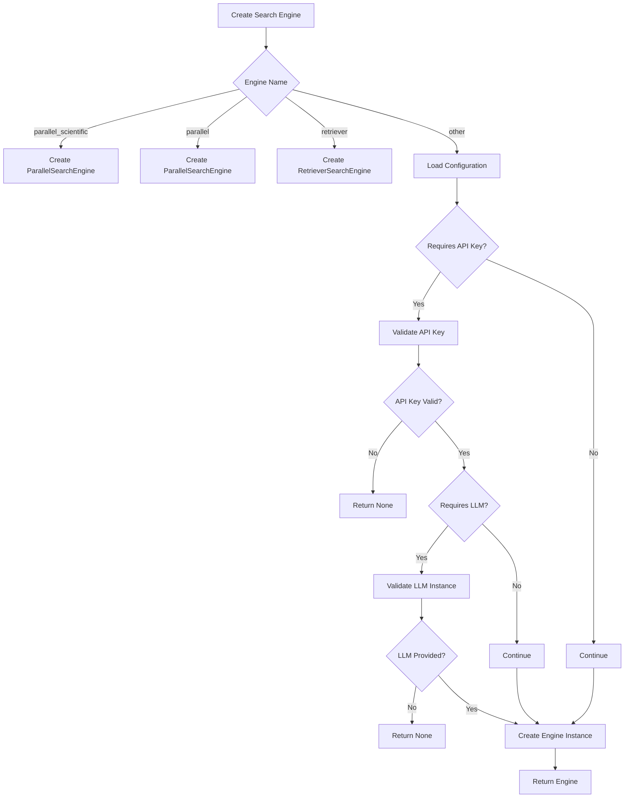
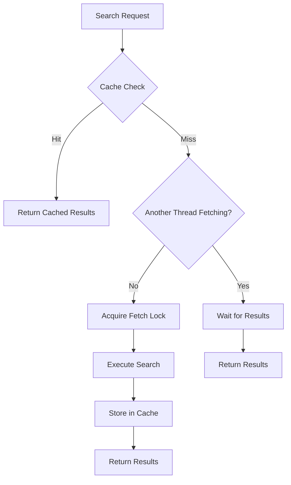
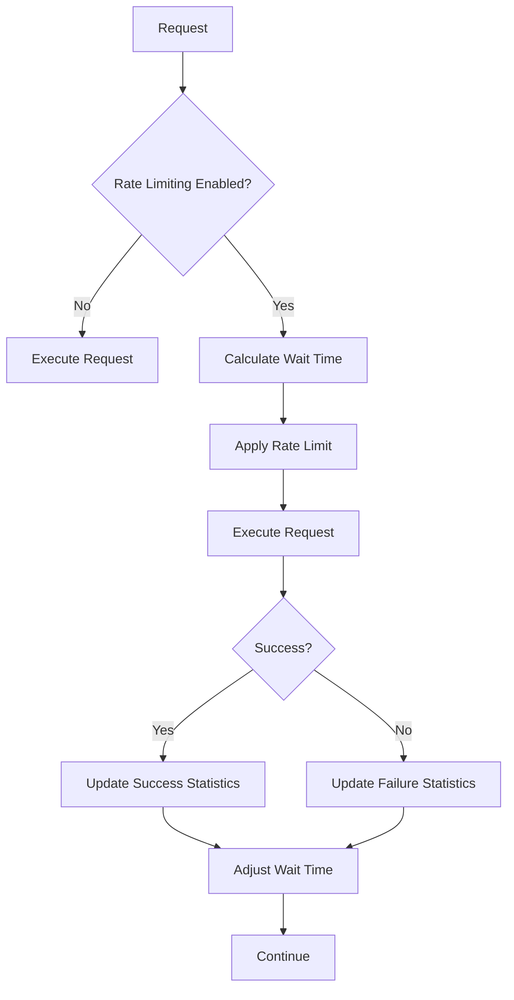

# General Web Search Engines

<cite>
**Referenced Files in This Document**   
- [search_engines_config.py](file://src/local_deep_research/web_search_engines/search_engines_config.py)
- [search_engine_factory.py](file://src/local_deep_research/web_search_engines/search_engine_factory.py)
- [search_engine_base.py](file://src/local_deep_research/web_search_engines/search_engine_base.py)
- [search_engine_serper.py](file://src/local_deep_research/web_search_engines/engines/search_engine_serper.py)
- [search_engine_scaleserp.py](file://src/local_deep_research/web_search_engines/engines/search_engine_scaleserp.py)
- [search_engine_tavily.py](file://src/local_deep_research/web_search_engines/engines/search_engine_tavily.py)
- [search_engine_google_pse.py](file://src/local_deep_research/web_search_engines/engines/search_engine_google_pse.py)
- [tracker.py](file://src/local_deep_research/web_search_engines/rate_limiting/tracker.py)
- [search_cache.py](file://src/local_deep_research/utilities/search_cache.py)
</cite>

## Table of Contents
1. [Introduction](#introduction)
2. [Configuration Schema](#configuration-schema)
3. [Provider Setup](#provider-setup)
4. [Search Engine Factory](#search-engine-factory)
5. [Runtime Configuration](#runtime-configuration)
6. [Performance Optimization](#performance-optimization)
7. [Integration with Core System](#integration-with-core-system)
8. [Troubleshooting](#troubleshooting)

## Introduction
This document provides comprehensive guidance on configuring commercial search APIs for the local deep research system. It covers setup procedures for Serper, Scaleserp, Tavily, and Google Programmable Search Engine, detailing configuration requirements, authentication methods, and integration patterns. The system implements a flexible search engine factory pattern that dynamically loads configurations and instantiates search providers based on runtime parameters. Key features include adaptive rate limiting, intelligent caching, and result normalization across different providers.

## Configuration Schema
The search engine configuration follows a standardized JSON schema that defines provider-specific parameters and global settings. The configuration is stored in the application's settings database and loaded at runtime through the search engine factory.

### Core Configuration Structure
The configuration schema uses a hierarchical structure with provider-specific sections under the `search.engine.web` namespace. Each search engine has its own configuration block with required fields:

```json
{
  "search.engine.web": {
    "serper": {
      "api_key": "your_api_key_here",
      "class_name": "SerperSearchEngine",
      "module_path": ".engines.search_engine_serper",
      "default_params": {
        "max_results": 10,
        "region": "us",
        "safe_search": true,
        "search_language": "en"
      }
    },
    "scaleserp": {
      "api_key": "your_api_key_here",
      "class_name": "ScaleSerpSearchEngine",
      "module_path": ".engines.search_engine_scaleserp",
      "default_params": {
        "max_results": 10,
        "location": "United States",
        "language": "en",
        "device": "desktop",
        "safe_search": true
      }
    }
  }
}
```

### Required Fields
Each search engine configuration requires the following fields:

**Configuration Fields**
- `api_key`: Authentication credential for the search API
- `module_path`: Python module path for the search engine implementation
- `class_name`: Class name of the search engine implementation
- `default_params`: Dictionary of default query parameters

**Query Parameter Options**
- `max_results`: Maximum number of results to return (1-100)
- `region`: Geographic region for localized results (e.g., 'us', 'gb')
- `safe_search`: Boolean flag to enable safe search filtering
- `search_language`: Language code for results (e.g., 'en', 'es')

**Section sources**
- [search_engines_config.py](file://src/local_deep_research/web_search_engines/search_engines_config.py#L60-L91)

## Provider Setup
Each commercial search API requires specific setup procedures and configuration parameters. The following sections detail the step-by-step configuration for each supported provider.

### Serper API Configuration
Serper provides Google search results through a simple API interface. Configuration requires an API key and supports various query parameters for result customization.

**Setup Steps**
1. Register at [serper.dev](https://serper.dev) to obtain an API key
2. Configure the API key in the application settings
3. Set default parameters for region, language, and result limits
4. Enable safe search filtering as needed

**Configuration Parameters**
- `api_key`: Required authentication token
- `region`: Country code for localized results
- `time_period`: Time filter ('day', 'week', 'month', 'year')
- `search_language`: Language code for results
- `safesearch`: Safety level ('off', 'moderate', 'active')

**Section sources**
- [search_engine_serper.py](file://src/local_deep_research/web_search_engines/engines/search_engine_serper.py#L27-L85)

### Scaleserp API Configuration
Scaleserp offers Google search results with built-in caching to reduce API costs. The service automatically caches identical queries for one hour.

**Setup Steps**
1. Sign up at [scaleserp.com](https://scaleserp.com) to get an API key
2. Configure the API key in the application settings
3. Set location, language, and device type preferences
4. Enable caching to benefit from free repeated searches

**Configuration Parameters**
- `api_key`: Required authentication token
- `location`: Geographic location for results
- `language`: Language code for results
- `device`: Device type ('desktop', 'mobile')
- `safe`: Safety filter ('on', 'off')
- `output`: Response format ('json', 'html')

**Section sources**
- [search_engine_scaleserp.py](file://src/local_deep_research/web_search_engines/engines/search_engine_scaleserp.py#L22-L84)

### Tavily API Configuration
Tavily provides AI-powered search results with content summarization capabilities. The API supports advanced search depth options and domain filtering.

**Setup Steps**
1. Create an account at [tavily.com](https://tavily.com) to obtain an API key
2. Configure the API key in the application settings or environment variables
3. Set search depth to 'basic' or 'advanced' based on quality requirements
4. Configure domain inclusion/exclusion lists as needed

**Configuration Parameters**
- `api_key`: Required authentication token
- `search_depth`: Quality level ('basic', 'advanced')
- `include_domains`: List of domains to include in results
- `exclude_domains`: List of domains to exclude from results
- `include_raw_content`: Whether to include full webpage content

**Section sources**
- [search_engine_tavily.py](file://src/local_deep_research/web_search_engines/engines/search_engine_tavily.py#L22-L84)

### Google Programmable Search Engine Configuration
Google's Programmable Search Engine (PSE) allows custom search implementations using Google's index. Configuration requires both an API key and a search engine ID.

**Setup Steps**
1. Create a custom search engine at [Google Programmable Search](https://programmablesearchengine.google.com)
2. Obtain the search engine ID from the control panel
3. Enable the Custom Search API in Google Cloud Console
4. Create credentials to obtain the API key
5. Configure both keys in the application settings

**Configuration Parameters**
- `api_key`: Google Cloud API key
- `search_engine_id`: Custom search engine identifier
- `safe`: Safety level ('active', 'off')
- `lr`: Language restriction (e.g., 'lang_en')
- `gl`: Country code for results

**Section sources**
- [search_engine_google_pse.py](file://src/local_deep_research/web_search_engines/engines/search_engine_google_pse.py#L23-L140)

## Search Engine Factory
The search engine factory pattern enables dynamic instantiation of search providers based on configuration and runtime parameters. The factory handles dependency injection, configuration validation, and error handling.

### Factory Implementation
The factory implementation in `search_engine_factory.py` follows these steps:

1. **Engine Selection**: Determine the requested search engine by name
2. **Configuration Retrieval**: Load engine configuration from settings
3. **Dependency Validation**: Check for required dependencies (API keys, LLM instances)
4. **Parameter Filtering**: Filter configuration parameters to match engine requirements
5. **Instance Creation**: Instantiate the search engine with validated parameters



**Diagram sources**
- [search_engine_factory.py](file://src/local_deep_research/web_search_engines/search_engine_factory.py#L13-L345)

### Configuration Loading Process
The factory uses a hierarchical configuration loading process that prioritizes runtime parameters over stored defaults:

1. **Settings Snapshot**: Check for thread-specific settings
2. **Database Configuration**: Fall back to stored user settings
3. **Environment Variables**: Use system environment variables
4. **Default Values**: Apply hardcoded defaults as last resort

This layered approach ensures flexibility while maintaining security through proper credential management.

**Section sources**
- [search_engine_factory.py](file://src/local_deep_research/web_search_engines/search_engine_factory.py#L73-L140)

## Runtime Configuration
The system supports dynamic configuration of search parameters at runtime, allowing fine-tuning of search behavior based on specific requirements.

### Result Limit Configuration
Result limits can be configured at multiple levels:

**Configuration Levels**
- Global default: 10 results
- Provider default: Engine-specific default
- Runtime override: Per-query parameter

The system enforces reasonable limits to prevent excessive API usage and ensure performance.

**Section sources**
- [search_engine_base.py](file://src/local_deep_research/web_search_engines/search_engine_base.py#L145-L146)

### Country Targeting
Geographic targeting is supported through region parameters that influence result localization:

**Region Configuration**
- `region`: Country code (e.g., 'us', 'gb', 'de')
- `location`: Human-readable location (e.g., 'United States', 'London,England')
- `gl`: Google-specific country parameter

These parameters help retrieve region-specific results while respecting local content availability.

**Section sources**
- [search_engine_serper.py](file://src/local_deep_research/web_search_engines/engines/search_engine_serper.py#L30-L31)
- [search_engine_scaleserp.py](file://src/local_deep_research/web_search_engines/engines/search_engine_scaleserp.py#L24-L25)

### Safe Search Settings
Safe search filtering can be enabled to filter explicit content:

**Safety Levels**
- `safe_search`: Boolean flag to enable filtering
- `safesearch`: Multi-level safety ('off', 'moderate', 'active')
- `safe`: Binary safety filter ('on', 'off')

The system applies these settings consistently across providers while respecting each API's specific implementation.

**Section sources**
- [search_engine_serper.py](file://src/local_deep_research/web_search_engines/engines/search_engine_serper.py#L32-L33)
- [search_engine_scaleserp.py](file://src/local_deep_research/web_search_engines/engines/search_engine_scaleserp.py#L27-L28)

## Performance Optimization
The system implements several performance optimization techniques to improve search efficiency and reduce API costs.

### Caching Strategies
The search cache utility provides multi-layer caching with TTL and LRU eviction:

**Cache Implementation**
- **Memory Cache**: LRU cache for frequently accessed results
- **Database Cache**: Persistent SQLite storage for long-term caching
- **Stampede Protection**: Thread-safe mechanisms to prevent cache thundering herds
- **Query Normalization**: Standardizes queries for consistent caching

The cache automatically handles query normalization, hash generation, and expiration management.



**Diagram sources**
- [search_cache.py](file://src/local_deep_research/utilities/search_cache.py#L132-L380)

### Parallel Query Execution
The system supports parallel execution of multiple search queries to improve throughput:

**Parallel Execution Features**
- Thread-safe rate limiting
- Concurrent API requests
- Result aggregation and deduplication
- Error isolation between parallel queries

This approach significantly reduces overall search time when multiple data sources are required.

**Section sources**
- [search_cache.py](file://src/local_deep_research/utilities/search_cache.py#L61-L67)

### Adaptive Rate Limiting
The adaptive rate limiting system learns optimal retry intervals based on historical performance:

**Rate Limiting Features**
- Machine learning-based wait time optimization
- Exploration vs. exploitation strategy
- Success rate monitoring
- Dynamic adjustment based on API response patterns

The system automatically adapts to each provider's rate limits while maximizing query throughput.



**Diagram sources**
- [tracker.py](file://src/local_deep_research/web_search_engines/rate_limiting/tracker.py#L226-L312)

## Integration with Core System
The search engines integrate with the core system through a standardized interface that ensures consistent behavior across different providers.

### Result Normalization
Results from different providers are normalized to a common format:

**Normalized Result Structure**
- `title`: Page title
- `snippet`: Content summary
- `link`: URL
- `displayed_link`: Domain for display
- `position`: Ranking position
- `id`: Unique identifier

This standardization enables consistent processing and presentation regardless of the source provider.

**Section sources**
- [search_engine_base.py](file://src/local_deep_research/web_search_engines/search_engine_base.py#L630-L641)

### Two-Phase Retrieval
The system implements a two-phase retrieval approach to optimize relevance and efficiency:

**Retrieval Phases**
1. **Preview Phase**: Retrieve metadata and snippets for many results
2. **Filtering Phase**: Apply relevance filtering using LLM
3. **Content Phase**: Retrieve full content for relevant results only

This approach minimizes API costs while maximizing result quality.

**Section sources**
- [search_engine_base.py](file://src/local_deep_research/web_search_engines/search_engine_base.py#L258-L394)

## Troubleshooting
Common issues and their solutions are documented to assist with configuration and operation.

### API Key Validation Failures
Issues with API key validation typically stem from configuration errors:

**Common Causes**
- Missing or incorrect API key
- Placeholder values in configuration
- Environment variable not set
- Database configuration not saved

**Resolution Steps**
1. Verify the API key is correctly entered
2. Check for placeholder values like 'YOUR_API_KEY_HERE'
3. Ensure environment variables are properly set
4. Validate the configuration is saved in the database

**Section sources**
- [search_engine_base.py](file://src/local_deep_research/web_search_engines/search_engine_base.py#L119-L138)

### Quota Exhaustion
API quota exhaustion can occur with excessive usage:

**Prevention Strategies**
- Implement caching to reduce redundant queries
- Use rate limiting to control request frequency
- Monitor usage through the provider's dashboard
- Upgrade API plan if necessary

The adaptive rate limiting system helps prevent quota exhaustion by learning optimal request intervals.

**Section sources**
- [tracker.py](file://src/local_deep_research/web_search_engines/rate_limiting/tracker.py#L349-L453)

### Response Format Changes
Provider API changes can affect response handling:

**Mitigation Approaches**
- Implement robust error handling
- Use defensive programming for JSON parsing
- Monitor provider API documentation
- Implement version compatibility layers

The system includes comprehensive error handling to gracefully manage unexpected response formats.

**Section sources**
- [search_engine_serper.py](file://src/local_deep_research/web_search_engines/engines/search_engine_serper.py#L233-L254)
- [search_engine_scaleserp.py](file://src/local_deep_research/web_search_engines/engines/search_engine_scaleserp.py#L237-L257)