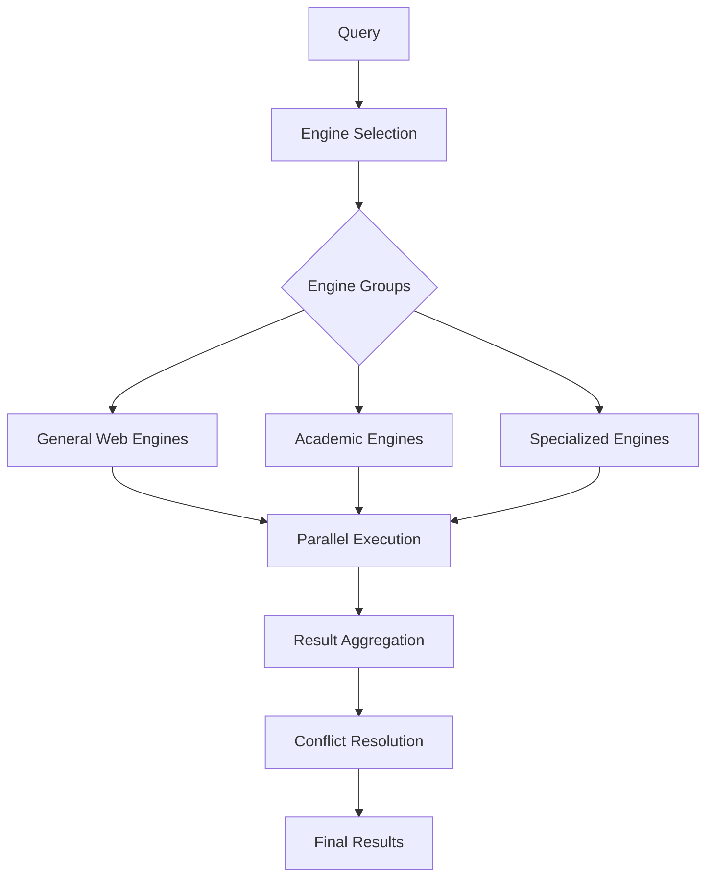
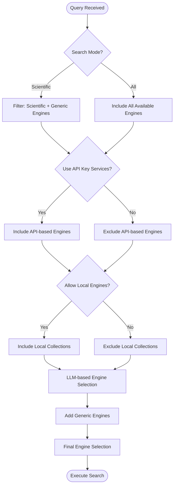
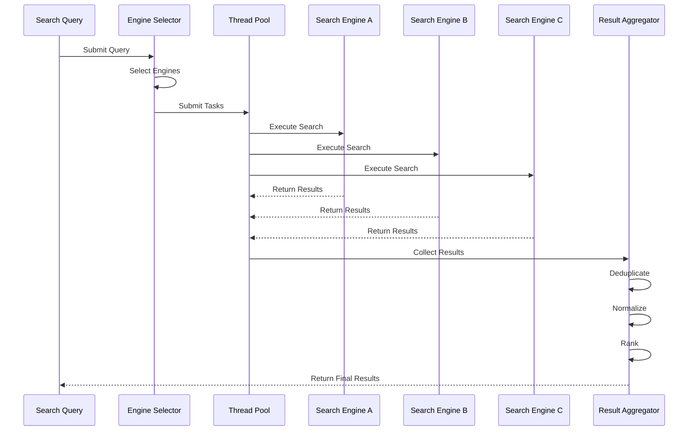
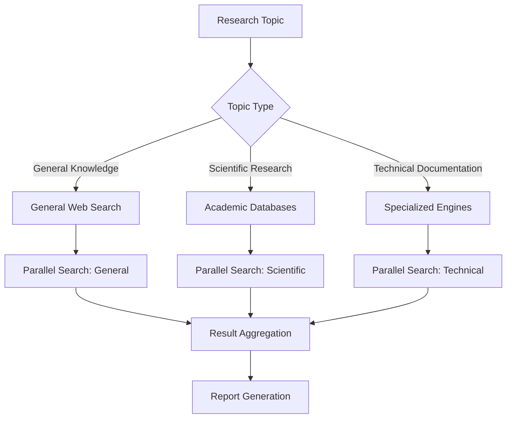

# Search Engine Collections and Parallel Strategies

<cite>
**Referenced Files in This Document**   
- [parallel.json](file://src/local_deep_research/defaults/settings/search_engines/parallel.json)
- [search_engines_config.py](file://src/local_deep_research/web_search_engines/search_engines_config.py)
- [search_engine_factory.py](file://src/local_deep_research/web_search_engines/search_engine_factory.py)
- [parallel_search_engine.py](file://src/local_deep_research/web_search_engines/engines/parallel_search_engine.py)
- [search_config.py](file://src/local_deep_research/config/search_config.py)
</cite>

## Table of Contents
1. [Introduction](#introduction)
2. [Search Engine Collections](#search-engine-collections)
3. [Parallel Search Architecture](#parallel-search-architecture)
4. [Configuration Structure](#configuration-structure)
5. [Engine Selection and Prioritization](#engine-selection-and-prioritization)
6. [Execution and Result Processing](#execution-and-result-processing)
7. [Performance and Resource Management](#performance-and-resource-management)
8. [Research Workflow Integration](#research-workflow-integration)
9. [Troubleshooting and Optimization](#troubleshooting-and-optimization)
10. [Conclusion](#conclusion)

## Introduction

The search engine collection system enables parallel execution of multiple search engines to gather comprehensive results from diverse sources. This document details the architecture, configuration, and operational principles of the parallel search system, focusing on how custom collections are created, configured, and executed in parallel to optimize research outcomes.

**Section sources**
- [parallel.json](file://src/local_deep_research/defaults/settings/search_engines/parallel.json)

## Search Engine Collections

The system supports various types of search engine collections that can be configured through JSON settings. These collections include general web search engines, academic databases, and specialized search services. The configuration system allows users to define custom collections by specifying engine parameters, priorities, and execution constraints.

Collections are registered dynamically based on user configuration and available services. The system automatically detects and incorporates local document collections, library RAG (Retrieval-Augmented Generation) systems, and external search APIs into the available engine pool. Each collection is represented as a configurable entity with specific capabilities, requirements, and performance characteristics.

The collection system supports both static configuration through JSON files and dynamic registration during runtime. This flexibility allows for adaptive research workflows that can incorporate new data sources as they become available.

**Section sources**
- [search_engines_config.py](file://src/local_deep_research/web_search_engines/search_engines_config.py)

## Parallel Search Architecture

The parallel search system is built around a shared thread pool architecture that ensures efficient resource utilization across multiple search operations. All instances of the `ParallelSearchEngine` share a global `ThreadPoolExecutor` instance, preventing thread proliferation and ensuring consistent performance characteristics.

**Diagram sources**
- [parallel_search_engine.py](file://src/local_deep_research/web_search_engines/engines/parallel_search_engine.py)

The architecture implements a factory pattern for search engine creation, where the `create_search_engine` function handles instantiation of both individual engines and composite searchers. This design enables consistent configuration management and parameter validation across all search components.

**Section sources**
- [search_engine_factory.py](file://src/local_deep_research/web_search_engines/search_engine_factory.py)
- [parallel_search_engine.py](file://src/local_deep_research/web_search_engines/engines/parallel_search_engine.py)

## Configuration Structure

The parallel search configuration is defined in the `parallel.json` file, which contains a comprehensive set of parameters for controlling search behavior. The configuration follows a hierarchical structure with category-based organization.

### Core Configuration Parameters

| Parameter | Description | Type | Default | Constraints |
|---------|-----------|------|---------|-----------|
| max_engines_to_select | Maximum number of search engines to select and run in parallel | number | 5 | 1-10 |
| use_api_key_services | Include search engines that require API keys | checkbox | true | - |
| allow_local_engines | Allow local/private document engines in parallel search | checkbox | false | - |
| enable_llm_relevance_filter | Enable LLM-based relevance filtering | checkbox | true | - |
| reliability | Reliability rating of the parallel search engine | range | 0.90 | 0.0-1.0 |

The configuration also includes metadata fields such as display name, description, and UI element specifications that control how the search engine appears in the user interface. Each parameter is annotated with validation rules, including minimum and maximum values, step increments, and visibility settings.

The system supports different search modes through the `SearchMode` enum, with `ALL` for comprehensive searches and `SCIENTIFIC` for academic-focused queries. Mode-specific filtering ensures appropriate engine selection based on the research context.

**Section sources**
- [parallel.json](file://src/local_deep_research/defaults/settings/search_engines/parallel.json)

## Engine Selection and Prioritization

The engine selection process combines automated classification with configurable priorities to determine the most appropriate search engines for each query. The system uses a multi-stage selection algorithm that considers engine capabilities, query characteristics, and user preferences.

### Selection Algorithm

**Diagram sources**
- [parallel_search_engine.py](file://src/local_deep_research/web_search_engines/engines/parallel_search_engine.py)

The selection process begins with mode-based filtering, followed by API key and privacy considerations. For queries requiring intelligent selection, the system uses an LLM to analyze the query and recommend appropriate engines based on their documented strengths and capabilities.

Engine prioritization is influenced by several factors:
- **Reliability ratings**: Configurable reliability scores that influence engine ranking
- **Specialization flags**: `is_scientific`, `is_generic`, and `is_public` attributes that categorize engines
- **Usage statistics**: Historical performance data that can inform selection decisions
- **User preferences**: Configuration settings that reflect user priorities

The system also implements fallback mechanisms for cases where LLM-based selection fails, ensuring robust operation even when advanced features are unavailable.

**Section sources**
- [parallel_search_engine.py](file://src/local_deep_research/web_search_engines/engines/parallel_search_engine.py)

## Execution and Result Processing

The parallel execution system processes search queries by distributing them across multiple engines simultaneously, then aggregating and normalizing the results. The execution pipeline consists of several coordinated stages that ensure comprehensive coverage and consistent output.

### Execution Pipeline

**Diagram sources**
- [parallel_search_engine.py](file://src/local_deep_research/web_search_engines/engines/parallel_search_engine.py)

The execution process begins with engine selection, followed by parallel task submission to the shared thread pool. Each engine executes independently, with results collected as they become available. The system implements timeout handling and error recovery to manage partial failures gracefully.

Result processing includes several key steps:
- **Deduplication**: Removing duplicate results across different engines
- **Normalization**: Standardizing result formats and metadata
- **Ranking**: Applying relevance scoring and sorting
- **Filtering**: Applying LLM-based relevance filtering when enabled
- **Enrichment**: Adding source attribution and quality indicators

The system also supports different result retrieval modes, including snippet-only mode for faster responses and full-content retrieval for comprehensive analysis.

**Section sources**
- [parallel_search_engine.py](file://src/local_deep_research/web_search_engines/engines/parallel_search_engine.py)

## Performance and Resource Management

The parallel search system implements several resource management strategies to balance performance, efficiency, and reliability. The shared thread pool architecture ensures optimal resource utilization while preventing system overload.

### Resource Configuration

| Parameter | Purpose | Default Value | Impact |
|---------|---------|---------------|--------|
| max_workers | Maximum thread pool size | min(32, (CPU+4)) | Controls concurrency level |
| max_results | Maximum results per engine | 10 | Affects memory usage and processing time |
| max_filtered_results | Maximum results after filtering | 50 | Controls final result set size |
| timeout | Per-engine timeout | Configurable | Prevents hanging queries |

The system automatically adjusts thread pool size based on available CPU resources, using Python's recommended formula for I/O-bound operations. This adaptive sizing ensures optimal performance across different hardware configurations.

Resource monitoring is integrated through socket events that provide real-time feedback on search progress, including:
- Engines started and completed
- Success and failure rates
- Execution timing
- Result counts

The system also implements caching mechanisms to reduce redundant operations, with engine instances cached for reuse during the same research session. This reduces initialization overhead and improves response times for sequential queries.

**Section sources**
- [parallel_search_engine.py](file://src/local_deep_research/web_search_engines/engines/parallel_search_engine.py)

## Research Workflow Integration

The parallel search system integrates with various research workflows, enabling specialized search strategies for different research modes and query types. The configuration system supports template-based search engine creation, allowing predefined collections for specific research domains.

### Specialized Research Workflows

**Diagram sources**
- [search_engine_factory.py](file://src/local_deep_research/web_search_engines/search_engine_factory.py)

The system supports several specialized workflows:
- **Scientific research**: Prioritizes academic databases like arXiv, PubMed, and Semantic Scholar
- **General knowledge**: Focuses on comprehensive web search engines
- **Technical documentation**: Targets specialized sources like GitHub and technical documentation sites
- **News and current events**: Utilizes news-specific engines like Wikinews and The Guardian

Each workflow can be configured with appropriate engine groups, timeout settings, and result processing strategies. The system also supports hybrid workflows that combine multiple search modes for comprehensive research.

The search engine factory creates composite searchers from configuration templates, allowing users to define custom search strategies for specific research needs. These templates can include pre-configured engine groups, priority settings, and processing rules.

**Section sources**
- [search_engine_factory.py](file://src/local_deep_research/web_search_engines/search_engine_factory.py)

## Troubleshooting and Optimization

The system includes several mechanisms for troubleshooting and optimizing parallel search operations. These features help identify and resolve common issues while providing guidance for performance optimization.

### Common Issues and Solutions

| Issue | Symptoms | Diagnosis | Solution |
|------|---------|-----------|----------|
| Partial failures | Some engines fail while others succeed | Check API key configuration and network connectivity | Verify API keys and service availability |
| Inconsistent results | Varying result quality across engines | Analyze engine reliability ratings and specialization | Adjust engine selection criteria |
| Performance bottlenecks | Slow response times | Monitor thread pool utilization and engine timeouts | Optimize thread pool size and timeout settings |
| Resource exhaustion | High memory or CPU usage | Track concurrent operations and result set sizes | Adjust max_results and max_workers settings |

The system provides detailed logging and monitoring capabilities to assist with troubleshooting. Log entries include information about engine selection, execution status, and result processing, enabling comprehensive analysis of search operations.

Optimization recommendations include:
- **Configuration tuning**: Adjusting max_engines_to_select based on query complexity
- **Resource allocation**: Optimizing thread pool size for available hardware
- **Engine selection**: Refining criteria to match research objectives
- **Caching strategies**: Leveraging engine instance caching for sequential queries
- **Load balancing**: Distributing queries across engine groups based on reliability and performance

The system also supports programmatic mode for testing and optimization, allowing developers to experiment with different configurations and measure their impact on performance and result quality.

**Section sources**
- [parallel_search_engine.py](file://src/local_deep_research/web_search_engines/engines/parallel_search_engine.py)

## Conclusion

The search engine collection and parallel search system provides a comprehensive framework for executing complex research workflows across multiple data sources. By combining intelligent engine selection, parallel execution, and sophisticated result processing, the system enables efficient and thorough information gathering.

Key advantages of the system include:
- **Comprehensive coverage**: Access to diverse search engines and data sources
- **Efficient execution**: Parallel processing with optimized resource management
- **Adaptive selection**: Intelligent engine selection based on query characteristics
- **Flexible configuration**: Customizable collections for different research needs
- **Robust operation**: Graceful handling of partial failures and edge cases

The system's modular architecture and comprehensive configuration options make it suitable for a wide range of research applications, from academic investigations to technical analysis. By understanding the configuration parameters and operational principles outlined in this document, users can optimize their search strategies for maximum effectiveness.