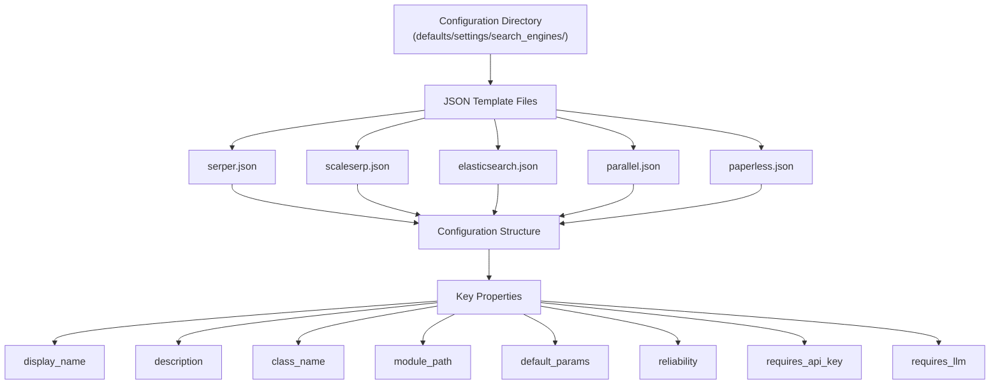
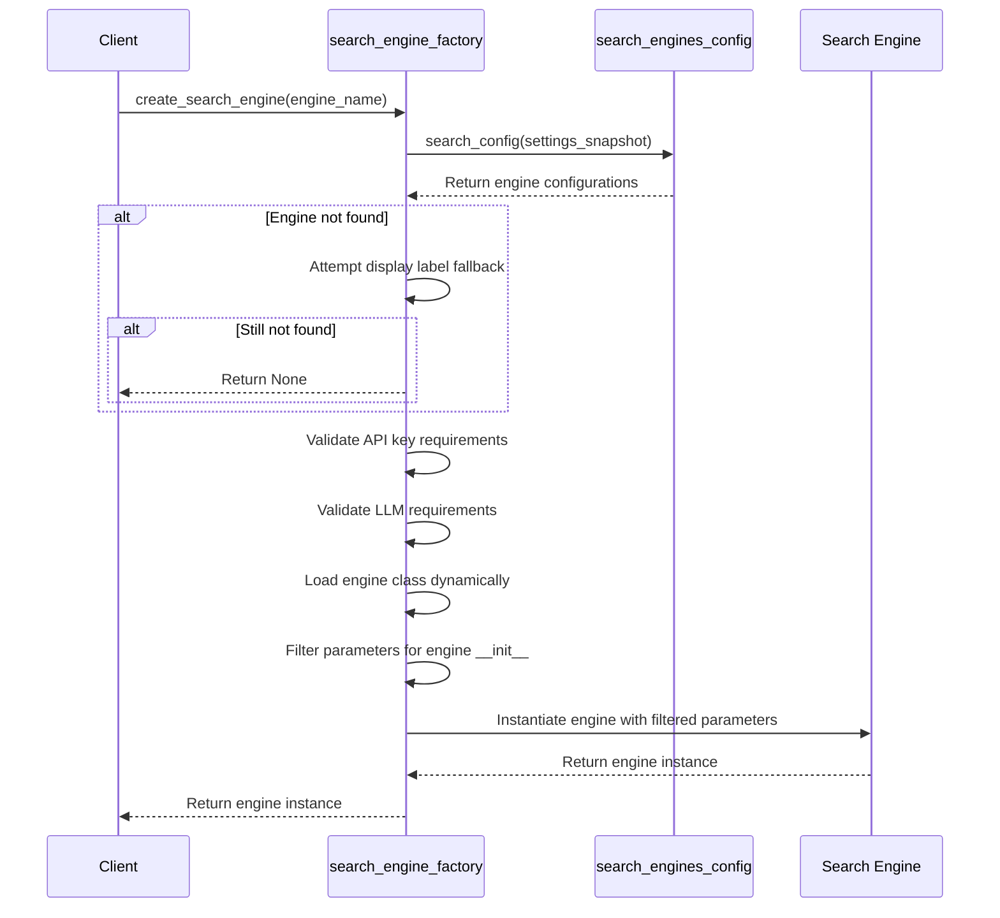
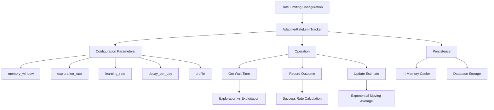
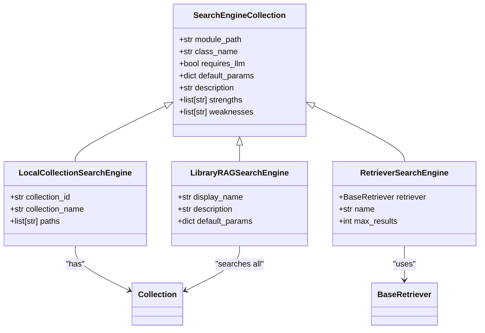

# Search Engine Configuration

<cite>
**Referenced Files in This Document**   
- [search_engine_factory.py](file://src/local_deep_research/web_search_engines/search_engine_factory.py)
- [search_engines_config.py](file://src/local_deep_research/web_search_engines/search_engines_config.py)
- [search_engine_base.py](file://src/local_deep_research/web_search_engines/search_engine_base.py)
- [search_engine_serper.py](file://src/local_deep_research/web_search_engines/engines/search_engine_serper.py)
- [search_engine_scaleserp.py](file://src/local_deep_research/web_search_engines/engines/search_engine_scaleserp.py)
- [search_engine_elasticsearch.py](file://src/local_deep_research/web_search_engines/engines/search_engine_elasticsearch.py)
- [search_engine_openalex.py](file://src/local_deep_research/web_search_engines/engines/search_engine_openalex.py)
- [search_engine_semantic_scholar.py](file://src/local_deep_research/web_search_engines/engines/search_engine_semantic_scholar.py)
- [parallel_search_engine.py](file://src/local_deep_research/web_search_engines/engines/parallel_search_engine.py)
- [tracker.py](file://src/local_deep_research/web_search_engines/rate_limiting/tracker.py)
- [retriever_registry.py](file://src/local_deep_research/web_search_engines/retriever_registry.py)
- [elasticsearch.json](file://src/local_deep_research/defaults/settings/search_engines/elasticsearch.json)
- [serper.json](file://src/local_deep_research/defaults/settings/search_engines/serper.json)
- [scaleserp.json](file://src/local_deep_research/defaults/settings/search_engines/scaleserp.json)
- [parallel.json](file://src/local_deep_research/defaults/settings/search_engines/parallel.json)
- [paperless.json](file://src/local_deep_research/defaults/settings/search_engines/paperless.json)
</cite>

## Table of Contents
1. [Introduction](#introduction)
2. [JSON Configuration Structure](#json-configuration-structure)
3. [Search Engine Factory Pattern](#search-engine-factory-pattern)
4. [API Key Management](#api-key-management)
5. [Rate Limiting Configuration](#rate-limiting-configuration)
6. [Endpoint Customization](#endpoint-customization)
7. [Parallel Search Strategies](#parallel-search-strategies)
8. [Custom Search Engine Collections](#custom-search-engine-collections)
9. [Academic Search Engines](#academic-search-engines)
10. [Troubleshooting Common Issues](#troubleshooting-common-issues)
11. [Security Considerations](#security-considerations)
12. [Performance Optimization](#performance-optimization)

## Introduction
This document provides comprehensive guidance on configuring search engines within the local deep research system. It covers the configuration of various search engines including Serper, Scaleserp, Elasticsearch, and academic sources like Semantic Scholar and OpenAlex. The document explains the JSON configuration structure used in the defaults/settings/search_engines/ directory and how these templates are loaded. It details API key management, rate limiting configuration, and endpoint customization for each search engine. The search engine factory pattern that instantiates configured engines at runtime is explained, along with troubleshooting guidance for common configuration issues and security considerations when storing API credentials.

**Section sources**
- [search_engine_factory.py](file://src/local_deep_research/web_search_engines/search_engine_factory.py#L1-L619)
- [search_engines_config.py](file://src/local_deep_research/web_search_engines/search_engines_config.py#L1-L367)

## JSON Configuration Structure
The search engine configuration system uses JSON templates stored in the defaults/settings/search_engines/ directory to define the structure and parameters for each search engine. Each JSON file contains a flat configuration structure that is converted into nested dictionaries during runtime. The configuration includes essential metadata such as display name, description, class name, and module path, along with default parameters specific to each search engine.

The configuration structure follows a consistent pattern where each setting is defined with properties including category, description, editable status, type, UI element type, value, and visibility. For example, the Serper configuration includes parameters for region, search language, safe search, time period, and reliability. Similarly, the Scaleserp configuration includes location, language, device type, and caching options. The Elasticsearch configuration defines hosts, index name, authentication credentials, and search fields.

**Diagram sources **
- [elasticsearch.json](file://src/local_deep_research/defaults/settings/search_engines/elasticsearch.json)
- [serper.json](file://src/local_deep_research/defaults/settings/search_engines/serper.json)
- [scaleserp.json](file://src/local_deep_research/defaults/settings/search_engines/scaleserp.json)
- [parallel.json](file://src/local_deep_research/defaults/settings/search_engines/parallel.json)
- [paperless.json](file://src/local_deep_research/defaults/settings/search_engines/paperless.json)

**Section sources**
- [elasticsearch.json](file://src/local_deep_research/defaults/settings/search_engines/elasticsearch.json)
- [serper.json](file://src/local_deep_research/defaults/settings/search_engines/serper.json)
- [scaleserp.json](file://src/local_deep_research/defaults/settings/search_engines/scaleserp.json)
- [parallel.json](file://src/local_deep_research/defaults/settings/search_engines/parallel.json)
- [paperless.json](file://src/local_deep_research/defaults/settings/search_engines/paperless.json)

## Search Engine Factory Pattern
The search engine factory pattern is implemented in the create_search_engine function within search_engine_factory.py. This pattern provides a centralized mechanism for instantiating search engine instances based on configuration data. The factory handles the dynamic loading of engine classes, parameter validation, and dependency injection.

The factory process begins by extracting search engine configurations from the settings snapshot. It then validates the requested engine name against the available configurations, with fallback logic for display labels. For engines requiring API keys, the factory retrieves credentials from the settings snapshot or configuration. The factory also handles LLM requirements, ensuring that engines that need language models receive them during instantiation.

**Diagram sources **
- [search_engine_factory.py](file://src/local_deep_research/web_search_engines/search_engine_factory.py#L13-L619)
- [search_engines_config.py](file://src/local_deep_research/web_search_engines/search_engines_config.py#L94-L302)

**Section sources**
- [search_engine_factory.py](file://src/local_deep_research/web_search_engines/search_engine_factory.py#L13-L619)
- [search_engines_config.py](file://src/local_deep_research/web_search_engines/search_engines_config.py#L94-L302)

## API Key Management
API key management is a critical aspect of search engine configuration, particularly for services like Serper, Scaleserp, and Elasticsearch. The system handles API keys through the settings snapshot mechanism, where keys are stored securely and retrieved at runtime. For engines requiring API keys, the configuration includes a dedicated api_key field with password UI element type to ensure secure input.

The factory pattern implementation includes specific logic for API key validation, checking for common placeholder values and empty strings that indicate missing configuration. When creating an engine instance, the factory retrieves the API key from the settings snapshot and passes it to the engine's initialization parameters. The system also supports environment variable integration for API keys, allowing for secure credential management in different deployment environments.

For academic search engines like Semantic Scholar and OpenAlex, API key management follows the same pattern, with dedicated configuration fields for authentication credentials. The system validates the presence of API keys before attempting to instantiate engines, returning None if required credentials are missing to prevent failed API calls.

**Section sources**
- [search_engine_factory.py](file://src/local_deep_research/web_search_engines/search_engine_factory.py#L155-L186)
- [serper.json](file://src/local_deep_research/defaults/settings/search_engines/serper.json)
- [scaleserp.json](file://src/local_deep_research/defaults/settings/search_engines/scaleserp.json)
- [elasticsearch.json](file://src/local_deep_research/defaults/settings/search_engines/elasticsearch.json)

## Rate Limiting Configuration
The rate limiting system is implemented through the AdaptiveRateLimitTracker class in the rate_limiting module. This adaptive system learns optimal retry wait times for each search engine based on historical performance data. The tracker maintains in-memory estimates of wait times and persists this data to the application database for long-term learning.

Rate limiting configuration is controlled through settings that include memory_window, exploration_rate, learning_rate, and decay_per_day. These parameters determine how the system balances exploration of faster rates with exploitation of known reliable rates. The system supports different rate limiting profiles (conservative, balanced, aggressive) that adjust these parameters for different use cases.

The tracker records outcomes of each search attempt, including success/failure status, wait time, and result count. This data is used to update wait time estimates using an exponential moving average with a configurable learning rate. The system applies bounds to prevent extreme wait times and includes decay for old estimates to adapt to changing API rate limits.

**Diagram sources **
- [tracker.py](file://src/local_deep_research/web_search_engines/rate_limiting/tracker.py#L43-L762)

**Section sources**
- [tracker.py](file://src/local_deep_research/web_search_engines/rate_limiting/tracker.py#L43-L762)

## Endpoint Customization
Endpoint customization allows users to configure specific parameters for each search engine to tailor its behavior to their needs. The configuration system supports various UI elements for different parameter types, including text inputs, checkboxes, dropdowns, number inputs, and JSON arrays. This flexibility enables precise control over search engine behavior.

For web search engines like Serper and Scaleserp, customizable endpoints include region, language, device type, and time period filters. Elasticsearch configuration allows customization of hosts, index names, authentication methods, and search fields. The parallel search engine supports configuration of the maximum number of engines to select and whether to include API key services.

The system also supports advanced customization through JSON parameters, allowing complex configurations like search fields and highlight fields for Elasticsearch. Each customizable parameter includes metadata such as description, visibility, and editability, which determines how it appears in the user interface. This metadata-driven approach ensures consistency across different search engines while allowing for engine-specific customization options.

**Section sources**
- [serper.json](file://src/local_deep_research/defaults/settings/search_engines/serper.json)
- [scaleserp.json](file://src/local_deep_research/defaults/settings/search_engines/scaleserp.json)
- [elasticsearch.json](file://src/local_deep_research/defaults/settings/search_engines/elasticsearch.json)
- [parallel.json](file://src/local_deep_research/defaults/settings/search_engines/parallel.json)

## Parallel Search Strategies
The parallel search strategy is implemented through the ParallelSearchEngine class, which executes multiple search engines simultaneously and combines their results. This approach leverages the strengths of different engines while mitigating their individual weaknesses. The parallel search engine uses an LLM to intelligently select the most appropriate engines for each query based on the query context.

Configuration of parallel search is managed through the parallel.json template, which includes parameters for maximum engines to select, whether to use API key services, and whether to allow local engines. The allow_local_engines option includes a privacy warning about potential exposure of personal data from local document collections.

The system supports different parallel search variants through special engine names: "parallel" for standard mode and "parallel_scientific" for scientific mode. These variants use different search modes (ALL vs SCIENTIFIC) to optimize engine selection for different types of queries. The parallel search engine also supports LLM-based relevance filtering to improve result quality by filtering out irrelevant results from the combined results.

**Section sources**
- [parallel.json](file://src/local_deep_research/defaults/settings/search_engines/parallel.json)
- [search_engine_factory.py](file://src/local_deep_research/web_search_engines/search_engine_factory.py#L39-L58)
- [parallel_search_engine.py](file://src/local_deep_research/web_search_engines/engines/parallel_search_engine.py)

## Custom Search Engine Collections
Custom search engine collections are implemented through the local document collections system, which allows users to register local document collections as search engines. The system extracts per-engine configuration from the settings database and creates engine configurations for each enabled collection.

Local collections are registered as search engines with specific module paths and class names, allowing them to be used alongside web search engines. The configuration supports paths to local documents, enabling users to search their personal document archives. The system also registers the Library RAG as a search engine, providing semantic search across all curated collections.

The retriever registry allows for dynamic registration of LangChain retrievers as search engines, expanding the system's capabilities beyond predefined engines. Registered retrievers are automatically added to the available search engines with appropriate configuration, including module path, class name, and descriptive metadata.

**Diagram sources **
- [search_engines_config.py](file://src/local_deep_research/web_search_engines/search_engines_config.py#L157-L299)
- [retriever_registry.py](file://src/local_deep_research/web_search_engines/retriever_registry.py#L12-L110)

**Section sources**
- [search_engines_config.py](file://src/local_deep_research/web_search_engines/search_engines_config.py#L157-L299)
- [retriever_registry.py](file://src/local_deep_research/web_search_engines/retriever_registry.py#L12-L110)

## Academic Search Engines
Academic search engines for sources like Semantic Scholar and OpenAlex are configured similarly to other search engines but with parameters specific to academic content retrieval. These engines are designed to search scholarly articles, research papers, and academic databases, providing access to peer-reviewed literature and scientific research.

The configuration for academic search engines includes parameters for search fields, result formatting, and citation handling. These engines typically require API keys for authentication and may have specific rate limits due to the nature of academic databases. The system handles these engines through the same factory pattern, ensuring consistent instantiation and parameter handling.

Academic search engines are optimized for scientific queries and benefit from LLM-based relevance filtering due to their keyword-based search nature. The system automatically enables LLM relevance filtering for scientific engines to improve result quality. These engines are also integrated into the parallel search strategy, allowing them to be selected automatically for queries with academic or scientific context.

**Section sources**
- [search_engine_semantic_scholar.py](file://src/local_deep_research/web_search_engines/engines/search_engine_semantic_scholar.py)
- [search_engine_openalex.py](file://src/local_deep_research/web_search_engines/engines/search_engine_openalex.py)
- [search_engine_base.py](file://src/local_deep_research/web_search_engines/search_engine_base.py#L49-L51)

## Troubleshooting Common Issues
Common configuration issues include authentication failures, rate limiting errors, and incorrect parameter settings. Authentication failures typically occur when API keys are missing, invalid, or contain placeholder values. The system checks for common placeholder patterns and empty strings, logging warnings when these are detected.

Rate limiting errors can occur when search engines are queried too frequently. The adaptive rate limiting system helps mitigate this by learning optimal wait times, but initial configuration may require adjustment of rate limiting parameters. Users can reset rate limit data for specific engines using the reset_engine method to clear learned values and start fresh.

Parameter configuration issues often arise from incorrect JSON formatting, especially for array parameters like search fields and highlight fields. Users should ensure that JSON arrays are properly formatted with square brackets and quoted values. The system validates parameter types during engine instantiation, filtering out unsupported parameters to prevent initialization errors.

For academic search engines, common issues include insufficient API key permissions or exceeding query limits. Users should verify their API key has the necessary permissions and monitor their usage against the service's rate limits. The system provides detailed logging of search operations, which can help diagnose configuration issues by showing the parameters passed to each engine.

**Section sources**
- [search_engine_factory.py](file://src/local_deep_research/web_search_engines/search_engine_factory.py#L177-L181)
- [search_engine_base.py](file://src/local_deep_research/web_search_engines/search_engine_base.py#L119-L137)
- [tracker.py](file://src/local_deep_research/web_search_engines/rate_limiting/tracker.py#L226-L229)

## Security Considerations
Security considerations for search engine configuration focus on protecting API credentials and preventing unauthorized access to sensitive data. API keys are stored securely in the settings database and transmitted through the settings snapshot mechanism, with password fields used in the UI to prevent visual exposure.

The system includes privacy warnings for features that may expose personal data, such as the allow_local_engines option in parallel search. This warning alerts users to the potential privacy implications of including local document engines in web searches that involve LLMs.

For Elasticsearch configuration, the system supports multiple authentication methods including username/password, API keys, and cloud ID, allowing users to choose the most appropriate security model for their deployment. The configuration also includes SSL verification options to ensure secure connections to Elasticsearch instances.

The retriever registry provides a secure mechanism for registering custom retrievers without exposing implementation details. All search operations are logged for audit purposes, and the system includes input validation to prevent injection attacks and other security vulnerabilities.

**Section sources**
- [search_engine_factory.py](file://src/local_deep_research/web_search_engines/search_engine_factory.py#L158-L186)
- [elasticsearch.json](file://src/local_deep_research/defaults/settings/search_engines/elasticsearch.json)
- [parallel.json](file://src/local_deep_research/defaults/settings/search_engines/parallel.json)

## Performance Optimization
Performance optimization for search engines involves configuring parameters to balance speed, accuracy, and resource usage. Key optimization strategies include adjusting rate limiting parameters, enabling caching where available, and fine-tuning search parameters to reduce unnecessary processing.

For web search engines like Scaleserp, enabling the 1-hour caching feature can significantly reduce API costs and improve response times for repeated searches. The system's adaptive rate limiting learns optimal wait times to maximize throughput while avoiding rate limits.

The two-phase retrieval approach implemented in the BaseSearchEngine class optimizes performance by first retrieving preview information for many results, then filtering for relevance before retrieving full content. This reduces the number of expensive full-content retrievals while maintaining result quality.

For Elasticsearch, performance can be optimized by carefully selecting search fields and highlight fields, limiting the amount of data processed and returned. The system also supports LLM relevance filtering, which can be enabled or disabled based on the trade-off between result quality and LLM usage costs.

**Section sources**
- [search_engine_base.py](file://src/local_deep_research/web_search_engines/search_engine_base.py#L258-L394)
- [scaleserp.json](file://src/local_deep_research/defaults/settings/search_engines/scaleserp.json)
- [elasticsearch.json](file://src/local_deep_research/defaults/settings/search_engines/elasticsearch.json)