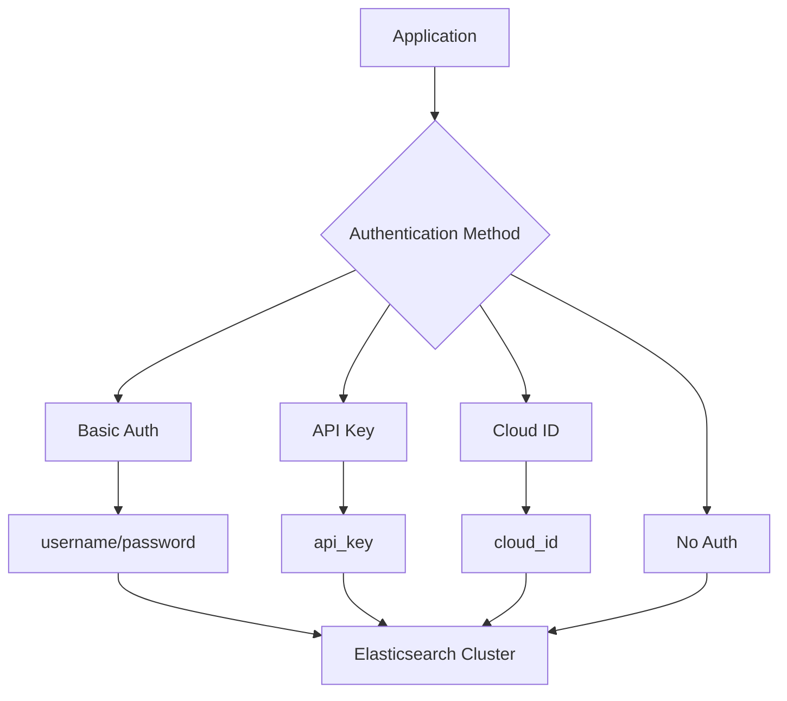
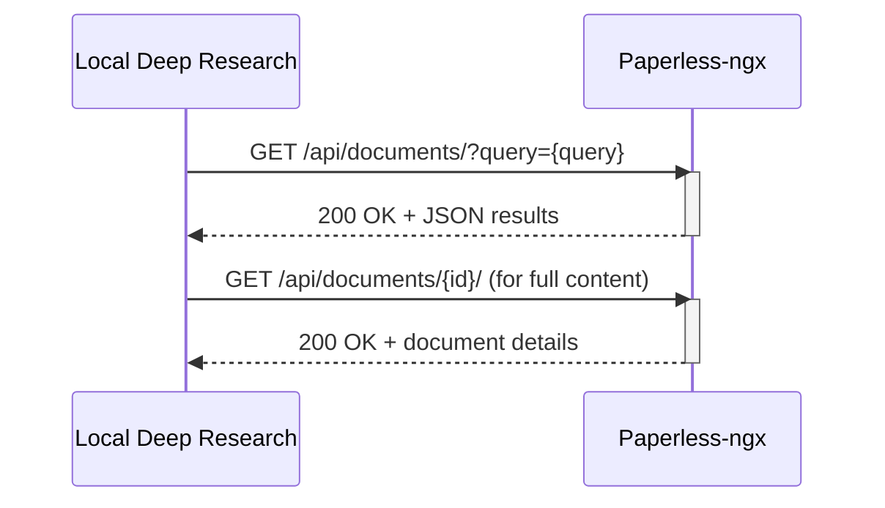
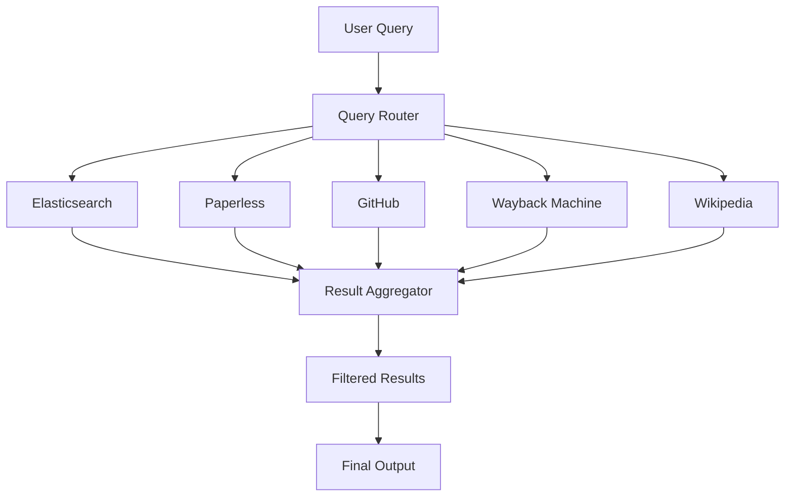

# Specialized Search Engines

<cite>
**Referenced Files in This Document**   
- [search-engines.md](file://docs/search-engines.md)
- [elasticsearch_search_engine.md](file://docs/elasticsearch_search_engine.md)
- [search_engine_elasticsearch.py](file://src/local_deep_research/web_search_engines/engines/search_engine_elasticsearch.py)
- [elasticsearch.json](file://src/local_deep_research/defaults/settings/search_engines/elasticsearch.json)
- [search_engine_paperless.py](file://src/local_deep_research/web_search_engines/engines/search_engine_paperless.py)
- [paperless.json](file://src/local_deep_research/defaults/settings/search_engines/paperless.json)
- [search_engine_github.py](file://src/local_deep_research/web_search_engines/engines/search_engine_github.py)
- [search_engine_wayback.py](file://src/local_deep_research/web_search_engines/engines/search_engine_wayback.py)
- [search_engine_wikipedia.py](file://src/local_deep_research/web_search_engines/engines/search_engine_wikipedia.py)
</cite>

## Table of Contents
1. [Introduction](#introduction)
2. [Elasticsearch Configuration](#elasticsearch-configuration)
3. [Paperless Document Management](#paperless-document-management)
4. [GitHub Repository Search](#github-repository-search)
5. [Wayback Machine Integration](#wayback-machine-integration)
6. [Wikipedia Search Engine](#wikipedia-search-engine)
7. [Parallel Search Strategy](#parallel-search-strategy)
8. [Security Considerations](#security-considerations)
9. [Troubleshooting Guide](#troubleshooting-guide)
10. [Conclusion](#conclusion)

## Introduction
This document provides comprehensive guidance on configuring specialized search engines within the Local Deep Research system. The platform supports various non-traditional search sources including Elasticsearch, Paperless document management, GitHub repositories, Wayback Machine, and Wikipedia. Each engine has unique configuration requirements and integration patterns that enable comprehensive research capabilities through parallel search strategies. The system is designed to connect with both internal knowledge bases and external information sources, providing researchers with a unified interface for information discovery.

**Section sources**
- [search-engines.md](file://docs/search-engines.md#L1-L253)

## Elasticsearch Configuration

### Connection and Authentication
Elasticsearch integration requires proper connection string configuration and authentication setup. The search engine connects to an Elasticsearch cluster using the following parameters:

| Parameter | Type | Default Value | Description |
| :--- | :--- | :--- | :--- |
| hosts | List[str] | ["http://localhost:9200"] | List of Elasticsearch server addresses |
| index_name | str | "documents" | Name of the index to search |
| username | Optional[str] | None | Authentication username |
| password | Optional[str] | None | Authentication password |
| api_key | Optional[str] | None | API Key authentication |
| cloud_id | Optional[str] | None | Elastic Cloud ID |

Authentication can be configured through multiple methods including basic authentication (username/password), API key authentication, or Elastic Cloud ID for hosted instances. The configuration is typically set in the system settings or environment variables.



**Diagram sources **
- [elasticsearch.json](file://src/local_deep_research/defaults/settings/search_engines/elasticsearch.json#L1-L283)
- [search_engine_elasticsearch.py](file://src/local_deep_research/web_search_engines/engines/search_engine_elasticsearch.py#L1-L363)

### Index Configuration and Data Indexing
Proper index configuration is essential for effective searching. The system supports configuring search fields and highlight fields to optimize query performance:

| Parameter | Type | Default Value | Description |
| :--- | :--- | :--- | :--- |
| search_fields | List[str] | ["content", "title"] | Fields to search in |
| highlight_fields | List[str] | ["content", "title"] | Fields to highlight in results |
| max_results | int | 10 | Maximum number of results to return |
| filter_query | Optional[Dict] | None | Optional filter query in Elasticsearch DSL format |

The system provides utility classes for indexing data into Elasticsearch. The `ElasticsearchManager` class supports various indexing methods:

```python
# Create ES Manager
es_manager = ElasticsearchManager(hosts=["http://localhost:9200"])

# Create index
es_manager.create_index("my_index")

# Index single document
es_manager.index_document(index_name="my_index", document={"title": "Document Title", "content": "Document content..."})

# Bulk index documents
documents = [{"title": "Document 1", "content": "Content 1"}, {"title": "Document 2", "content": "Content 2"}]
es_manager.bulk_index_documents("my_index", documents)

# Index file (automatically extract content)
es_manager.index_file("my_index", "path/to/document.pdf")

# Index all files in a directory
es_manager.index_directory("my_index", "path/to/docs", file_patterns=["*.pdf", "*.docx", "*.txt"])
```

**Section sources**
- [elasticsearch_search_engine.md](file://docs/elasticsearch_search_engine.md#L1-L155)
- [search_engine_elasticsearch.py](file://src/local_deep_research/web_search_engines/engines/search_engine_elasticsearch.py#L1-L363)

### Query Syntax and Advanced Search
The Elasticsearch engine supports multiple query syntax options for advanced searching:

**Query String Syntax**: Allows complex queries using Elasticsearch's query string syntax
```python
results = es_search.search_by_query_string("title:keyword AND content:search_text")
```

**Elasticsearch DSL (Domain Specific Language)**: Provides full access to Elasticsearch's query DSL
```python
results = es_search.search_by_dsl({
    "query": {
        "bool": {
            "must": {"match": {"content": "search term"}},
            "filter": {"term": {"category": "technology"}}
        }
    }
})
```

The system also supports the standard multi-match query for basic searches:
```python
search_query = {
    "query": {
        "multi_match": {
            "query": query,
            "fields": self.search_fields,
            "type": "best_fields",
            "tie_breaker": 0.3,
        }
    }
}
```

**Section sources**
- [elasticsearch_search_engine.md](file://docs/elasticsearch_search_engine.md#L1-L155)
- [search_engine_elasticsearch.py](file://src/local_deep_research/web_search_engines/engines/search_engine_elasticsearch.py#L1-L363)

## Paperless Document Management

### Connection Configuration
The Paperless-ngx search engine connects to a document management system using the following configuration parameters:

| Parameter | Type | Default Value | Description |
| :--- | :--- | :--- | :--- |
| api_url | str | "http://localhost:8000" | Base URL of Paperless-ngx instance |
| api_key | str | "" | API token for authentication |
| max_results | int | 10 | Maximum number of search results |
| timeout | int | 30 | Request timeout in seconds |
| verify_ssl | bool | True | Whether to verify SSL certificates |
| include_content | bool | True | Whether to include document content in results |

The API URL should point to the Paperless-ngx instance, typically running on localhost port 8000. Authentication is handled through an API token obtained from the Paperless-ngx admin panel.



**Diagram sources **
- [paperless.json](file://src/local_deep_research/defaults/settings/search_engines/paperless.json#L1-L253)
- [search_engine_paperless.py](file://src/local_deep_research/web_search_engines/engines/search_engine_paperless.py#L1-L780)

### Search Methodology and Query Expansion
The Paperless search engine employs a multi-pass search strategy to maximize result quality:

1. **Original Query Pass**: Performs an initial search with the user's original query
2. **LLM-Expanded Query Pass**: Uses a language model to expand the query with relevant keywords and synonyms
3. **Result Combination**: Combines and deduplicates results from both passes

The query expansion process transforms natural language queries into keyword-based searches optimized for Paperless-ngx's TF-IDF search engine:

```python
# Original query
query = "machine learning applications in healthcare"

# Expanded query after LLM processing
expanded_query = "machine learning OR ML OR artificial intelligence OR AI OR deep learning OR neural networks OR healthcare OR medical OR medicine OR hospital OR patient care"
```

The system also supports searching with filters based on document metadata such as correspondent, document type, tags, and date ranges.

**Section sources**
- [search_engine_paperless.py](file://src/local_deep_research/web_search_engines/engines/search_engine_paperless.py#L1-L780)

### Document Processing and Content Extraction
When retrieving documents from Paperless-ngx, the system processes the content to provide rich previews and full text access:

- **Metadata Enhancement**: The system enhances document titles with bibliographic information including correspondent, document type, and year
- **Snippet Generation**: Creates informative snippets using search highlights or content fallbacks
- **Content Formatting**: Preserves important formatting like bold text from search highlights while removing HTML tags

The system handles multiple highlights per document by creating separate search results for each highlight, allowing for more granular citation of specific content sections.

**Section sources**
- [search_engine_paperless.py](file://src/local_deep_research/web_search_engines/engines/search_engine_paperless.py#L1-L780)

## GitHub Repository Search

### Authentication and Rate Limiting
GitHub search requires proper authentication to avoid rate limiting. The system supports both authenticated and unauthenticated access:

| Authentication Method | Rate Limit | Recommendation |
| :--- | :--- | :--- |
| No API Key | 60 requests/hour | Not recommended for regular use |
| API Key | 5,000 requests/hour | Recommended for regular usage |

The API key should be configured in the system settings or environment variables. The search engine automatically handles rate limiting by monitoring the `X-RateLimit-Remaining` header and applying appropriate delays when necessary.

```python
# Configuration with API key
github_search = GitHubSearchEngine(
    api_key="your_github_api_key",
    search_type="repositories",
    max_results=15
)
```

**Section sources**
- [search_engine_github.py](file://src/local_deep_research/web_search_engines/engines/search_engine_github.py#L1-L924)

### Search Types and Parameters
The GitHub search engine supports multiple search types, each with specific parameters and use cases:

| Search Type | Use Case | Key Parameters |
| :--- | :--- | :--- |
| repositories | Finding code repositories | sort=stars, order=desc |
| code | Searching within code files | sort=indexed, order=desc |
| issues | Finding open issues and discussions | sort=updated, order=desc |
| users | Finding developers and contributors | sort=followers, order=desc |

The system automatically optimizes queries using a language model to improve search results. For example, a query like "best Python machine learning libraries" might be transformed to:
```
python machine learning language:python stars:>1000
```

**Section sources**
- [search_engine_github.py](file://src/local_deep_research/web_search_engines/engines/search_engine_github.py#L1-L924)

### Advanced Search Features
The GitHub search engine provides several advanced features for comprehensive research:

**Repository Details Retrieval**: Fetches detailed information about specific repositories including README content and recent issues:
```python
# Get repository details with README and issues
result = github_search.search_repository("owner", "repository_name", include_readme=True, include_issues=True)
```

**Code Search with Filters**: Allows searching code with specific language and repository filters:
```python
# Search for code with language and user filters
results = github_search.search_code("authentication", language="python", user="django")
```

**Issue Search**: Finds relevant issues with specific states and sorting options:
```python
# Search for open issues sorted by update time
results = github_search.search_issues("bug", state="open", sort="updated")
```

The system also automatically adjusts search parameters for contribution-focused queries, adding filters for beginner-friendly issues like "good-first-issue" or "help-wanted".

**Section sources**
- [search_engine_github.py](file://src/local_deep_research/web_search_engines/engines/search_engine_github.py#L1-L924)

## Wayback Machine Integration

### URL Discovery and Query Processing
The Wayback Machine search engine handles both direct URL queries and general topic searches:

**Direct URL Queries**: When a query contains a URL, the system searches for archived versions of that specific URL:
```python
# Search for archived versions of a specific URL
results = wayback.search_by_url("https://example.com/article.html")
```

**General Topic Queries**: For non-URL queries, the system uses DuckDuckGo to discover relevant URLs and then searches for their archived versions:
```python
# Search for archived content on a general topic
results = wayback.run("history of the internet")
```

The system extracts URLs from queries using regular expressions and can handle various URL formats including those with and without protocol prefixes.

**Section sources**
- [search_engine_wayback.py](file://src/local_deep_research/web_search_engines/engines/search_engine_wayback.py#L1-L539)

### Snapshot Retrieval Methods
The Wayback Machine integration supports multiple methods for retrieving snapshots:

**Available API**: Retrieves the closest snapshot to the current date
```python
response = requests.get("https://archive.org/wayback/available", params={"url": url})
```

**CDX API**: Retrieves multiple snapshots with configurable parameters
```python
response = requests.get(
    "https://web.archive.org/cdx/search/cdx",
    params={
        "url": url,
        "output": "json",
        "fl": "timestamp,original,statuscode,mimetype",
        "collapse": "timestamp:4",  # Group by year
        "limit": max_snapshots_per_url
    }
)
```

The system supports both methods and can be configured to retrieve either the closest snapshot only or multiple snapshots per URL.

**Section sources**
- [search_engine_wayback.py](file://src/local_deep_research/web_search_engines/engines/search_engine_wayback.py#L1-L539)

### Content Processing and Boilerplate Removal
When retrieving archived content, the system processes the HTML to extract meaningful text:

**Boilerplate Removal**: Uses the justext library to remove navigation, ads, and other boilerplate content while preserving main article text:
```python
def _remove_boilerplate(self, html: str) -> str:
    paragraphs = justext.justext(html, justext.get_stoplist(self.language))
    cleaned = "\n".join([p.text for p in paragraphs if not p.is_boilerplate])
    return cleaned
```

**Date Formatting**: Converts Wayback Machine timestamps to human-readable formats:
```python
def _format_timestamp(self, timestamp: str) -> str:
    if len(timestamp) < 14:
        return timestamp
    year = timestamp[0:4]
    month = timestamp[4:6]
    day = timestamp[6:8]
    return f"{year}-{month}-{day}"
```

The system also supports searching within specific date ranges and retrieving the latest snapshot of a URL.

**Section sources**
- [search_engine_wayback.py](file://src/local_deep_research/web_search_engines/engines/search_engine_wayback.py#L1-L539)

## Wikipedia Search Engine

### Language and Content Configuration
The Wikipedia search engine supports multiple language configurations and content retrieval options:

| Parameter | Type | Default Value | Description |
| :--- | :--- | :--- | :--- |
| language | str | "en" | Language code for Wikipedia (e.g., 'en', 'fr', 'es') |
| include_content | bool | True | Whether to include full page content in results |
| sentences | int | 5 | Number of sentences to include in summary |
| max_results | int | 10 | Maximum number of search results |

The language parameter sets the Wikipedia language edition to search, allowing research in multiple languages. The include_content parameter controls whether full page content is retrieved or only summaries are used.

```python
# Configure for French Wikipedia with full content
wiki_search = WikipediaSearchEngine(
    language="fr",
    include_content=True,
    sentences=5
)
```

**Section sources**
- [search_engine_wikipedia.py](file://src/local_deep_research/web_search_engines/engines/search_engine_wikipedia.py#L1-L303)

### Search and Retrieval Process
The Wikipedia search engine follows a two-phase approach similar to other engines:

**Preview Phase**: Retrieves page titles and summaries
```python
def _get_previews(self, query: str) -> List[Dict[str, Any]]:
    search_results = wikipedia.search(query, results=self.max_results)
    previews = []
    for title in search_results:
        summary = wikipedia.summary(title, sentences=self.sentences, auto_suggest=False)
        preview = {
            "title": title,
            "snippet": summary,
            "link": f"https://en.wikipedia.org/wiki/{title.replace(' ', '_')}"
        }
        previews.append(preview)
    return previews
```

**Full Content Phase**: Retrieves complete page content for relevant results
```python
def _get_full_content(self, relevant_items: List[Dict[str, Any]]) -> List[Dict[str, Any]]:
    results = []
    for item in relevant_items:
        title = item.get("id")
        page = wikipedia.page(title, auto_suggest=False)
        result = {
            "title": page.title,
            "link": page.url,
            "content": page.content,
            "categories": page.categories,
            "references": page.references,
            "links": page.links,
            "images": page.images,
            "sections": page.sections
        }
        results.append(result)
    return results
```

The system handles disambiguation pages by automatically selecting the first option when a disambiguation error occurs.

**Section sources**
- [search_engine_wikipedia.py](file://src/local_deep_research/web_search_engines/engines/search_engine_wikipedia.py#L1-L303)

### Advanced Features and Error Handling
The Wikipedia search engine includes several advanced features:

**Summary Retrieval**: Gets concise summaries of specific pages
```python
summary = wiki_search.get_summary("Machine Learning", sentences=3)
```

**Page Information**: Retrieves detailed information about a specific page
```python
page_info = wiki_search.get_page("Artificial Intelligence")
```

**Language Switching**: Dynamically changes the Wikipedia language
```python
wiki_search.set_language("es")  # Switch to Spanish Wikipedia
```

The system implements comprehensive error handling for common Wikipedia API issues:
- **PageError**: Handles cases where a page does not exist
- **DisambiguationError**: Automatically resolves ambiguous queries
- **HTTP errors**: Implements retry logic for network issues
- **Rate limiting**: Respects Wikipedia's rate limits to avoid IP blocking

**Section sources**
- [search_engine_wikipedia.py](file://src/local_deep_research/web_search_engines/engines/search_engine_wikipedia.py#L1-L303)

## Parallel Search Strategy

### Engine Coordination and Result Aggregation
The system implements a parallel search strategy that coordinates multiple search engines to provide comprehensive results:



The query router distributes the search query to multiple engines simultaneously, taking advantage of parallel processing to reduce overall search time. Each engine returns its results independently, which are then aggregated and deduplicated by the result aggregator.

**Section sources**
- [search-engines.md](file://docs/search-engines.md#L1-L253)

### Configuration and Optimization
The parallel search strategy can be configured through various parameters:

| Parameter | Purpose | Default Value |
| :--- | :--- | :--- |
| max_parallel_searches | Maximum number of engines to query simultaneously | 5 |
| timeout_per_engine | Timeout for each engine in seconds | 30 |
| SEARCH_SNIPPETS_ONLY | Whether to retrieve only snippets or full content | False |

The system automatically optimizes the search strategy based on the query type and available engines. For example, technical queries automatically prioritize GitHub and Elasticsearch, while historical research queries prioritize Wayback Machine and Wikipedia.

```python
# Configure parallel search parameters
result = quick_summary(
    query="your query",
    max_parallel_searches=5,
    timeout_per_engine=30
)
```

The system also supports an "auto" search engine that intelligently selects the most appropriate engines based on the query content and context.

**Section sources**
- [search-engines.md](file://docs/search-engines.md#L1-L253)

## Security Considerations

### Internal System Connections
When connecting to internal systems like Elasticsearch and Paperless-ngx, several security considerations must be addressed:

**Network Security**: Ensure that internal services are not exposed to the public internet. Use private networks or VPNs for connections between the research system and internal knowledge bases.

**Authentication**: Implement strong authentication mechanisms:
- Use API keys or tokens instead of basic authentication when possible
- Rotate credentials regularly
- Store credentials securely using environment variables or secure credential stores

**Encryption**: Enable SSL/TLS encryption for all connections, even within private networks:
```python
# Configure SSL verification
verify_ssl = True  # Set to False only for self-signed certificates in development
```

**Section sources**
- [search_engine_elasticsearch.py](file://src/local_deep_research/web_search_engines/engines/search_engine_elasticsearch.py#L1-L363)
- [search_engine_paperless.py](file://src/local_deep_research/web_search_engines/engines/search_engine_paperless.py#L1-L780)

### Data Synchronization and Privacy
Maintaining data synchronization while preserving privacy requires careful planning:

**Data Minimization**: Only index and search the minimum necessary data fields. Avoid indexing sensitive information unless absolutely required.

**Access Controls**: Implement role-based access controls for document collections, ensuring that users can only access documents they are authorized to view.

**Audit Logging**: Maintain logs of search activities for security auditing and compliance purposes.

**Data Freshness**: Implement regular synchronization schedules to ensure that search indexes reflect the current state of source systems:
- For document management systems: Daily or hourly synchronization
- For code repositories: Real-time or near-real-time synchronization
- For external knowledge bases: On-demand synchronization based on query patterns

The system should also provide mechanisms for users to verify the freshness of search results and understand the data sources and their update frequencies.

**Section sources**
- [search_engine_paperless.py](file://src/local_deep_research/web_search_engines/engines/search_engine_paperless.py#L1-L780)
- [search_engine_elasticsearch.py](file://src/local_deep_research/web_search_engines/engines/search_engine_elasticsearch.py#L1-L363)

## Troubleshooting Guide

### Connectivity Issues
Common connectivity issues and their solutions:

**Elasticsearch Connection Failures**:
- Verify that the Elasticsearch server is running
- Check the host address and port (default: http://localhost:9200)
- Verify authentication credentials if required
- Check network connectivity and firewall settings
- Ensure the Elasticsearch Python client is properly installed

**Paperless-ngx Connection Issues**:
- Verify the API URL (default: http://localhost:8000)
- Check that the API token is correctly configured
- Ensure the Paperless-ngx instance is running
- Verify SSL settings (disable for self-signed certificates)

**GitHub Rate Limiting**:
- Implement API key authentication to increase rate limits
- Add delays between requests to stay within limits
- Monitor the `X-RateLimit-Remaining` header
- Implement retry logic with exponential backoff

**Section sources**
- [elasticsearch_search_engine.md](file://docs/elasticsearch_search_engine.md#L141-L154)
- [search_engine_paperless.py](file://src/local_deep_research/web_search_engines/engines/search_engine_paperless.py#L1-L780)
- [search_engine_github.py](file://src/local_deep_research/web_search_engines/engines/search_engine_github.py#L1-L924)

### Schema Mismatches and Permission Errors
Addressing schema and permission issues:

**Index Configuration Mismatches**:
- Verify that the specified index exists in Elasticsearch
- Check that the search fields match the indexed document structure
- Ensure that the mapping configuration supports the required search operations
- Reindex data if schema changes are required

**Permission Errors**:
- Verify that API keys have the necessary permissions
- Check role-based access controls in the target system
- Ensure that the service account has appropriate privileges
- Review audit logs to identify permission denial reasons

**Empty Search Results**:
- Verify that the index contains data
- Check if the search query matches the document content
- Try simpler queries to isolate the issue
- Examine Elasticsearch or Paperless-ngx logs for errors

The system's logging provides detailed information about search operations, including request parameters, response codes, and error messages, which can be invaluable for troubleshooting.

**Section sources**
- [elasticsearch_search_engine.md](file://docs/elasticsearch_search_engine.md#L149-L154)
- [search_engine_paperless.py](file://src/local_deep_research/web_search_engines/engines/search_engine_paperless.py#L1-L780)

## Conclusion
The specialized search engines in the Local Deep Research system provide powerful capabilities for comprehensive information discovery. By integrating with diverse sources including Elasticsearch, Paperless document management, GitHub repositories, Wayback Machine, and Wikipedia, the system enables researchers to access both structured and unstructured data from internal and external sources. The parallel search strategy coordinates these engines to deliver comprehensive results efficiently, while the configuration options allow for fine-tuning based on specific research needs. Security considerations are addressed through proper authentication, encryption, and access controls, ensuring that connections to internal systems are secure. With proper configuration and troubleshooting, these specialized search engines form a robust foundation for advanced research workflows.