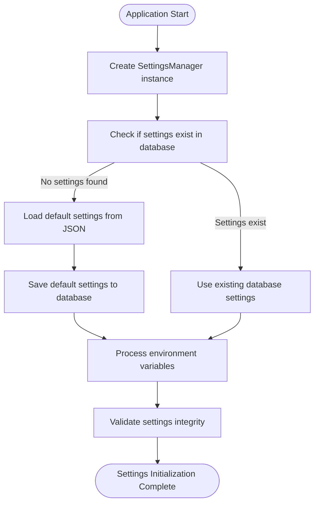
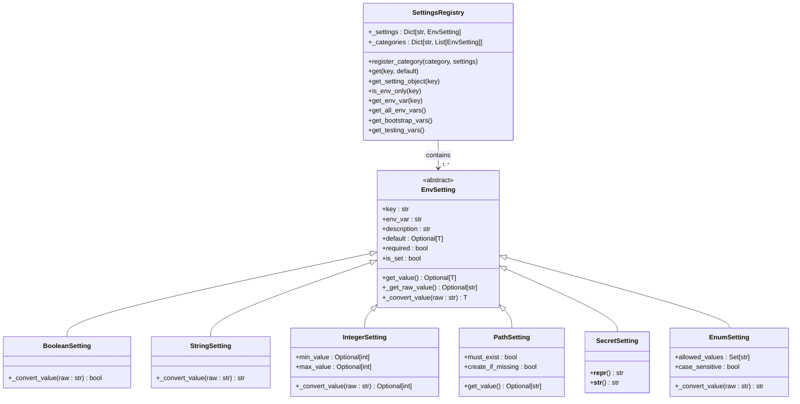
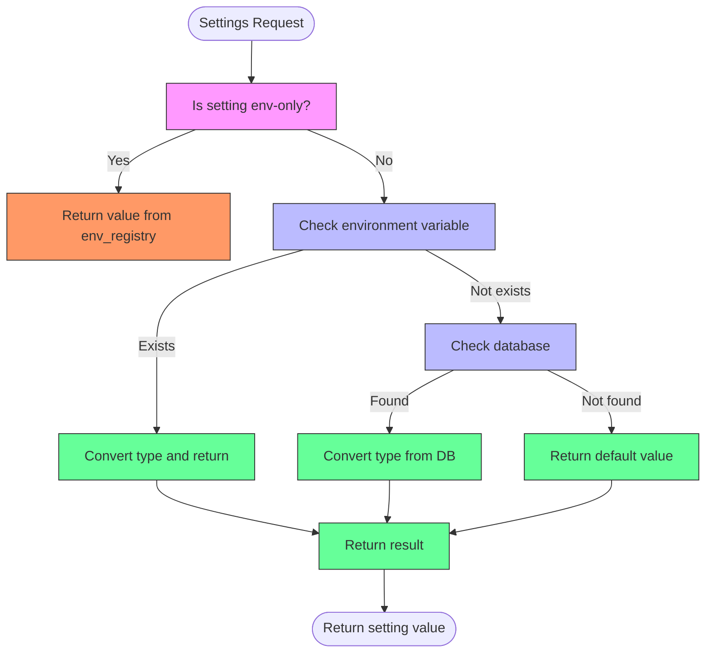
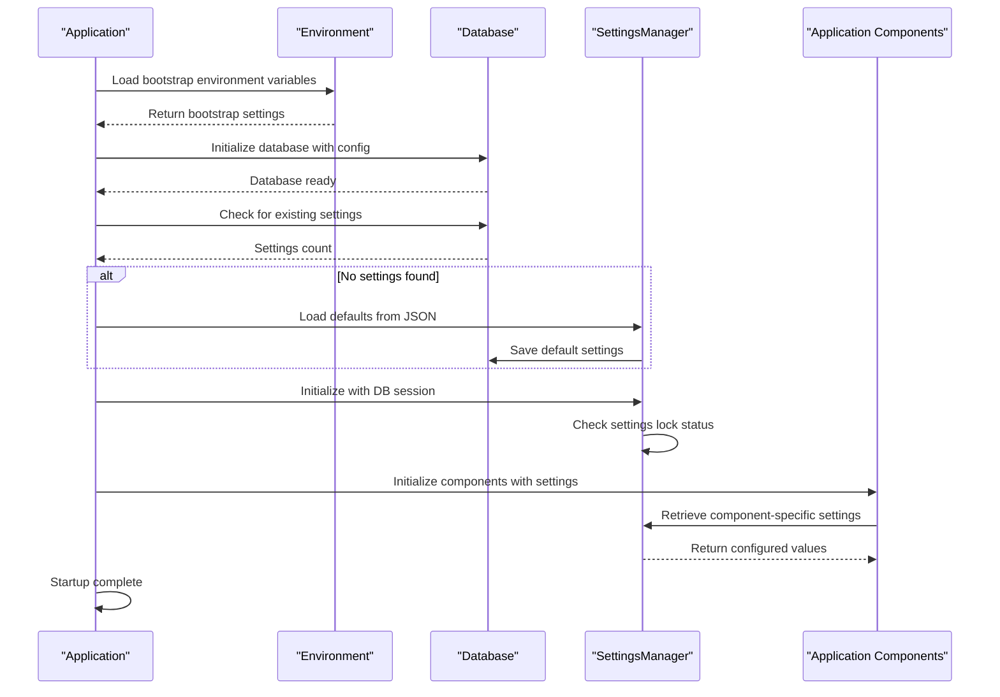
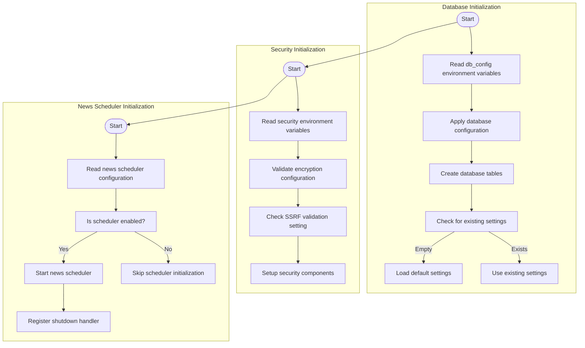
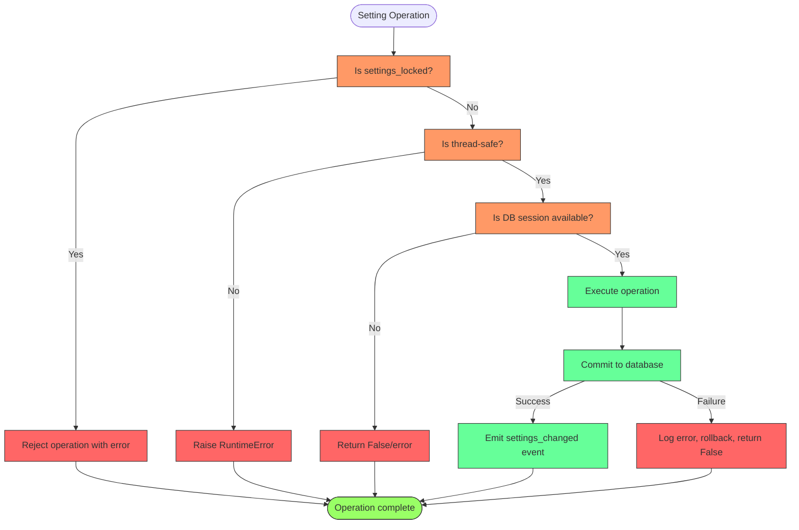

# Settings Initialization

<cite>
**Referenced Files in This Document**   
- [manager.py](file://src/local_deep_research/settings/manager.py)
- [env_registry.py](file://src/local_deep_research/settings/env_registry.py)
- [env_settings.py](file://src/local_deep_research/settings/env_settings.py)
- [bootstrap.py](file://src/local_deep_research/settings/env_definitions/bootstrap.py)
- [db_config.py](file://src/local_deep_research/settings/env_definitions/db_config.py)
- [news_scheduler.py](file://src/local_deep_research/settings/env_definitions/news_scheduler.py)
- [security.py](file://src/local_deep_research/settings/env_definitions/security.py)
- [testing.py](file://src/local_deep_research/settings/env_definitions/testing.py)
- [default_settings.json](file://src/local_deep_research/defaults/default_settings.json)
- [app.py](file://src/local_deep_research/web/app.py)
- [initialize.py](file://src/local_deep_research/database/initialize.py)
</cite>

## Table of Contents
1. [Introduction](#introduction)
2. [Settings Initialization Process](#settings-initialization-process)
3. [Environment Variables and Registry](#environment-variables-and-registry)
4. [Hierarchical Settings Merging](#hierarchical-settings-merging)
5. [Initialization Sequence](#initialization-sequence)
6. [Component-Specific Initialization](#component-specific-initialization)
7. [Validation and Error Handling](#validation-and-error-handling)
8. [Troubleshooting Guide](#troubleshooting-guide)
9. [Conclusion](#conclusion)

## Introduction

The Settings Initialization system in this application provides a robust configuration management framework that handles the bootstrap process, environment variable integration, and hierarchical settings merging. The system is designed to ensure that configuration is properly initialized before any other components start, with special attention to security-sensitive settings that must be available before database access.

The core of the system revolves around the SettingsManager class, which manages application settings with database persistence while allowing environment variables to override values. This document details how the system bootstraps configuration, processes environment variables through the env_registry, merges settings from multiple sources, and initializes component-specific settings during application startup.

**Section sources**
- [manager.py](file://src/local_deep_research/settings/manager.py#L197-L919)
- [env_registry.py](file://src/local_deep_research/settings/env_registry.py#L1-L112)

## Settings Initialization Process

The SettingsManager class is responsible for initializing and managing application settings. During initialization, it follows a specific sequence to ensure proper configuration:

1. The SettingsManager is instantiated with a database session, which enables database-backed settings storage
2. The `_ensure_settings_initialized()` method checks if any settings exist in the database
3. If no settings are found, it loads default values from the default_settings.json file
4. The system then processes environment variables that may override database settings

The initialization process prioritizes database settings over defaults, ensuring that user-configured values persist across application restarts. The system also implements thread safety checks to prevent cross-thread access issues, as each SettingsManager instance is tied to the thread in which it was created.

A key aspect of the initialization is the handling of the "app.lock_settings" setting, which when enabled, prevents any modifications to settings. This feature is implemented with lazy evaluation through the `settings_locked` property, which checks the database value only when first accessed.

**Diagram sources **
- [manager.py](file://src/local_deep_research/settings/manager.py#L223-L234)
- [manager.py](file://src/local_deep_research/settings/manager.py#L219-L222)

**Section sources**
- [manager.py](file://src/local_deep_research/settings/manager.py#L203-L234)

## Environment Variables and Registry

The environment variable system is implemented through the env_registry, which manages environment-only settings that are required before database initialization. These settings are critical for the bootstrap process and cannot be stored in the database because they are prerequisites for accessing it.

The env_registry is built from multiple categories of environment settings defined in separate modules:
- **bootstrap**: Core system settings like encryption keys and data directory paths
- **db_config**: Database-specific configuration such as cache size and journal mode
- **security**: Security-related flags like SSRF validation control
- **testing**: Test mode indicators and CI environment detection
- **news_scheduler**: News subscription scheduler enable/disable flag

Each environment variable follows a naming convention where the setting key is transformed by prefixing with "LDR_" and converting dots to underscores in uppercase (e.g., "bootstrap.encryption_key" becomes "LDR_BOOTSTRAP_ENCRYPTION_KEY"). This convention allows for consistent environment variable naming while maintaining readability.

The SettingsRegistry class provides type-safe access to environment variables through specialized setting classes (BooleanSetting, StringSetting, IntegerSetting, etc.) that handle type conversion and validation. For example, boolean values are converted from common string representations like "true", "1", "yes", or "on" to Python boolean values.

**Diagram sources **
- [env_registry.py](file://src/local_deep_research/settings/env_registry.py#L257-L334)
- [env_settings.py](file://src/local_deep_research/settings/env_settings.py#L33-L316)

**Section sources**
- [env_registry.py](file://src/local_deep_research/settings/env_registry.py#L1-L112)
- [env_settings.py](file://src/local_deep_research/settings/env_settings.py#L1-L348)

## Hierarchical Settings Merging

The settings system implements a hierarchical merging strategy that combines values from multiple sources with a defined precedence order. The merging process follows these principles:

1. **Default settings** from default_settings.json provide the baseline configuration
2. **Database settings** override defaults, preserving user customizations
3. **Environment variables** have the highest precedence, allowing runtime overrides

The get_all_settings() method implements this merging strategy by first loading all default settings, then overriding them with database values, and finally applying environment variable overrides. This ensures that new settings added to the defaults file automatically appear in the UI without requiring a database reset.

For environment variable processing, the system uses the check_env_setting() function which transforms setting keys to their corresponding environment variable names (e.g., "app.host" becomes "LDR_APP__HOST"). When an environment variable is detected, the corresponding setting is marked as non-editable in the UI, as changes to the database value would have no effect while the environment variable is set.

The hierarchical merging also handles type conversion based on the setting's UI element type. Different UI elements map to specific type conversion functions:
- "text" and "password" map to string conversion
- "number" and "range" map to numeric conversion (int if whole number, otherwise float)
- "checkbox" maps to boolean conversion with HTML form semantics
- "json" passes through the value as-is (relying on SQLAlchemy's JSON parsing)

This type conversion system ensures that settings are properly typed when retrieved, regardless of their source.

**Diagram sources **
- [manager.py](file://src/local_deep_research/settings/manager.py#L112-L175)
- [manager.py](file://src/local_deep_research/settings/manager.py#L342-L387)

**Section sources**
- [manager.py](file://src/local_deep_research/settings/manager.py#L112-L175)

## Initialization Sequence

The application startup sequence follows a strict order to ensure proper initialization of the settings system before other components become active. The sequence begins with the loading of bootstrap environment variables, followed by database initialization, and finally the setup of component-specific settings.

During application startup, the process follows this sequence:
1. Bootstrap environment variables are read to configure critical system parameters
2. Database connection is established using configuration from environment variables
3. Database tables are created if they don't exist
4. Default settings are loaded into the database if it's empty
5. SettingsManager is initialized with the database session
6. Component-specific initialization occurs based on the loaded settings

The bootstrap phase is particularly critical as it handles settings that are required before database access, such as encryption keys, data directory paths, and database URLs. These settings are defined in the bootstrap.py module and include:
- `bootstrap.encryption_key`: Database encryption key
- `bootstrap.secret_key`: Application secret key for session encryption
- `bootstrap.database_url`: Database connection URL
- `bootstrap.data_dir`: Data directory path
- `bootstrap.config_dir`: Configuration directory path
- `bootstrap.log_dir`: Log directory path

The system also handles database configuration settings through the db_config.py module, which includes parameters like cache size, journal mode, synchronous mode, page size, and encryption settings that must be set before opening the database connection.

**Diagram sources **
- [bootstrap.py](file://src/local_deep_research/settings/env_definitions/bootstrap.py#L1-L60)
- [db_config.py](file://src/local_deep_research/settings/env_definitions/db_config.py#L1-L73)
- [initialize.py](file://src/local_deep_research/database/initialize.py#L43-L80)

**Section sources**
- [bootstrap.py](file://src/local_deep_research/settings/env_definitions/bootstrap.py#L1-L60)
- [db_config.py](file://src/local_deep_research/settings/env_definitions/db_config.py#L1-L73)
- [initialize.py](file://src/local_deep_research/database/initialize.py#L43-L80)

## Component-Specific Initialization

The settings system supports custom initialization logic for various components, allowing each subsystem to configure itself based on specific settings. This section details the initialization process for database, security, and news scheduler components.

### Database Settings Initialization

Database settings are initialized early in the application lifecycle, as they are required before the database connection can be established. The system uses environment variables from the db_config category to configure SQLite and SQLCipher parameters:

- `db_config.cache_size_mb`: Configures SQLite cache size in MB (default: 100)
- `db_config.journal_mode`: Sets SQLite journal mode (default: WAL)
- `db_config.synchronous`: Configures synchronous mode (default: NORMAL)
- `db_config.page_size`: Sets page size in bytes (default: 4096)
- `db_config.kdf_iterations`: Number of KDF iterations for key derivation (default: 256000)
- `db_config.kdf_algorithm`: Key derivation function algorithm (default: PBKDF2_HMAC_SHA512)
- `db_config.hmac_algorithm`: HMAC algorithm for database integrity (default: HMAC_SHA512)

These settings are applied during database initialization and cannot be changed at runtime, as they affect the fundamental behavior of the database engine.

### Security Settings Initialization

Security settings are configured through both environment variables and database settings, with environment variables taking precedence. The system includes several security-related settings:

- `security.ssrf.disable_validation`: Allows disabling SSRF validation for testing purposes (default: False)
- `bootstrap.encryption_key`: Database encryption key (required unless allow_unencrypted is True)
- `bootstrap.secret_key`: Application secret key for session encryption
- `bootstrap.allow_unencrypted`: Allows unencrypted database (for development, default: False)

The system also includes dynamic security checks for CI/CD environments through the `is_ci_environment()` and `is_github_actions()` functions, which detect when the application is running in continuous integration systems.

### News Scheduler Settings Initialization

The news scheduler component is controlled by environment variables that determine its behavior at startup:

- `news.scheduler.enabled`: Enables or disables the news subscription scheduler (default: True)
- `testing.test_mode`: Enables test mode with delays for testing concurrency
- `testing.use_fallback_llm`: Uses mock LLM for testing, skipping API calls

The news scheduler is initialized during application startup, and its status is controlled by the `news.scheduler.enabled` setting. When enabled, the scheduler runs in the background, processing news subscriptions according to their configured schedules.

**Diagram sources **
- [db_config.py](file://src/local_deep_research/settings/env_definitions/db_config.py#L1-L73)
- [security.py](file://src/local_deep_research/settings/env_definitions/security.py#L1-L24)
- [news_scheduler.py](file://src/local_deep_research/settings/env_definitions/news_scheduler.py#L1-L19)

**Section sources**
- [db_config.py](file://src/local_deep_research/settings/env_definitions/db_config.py#L1-L73)
- [security.py](file://src/local_deep_research/settings/env_definitions/security.py#L1-L24)
- [news_scheduler.py](file://src/local_deep_research/settings/env_definitions/news_scheduler.py#L1-L19)

## Validation and Error Handling

The settings system implements comprehensive validation and error handling to ensure configuration integrity and provide meaningful feedback when issues occur. The validation process occurs at multiple levels, from environment variable parsing to database operations.

### Type Validation

The system performs strict type validation when processing settings from different sources. For environment variables, each setting type has specific validation rules:

- **BooleanSetting**: Validates string values against accepted representations ("true", "1", "yes", "on" for True; "false", "0", "no", "off" for False)
- **IntegerSetting**: Ensures values are valid integers within optional min/max bounds
- **PathSetting**: Validates path existence when required and can create missing directories
- **EnumSetting**: Ensures values are within a predefined set of allowed values

When retrieving settings, the system applies type conversion based on the UI element type, with special handling for boolean values that follow HTML checkbox semantics (any non-empty string except explicit false values is considered True).

### Error Handling

The settings system implements robust error handling for various failure scenarios:

- **Database errors**: When database operations fail (e.g., during setting retrieval or update), the system logs the exception and returns appropriate default values or False for operations
- **Environment variable errors**: Invalid environment variable values trigger warnings and fallback to default values
- **Missing required settings**: Required environment variables that are not set raise ValueError exceptions
- **Type conversion errors**: Failed type conversions result in warnings and fallback to default values

The system also implements thread safety checks to prevent cross-thread access to SettingsManager instances, raising RuntimeError if an instance is used in a different thread than the one in which it was created.

### Settings Locking

The system includes a settings locking mechanism controlled by the "app.lock_settings" setting. When enabled, this feature prevents any modifications to settings, providing a way to protect configuration in production environments. The locking status is evaluated lazily and cached for performance.

**Diagram sources **
- [manager.py](file://src/local_deep_research/settings/manager.py#L245-L260)
- [manager.py](file://src/local_deep_research/settings/manager.py#L389-L463)
- [env_settings.py](file://src/local_deep_research/settings/env_settings.py#L129-L148)

**Section sources**
- [manager.py](file://src/local_deep_research/settings/manager.py#L245-L260)
- [manager.py](file://src/local_deep_research/settings/manager.py#L389-L463)
- [env_settings.py](file://src/local_deep_research/settings/env_settings.py#L129-L148)

## Troubleshooting Guide

This section provides guidance for diagnosing and resolving common issues related to settings initialization.

### Missing Required Environment Variables

When required environment variables are missing, the application will fail to start or exhibit unexpected behavior. Common issues include:

- **Missing encryption key**: If `bootstrap.encryption_key` is not set and `bootstrap.allow_unencrypted` is False, the database cannot be accessed
- **Missing secret key**: If `bootstrap.secret_key` is not set, session management will fail
- **Missing database URL**: If `bootstrap.database_url` is not set, the database connection cannot be established

To resolve these issues, ensure all required environment variables are set before starting the application. Use the `show_env_vars.py` example script to list all available environment variables and their descriptions.

### Type Mismatch Errors

Type mismatch errors occur when environment variables contain values that cannot be converted to the expected type. Common scenarios include:

- Providing a non-numeric value for integer settings like `db_config.cache_size_mb`
- Using an invalid journal mode for `db_config.journal_mode` (must be one of: DELETE, TRUNCATE, PERSIST, MEMORY, WAL, OFF)
- Setting `db_config.synchronous` to a value not in: OFF, NORMAL, FULL, EXTRA

When type mismatches occur, the system will log a warning and use the default value. Check the application logs for warnings about invalid values and correct the environment variables accordingly.

### Database Initialization Issues

Problems with database initialization often stem from incorrect configuration or permission issues:

- **Permission denied errors**: Ensure the data directory specified by `bootstrap.data_dir` is writable by the application
- **Corrupted database**: If the database file is corrupted, remove it and allow the system to recreate it with default settings
- **Version mismatch**: If the database version does not match the application version, the system may fail to start. Check the "app.version" setting in the database

### Settings Not Persisting

If settings changes are not persisting across application restarts:

- Verify that the database session is properly configured and committed
- Check that the "app.lock_settings" setting is not enabled
- Ensure the settings are marked as editable in the database
- Confirm that environment variables are not overriding the database values

### Debugging Tips

- Enable debug logging by setting `app.debug=True` or `bootstrap.enable_file_logging=True`
- Use the `get_all_settings()` method to inspect the current configuration state
- Check the application logs for warnings about environment variable overrides
- Verify the database connection by querying the settings table directly
- Use the `is_ci_environment()` and `is_github_actions()` functions to detect CI/CD environments

**Section sources**
- [manager.py](file://src/local_deep_research/settings/manager.py#L149-L165)
- [env_settings.py](file://src/local_deep_research/settings/env_settings.py#L51-L58)
- [env_registry.py](file://src/local_deep_research/settings/env_registry.py#L54-L71)

## Conclusion

The Settings Initialization system provides a comprehensive framework for managing application configuration with proper bootstrap handling, environment variable integration, and hierarchical settings merging. By separating environment-only settings from database-stored settings, the system ensures that critical configuration is available before database access while allowing user preferences to persist across sessions.

The initialization process follows a well-defined sequence that prioritizes reliability and security, with comprehensive validation and error handling to ensure configuration integrity. The system's modular design, with separate categories for bootstrap, database, security, and component-specific settings, allows for clear separation of concerns and easy extension.

Key strengths of the system include:
- Thread-safe settings management
- Hierarchical merging of settings from multiple sources
- Comprehensive type validation and error handling
- Support for environment variable overrides with clear precedence rules
- Component-specific initialization logic
- Settings locking for production protection

This robust configuration management system enables reliable application startup and flexible configuration options for both development and production environments.