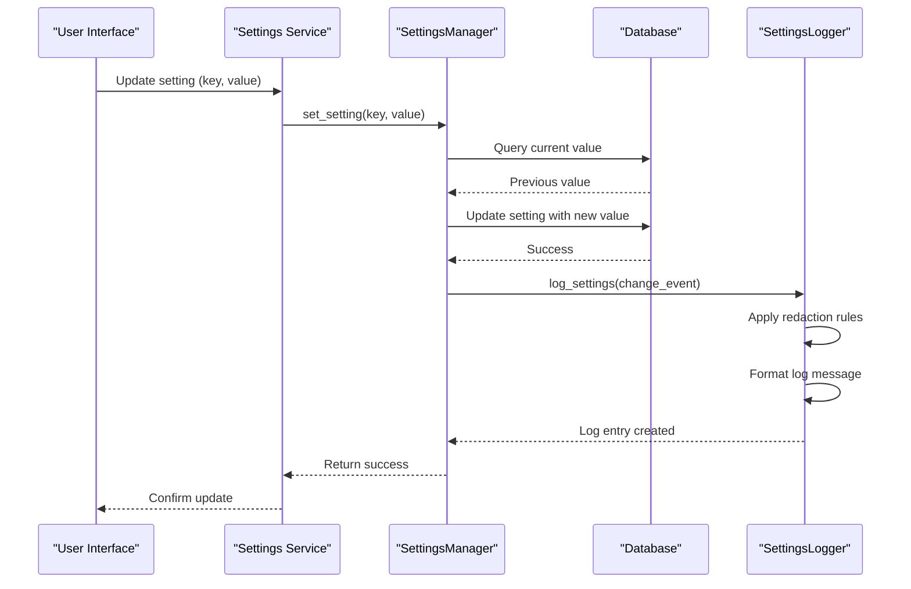

# Settings Logging

<cite>
**Referenced Files in This Document**   
- [manager.py](file://src/local_deep_research/settings/manager.py)
- [logger.py](file://src/local_deep_research/settings/logger.py)
- [settings.py](file://src/local_deep_research/database/models/settings.py)
- [settings_routes.py](file://src/local_deep_research/web/routes/settings_routes.py)
- [settings_service.py](file://src/local_deep_research/web/services/settings_service.py)
- [base.py](file://src/local_deep_research/settings/base.py)
</cite>

## Table of Contents
1. [Introduction](#introduction)
2. [Settings Logging Infrastructure](#settings-logging-infrastructure)
3. [Audit Logging of Configuration Changes](#audit-logging-of-configuration-changes)
4. [Log Format and Structure](#log-format-and-structure)
5. [Retention Policies](#retention-policies)
6. [Access Controls and Security](#access-controls-and-security)
7. [Monitoring and Diagnostics](#monitoring-and-diagnostics)
8. [Log Level Configuration](#log-level-configuration)
9. [External Monitoring Integration](#external-monitoring-integration)
10. [Privacy Considerations](#privacy-considerations)
11. [Conclusion](#conclusion)

## Introduction

The settings logging infrastructure provides a comprehensive system for auditing and recording configuration changes within the application. This documentation details how configuration modifications are captured, stored, and accessed for security, debugging, and compliance purposes. The system integrates the SettingsManager with a robust logging framework to ensure all setting changes are properly recorded with essential context including timestamps, user information, and previous values.

The logging system is designed with security and privacy in mind, providing mechanisms to handle sensitive configuration data appropriately while still enabling effective monitoring and troubleshooting. This document covers the complete lifecycle of settings logging, from the initial change event through to long-term retention and access controls.

## Settings Logging Infrastructure

The settings logging infrastructure is built around the SettingsManager class, which serves as the central component for managing application settings and their audit trail. The system captures all configuration changes through a well-defined process that ensures consistency and reliability.

The core components of the logging infrastructure include:
- SettingsManager: The primary interface for setting operations with built-in audit logging
- SettingsLogger: A utility module that controls logging verbosity and handles sensitive data redaction
- Database models: Persistent storage for settings with audit metadata
- Web services: API endpoints that trigger and record setting changes

When a setting is modified, the SettingsManager captures the change event and records it through the logging system. The process includes capturing the setting key, new value, previous value, timestamp, and user context. This information is then formatted according to the configured log level and output destination.

The infrastructure supports multiple logging modes based on the LDR_LOG_SETTINGS environment variable, allowing administrators to control the verbosity of settings logging from no logging at all to full debug output with sensitive data redaction.

**Section sources**
- [manager.py](file://src/local_deep_research/settings/manager.py#L197-L800)
- [logger.py](file://src/local_deep_research/settings/logger.py#L1-L154)
- [settings.py](file://src/local_deep_research/database/models/settings.py#L77-L109)

## Audit Logging of Configuration Changes

The audit logging system captures all configuration changes through the SettingsManager's set_setting method, which is the primary entry point for modifying settings. Each change is recorded with comprehensive context to support security auditing and debugging.

When a setting is modified, the system captures:
- Setting key and new value
- Previous value (for change tracking)
- Timestamp of the change
- User context (when available)
- Operation type (create, update, delete)

The audit process begins when the set_setting method is called, which validates the change and updates the database record. After the database update is committed, the system triggers an audit log entry through the logging framework. This ensures that only successfully committed changes are logged, maintaining data consistency.

For bulk operations, such as importing multiple settings, the system logs each individual change while also providing a summary of the overall operation. This approach balances detailed audit information with manageable log volume.

The audit system also handles special cases such as:
- Environment variable overrides, which are logged as configuration sources
- Non-editable settings that are protected from modification
- Locked settings that prevent any changes when enabled



**Diagram sources**
- [manager.py](file://src/local_deep_research/settings/manager.py#L389-L463)
- [settings_routes.py](file://src/local_deep_research/web/routes/settings_routes.py#L242-L564)
- [settings_service.py](file://src/local_deep_research/web/services/settings_service.py#L9-L25)

## Log Format and Structure

The log format is designed to provide comprehensive information while maintaining readability and consistency. The structure varies based on the configured log level, with different levels of detail available for different operational needs.

The system supports four logging levels controlled by the LDR_LOG_SETTINGS environment variable:
- "none" or "false": No settings logging at all (default)
- "summary" or "info": Only log count and summary of settings
- "debug" or "full": Log complete settings with sensitive keys redacted
- "debug_unsafe": Log complete settings including sensitive keys (for debugging only)

At the "summary" level, logs include basic information about the settings operation:
```
INFO: Settings loaded: 45 total settings (search engines: 5, LLM: 8)
```

At the "debug" level, logs include full settings information with sensitive data redacted:
```
DEBUG: Settings loaded (redacted): {'llm.api_key': '***REDACTED***', 'database.password': '***REDACTED***', ...}
```

The log structure includes the following elements:
- Timestamp: When the change occurred
- Log level: INFO for summaries, DEBUG for detailed logs
- Message prefix: Describes the operation type
- Setting information: Keys and values (redacted as appropriate)
- Context: Additional information about the operation

Sensitive keys are identified by patterns such as "api_key", "password", "secret", "token", "credential", "auth", and "private". When these patterns are detected in setting keys, their values are automatically redacted in log output unless the "debug_unsafe" level is explicitly enabled.

**Section sources**
- [logger.py](file://src/local_deep_research/settings/logger.py#L34-L77)
- [manager.py](file://src/local_deep_research/settings/manager.py#L7-L8)
- [settings.py](file://src/local_deep_research/database/models/settings.py#L86-L103)

## Retention Policies

The settings logging system follows the application's overall logging retention policies, which are designed to balance operational needs with storage efficiency and privacy considerations.

Log files are rotated based on size, with a maximum size of 10 MB per file. When a log file reaches this size, it is automatically rotated to a new file, ensuring that no single log file becomes unmanageably large. This rotation strategy prevents disk space exhaustion while maintaining recent log data for troubleshooting.

Retained logs are kept for a period of 7 days before being automatically deleted. This retention period provides sufficient time for incident investigation and debugging while limiting the exposure of potentially sensitive information in log files. After 7 days, old log files are removed to free up storage space and reduce the attack surface.

Compressed archiving is used to minimize storage requirements. When log files are rotated, they are compressed using zip compression, significantly reducing their size on disk. This allows for more efficient storage of historical log data within the retention period.

It's important to note that log files are stored unencrypted, which means they may contain sensitive data depending on the logging level configuration. Administrators should ensure appropriate file system permissions are in place to protect log files from unauthorized access.

**Section sources**
- [log_utils.py](file://src/local_deep_research/utilities/log_utils.py#L287-L298)
- [logger.py](file://src/local_deep_research/settings/logger.py#L18-L31)

## Access Controls and Security

The settings logging infrastructure implements multiple layers of access controls to protect sensitive configuration data. These controls operate at both the application level and the logging system level to ensure comprehensive protection.

At the application level, the SettingsManager enforces several security controls:
- Settings locking: When enabled, prevents any changes to settings
- Editable flag: Individual settings can be marked as non-editable
- Environment variable precedence: Environment variables override database settings and make settings non-editable

The logging system itself implements additional security measures:
- Automatic redaction: Sensitive setting values are redacted in log output
- Configurable verbosity: Logging level can be restricted to prevent sensitive data exposure
- Environment variable control: LDR_LOG_SETTINGS controls what information is logged

Access to settings changes is also controlled through the web interface, which requires authentication for all settings operations. The system captures user context when available, associating changes with specific user accounts for audit purposes.

For highly sensitive environments, the system can be configured to disable settings logging entirely by setting LDR_LOG_SETTINGS to "none" or "false". This ensures that no configuration information is written to log files, providing the highest level of data protection.

The database storage for settings uses SQLCipher encryption when available, providing an additional layer of protection for sensitive configuration data at rest. This encryption protects API keys, database credentials, and other sensitive information stored in the settings database.

**Section sources**
- [manager.py](file://src/local_deep_research/settings/manager.py#L246-L260)
- [logger.py](file://src/local_deep_research/settings/logger.py#L79-L122)
- [encrypted_db.py](file://src/local_deep_research/database/encrypted_db.py#L27-L620)

## Monitoring and Diagnostics

The settings logging system provides valuable capabilities for monitoring configuration changes and diagnosing issues related to settings. These capabilities support both proactive monitoring and reactive troubleshooting.

For monitoring settings changes, administrators can use the audit logs to track configuration modifications over time. The logs provide a complete history of changes, including what was changed, when it was changed, and what the previous value was. This information is invaluable for security audits and compliance reporting.

When diagnosing configuration-related issues, the logging system helps identify problems by:
- Showing the current state of all settings
- Revealing recent changes that might have caused issues
- Highlighting configuration conflicts or invalid values
- Identifying environment variable overrides that might be affecting behavior

The system also provides a settings summary that includes counts of different types of settings, making it easy to verify that expected configurations are present. For example, the summary shows the number of search engines and LLM settings, helping administrators quickly assess the configuration state.

For debugging complex issues, the "debug" logging level can be temporarily enabled to capture complete settings information with sensitive data redacted. This detailed information can help identify subtle configuration problems that might not be apparent from the application behavior alone.

The WebSocket events emitted when settings change also provide real-time monitoring capabilities, allowing external systems to react immediately to configuration changes.

**Section sources**
- [logger.py](file://src/local_deep_research/settings/logger.py#L125-L143)
- [manager.py](file://src/local_deep_research/settings/manager.py#L456-L458)
- [settings_routes.py](file://src/local_deep_research/web/routes/settings_routes.py#L534-L560)

## Log Level Configuration

Log level configuration is controlled through the LDR_LOG_SETTINGS environment variable, which determines the verbosity of settings logging. This variable can be set to different values to achieve the desired balance between diagnostic information and security.

The available log levels are:
- "none" or "false": Disables all settings logging (default)
- "summary" or "info": Logs only a summary of settings at INFO level
- "debug" or "full": Logs complete settings at DEBUG level with sensitive keys redacted
- "debug_unsafe": Logs complete settings at DEBUG level including sensitive keys

The configuration is evaluated once when the logger module is loaded, ensuring consistent behavior throughout the application's lifecycle. Invalid values default to "none" for security.

For critical messages that must be logged regardless of the configured level, the log_settings function accepts a force_level parameter. This allows important security events to be logged even when general settings logging is disabled.

The system also supports dynamic reconfiguration in some contexts, allowing temporary elevation of log levels for debugging purposes. However, this should be done with caution, especially in production environments, due to the potential exposure of sensitive information.

Best practices for log level configuration include:
- Using "none" in production environments unless auditing is required
- Using "summary" for basic operational monitoring
- Using "debug" temporarily for troubleshooting
- Avoiding "debug_unsafe" except in isolated development environments

**Section sources**
- [logger.py](file://src/local_deep_research/settings/logger.py#L18-L31)
- [logger.py](file://src/local_deep_research/settings/logger.py#L34-L53)
- [manager.py](file://src/local_deep_research/settings/manager.py#L7-L8)

## External Monitoring Integration

The settings logging infrastructure can be integrated with external monitoring systems through several mechanisms. These integrations enable centralized log management, alerting, and analysis.

The primary integration point is the log file output, which follows standard formats compatible with most log management systems. The log files can be ingested by tools such as:
- ELK Stack (Elasticsearch, Logstash, Kibana)
- Splunk
- Datadog
- Prometheus and Grafana (with appropriate exporters)

The structured log format, particularly at the "summary" level, is well-suited for parsing and analysis by these systems. Key-value pairs and consistent message formats make it easy to extract metrics and create dashboards.

For real-time integration, the WebSocket events emitted when settings change can be captured by external monitoring tools. These events provide immediate notification of configuration changes, enabling rapid response to potentially problematic modifications.

The system's use of standard logging libraries (loguru) also facilitates integration with existing monitoring infrastructure. Custom handlers can be added to forward log messages to external systems using various protocols and formats.

When integrating with external monitoring systems, administrators should consider the sensitivity of the logged information and implement appropriate security measures, such as:
- Encrypting log transmission
- Restricting access to log data
- Redacting sensitive information before transmission
- Complying with relevant data protection regulations

**Section sources**
- [logger.py](file://src/local_deep_research/settings/logger.py#L34-L77)
- [manager.py](file://src/local_deep_research/settings/manager.py#L456-L458)
- [log_utils.py](file://src/local_deep_research/utilities/log_utils.py#L287-L298)

## Privacy Considerations

Privacy considerations are central to the design of the settings logging system, particularly when handling sensitive configuration data such as API keys and database credentials.

The system implements several privacy-preserving measures:
- Automatic redaction of sensitive values in log output
- Configurable logging levels that can disable settings logging entirely
- Environment variable controls that limit exposure of sensitive data
- Clear warnings when sensitive data might be exposed

The redaction system identifies sensitive keys using pattern matching on key names. When a key contains patterns such as "api_key", "password", "secret", "token", "credential", "auth", or "private", its value is automatically replaced with "***REDACTED***" in log output unless the "debug_unsafe" level is explicitly enabled.

The "debug_unsafe" logging level includes a prominent warning when enabled:
```
WARNING: Settings logged with sensitive information - use only for debugging!
```

This warning serves as a reminder that sensitive data is being exposed and should only be used in secure, isolated environments.

Administrators should be aware that log files are stored unencrypted and may contain sensitive information depending on the logging configuration. Appropriate file system permissions should be set to restrict access to log files.

For environments with strict privacy requirements, the recommended configuration is to set LDR_LOG_SETTINGS to "none", which disables all settings logging and ensures that no configuration information is written to disk.

The system also provides mechanisms to avoid logging sensitive data entirely, such as using environment variables for API keys, which are not included in the settings export used for logging.

**Section sources**
- [logger.py](file://src/local_deep_research/settings/logger.py#L79-L122)
- [log_utils.py](file://src/local_deep_research/utilities/log_utils.py#L295-L298)
- [manager.py](file://src/local_deep_research/settings/manager.py#L178-L194)

## Conclusion

The settings logging infrastructure provides a comprehensive system for auditing and recording configuration changes with appropriate security and privacy controls. The integration between the SettingsManager and the logging system ensures that all setting modifications are properly captured with essential context including timestamps, user information, and previous values.

Key features of the system include:
- Configurable logging verbosity through the LDR_LOG_SETTINGS environment variable
- Automatic redaction of sensitive setting values
- Comprehensive audit logging of all configuration changes
- Integration with external monitoring systems
- Protection of sensitive data through encryption and access controls

The system balances the need for detailed audit information with privacy and security considerations, providing administrators with the tools they need to monitor configuration changes while protecting sensitive information. By following best practices for log level configuration and access controls, organizations can effectively use the logging system for security auditing and troubleshooting while minimizing privacy risks.