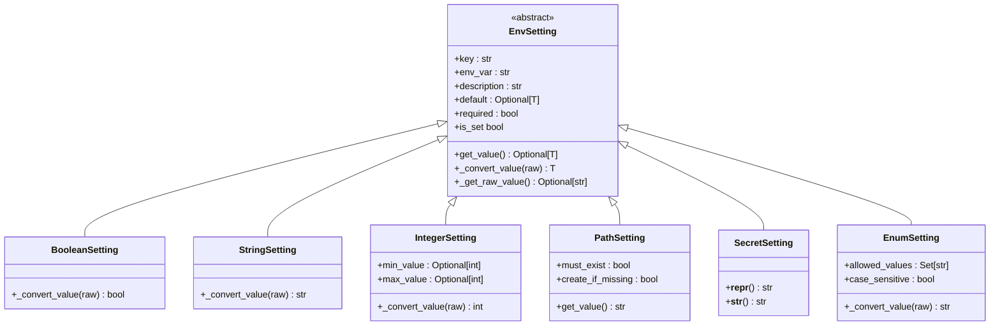

# Settings Management

<cite>
**Referenced Files in This Document**   
- [settings/manager.py](file://src/local_deep_research/settings/manager.py)
- [settings/base.py](file://src/local_deep_research/settings/base.py)
- [settings/env_settings.py](file://src/local_deep_research/settings/env_settings.py)
- [settings/env_registry.py](file://src/local_deep_research/settings/env_registry.py)
- [settings/logger.py](file://src/local_deep_research/settings/logger.py)
- [settings/env_definitions/bootstrap.py](file://src/local_deep_research/settings/env_definitions/bootstrap.py)
- [settings/env_definitions/db_config.py](file://src/local_deep_research/settings/env_definitions/db_config.py)
- [settings/env_definitions/testing.py](file://src/local_deep_research/settings/env_definitions/testing.py)
- [settings/env_definitions/__init__.py](file://src/local_deep_research/settings/env_definitions/__init__.py)
- [web/models/settings.py](file://src/local_deep_research/web/models/settings.py)
- [defaults/default_settings.json](file://src/local_deep_research/defaults/default_settings.json)
- [web/server_config.py](file://src/local_deep_research/web/server_config.py)
</cite>

## Table of Contents
1. [Introduction](#introduction)
2. [Settings Architecture Overview](#settings-architecture-overview)
3. [SettingsManager Class](#settingsmanager-class)
4. [Hierarchical Configuration System](#hierarchical-configuration-system)
5. [Settings Lifecycle](#settings-lifecycle)
6. [Programmatic Settings Access](#programmatic-settings-access)
7. [Base Settings Class and Flask Integration](#base-settings-class-and-flask-integration)
8. [Error Handling and Validation](#error-handling-and-validation)
9. [Logging Infrastructure](#logging-infrastructure)
10. [Custom Settings Categories](#custom-settings-categories)
11. [Conclusion](#conclusion)

## Introduction

The settings management system provides a comprehensive framework for handling application configuration across different environments and components. This system implements a hierarchical configuration approach that merges default settings, environment variables, and user preferences to provide a flexible and robust configuration mechanism. The core of this system is the SettingsManager class, which handles configuration loading, persistence, and validation while ensuring thread safety and proper error handling.

The system is designed to support both database-persisted settings and environment-only settings, with a clear separation between runtime configuration and bootstrap parameters. This documentation explains the architecture, implementation details, and usage patterns for the settings management system, providing guidance for developers who need to extend or modify the configuration system.

**Section sources**
- [settings/manager.py](file://src/local_deep_research/settings/manager.py#L1-L100)
- [settings/base.py](file://src/local_deep_research/settings/base.py#L1-L50)

## Settings Architecture Overview

The settings management system follows a layered architecture with distinct components for different aspects of configuration management. At the core is the SettingsManager class that implements the ISettingsManager interface, providing a consistent API for settings operations. The system supports multiple configuration sources with a defined precedence order: environment variables take precedence over database settings, which in turn override default values.


**Diagram sources**
- [settings/manager.py](file://src/local_deep_research/settings/manager.py#L197-L200)
- [settings/env_settings.py](file://src/local_deep_research/settings/env_settings.py#L1-L50)
- [settings/env_registry.py](file://src/local_deep_research/settings/env_registry.py#L1-L25)

**Section sources**
- [settings/manager.py](file://src/local_deep_research/settings/manager.py#L1-L50)
- [settings/env_settings.py](file://src/local_deep_research/settings/env_settings.py#L1-L30)

## SettingsManager Class

The SettingsManager class is the primary interface for managing application settings, implementing the ISettingsManager interface with methods for getting, setting, and managing configuration values. It provides database-backed persistence with support for type conversion, validation, and change notifications.

The class handles several key responsibilities:
- Thread safety through thread ID validation
- Type conversion based on UI element type
- Environment variable override checking
- Database transaction management
- WebSocket event emission for settings changes


**Diagram sources**
- [settings/base.py](file://src/local_deep_research/settings/base.py#L12-L118)
- [settings/manager.py](file://src/local_deep_research/settings/manager.py#L197-L969)

**Section sources**
- [settings/manager.py](file://src/local_deep_research/settings/manager.py#L197-L969)
- [settings/base.py](file://src/local_deep_research/settings/base.py#L12-L118)

## Hierarchical Configuration System

The settings system implements a hierarchical configuration model that merges values from multiple sources with a defined precedence order. The hierarchy follows the pattern: environment variables → database settings → default settings, allowing for flexible configuration across different deployment environments.

The system supports several configuration sources:
1. **Environment-only settings**: Bootstrap parameters required before database initialization
2. **Default settings**: Built-in defaults loaded from JSON files
3. **Database settings**: User-configurable settings persisted in the database
4. **Environment variables**: Runtime overrides with LDR_ prefix convention


**Diagram sources**
- [settings/manager.py](file://src/local_deep_research/settings/manager.py#L342-L387)
- [settings/env_settings.py](file://src/local_deep_research/settings/env_settings.py#L1-L348)
- [defaults/default_settings.json](file://src/local_deep_research/defaults/default_settings.json#L1-L5819)

**Section sources**
- [settings/manager.py](file://src/local_deep_research/settings/manager.py#L342-L387)
- [settings/env_settings.py](file://src/local_deep_research/settings/env_settings.py#L1-L348)
- [defaults/default_settings.json](file://src/local_deep_research/defaults/default_settings.json#L1-L5819)

## Settings Lifecycle

The settings lifecycle encompasses the complete journey of configuration from initialization to runtime updates and persistence. The system follows a well-defined process for handling settings throughout the application's lifetime.

### Initialization Phase
During application startup, the settings system performs several initialization steps:
1. Check for existing database settings
2. Load default settings if database is empty
3. Apply environment variable overrides
4. Validate and type-convert all settings
5. Establish thread safety constraints

### Runtime Phase
During normal operation, the system handles:
- Settings retrieval with caching
- Dynamic updates with transaction management
- Change notifications via WebSocket
- Type validation and error handling

### Persistence Phase
Settings changes are persisted through:
- Database transactions with rollback on error
- Configurable commit behavior
- Version tracking and migration support

```mermaid
stateDiagram-v2
[*] --> Initialization
Initialization --> "Check DB Settings"
"Check DB Settings" --> "Load Defaults" : No Settings Found
"Check DB Settings" --> "Apply Environment Overrides" : Settings Found
"Load Defaults" --> "Import to DB"
"Import to DB" --> "Apply Environment Overrides"
"Apply Environment Overrides" --> "Validate and Convert"
"Validate and Convert" --> Ready
Ready --> "Get Setting"
Ready --> "Set Setting"
"Get Setting" --> Ready
"Set Setting" --> "Validate Input"
"Validate Input" --> "Database Transaction"
"Database Transaction" --> "Emit WebSocket Event"
"Emit WebSocket Event" --> Ready
"Database Transaction" --> "Rollback on Error" : Failure
"Rollback on Error" --> Ready
```

**Diagram sources**
- [settings/manager.py](file://src/local_deep_research/settings/manager.py#L223-L234)
- [settings/manager.py](file://src/local_deep_research/settings/manager.py#L389-L463)
- [settings/manager.py](file://src/local_deep_research/settings/manager.py#L457-L458)

**Section sources**
- [settings/manager.py](file://src/local_deep_research/settings/manager.py#L223-L234)
- [settings/manager.py](file://src/local_deep_research/settings/manager.py#L389-L463)

## Programmatic Settings Access

The settings system provides a comprehensive API for programmatic access to configuration values. Developers can interact with settings through the SettingsManager class, which offers methods for retrieving, updating, and managing configuration.

### Getting Settings
Settings can be retrieved using the `get_setting` method, which accepts a key, default value, and environment check flag:

```python
# Get a single setting value
value = settings_manager.get_setting("app.debug", default=False)

# Get a group of related settings
settings_map = settings_manager.get_setting("llm.")
```

### Setting Values
Settings can be updated using the `set_setting` method, with optional transaction control:

```python
# Set a setting with immediate commit
success = settings_manager.set_setting("app.debug", True, commit=True)

# Set multiple settings within a single transaction
settings_manager.set_setting("llm.temperature", 0.7, commit=False)
settings_manager.set_setting("llm.max_tokens", 30000, commit=False)
# Commit all changes at once
settings_manager.db_session.commit()
```

### Batch Operations
The system supports batch operations for importing and exporting settings:

```python
# Import settings from a dictionary
settings_data = {
    "app.debug": {"value": True},
    "llm.model": {"value": "gpt-4o"}
}
settings_manager.import_settings(settings_data, commit=True)

# Get all settings as a snapshot
all_settings = settings_manager.get_all_settings()

# Get simplified key-value snapshot
snapshot = settings_manager.get_settings_snapshot()
```

**Section sources**
- [settings/manager.py](file://src/local_deep_research/settings/manager.py#L342-L387)
- [settings/manager.py](file://src/local_deep_research/settings/manager.py#L389-L463)
- [settings/manager.py](file://src/local_deep_research/settings/manager.py#L746-L794)

## Base Settings Class and Flask Integration

The settings system integrates with Flask's configuration through a combination of direct setting access and configuration file synchronization. The base settings classes are defined using Pydantic models that provide type safety and validation.

### Base Settings Class
The `BaseSetting` class serves as the foundation for all setting types, defining common properties:


**Diagram sources**
- [web/models/settings.py](file://src/local_deep_research/web/models/settings.py#L17-L96)

### Flask Integration
The system bridges Flask configuration through the `server_config.py` module, which synchronizes settings between the database and Flask's configuration:

```python
def load_server_config() -> Dict[str, Any]:
    """Load server configuration from file or environment variables."""
    config = {
        "host": get_typed_setting_value(
            "web.host", saved_config.get("host"), "text", default="0.0.0.0"
        ),
        "port": get_typed_setting_value(
            "web.port", saved_config.get("port"), "number", default=5000
        ),
        "debug": get_typed_setting_value(
            "app.debug", saved_config.get("debug"), "checkbox", default=False
        ),
        # Additional settings...
    }
    return config
```

The integration follows a specific flow:
1. Load settings from database with environment overrides
2. Apply type conversion based on UI element
3. Cache configuration values
4. Synchronize with Flask application

**Section sources**
- [web/models/settings.py](file://src/local_deep_research/web/models/settings.py#L17-L96)
- [web/server_config.py](file://src/local_deep_research/web/server_config.py#L23-L85)

## Error Handling and Validation

The settings system implements comprehensive error handling and validation to ensure configuration integrity and reliability. The system handles various error conditions and provides appropriate feedback and recovery mechanisms.

### Validation Mechanisms
The system performs several types of validation:
- **Type validation**: Ensures settings values match expected types
- **Range validation**: Checks numeric values against min/max constraints
- **Format validation**: Validates string formats and patterns
- **Dependency validation**: Ensures related settings are consistent

### Error Handling
The system handles errors through:
- Graceful degradation with default values
- Detailed logging of validation failures
- Transaction rollback on database errors
- Thread safety enforcement


**Diagram sources**
- [settings/manager.py](file://src/local_deep_research/settings/manager.py#L136-L175)
- [settings/manager.py](file://src/local_deep_research/settings/manager.py#L460-L463)
- [settings/env_settings.py](file://src/local_deep_research/settings/env_settings.py#L129-L148)

**Section sources**
- [settings/manager.py](file://src/local_deep_research/settings/manager.py#L136-L175)
- [settings/manager.py](file://src/local_deep_research/settings/manager.py#L460-L463)
- [settings/env_settings.py](file://src/local_deep_research/settings/env_settings.py#L129-L148)

## Logging Infrastructure

The settings system includes a sophisticated logging infrastructure that tracks configuration changes and provides visibility into the configuration process. The logging system is controlled by the `LDR_LOG_SETTINGS` environment variable, which determines the verbosity level.

### Logging Levels
The system supports four logging levels:
- **none**: No settings logging
- **summary**: Count and basic info at INFO level
- **debug**: Full settings at DEBUG level with sensitive keys redacted
- **debug_unsafe**: Full settings at DEBUG level including sensitive keys

### Redaction System
Sensitive settings values are automatically redacted in logs using pattern matching:

```python
def redact_sensitive_keys(settings: Dict[str, Any]) -> Dict[str, Any]:
    """Redact sensitive keys from settings dictionary."""
    sensitive_patterns = [
        "api_key",
        "apikey",
        "password",
        "secret",
        "token",
        "credential",
        "auth",
        "private",
    ]
    
    redacted = {}
    for key, value in settings.items():
        key_lower = key.lower()
        is_sensitive = any(pattern in key_lower for pattern in sensitive_patterns)
        
        if is_sensitive:
            redacted[key] = "***REDACTED***"
        elif isinstance(value, dict):
            redacted[key] = redact_sensitive_keys(value)
        else:
            redacted[key] = value
            
    return redacted
```

The logging system ensures that sensitive configuration data is protected while still providing useful diagnostic information for troubleshooting.

**Section sources**
- [settings/logger.py](file://src/local_deep_research/settings/logger.py#L1-L154)

## Custom Settings Categories

The settings system supports extensibility through custom settings categories, allowing developers to add new configuration options for specific features. The system provides mechanisms for defining new setting types and integrating them with the existing configuration framework.

### Creating Custom Settings
To create custom settings categories, developers can:
1. Define new setting keys with appropriate prefixes
2. Add default values in the default_settings.json file
3. Register environment-only settings if needed
4. Create specialized setting classes that extend BaseSetting

### Environment-Only Settings
For settings required before database initialization, the system provides environment-only settings through the EnvSetting hierarchy:



**Diagram sources**
- [settings/env_settings.py](file://src/local_deep_research/settings/env_settings.py#L33-L348)

### Registry System
The SettingsRegistry manages all environment-only settings and provides a centralized interface for accessing them:

```python
class SettingsRegistry:
    """Registry for all environment settings."""
    
    def __init__(self):
        self._settings: Dict[str, EnvSetting] = {}
        self._categories: Dict[str, List[EnvSetting]] = {}
        
    def register_category(self, category: str, settings: List[EnvSetting]):
        """Register a category of settings."""
        self._categories[category] = settings
        for setting in settings:
            self._settings[setting.key] = setting
            
    def get(self, key: str, default: Optional[Any] = None) -> Any:
        """Get a setting value."""
        setting = self._settings.get(key)
        if not setting:
            return default
            
        try:
            value = setting.get_value()
            return value if value is not None else default
        except ValueError:
            return default
```

This extensible architecture allows for the addition of new settings categories while maintaining consistency and type safety across the configuration system.

**Section sources**
- [settings/env_settings.py](file://src/local_deep_research/settings/env_settings.py#L33-L348)
- [settings/env_registry.py](file://src/local_deep_research/settings/env_registry.py#L1-L112)

## Conclusion

The settings management system provides a robust and flexible framework for handling application configuration across different environments and components. By implementing a hierarchical configuration model with support for environment variables, database persistence, and default values, the system offers a comprehensive solution for managing application settings.

Key features of the system include:
- Thread-safe settings management with proper error handling
- Hierarchical configuration with defined precedence
- Comprehensive type conversion and validation
- Environment-only settings for bootstrap parameters
- Extensible architecture for custom settings categories
- Integrated logging with sensitive data redaction
- Seamless integration with Flask's configuration system

The system's design emphasizes reliability, security, and ease of use, making it suitable for both development and production environments. By following the patterns and practices documented here, developers can effectively extend and customize the settings system to meet the needs of new features and functionality.

**Section sources**
- [settings/manager.py](file://src/local_deep_research/settings/manager.py#L1-L969)
- [settings/base.py](file://src/local_deep_research/settings/base.py#L1-L118)
- [settings/env_settings.py](file://src/local_deep_research/settings/env_settings.py#L1-L348)