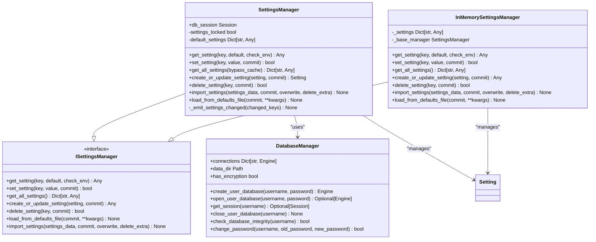
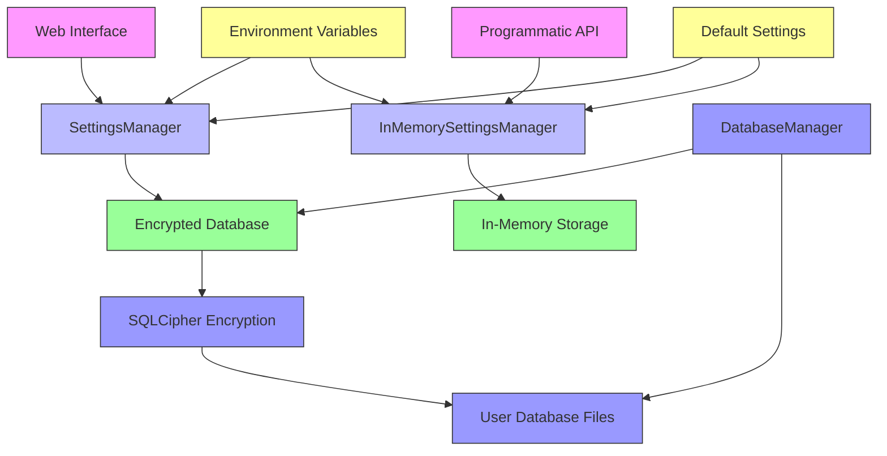
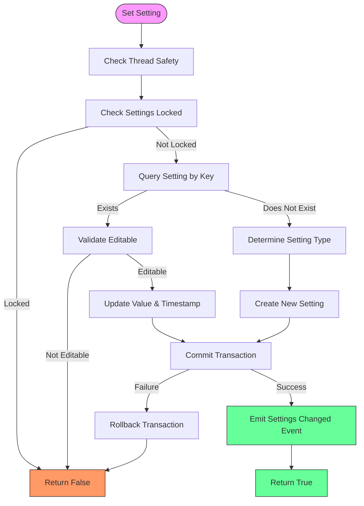
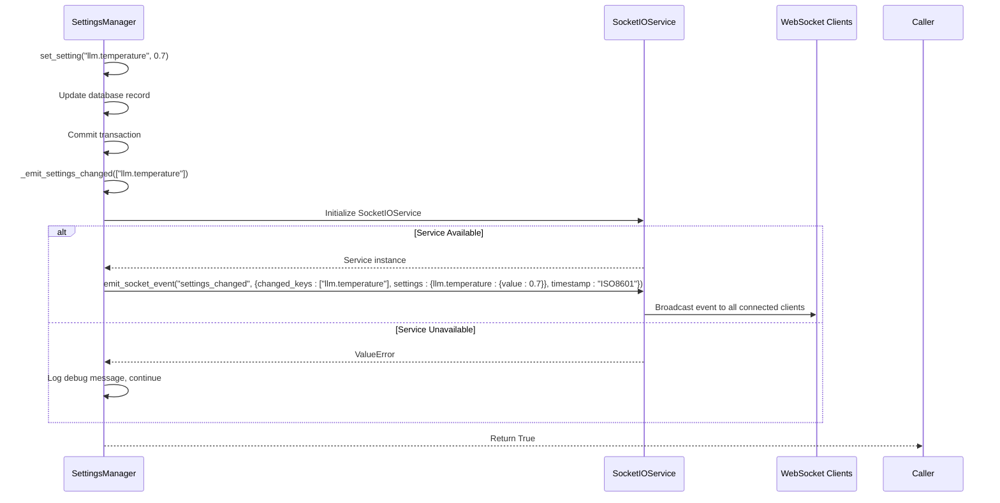
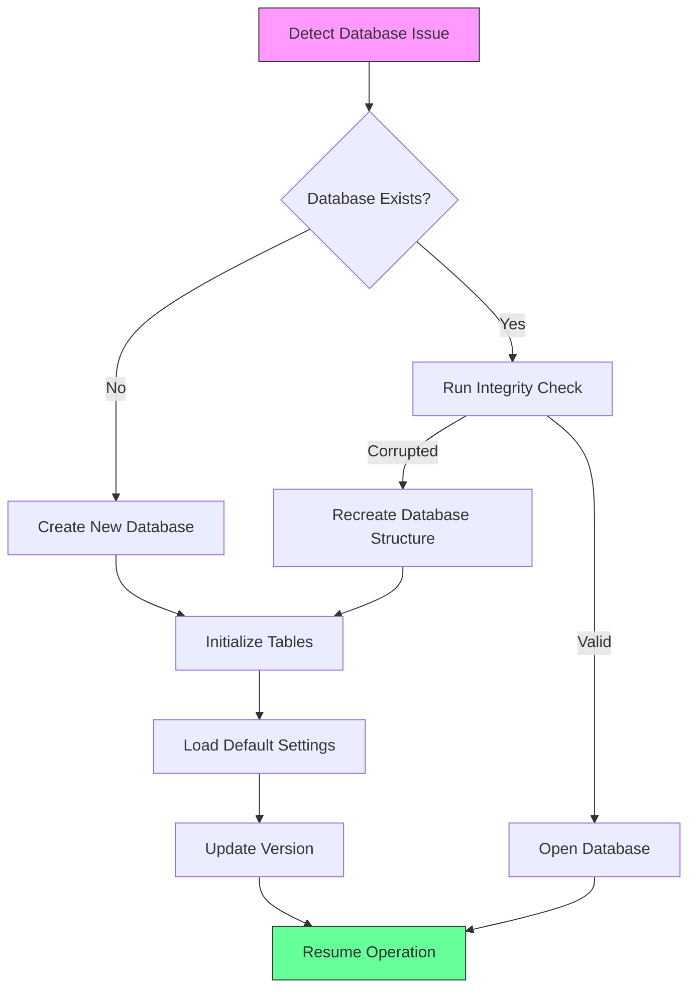

# Settings Persistence

<cite>
**Referenced Files in This Document**   
- [manager.py](file://src/local_deep_research/settings/manager.py)
- [base.py](file://src/local_deep_research/settings/base.py)
- [settings.py](file://src/local_deep_research/database/models/settings.py)
- [encrypted_db.py](file://src/local_deep_research/database/encrypted_db.py)
- [settings_utils.py](file://src/local_deep_research/api/settings_utils.py)
- [initialize.py](file://src/local_deep_research/database/initialize.py)
- [web/models/settings.py](file://src/local_deep_research/web/models/settings.py)
</cite>

## Table of Contents
1. [Introduction](#introduction)
2. [Core Components](#core-components)
3. [Settings Persistence Architecture](#settings-persistence-architecture)
4. [Transactional Update Process](#transactional-update-process)
5. [Event-Driven Notification System](#event-driven-notification-system)
6. [Web Interface Settings Persistence](#web-interface-settings-persistence)
7. [Programmatic API Settings Persistence](#programmatic-api-settings-persistence)
8. [Performance Considerations](#performance-considerations)
9. [Concurrent Modification Handling](#concurrent-modification-handling)
10. [Settings Recovery Procedures](#settings-recovery-procedures)
11. [Migration Strategies](#migration-strategies)
12. [Conclusion](#conclusion)

## Introduction

The settings persistence mechanism in this application provides a robust system for storing user-modified settings in an encrypted database and synchronizing them across sessions. This documentation details the architecture and implementation of the settings management system, focusing on the interaction between the SettingsManager and database models for durable storage.

The system ensures data consistency through transactional updates and notifies components of configuration changes via an event-driven notification system. Settings can be persisted through both the web interface and programmatic API, with comprehensive support for performance optimization, concurrent modification handling, recovery procedures, and migration strategies.

**Section sources**
- [manager.py](file://src/local_deep_research/settings/manager.py#L1-L969)

## Core Components

The settings persistence system consists of several key components that work together to provide a reliable and secure storage mechanism. The SettingsManager class serves as the primary interface for managing application settings, providing methods to get and set settings with database storage and file fallback capabilities.

The system uses SQLAlchemy ORM models to represent settings in the database, with the Setting model storing global application settings and UserSettings storing user-specific preferences. The encrypted_db.py module manages SQLCipher-encrypted databases for each user, ensuring that sensitive data like API keys are protected.

The InMemorySettingsManager provides a lightweight alternative for programmatic API usage without requiring database access, while maintaining compatibility with the same settings schema used in the web interface.



**Diagram sources**
- [manager.py](file://src/local_deep_research/settings/manager.py#L197-L969)
- [base.py](file://src/local_deep_research/settings/base.py#L12-L118)
- [settings_utils.py](file://src/local_deep_research/api/settings_utils.py#L18-L189)
- [encrypted_db.py](file://src/local_deep_research/database/encrypted_db.py#L27-L620)

**Section sources**
- [manager.py](file://src/local_deep_research/settings/manager.py#L1-L969)
- [base.py](file://src/local_deep_research/settings/base.py#L1-L118)
- [settings.py](file://src/local_deep_research/database/models/settings.py#L1-L109)
- [encrypted_db.py](file://src/local_deep_research/database/encrypted_db.py#L1-L621)
- [settings_utils.py](file://src/local_deep_research/api/settings_utils.py#L1-L333)

## Settings Persistence Architecture

The settings persistence architecture is built around a layered approach that ensures data durability, security, and consistency. At the core is the SettingsManager class, which implements the ISettingsManager interface and provides a consistent API for settings operations.

Settings are stored in an encrypted SQLite database using SQLCipher, with each user having their own encrypted database file. The DatabaseManager class handles the creation, opening, and management of these encrypted databases, ensuring that all database operations are properly secured.

The system supports multiple storage backends through a unified interface. When a database session is available, settings are stored in the encrypted database. When no database session is available (such as in programmatic API usage), the system falls back to in-memory storage while maintaining the same data structure and type handling.



**Diagram sources**
- [manager.py](file://src/local_deep_research/settings/manager.py#L197-L969)
- [encrypted_db.py](file://src/local_deep_research/database/encrypted_db.py#L27-L620)
- [settings_utils.py](file://src/local_deep_research/api/settings_utils.py#L18-L189)

**Section sources**
- [manager.py](file://src/local_deep_research/settings/manager.py#L1-L969)
- [encrypted_db.py](file://src/local_deep_research/database/encrypted_db.py#L1-L621)
- [settings.py](file://src/local_deep_research/database/models/settings.py#L1-L109)

## Transactional Update Process

The transactional update process ensures data consistency when modifying settings. When a setting is updated through the SettingsManager.set_setting() method, the operation follows a strict transactional pattern that guarantees atomicity, consistency, isolation, and durability (ACID properties).

The update process begins with thread safety checks to ensure that the SettingsManager instance is being used in the same thread it was created in. This prevents race conditions and ensures that database sessions are used correctly. If settings are locked (via the app.lock_settings setting), the update is rejected immediately.

For existing settings, the system retrieves the setting record, validates that it is editable, updates the value and timestamp, and commits the transaction. For new settings, the system determines the appropriate setting type based on the key prefix (e.g., "llm." for LLM settings) and creates a new record with appropriate metadata.

All database operations are wrapped in try-except blocks to handle SQLAlchemy errors. If an error occurs, the transaction is rolled back, ensuring that the database remains in a consistent state. The commit parameter allows callers to control whether the transaction is committed immediately or left open for potential batching with other operations.



**Diagram sources**
- [manager.py](file://src/local_deep_research/settings/manager.py#L389-L463)

**Section sources**
- [manager.py](file://src/local_deep_research/settings/manager.py#L389-L463)

## Event-Driven Notification System

The event-driven notification system informs components of configuration changes through WebSocket events. When a setting is successfully updated and committed, the SettingsManager emits a "settings_changed" event containing information about the modified settings.

The notification system is implemented in the _emit_settings_changed() method, which creates a SocketIOService instance and emits an event with the changed keys, updated settings values, and timestamp. This allows real-time components in the web interface to respond immediately to configuration changes without requiring page refreshes.

The system is designed to be resilient to failures in the notification subsystem. If the SocketIOService cannot be initialized (e.g., because the server is not fully initialized), the method logs a debug message and continues without interrupting the settings update process. Similarly, if the event emission fails, the error is logged but does not affect the success of the settings update.

The notification payload includes only the changed keys and their values, minimizing network overhead. Components that need to respond to settings changes can subscribe to the "settings_changed" event and filter for specific settings of interest.



**Diagram sources**
- [manager.py](file://src/local_deep_research/settings/manager.py#L850-L896)

**Section sources**
- [manager.py](file://src/local_deep_research/settings/manager.py#L850-L896)

## Web Interface Settings Persistence

The web interface settings persistence mechanism integrates with the backend settings system through a combination of server-side and client-side components. When users modify settings through the web interface, the changes are processed by server endpoints that use the SettingsManager to persist the changes to the encrypted database.

The system supports hierarchical settings organization through the use of dot-notation keys (e.g., "llm.provider", "search.max_results"). Settings are grouped into categories based on their key prefixes, which determines their placement in the settings UI. The system automatically determines the appropriate UI element type (text, number, checkbox, etc.) based on the setting's value type.

Environment variables can override database settings, with variable names following the pattern LDR_{KEY_IN_UPPERCASE_WITH_UNDERSCORES}. This allows deployment-specific configuration without modifying the database. The system checks for environment variable overrides when retrieving settings, giving them precedence over database values.

Default settings are loaded from JSON files in the defaults/settings directory, providing a baseline configuration that can be extended or overridden. The system ensures that new settings added to the defaults automatically appear in the UI by merging default settings with database values when retrieving all settings.

**Section sources**
- [manager.py](file://src/local_deep_research/settings/manager.py#L342-L554)
- [web/models/settings.py](file://src/local_deep_research/web/models/settings.py#L1-L96)

## Programmatic API Settings Persistence

The programmatic API settings persistence mechanism is designed for use in scripts and automated workflows. The InMemorySettingsManager class provides a lightweight implementation that doesn't require database access, making it suitable for programmatic use cases.

The API provides several utility functions for creating settings snapshots, including create_settings_snapshot() which accepts overrides as a dictionary or through keyword arguments. Common settings like provider, api_key, temperature, and max_search_results have dedicated parameters for convenience.

Settings snapshots created through the API follow the same structure as those used in the web interface, ensuring consistency across different usage patterns. The system handles type conversion appropriately based on the setting's UI element type, ensuring that values are properly typed when used in research operations.

The InMemorySettingsManager loads default settings from the same JSON files used by the web interface, ensuring that programmatic usage has access to the same baseline configuration. Environment variables are also respected, allowing for consistent configuration across both interactive and automated usage.

```mermaid
flowchart TD
A[create_settings_snapshot] --> B{Check base_settings}
B --> |None| C[get_default_settings_snapshot]
B --> |Provided| D[Use base_settings]
C --> E[Apply overrides]
D --> E
E --> F{Check kwargs}
F --> |provider| G[Set llm.provider]
F --> |api_key| H[Set llm.{provider}.api_key]
F --> |temperature| I[Set llm.temperature]
F --> |max_search_results| J[Set search.max_results]
G --> K[Return settings snapshot]
H --> K
I --> K
J --> K
F --> |No relevant kwargs| K
style A fill:#f9f,stroke:#333
style K fill:#6f9,stroke:#333
```

**Diagram sources**
- [settings_utils.py](file://src/local_deep_research/api/settings_utils.py#L207-L308)

**Section sources**
- [settings_utils.py](file://src/local_deep_research/api/settings_utils.py#L1-L333)

## Performance Considerations

The settings persistence system includes several performance optimizations to handle frequent updates efficiently. The SettingsManager implements caching at multiple levels to minimize database queries, particularly for frequently accessed settings.

For bulk operations, the system allows disabling automatic commits (commit=False parameter) so that multiple settings updates can be batched into a single transaction. This reduces the overhead of transaction management and improves performance when updating many settings simultaneously.

The encrypted database implementation includes performance pragmas specifically tuned for SQLCipher, including optimized page sizes and KDF iterations. These settings balance security with performance, ensuring that encryption overhead is minimized while maintaining strong protection for sensitive data.

The system also includes a settings cache that can be cleared when needed, allowing applications to refresh their view of settings after bulk updates. The get_all_settings() method includes a bypass_cache parameter for cases where the most current settings are required.

For high-frequency update scenarios, the system recommends using the in-memory settings manager when persistent storage is not required, as this eliminates database I/O overhead entirely.

**Section sources**
- [manager.py](file://src/local_deep_research/settings/manager.py#L465-L467)
- [encrypted_db.py](file://src/local_deep_research/database/encrypted_db.py#L146-L177)

## Concurrent Modification Handling

The settings persistence system handles concurrent modifications through a combination of database transactions, thread safety checks, and optimistic concurrency control. Each SettingsManager instance is tied to the thread in which it was created, preventing cross-thread access that could lead to race conditions.

Database operations use SQLAlchemy's transaction management to ensure that updates are atomic. When multiple updates occur simultaneously, the database's transaction isolation ensures that each operation sees a consistent view of the data. The system uses the default isolation level provided by SQLite, which prevents dirty reads and non-repeatable reads.

For settings that should not be modified concurrently, the system provides the app.lock_settings flag, which prevents any setting modifications when enabled. This can be used during system maintenance or configuration updates to prevent conflicts.

The system does not implement explicit locking mechanisms for individual settings, relying instead on the database's row-level locking during UPDATE operations. This ensures that simultaneous updates to the same setting are serialized by the database, with the last update winning.

**Section sources**
- [manager.py](file://src/local_deep_research/settings/manager.py#L235-L244)
- [manager.py](file://src/local_deep_research/settings/manager.py#L246-L260)

## Settings Recovery Procedures

The settings recovery procedures are designed to handle corrupted settings and ensure system stability. The DatabaseManager includes a check_database_integrity() method that performs both SQLite's PRAGMA quick_check and SQLCipher's PRAGMA cipher_integrity_check to verify database integrity.

When a database corruption is detected, the system can attempt recovery by creating a new database and reinitializing it with default settings. The initialize_database() function in initialize.py handles this process, creating all required tables and loading default settings when a database is empty or corrupted.

For user databases, the system can recreate the database structure using raw SQLCipher commands outside of SQLAlchemy, which helps avoid issues that might prevent SQLAlchemy from functioning on a corrupted database. After recreating the structure, the system reinitializes default settings and updates the version tracking.

The system also maintains a bootstrap mechanism for critical environment variables that must be available before database access. These variables are defined in the env_registry and can be retrieved using the get_bootstrap_env_vars() method, ensuring that essential configuration is available even if the database cannot be accessed.



**Diagram sources**
- [encrypted_db.py](file://src/local_deep_research/database/encrypted_db.py#L452-L478)
- [initialize.py](file://src/local_deep_research/database/initialize.py#L19-L63)

**Section sources**
- [encrypted_db.py](file://src/local_deep_research/database/encrypted_db.py#L1-L621)
- [initialize.py](file://src/local_deep_research/database/initialize.py#L1-L219)

## Migration Strategies

The migration strategies for introducing new persistent configuration options are designed to be seamless and backward compatible. When new settings are added to the system, they are first defined in the default settings JSON files, ensuring they are available to all users.

The system automatically detects when the package version differs from the version stored in the database (app.version setting). When a version mismatch is detected, the system loads new settings from the defaults file without overwriting existing settings, preserving user customizations while adding new options.

The import_settings() method supports migration scenarios with parameters to control behavior:
- overwrite=False preserves existing setting values
- delete_extra=True removes obsolete settings not present in the new configuration
- commit=False allows batching with other operations

For database schema changes, the system includes a simple migration framework in initialize.py that can add new columns to existing tables. The _add_column_if_not_exists() function checks for column existence before attempting to add it, preventing errors on subsequent runs.

Future versions will replace this simple migration system with Alembic for more sophisticated schema evolution capabilities, including the ability to modify or remove columns and migrate data between schema versions.

**Section sources**
- [manager.py](file://src/local_deep_research/settings/manager.py#L709-L744)
- [initialize.py](file://src/local_deep_research/database/initialize.py#L66-L92)

## Conclusion

The settings persistence mechanism provides a comprehensive solution for storing and managing application configuration in a secure, reliable, and efficient manner. By leveraging encrypted databases, transactional updates, and event-driven notifications, the system ensures that user preferences are durably stored and consistently available across sessions.

The architecture supports both interactive (web interface) and programmatic usage patterns through a unified API, with appropriate optimizations for each scenario. Performance considerations, concurrent modification handling, recovery procedures, and migration strategies are all addressed to provide a robust foundation for application configuration.

Key strengths of the system include its security through SQLCipher encryption, consistency through transactional updates, and flexibility through environment variable overrides and default settings management. The event-driven notification system enables real-time updates to the user interface, creating a responsive experience when configuration changes are made.

As the system evolves, the planned migration to Alembic for database schema management will further enhance the reliability and maintainability of the settings persistence mechanism.