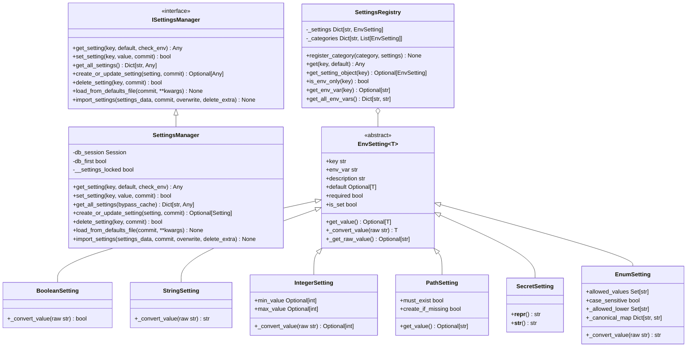
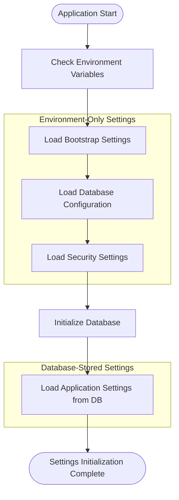
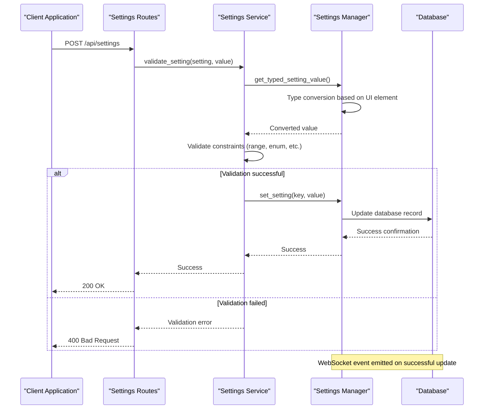
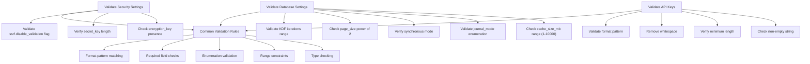

# Settings Validation

<cite>
**Referenced Files in This Document**   
- [manager.py](file://src/local_deep_research/settings/manager.py)
- [env_settings.py](file://src/local_deep_research/settings/env_settings.py)
- [env_registry.py](file://src/local_deep_research/settings/env_registry.py)
- [base.py](file://src/local_deep_research/settings/base.py)
- [default_settings.json](file://src/local_deep_research/defaults/default_settings.json)
- [bootstrap.py](file://src/local_deep_research/settings/env_definitions/bootstrap.py)
- [db_config.py](file://src/local_deep_research/settings/env_definitions/db_config.py)
- [security.py](file://src/local_deep_research/settings/env_definitions/security.py)
- [testing.py](file://src/local_deep_research/settings/env_definitions/testing.py)
</cite>

## Table of Contents
1. [Introduction](#introduction)
2. [Validation Architecture](#validation-architecture)
3. [Environment-Only Settings](#environment-only-settings)
4. [Validation Pipeline](#validation-pipeline)
5. [Error Reporting Mechanism](#error-reporting-mechanism)
6. [Validation Rules Examples](#validation-rules-examples)
7. [Custom Validators Implementation](#custom-validators-implementation)
8. [Common Validation Issues and Solutions](#common-validation-issues-and-solutions)
9. [Conclusion](#conclusion)

## Introduction

The settings validation system in the Local Deep Research application ensures configuration integrity through a comprehensive validation framework. This system validates configuration values using type checking, range constraints, and business rules defined in environment definitions. The validation process occurs during both initialization and runtime updates, providing robust protection against invalid configurations. The system distinguishes between database-stored settings and environment-only settings, with the latter being critical for bootstrapping the application before database connectivity is established. This documentation details the validation architecture, pipeline, error reporting, and practical implementation guidance for developers working with the settings system.

**Section sources**
- [manager.py](file://src/local_deep_research/settings/manager.py#L1-L100)
- [env_settings.py](file://src/local_deep_research/settings/env_settings.py#L1-L50)

## Validation Architecture

The settings validation system is built around a hierarchical architecture that separates concerns between environment-only settings and database-stored settings. The core components include the SettingsManager, which implements the ISettingsManager interface, and the SettingsRegistry, which manages environment-only settings. The system uses a type-driven approach where each setting has an associated UI element type (text, number, checkbox, etc.) that determines its validation behavior.

The architecture follows a layered pattern with distinct responsibilities:
- **SettingsManager**: Coordinates validation between environment variables and database values
- **SettingsRegistry**: Manages environment-only settings required for bootstrapping
- **EnvSetting classes**: Define specific validation rules for different data types
- **Validation functions**: Handle type conversion and constraint checking

This separation ensures that critical bootstrap settings are validated before database initialization, while application settings can leverage database persistence and complex validation rules.

**Diagram sources**
- [base.py](file://src/local_deep_research/settings/base.py#L12-L118)
- [manager.py](file://src/local_deep_research/settings/manager.py#L197-L800)
- [env_settings.py](file://src/local_deep_research/settings/env_settings.py#L33-L348)

**Section sources**
- [manager.py](file://src/local_deep_research/settings/manager.py#L1-L200)
- [env_settings.py](file://src/local_deep_research/settings/env_settings.py#L1-L100)

## Environment-Only Settings

Environment-only settings are critical configuration values that must be available before database initialization. These settings fall into three main categories: bootstrap, database configuration, and security. The system uses the SettingsRegistry to manage these settings, ensuring they are validated before any database operations occur.

Bootstrap settings include encryption keys, secret keys, and system paths required to initialize the application. These settings are defined in the bootstrap.py file and include the database encryption key, application secret key, and various directory paths. The system automatically creates directories if they don't exist when the create_if_missing flag is set.

Database configuration settings control SQLite and SQLCipher parameters such as cache size, journal mode, synchronous mode, page size, and encryption parameters. These settings are defined in db_config.py and include range validation for numeric values and enumeration validation for mode settings. For example, the cache_size_mb setting has a minimum of 1MB and maximum of 10,000MB, while journal_mode accepts only specific values like WAL, DELETE, or MEMORY.

Security settings include flags that control security-related behavior, such as SSRF validation. These settings are typically used in development and testing environments and should never be disabled in production. The system provides explicit warnings in the code to prevent accidental production use of insecure configurations.

**Diagram sources**
- [env_registry.py](file://src/local_deep_research/settings/env_registry.py#L1-L112)
- [bootstrap.py](file://src/local_deep_research/settings/env_definitions/bootstrap.py#L1-L61)
- [db_config.py](file://src/local_deep_research/settings/env_definitions/db_config.py#L1-L73)
- [security.py](file://src/local_deep_research/settings/env_definitions/security.py#L1-L24)

**Section sources**
- [env_settings.py](file://src/local_deep_research/settings/env_settings.py#L1-L200)
- [env_registry.py](file://src/local_deep_research/settings/env_registry.py#L1-L50)

## Validation Pipeline

The settings validation pipeline processes configurations through a multi-stage validation process during both initialization and runtime updates. The pipeline begins with environment variable checking, followed by type conversion, constraint validation, and finally database persistence. This ensures that settings are validated at multiple points in the application lifecycle.

During initialization, the system first validates environment-only settings required for bootstrapping. The SettingsRegistry checks each environment variable against its defined constraints, applying type conversion and range validation as appropriate. Once the database is accessible, the system loads default settings from the default_settings.json file and validates them against the database schema.

For runtime updates, the validation pipeline follows a specific sequence:
1. Receive setting update request
2. Parse and convert the value based on UI element type
3. Validate against defined constraints (range, enumeration, etc.)
4. Check environment variable overrides
5. Persist to database if validation passes
6. Emit WebSocket events for settings changes

The pipeline handles different UI element types through the _UI_ELEMENT_TO_SETTING_TYPE mapping, which associates each UI element with its appropriate type conversion function. For example, "number" elements are parsed with range checking, "checkbox" elements follow HTML semantics where any present value is considered true, and "select" elements are treated as strings.

**Diagram sources**
- [manager.py](file://src/local_deep_research/settings/manager.py#L92-L110)
- [settings_routes.py](file://src/local_deep_research/web/routes/settings_routes.py#L384-L415)
- [settings_service.py](file://src/local_deep_research/web/services/settings_service.py#L94-L111)

**Section sources**
- [manager.py](file://src/local_deep_research/settings/manager.py#L92-L200)
- [settings_routes.py](file://src/local_deep_research/web/routes/settings_routes.py#L384-L415)

## Error Reporting Mechanism

The error reporting mechanism provides actionable feedback for invalid configurations through a comprehensive system of validation error collection and reporting. When a setting fails validation, the system generates specific error messages that identify the exact nature of the problem, enabling users to correct their configurations efficiently.

The mechanism works by collecting validation errors in a structured format that includes the setting key, the invalid value, and a descriptive error message. For environment-only settings, errors are logged with detailed context about the expected format and constraints. For database-stored settings, validation errors are returned to the client through the API with appropriate HTTP status codes.

The system handles different types of validation errors with specific messaging:
- **Type conversion errors**: Report when a value cannot be converted to the expected type
- **Range constraint violations**: Specify the allowed minimum and maximum values
- **Enumeration validation failures**: List the allowed values when an invalid option is provided
- **Required field errors**: Indicate when a mandatory setting is missing

For environment variables, the system provides warnings when invalid values are detected but defaults are available, allowing the application to continue with safe fallback values. This approach balances strict validation with operational resilience, preventing application startup failures due to minor configuration issues while still alerting administrators to potential problems.

**Section sources**
- [env_settings.py](file://src/local_deep_research/settings/env_settings.py#L130-L148)
- [manager.py](file://src/local_deep_research/settings/manager.py#L170-L175)
- [settings_routes.py](file://src/local_deep_research/web/routes/settings_routes.py#L412-L415)

## Validation Rules Examples

The settings validation system implements various validation rules for different configuration categories, including security settings, database connections, and API keys. These rules ensure that critical configurations meet security and operational requirements.

For security settings, the system validates encryption keys and security flags. The bootstrap.encryption_key setting is treated as a secret and validated for presence when encryption is required. The security.ssrf.disable_validation setting is a boolean flag that should only be enabled in development environments, with explicit code comments warning against production use.

Database connection settings include comprehensive validation for connection parameters. The db_config.cache_size_mb setting enforces a range constraint between 1 and 10,000 MB, while db_config.journal_mode accepts only specific values like WAL, DELETE, or MEMORY. The system also validates database URL formats and path existence for database files.

API key validation follows a pattern of type checking and format validation. While specific API key formats depend on the service provider, the system ensures that API keys are non-empty strings and handles them as secrets in logging and display. The validation pipeline checks for minimum length requirements and common formatting issues like whitespace characters.

**Diagram sources**
- [bootstrap.py](file://src/local_deep_research/settings/env_definitions/bootstrap.py#L1-L61)
- [db_config.py](file://src/local_deep_research/settings/env_definitions/db_config.py#L1-L73)
- [default_settings.json](file://src/local_deep_research/defaults/default_settings.json#L1-L100)

**Section sources**
- [env_settings.py](file://src/local_deep_research/settings/env_settings.py#L81-L255)
- [default_settings.json](file://src/local_deep_research/defaults/default_settings.json#L1-L200)

## Custom Validators Implementation

Implementing custom validators for new settings requires extending the existing validation framework while maintaining consistency with the established patterns. The process involves defining new setting types, creating appropriate validation logic, and integrating with the SettingsRegistry.

To create a custom validator, developers should extend the EnvSetting base class with specific type parameters and implement the _convert_value method to handle the validation logic. For example, a URL validator would inherit from StringSetting and add URL format validation using regular expressions or dedicated URL parsing libraries.

The implementation should follow these guidelines:
1. Define clear error messages that explain validation failures
2. Provide reasonable defaults when possible
3. Use appropriate data types and type hints
4. Include comprehensive documentation
5. Add unit tests for validation edge cases

For complex validation scenarios, developers can create composite validators that combine multiple validation rules. These validators can be registered with the SettingsRegistry alongside existing settings, ensuring they are available throughout the application lifecycle.

**Section sources**
- [env_settings.py](file://src/local_deep_research/settings/env_settings.py#L33-L348)
- [env_registry.py](file://src/local_deep_research/settings/env_registry.py#L14-L27)

## Common Validation Issues and Solutions

The settings validation system addresses several common configuration issues, including malformed URLs, invalid credentials, and incompatible configuration combinations. These issues are handled through specific validation rules and error handling patterns.

Malformed URLs are detected through format validation that checks for proper protocol, domain, and path components. The system uses URL parsing libraries to validate the structure and rejects URLs with invalid characters or missing components. For database URLs, additional validation ensures that required parameters are present.

Invalid credentials are handled by validating format and length requirements while treating credential values as secrets in logs and error messages. The system checks for minimum length requirements and common formatting issues like leading/trailing whitespace, but avoids overly restrictive complexity requirements that might interfere with legitimate credentials.

Incompatible configuration combinations are prevented through cross-setting validation rules. For example, when encryption is enabled, the system validates that an encryption key is provided. Similarly, when rate limiting is configured, the system ensures that required parameters like rate limits and time windows are properly set.

The system also addresses configuration drift by validating settings against their defined constraints on every access, not just during updates. This ensures that settings remain valid even if environment variables change during runtime.

**Section sources**
- [env_settings.py](file://src/local_deep_research/settings/env_settings.py#L130-L148)
- [manager.py](file://src/local_deep_research/settings/manager.py#L170-L175)
- [security.py](file://src/local_deep_research/settings/env_definitions/security.py#L1-L24)

## Conclusion

The settings validation system provides a robust framework for ensuring configuration integrity in the Local Deep Research application. By combining environment-only settings validation with database-stored settings validation, the system protects against invalid configurations at all stages of the application lifecycle. The modular architecture allows for easy extension with custom validators while maintaining consistency across the codebase. The comprehensive error reporting mechanism provides actionable feedback, helping users resolve configuration issues efficiently. This validation system forms a critical component of the application's reliability and security posture.