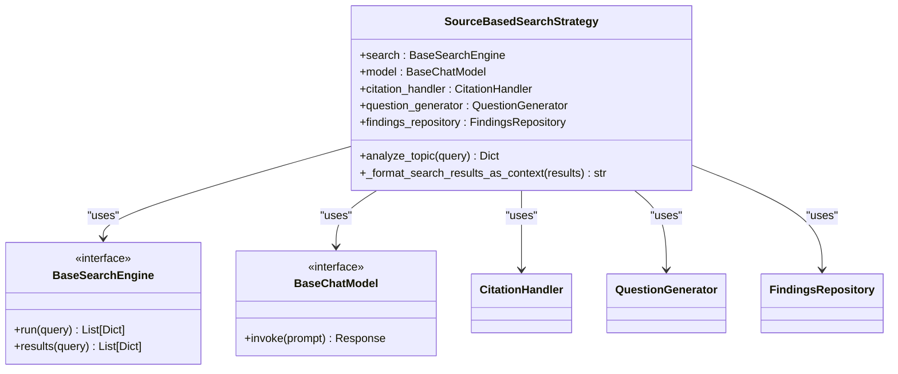
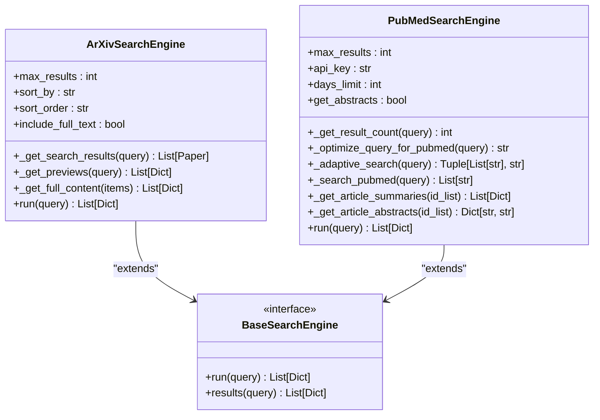
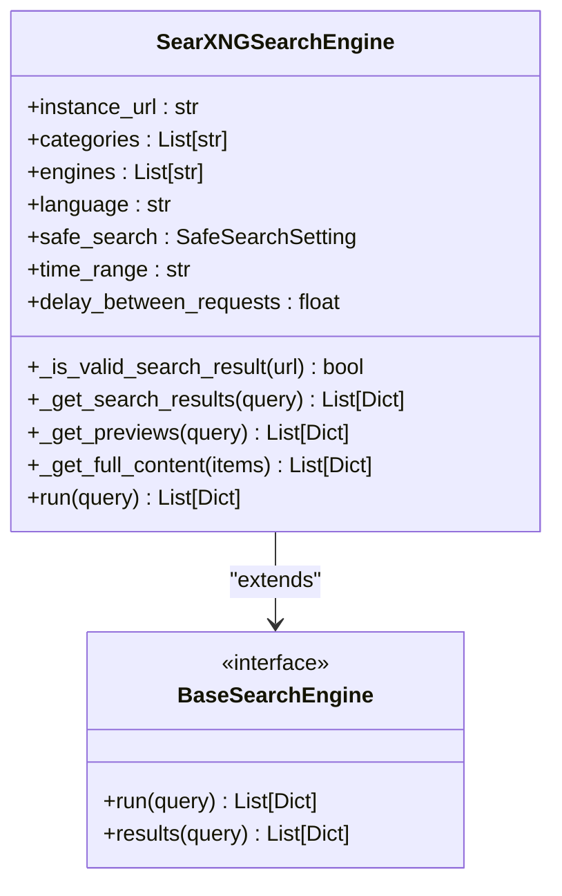
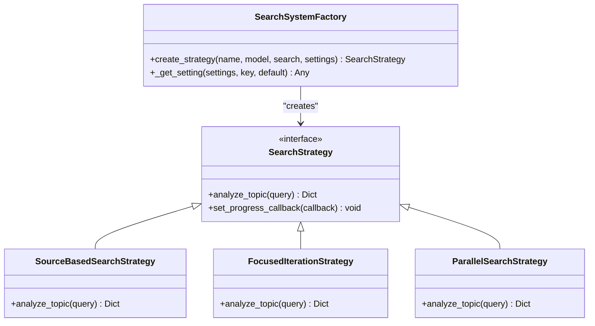

# Core Features

<cite>
**Referenced Files in This Document**   
- [README.md](file://README.md)
- [search_system.py](file://src/local_deep_research/search_system.py)
- [search_system_factory.py](file://src/local_deep_research/search_system_factory.py)
- [research_functions.py](file://src/local_deep_research/api/research_functions.py)
- [source_based_strategy.py](file://src/local_deep_research/advanced_search_system/strategies/source_based_strategy.py)
- [focused_iteration_strategy.py](file://src/local_deep_research/advanced_search_system/strategies/focused_iteration_strategy.py)
- [search_engine_searxng.py](file://src/local_deep_research/web_search_engines/engines/search_engine_searxng.py)
- [search_engine_arxiv.py](file://src/local_deep_research/web_search_engines/engines/search_engine_arxiv.py)
- [search_engine_pubmed.py](file://src/local_deep_research/web_search_engines/engines/search_engine_pubmed.py)
</cite>

## Table of Contents
1. [Research Modes](#research-modes)
2. [Research Strategies](#research-strategies)
3. [Search Sources](#search-sources)
4. [LLM Integration](#llm-integration)
5. [Strategy Selection](#strategy-selection)
6. [Practical Examples](#practical-examples)

## Research Modes

The local-deep-research system provides multiple research modes tailored to different information needs and time constraints. Each mode leverages the underlying strategy and search infrastructure to deliver appropriate results.

### Quick Summary
The Quick Summary mode is designed for rapid information retrieval, typically completing within 30 seconds to 3 minutes. This mode prioritizes speed and efficiency, making it ideal for getting a quick overview of a topic or answering straightforward factual questions. It uses a streamlined research process with minimal iterations and focuses on extracting key information from the most relevant sources. The output includes a concise summary with proper citations, allowing users to quickly assess the information without extensive reading.

**Section sources**
- [README.md](file://README.md#L84-L85)

### Detailed Research
Detailed Research mode provides comprehensive analysis of complex topics through structured findings. This mode conducts thorough investigation using multiple iterations of questioning and searching, building a rich knowledge base from diverse sources. The process involves decomposing complex queries into sub-questions, systematically exploring related concepts, and synthesizing information from various perspectives. Results are presented with detailed findings, source references, and contextual analysis, making this mode suitable for in-depth exploration of multifaceted subjects.

**Section sources**
- [README.md](file://README.md#L85-L86)
- [research_functions.py](file://src/local_deep_research/api/research_functions.py#L444-L457)

### Report Generation
Report Generation mode creates professional, structured reports with sections and table of contents. This mode goes beyond simple summarization by organizing research findings into a coherent document format suitable for presentation or publication. The system automatically identifies relevant sections based on the query, conducts targeted research for each section, and synthesizes the information into a well-structured report. The output can be exported in various formats, including PDF and Markdown, making it convenient for sharing and archiving research results.

**Section sources**
- [README.md](file://README.md#L86-L87)
- [research_functions.py](file://src/local_deep_research/api/research_functions.py#L308-L344)

### Document Analysis
Document Analysis mode enables searching and analyzing private document collections using AI. This mode integrates with local document repositories, allowing users to query their personal or organizational documents with natural language. The system indexes document collections and uses semantic search to find relevant content, then applies LLM-powered analysis to extract insights and generate summaries. This capability is particularly valuable for knowledge management, research literature review, and information retrieval from proprietary document archives.

**Section sources**
- [README.md](file://README.md#L87-L88)
- [research_functions.py](file://src/local_deep_research/api/research_functions.py#L528-L558)

## Research Strategies

The local-deep-research system implements a comprehensive suite of research strategies that enable sophisticated information retrieval and analysis. These strategies are designed to handle various types of queries and research requirements, from simple fact-finding to complex problem-solving.

### Source-Based Strategy
The Source-Based strategy focuses on finding and extracting information from authoritative sources. This approach systematically identifies relevant sources, extracts key information, and verifies facts across multiple references. It excels at comprehensive research by building knowledge incrementally through successive iterations of questioning and searching. The strategy is particularly effective for topics requiring verification from multiple independent sources.

**Diagram sources **
- [source_based_strategy.py](file://src/local_deep_research/advanced_search_system/strategies/source_based_strategy.py#L22-L461)

**Section sources**
- [search_system.py](file://src/local_deep_research/search_system.py#L48-L50)
- [source_based_strategy.py](file://src/local_deep_research/advanced_search_system/strategies/source_based_strategy.py#L22-L461)

### Focused-Iteration Strategy
The Focused-Iteration strategy employs a systematic, iterative approach to research with progressive refinement. This method breaks down complex queries into focused sub-questions, conducts targeted searches for each sub-question, and iteratively refines the research direction based on findings. The strategy maintains context across iterations, allowing for deep exploration of specific aspects while avoiding information overload. It is particularly effective for complex topics that require thorough investigation.

**Section sources**
- [search_system.py](file://src/local_deep_research/search_system.py#L49-L51)
- [focused_iteration_strategy.py](file://src/local_deep_research/advanced_search_system/strategies/focused_iteration_strategy.py#L40-L586)

### Parallel Strategy
The Parallel strategy executes multiple search queries simultaneously to maximize information coverage. By running searches in parallel, this approach significantly reduces research time while exploring diverse angles of a topic concurrently. The system coordinates multiple search threads, aggregates results, and synthesizes information from various sources in a single processing phase. This strategy is ideal for time-sensitive research and broad topic exploration.

**Section sources**
- [search_system.py](file://src/local_deep_research/search_system.py#L51-L52)

### Rapid Strategy
The Rapid strategy prioritizes speed over comprehensiveness, delivering quick answers with minimal processing. This approach uses a streamlined research process with limited iterations and focused questioning to provide immediate responses. While sacrificing some depth, the Rapid strategy is highly effective for straightforward queries where timeliness is more important than exhaustive analysis.

**Section sources**
- [search_system.py](file://src/local_deep_research/search_system.py#L52-L53)

### Recursive Decomposition Strategy
The Recursive Decomposition strategy breaks down complex problems into hierarchical sub-problems using recursive analysis. This method systematically decomposes a research question into increasingly specific sub-questions, creating a tree-like structure of inquiry. Each branch is explored independently, and findings are synthesized upward to form a comprehensive understanding of the original query. This strategy excels at tackling multifaceted problems with interrelated components.

**Section sources**
- [search_system.py](file://src/local_deep_research/search_system.py#L53-L54)

### Adaptive Strategy
The Adaptive strategy dynamically adjusts its research approach based on query characteristics and intermediate findings. This intelligent method monitors the research process, evaluates the effectiveness of current tactics, and modifies the strategy as needed. It can switch between different research patterns, adjust iteration depth, and modify questioning techniques based on the evolving understanding of the topic.

**Section sources**
- [search_system.py](file://src/local_deep_research/search_system.py#L55-L57)

### BrowseComp Optimized Strategy
The BrowseComp Optimized strategy is specifically designed for complex puzzle-solving and multi-step reasoning tasks. This approach combines systematic exploration with constraint checking, maintaining a knowledge graph of entities and relationships throughout the research process. It excels at tasks requiring the integration of information from multiple sources to solve intricate problems or answer compound questions.

**Section sources**
- [search_system.py](file://src/local_deep_research/search_system.py#L57-L58)

### Evidence-Based Strategy
The Evidence-Based strategy emphasizes verification and validation through multiple independent sources. This method systematically collects evidence, assesses source credibility, and evaluates the strength of supporting information for each claim. It implements rigorous cross-referencing and contradiction detection to ensure the reliability of research findings, making it particularly valuable for academic and scientific research.

**Section sources**
- [search_system.py](file://src/local_deep_research/search_system.py#L58-L59)

### Constrained Search Strategy
The Constrained Search strategy applies progressive filtering and constraint satisfaction to narrow down possibilities. This approach starts with a broad search space and systematically applies constraints based on intermediate findings, gradually converging on the most likely solutions. It is particularly effective for diagnostic tasks, troubleshooting, and scenarios with well-defined solution criteria.

**Section sources**
- [search_system.py](file://src/local_deep_research/search_system.py#L59-L60)

### Modular Strategy
The Modular strategy employs a component-based architecture that combines specialized modules for different research tasks. This approach separates concerns such as candidate exploration, constraint checking, and knowledge management into independent components that can be configured and combined as needed. The modularity allows for flexible adaptation to different research requirements and facilitates the integration of new capabilities.

**Section sources**
- [search_system.py](file://src/local_deep_research/search_system.py#L65-L67)

## Search Sources

The local-deep-research system integrates with diverse search sources to provide comprehensive information coverage across multiple domains and content types.

### Academic Search Engines
The system supports specialized academic search engines for scholarly research, including arXiv for preprints in physics, mathematics, and computer science, and PubMed for biomedical literature. These sources provide access to peer-reviewed research papers, conference proceedings, and other academic publications. The integration includes features like citation extraction, author information, and journal metrics to support rigorous academic research.

**Diagram sources **
- [search_engine_arxiv.py](file://src/local_deep_research/web_search_engines/engines/search_engine_arxiv.py#L15-L520)
- [search_engine_pubmed.py](file://src/local_deep_research/web_search_engines/engines/search_engine_pubmed.py#L14-L800)

**Section sources**
- [README.md](file://README.md#L111-L112)
- [search_engine_arxiv.py](file://src/local_deep_research/web_search_engines/engines/search_engine_arxiv.py#L15-L520)
- [search_engine_pubmed.py](file://src/local_deep_research/web_search_engines/engines/search_engine_pubmed.py#L14-L800)

### General Web Search Engines
For broad information retrieval, the system integrates with general web search engines such as SearXNG, which aggregates results from multiple providers including Google, Bing, and DuckDuckGo. This approach provides comprehensive coverage of web content while preserving user privacy through decentralized search. The integration includes features like result filtering, snippet extraction, and full-page content retrieval for in-depth analysis.

**Diagram sources **
- [search_engine_searxng.py](file://src/local_deep_research/web_search_engines/engines/search_engine_searxng.py#L26-L588)

**Section sources**
- [README.md](file://README.md#L112-L113)
- [search_engine_searxng.py](file://src/local_deep_research/web_search_engines/engines/search_engine_searxng.py#L26-L588)

### Technical Search Engines
Specialized technical search engines provide access to developer resources and technical documentation. GitHub integration enables searching code repositories, issues, and documentation, while Elasticsearch support allows querying structured data and document collections. These sources are essential for technical research, software development, and IT troubleshooting.

**Section sources**
- [README.md](file://README.md#L113-L114)

### News Search Engines
News-specific search engines like The Guardian and Wikinews provide access to current events and journalistic content. These sources are integrated with features for temporal filtering, source credibility assessment, and bias detection. The system can track developing stories, compare coverage across outlets, and extract key information from news articles for timely research.

**Section sources**
- [README.md](file://README.md#L115-L116)

## LLM Integration

The local-deep-research system supports integration with both local and cloud-based language models, providing flexibility in deployment and operation.

### Local Models (Ollama)
Local model integration through Ollama enables private, offline research with popular open-source models like Llama 3, Mistral, and Gemma. This approach keeps sensitive queries and data on-premises, ensuring privacy and security. The system manages model loading, context handling, and inference optimization to deliver efficient performance even on consumer hardware.

**Section sources**
- [README.md](file://README.md#L440-L444)

### Cloud Providers (OpenAI, Anthropic, Google)
Cloud provider integration allows access to powerful commercial models from OpenAI (GPT series), Anthropic (Claude), and Google (Gemini). This option provides state-of-the-art language understanding and generation capabilities, with the trade-off of sending queries to external servers. The system handles API authentication, rate limiting, and cost tracking for cloud-based LLM usage.

**Section sources**
- [README.md](file://README.md#L446-L449)

## Strategy Selection

The local-deep-research system employs design patterns to enable dynamic selection of appropriate research methodologies based on query characteristics and user requirements.

### Strategy Pattern
The Strategy pattern is used to encapsulate different research algorithms behind a common interface, allowing them to be interchanged at runtime. Each research strategy implements the same interface with a standardized `analyze_topic` method, enabling the system to switch between approaches without changing the core research workflow. This design promotes code reuse and simplifies the addition of new research methods.

### Factory Pattern
The Factory pattern centralizes the creation of research strategy instances, encapsulating the complexity of strategy initialization. The `create_strategy` function in the `search_system_factory.py` module acts as a factory that instantiates the appropriate strategy based on configuration parameters. This approach decouples strategy creation from usage, making the system more maintainable and extensible.

**Diagram sources **
- [search_system_factory.py](file://src/local_deep_research/search_system_factory.py#L25-L800)
- [search_system.py](file://src/local_deep_research/search_system.py#L150-L191)

**Section sources**
- [search_system_factory.py](file://src/local_deep_research/search_system_factory.py#L25-L800)
- [search_system.py](file://src/local_deep_research/search_system.py#L150-L191)

## Practical Examples

The local-deep-research system can be configured with specific strategies and sources to optimize results for different scenarios. For quick fact-checking, the Rapid strategy with SearXNG provides fast answers from general web sources. For academic research, the Evidence-Based strategy combined with arXiv and PubMed ensures thorough verification from scholarly sources. Technical troubleshooting benefits from the Constrained Search strategy with GitHub integration, systematically eliminating possibilities. Complex problem-solving tasks are best addressed with the BrowseComp Optimized strategy, which maintains context across multiple reasoning steps. The system's flexibility allows users to select the optimal configuration based on their specific research needs, time constraints, and accuracy requirements.

**Section sources**
- [README.md](file://README.md#L75-L79)
- [search_system.py](file://src/local_deep_research/search_system.py#L26-L41)
- [research_functions.py](file://src/local_deep_research/api/research_functions.py#L23-L42)