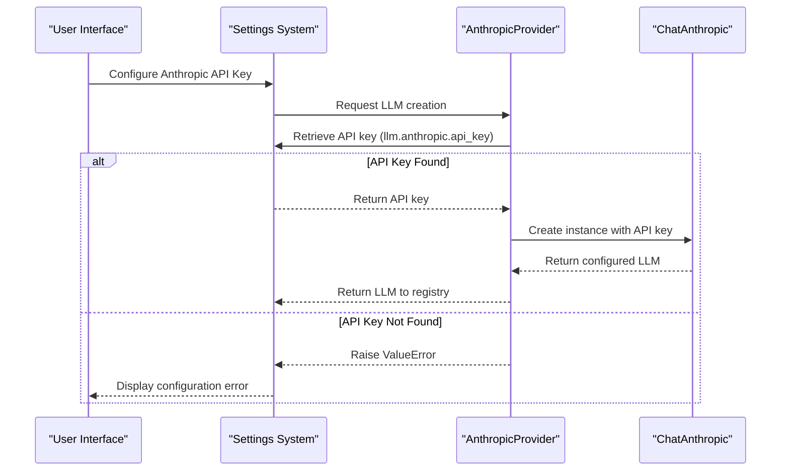
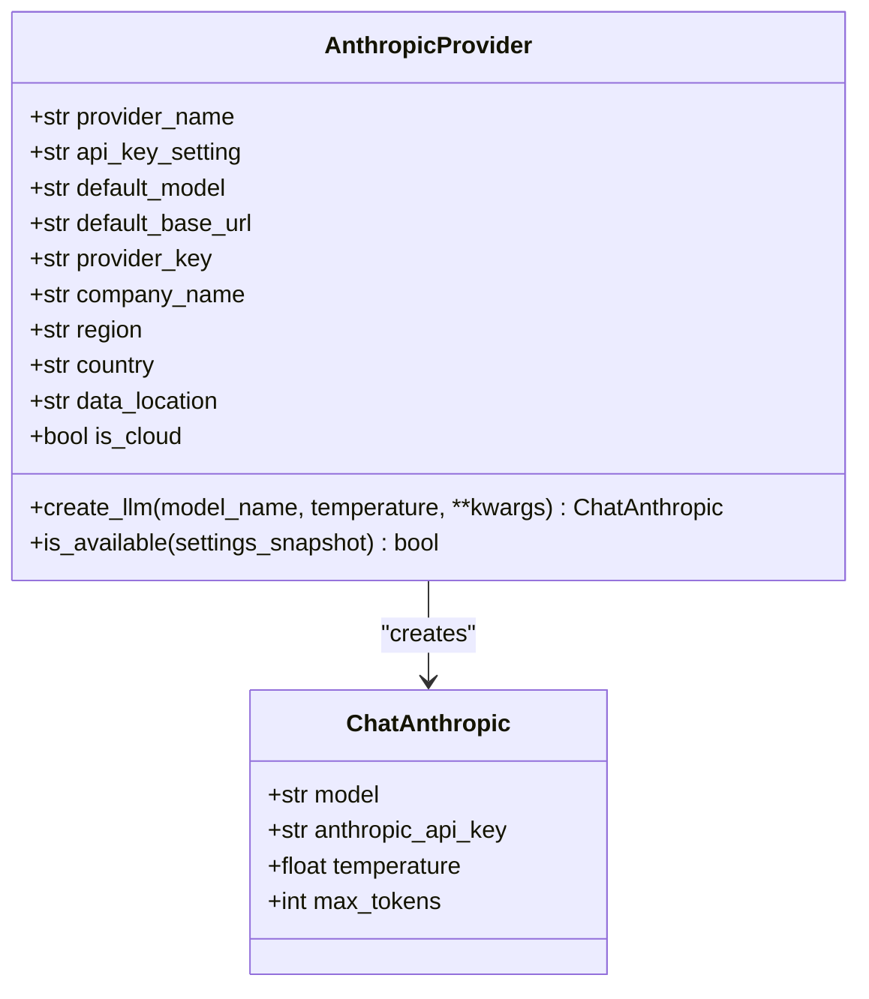
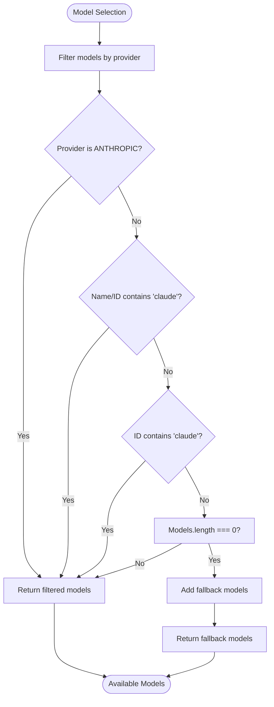
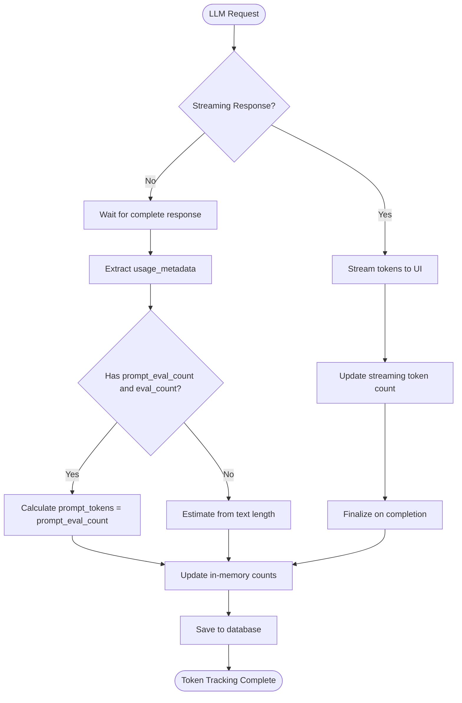
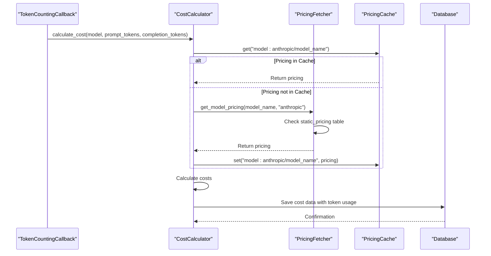
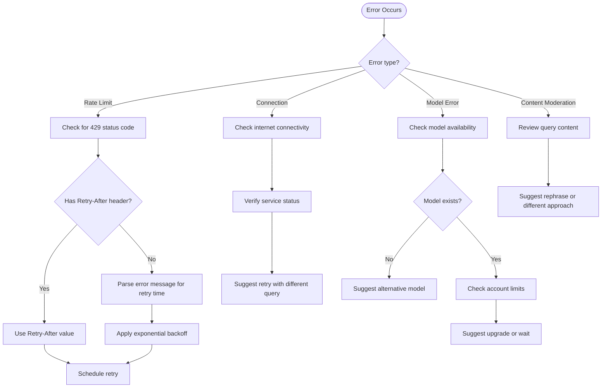
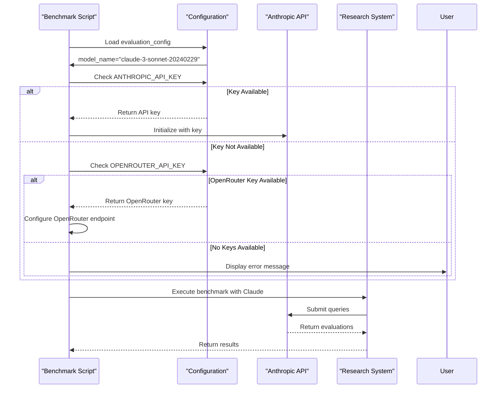

# Anthropic Integration

<cite>
**Referenced Files in This Document**   
- [anthropic.py](file://src/local_deep_research/llm/providers/implementations/anthropic.py)
- [token_counter.py](file://src/local_deep_research/metrics/token_counter.py)
- [cost_calculator.py](file://src/local_deep_research/metrics/pricing/cost_calculator.py)
- [pricing_fetcher.py](file://src/local_deep_research/metrics/pricing/pricing_fetcher.py)
- [settings_routes.py](file://src/local_deep_research/web/routes/settings_routes.py)
- [research.js](file://src/local_deep_research/web/static/js/components/research.js)
- [detection.py](file://src/local_deep_research/web_search_engines/rate_limiting/llm/detection.py)
- [openai_base.py](file://src/local_deep_research/llm/providers/openai_base.py)
- [benchmark.py](file://examples/benchmarks/claude_grading/benchmark.py)
- [run_benchmark_with_claude_grading.py](file://examples/benchmarks/scripts/run_benchmark_with_claude_grading.py)
</cite>

## Table of Contents
1. [Introduction](#introduction)
2. [Authentication and API Key Management](#authentication-and-api-key-management)
3. [Claude Model Configuration](#claude-model-configuration)
4. [Message Formatting and Response Handling](#message-formatting-and-response-handling)
5. [Token Counting and Cost Tracking](#token-counting-and-cost-tracking)
6. [Error Handling](#error-handling)
7. [Rate Limit Management](#rate-limit-management)
8. [Integration Examples](#integration-examples)
9. [Conclusion](#conclusion)

## Introduction

The Anthropic integration in the Local Deep Research system provides seamless access to Claude models through a well-structured provider interface. This documentation details the implementation of Anthropic's API integration, covering authentication, model configuration, token counting, cost tracking, and error handling mechanisms. The system is designed to work with various Claude models including Claude-2, Claude-3 Opus, Sonnet, and Haiku, providing researchers with flexible options for different research workflows.

The integration follows a provider-based architecture where the Anthropic provider is registered with the LLM registry, allowing it to be dynamically selected and configured through the application's settings interface. The implementation leverages the LangChain framework's ChatAnthropic class while extending it with custom functionality for token counting, cost calculation, and error handling specific to research workflows.

**Section sources**
- [anthropic.py](file://src/local_deep_research/llm/providers/implementations/anthropic.py#L1-L162)

## Authentication and API Key Management

The Anthropic integration uses API key-based authentication, with keys securely stored and retrieved through the application's settings system. The API key is configured using the setting key `llm.anthropic.api_key`, which is defined as a class attribute in the `AnthropicProvider` class.

Authentication is implemented through a factory method pattern where the `create_llm` class method handles the creation of ChatAnthropic instances. When creating an LLM instance, the method first retrieves the API key from the settings snapshot using the `get_setting_from_snapshot` function. If the API key is not found, a `ValueError` is raised with a descriptive message instructing users to configure the API key in settings.

**Diagram sources**
- [anthropic.py](file://src/local_deep_research/llm/providers/implementations/anthropic.py#L60-L74)

The system also provides a utility method `is_available` to check whether the Anthropic provider is properly configured. This method attempts to retrieve the API key and returns a boolean indicating availability, which is used in the UI to determine whether Anthropic models should be displayed as available options.

In the web interface, when a user accesses the settings page, the system dynamically fetches available Anthropic models by creating an Anthropic client with the configured API key and calling the `models.list()` method. This ensures that users see only the models they have access to based on their Anthropic account tier.

**Section sources**
- [anthropic.py](file://src/local_deep_research/llm/providers/implementations/anthropic.py#L60-L74)
- [settings_routes.py](file://src/local_deep_research/web/routes/settings_routes.py#L1301-L1332)

## Claude Model Configuration

The Anthropic provider supports multiple Claude models with different capabilities and performance characteristics. The default model is configured as `claude-3-sonnet-20240229`, but users can select from various models including `claude-3-opus-20240229`, `claude-3-haiku-20240307`, and `claude-3-5-sonnet-latest`.

Model configuration is handled through the `create_llm` method, which accepts a `model_name` parameter. If no model name is specified, the method uses the `default_model` class attribute. The method also accepts a `temperature` parameter (default 0.7) to control the randomness of the model's responses, with lower values producing more deterministic outputs.

**Diagram sources**
- [anthropic.py](file://src/local_deep_research/llm/providers/implementations/anthropic.py#L32-L35)

The provider also supports setting a maximum token limit through the `llm.max_tokens` setting, which is passed to the ChatAnthropic instance if configured. This allows users to control response length and manage costs.

In the user interface, Anthropic models are filtered and displayed based on the provider designation. The JavaScript component `research.js` includes logic to identify Anthropic models by checking for the provider value 'ANTHROPIC' or model names/IDs containing 'claude'. If no Anthropic models are detected from the API, the system provides fallback model options to ensure usability.

**Diagram sources**
- [research.js](file://src/local_deep_research/web/static/js/components/research.js#L949-L976)

**Section sources**
- [anthropic.py](file://src/local_deep_research/llm/providers/implementations/anthropic.py#L76-L85)
- [research.js](file://src/local_deep_research/web/static/js/components/research.js#L949-L976)

## Message Formatting and Response Handling

The Anthropic integration follows the message formatting requirements of the Anthropic API through the LangChain ChatAnthropic wrapper. Messages are formatted as part of the conversation history passed to the model, with proper role assignment (user, assistant) and content structure.

While the specific message formatting implementation is handled by the LangChain library, the system ensures proper integration by passing the correct model parameters and handling the response format appropriately. The integration supports both standard text responses and structured outputs, with the ability to handle streaming responses for real-time display in the user interface.

The system does not modify the message format directly but ensures that prompts and queries from the research workflow are properly formatted before being passed to the Anthropic model. This includes applying any necessary templates or formatting rules based on the research mode (quick, detailed, etc.) and ensuring that context is properly structured for optimal model performance.

For response handling, the integration captures the full response metadata including usage information, which is then processed by the token counting system. The response handling is designed to be transparent to the research workflow, allowing the same interface to work with different LLM providers while maintaining provider-specific optimizations.

**Section sources**
- [anthropic.py](file://src/local_deep_research/llm/providers/implementations/anthropic.py#L80-L104)

## Token Counting and Cost Tracking

The system implements comprehensive token counting and cost tracking for Anthropic usage, with integration at multiple levels of the application architecture. Token counting is handled by the `TokenCountingCallback` class, which captures token usage from the Anthropic API response and stores it for both real-time display and long-term analytics.

The token counting system extracts usage information from the response metadata, specifically looking for `prompt_eval_count` and `eval_count` fields which correspond to prompt and completion tokens respectively. These values are captured in the `on_llm_end` method of the callback and added to the running totals.

**Diagram sources**
- [token_counter.py](file://src/local_deep_research/metrics/token_counter.py#L228-L352)

Cost tracking is implemented through the pricing module, which includes a `CostCalculator` class that calculates costs based on token usage and model-specific pricing. The system maintains a static pricing table in the `PricingFetcher` class that includes rates for various Claude models:

- `claude-3-opus`: $0.015 per 1K prompt tokens, $0.075 per 1K completion tokens
- `claude-3-sonnet`: $0.003 per 1K prompt tokens, $0.015 per 1K completion tokens  
- `claude-3-haiku`: $0.00025 per 1K prompt tokens, $0.00125 per 1K completion tokens
- `claude-3-5-sonnet`: $0.003 per 1K prompt tokens, $0.015 per 1K completion tokens

The cost calculation process follows these steps:
1. Retrieve token counts from the TokenCountingCallback
2. Look up pricing for the specific model (using provider if available)
3. Calculate prompt cost = (prompt_tokens / 1000) * prompt_price
4. Calculate completion cost = (completion_tokens / 1000) * completion_price
5. Sum to get total cost

The system first checks for cached pricing data, then falls back to the static pricing table since Anthropic does not provide a public pricing API. This ensures that cost estimates are available even when external services are unreachable.

**Diagram sources**
- [cost_calculator.py](file://src/local_deep_research/metrics/pricing/cost_calculator.py#L59-L94)
- [pricing_fetcher.py](file://src/local_deep_research/metrics/pricing/pricing_fetcher.py#L39-L42)

The token and cost data is stored in the database with detailed context including research ID, research mode, research phase, search iteration, and call stack information. This allows for comprehensive analysis of LLM usage patterns and cost distribution across different research workflows.

**Section sources**
- [token_counter.py](file://src/local_deep_research/metrics/token_counter.py#L228-L352)
- [cost_calculator.py](file://src/local_deep_research/metrics/pricing/cost_calculator.py#L59-L94)
- [pricing_fetcher.py](file://src/local_deep_research/metrics/pricing/pricing_fetcher.py#L39-L42)

## Error Handling

The system implements comprehensive error handling for Anthropic-specific issues, including content moderation blocks, model capacity limits, and API connectivity problems. Errors are categorized and handled at multiple levels of the application stack to provide meaningful feedback to users while maintaining system stability.

The primary error handling mechanism is implemented in the `TokenCountingCallback` class, which captures errors in the `on_llm_error` method. When an error occurs, the callback records the error type and sets the success status to "error", while still saving the record to maintain accurate usage tracking.

For Anthropic-specific errors, the system includes specialized detection in the rate limiting module. The `is_llm_rate_limit_error` function in `detection.py` checks for Anthropic-specific rate limit indicators by examining the error class module and message content. It identifies rate limit errors by looking for:
- Error class modules containing "anthropic"
- Error messages containing "rate_limit", "429", or "too many"

**Diagram sources**
- [detection.py](file://src/local_deep_research/web_search_engines/rate_limiting/llm/detection.py#L57-L64)
- [research_routes.py](file://src/local_deep_research/web/routes/research_routes.py#L1376-L1403)

The error reporter categorizes Anthropic errors under the "MODEL_ERROR" category with "high" severity, indicating that they typically require user intervention to resolve. Recoverability is marked as true, suggesting that users can often resolve these issues by adjusting their queries, waiting for rate limits to reset, or switching to alternative models.

In the user interface, errors are presented with specific suggestions for resolution. For example, connection errors suggest checking internet connectivity and service status, while model errors suggest ensuring the service is running properly. This contextual error handling helps users troubleshoot issues without requiring deep technical knowledge.

**Section sources**
- [detection.py](file://src/local_deep_research/web_search_engines/rate_limiting/llm/detection.py#L57-L64)
- [error_reporter.py](file://src/local_deep_research/error_handling/error_reporter.py#L346-L384)
- [research_routes.py](file://src/local_deep_research/web/routes/research_routes.py#L1376-L1403)

## Rate Limit Management

The system implements sophisticated rate limit management for Anthropic API calls, combining automatic detection, retry logic, and user guidance to handle rate-limited scenarios effectively. The rate limit detection is implemented in the `is_llm_rate_limit_error` function, which specifically identifies Anthropic rate limit errors by checking both the error class module and message content.

When a rate limit error is detected, the system attempts to extract the retry-after time from either the HTTP response headers or the error message itself. The `extract_retry_after` function first checks for a "Retry-After" header in the response, then parses the error message for patterns like "try again in X seconds" to determine the appropriate delay before retrying.

The rate limit management system follows a multi-tiered approach:
1. Immediate detection of rate limit errors through pattern matching
2. Extraction of recommended retry timing from headers or messages
3. Application of exponential backoff if specific timing is not provided
4. Queueing of requests to prevent overwhelming the API
5. User notification with estimated wait times and alternative suggestions

This approach ensures that the system respects Anthropic's rate limits while maximizing research efficiency by automatically handling transient errors and minimizing manual intervention.

**Section sources**
- [detection.py](file://src/local_deep_research/web_search_engines/rate_limiting/llm/detection.py#L69-L111)

## Integration Examples

The system includes several examples of Anthropic integration in research workflows, demonstrating both direct usage and benchmarking scenarios. These examples illustrate how the Anthropic provider can be used for various research tasks, from simple queries to complex evaluation workflows.

One key example is the Claude grading benchmark, which uses Claude models to evaluate the quality of research results. This benchmark configures the evaluation model as `claude-3-sonnet-20240229` with a temperature of 0 to ensure consistent, deterministic evaluations. The system checks for the presence of the `ANTHROPIC_API_KEY` environment variable and falls back to OpenRouter if necessary, demonstrating flexible provider configuration.

**Diagram sources**
- [benchmark.py](file://examples/benchmarks/claude_grading/benchmark.py#L45-L77)
- [run_benchmark_with_claude_grading.py](file://examples/benchmarks/scripts/run_benchmark_with_claude_grading.py#L44-L76)

The integration also demonstrates how to handle fallback scenarios, where the system can use OpenRouter as an alternative endpoint for accessing Claude models. This is configured by setting the provider to "openai_endpoint" and specifying the OpenRouter API URL, allowing the same LangChain interface to work with different providers.

These examples showcase the flexibility of the Anthropic integration, allowing researchers to use Claude models in various configurations depending on their access methods and requirements. The system's modular design enables seamless switching between direct Anthropic API access and third-party endpoints while maintaining consistent functionality.

**Section sources**
- [benchmark.py](file://examples/benchmarks/claude_grading/benchmark.py#L45-L77)
- [run_benchmark_with_claude_grading.py](file://examples/benchmarks/scripts/run_benchmark_with_claude_grading.py#L44-L76)

## Conclusion

The Anthropic integration in the Local Deep Research system provides a robust, feature-complete interface for accessing Claude models in research workflows. The implementation covers all critical aspects of LLM integration including secure authentication, flexible model configuration, accurate token counting, comprehensive cost tracking, and sophisticated error handling.

Key strengths of the integration include:
- Secure API key management with validation and availability checking
- Support for multiple Claude models with appropriate default configurations
- Accurate token counting that captures both prompt and completion tokens
- Detailed cost tracking based on Anthropic's pricing structure
- Comprehensive error handling for rate limits, connectivity issues, and model errors
- Flexible configuration options including direct API access and OpenRouter fallback

The system's architecture, built on the LangChain framework with custom extensions, ensures that the Anthropic integration works seamlessly alongside other LLM providers while maintaining provider-specific optimizations. This allows researchers to leverage the unique capabilities of Claude models within a consistent interface, enhancing the quality and depth of their research outputs.

Future enhancements could include support for Anthropic's streaming API for real-time response display, improved context overflow detection, and more granular cost reporting by research phase and query type.

**Section sources**
- [anthropic.py](file://src/local_deep_research/llm/providers/implementations/anthropic.py#L1-L162)
- [token_counter.py](file://src/local_deep_research/metrics/token_counter.py#L1-L1932)
- [cost_calculator.py](file://src/local_deep_research/metrics/pricing/cost_calculator.py#L1-L237)