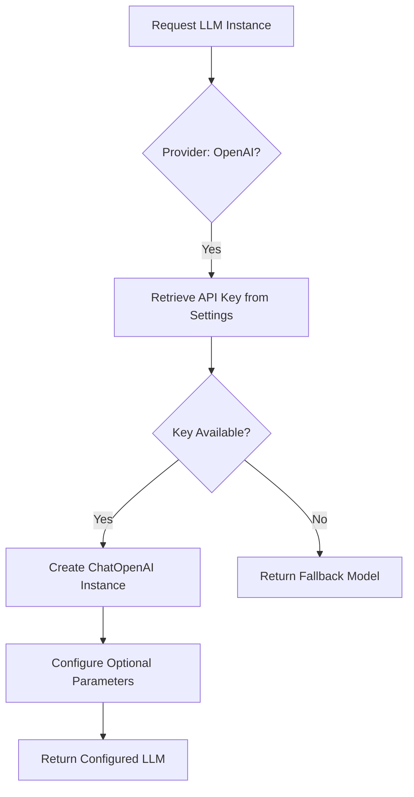
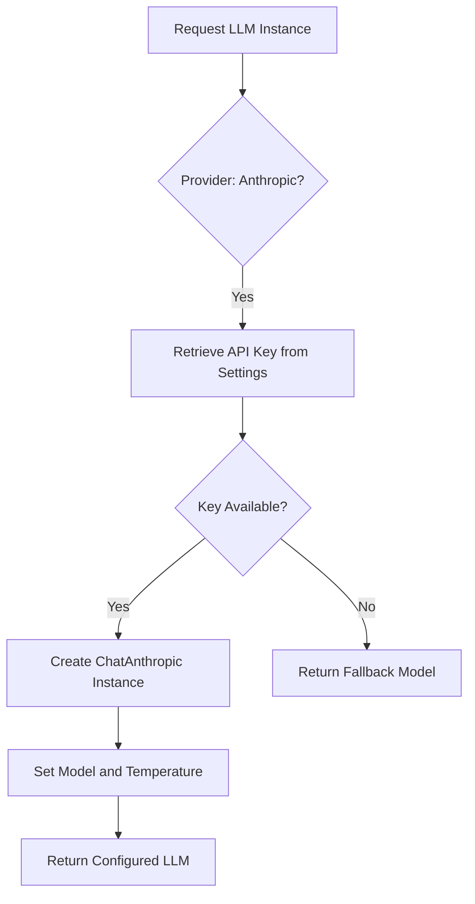
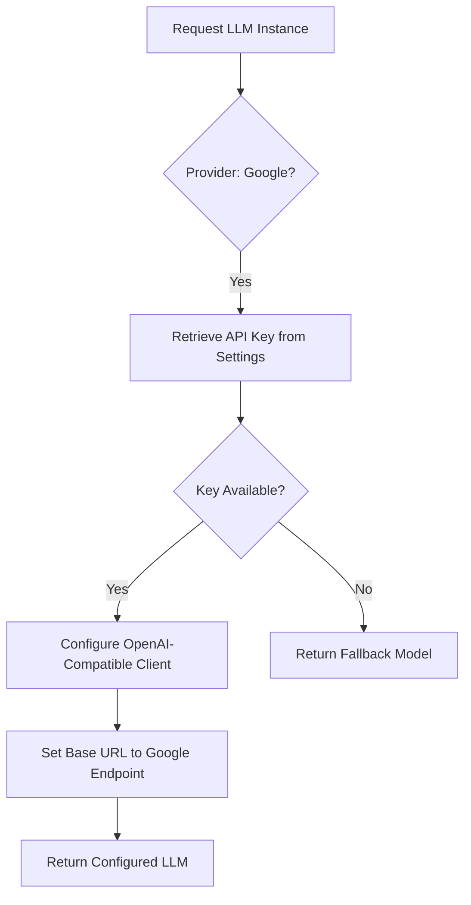
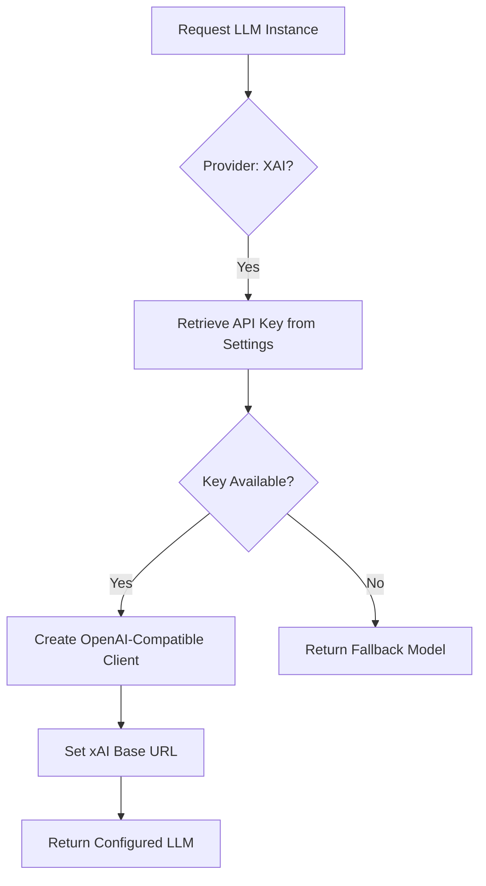
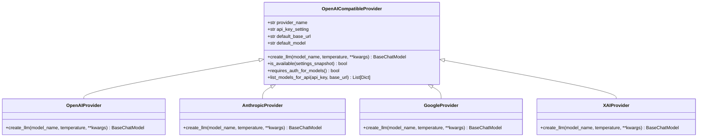
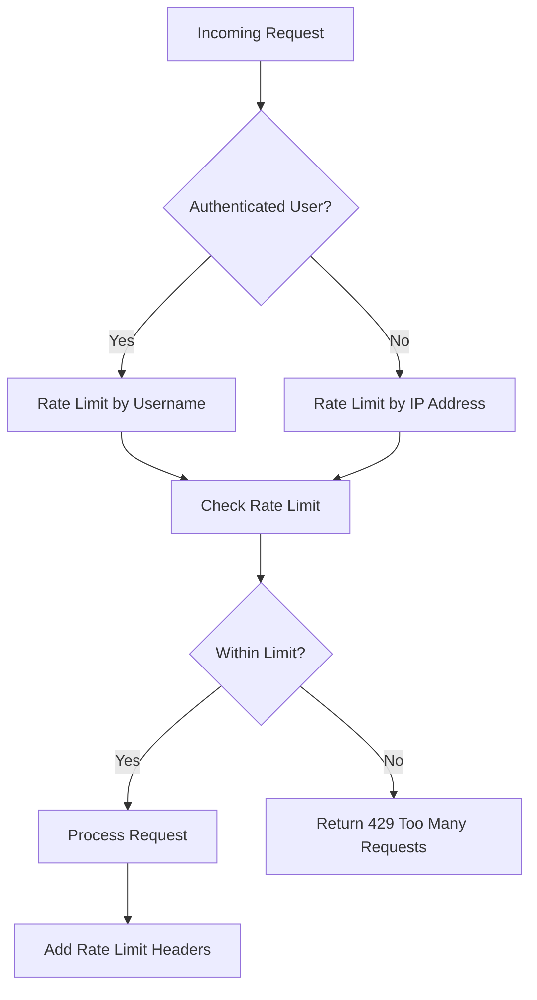
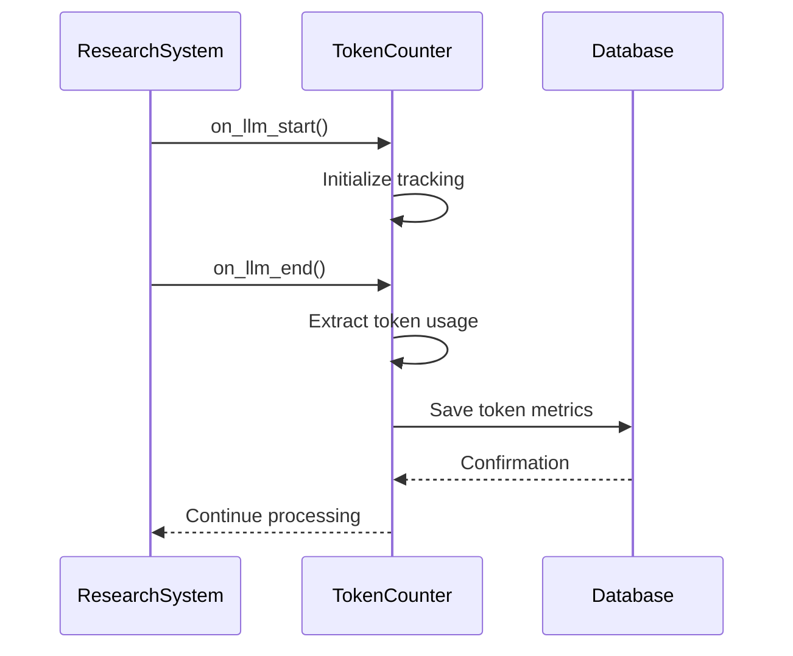
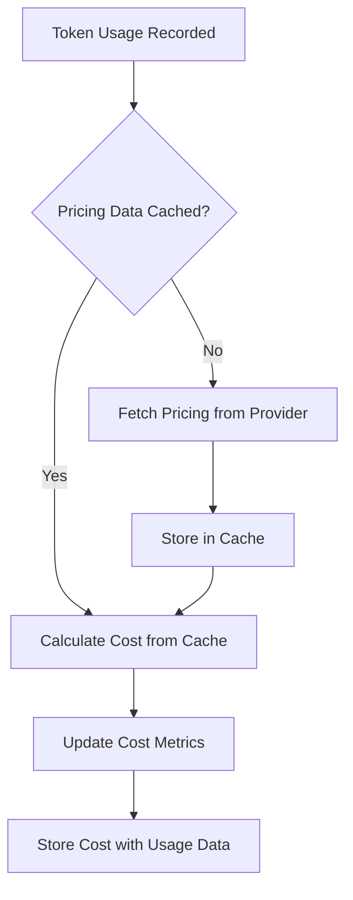
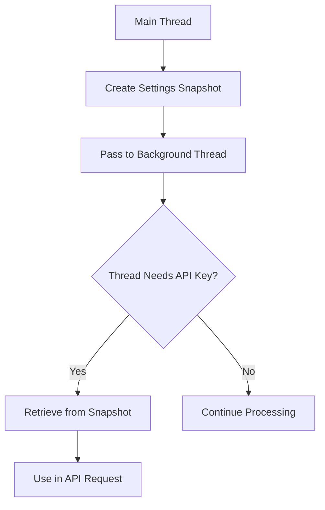

# Cloud Providers Integration

<cite>
**Referenced Files in This Document**   
- [openai.py](file://src/local_deep_research/llm/providers/implementations/openai.py)
- [anthropic.py](file://src/local_deep_research/llm/providers/implementations/anthropic.py)
- [google.py](file://src/local_deep_research/llm/providers/implementations/google.py)
- [xai.py](file://src/local_deep_research/llm/providers/implementations/xai.py)
- [openai_base.py](file://src/local_deep_research/llm/providers/openai_base.py)
- [llm_config.py](file://src/local_deep_research/config/llm_config.py)
- [token_counter.py](file://src/local_deep_research/metrics/token_counter.py)
- [rate_limiter.py](file://src/local_deep_research/security/rate_limiter.py)
- [thread_settings.py](file://src/local_deep_research/config/thread_settings.py)
- [pricing_fetcher.py](file://src/local_deep_research/metrics/pricing/pricing_fetcher.py)
- [pricing_cache.py](file://src/local_deep_research/metrics/pricing/pricing_cache.py)
</cite>

## Table of Contents
1. [Introduction](#introduction)
2. [Provider Authentication Mechanisms](#provider-authentication-mechanisms)
3. [Request Formatting and Response Handling](#request-formatting-and-response-handling)
4. [Rate Limiting and Error Recovery](#rate-limiting-and-error-recovery)
5. [Configuration Options](#configuration-options)
6. [Token Counting and Cost Tracking](#token-counting-and-cost-tracking)
7. [API Key Management and Security](#api-key-management-and-security)
8. [Conclusion](#conclusion)

## Introduction
This document details the integration of cloud-based LLM providers including OpenAI, Anthropic, Google, and XAI within the research system. The implementation focuses on standardized authentication, request formatting, response handling, and comprehensive monitoring of usage and costs. The architecture supports both direct provider APIs and OpenAI-compatible endpoints, enabling flexible integration with various LLM services while maintaining consistent behavior across providers.

**Section sources**
- [llm_config.py](file://src/local_deep_research/config/llm_config.py#L1-L1041)

## Provider Authentication Mechanisms

### OpenAI Authentication
OpenAI integration uses API key-based authentication with support for optional organization identifiers and custom API endpoints. The system validates API key availability through settings configuration and provides fallback mechanisms when credentials are missing.

**Diagram sources**
- [openai.py](file://src/local_deep_research/llm/providers/implementations/openai.py#L1-L218)

### Anthropic Authentication
Anthropic provider follows a similar authentication pattern using API keys stored in application settings. The implementation includes comprehensive error handling for missing credentials and provides clear error messages to guide configuration.

**Diagram sources**
- [anthropic.py](file://src/local_deep_research/llm/providers/implementations/anthropic.py#L1-L162)

### Google Gemini Authentication
Google's Gemini API uses an OpenAI-compatible endpoint with API key authentication. The implementation handles the unique requirement of passing the API key as a query parameter rather than in headers, following Google's API specifications.

**Diagram sources**
- [google.py](file://src/local_deep_research/llm/providers/implementations/google.py#L1-L133)

### XAI Grok Authentication
XAI provider uses standard API key authentication with an OpenAI-compatible interface. The implementation follows the same pattern as other OpenAI-compatible providers while maintaining provider-specific configuration defaults.

**Diagram sources**
- [xai.py](file://src/local_deep_research/llm/providers/implementations/xai.py#L1-L81)

## Request Formatting and Response Handling

### OpenAI-Compatible Base Implementation
The system implements a base class for OpenAI-compatible providers that standardizes request formatting across multiple services. This approach enables consistent handling of parameters such as temperature, max_tokens, and streaming options.

**Diagram sources**
- [openai_base.py](file://src/local_deep_research/llm/providers/openai_base.py#L1-L340)

### Provider-Specific Request Parameters
Each provider implementation extends the base functionality with provider-specific parameters while maintaining a consistent interface. The system automatically maps configuration settings to the appropriate client parameters.

**Section sources**
- [openai.py](file://src/local_deep_research/llm/providers/implementations/openai.py#L1-L218)
- [anthropic.py](file://src/local_deep_research/llm/providers/implementations/anthropic.py#L1-L162)
- [google.py](file://src/local_deep_research/llm/providers/implementations/google.py#L1-L133)
- [xai.py](file://src/local_deep_research/llm/providers/implementations/xai.py#L1-L81)

## Rate Limiting and Error Recovery

### Rate Limiting Strategy
The system implements rate limiting at the API endpoint level using Flask-Limiter, with different limits for various endpoint types. The configuration supports both user-based and IP-based rate limiting with fail-closed behavior in production environments.

**Diagram sources**
- [rate_limiter.py](file://src/local_deep_research/security/rate_limiter.py#L1-L152)

### Error Recovery Patterns
The system implements comprehensive error recovery patterns including fallback models, retry mechanisms, and graceful degradation when API services are unavailable. The LLM registry supports dynamic provider registration and fallback to alternative models.

**Section sources**
- [llm_config.py](file://src/local_deep_research/config/llm_config.py#L1-L1041)
- [rate_limiter.py](file://src/local_deep_research/security/rate_limiter.py#L1-L152)

## Configuration Options

### Provider Configuration Settings
The system supports extensive configuration options for each provider, including region selection, model variants, and cost optimization settings. Configuration is managed through a centralized settings system with thread-safe access.

| Configuration Option | OpenAI | Anthropic | Google | XAI |
|----------------------|--------|-----------|--------|-----|
| API Key Setting | llm.openai.api_key | llm.anthropic.api_key | llm.google.api_key | llm.xai.api_key |
| Base URL | llm.openai.api_base | N/A | Fixed: Google API | Fixed: xAI API |
| Default Model | gpt-3.5-turbo | claude-3-sonnet-20240229 | gemini-1.5-flash | grok-beta |
| Organization Support | Yes | No | No | No |
| Custom Endpoint | Yes | No | No | No |

**Section sources**
- [llm_config.py](file://src/local_deep_research/config/llm_config.py#L1-L1041)

### Context Window and Token Management
The system provides configurable context window sizes with different defaults for local and cloud providers. Cloud providers support unrestricted context mode, while local providers use smaller default windows to prevent memory issues.

**Section sources**
- [llm_config.py](file://src/local_deep_research/config/llm_config.py#L463-L491)

## Token Counting and Cost Tracking

### Token Counting Implementation
The system implements comprehensive token counting through LangChain callback handlers that track token usage across different models and providers. The callback captures detailed metrics including prompt tokens, completion tokens, and total tokens.

**Diagram sources**
- [token_counter.py](file://src/local_deep_research/metrics/token_counter.py#L1-L1932)

### Cost Calculation and Pricing
The system includes a pricing module that fetches current pricing information from provider APIs and calculates costs based on token usage. Pricing data is cached to minimize external API calls and improve performance.

**Diagram sources**
- [pricing_fetcher.py](file://src/local_deep_research/metrics/pricing/pricing_fetcher.py#L1-L200)
- [pricing_cache.py](file://src/local_deep_research/metrics/pricing/pricing_cache.py#L1-L150)

## API Key Management and Security

### Secure Settings Access
The system implements secure access to API keys through a thread-safe settings context that prevents direct database access from background threads. Settings are passed via snapshots to ensure data isolation and security.

**Diagram sources**
- [thread_settings.py](file://src/local_deep_research/config/thread_settings.py#L1-L127)

### Security Best Practices
The implementation follows security best practices including:
- Environment variable validation for sensitive settings
- Thread-safe access to credentials
- Comprehensive logging with sensitive data redaction
- Fail-closed behavior for rate limiting in production
- Regular dependency updates and security scanning

**Section sources**
- [thread_settings.py](file://src/local_deep_research/config/thread_settings.py#L1-L127)
- [rate_limiter.py](file://src/local_deep_research/security/rate_limiter.py#L1-L152)

## Conclusion
The cloud provider integration architecture provides a robust, secure, and extensible framework for connecting with multiple LLM services. By standardizing on OpenAI-compatible interfaces and implementing comprehensive monitoring, the system enables seamless switching between providers while maintaining detailed usage tracking and cost optimization. The modular design allows for easy addition of new providers and ensures consistent behavior across different services.