# Google AI Integration

<cite>
**Referenced Files in This Document**   
- [google.py](file://src/local_deep_research/llm/providers/implementations/google.py)
- [google_settings.json](file://src/local_deep_research/defaults/llm_providers/google_settings.json)
- [cost_calculator.py](file://src/local_deep_research/metrics/pricing/cost_calculator.py)
- [pricing_fetcher.py](file://src/local_deep_research/metrics/pricing/pricing_fetcher.py)
- [run_gemini_benchmark_fixed.py](file://examples/benchmarks/gemini/run_gemini_benchmark_fixed.py)
- [enhanced-token-tracking.md](file://docs/enhancements/metrics/enhanced-token-tracking.md)
</cite>

## Table of Contents
1. [Introduction](#introduction)
2. [Authentication and Configuration](#authentication-and-configuration)
3. [Model Configuration and Management](#model-configuration-and-management)
4. [Request Formatting and API Integration](#request-formatting-and-api-integration)
5. [Token Counting and Cost Calculation](#token-counting-and-cost-calculation)
6. [Rate Limiting and Error Handling](#rate-limiting-and-error-handling)
7. [Safety Settings and Content Moderation](#safety-settings-and-content-moderation)
8. [Multi-Turn Conversation Management](#multi-turn-conversation-management)
9. [Conclusion](#conclusion)

## Introduction
This document provides comprehensive documentation for Google AI integration within the Local Deep Research system. It covers the implementation details for authenticating with Google's AI services, configuring Gemini models, handling API responses, and managing various aspects of the integration including token counting, cost calculation, rate limiting, and safety settings. The system leverages Google's Vertex AI and Gemini APIs to provide advanced AI capabilities while maintaining compatibility with the existing architecture.

## Authentication and Configuration
The Google AI integration requires proper authentication through API keys, which are securely managed within the system. The configuration is designed to work with Google's API requirements while maintaining the system's security standards.

The authentication mechanism is implemented through a dedicated settings structure that handles the Google API key:

**Diagram sources**
- [google.py](file://src/local_deep_research/llm/providers/implementations/google.py#L9-L38)
- [google_settings.json](file://src/local_deep_research/defaults/llm_providers/google_settings.json#L1-L17)

**Section sources**
- [google.py](file://src/local_deep_research/llm/providers/implementations/google.py#L1-L133)
- [google_settings.json](file://src/local_deep_research/defaults/llm_providers/google_settings.json#L1-L17)

## Model Configuration and Management
The system provides comprehensive model configuration capabilities for Google's Gemini models, allowing users to select from available models and configure their parameters according to their needs.

The model management system is designed to work with Google's API structure, which requires using the native Gemini API endpoint for listing models due to a bug in the OpenAI-compatible endpoint:

**Diagram sources**
- [google.py](file://src/local_deep_research/llm/providers/implementations/google.py#L40-L96)

**Section sources**
- [google.py](file://src/local_deep_research/llm/providers/implementations/google.py#L40-L96)

## Request Formatting and API Integration
The system implements Google's Vertex AI requirements for request formatting, ensuring compatibility with the API's expectations for payload structure and parameters.

The integration uses Google's OpenAI-compatible endpoint while addressing specific requirements such as API key placement in query parameters rather than headers:

**Diagram sources**
- [google.py](file://src/local_deep_research/llm/providers/implementations/google.py#L50-L57)

**Section sources**
- [google.py](file://src/local_deep_research/llm/providers/implementations/google.py#L50-L57)

## Token Counting and Cost Calculation
The system implements comprehensive token counting and cost calculation based on Google's pricing model, providing users with transparency into their usage and expenses.

The cost calculation system integrates with Google's pricing structure, tracking both prompt and completion tokens for accurate cost estimation:

**Diagram sources**
- [cost_calculator.py](file://src/local_deep_research/metrics/pricing/cost_calculator.py)
- [pricing_fetcher.py](file://src/local_deep_research/metrics/pricing/pricing_fetcher.py)
- [enhanced-token-tracking.md](file://docs/enhancements/metrics/enhanced-token-tracking.md#L192-L205)

**Section sources**
- [cost_calculator.py](file://src/local_deep_research/metrics/pricing/cost_calculator.py)
- [pricing_fetcher.py](file://src/local_deep_research/metrics/pricing/pricing_fetcher.py)
- [enhanced-token-tracking.md](file://docs/enhancements/metrics/enhanced-token-tracking.md#L189-L226)

## Rate Limiting and Error Handling
The system implements robust rate limiting strategies aligned with Google's API quotas and comprehensive error handling for Google-specific issues.

The error handling system is designed to manage various Google-specific scenarios including regional availability, model deprecation, and API-specific error conditions:

```mermaid
flowchart TD
Start([API Request]) --> CheckRateLimit["Check Rate Limit Status"]
CheckRateLimit --> WithinLimit{"Within Quota?"}
WithinLimit --> |No| ApplyBackoff["Apply Exponential Backoff"]
WithinLimit --> |Yes| SendRequest["Send Request to Google API"]
SendRequest --> ResponseReceived["Response Received?"]
ResponseReceived --> |No| HandleTimeout["Handle Timeout/Error"]
ResponseReceived --> |Yes| CheckStatusCode["Check Status Code"]
CheckStatusCode --> IsSuccess{"Status 200?"}
IsSuccess --> |No| HandleError["Handle Specific Error"]
IsSuccess --> |Yes| ProcessResponse["Process Response"]
HandleError --> AnalyzeError["Analyze Error Type"]
AnalyzeError --> IsQuota{"Quota Exceeded?"}
IsQuota --> |Yes| ScheduleRetry["Schedule Retry with Backoff"]
AnalyzeError --> IsModelDeprecated{"Model Deprecated?"}
IsModelDeprecated --> |Yes| SuggestAlternative["Suggest Alternative Model"]
AnalyzeError --> IsRegional{"Regional Availability Issue?"}
IsRegional --> |Yes| SuggestRegion["Suggest Alternative Region"]
ScheduleRetry --> End([Retry Scheduled])
SuggestAlternative --> End
SuggestRegion --> End
ProcessResponse --> ReturnResult["Return Result"]
ReturnResult --> End
```

**Diagram sources**
- [google.py](file://src/local_deep_research/llm/providers/implementations/google.py#L58-L96)

**Section sources**
- [google.py](file://src/local_deep_research/llm/providers/implementations/google.py#L58-L96)

## Safety Settings and Content Moderation
The system integrates Google's safety settings to ensure responsible AI usage and content moderation according to user preferences and safety guidelines.

The safety configuration is managed through the system's settings framework, allowing users to control content filtering and safety parameters:

**Diagram sources**
- [google.py](file://src/local_deep_research/llm/providers/implementations/google.py)
- [settings_routes.py](file://src/local_deep_research/web/routes/settings_routes.py#L1917-L1918)

**Section sources**
- [google.py](file://src/local_deep_research/llm/providers/implementations/google.py)
- [settings_routes.py](file://src/local_deep_research/web/routes/settings_routes.py#L1917-L1918)

## Multi-Turn Conversation Management
The system effectively manages Google's multi-turn conversation format, maintaining context across multiple interactions while optimizing for cost and performance.

The conversation management system handles context preservation and history tracking for multi-turn interactions:

**Diagram sources**
- [google.py](file://src/local_deep_research/llm/providers/implementations/google.py)

**Section sources**
- [google.py](file://src/local_deep_research/llm/providers/implementations/google.py)

## Conclusion
The Google AI integration in the Local Deep Research system provides a comprehensive solution for leveraging Google's Gemini models and Vertex AI services. The implementation addresses key aspects including secure authentication, model management, request formatting, token counting, cost calculation, rate limiting, and safety settings. By following Google's API requirements while maintaining the system's architectural integrity, the integration enables users to effectively utilize Google's AI capabilities for their research needs. The system's robust error handling and optimization features ensure reliable performance and cost-effective usage of Google's AI services.