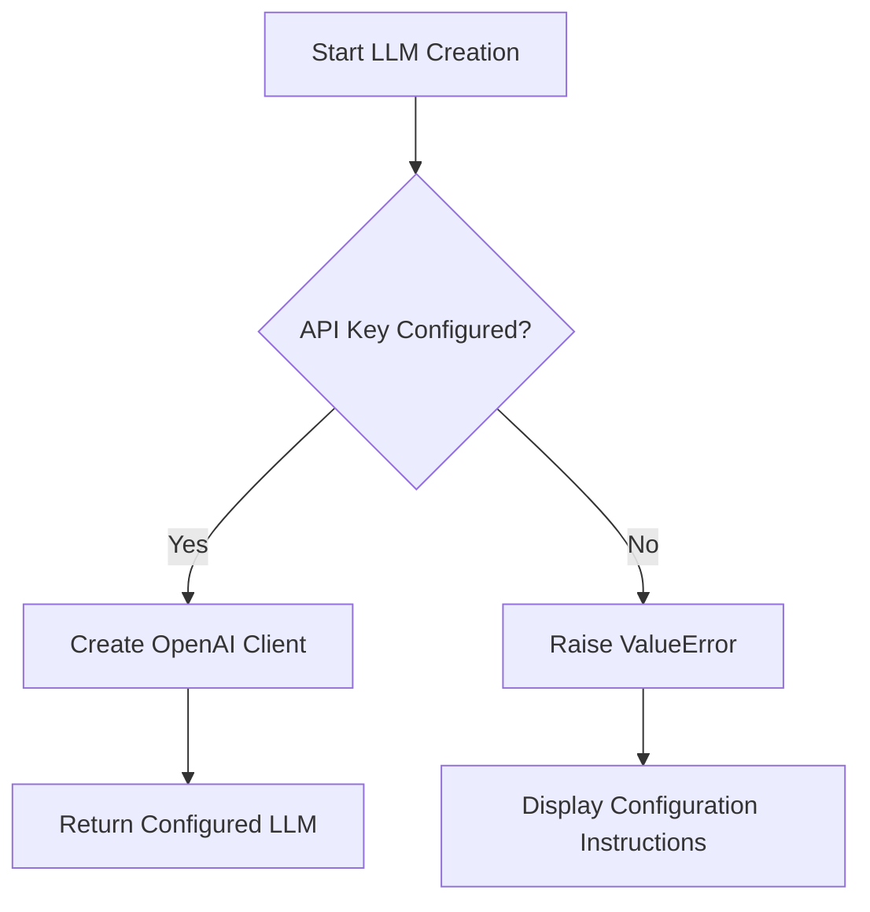
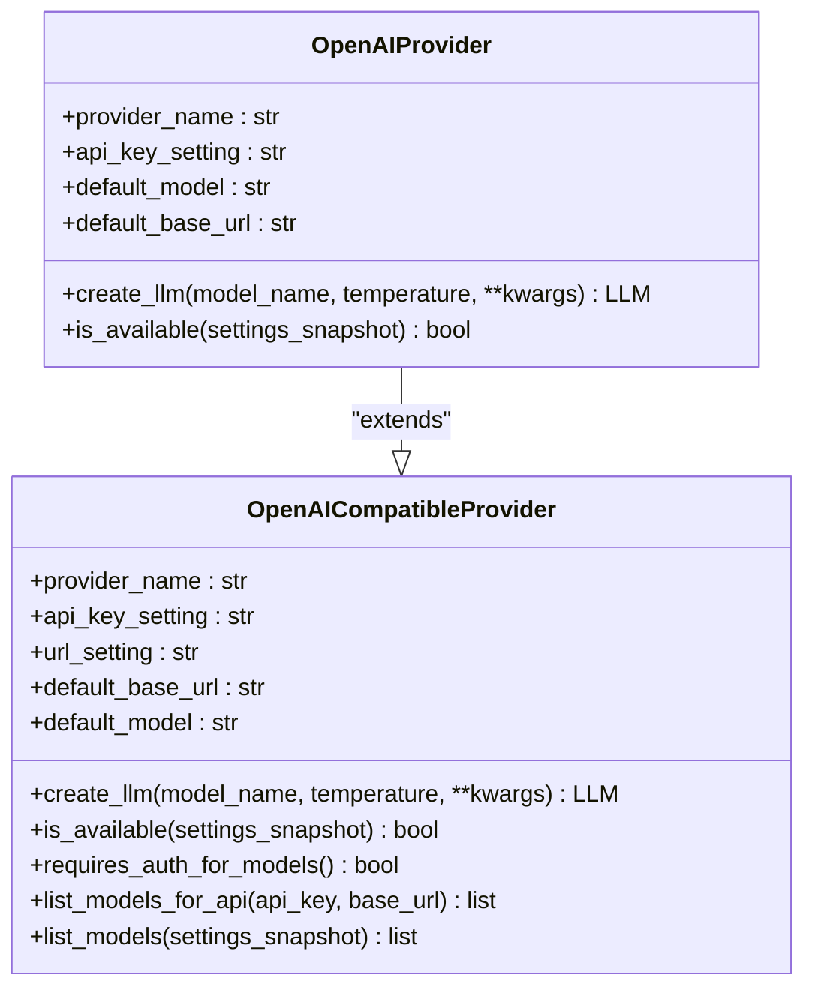
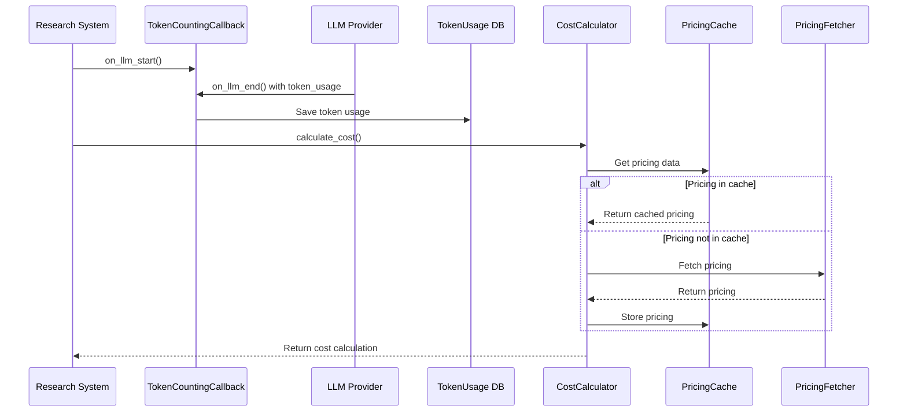
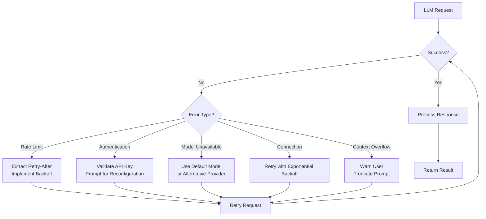
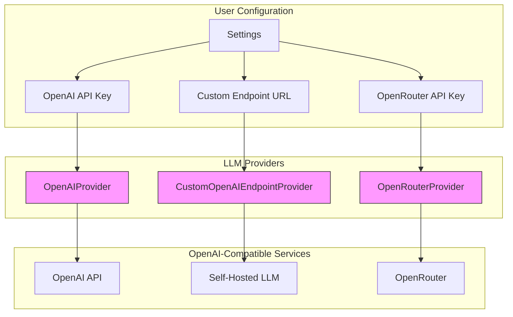

# OpenAI Integration

<cite>
**Referenced Files in This Document**   
- [openai_base.py](file://src/local_deep_research/llm/providers/openai_base.py)
- [openai.py](file://src/local_deep_research/llm/providers/implementations/openai.py)
- [custom_openai_endpoint.py](file://src/local_deep_research/llm/providers/implementations/custom_openai_endpoint.py)
- [openrouter.py](file://src/local_deep_research/llm/providers/implementations/openrouter.py)
- [cost_calculator.py](file://src/local_deep_research/metrics/pricing/cost_calculator.py)
- [pricing_fetcher.py](file://src/local_deep_research/metrics/pricing/pricing_fetcher.py)
- [token_counter.py](file://src/local_deep_research/metrics/token_counter.py)
- [openrouter_settings.json](file://src/local_deep_research/defaults/llm_providers/openrouter_settings.json)
- [troubleshooting-openai-api-key.md](file://docs/troubleshooting-openai-api-key.md)
</cite>

## Table of Contents
1. [Introduction](#introduction)
2. [Authentication and Configuration](#authentication-and-configuration)
3. [Model Configuration](#model-configuration)
4. [Streaming Responses](#streaming-responses)
5. [Token Counting and Cost Calculation](#token-counting-and-cost-calculation)
6. [Rate Limiting and Error Handling](#rate-limiting-and-error-handling)
7. [Custom Endpoints and OpenRouter Integration](#custom-endpoints-and-openrouter-integration)
8. [Conclusion](#conclusion)

## Introduction

This document provides comprehensive guidance on integrating OpenAI services within the Local Deep Research application. It covers authentication mechanisms, model configuration, streaming capabilities, token tracking, cost calculation, rate limiting, and integration with OpenAI-compatible services like OpenRouter. The implementation leverages a modular provider architecture that supports both official OpenAI services and OpenAI-compatible endpoints.

**Section sources**
- [openai_base.py](file://src/local_deep_research/llm/providers/openai_base.py#L1-L340)
- [openai.py](file://src/local_deep_research/llm/providers/implementations/openai.py#L1-L218)

## Authentication and Configuration

The OpenAI integration implements a secure authentication system using API keys stored in application settings. The authentication process follows these key principles:

1. **API Key Management**: API keys are stored in the application settings under the key `llm.openai.api_key` and accessed through a secure settings snapshot mechanism that prevents direct database access from threads.

2. **Authentication Validation**: Before creating an LLM instance, the system validates that the API key is configured. If the key is missing, a `ValueError` is raised with specific instructions for configuration.

3. **Secure Access Pattern**: The implementation uses a thread-safe settings access pattern that ensures credentials are properly isolated and protected during concurrent operations.

4. **Environment Integration**: The authentication system integrates with the application's settings framework, allowing API keys to be configured through the UI or environment variables.

The authentication mechanism is implemented in the `OpenAIProvider` class, which extends the base `OpenAICompatibleProvider` class and overrides the authentication-specific methods to handle OpenAI's requirements.

**Diagram sources**
- [openai.py](file://src/local_deep_research/llm/providers/implementations/openai.py#L62-L75)
- [openai_base.py](file://src/local_deep_research/llm/providers/openai_base.py#L54-L72)

**Section sources**
- [openai.py](file://src/local_deep_research/llm/providers/implementations/openai.py#L62-L75)
- [openai_base.py](file://src/local_deep_research/llm/providers/openai_base.py#L54-L72)

## Model Configuration

The system supports configuration of various OpenAI model variants through a flexible settings-based approach. The implementation provides the following capabilities:

1. **Default Model Selection**: The system defaults to `gpt-3.5-turbo` but allows configuration of other models including GPT-4 variants.

2. **Dynamic Model Switching**: Users can specify different models at runtime through the `model_name` parameter when creating an LLM instance.

3. **Provider-Specific Configuration**: OpenAI-specific settings like `api_base` and `organization` can be configured through the settings system.

4. **Parameter Customization**: Key parameters such as temperature, max_tokens, and request timeout can be configured globally or per-request.

The model configuration is handled by the `create_llm` method in the `OpenAIProvider` class, which reads settings from the context and applies them to the LangChain `ChatOpenAI` client configuration.

**Diagram sources**
- [openai.py](file://src/local_deep_research/llm/providers/implementations/openai.py#L26-L218)
- [openai_base.py](file://src/local_deep_research/llm/providers/openai_base.py#L25-L340)

**Section sources**
- [openai.py](file://src/local_deep_research/llm/providers/implementations/openai.py#L32-L35)
- [openai_base.py](file://src/local_deep_research/llm/providers/openai_base.py#L33-L38)

## Streaming Responses

The OpenAI integration supports streaming responses to provide real-time feedback during LLM processing. The streaming implementation includes:

1. **Configuration-Based Streaming**: Streaming can be enabled or disabled through the `llm.streaming` setting, which is read from the settings context.

2. **LangChain Integration**: The implementation leverages LangChain's native streaming capabilities by passing the `streaming` parameter to the `ChatOpenAI` client.

3. **Context-Aware Configuration**: The streaming setting is retrieved from the current settings snapshot, ensuring that the configuration is consistent with the user's preferences.

4. **Error Resilience**: The streaming implementation includes error handling to manage connection issues and other streaming-specific failures.

Streaming is configured as an optional parameter that can be set globally or overridden for specific requests, providing flexibility in how responses are delivered to the user interface.

**Section sources**
- [openai_base.py](file://src/local_deep_research/llm/providers/openai_base.py#L104-L114)
- [openai.py](file://src/local_deep_research/llm/providers/implementations/openai.py#L110-L118)

## Token Counting and Cost Calculation

The system implements comprehensive token counting and cost calculation to track LLM usage and associated costs. This functionality is divided into two main components:

### Token Counting Mechanism

The token counting system uses LangChain's callback system to track token usage across all LLM calls:

1. **Callback-Based Tracking**: The `TokenCountingCallback` class implements LangChain's `BaseCallbackHandler` to capture token usage information during LLM execution.

2. **Multi-Source Token Extraction**: The system extracts token usage from multiple sources including `llm_output.token_usage`, `usage_metadata`, and `response_metadata` to ensure compatibility with different LLM providers.

3. **Database Persistence**: Token usage data is stored in the database with detailed context including research ID, model name, provider, and timestamps.

4. **Thread-Safe Operation**: The implementation handles both main thread and background thread operations with appropriate database session management.

### Cost Calculation System

The cost calculation system determines the financial cost of LLM usage based on token counts and provider pricing:

1. **Pricing Data Management**: The system uses a combination of static pricing data and potential live pricing fetchers to determine model costs.

2. **Cost Calculator**: The `CostCalculator` class computes costs based on prompt and completion tokens, using pricing data from the `PricingFetcher`.

3. **Caching Strategy**: Pricing data is cached to minimize API calls and improve performance.

4. **Batch Processing**: The system can calculate costs for multiple usage records efficiently.

**Diagram sources**
- [token_counter.py](file://src/local_deep_research/metrics/token_counter.py#L19-L590)
- [cost_calculator.py](file://src/local_deep_research/metrics/pricing/cost_calculator.py#L16-L237)
- [pricing_fetcher.py](file://src/local_deep_research/metrics/pricing/pricing_fetcher.py#L14-L241)

**Section sources**
- [token_counter.py](file://src/local_deep_research/metrics/token_counter.py#L19-L590)
- [cost_calculator.py](file://src/local_deep_research/metrics/pricing/cost_calculator.py#L16-L237)

## Rate Limiting and Error Handling

The system implements robust rate limiting and error handling to manage OpenAI API constraints and common issues:

### Rate Limiting Strategy

1. **Error Detection**: The system detects rate limit errors by checking HTTP status codes (429), error messages containing "rate limit" or "quota exceeded", and specific error types like `RateLimitError`.

2. **Retry Logic**: When a rate limit is encountered, the system can extract retry-after information from response headers and implement appropriate backoff strategies.

3. **Provider-Specific Handling**: The implementation includes specific detection logic for OpenAI, Anthropic, and other providers to ensure accurate rate limit identification.

### Error Handling

The system handles several common OpenAI API issues:

1. **Authentication Failures**: When API keys are invalid or missing, the system raises descriptive `ValueError` exceptions with instructions for resolution.

2. **Model Unavailability**: If a requested model is not available, the system gracefully handles the error and can fall back to default models.

3. **Connection Issues**: Network-related errors are caught and handled with appropriate retry mechanisms.

4. **Context Overflow**: The system detects when prompts exceed model context limits and provides warnings with truncation information.

The error handling is implemented in multiple components, including the LLM providers, token counting system, and rate limiting utilities.

**Diagram sources**
- [openai_base.py](file://src/local_deep_research/llm/providers/openai_base.py#L302-L308)
- [detection.py](file://src/local_deep_research/web_search_engines/rate_limiting/llm/detection.py#L8-L82)
- [token_counter.py](file://src/local_deep_research/metrics/token_counter.py#L294-L322)

**Section sources**
- [openai_base.py](file://src/local_deep_research/llm/providers/openai_base.py#L302-L308)
- [detection.py](file://src/local_deep_research/web_search_engines/rate_limiting/llm/detection.py#L8-L82)

## Custom Endpoints and OpenRouter Integration

The system supports integration with custom OpenAI-compatible endpoints and OpenRouter through a flexible provider architecture:

### Custom OpenAI Endpoints

1. **Configuration**: Users can configure custom endpoints by setting `llm.openai_endpoint.url` and `llm.openai_endpoint.api_key` in the settings.

2. **Provider Implementation**: The `CustomOpenAIEndpointProvider` class extends `OpenAICompatibleProvider` and overrides the URL handling to use the configured endpoint.

3. **Model Listing**: Custom endpoints can list available models without requiring authentication, supporting local LLM servers like vLLM and LM Studio.

4. **Flexible Configuration**: The implementation allows users to connect to any OpenAI-compatible API, including self-hosted LLM services.

### OpenRouter Integration

1. **Unified API Access**: OpenRouter provides access to multiple models through a single API endpoint at `https://openrouter.ai/api/v1`.

2. **Provider Implementation**: The `OpenRouterProvider` class configures the OpenAI client to use the OpenRouter endpoint with the user's API key.

3. **Authentication**: Users configure their OpenRouter API key via the `llm.openrouter.api_key` setting.

4. **Model Flexibility**: OpenRouter supports a wide range of models from different providers, accessible through model identifiers like `openai/gpt-4` or `anthropic/claude-3-opus`.

5. **Automatic Discovery**: The system can list available models from OpenRouter without requiring authentication, enabling dynamic model selection.

The integration architecture allows for load balancing and fallback between different OpenAI-compatible services, enhancing reliability and availability.

**Diagram sources**
- [custom_openai_endpoint.py](file://src/local_deep_research/llm/providers/implementations/custom_openai_endpoint.py#L25-L72)
- [openrouter.py](file://src/local_deep_research/llm/providers/implementations/openrouter.py#L9-L72)
- [openrouter_settings.json](file://src/local_deep_research/defaults/llm_providers/openrouter_settings.json#L1-L17)

**Section sources**
- [custom_openai_endpoint.py](file://src/local_deep_research/llm/providers/implementations/custom_openai_endpoint.py#L25-L72)
- [openrouter.py](file://src/local_deep_research/llm/providers/implementations/openrouter.py#L9-L72)

## Conclusion

The OpenAI integration in Local Deep Research provides a comprehensive, secure, and flexible system for working with OpenAI and OpenAI-compatible services. The architecture supports authentication via API keys, configuration of various model variants, streaming responses, detailed token counting, and accurate cost calculation based on OpenAI's pricing model.

Key features include:
- Secure API key management and authentication
- Support for GPT-3.5, GPT-4, and other OpenAI models
- Streaming response capabilities for real-time feedback
- Comprehensive token counting with database persistence
- Cost calculation based on actual usage and provider pricing
- Robust rate limiting strategies that respect API constraints
- Error handling for common issues like authentication failures and model unavailability
- Integration with custom OpenAI endpoints and OpenRouter for enhanced flexibility

The modular provider architecture enables easy extension to support additional OpenAI-compatible services and ensures that the system can adapt to evolving LLM provider landscapes while maintaining a consistent interface for applications.