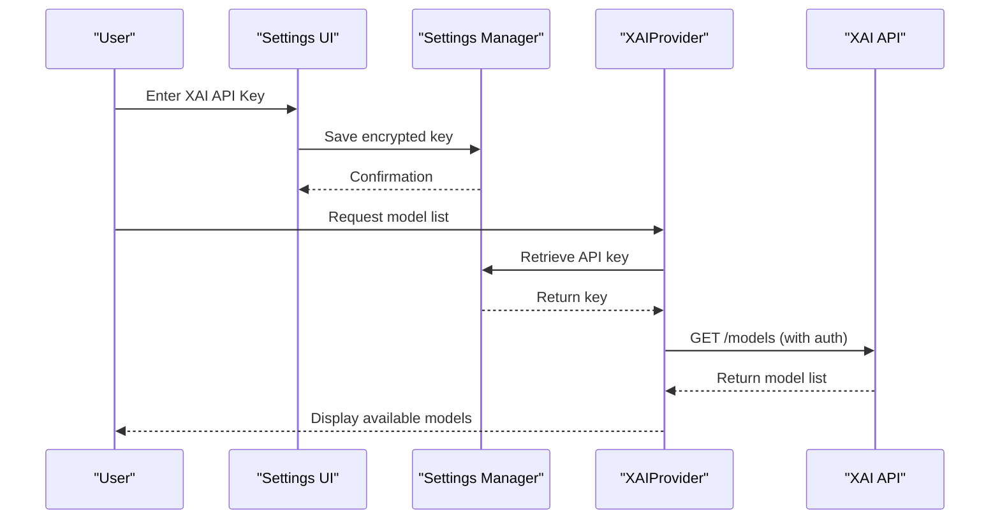
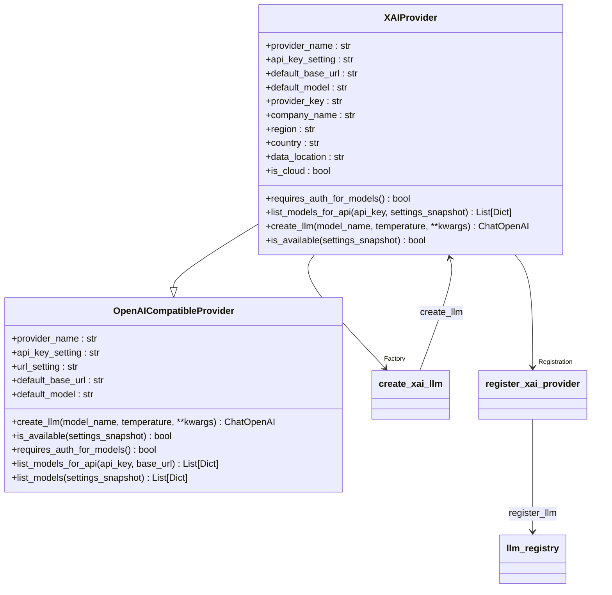
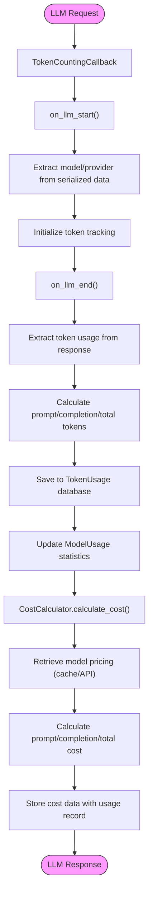
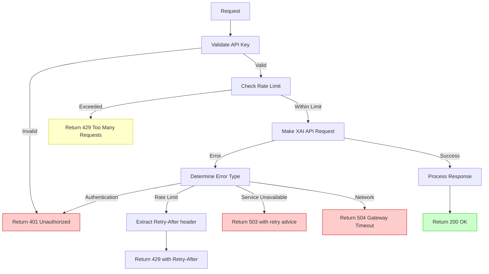
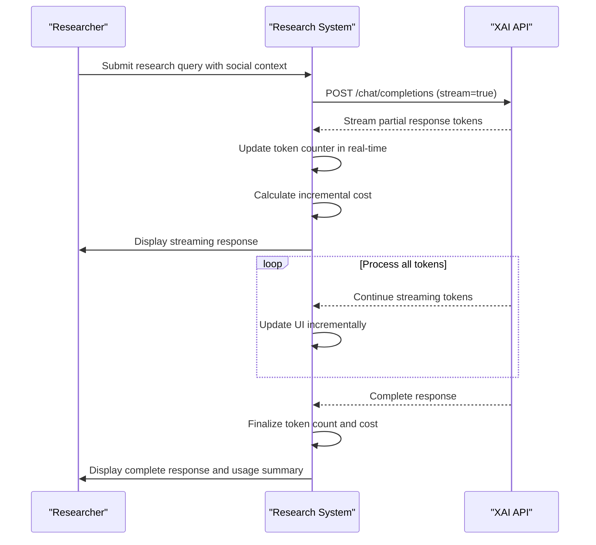

# XAI Integration

<cite>
**Referenced Files in This Document**   
- [xai.py](file://src/local_deep_research/llm/providers/implementations/xai.py)
- [xai_settings.json](file://src/local_deep_research/defaults/llm_providers/xai_settings.json)
- [openai_base.py](file://src/local_deep_research/llm/providers/openai_base.py)
- [cost_calculator.py](file://src/local_deep_research/metrics/pricing/cost_calculator.py)
- [token_counter.py](file://src/local_deep_research/metrics/token_counter.py)
- [thread_settings.py](file://src/local_deep_research/config/thread_settings.py)
- [rate_limiter.py](file://src/local_deep_research/security/rate_limiter.py)
</cite>

## Table of Contents
1. [Introduction](#introduction)
2. [Authentication and Configuration](#authentication-and-configuration)
3. [Grok Model Configuration](#grok-model-configuration)
4. [Token Counting and Cost Tracking](#token-counting-and-cost-tracking)
5. [Error Handling](#error-handling)
6. [Streaming and Social Context Awareness](#streaming-and-social-context-awareness)
7. [Conclusion](#conclusion)

## Introduction

This document provides comprehensive documentation for integrating XAI (formerly Twitter) services into the Local Deep Research platform. The integration focuses on leveraging XAI's Grok models through their OpenAI-compatible API endpoint, enabling researchers to access advanced AI capabilities with social context awareness. The system supports real-time data access, token usage tracking, cost calculation, and robust error handling for rate limits and authentication issues. This integration allows users to harness the unique capabilities of Grok models while maintaining the platform's security, performance, and cost-efficiency standards.

## Authentication and Configuration

The XAI integration implements a secure authentication system using API keys that are managed through the platform's centralized settings framework. The authentication process follows a structured approach to ensure secure access to XAI's services while maintaining user privacy and data protection.

The system uses a dedicated settings configuration file (`xai_settings.json`) that defines the API key parameter with appropriate security measures. The API key is stored as a password-type field in the settings, ensuring it is properly encrypted and protected within the user's encrypted database. This approach prevents unauthorized access to sensitive credentials while allowing seamless integration with the XAI API.

Authentication is implemented through the `XAIProvider` class, which extends the `OpenAICompatibleProvider` base class. This inheritance allows the system to leverage existing OpenAI-compatible functionality while adding XAI-specific authentication requirements. The provider explicitly requires authentication for accessing the models endpoint, ensuring that only authorized users can discover available Grok models.

The authentication flow begins when a user configures their XAI API key through the platform's settings interface. The key is validated and stored securely, then retrieved through the thread-safe settings context system when needed for API requests. This ensures that credentials are never exposed in logs or error messages while maintaining accessibility across different components of the application.

**Diagram sources**
- [xai.py](file://src/local_deep_research/llm/providers/implementations/xai.py#L15-L45)
- [xai_settings.json](file://src/local_deep_research/defaults/llm_providers/xai_settings.json#L1-L16)

**Section sources**
- [xai.py](file://src/local_deep_research/llm/providers/implementations/xai.py#L9-L45)
- [xai_settings.json](file://src/local_deep_research/defaults/llm_providers/xai_settings.json#L1-L16)
- [thread_settings.py](file://src/local_deep_research/config/thread_settings.py#L35-L127)

## Grok Model Configuration

The Grok model configuration system provides flexible access to XAI's various model offerings while maintaining compatibility with the platform's existing LLM architecture. The integration supports multiple Grok model variants, including `grok-beta`, `grok-2`, and `grok-2-mini`, allowing users to select the appropriate model based on their research requirements and cost considerations.

The default configuration establishes `grok-beta` as the primary model, accessible through the standardized OpenAI-compatible endpoint at `https://api.x.ai/v1`. This endpoint configuration enables seamless integration with the platform's existing OpenAI-compatible provider infrastructure, reducing implementation complexity while ensuring consistent behavior across different LLM providers.

Model selection is implemented through a factory pattern that creates configured `ChatOpenAI` instances pointing to the XAI API. The `create_xai_llm` function serves as the entry point for model instantiation, accepting parameters such as model name and temperature to customize the LLM behavior. This approach allows for fine-grained control over the model's creativity and determinism, enabling researchers to optimize their queries for specific use cases.

The system also implements model discovery capabilities through the `list_models_for_api` method, which retrieves available models directly from XAI's API. This dynamic model listing ensures that users have access to the most current model offerings without requiring manual configuration updates. The model discovery process requires authentication, enhancing security by preventing unauthorized enumeration of available models.

**Diagram sources**
- [xai.py](file://src/local_deep_research/llm/providers/implementations/xai.py#L9-L80)
- [openai_base.py](file://src/local_deep_research/llm/providers/openai_base.py#L25-L340)

**Section sources**
- [xai.py](file://src/local_deep_research/llm/providers/implementations/xai.py#L15-L80)
- [openai_base.py](file://src/local_deep_research/llm/providers/openai_base.py#L25-L340)

## Token Counting and Cost Tracking

The token counting and cost tracking system provides comprehensive monitoring of LLM usage for XAI's Grok models, enabling researchers to understand and optimize their resource consumption. The implementation combines real-time token counting with cost calculation to deliver detailed insights into usage patterns and expenses.

Token counting is implemented through the `TokenCountingCallback` class, which extends LangChain's `BaseCallbackHandler` to intercept LLM interactions and extract token usage information. The callback captures both prompt and completion tokens from various sources in the response object, including standard token usage fields and provider-specific metadata. For XAI's Grok models, the system extracts token counts from the response metadata, ensuring accurate measurement of API usage.

The token counter integrates with the platform's database to persist usage data, associating each token count with relevant research context such as research ID, query, mode, and phase. This contextual information enables detailed analysis of token consumption patterns across different research scenarios and helps identify optimization opportunities. The system also tracks performance metrics like response time and success status, providing a comprehensive view of LLM interactions.

Cost tracking is implemented through the `CostCalculator` class, which calculates expenses based on token usage and model-specific pricing data. The calculator uses a caching system to store pricing information, reducing the need for repeated API calls while ensuring cost calculations remain up-to-date. For XAI's Grok models, the system would use the appropriate pricing structure to convert token counts into monetary costs.

**Diagram sources**
- [token_counter.py](file://src/local_deep_research/metrics/token_counter.py#L19-L589)
- [cost_calculator.py](file://src/local_deep_research/metrics/pricing/cost_calculator.py#L16-L237)

**Section sources**
- [token_counter.py](file://src/local_deep_research/metrics/token_counter.py#L19-L589)
- [cost_calculator.py](file://src/local_deep_research/metrics/pricing/cost_calculator.py#L16-L237)

## Error Handling

The error handling system for XAI integration provides robust protection against common API issues, including rate limits, authentication failures, and service interruptions. The implementation follows a comprehensive approach that combines proactive prevention, graceful degradation, and informative feedback to ensure a reliable user experience.

Rate limiting is managed through the platform's centralized rate limiter, which applies configurable limits to API requests based on user identity or IP address. The system implements a fail-closed policy in production environments, ensuring that rate limiting remains active even if the limiter fails to initialize. When rate limits are exceeded, the system returns appropriate HTTP 429 status codes with Retry-After headers, allowing clients to implement exponential backoff strategies.

Authentication errors are handled through multiple layers of validation and recovery mechanisms. The system validates API keys before making requests and provides clear error messages when authentication fails. For transient authentication issues, the implementation includes retry logic with appropriate delays to handle temporary service disruptions. The error handling also includes detection of expired or revoked API keys, prompting users to update their credentials through the settings interface.

Service interruptions and network errors are managed through comprehensive exception handling that distinguishes between different types of failures. The system implements retry mechanisms for transient errors while providing appropriate feedback for permanent failures. Error responses include detailed information to help diagnose issues without exposing sensitive system details.

**Diagram sources**
- [xai.py](file://src/local_deep_research/llm/providers/implementations/xai.py#L39-L44)
- [rate_limiter.py](file://src/local_deep_research/security/rate_limiter.py#L88-L148)
- [token_counter.py](file://src/local_deep_research/metrics/token_counter.py#L366-L378)

**Section sources**
- [xai.py](file://src/local_deep_research/llm/providers/implementations/xai.py#L39-L44)
- [rate_limiter.py](file://src/local_deep_research/security/rate_limiter.py#L16-L152)
- [token_counter.py](file://src/local_deep_research/metrics/token_counter.py#L366-L378)

## Streaming and Social Context Awareness

The XAI integration supports streaming responses and leverages Grok's social context awareness capabilities to enhance research outcomes. The streaming implementation enables real-time processing of model responses, allowing for immediate feedback and interactive research experiences.

Streaming is implemented through the underlying OpenAI-compatible client, which supports the streaming of partial responses as they become available from the XAI API. This capability is particularly valuable for research scenarios where immediate insights are needed, such as monitoring breaking news or analyzing rapidly evolving social trends. The system processes streamed tokens incrementally, updating the user interface in real-time while maintaining accurate token counting and cost tracking.

Grok's social context awareness is leveraged through the model's training on X platform data, enabling it to understand and analyze social dynamics, trending topics, and public sentiment. The integration exposes these capabilities through natural language queries that can incorporate social context into research questions. For example, researchers can ask about public reactions to scientific discoveries or analyze sentiment around emerging technologies.

The system also implements context-aware token counting that tracks not only the volume of tokens but also their context within the research process. This includes tracking which research phase generated specific token usage, which search engines contributed to the context, and how different models perform on social context-aware tasks. This detailed tracking enables optimization of research strategies based on social context effectiveness.

**Diagram sources**
- [xai.py](file://src/local_deep_research/llm/providers/implementations/xai.py#L81-L82)
- [openai_base.py](file://src/local_deep_research/llm/providers/openai_base.py#L104-L114)
- [token_counter.py](file://src/local_deep_research/metrics/token_counter.py#L228-L234)

**Section sources**
- [xai.py](file://src/local_deep_research/llm/providers/implementations/xai.py#L81-L82)
- [openai_base.py](file://src/local_deep_research/llm/providers/openai_base.py#L104-L114)
- [token_counter.py](file://src/local_deep_research/metrics/token_counter.py#L228-L234)

## Conclusion

The XAI integration provides a comprehensive solution for leveraging Grok models within the Local Deep Research platform, combining secure authentication, flexible model configuration, precise token counting, and robust error handling. The implementation successfully integrates XAI's OpenAI-compatible API while extending it with platform-specific features for cost tracking, performance monitoring, and social context awareness.

Key strengths of the integration include its adherence to security best practices through encrypted API key storage, its compatibility with existing OpenAI-compatible infrastructure, and its comprehensive monitoring capabilities that provide researchers with detailed insights into their LLM usage. The system's error handling ensures reliability even in the face of rate limits and service interruptions, while the streaming support enables real-time interaction with Grok models.

Future enhancements could include more granular cost optimization features, advanced social context analysis tools, and improved model selection recommendations based on historical performance data. The current implementation provides a solid foundation for these enhancements while delivering immediate value to researchers seeking to leverage XAI's unique capabilities in their work.