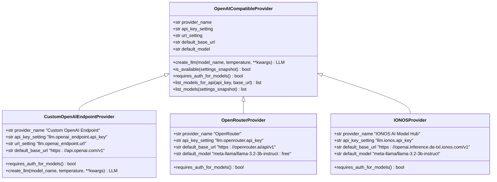
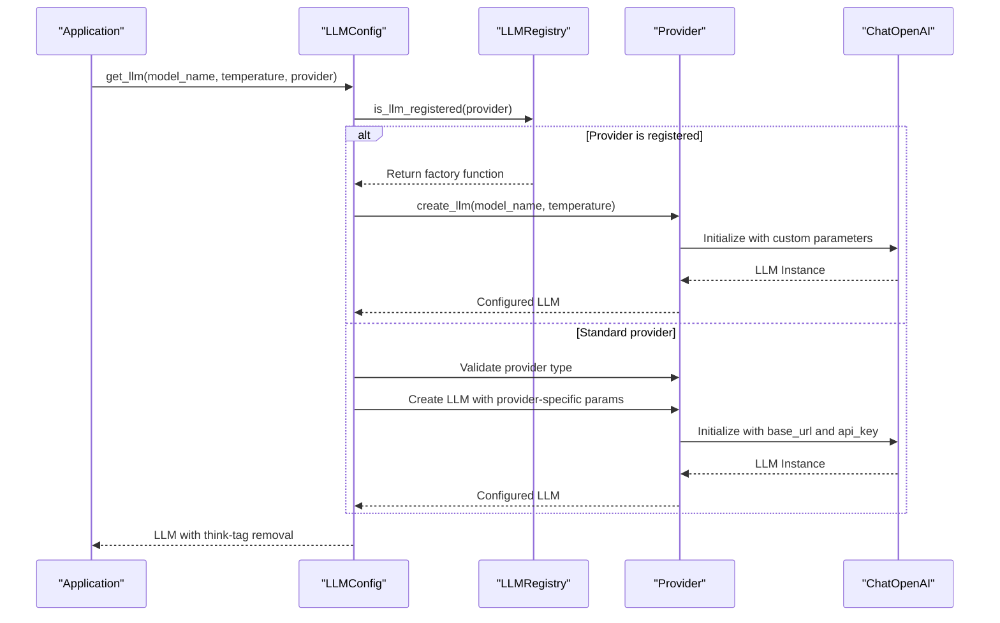
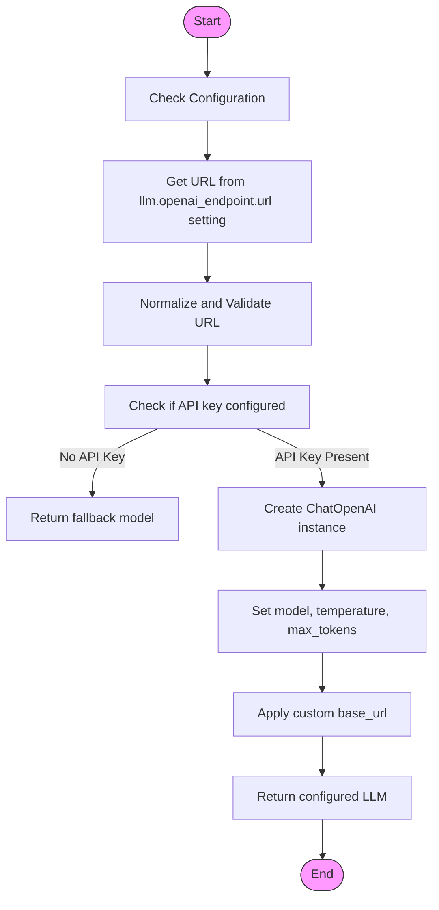
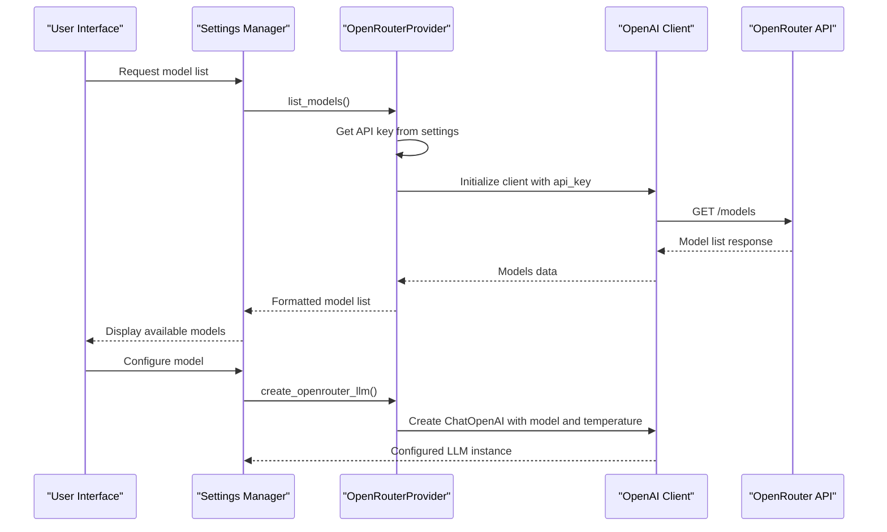
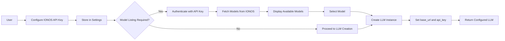

# Custom Endpoints Integration

<cite>
**Referenced Files in This Document**   
- [custom_openai_endpoint.py](file://src/local_deep_research/llm/providers/implementations/custom_openai_endpoint.py)
- [openai_base.py](file://src/local_deep_research/llm/providers/openai_base.py)
- [openrouter.py](file://src/local_deep_research/llm/providers/implementations/openrouter.py)
- [ionos.py](file://src/local_deep_research/llm/providers/implementations/ionos.py)
- [llm_config.py](file://src/local_deep_research/config/llm_config.py)
- [default_settings.json](file://src/local_deep_research/defaults/default_settings.json)
- [test_custom_openai_endpoint.py](file://tests/llm_providers/test_custom_openai_endpoint.py)
- [test_custom_endpoint_ci_integration.py](file://tests/llm_providers/test_custom_endpoint_ci_integration.py)
</cite>

## Table of Contents
1. [Introduction](#introduction)
2. [Architecture Overview](#architecture-overview)
3. [Core Components](#core-components)
4. [Custom OpenAI Endpoint Provider](#custom-openai-endpoint-provider)
5. [OpenRouter Integration](#openrouter-integration)
6. [IONOS AI Model Hub Integration](#ionos-ai-model-hub-integration)
7. [Configuration Guide](#configuration-guide)
8. [Security Considerations](#security-considerations)
9. [Troubleshooting](#troubleshooting)
10. [Advanced Use Cases](#advanced-use-cases)

## Introduction

This document provides comprehensive guidance on integrating custom LLM endpoints with OpenAI-compatible APIs in the Local Deep Research system. The architecture supports connections to various third-party services including OpenRouter, Ionos, and self-hosted solutions through a flexible provider model. The system enables configuration of arbitrary base URLs, custom authentication schemes, and proxy configurations while handling non-standard API behaviors through a unified interface.

The implementation leverages a provider-based architecture where each service implements a common interface for model listing, authentication, and LLM creation. This design allows seamless integration of new endpoints while maintaining consistent behavior across different providers. The system supports both cloud-based services and local/self-hosted models, with special handling for services that require or do not require authentication for model enumeration.

**Section sources**
- [custom_openai_endpoint.py](file://src/local_deep_research/llm/providers/implementations/custom_openai_endpoint.py#L1-L112)
- [openai_base.py](file://src/local_deep_research/llm/providers/openai_base.py#L1-L340)

## Architecture Overview

The custom endpoint integration system follows a hierarchical provider model built on OpenAI's API compatibility. At the core is a base `OpenAICompatibleProvider` class that implements common functionality for all OpenAI-compatible services, with specific providers extending this base class to handle service-specific requirements.



**Diagram sources**
- [openai_base.py](file://src/local_deep_research/llm/providers/openai_base.py#L25-L340)
- [custom_openai_endpoint.py](file://src/local_deep_research/llm/providers/implementations/custom_openai_endpoint.py#L25-L74)
- [openrouter.py](file://src/local_deep_research/llm/providers/implementations/openrouter.py#L9-L37)
- [ionos.py](file://src/local_deep_research/llm/providers/implementations/ionos.py#L9-L35)

## Core Components

The system's core components enable flexible integration of custom LLM endpoints through a registry pattern and provider-based architecture. The LLM registry maintains a global collection of available language models, allowing dynamic registration and retrieval of custom LLM implementations. Each provider implements a standardized interface that handles authentication, model enumeration, and LLM creation.

The configuration system uses a hierarchical settings model where endpoint-specific parameters are stored in the application's settings database. The `get_llm()` function serves as the primary entry point for obtaining LLM instances, routing requests to the appropriate provider based on the configured provider setting. This function handles fallback mechanisms, parameter validation, and context window management across different provider types.



**Diagram sources**
- [llm_config.py](file://src/local_deep_research/config/llm_config.py#L283-L700)
- [llm_registry.py](file://src/local_deep_research/llm/llm_registry.py#L1-L162)

**Section sources**
- [llm_config.py](file://src/local_deep_research/config/llm_config.py#L283-L800)
- [llm_registry.py](file://src/local_deep_research/llm/llm_registry.py#L1-L162)

## Custom OpenAI Endpoint Provider

The Custom OpenAI Endpoint provider enables connection to any OpenAI-compatible API endpoint by specifying a custom URL in the settings. This provider is designed for maximum flexibility, supporting self-hosted solutions like vLLM, Ollama, and other OpenAI-compatible servers. The implementation extends the base `OpenAICompatibleProvider` class with specific handling for user-configurable endpoints.

Key features include:
- Dynamic URL configuration through the `llm.openai_endpoint.url` setting
- Support for endpoints that may or may not require authentication for model listing
- Automatic URL normalization to prevent double-suffix issues (e.g., `/v1/v1`)
- Compatibility with private IP addresses commonly used in Docker and local deployments

The provider is specifically designed to handle the diverse requirements of self-hosted LLM servers, many of which do not require authentication for model enumeration. This is reflected in the `requires_auth_for_models()` method returning `False`, allowing model listing without an API key. The system uses a dummy key for model enumeration when authentication is not required, falling back to the configured API key for actual LLM operations.



**Diagram sources**
- [custom_openai_endpoint.py](file://src/local_deep_research/llm/providers/implementations/custom_openai_endpoint.py#L25-L74)
- [test_custom_openai_endpoint.py](file://tests/llm_providers/test_custom_openai_endpoint.py#L74-L149)

**Section sources**
- [custom_openai_endpoint.py](file://src/local_deep_research/llm/providers/implementations/custom_openai_endpoint.py#L1-L112)

## OpenRouter Integration

The OpenRouter provider offers access to a wide range of models through a unified OpenAI-compatible API. OpenRouter aggregates models from various providers including OpenAI, Anthropic, Google, and Meta, automatically supporting all current and future models without requiring code updates. This integration leverages the standard OpenAI client with OpenRouter's API endpoint.

Key characteristics of the OpenRouter integration:
- Base URL configured to `https://openrouter.ai/api/v1`
- Default model set to a free tier option: `meta-llama/llama-3.2-3b-instruct:free`
- Model listing does not require authentication, enabling discovery of available models
- Support for provider-specific model identifiers (e.g., `openai/gpt-4`, `anthropic/claude-3-opus`)

The provider implementation follows the same pattern as other OpenAI-compatible services but with specific metadata for auto-discovery and user interface presentation. The `requires_auth_for_models()` method returns `False`, allowing the system to list available models without requiring an API key, which enhances the user experience during configuration.



**Diagram sources**
- [openrouter.py](file://src/local_deep_research/llm/providers/implementations/openrouter.py#L9-L54)
- [openrouter_settings.json](file://src/local_deep_research/defaults/llm_providers/openrouter_settings.json#L1-L16)

**Section sources**
- [openrouter.py](file://src/local_deep_research/llm/providers/implementations/openrouter.py#L1-L72)

## IONOS AI Model Hub Integration

The IONOS AI Model Hub provider offers GDPR-compliant AI services with data processing in Germany. This integration is designed for users requiring strict data privacy compliance, with all processing occurring within German data centers. The service is currently free until September 30, 2025, making it an attractive option for European users.

Key features of the IONOS integration:
- Base URL configured to `https://openai.inference.de-txl.ionos.com/v1`
- GDPR compliance with data processed exclusively in Germany
- Requires authentication for both model listing and LLM operations
- Default model set to `meta-llama/llama-3.2-3b-instruct`

Unlike some other providers, IONOS requires authentication for model enumeration, which is reflected in the `requires_auth_for_models()` method returning `True`. This security measure ensures that only authorized users can discover available models. The provider metadata includes specific compliance information, including `gdpr_compliant = True` and `data_location = "Germany"`, which can be used by the application to inform users about data handling practices.



**Diagram sources**
- [ionos.py](file://src/local_deep_research/llm/providers/implementations/ionos.py#L9-L35)
- [ionos_settings.json](file://src/local_deep_research/defaults/llm_providers/ionos_settings.json#L1-L16)

**Section sources**
- [ionos.py](file://src/local_deep_research/llm/providers/implementations/ionos.py#L1-L71)

## Configuration Guide

Configuring custom LLM endpoints involves setting specific parameters in the application's settings system. The process varies slightly depending on whether you're connecting to a third-party service or a self-hosted solution.

### OpenAI-Compatible Endpoint Configuration
To configure a custom OpenAI-compatible endpoint:
1. Set the LLM provider to "Custom OpenAI-compatible API"
2. Configure the endpoint URL in `llm.openai_endpoint.url`
3. Provide the API key in `llm.openai_endpoint.api_key`
4. Select the desired model from the enumerated list

Example configuration for a self-hosted vLLM server:
```json
{
  "llm.provider": "openai_endpoint",
  "llm.openai_endpoint.url": "http://192.168.1.100:8000/v1",
  "llm.openai_endpoint.api_key": "your-api-key",
  "llm.model": "meta-llama/Llama-3-70B"
}
```

### OpenRouter Configuration
For OpenRouter integration:
1. Set the LLM provider to "OpenRouter API"
2. Obtain an API key from [OpenRouter](https://openrouter.ai)
3. Configure the API key in `llm.openrouter.api_key`
4. Select from the extensive model catalog

### IONOS AI Model Hub Configuration
To use IONOS services:
1. Set the LLM provider to "IONOS AI Model Hub"
2. Register for access at [IONOS AI Model Hub](https://ai.ionos.com)
3. Configure the API key in `llm.ionos.api_key`
4. Select from available models

The system automatically handles model enumeration for all providers, presenting available models in the user interface once the endpoint is configured. For providers that don't require authentication for model listing (like custom endpoints), the model list will be available even before the API key is configured.

**Section sources**
- [default_settings.json](file://src/local_deep_research/defaults/default_settings.json#L437-L580)
- [custom_openai_endpoint.py](file://src/local_deep_research/llm/providers/implementations/custom_openai_endpoint.py#L34-L35)
- [openrouter.py](file://src/local_deep_research/llm/providers/implementations/openrouter.py#L19-L20)
- [ionos.py](file://src/local_deep_research/llm/providers/implementations/ionos.py#L19-L20)

## Security Considerations

The custom endpoint integration system incorporates several security measures to protect user data and prevent unauthorized access:

1. **Authentication Management**: API keys are stored securely in the application's encrypted database, never exposed in client-side code or logs.

2. **Network Security**: The system validates URLs and prevents SSRF (Server-Side Request Forgery) attacks by restricting connections to authorized endpoints.

3. **Data Privacy**: For GDPR-compliant providers like IONOS, metadata indicates data processing locations, helping users make informed decisions about data sovereignty.

4. **Input Validation**: All endpoint URLs are normalized and validated to prevent injection attacks and malformed requests.

5. **Rate Limiting**: The system implements rate limiting to prevent abuse of API endpoints.

When exposing custom endpoints, consider the following best practices:
- Use HTTPS for all external connections
- Rotate API keys regularly
- Implement IP restrictions when possible
- Monitor API usage for unusual patterns
- Use dedicated API keys with limited permissions

The system's architecture ensures that sensitive credentials are never exposed in client-side code, with all API calls routed through the server. Additionally, the settings system encrypts sensitive data at rest, providing an additional layer of protection.

**Section sources**
- [security](file://src/local_deep_research/security)
- [custom_openai_endpoint.py](file://src/local_deep_research/llm/providers/implementations/custom_openai_endpoint.py#L1-L112)

## Troubleshooting

Common issues and their solutions when configuring custom LLM endpoints:

### Connection Issues
**Symptom**: "Could not list models" error
- **Cause**: Incorrect URL format or network connectivity issues
- **Solution**: Verify the endpoint URL includes the protocol (http:// or https://) and is accessible from the server

**Symptom**: Authentication failed
- **Cause**: Invalid or missing API key
- **Solution**: Double-check the API key in settings and ensure it has the necessary permissions

### Model Enumeration Problems
**Symptom**: Empty model list
- **Cause**: Some providers require authentication for model listing
- **Solution**: Ensure API key is configured before attempting to list models

**Symptom**: Double /v1 suffix in URL
- **Cause**: Legacy code appending /v1 to URLs that already have it
- **Solution**: Use the current version which preserves the exact URL format

### Performance Issues
**Symptom**: Slow response times
- **Cause**: Network latency or overloaded endpoint
- **Solution**: Verify network connectivity and check the status of the target service

The system includes comprehensive logging to aid troubleshooting, with detailed error messages that help identify the root cause of connectivity issues. Test configurations using the built-in model listing functionality before attempting full integration.

**Section sources**
- [test_custom_openai_endpoint.py](file://tests/llm_providers/test_custom_openai_endpoint.py#L74-L149)
- [test_custom_endpoint_ci_integration.py](file://tests/llm_providers/test_custom_endpoint_ci_integration.py#L36-L108)

## Advanced Use Cases

The custom endpoint architecture supports several advanced integration scenarios:

### Load Balancing Across Multiple Endpoints
Configure multiple endpoints and implement client-side logic to distribute requests based on availability, cost, or performance characteristics. This can be achieved by registering multiple custom endpoint providers with different URLs and implementing a routing strategy.

### Specialized Domain Models
Connect to specialized domain-specific models hosted on private endpoints, such as medical, legal, or financial AI models. The flexible URL configuration allows integration with niche providers that offer expertise in specific domains.

### Hybrid Cloud-Local Processing
Combine cloud-based services with local models by configuring different providers for different tasks. For example, use a local model for preliminary analysis and a cloud-based model for final report generation.

### Proxy Configuration
Route requests through proxies by configuring the endpoint URL to point to the proxy server. This enables use cases such as:
- Corporate network compliance
- Traffic monitoring and logging
- Geographic location spoofing
- Caching and performance optimization

The system's modular design makes it easy to extend with additional providers or modify existing behavior to meet specific requirements.

**Section sources**
- [llm_config.py](file://src/local_deep_research/config/llm_config.py#L283-L800)
- [custom_openai_endpoint.py](file://src/local_deep_research/llm/providers/implementations/custom_openai_endpoint.py#L25-L74)