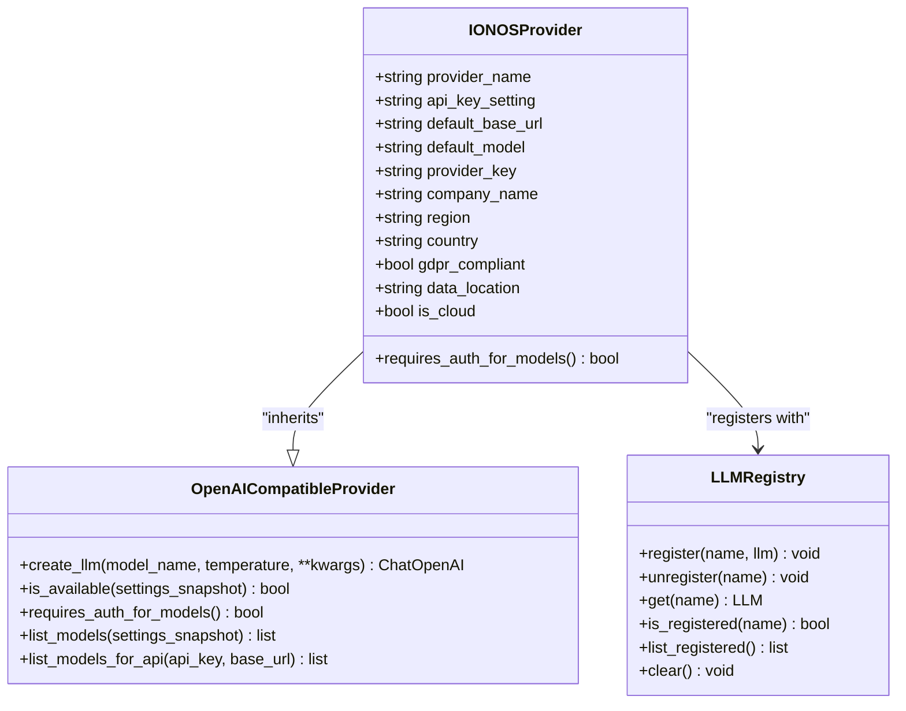
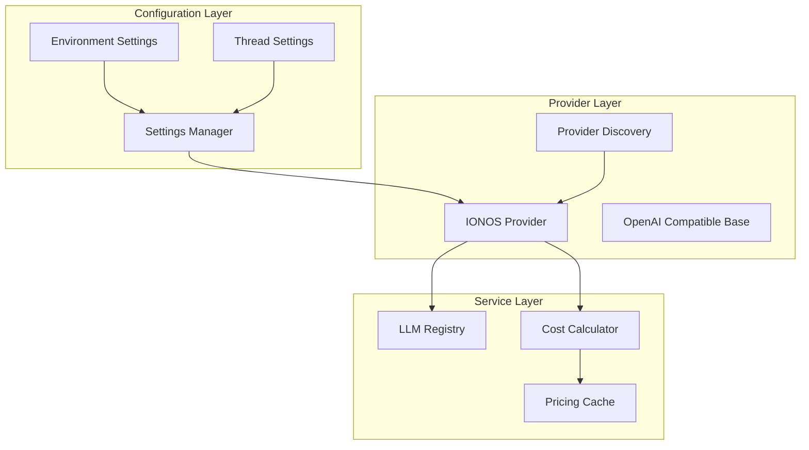
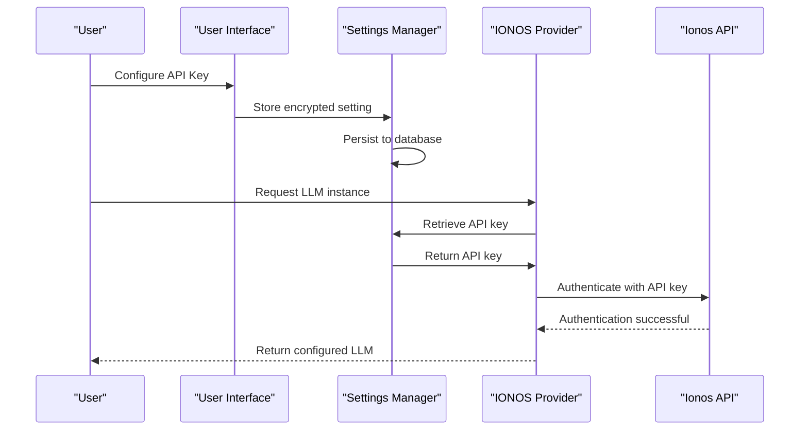
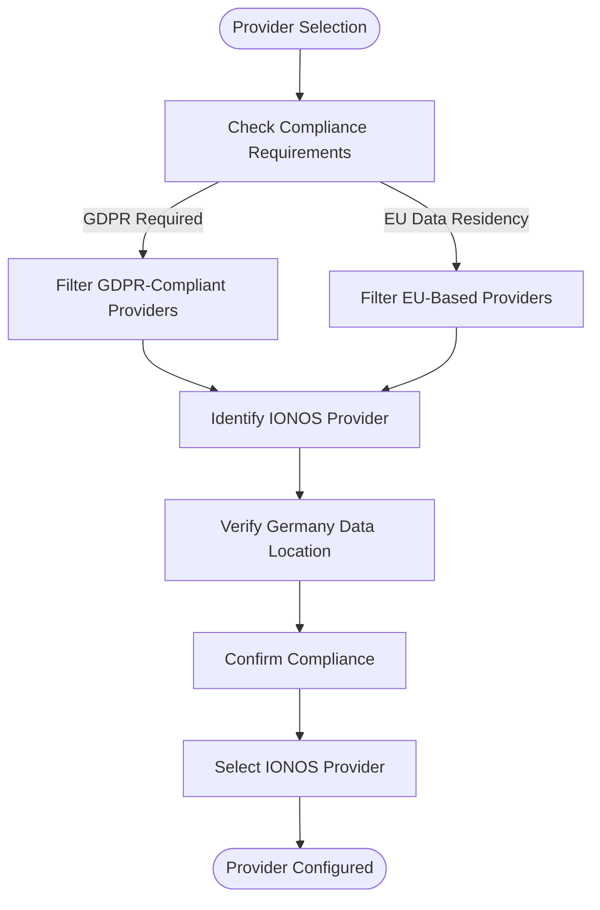
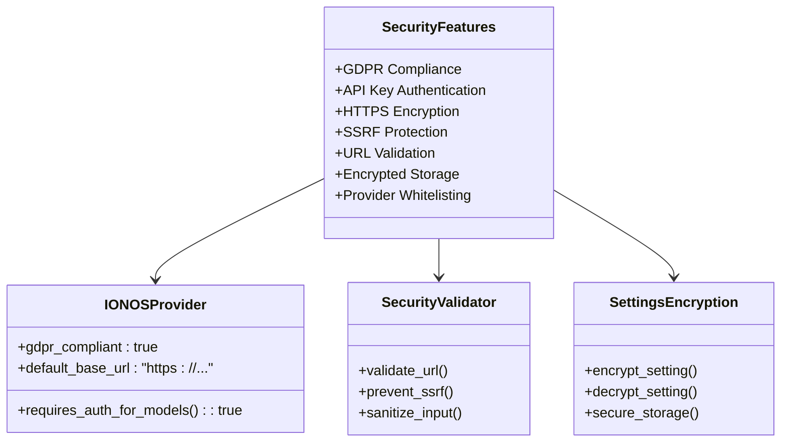
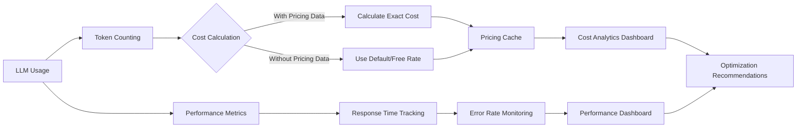
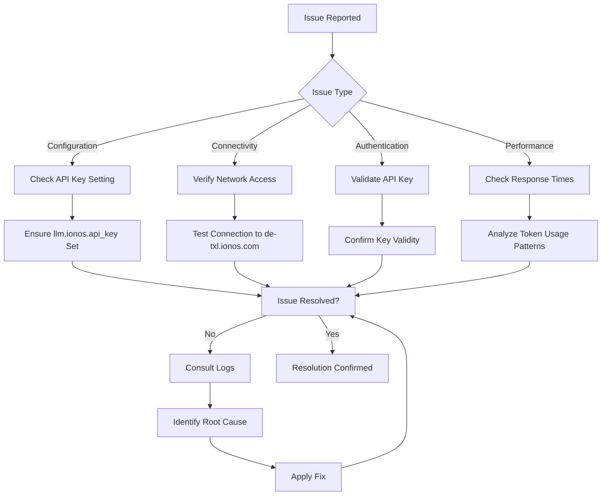
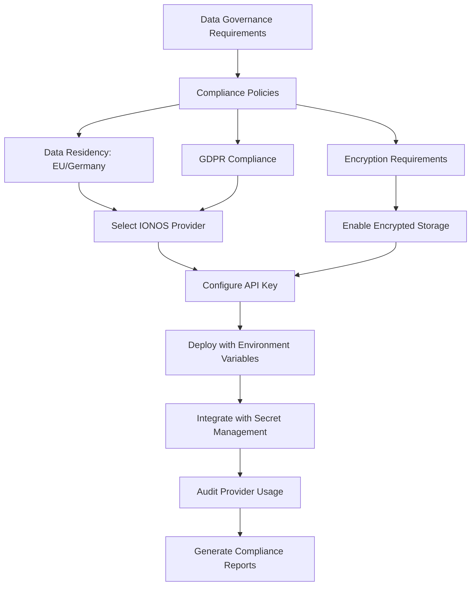

# Ionos AI Integration

<cite>
**Referenced Files in This Document**   
- [ionos.py](file://src/local_deep_research/llm/providers/implementations/ionos.py)
- [ionos_settings.json](file://src/local_deep_research/defaults/llm_providers/ionos_settings.json)
- [openai_base.py](file://src/local_deep_research/llm/providers/openai_base.py)
- [auto_discovery.py](file://src/local_deep_research/llm/providers/auto_discovery.py)
- [llm_registry.py](file://src/local_deep_research/llm/llm_registry.py)
- [cost_calculator.py](file://src/local_deep_research/metrics/pricing/cost_calculator.py)
- [pricing_cache.py](file://src/local_deep_research/metrics/pricing/pricing_cache.py)
- [thread_settings.py](file://src/local_deep_research/config/thread_settings.py)
- [env_settings.py](file://src/local_deep_research/settings/env_settings.py)
</cite>

## Table of Contents
1. [Introduction](#introduction)
2. [Core Components](#core-components)
3. [Architecture Overview](#architecture-overview)
4. [Configuration and Authentication](#configuration-and-authentication)
5. [Region Selection and Data Residency](#region-selection-and-data-residency)
6. [Enterprise Security Features](#enterprise-security-features)
7. [Performance Monitoring and Cost Optimization](#performance-monitoring-and-cost-optimization)
8. [Troubleshooting Enterprise Issues](#troubleshooting-enterprise-issues)
9. [Integration Patterns for Data Governance](#integration-patterns-for-data-governance)
10. [Conclusion](#conclusion)

## Introduction

Ionos AI Model Hub provides a GDPR-compliant artificial intelligence service with data processing located in Germany. This integration enables enterprise-grade managed AI services through an OpenAI-compatible API endpoint, offering secure authentication mechanisms, dedicated model hosting options, and SLA-backed service guarantees. The service is currently free until September 30, 2025, making it an attractive option for organizations requiring strict data governance and compliance requirements.

The Ionos provider implementation within the Local Deep Research framework follows a standardized pattern for OpenAI-compatible providers, ensuring consistent behavior across different LLM services while maintaining specific configurations for Ionos's unique requirements. This documentation details the implementation specifics, configuration options, and best practices for enterprise deployments.

**Section sources**
- [ionos.py](file://src/local_deep_research/llm/providers/implementations/ionos.py#L1-L70)
- [ionos_settings.json](file://src/local_deep_research/defaults/llm_providers/ionos_settings.json#L1-L16)

## Core Components

The Ionos AI integration consists of several core components that work together to provide a seamless enterprise-grade AI service. The primary component is the `IONOSProvider` class, which extends the `OpenAICompatibleProvider` base class to implement Ionos-specific functionality. This provider handles authentication, model selection, and API communication with the Ionos AI Model Hub.

Key metadata attributes include the provider name "IONOS AI Model Hub", API key setting identifier "llm.ionos.api_key", and the default base URL "https://openai.inference.de-txl.ionos.com/v1". The provider is configured with a default model "meta-llama/llama-3.2-3b-instruct" and includes metadata specifying its EU region, Germany country location, GDPR compliance status, and cloud-based deployment model.

The implementation includes factory functions for creating LLM instances and checking provider availability, which are registered with the global LLM registry. These components work together to provide a robust integration that supports enterprise requirements for security, compliance, and reliability.

**Diagram sources**
- [ionos.py](file://src/local_deep_research/llm/providers/implementations/ionos.py#L9-L70)
- [openai_base.py](file://src/local_deep_research/llm/providers/openai_base.py#L25-L340)
- [llm_registry.py](file://src/local_deep_research/llm/llm_registry.py#L14-L162)

**Section sources**
- [ionos.py](file://src/local_deep_research/llm/providers/implementations/ionos.py#L1-L70)
- [openai_base.py](file://src/local_deep_research/llm/providers/openai_base.py#L1-L340)
- [llm_registry.py](file://src/local_deep_research/llm/llm_registry.py#L1-L162)

## Architecture Overview

The Ionos AI integration architecture follows a modular design pattern that separates concerns between provider implementation, configuration management, and service orchestration. The architecture is built around the OpenAI-compatible provider interface, which allows for consistent integration of various LLM services while maintaining provider-specific configurations.

At the core of the architecture is the `IONOSProvider` class, which inherits from the `OpenAICompatibleProvider` base class. This inheritance pattern enables code reuse while allowing for Ionos-specific customizations. The provider interacts with the LLM registry to register itself and make its services available throughout the application.

Configuration is managed through a hierarchical settings system that supports both persistent storage and environment variable overrides. The auto-discovery system scans the providers directory to automatically detect and register available providers, including Ionos, ensuring that new providers can be added without requiring changes to the core application code.

**Diagram sources**
- [ionos.py](file://src/local_deep_research/llm/providers/implementations/ionos.py#L1-L70)
- [openai_base.py](file://src/local_deep_research/llm/providers/openai_base.py#L1-L340)
- [auto_discovery.py](file://src/local_deep_research/llm/providers/auto_discovery.py#L1-L270)
- [llm_registry.py](file://src/local_deep_research/llm/llm_registry.py#L1-L162)
- [cost_calculator.py](file://src/local_deep_research/metrics/pricing/cost_calculator.py#L1-L237)
- [pricing_cache.py](file://src/local_deep_research/metrics/pricing/pricing_cache.py#L1-L109)

## Configuration and Authentication

The Ionos provider implements secure authentication through API key management, with configuration options accessible through both the application interface and environment variables. The API key is stored in the settings system with the key "llm.ionos.api_key" and is treated as a password field in the user interface to ensure secure handling.

Authentication is required for both API access and model listing, as indicated by the `requires_auth_for_models()` method returning true. The provider checks for the presence of the API key in the settings context before creating LLM instances, raising a ValueError if the key is not configured. This ensures that unauthorized access attempts are caught early in the process.

Configuration follows the application's standard pattern where settings can be overridden via environment variables using the format "LDR_LLM_IONOS_API_KEY". This allows for flexible deployment scenarios, including containerized environments where secrets are typically managed through environment variables rather than persistent storage.

**Diagram sources**
- [ionos.py](file://src/local_deep_research/llm/providers/implementations/ionos.py#L1-L70)
- [ionos_settings.json](file://src/local_deep_research/defaults/llm_providers/ionos_settings.json#L1-L16)
- [thread_settings.py](file://src/local_deep_research/config/thread_settings.py#L1-L127)
- [env_settings.py](file://src/local_deep_research/settings/env_settings.py#L1-L348)

**Section sources**
- [ionos.py](file://src/local_deep_research/llm/providers/implementations/ionos.py#L1-L70)
- [ionos_settings.json](file://src/local_deep_research/defaults/llm_providers/ionos_settings.json#L1-L16)
- [thread_settings.py](file://src/local_deep_research/config/thread_settings.py#L1-L127)

## Region Selection and Data Residency

The Ionos provider is specifically designed to meet data residency compliance requirements through its Germany-based data processing infrastructure. The provider metadata explicitly identifies Germany as both the country and data location, with EU as the region and GDPR compliance as a key feature.

This configuration ensures that all data processed through the Ionos AI Model Hub remains within the European Union, satisfying strict data governance requirements for organizations operating in or serving EU markets. The provider's base URL "https://openai.inference.de-txl.ionos.com/v1" indicates the German (de) location with TXL being a common abbreviation for Berlin Tegel Airport, further confirming the German data center location.

The auto-discovery system leverages this metadata to present providers with their compliance status in the user interface, using visual indicators such as the "🔒 GDPR" badge for EU-based GDPR-compliant providers. This allows users to easily identify and select providers that meet their specific data residency requirements.

**Diagram sources**
- [ionos.py](file://src/local_deep_research/llm/providers/implementations/ionos.py#L1-L70)
- [auto_discovery.py](file://src/local_deep_research/llm/providers/auto_discovery.py#L1-L270)

**Section sources**
- [ionos.py](file://src/local_deep_research/llm/providers/implementations/ionos.py#L1-L70)
- [auto_discovery.py](file://src/local_deep_research/llm/providers/auto_discovery.py#L1-L270)

## Enterprise Security Features

The Ionos provider implementation incorporates several enterprise security features to ensure secure operation in production environments. The most significant feature is its GDPR compliance, which is built into the provider's metadata and influences how data is handled and processed.

The provider requires authentication for all API operations, including model listing, which prevents unauthorized access to service capabilities. API keys are stored securely in the application's encrypted database, with the settings system handling encryption and decryption transparently.

Network security is enhanced through the use of HTTPS for all communications with the Ionos API endpoint. The application's security framework includes utilities for validating URLs and preventing SSRF (Server-Side Request Forgery) attacks, ensuring that the provider cannot be used to access internal network resources.

The provider discovery system also contributes to security by only loading providers from trusted implementation files, preventing the execution of arbitrary code. The registration process is automated but follows a strict naming convention and class structure, reducing the risk of malicious provider implementations.

**Diagram sources**
- [ionos.py](file://src/local_deep_research/llm/providers/implementations/ionos.py#L1-L70)
- [security/ssrf_validator.py](file://src/local_deep_research/security/ssrf_validator.py)
- [security/url_validator.py](file://src/local_deep_research/security/url_validator.py)
- [database/encrypted_db.py](file://src/local_deep_research/database/encrypted_db.py)

**Section sources**
- [ionos.py](file://src/local_deep_research/llm/providers/implementations/ionos.py#L1-L70)
- [security/ssrf_validator.py](file://src/local_deep_research/security/ssrf_validator.py)
- [security/url_validator.py](file://src/local_deep_research/security/url_validator.py)

## Performance Monitoring and Cost Optimization

The Ionos integration includes comprehensive performance monitoring and cost optimization capabilities through the application's metrics system. The cost calculator component can estimate usage costs based on token consumption, although Ionos's current free service model means actual costs are zero until September 30, 2025.

The pricing system uses a caching mechanism to store pricing data and avoid repeated API calls. For providers without real-time pricing APIs, the system falls back to static pricing configurations. The cost calculator can compute costs synchronously for UI operations or asynchronously for batch processing, providing flexibility for different use cases.

Performance monitoring is integrated into the metrics dashboard, which tracks token usage, response times, and error rates for all LLM providers, including Ionos. This data helps organizations optimize their AI usage patterns and identify potential performance bottlenecks.

**Diagram sources**
- [cost_calculator.py](file://src/local_deep_research/metrics/pricing/cost_calculator.py#L1-L237)
- [pricing_cache.py](file://src/local_deep_research/metrics/pricing/pricing_cache.py#L1-L109)
- [metrics/search_tracker.py](file://src/local_deep_research/metrics/search_tracker.py)
- [token_counter.py](file://src/local_deep_research/metrics/token_counter.py)

**Section sources**
- [cost_calculator.py](file://src/local_deep_research/metrics/pricing/cost_calculator.py#L1-L237)
- [pricing_cache.py](file://src/local_deep_research/metrics/pricing/pricing_cache.py#L1-L109)

## Troubleshooting Enterprise Issues

Common enterprise issues with the Ionos integration typically involve configuration errors, network connectivity problems, or authentication failures. The most frequent issue is the absence of a configured API key, which results in a ValueError with a descriptive message indicating that the "llm.ionos.api_key" setting must be configured.

Network connectivity issues may occur if the German-based API endpoint is unreachable from the deployment location. The application's network utilities include functions to validate URLs and check for private IP addresses, which can help diagnose connectivity problems. Firewall rules must allow outbound connections to "openai.inference.de-txl.ionos.com" on HTTPS (port 443).

Authentication errors are typically related to incorrect API key values or expired keys. The provider implementation includes detailed logging to help diagnose these issues, with error messages that guide users toward the appropriate configuration fixes. Service-specific error codes from the Ionos API are propagated through the application, allowing for precise troubleshooting.

Model update procedures are handled automatically through the provider's model listing functionality, which fetches the current list of available models from the Ionos API. This ensures that users have access to the latest models without requiring manual configuration updates.

**Diagram sources**
- [ionos.py](file://src/local_deep_research/llm/providers/implementations/ionos.py#L1-L70)
- [openai_base.py](file://src/local_deep_research/llm/providers/openai_base.py#L1-L340)
- [network_utils.py](file://src/local_deep_research/security/network_utils.py)
- [error_reporter.py](file://src/local_deep_research/error_handling/error_reporter.py)

**Section sources**
- [ionos.py](file://src/local_deep_research/llm/providers/implementations/ionos.py#L1-L70)
- [openai_base.py](file://src/local_deep_research/llm/providers/openai_base.py#L1-L340)
- [network_utils.py](file://src/local_deep_research/security/network_utils.py)
- [error_reporter.py](file://src/local_deep_research/error_handling/error_reporter.py)

## Integration Patterns for Data Governance

The Ionos provider supports integration patterns for organizations with strict data governance and compliance requirements through its GDPR-compliant infrastructure and transparent data handling practices. The provider's metadata explicitly identifies its data processing location in Germany, allowing organizations to make informed decisions about data residency.

For highly regulated environments, the provider can be combined with the application's encrypted database storage to ensure end-to-end protection of sensitive information. The settings system supports environment variable overrides for API keys, enabling secret management through secure vaults or container orchestration platforms.

Organizations can implement approval workflows for provider selection, using the auto-discovery system's metadata to filter providers based on compliance requirements. The provider's open-source implementation allows for security audits and verification of data handling practices, increasing trust in the service.

The integration also supports multi-tenancy scenarios where different departments or business units may have varying compliance requirements. Administrators can configure provider availability based on user roles or organizational units, ensuring that only approved providers are accessible to specific user groups.

**Diagram sources**
- [ionos.py](file://src/local_deep_research/llm/providers/implementations/ionos.py#L1-L70)
- [auto_discovery.py](file://src/local_deep_research/llm/providers/auto_discovery.py#L1-L270)
- [encrypted_db.py](file://src/local_deep_research/database/encrypted_db.py)
- [env_settings.py](file://src/local_deep_research/settings/env_settings.py#L1-L348)

**Section sources**
- [ionos.py](file://src/local_deep_research/llm/providers/implementations/ionos.py#L1-L70)
- [auto_discovery.py](file://src/local_deep_research/llm/providers/auto_discovery.py#L1-L270)
- [encrypted_db.py](file://src/local_deep_research/database/encrypted_db.py)
- [env_settings.py](file://src/local_deep_research/settings/env_settings.py#L1-L348)

## Conclusion

The Ionos AI integration provides a robust enterprise-grade solution for organizations requiring GDPR-compliant AI services with data processing in Germany. The implementation follows best practices for secure authentication, configuration management, and service reliability, making it suitable for production deployments with strict data governance requirements.

Key advantages of the Ionos provider include its explicit data residency compliance, transparent pricing model (currently free until September 30, 2025), and seamless integration with the application's existing provider framework. The provider's metadata-driven approach enables automated discovery and selection based on compliance requirements, simplifying provider management for administrators.

For organizations prioritizing data sovereignty and regulatory compliance, the Ionos integration offers a compelling alternative to US-based AI services. The combination of German data processing, GDPR compliance, and enterprise security features makes it an ideal choice for European organizations or any entity with strict data governance policies.

Future enhancements could include real-time pricing integration, enhanced monitoring for service level agreements, and additional compliance certifications to further strengthen its position as a trusted enterprise AI provider.