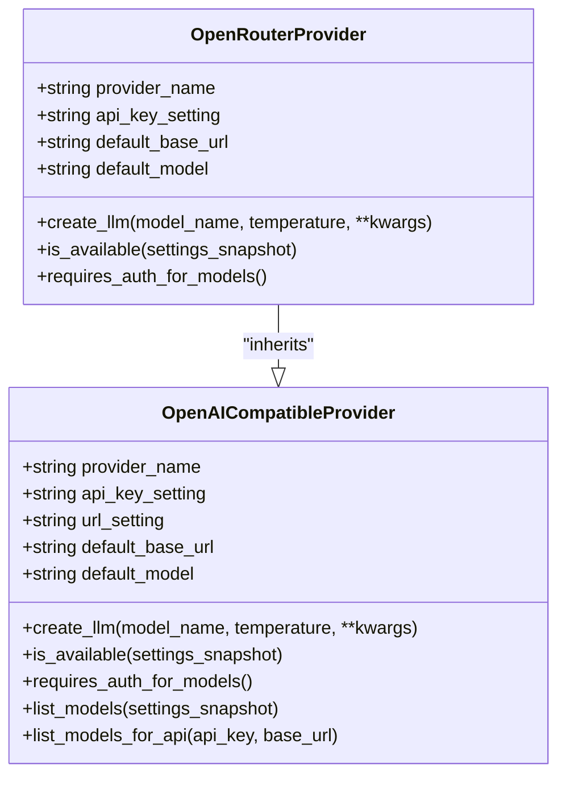
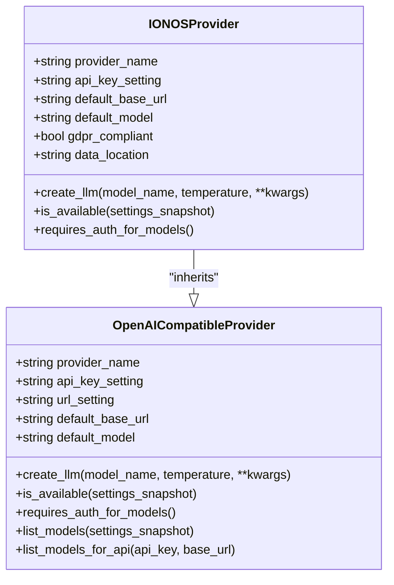
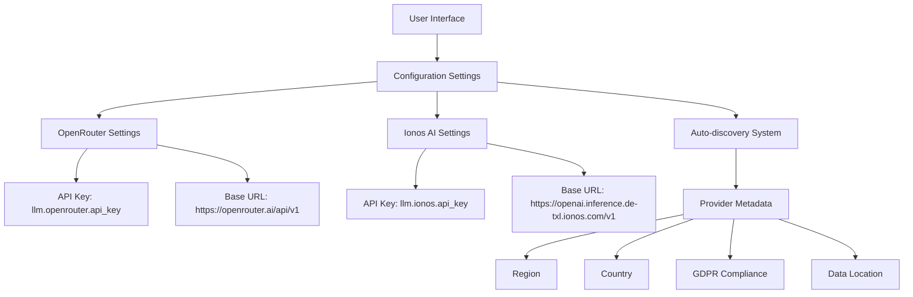
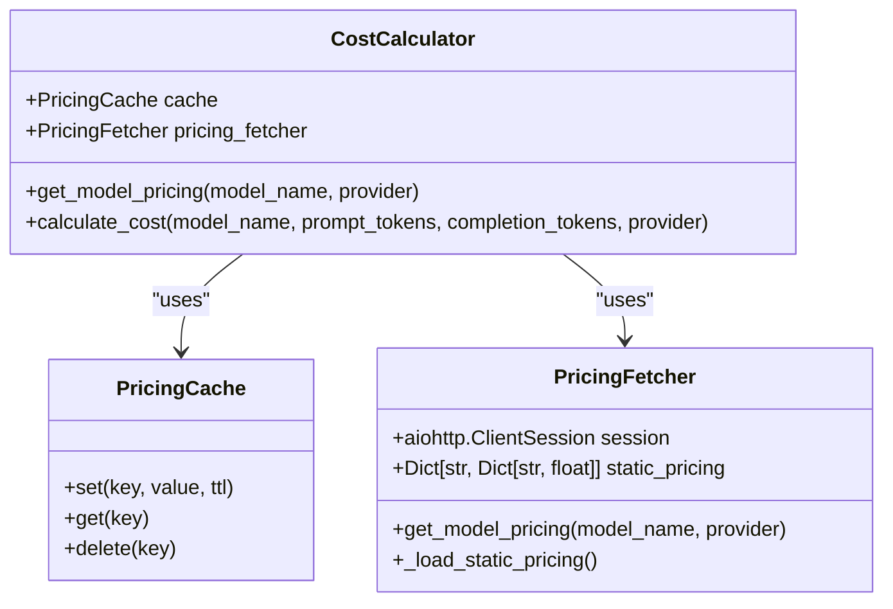
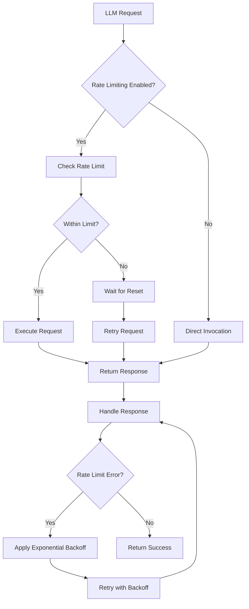

# Managed Service Integration

<cite>
**Referenced Files in This Document**   
- [openrouter.py](file://src/local_deep_research/llm/providers/implementations/openrouter.py)
- [ionos.py](file://src/local_deep_research/llm/providers/implementations/ionos.py)
- [openai_base.py](file://src/local_deep_research/llm/providers/openai_base.py)
- [openrouter_settings.json](file://src/local_deep_research/defaults/llm_providers/openrouter_settings.json)
- [ionos_settings.json](file://src/local_deep_research/defaults/llm_providers/ionos_settings.json)
- [auto_discovery.py](file://src/local_deep_research/llm/providers/auto_discovery.py)
- [cost_calculator.py](file://src/local_deep_research/metrics/pricing/cost_calculator.py)
- [pricing_fetcher.py](file://src/local_deep_research/metrics/pricing/pricing_fetcher.py)
- [wrapper.py](file://src/local_deep_research/web_search_engines/rate_limiting/llm/wrapper.py)
</cite>

## Table of Contents
1. [Introduction](#introduction)
2. [OpenRouter Provider Implementation](#openrouter-provider-implementation)
3. [Ionos AI Provider Implementation](#ionos-ai-provider-implementation)
4. [Configuration and API Key Management](#configuration-and-api-key-management)
5. [Model Availability and Selection](#model-availability-and-selection)
6. [Pricing and Cost Optimization](#pricing-and-cost-optimization)
7. [Rate Limiting and Error Handling](#rate-limiting-and-error-handling)
8. [Production Deployment Best Practices](#production-deployment-best-practices)
9. [Troubleshooting Common Issues](#troubleshooting-common-issues)

## Introduction
This document provides comprehensive guidance for integrating with managed LLM services, specifically focusing on OpenRouter and Ionos AI providers. These services offer distinct advantages in terms of model diversity, pricing models, and compliance requirements. The integration framework is built on an OpenAI-compatible API abstraction layer that allows seamless switching between providers while maintaining consistent functionality across the application.

**Section sources**
- [openai_base.py](file://src/local_deep_research/llm/providers/openai_base.py#L1-L340)

## OpenRouter Provider Implementation

The OpenRouter provider implementation enables access to a wide range of models from multiple providers through a unified API interface. This service acts as a routing layer that abstracts away the complexities of individual provider APIs, allowing users to access models from OpenAI, Anthropic, Google, and other providers through a single endpoint.

Key features of the OpenRouter integration include:
- Unified access to multiple LLM providers through a single API endpoint
- Community-maintained model catalog with automatic updates
- Free tier access to various models including "meta-llama/llama-3.2-3b-instruct:free"
- No authentication required for model listing operations
- Automatic routing based on model name specifications

The provider uses the OpenAI-compatible endpoint at `https://openrouter.ai/api/v1` and inherits core functionality from the `OpenAICompatibleProvider` base class. Model specification follows the format "provider/model-name" (e.g., "openai/gpt-4", "anthropic/claude-3-opus"), enabling explicit control over which underlying provider handles the request.

**Diagram sources**
- [openrouter.py](file://src/local_deep_research/llm/providers/implementations/openrouter.py#L1-L72)
- [openai_base.py](file://src/local_deep_research/llm/providers/openai_base.py#L1-L340)

**Section sources**
- [openrouter.py](file://src/local_deep_research/llm/providers/implementations/openrouter.py#L1-L72)

## Ionos AI Provider Implementation

The Ionos AI Model Hub provider offers enterprise-grade AI services with a strong focus on data privacy and compliance. This provider is specifically designed for organizations requiring GDPR-compliant data processing with data residency in Germany.

Key features of the Ionos AI integration include:
- GDPR-compliant data processing with data centers located in Germany
- Enterprise-grade security and compliance certifications
- Service availability with SLA guarantees
- Free usage until September 30, 2025
- Authentication required for all API operations including model listing

The provider uses the OpenAI-compatible endpoint at `https://openai.inference.de-txl.ionos.com/v1` and inherits the same base functionality as other OpenAI-compatible providers. The implementation includes metadata flags that identify the provider as GDPR-compliant and specify its geographical location, which can be used for compliance reporting and data governance purposes.

**Diagram sources**
- [ionos.py](file://src/local_deep_research/llm/providers/implementations/ionos.py#L1-L71)
- [openai_base.py](file://src/local_deep_research/llm/providers/openai_base.py#L1-L340)

**Section sources**
- [ionos.py](file://src/local_deep_research/llm/providers/implementations/ionos.py#L1-L71)

## Configuration and API Key Management

The configuration system for managed LLM services follows a consistent pattern across providers, with provider-specific settings stored in the application's configuration framework. API key management is handled through environment variables or the application's settings interface, with sensitive credentials stored securely.

For OpenRouter integration:
- API key setting: `llm.openrouter.api_key`
- UI element type: password field
- Value stored as encrypted credential
- No authentication required for model discovery

For Ionos AI integration:
- API key setting: `llm.ionos.api_key`
- UI element type: password field
- Value stored as encrypted credential
- Authentication required for all API operations

The auto-discovery system automatically detects available providers and populates UI dropdowns with provider options, including metadata such as region, country, and compliance status. This allows users to make informed decisions about which provider to use based on their specific requirements for data residency and compliance.

**Diagram sources**
- [openrouter_settings.json](file://src/local_deep_research/defaults/llm_providers/openrouter_settings.json#L1-L17)
- [ionos_settings.json](file://src/local_deep_research/defaults/llm_providers/ionos_settings.json#L1-L17)
- [auto_discovery.py](file://src/local_deep_research/llm/providers/auto_discovery.py#L1-L270)

**Section sources**
- [openrouter_settings.json](file://src/local_deep_research/defaults/llm_providers/openrouter_settings.json#L1-L17)
- [ionos_settings.json](file://src/local_deep_research/defaults/llm_providers/ionos_settings.json#L1-L17)
- [auto_discovery.py](file://src/local_deep_research/llm/providers/auto_discovery.py#L1-L270)

## Model Availability and Selection

The model availability system provides a unified interface for discovering and selecting models across different providers. Each provider implements its own model listing behavior based on its authentication requirements and API capabilities.

OpenRouter's model discovery does not require authentication, allowing users to browse the complete catalog of available models without providing API credentials. This facilitates exploration and comparison of different models before committing to a specific provider.

Ionos AI requires authentication for model listing operations, ensuring that only authorized users can discover available models. This security measure protects against unauthorized access to the service's model catalog.

The auto-discovery system in `auto_discovery.py` scans the implementations directory to detect available providers and extract their metadata, including:
- Provider key and display name
- Company information
- Geographical region and country
- GDPR compliance status
- Data processing location
- Cloud vs. local deployment indicator

This metadata is used to generate descriptive display names and filter options in the user interface, helping users make informed decisions about which provider to use based on their specific requirements.

**Section sources**
- [openrouter.py](file://src/local_deep_research/llm/providers/implementations/openrouter.py#L1-L72)
- [ionos.py](file://src/local_deep_research/llm/providers/implementations/ionos.py#L1-L71)
- [openai_base.py](file://src/local_deep_research/llm/providers/openai_base.py#L1-L340)
- [auto_discovery.py](file://src/local_deep_research/llm/providers/auto_discovery.py#L1-L270)

## Pricing and Cost Optimization

The pricing system provides real-time cost calculation and optimization capabilities for LLM operations. This framework enables users to make cost-aware decisions when selecting models and configuring their research workflows.

Key components of the pricing system include:

- **CostCalculator**: Calculates costs for individual LLM calls based on prompt and completion tokens
- **PricingCache**: Caches pricing data to reduce API calls and improve performance
- **PricingFetcher**: Retrieves real-time pricing data from provider APIs with fallback to static pricing

The system supports both real-time pricing data from provider APIs and static fallback pricing for models where real-time data is unavailable. The static pricing database includes rates for major models from OpenAI, Anthropic, and other providers, expressed in USD per 1,000 tokens.

For cost optimization, the system can:
- Compare pricing across different providers for the same model type
- Recommend lower-cost alternatives with similar capabilities
- Track cumulative costs across research sessions
- Provide cost estimates before executing expensive operations

**Diagram sources**
- [cost_calculator.py](file://src/local_deep_research/metrics/pricing/cost_calculator.py#L1-L84)
- [pricing_fetcher.py](file://src/local_deep_research/metrics/pricing/pricing_fetcher.py#L1-L40)
- [pricing_cache.py](file://src/local_deep_research/metrics/pricing/pricing_cache.py)

**Section sources**
- [cost_calculator.py](file://src/local_deep_research/metrics/pricing/cost_calculator.py#L1-L84)
- [pricing_fetcher.py](file://src/local_deep_research/metrics/pricing/pricing_fetcher.py#L1-L40)

## Rate Limiting and Error Handling

The rate limiting system provides protection against API throttling and ensures reliable operation when integrating with managed LLM services. While rate limiting is currently disabled by default, the framework is designed to handle rate limit errors when they occur.

Key aspects of the rate limiting implementation:

- Rate limiting is disabled by default for all providers
- Local providers (Ollama, LM Studio, etc.) are explicitly excluded from rate limiting
- The system can detect rate limit errors from provider APIs
- A retry mechanism with exponential backoff is available for handling transient errors

The `RateLimitedLLMWrapper` class provides a wrapper around LLM instances that can handle rate limiting when enabled. It generates composite rate limit keys based on provider, URL, and model to ensure appropriate throttling behavior. The wrapper also includes error detection capabilities that can identify rate limit errors from different providers and handle them appropriately.

For production deployments, it is recommended to implement external rate limiting at the application level rather than relying on the built-in framework, as this provides more granular control over throttling behavior and better integration with monitoring systems.

**Diagram sources**
- [wrapper.py](file://src/local_deep_research/web_search_engines/rate_limiting/llm/wrapper.py#L42-L207)

**Section sources**
- [wrapper.py](file://src/local_deep_research/web_search_engines/rate_limiting/llm/wrapper.py#L42-L207)

## Production Deployment Best Practices

When deploying applications that integrate with managed LLM services, consider the following best practices:

### Configuration Management
- Store API keys in environment variables or secure credential stores
- Use configuration files for non-sensitive settings
- Implement configuration validation to catch errors early
- Use different configuration profiles for development, staging, and production

### Failover Configurations
- Implement fallback providers for critical operations
- Configure default models that are reliably available
- Use health checks to monitor provider availability
- Implement circuit breaker patterns to prevent cascading failures

### Security Considerations
- For Ionos AI: Leverage GDPR compliance for data residency requirements
- For OpenRouter: Implement proper authentication for production use
- Use HTTPS for all API communications
- Validate and sanitize all inputs to prevent injection attacks
- Implement proper error handling to avoid leaking sensitive information

### Performance Optimization
- Cache model listings to reduce API calls
- Implement connection pooling for improved performance
- Use asynchronous operations for non-blocking API calls
- Monitor token usage to optimize cost and performance

### Monitoring and Logging
- Track API response times and error rates
- Log provider selection and model usage patterns
- Monitor cost metrics to identify optimization opportunities
- Implement alerting for rate limit errors and service outages

**Section sources**
- [openrouter.py](file://src/local_deep_research/llm/providers/implementations/openrouter.py#L1-L72)
- [ionos.py](file://src/local_deep_research/llm/providers/implementations/ionos.py#L1-L71)
- [openai_base.py](file://src/local_deep_research/llm/providers/openai_base.py#L1-L340)
- [wrapper.py](file://src/local_deep_research/web_search_engines/rate_limiting/llm/wrapper.py#L42-L207)

## Troubleshooting Common Issues

### Rate Limit Handling
When encountering rate limit errors:
1. Check the error message for specific rate limit details
2. Implement exponential backoff in your retry logic
3. Consider switching to a provider with higher rate limits
4. Optimize your application to reduce API call frequency
5. Contact the provider for rate limit increases if available

### Model Deprecation
When a model becomes unavailable:
1. Check the provider's model catalog for replacement models
2. Update your configuration to use an alternative model
3. Use the auto-discovery system to find available models
4. Test the new model to ensure compatibility with your application
5. Update documentation and notify users of the change

### Service-Specific Error Codes
Common error patterns and solutions:

| Error Type | Provider | Solution |
|-----------|---------|----------|
| Authentication Failed | Ionos AI | Verify API key and ensure it has proper permissions |
| Model Not Found | OpenRouter | Check model name format and provider prefix |
| Rate Limit Exceeded | Both | Implement retry logic with exponential backoff |
| Service Unavailable | Both | Check provider status page and try alternative providers |
| Invalid Request | Both | Validate input parameters and API endpoint |

For persistent issues, consult the provider's documentation and support resources. The application's logging system can provide additional insights into the nature of the problem, including detailed error messages and request/response data.

**Section sources**
- [openrouter.py](file://src/local_deep_research/llm/providers/implementations/openrouter.py#L1-L72)
- [ionos.py](file://src/local_deep_research/llm/providers/implementations/ionos.py#L1-L71)
- [openai_base.py](file://src/local_deep_research/llm/providers/openai_base.py#L1-L340)
- [wrapper.py](file://src/local_deep_research/web_search_engines/rate_limiting/llm/wrapper.py#L42-L207)