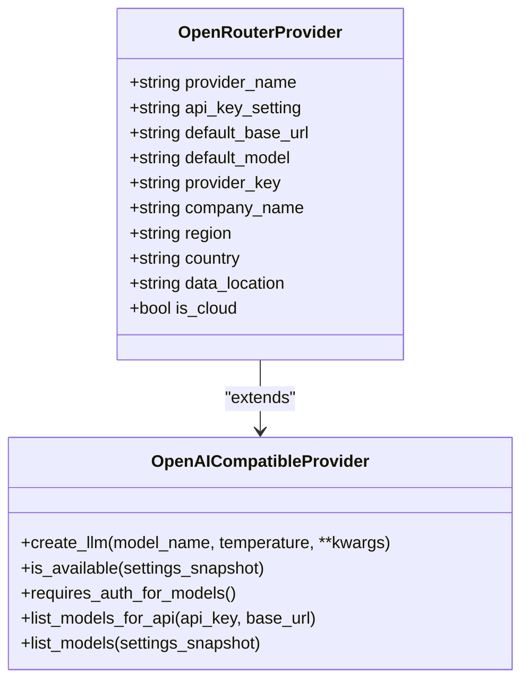
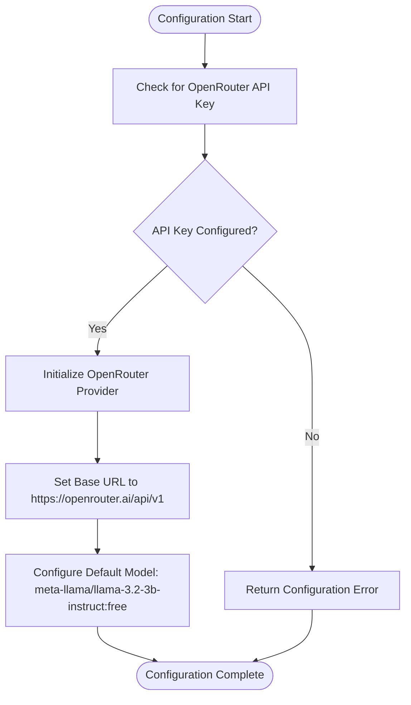
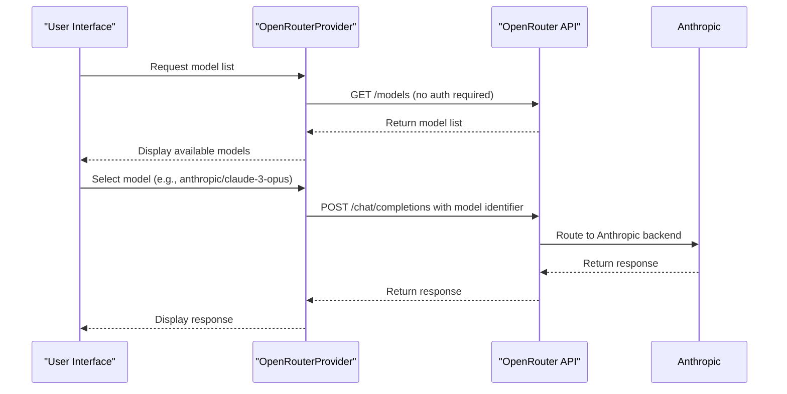
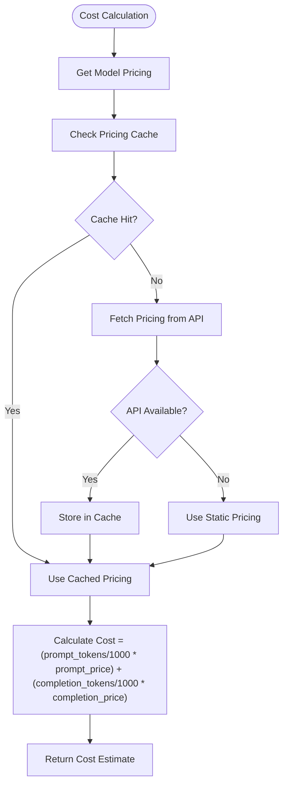

# OpenRouter Integration

<cite>
**Referenced Files in This Document**   
- [openrouter.py](file://src/local_deep_research/llm/providers/implementations/openrouter.py)
- [openrouter_settings.json](file://src/local_deep_research/defaults/llm_providers/openrouter_settings.json)
- [openai_base.py](file://src/local_deep_research/llm/providers/openai_base.py)
- [cost_calculator.py](file://src/local_deep_research/metrics/pricing/cost_calculator.py)
- [pricing_fetcher.py](file://src/local_deep_research/metrics/pricing/pricing_fetcher.py)
</cite>

## Table of Contents
1. [Introduction](#introduction)
2. [Core Architecture](#core-architecture)
3. [Authentication and Configuration](#authentication-and-configuration)
4. [Model Management](#model-management)
5. [Pricing and Cost Optimization](#pricing-and-cost-optimization)
6. [Implementation Details](#implementation-details)
7. [Usage Patterns](#usage-patterns)
8. [Troubleshooting Guide](#troubleshooting-guide)
9. [Security Considerations](#security-considerations)

## Introduction

OpenRouter integration provides a meta-provider solution that routes requests across multiple LLM providers through a unified OpenAI-compatible API. This implementation enables access to a wide marketplace of models from various vendors while maintaining a consistent interface. The system supports intelligent routing based on cost and performance metrics, with automatic fallback mechanisms for service reliability. OpenRouter's architecture allows seamless integration of new models without requiring code updates, making it a flexible solution for accessing diverse LLM capabilities.

**Section sources**
- [openrouter.py](file://src/local_deep_research/llm/providers/implementations/openrouter.py#L1-L72)

## Core Architecture

The OpenRouter provider is implemented as an OpenAI-compatible endpoint that inherits from the `OpenAICompatibleProvider` base class. This design enables the system to work with the standard OpenAI client while routing requests through OpenRouter's API gateway. The architecture follows a provider pattern where OpenRouter acts as a meta-provider that can access models from multiple vendors including OpenAI, Anthropic, Google, and others.

The implementation uses a factory pattern for LLM creation, with the `create_openrouter_llm` function serving as the entry point. The provider is registered with the global LLM registry, making it available throughout the application. The system automatically discovers and registers the OpenRouter provider during initialization through the auto-discovery mechanism.



**Diagram sources**
- [openrouter.py](file://src/local_deep_research/llm/providers/implementations/openrouter.py#L9-L72)
- [openai_base.py](file://src/local_deep_research/llm/providers/openai_base.py#L25-L340)

## Authentication and Configuration

Authentication for OpenRouter is managed through an API key configuration. The system requires the `llm.openrouter.api_key` setting to be configured, which is stored securely in the application settings. The API key is validated during provider initialization, and requests are authenticated using standard bearer token authentication.

Configuration is handled through the application's settings system, with the OpenRouter API key exposed as a configurable parameter in the UI. The key is stored with password-level security, ensuring it is not exposed in logs or client-side code. The provider checks for API key availability through the `is_openrouter_available` function, which validates that the key is properly configured in the settings snapshot.



**Diagram sources**
- [openrouter.py](file://src/local_deep_research/llm/providers/implementations/openrouter.py#L18-L22)
- [openrouter_settings.json](file://src/local_deep_research/defaults/llm_providers/openrouter_settings.json#L1-L17)

## Model Management

OpenRouter provides dynamic model listing capabilities that expose the extensive model marketplace available through the service. The implementation supports both authenticated and unauthenticated model listing, with the `requires_auth_for_models` method returning `False` to indicate that model discovery does not require authentication.

The system can access models from multiple providers through a unified interface, with model names following the pattern `provider/model-name` (e.g., "openai/gpt-4", "anthropic/claude-3-opus"). The default model is set to a free tier option (`meta-llama/llama-3.2-3b-instruct:free`), allowing users to start using the service without immediate costs.

Model selection is handled through the standard LLM configuration interface, with users able to select specific models from different vendors. The system automatically routes requests to the appropriate provider based on the model identifier in the request.



**Diagram sources**
- [openrouter.py](file://src/local_deep_research/llm/providers/implementations/openrouter.py#L32-L35)
- [openai_base.py](file://src/local_deep_research/llm/providers/openai_base.py#L250-L308)

## Pricing and Cost Optimization

The system implements comprehensive pricing awareness to enable cost-effective model selection. The cost calculation system integrates with OpenRouter's pricing model to provide accurate cost estimates for different models and usage patterns.

Pricing data is managed through a multi-layered approach:
1. Real-time pricing from provider APIs (where available)
2. Static pricing fallbacks for providers without public pricing APIs
3. Local model pricing (set to zero cost)

The cost calculator system evaluates both prompt and completion tokens separately, applying the appropriate pricing tiers for each. For OpenRouter, this enables intelligent routing based on cost-performance ratios, allowing users to optimize their usage patterns.



**Diagram sources**
- [cost_calculator.py](file://src/local_deep_research/metrics/pricing/cost_calculator.py#L32-L94)
- [pricing_fetcher.py](file://src/local_deep_research/metrics/pricing/pricing_fetcher.py#L117-L181)

## Implementation Details

The OpenRouter provider implementation leverages the OpenAI-compatible interface to provide seamless integration with the existing LLM ecosystem. The core functionality is built around the `OpenAICompatibleProvider` base class, which handles common concerns like API key management, endpoint configuration, and error handling.

Key implementation features include:
- Default configuration pointing to OpenRouter's API endpoint (`https://openrouter.ai/api/v1`)
- Support for all models available through OpenRouter without requiring code updates
- Free default model to enable immediate usage
- Metadata for provider identification and display in the UI
- Integration with the global LLM registry for discovery and usage

The provider is automatically registered during application startup through the `register_openrouter_provider` function, which adds it to the global LLM registry under the "openrouter" key. This enables the provider to be discovered and used throughout the application.

**Section sources**
- [openrouter.py](file://src/local_deep_research/llm/providers/implementations/openrouter.py#L1-L72)
- [openai_base.py](file://src/local_deep_research/llm/providers/openai_base.py#L1-L340)

## Usage Patterns

### Configuration Example

To configure OpenRouter integration, set the API key in the application settings:

```json
{
  "llm.openrouter.api_key": "your_openrouter_api_key_here"
}
```

### Model Selection

Select specific models from different vendors using the provider/model-name format:

- OpenAI models: `openai/gpt-4`, `openai/gpt-3.5-turbo`
- Anthropic models: `anthropic/claude-3-opus`, `anthropic/claude-3-haiku`
- Google models: `google/gemini-pro`, `google/gemini-1.5-pro`
- Meta models: `meta-llama/llama-3-70b-instruct`, `meta-llama/llama-3.2-3b-instruct:free`

### Rate Limit Management

The system handles rate limits automatically through OpenRouter's API. When configuring multiple providers, consider the following best practices:

1. Implement client-side rate limiting to avoid hitting provider limits
2. Use exponential backoff for retry logic
3. Monitor usage patterns to optimize model selection
4. Configure fallback models for high-demand scenarios

### Performance Optimization

For optimal performance when using cross-provider routing:

1. Cache frequently used models' pricing and capabilities
2. Implement connection pooling for API requests
3. Use asynchronous processing for model selection
4. Monitor latency patterns across different providers
5. Implement intelligent fallback mechanisms for service outages

**Section sources**
- [openrouter.py](file://src/local_deep_research/llm/providers/implementations/openrouter.py#L1-L72)
- [cost_calculator.py](file://src/local_deep_research/metrics/pricing/cost_calculator.py#L1-L237)

## Troubleshooting Guide

### Common Issues

**Model Deprecation**
When a model is deprecated by a provider:
1. Check the OpenRouter model list for updated model identifiers
2. Update configuration to use the replacement model
3. Verify pricing changes for the new model

**Service Outages**
If a specific provider experiences an outage:
1. The system will automatically route to available models
2. Check the provider status page for outage information
3. Temporarily configure fallback models in settings
4. Monitor for service restoration

**Authentication Errors**
If experiencing authentication issues:
1. Verify the API key is correctly configured in settings
2. Check for typos or extra whitespace in the key
3. Regenerate the API key if necessary
4. Ensure the key has the required permissions

**Rate Limit Exceeded**
When encountering rate limits:
1. Implement exponential backoff in retry logic
2. Check current usage against provider limits
3. Consider upgrading plan for higher limits
4. Distribute requests across multiple API keys if available

**Section sources**
- [openrouter.py](file://src/local_deep_research/llm/providers/implementations/openrouter.py#L56-L65)
- [openai_base.py](file://src/local_deep_research/llm/providers/openai_base.py#L299-L308)

## Security Considerations

### API Key Management

API keys should be handled with the highest security standards:
- Store keys in secure configuration storage
- Never expose keys in client-side code or logs
- Use environment variables for production deployments
- Implement key rotation policies
- Restrict key permissions to minimum required scope

### Data Privacy

When using OpenRouter's multi-provider routing:
- Understand data handling practices of each underlying provider
- Ensure compliance with relevant data protection regulations
- Implement data minimization practices
- Use encryption for sensitive data in transit and at rest
- Regularly audit data flow and storage practices

### Best Practices for Production

For production deployments leveraging OpenRouter's marketplace:
1. Implement comprehensive monitoring of API usage and costs
2. Set up alerts for unusual usage patterns or cost spikes
3. Use dedicated API keys for different environments (development, staging, production)
4. Implement circuit breakers for unreliable providers
5. Regularly review and optimize model selection based on performance and cost
6. Maintain up-to-date documentation of all configured models and providers
7. Implement automated testing for critical provider integrations

**Section sources**
- [openrouter.py](file://src/local_deep_research/llm/providers/implementations/openrouter.py#L1-L72)
- [openrouter_settings.json](file://src/local_deep_research/defaults/llm_providers/openrouter_settings.json#L1-L17)