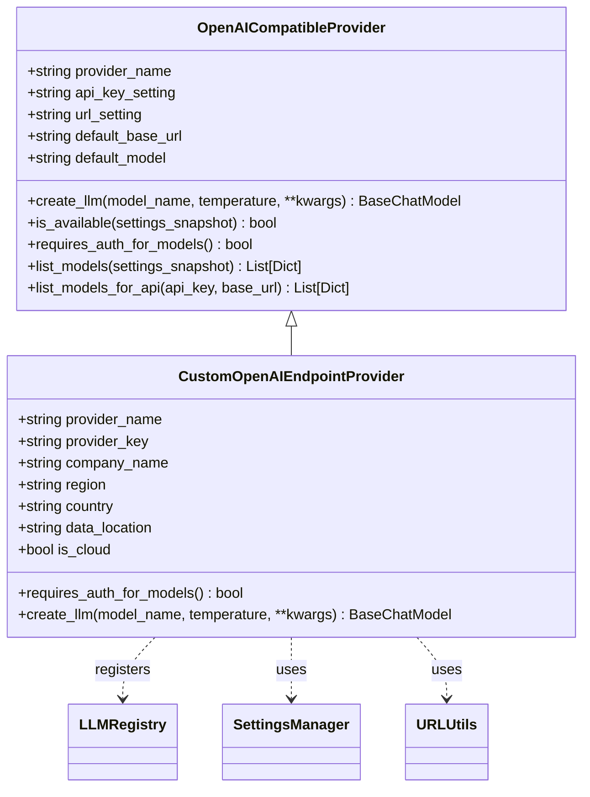
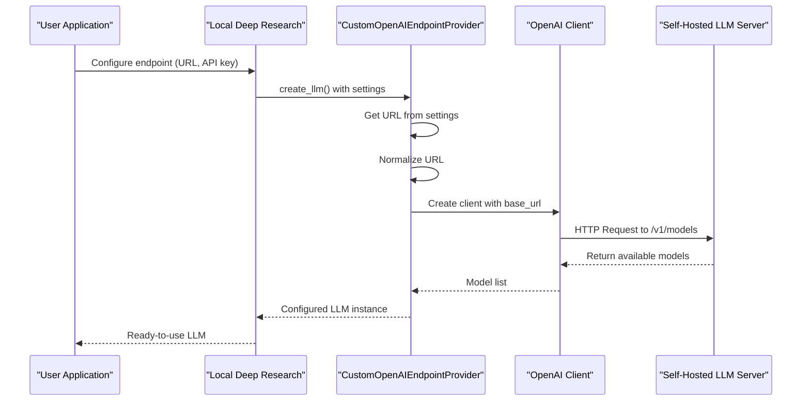
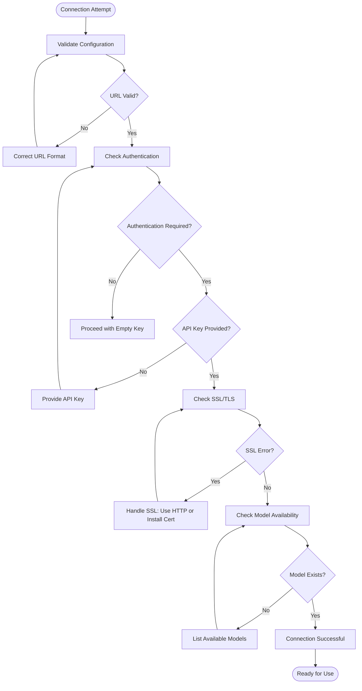

# OpenAI-Compatible Endpoints

<cite>
**Referenced Files in This Document**   
- [custom_openai_endpoint.py](file://src/local_deep_research/llm/providers/implementations/custom_openai_endpoint.py)
- [openai_base.py](file://src/local_deep_research/llm/providers/openai_base.py)
- [thread_settings.py](file://src/local_deep_research/config/thread_settings.py)
- [url_utils.py](file://src/local_deep_research/utilities/url_utils.py)
- [network_utils.py](file://src/local_deep_research/security/network_utils.py)
- [troubleshooting-openai-api-key.md](file://docs/troubleshooting-openai-api-key.md)
- [basic_custom_llm.py](file://examples/llm_integration/basic_custom_llm.py)
- [advanced_custom_llm.py](file://examples/llm_integration/advanced_custom_llm.py)
- [custom_llm_retriever_example.py](file://examples/api_usage/programmatic/custom_llm_retriever_example.py)
</cite>

## Table of Contents
1. [Introduction](#introduction)
2. [CustomOpenAIAPI Implementation](#customopenaiapi-implementation)
3. [Configuration Parameters](#configuration-parameters)
4. [Connecting to Self-Hosted Solutions](#connecting-to-self-hosted-solutions)
5. [Deployment Scenarios](#deployment-scenarios)
6. [Security Considerations](#security-considerations)
7. [Troubleshooting Connectivity Issues](#troubleshooting-connectivity-issues)
8. [Advanced Configurations](#advanced-configurations)
9. [Examples and Usage Patterns](#examples-and-usage-patterns)

## Introduction

The OpenAI-compatible endpoints integration enables connection to various LLM services that implement the OpenAI API specification. This includes both cloud-based services and self-hosted solutions like LocalAI, vLLM, and Text Generation Inference servers. The implementation provides a flexible framework for configuring custom base URLs, API keys, and request headers, allowing users to connect to a wide range of deployment scenarios from local models to enterprise-grade private deployments.

The system is designed to support various OpenAI-compatible providers through a modular architecture that separates the core functionality from provider-specific implementations. This allows for easy extension and integration of new providers while maintaining a consistent interface for end users.

**Section sources**
- [custom_openai_endpoint.py](file://src/local_deep_research/llm/providers/implementations/custom_openai_endpoint.py#L1-L112)
- [openai_base.py](file://src/local_deep_research/llm/providers/openai_base.py#L1-L340)

## CustomOpenAIAPI Implementation

The CustomOpenAIAPI implementation is built around the `CustomOpenAIEndpointProvider` class, which extends the `OpenAICompatibleProvider` base class. This architecture enables the system to support any service that offers an OpenAI-compatible API endpoint.

The `CustomOpenAIEndpointProvider` class provides the following key features:

- **Dynamic URL Configuration**: The provider allows users to specify a custom URL through settings, which is then used to configure the base URL for API requests.
- **Flexible Authentication**: Supports both authenticated and unauthenticated endpoints, with the ability to handle empty API keys for self-hosted solutions.
- **Model Discovery**: Implements a robust model listing mechanism that can discover available models from the configured endpoint.
- **Backward Compatibility**: Maintains compatibility with existing code through standalone functions that wrap the class-based implementation.

The implementation uses the LangChain `ChatOpenAI` class as the underlying LLM interface, which is configured with the appropriate base URL, API key, and other parameters based on the user's configuration.



**Diagram sources**
- [custom_openai_endpoint.py](file://src/local_deep_research/llm/providers/implementations/custom_openai_endpoint.py#L25-L112)
- [openai_base.py](file://src/local_deep_research/llm/providers/openai_base.py#L25-L340)

**Section sources**
- [custom_openai_endpoint.py](file://src/local_deep_research/llm/providers/implementations/custom_openai_endpoint.py#L25-L112)
- [openai_base.py](file://src/local_deep_research/llm/providers/openai_base.py#L25-L340)

## Configuration Parameters

The system supports a comprehensive set of configuration parameters that allow fine-tuning of the connection to OpenAI-compatible endpoints. These parameters are organized into several categories:

### Connection Configuration
- **base_url**: The base URL for the API endpoint (e.g., "http://localhost:8000/v1" for local deployments)
- **api_key**: Authentication token for the API (optional for some self-hosted solutions)
- **timeout**: Request timeout in seconds (default: library defaults)
- **max_retries**: Maximum number of retry attempts for failed requests

### LLM Configuration
- **model_name**: The specific model to use (e.g., "gpt-3.5-turbo", "llama3")
- **temperature**: Controls randomness in model responses (0.0-1.0)
- **max_tokens**: Maximum number of tokens in the response
- **streaming**: Enable or disable streaming responses

### Advanced Configuration
- **request_timeout**: Timeout for individual requests
- **max_retries**: Number of retry attempts for failed requests
- **organization**: Organization ID for multi-tenant setups
- **custom_headers**: Additional HTTP headers to include in requests

These parameters can be configured through multiple methods:
1. **Settings Interface**: Web-based configuration through the application settings
2. **Environment Variables**: For programmatic configuration
3. **Programmatic API**: Direct configuration through code
4. **Configuration Files**: JSON or YAML configuration files

The system uses a hierarchical configuration approach where settings are resolved in the following order:
1. Direct parameters passed to the LLM creation function
2. Settings from the user's configuration snapshot
3. Environment variables
4. Default values defined in the provider class

**Section sources**
- [custom_openai_endpoint.py](file://src/local_deep_research/llm/providers/implementations/custom_openai_endpoint.py#L32-L74)
- [openai_base.py](file://src/local_deep_research/llm/providers/openai_base.py#L33-L138)
- [thread_settings.py](file://src/local_deep_research/config/thread_settings.py#L35-L127)

## Connecting to Self-Hosted Solutions

The system provides robust support for connecting to popular self-hosted LLM solutions that implement the OpenAI API specification. This includes LocalAI, vLLM, and Text Generation Inference servers.

### LocalAI Integration

LocalAI is supported through the custom OpenAI endpoint configuration. To connect to a LocalAI instance:

1. Ensure LocalAI is running and exposing the OpenAI-compatible API
2. Configure the base URL to point to your LocalAI instance (e.g., "http://localhost:8080/v1")
3. Set the API key if authentication is enabled in LocalAI
4. The system will automatically discover available models from the LocalAI instance

LocalAI typically does not require authentication, so the API key can be left empty or set to a dummy value.

### vLLM Integration

vLLM integration follows a similar pattern:

1. Start vLLM with the OpenAI API server enabled
2. Configure the base URL to point to the vLLM server (e.g., "http://localhost:8000/v1")
3. Set the API key if authentication is configured
4. The system will list available models from the vLLM server

vLLM supports advanced features like tensor parallelism and continuous batching, which are transparently available through the OpenAI-compatible API.

### Text Generation Inference Integration

For Text Generation Inference (TGI) servers:

1. Deploy the TGI server with the OpenAI-compatible API enabled
2. Configure the base URL to point to the TGI server
3. Set authentication credentials if required
4. The system will discover available models and their capabilities

TGI servers often run on GPU instances and can handle multiple concurrent requests efficiently.

The system automatically handles URL normalization for self-hosted solutions, ensuring that proper schemes (http/https) are applied based on whether the target is a private IP address or external host.



**Diagram sources**
- [custom_openai_endpoint.py](file://src/local_deep_research/llm/providers/implementations/custom_openai_endpoint.py#L57-L73)
- [url_utils.py](file://src/local_deep_research/utilities/url_utils.py#L9-L63)
- [network_utils.py](file://src/local_deep_research/security/network_utils.py#L10-L53)

**Section sources**
- [custom_openai_endpoint.py](file://src/local_deep_research/llm/providers/implementations/custom_openai_endpoint.py#L57-L73)
- [url_utils.py](file://src/local_deep_research/utilities/url_utils.py#L9-L63)
- [network_utils.py](file://src/local_deep_research/security/network_utils.py#L10-L53)

## Deployment Scenarios

The system supports various deployment scenarios for connecting to OpenAI-compatible endpoints, ranging from local development to enterprise-grade private deployments.

### Local Model Deployment

For local model deployments, the system can connect to LLM servers running on the same machine or local network. This is ideal for development, testing, or privacy-sensitive applications.

Key characteristics:
- Base URL typically points to localhost or private IP addresses
- No API key required for many self-hosted solutions
- Lower latency due to local network proximity
- Full control over model selection and configuration

Example configuration:
```python
settings_manager.set_setting("llm.provider", "OPENAI_ENDPOINT")
settings_manager.set_setting("llm.openai_endpoint.url", "http://localhost:8000/v1")
settings_manager.set_setting("llm.openai_endpoint.api_key", "")  # Often empty for local
```

### Cloud-Hosted Inference Services

For cloud-hosted inference services, the system can connect to managed LLM hosting platforms that provide OpenAI-compatible APIs.

Key characteristics:
- Base URL points to cloud provider endpoints
- API key authentication required
- Scalable infrastructure with high availability
- Pay-per-use pricing models

Example providers:
- RunPod
- Vast.ai
- Banana.dev
- Hugging Face Inference Endpoints

### Private Enterprise Deployments

For enterprise deployments, the system supports connecting to private LLM instances hosted within an organization's infrastructure.

Key characteristics:
- Base URL points to internal network endpoints
- May require corporate authentication
- Enhanced security and compliance
- Integration with enterprise identity providers

Configuration considerations:
- Proper SSL/TLS certificate handling
- Proxy server configuration if required
- Network security policies
- Audit logging and monitoring

The system automatically detects private IP addresses and uses HTTP instead of HTTPS for local connections, while using HTTPS for external hosts to ensure secure communication.

**Section sources**
- [custom_openai_endpoint.py](file://src/local_deep_research/llm/providers/implementations/custom_openai_endpoint.py#L61-L71)
- [url_utils.py](file://src/local_deep_research/utilities/url_utils.py#L59-L62)
- [network_utils.py](file://src/local_deep_research/security/network_utils.py#L37-L53)

## Security Considerations

When exposing internal endpoints or connecting to external services, several security considerations must be addressed to ensure the integrity and confidentiality of the system.

### Authentication and Authorization

The system supports multiple authentication methods:
- **API Keys**: Standard bearer token authentication
- **Empty Keys**: Support for endpoints that don't require authentication
- **Environment Variables**: Secure storage of credentials
- **Encrypted Storage**: Database encryption for sensitive settings

Best practices:
- Never commit API keys to version control
- Use environment variables in production environments
- Rotate keys regularly
- Implement usage limits where possible

### Network Security

The system includes several network security features:
- **Private IP Detection**: Automatically identifies private IP addresses and local hosts
- **URL Normalization**: Ensures proper URL formatting and scheme selection
- **SSRF Protection**: Validates and sanitizes URLs to prevent server-side request forgery
- **Certificate Validation**: Enforces SSL/TLS certificate validation for external connections

The `is_private_ip` function classifies hosts as private based on:
- RFC 1918 private IPv4 ranges (10.0.0.0/8, 172.16.0.0/12, 192.168.0.0/16)
- IPv6 private addresses (fc00::/7, fe80::/10)
- Loopback addresses (127.0.0.1, ::1)
- mDNS .local domains

### Data Privacy

For privacy-sensitive applications:
- Local models keep data within the organization's infrastructure
- Encrypted database storage for all user data
- Optional anonymization of user identifiers
- Compliance with data protection regulations

The system uses encrypted databases with SQLCipher for storing sensitive information, ensuring that data remains protected even if the database files are compromised.

**Section sources**
- [custom_openai_endpoint.py](file://src/local_deep_research/llm/providers/implementations/custom_openai_endpoint.py#L47-L54)
- [url_utils.py](file://src/local_deep_research/utilities/url_utils.py#L59-L62)
- [network_utils.py](file://src/local_deep_research/security/network_utils.py#L10-L53)
- [troubleshooting-openai-api-key.md](file://docs/troubleshooting-openai-api-key.md#L246-L249)

## Troubleshooting Connectivity Issues

When encountering connectivity issues with OpenAI-compatible endpoints, several common problems may arise. This section provides guidance on diagnosing and resolving these issues.

### SSL/TLS Errors

SSL errors typically occur when connecting to self-hosted solutions with self-signed certificates or when there are certificate validation issues.

Common symptoms:
- "SSL: CERTIFICATE_VERIFY_FAILED" errors
- Connection timeouts
- Handshake failures

Solutions:
1. **For Development**: Configure the system to skip SSL verification (not recommended for production)
2. **For Production**: Install proper SSL certificates on the server
3. **Corporate Environments**: Add corporate CA certificates to the trust store
4. **Local Testing**: Use HTTP instead of HTTPS for local connections

The system automatically uses HTTP for private IP addresses and localhost, reducing SSL issues in local development environments.

### Authentication Failures

Authentication failures occur when the API key is incorrect, missing, or not properly configured.

Common symptoms:
- 401 Unauthorized errors
- "Invalid API key" messages
- Empty model lists

Diagnosis steps:
1. Verify the API key format and length
2. Check if authentication is required by the endpoint
3. Test the endpoint directly using curl or similar tools
4. Verify the configuration in the settings interface

For endpoints that don't require authentication (like many self-hosted solutions), ensure the API key is either empty or set to a dummy value.

### Model Compatibility Problems

Model compatibility issues arise when the requested model is not available on the target endpoint.

Common symptoms:
- "Model not found" errors
- 404 Not Found responses
- Empty model lists

Solutions:
1. **Verify Available Models**: Use the model listing functionality to discover available models
2. **Check Model Names**: Ensure exact model name matching (case-sensitive)
3. **Use Fallback Models**: Configure fallback models for graceful degradation
4. **Update Configuration**: Adjust the model name in settings to match available models

The system includes a fallback mechanism that provides default model options when the API call fails, ensuring that the application remains functional even when model discovery fails.



**Diagram sources**
- [custom_openai_endpoint.py](file://src/local_deep_research/llm/providers/implementations/custom_openai_endpoint.py#L279-L288)
- [openai_base.py](file://src/local_deep_research/llm/providers/openai_base.py#L274-L288)
- [troubleshooting-openai-api-key.md](file://docs/troubleshooting-openai-api-key.md#L57-L81)

**Section sources**
- [custom_openai_endpoint.py](file://src/local_deep_research/llm/providers/implementations/custom_openai_endpoint.py#L279-L288)
- [openai_base.py](file://src/local_deep_research/llm/providers/openai_base.py#L274-L288)
- [troubleshooting-openai-api-key.md](file://docs/troubleshooting-openai-api-key.md#L57-L81)

## Advanced Configurations

The system supports several advanced configuration options for specialized use cases, including load balancing and custom model routing.

### Load Balancing Across Multiple Replicas

For high-availability deployments, the system can be configured to distribute requests across multiple replicas of the same model.

Implementation approaches:
1. **Round-Robin Distribution**: Rotate requests across multiple endpoints
2. **Health-Based Routing**: Route requests to healthy instances only
3. **Weighted Distribution**: Distribute requests based on instance capacity

Example configuration:
```python
# Configure multiple endpoints for load balancing
endpoints = [
    "http://replica1:8000/v1",
    "http://replica2:8000/v1", 
    "http://replica3:8000/v1"
]

# Cycle through endpoints for each request
current_endpoint = endpoints[request_count % len(endpoints)]
settings_manager.set_setting("llm.openai_endpoint.url", current_endpoint)
```

### Custom Model Routing

The system supports custom model routing based on various criteria such as model capabilities, cost, or performance characteristics.

Routing strategies:
- **Capability-Based**: Route requests to models with specific capabilities
- **Cost-Optimized**: Route to the most cost-effective model
- **Performance-Based**: Route to the fastest available model
- **Specialized Models**: Route specific query types to specialized models

Example implementation:
```python
def route_model(query):
    """Route queries to appropriate models based on content."""
    if "code" in query.lower() or "programming" in query.lower():
        return "code-llama"  # Route coding queries to code-specialized model
    elif len(query) < 50:
        return "fast-model"  # Route short queries to faster models
    else:
        return "general-model"  # Default to general-purpose model
```

### Retry Policies and Circuit Breaking

The system supports configurable retry policies and circuit breaking to handle transient failures.

Configuration options:
- **Exponential Backoff**: Increase delay between retries
- **Maximum Retry Attempts**: Limit the number of retry attempts
- **Circuit Breaker**: Temporarily stop requests after repeated failures
- **Timeout Configuration**: Set request and connection timeouts

These advanced configurations can be particularly useful in production environments where reliability and fault tolerance are critical.

**Section sources**
- [advanced_custom_llm.py](file://examples/llm_integration/advanced_custom_llm.py#L44-L61)
- [custom_openai_endpoint.py](file://src/local_deep_research/llm/providers/implementations/custom_openai_endpoint.py#L118-L137)
- [openai_base.py](file://src/local_deep_research/llm/providers/openai_base.py#L117-L126)

## Examples and Usage Patterns

This section provides practical examples of integrating with OpenAI-compatible endpoints in various scenarios.

### Basic Custom LLM Integration

The simplest integration pattern uses a custom LLM with minimal configuration:

```python
from local_deep_research.api import quick_summary

# Configure custom OpenAI endpoint
settings_manager.set_setting("llm.provider", "OPENAI_ENDPOINT")
settings_manager.set_setting("llm.openai_endpoint.url", "http://localhost:8000/v1")

# Run research with custom endpoint
result = quick_summary(
    query="What are the benefits of renewable energy?",
    settings_snapshot=settings_snapshot,
    provider="OPENAI_ENDPOINT",
    model_name="llama3"
)
```

### Advanced Custom LLM with Retry Logic

For production environments, implementing retry logic improves reliability:

```python
class RetryLLM(BaseChatModel):
    """LLM wrapper with retry logic."""
    
    def __init__(self, base_llm, max_retries=3, retry_delay=1.0):
        self.base_llm = base_llm
        self.max_retries = max_retries
        self.retry_delay = retry_delay
    
    def _generate(self, messages, stop=None, run_manager=None, **kwargs):
        """Generate with retry logic."""
        last_error = None
        
        for attempt in range(self.max_retries):
            try:
                return self.base_llm._generate(
                    messages, stop, run_manager, **kwargs
                )
            except Exception as e:
                last_error = e
                if attempt < self.max_retries - 1:
                    time.sleep(self.retry_delay)
                    self.retry_delay *= 2  # Exponential backoff
        
        raise last_error
```

### Programmatic Integration with Custom Retriever

Combining a custom LLM with a custom retriever enables sophisticated research workflows:

```python
# Create custom retriever with vector store
retriever = CustomRetriever()
search_engine = CustomSearchEngine(retriever)

# Initialize search system with custom components
search_system = AdvancedSearchSystem(
    llm=custom_llm,
    search=search_engine,
    settings_snapshot=settings,
    programmatic_mode=True,
)

# Run research query
result = search_system.analyze_topic("How do quantum computers work?")
```

These examples demonstrate the flexibility of the system in accommodating various integration patterns, from simple endpoint configuration to complex custom implementations.

**Section sources**
- [basic_custom_llm.py](file://examples/llm_integration/basic_custom_llm.py#L17-L118)
- [advanced_custom_llm.py](file://examples/llm_integration/advanced_custom_llm.py#L17-L85)
- [custom_llm_retriever_example.py](file://examples/api_usage/programmatic/custom_llm_retriever_example.py#L27-L208)