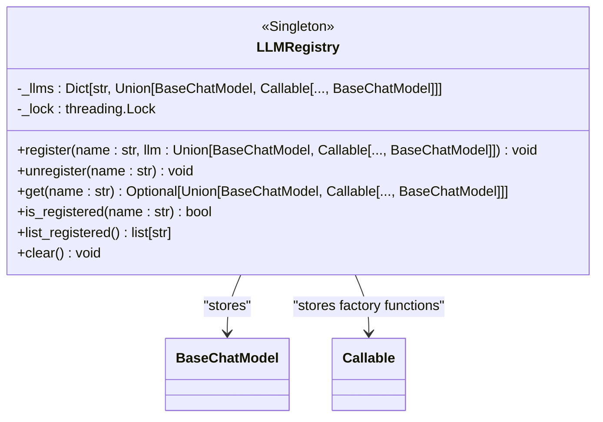
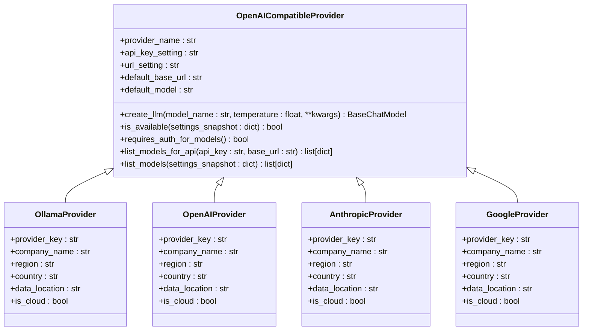
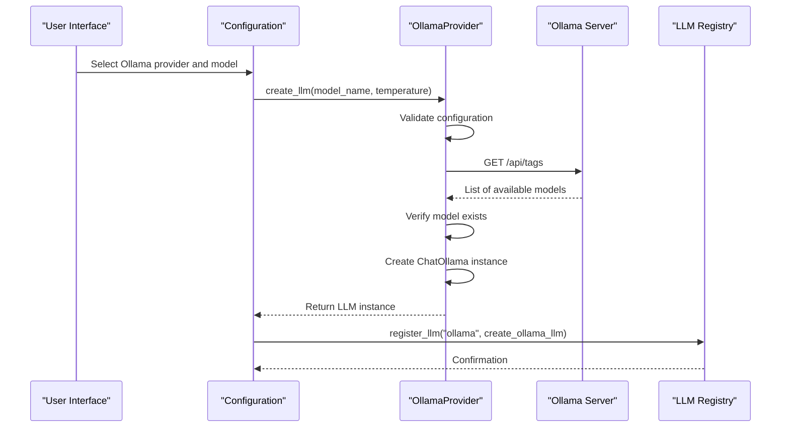
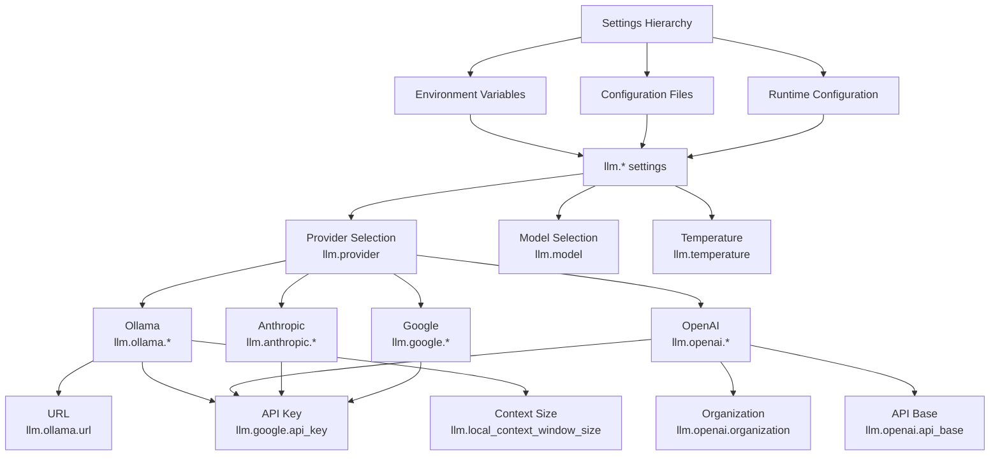
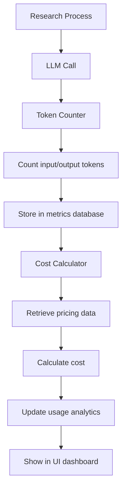
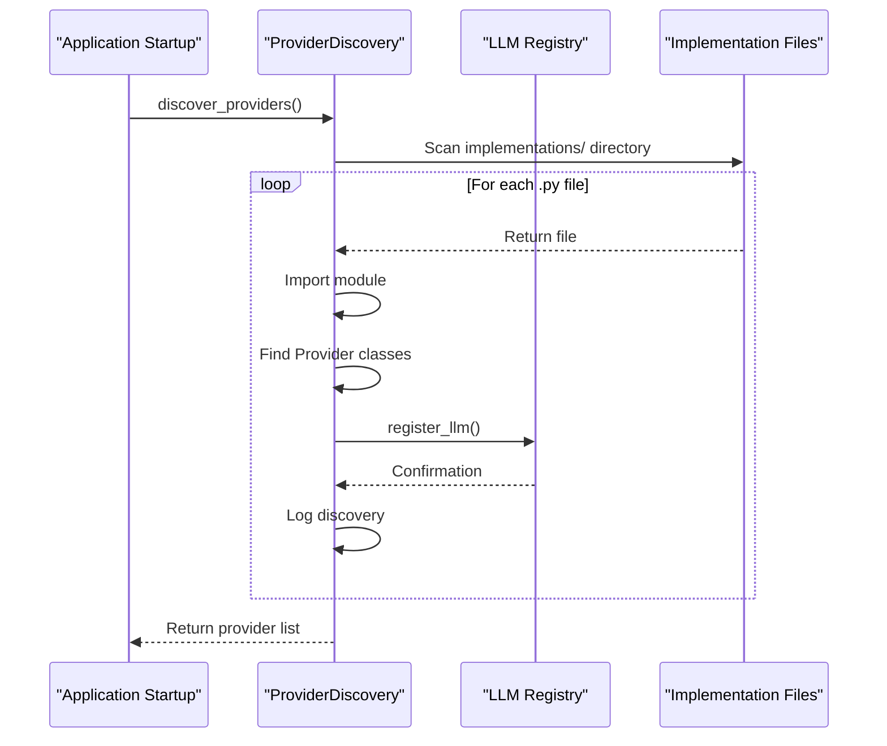

# LLM Integration

<cite>
**Referenced Files in This Document**   
- [llm_registry.py](file://src/local_deep_research/llm/llm_registry.py)
- [openai_base.py](file://src/local_deep_research/llm/providers/openai_base.py)
- [ollama.py](file://src/local_deep_research/llm/providers/implementations/ollama.py)
- [openai.py](file://src/local_deep_research/llm/providers/implementations/openai.py)
- [anthropic.py](file://src/local_deep_research/llm/providers/implementations/anthropic.py)
- [google.py](file://src/local_deep_research/llm/providers/implementations/google.py)
- [auto_discovery.py](file://src/local_deep_research/llm/providers/auto_discovery.py)
- [llm_config.py](file://src/local_deep_research/config/llm_config.py)
- [README.md](file://examples/llm_integration/README.md)
</cite>

## Table of Contents
1. [Introduction](#introduction)
2. [Registry Pattern Implementation](#registry-pattern-implementation)
3. [Base Provider Interface](#base-provider-interface)
4. [Provider-Specific Implementations](#provider-specific-implementations)
5. [Configuration and Authentication](#configuration-and-authentication)
6. [Local vs Cloud Setup](#local-vs-cloud-setup)
7. [Performance and Cost Management](#performance-and-cost-management)
8. [Auto-Discovery and Fallback Mechanisms](#auto-discovery-and-fallback-mechanisms)
9. [Provider-Specific Quirks and Limitations](#provider-specific-quirks-and-limitations)

## Introduction

The LLM integration system in Local Deep Research provides a flexible architecture for working with both local models (via Ollama) and cloud-based providers (including OpenAI, Anthropic, Google, and others). The system is designed to be extensible, allowing for dynamic registration and discovery of LLM providers through a registry pattern. This documentation covers the core components of the LLM integration system, including the registry implementation, provider interface, configuration options, and operational considerations for both local and cloud-based models.

**Section sources**
- [llm_registry.py](file://src/local_deep_research/llm/llm_registry.py)
- [llm_config.py](file://src/local_deep_research/config/llm_config.py)

## Registry Pattern Implementation

The LLM registry system enables dynamic registration and discovery of language model providers through a thread-safe singleton pattern. The registry serves as a central repository for all available LLM providers, allowing them to be accessed by name throughout the application.

**Diagram sources**
- [llm_registry.py](file://src/local_deep_research/llm/llm_registry.py#L14-L95)

The registry implementation features:

- **Thread Safety**: Uses threading.Lock to ensure safe concurrent access from multiple threads
- **Case Insensitivity**: Normalizes provider names to lowercase for consistent lookups
- **Flexible Registration**: Supports both direct LLM instances and factory functions that create LLMs
- **Global Access**: Provides a singleton instance accessible throughout the application

The public API exposes functions for registration, retrieval, and management of LLM providers, enabling dynamic integration of new models without requiring application restarts.

**Section sources**
- [llm_registry.py](file://src/local_deep_research/llm/llm_registry.py#L98-L162)
- [__init__.py](file://src/local_deep_research/llm/__init__.py#L3-L19)

## Base Provider Interface

The system implements a consistent interface for all LLM providers through the `OpenAICompatibleProvider` base class, which defines the common functionality required for integration. This base class ensures that all providers adhere to a standardized contract while allowing for provider-specific customizations.

**Diagram sources**
- [openai_base.py](file://src/local_deep_research/llm/providers/openai_base.py#L25-L340)
- [ollama.py](file://src/local_deep_research/llm/providers/implementations/ollama.py#L27-L345)
- [openai.py](file://src/local_deep_research/llm/providers/implementations/openai.py#L26-L218)
- [anthropic.py](file://src/local_deep_research/llm/providers/implementations/anthropic.py#L26-L162)
- [google.py](file://src/local_deep_research/llm/providers/implementations/google.py#L9-L133)

Key interface methods include:

- **create_llm**: Factory method that creates and configures an LLM instance with the specified parameters
- **is_available**: Checks whether the provider is properly configured and accessible
- **list_models**: Retrieves the available models from the provider for UI display and selection
- **requires_auth_for_models**: Determines whether authentication is required to list available models

The base class handles common functionality such as API key management, endpoint configuration, and parameter validation, reducing code duplication across providers.

**Section sources**
- [openai_base.py](file://src/local_deep_research/llm/providers/openai_base.py#L25-L340)

## Provider-Specific Implementations

The system supports multiple LLM providers, each with specialized implementations that handle provider-specific requirements and capabilities.

### Ollama Provider

The Ollama provider enables integration with locally hosted models through the Ollama service. It provides features specific to local model management:

- **Local Model Discovery**: Automatically detects available models through the Ollama API
- **Custom Endpoint Support**: Configurable base URL for Ollama server connection
- **Authentication**: Optional API key support for secured Ollama instances
- **Model Validation**: Verifies that requested models are available before creation

**Diagram sources**
- [ollama.py](file://src/local_deep_research/llm/providers/implementations/ollama.py#L27-L345)

### Cloud Providers (OpenAI, Anthropic, Google)

Cloud providers follow a consistent pattern based on the OpenAI-compatible interface while implementing provider-specific details:

- **OpenAI**: Direct integration with OpenAI's API using official LangChain integration
- **Anthropic**: Integration with Anthropic's Claude models using dedicated LangChain integration
- **Google**: Access to Gemini models through Google's OpenAI-compatible API endpoint

Each cloud provider implementation handles its specific authentication requirements, API endpoints, and model naming conventions while maintaining compatibility with the base interface.

**Section sources**
- [ollama.py](file://src/local_deep_research/llm/providers/implementations/ollama.py#L27-L345)
- [openai.py](file://src/local_deep_research/llm/providers/implementations/openai.py#L26-L218)
- [anthropic.py](file://src/local_deep_research/llm/providers/implementations/anthropic.py#L26-L162)
- [google.py](file://src/local_deep_research/llm/providers/implementations/google.py#L9-L133)

## Configuration and Authentication

The LLM integration system provides comprehensive configuration options for both local and cloud providers, with a focus on security and flexibility.

### Configuration Structure

Configuration is managed through a hierarchical settings system that supports:

- **Environment Variables**: For sensitive credentials and deployment-specific settings
- **Configuration Files**: For default provider settings and model preferences
- **Runtime Configuration**: For dynamic provider selection and model tuning

Provider-specific settings are organized under the `llm` namespace with provider-specific subsections:

**Diagram sources**
- [llm_config.py](file://src/local_deep_research/config/llm_config.py#L27-L274)
- [defaults/llm_providers](file://src/local_deep_research/defaults/llm_providers)

### Authentication Management

Authentication is handled differently for local and cloud providers:

- **Local Providers (Ollama)**: Optional API key for secured instances, with localhost access by default
- **Cloud Providers**: API key authentication with secure storage and retrieval
- **Custom Endpoints**: Flexible authentication supporting various schemes including Bearer tokens

The system validates authentication credentials before attempting to use a provider, providing clear error messages when configuration is incomplete.

**Section sources**
- [ollama.py](file://src/local_deep_research/llm/providers/implementations/ollama.py#L35-L37)
- [openai.py](file://src/local_deep_research/llm/providers/implementations/openai.py#L33-L35)
- [anthropic.py](file://src/local_deep_research/llm/providers/implementations/anthropic.py#L33-L35)
- [google.py](file://src/local_deep_research/llm/providers/implementations/google.py#L18-L20)

## Local vs Cloud Setup

The system supports both local model deployment through Ollama and cloud-based services, with different setup requirements and operational characteristics.

### Local Model Setup (Ollama)

Setting up local models requires:

1. **Ollama Installation**: Install Ollama on the local machine or server
2. **Model Download**: Pull required models using `ollama pull <model-name>`
3. **Configuration**: Set the Ollama URL in the application settings
4. **Resource Management**: Ensure adequate CPU, GPU, and memory resources

Local models offer benefits including:
- Data privacy and security
- Offline operation capability
- No per-request costs
- Custom model fine-tuning

### Cloud Service Setup

Setting up cloud providers requires:

1. **Account Creation**: Register with the provider (OpenAI, Anthropic, etc.)
2. **API Key Generation**: Create and secure API credentials
3. **Configuration**: Set the API key in application settings
4. **Usage Monitoring**: Track usage against quotas and budget limits

Cloud services offer benefits including:
- Access to state-of-the-art models
- High reliability and uptime
- Scalability to handle variable loads
- Regular model updates and improvements

The system provides examples in the `examples/llm_integration` directory to help users configure both local and cloud providers.

**Section sources**
- [README.md](file://examples/llm_integration/README.md)
- [ollama.py](file://src/local_deep_research/llm/providers/implementations/ollama.py)
- [openai.py](file://src/local_deep_research/llm/providers/implementations/openai.py)

## Performance and Cost Management

The LLM integration system includes features for monitoring and optimizing both performance and cost across different providers.

### Token Counting and Cost Tracking

The system implements comprehensive token counting and cost tracking through:

- **Token Counter**: Integrates with LangChain's token counting utilities
- **Pricing Database**: Maintains current pricing information for cloud providers
- **Usage Analytics**: Tracks token usage by research session and provider
- **Cost Estimation**: Provides real-time cost estimates during research operations

**Diagram sources**
- [llm_config.py](file://src/local_deep_research/config/llm_config.py#L505-L531)
- [metrics/token_counter.py](file://src/local_deep_research/metrics/token_counter.py)

### Performance Considerations

Performance optimization features include:

- **Context Window Management**: Configurable context sizes for local and cloud providers
- **Request Timeout**: Configurable timeouts to prevent hanging requests
- **Max Retries**: Configurable retry attempts for failed requests
- **Streaming Support**: Optional streaming for real-time response handling

The system automatically adjusts performance parameters based on provider type, with more conservative defaults for local models to prevent resource exhaustion.

**Section sources**
- [llm_config.py](file://src/local_deep_research/config/llm_config.py#L462-L491)
- [openai_base.py](file://src/local_deep_research/llm/providers/openai_base.py#L116-L138)

## Auto-Discovery and Fallback Mechanisms

The system implements auto-discovery of available providers and robust fallback mechanisms to ensure reliability.

### Auto-Discovery System

The provider auto-discovery system automatically detects and registers available LLM providers:

**Diagram sources**
- [auto_discovery.py](file://src/local_deep_research/llm/providers/auto_discovery.py#L92-L270)

The auto-discovery process:
1. Scans the implementations directory for provider modules
2. Imports each module and identifies provider classes
3. Registers each provider with the LLM registry
4. Builds a comprehensive list of available providers

### Fallback Mechanisms

When providers are unavailable, the system implements several fallback strategies:

- **Configuration Validation**: Checks provider availability before use
- **Graceful Degradation**: Falls back to alternative providers when possible
- **Dummy Models**: Uses fake models for testing when no providers are configured
- **Error Recovery**: Implements retry logic with exponential backoff

The system prioritizes provider availability and automatically selects working providers, ensuring continuous operation even when some services are temporarily unavailable.

**Section sources**
- [auto_discovery.py](file://src/local_deep_research/llm/providers/auto_discovery.py#L92-L270)
- [llm_config.py](file://src/local_deep_research/config/llm_config.py#L238-L274)

## Provider-Specific Quirks and Limitations

Each LLM provider has unique characteristics and limitations that the system handles through provider-specific implementations.

### Ollama-Specific Features

- **Local Model Management**: Direct access to locally stored models
- **Custom Parameters**: Support for Ollama-specific parameters like `num_ctx` and `reasoning`
- **Thinking Control**: Ability to enable/disable model thinking/reasoning
- **Local URL Configuration**: Customizable endpoint for Ollama server

### Cloud Provider Limitations

- **OpenAI**: Requires API key and may have regional availability restrictions
- **Anthropic**: Limited model selection compared to other providers
- **Google**: Uses a hybrid authentication model with API keys in URLs
- **Rate Limits**: Each provider has different rate limiting policies

The system abstracts these differences through the common interface while preserving access to provider-specific capabilities when needed.

**Section sources**
- [ollama.py](file://src/local_deep_research/llm/providers/implementations/ollama.py#L783-L797)
- [google.py](file://src/local_deep_research/llm/providers/implementations/google.py#L54-L56)
- [openai_base.py](file://src/local_deep_research/llm/providers/openai_base.py#L274-L308)