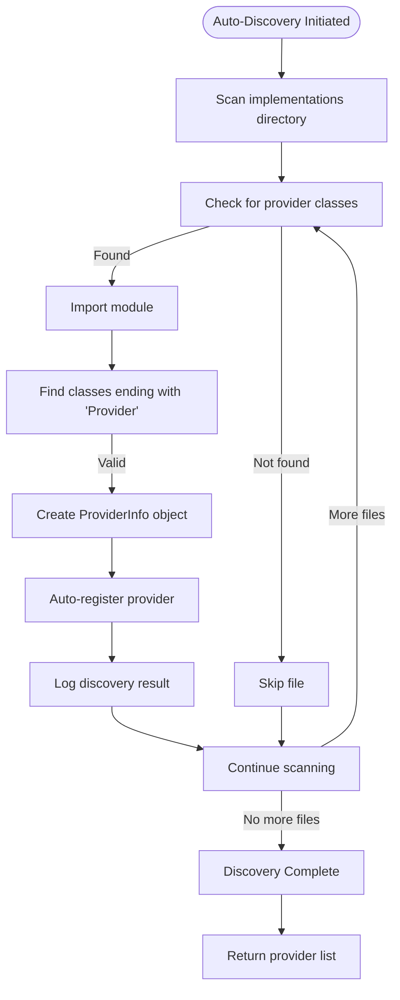
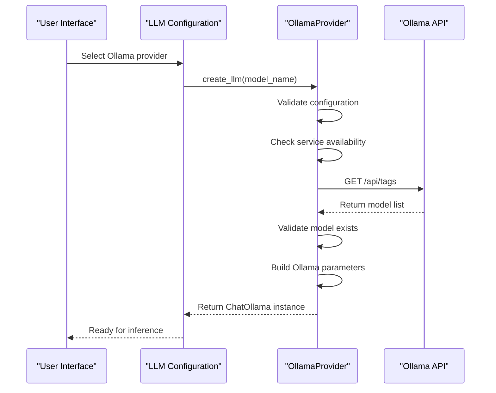
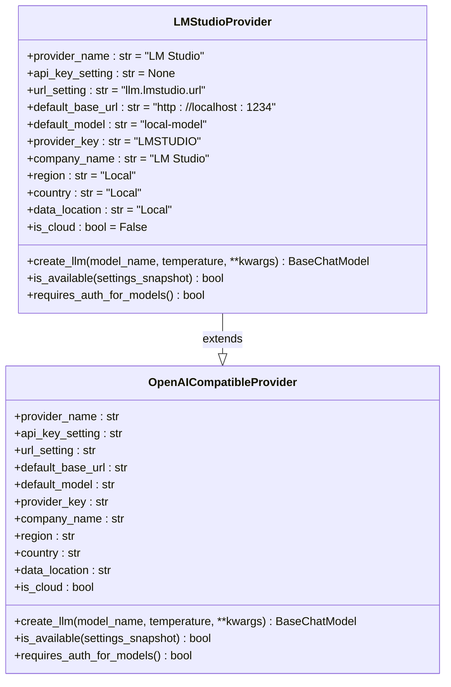
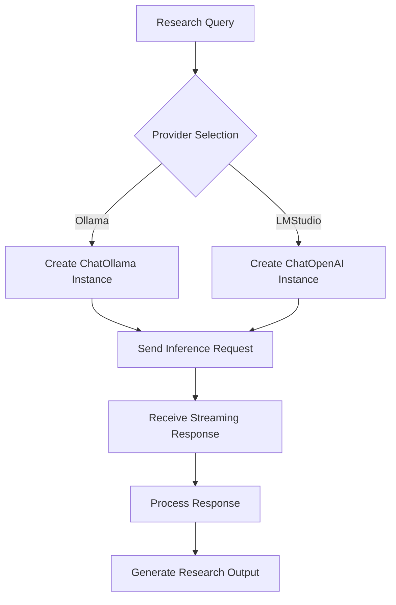

# Local Models Integration

<cite>
**Referenced Files in This Document**   
- [llm_registry.py](file://src/local_deep_research/llm/llm_registry.py)
- [auto_discovery.py](file://src/local_deep_research/llm/providers/auto_discovery.py)
- [ollama.py](file://src/local_deep_research/llm/providers/implementations/ollama.py)
- [lmstudio.py](file://src/local_deep_research/llm/providers/implementations/lmstudio.py)
- [llm_config.py](file://src/local_deep_research/config/llm_config.py)
- [default_settings.json](file://src/local_deep_research/defaults/default_settings.json)
- [basic_custom_llm.py](file://examples/llm_integration/basic_custom_llm.py)
- [advanced_custom_llm.py](file://examples/llm_integration/advanced_custom_llm.py)
</cite>

## Table of Contents
1. [Introduction](#introduction)
2. [Auto-Discovery Mechanism](#auto-discovery-mechanism)
3. [Ollama Provider Implementation](#ollama-provider-implementation)
4. [LMStudio Provider Implementation](#lmstudio-provider-implementation)
5. [Configuration Options](#configuration-options)
6. [Setup Instructions](#setup-instructions)
7. [Troubleshooting Connectivity Issues](#troubleshooting-connectivity-issues)
8. [Performance Considerations](#performance-considerations)
9. [Usage Patterns and Examples](#usage-patterns-and-examples)
10. [Integration with Research Workflow](#integration-with-research-workflow)
11. [Conclusion](#conclusion)

## Introduction

Local Deep Research supports integration with local LLMs through Ollama and LMStudio, enabling users to leverage powerful language models running on their own hardware. This documentation details the architecture, implementation, and usage patterns for these local model integrations. The system provides automatic discovery of locally running models, dynamic registration in the LLM registry, and seamless integration with the broader research workflow.

The integration framework is built around a provider-based architecture that supports both local and cloud-based LLMs. For local models, the system implements specialized providers for Ollama and LMStudio that handle model loading, inference requests, and streaming responses. The auto-discovery mechanism automatically detects available providers and registers them dynamically, allowing users to immediately access their local models without complex configuration.

**Section sources**
- [llm_registry.py](file://src/local_deep_research/llm/llm_registry.py#L1-L162)
- [auto_discovery.py](file://src/local_deep_research/llm/providers/auto_discovery.py#L1-L270)

## Auto-Discovery Mechanism

The auto-discovery system automatically detects and registers available LLM providers, including local models running through Ollama and LMStudio. This mechanism scans the implementations directory for provider classes and registers them in the global LLM registry.

The discovery process is implemented in the `ProviderDiscovery` class, which maintains a singleton instance to ensure providers are only discovered once. When initialized, it scans the implementations subdirectory for Python files containing provider classes. Each provider class must end with "Provider" and have a `provider_name` attribute to be recognized.

During discovery, the system automatically calls the `register_{module_name}_provider` function for each provider module, which registers the provider factory function in the global registry. This allows the system to dynamically create LLM instances when needed. The discovery process also collects metadata about each provider, including its key, name, company, region, and whether it's a cloud or local provider.

**Diagram sources**
- [auto_discovery.py](file://src/local_deep_research/llm/providers/auto_discovery.py#L92-L270)

**Section sources**
- [auto_discovery.py](file://src/local_deep_research/llm/providers/auto_discovery.py#L1-L270)

## Ollama Provider Implementation

The Ollama provider implementation enables integration with locally running Ollama instances. It provides comprehensive functionality for model discovery, LLM creation, and availability checking.

The `OllamaProvider` class implements the core functionality with several key methods. The `list_models_for_api` method retrieves available models from the Ollama instance by making a request to the `/api/tags` endpoint. It uses the `fetch_ollama_models` utility function to handle the API call and processes the response to format model information for the UI, including cleaning up model names and adding provider information.

The `create_llm` method is responsible for creating configured `ChatOllama` instances. It first checks if the Ollama URL is configured in settings, then verifies that the Ollama service is available by checking the `/api/tags` endpoint. Before creating the LLM instance, it validates that the requested model exists in the Ollama instance by comparing against the list of available models.

The provider also supports authentication for secured Ollama instances through the `_get_auth_headers` method, which adds Bearer token authentication when an API key is configured. Configuration options include the Ollama URL, API key (optional), context window size, and thinking mode for models that support reasoning.

**Diagram sources**
- [ollama.py](file://src/local_deep_research/llm/providers/implementations/ollama.py#L27-L345)

**Section sources**
- [ollama.py](file://src/local_deep_research/llm/providers/implementations/ollama.py#L1-L345)

## LMStudio Provider Implementation

The LMStudio provider enables integration with LM Studio's local OpenAI-compatible API. Unlike Ollama, LM Studio provides an API that is compatible with OpenAI's interface, allowing the provider to extend the `OpenAICompatibleProvider` base class.

The `LMStudioProvider` class inherits from `OpenAICompatibleProvider` and overrides key methods to handle LM Studio specifics. The `create_llm` method configures the connection by setting the base URL to the LM Studio endpoint with the `/v1` path. It uses a placeholder API key ("not-required") since LM Studio typically doesn't require authentication for local instances.

**Diagram sources**
- [lmstudio.py](file://src/local_deep_research/llm/providers/implementations/lmstudio.py#L9-L115)

The `is_available` method checks LM Studio's availability by making a request to the `/v1/models` endpoint. The provider is designed to work with LM Studio's default configuration running on `http://localhost:1234`, but users can configure a custom URL through settings. The implementation handles connection timeouts and network errors gracefully, returning `False` if the service is unavailable.

**Section sources**
- [lmstudio.py](file://src/local_deep_research/llm/providers/implementations/lmstudio.py#L1-L115)

## Configuration Options

The system provides extensive configuration options for local LLM integration through the settings system. These options are defined in the default settings and can be modified through the UI or environment variables.

For Ollama integration, key configuration options include:
- `llm.ollama.url`: The URL of the Ollama endpoint (default: `http://localhost:11434`)
- `llm.ollama.api_key`: Optional API key for authenticated Ollama instances
- `llm.ollama.enable_thinking`: Whether to enable thinking/reasoning mode for models that support it
- `llm.local_context_window_size`: Context window size for local providers (default: 4096)

For LMStudio integration, the primary configuration option is:
- `llm.lmstudio.url`: The URL of the LM Studio endpoint (default: `http://localhost:1234`)

Additional configuration options that affect local model performance include:
- `llm.max_tokens`: Maximum number of tokens in model responses
- `llm.supports_max_tokens`: Whether the LLM API supports the 'max_tokens' option
- `llm.temperature`: Controls randomness in model outputs (0.0 - 1.0)

These settings are accessed through the `get_setting_from_snapshot` function, which retrieves values from the current settings context. The system uses these settings to configure LLM parameters such as context window size and maximum tokens, ensuring optimal performance for local models.

**Section sources**
- [default_settings.json](file://src/local_deep_research/defaults/default_settings.json#L310-L378)
- [llm_config.py](file://src/local_deep_research/config/llm_config.py#L462-L491)

## Setup Instructions

To set up local models with Ollama and LMStudio, follow these steps:

1. **Install and run Ollama**:
   - Download and install Ollama from the official website
   - Start the Ollama service
   - Pull desired models using `ollama pull <model_name>` (e.g., `ollama pull llama3`, `ollama pull gemma`)

2. **Install and run LM Studio**:
   - Download and install LM Studio from the official website
   - Launch LM Studio
   - Load your desired model through the LM Studio interface
   - Ensure the API server is running (typically on port 1234)

3. **Configure Local Deep Research**:
   - In the settings UI, set the LLM provider to "Ollama (Local)" or "LM Studio (Local)"
   - Verify the endpoint URLs are correct (Ollama: `http://localhost:11434`, LM Studio: `http://localhost:1234`)
   - Select your desired model from the dropdown list
   - Adjust temperature and other parameters as needed

4. **Test the connection**:
   - The system will automatically detect available models when you select the provider
   - If models don't appear, check that the local service is running and the URL is correct
   - Perform a test query to verify the integration is working

The auto-discovery mechanism will automatically detect both Ollama and LMStudio if they are running on their default ports. Once configured, the models will be available for use in research workflows.

**Section sources**
- [default_settings.json](file://src/local_deep_research/defaults/default_settings.json#L451-L478)
- [ollama.py](file://src/local_deep_research/llm/providers/implementations/ollama.py#L34-L37)
- [lmstudio.py](file://src/local_deep_research/llm/providers/implementations/lmstudio.py#L17-L18)

## Troubleshooting Connectivity Issues

When experiencing connectivity issues with local LLMs, consider the following troubleshooting steps:

**For Ollama connectivity issues:**
- Verify Ollama is running by accessing `http://localhost:11434` in a web browser
- Check that the model is loaded by running `ollama list` in the terminal
- Verify the URL in settings matches the Ollama service address
- Test the API directly with `curl http://localhost:11434/api/tags`
- Ensure firewall settings allow connections on port 11434

**For LMStudio connectivity issues:**
- Verify LM Studio is running and the API server is enabled
- Check that the model is loaded in the LM Studio interface
- Verify the URL in settings matches the LM Studio API address
- Test the API directly with `curl http://localhost:1234/v1/models`
- Ensure firewall settings allow connections on port 1234

Common error messages and their solutions:
- "Ollama URL not configured": Set the `llm.ollama.url` setting to the correct address
- "Ollama not available": Verify the Ollama service is running and accessible
- "Model not found in Ollama": Pull the model using `ollama pull <model_name>`
- "Request error when checking Ollama": Check network connectivity and firewall settings
- "LM Studio not available": Verify LM Studio is running and the API server is enabled

The system logs detailed information about connection attempts, which can be found in the application logs. Enable debug mode in settings to get more detailed error information.

**Section sources**
- [ollama.py](file://src/local_deep_research/llm/providers/implementations/ollama.py#L254-L308)
- [lmstudio.py](file://src/local_deep_research/llm/providers/implementations/lmstudio.py#L53-L73)
- [llm_config.py](file://src/local_deep_research/config/llm_config.py#L92-L138)

## Performance Considerations

When using local LLMs, several performance factors should be considered to ensure optimal operation:

**Token Generation Speed**: Local model performance depends heavily on hardware specifications, particularly GPU capabilities. Models with GPU acceleration will generate tokens significantly faster than CPU-only execution. The system automatically detects available hardware resources and optimizes model loading accordingly.

**Memory Usage**: Large language models can consume substantial memory resources. The `local_context_window_size` setting (default: 4096) helps prevent memory issues by limiting the context window for local providers. Users should monitor system memory usage and adjust this setting based on their hardware capabilities.

**Model Unavailability Handling**: The system implements robust handling of model unavailability. When a local model is not available, the system logs the error and can fall back to alternative providers if configured. The `is_available` methods for both Ollama and LMStudio providers include timeout handling (3.0 seconds for Ollama, 1.0 second for LMStudio) to prevent hanging requests.

**Resource Optimization**: The system optimizes resource usage by:
- Caching model availability checks
- Reusing LLM instances when possible
- Implementing proper connection timeouts
- Providing configuration options to limit token generation

For optimal performance, users should:
- Use models appropriate for their hardware capabilities
- Monitor system resource usage during operation
- Adjust context window and max tokens settings based on available memory
- Keep local LLM software updated to the latest version

**Section sources**
- [ollama.py](file://src/local_deep_research/llm/providers/implementations/ollama.py#L254-L308)
- [lmstudio.py](file://src/local_deep_research/llm/providers/implementations/lmstudio.py#L53-L73)
- [llm_config.py](file://src/local_deep_research/config/llm_config.py#L462-L531)

## Usage Patterns and Examples

The examples directory provides several patterns for integrating local LLMs into research workflows. These examples demonstrate both basic and advanced usage scenarios.

The basic custom LLM example shows how to create a custom LLM class that inherits from `BaseChatModel` and implement the `_generate` method. This pattern can be adapted for local models by replacing the mock implementation with actual calls to the local LLM API.

**Diagram sources**
- [basic_custom_llm.py](file://examples/llm_integration/basic_custom_llm.py#L17-L48)
- [advanced_custom_llm.py](file://examples/llm_integration/advanced_custom_llm.py#L23-L66)

The advanced example demonstrates more sophisticated patterns, including:
- Factory functions with configuration parameters
- Error handling and retry logic
- Multiple LLM registration for different research phases
- Combining custom LLMs with custom retrievers

These patterns can be applied to local model integration by creating factory functions that configure local LLM instances with appropriate parameters for different research tasks.

**Section sources**
- [basic_custom_llm.py](file://examples/llm_integration/basic_custom_llm.py#L1-L118)
- [advanced_custom_llm.py](file://examples/llm_integration/advanced_custom_llm.py#L1-L351)

## Integration with Research Workflow

Local models integrate seamlessly with the broader research workflow through the LLM registry system. When a local model is selected as the provider, the system retrieves the appropriate factory function from the registry and creates an LLM instance for use in research tasks.

The integration follows this flow:
1. User selects a research query and chooses a local provider
2. The system retrieves the provider factory function from the registry
3. The factory function creates a configured LLM instance
4. The LLM instance is used for all inference requests during the research process
5. Results are processed and incorporated into the final research output

This architecture allows local models to participate in all research features, including detailed research, quick summaries, and citation generation. The system handles streaming responses from local models, providing real-time feedback during the research process.

The integration also supports advanced features like context window management, where the system automatically configures the context size based on the `local_context_window_size` setting. This ensures optimal performance and prevents memory issues when working with large research queries.

**Section sources**
- [llm_registry.py](file://src/local_deep_research/llm/llm_registry.py#L1-L162)
- [llm_config.py](file://src/local_deep_research/config/llm_config.py#L283-L800)

## Conclusion

The local LLM integration with Ollama and LMStudio provides a powerful and flexible way to leverage local language models within the Local Deep Research framework. The auto-discovery mechanism automatically detects available providers and registers them in the LLM registry, enabling seamless integration without complex configuration.

Key features of the implementation include:
- Automatic discovery and registration of local model providers
- Comprehensive configuration options for tuning performance
- Robust error handling and connectivity checking
- Seamless integration with the broader research workflow
- Support for both basic and advanced usage patterns

By following the setup instructions and understanding the configuration options, users can effectively leverage their local hardware for research tasks while maintaining the flexibility to switch between local and cloud-based providers as needed.

[No sources needed since this section summarizes without analyzing specific files]