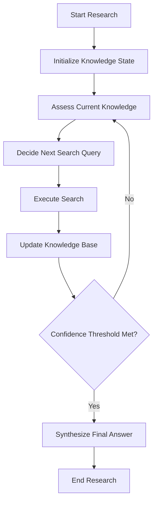
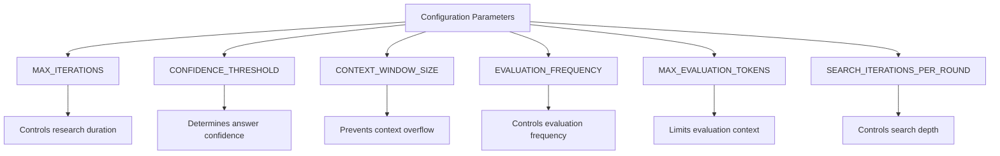

# Detailed Research Mode

<cite>
**Referenced Files in This Document**   
- [iterative_reasoning_strategy.py](file://src/local_deep_research/advanced_search_system/strategies/iterative_reasoning_strategy.py)
- [iterative_refinement_strategy.py](file://src/local_deep_research/advanced_search_system/strategies/iterative_refinement_strategy.py)
- [search_system_factory.py](file://src/local_deep_research/search_system_factory.py)
- [search_system.py](file://src/local_deep_research/search_system.py)
- [search_utilities.py](file://src/local_deep_research/utilities/search_utilities.py)
</cite>

## Table of Contents
1. [Introduction](#introduction)
2. [Core Implementation](#core-implementation)
3. [Configuration Options](#configuration-options)
4. [Strategy Selection](#strategy-selection)
5. [Output Format](#output-format)
6. [Performance Characteristics](#performance-characteristics)
7. [Common Issues](#common-issues)
8. [Optimal Use Cases](#optimal-use-cases)

## Introduction

Detailed Research mode is a comprehensive research approach designed for complex queries requiring in-depth analysis. This mode employs advanced iterative strategies that perform multiple rounds of questioning and source verification to ensure thorough and accurate results. Unlike quick research modes, Detailed Research mode prioritizes depth and accuracy over speed, making it ideal for complex analytical tasks, research papers, and technical investigations.

The system implements two primary iterative strategies: IterativeReasoningStrategy and IterativeRefinementStrategy. These strategies work by maintaining persistent knowledge states, evaluating research progress, and dynamically generating follow-up queries to address knowledge gaps. The approach mimics human research methodology, where initial findings inform subsequent investigation directions, leading to progressively refined and more confident results.

**Section sources**
- [iterative_reasoning_strategy.py](file://src/local_deep_research/advanced_search_system/strategies/iterative_reasoning_strategy.py#L1-L25)
- [iterative_refinement_strategy.py](file://src/local_deep_research/advanced_search_system/strategies/iterative_refinement_strategy.py#L1-L33)

## Core Implementation

The Detailed Research mode is implemented through two sophisticated classes: IterativeReasoningStrategy and IterativeRefinementStrategy. These classes work together to create a robust research framework that systematically builds knowledge through multiple iterations.

The IterativeReasoningStrategy maintains a persistent knowledge base throughout the research process. It follows a simple loop: assess current knowledge, decide on the next search, execute the search, update knowledge with new findings, and check if sufficient confidence has been achieved. The strategy uses a KnowledgeState dataclass to track key information including the original query, key facts, uncertainties, search history, candidate answers, and overall confidence level.



**Diagram sources**
- [iterative_reasoning_strategy.py](file://src/local_deep_research/advanced_search_system/strategies/iterative_reasoning_strategy.py#L58-L68)

The IterativeRefinementStrategy acts as an orchestrator that runs initial research with a base strategy, evaluates results quality with an LLM, generates targeted follow-up queries, and uses EnhancedContextualFollowUpStrategy for refinement. This strategy accumulates knowledge across iterations and can perform multiple refinement cycles until quality thresholds are met.

Both strategies implement sophisticated evaluation mechanisms to determine when research should continue or terminate. The IterativeReasoningStrategy assesses confidence by considering multiple factors including the number of supporting facts, remaining uncertainties, search history, and candidate answer distribution. The IterativeRefinementStrategy uses LLM evaluation to identify gaps and determine whether refinement is needed.

**Section sources**
- [iterative_reasoning_strategy.py](file://src/local_deep_research/advanced_search_system/strategies/iterative_reasoning_strategy.py#L58-L342)
- [iterative_refinement_strategy.py](file://src/local_deep_research/advanced_search_system/strategies/iterative_refinement_strategy.py#L22-L101)

## Configuration Options

Detailed Research mode is controlled by several key configuration parameters that determine the depth and thoroughness of the research process. These options allow users and administrators to balance research quality against computational resources and time requirements.

The primary configuration options include:

- **MAX_ITERATIONS**: Controls the maximum number of reasoning iterations the system will perform. The default value is typically set to 10, but can be adjusted based on the complexity of the research task and available resources.

- **CONFIDENCE_THRESHOLD**: Determines the confidence level required to stop the research process. This value ranges from 0.0 to 1.0, with higher values requiring more evidence before concluding. The default threshold is typically 0.85, meaning the system continues research until it is at least 85% confident in its answer.

- **CONTEXT_WINDOW_SIZE**: Specifies the maximum number of tokens that can be processed in a single context. This setting is crucial for handling large amounts of retrieved information and preventing context overflow issues.

Additional configuration parameters include evaluation_frequency (how often to evaluate research progress), max_evaluation_tokens (maximum tokens for LLM evaluation), and search_iterations_per_round (number of search iterations per reasoning cycle).



**Diagram sources**
- [iterative_reasoning_strategy.py](file://src/local_deep_research/advanced_search_system/strategies/iterative_reasoning_strategy.py#L70-L97)
- [iterative_refinement_strategy.py](file://src/local_deep_research/advanced_search_system/strategies/iterative_refinement_strategy.py#L34-L45)

## Strategy Selection

The system uses a factory pattern implemented in search_system_factory.py to select appropriate strategies for different types of queries. For complex queries requiring detailed research, the factory selects either IterativeReasoningStrategy or IterativeRefinementStrategy based on the specified strategy name.

When a research request is initiated with the "iterative" strategy name, the system creates an instance of IterativeReasoningStrategy with the specified configuration parameters. Similarly, when "iterative-refinement" is specified, the factory creates an IterativeRefinementStrategy instance.

```python
# Strategy selection in search_system_factory.py
elif strategy_name_lower == "iterative":
    return IterativeReasoningStrategy(
        model=model,
        search=search,
        all_links_of_system=all_links_of_system,
        max_iterations=max_iterations,
        confidence_threshold=kwargs.get("confidence_threshold", 0.95),
        search_iterations_per_round=search_iterations_per_round,
        questions_per_search=questions_per_iteration,
        settings_snapshot=settings_snapshot,
    )
```

The selection process considers the research mode specified in the request (quick or detailed) and maps it to the appropriate strategy. Detailed mode typically uses iterative strategies, while quick mode may use simpler, faster approaches.

The AdvancedSearchSystem class coordinates the strategy selection and execution process. It initializes the appropriate strategy based on the provided strategy_name parameter and configures it with the necessary components including the LLM model, search engine, and settings snapshot.

**Section sources**
- [search_system_factory.py](file://src/local_deep_research/search_system_factory.py#L448-L471)
- [search_system.py](file://src/local_deep_research/search_system.py#L20-L219)

## Output Format

Detailed Research mode produces comprehensive analysis with multiple sources and citations. The output format is designed to provide transparency into the research process while delivering a clear, well-supported final answer.

The expected output includes several key components:

1. **Final Answer**: A concise response to the original query, presented at the beginning of the results for immediate visibility.

2. **Research Summary**: Information about the research process including the number of reasoning steps, key facts discovered, candidate answers evaluated, and final confidence level.

3. **Key Facts**: A numbered list of the most important facts that support the final answer, typically limited to the top 10 most relevant facts.

4. **Search History**: A chronological list of all search queries performed during the research process, showing the progression of the investigation.

5. **Detailed Findings**: A section-by-section breakdown of the research process, including iteration summaries, new facts discovered, current candidates, remaining questions, and progress metrics.

6. **Sources**: Comprehensive citation information for all sources used, formatted with titles, URLs, and reference numbers.

The output is structured to first present the conclusion, followed by the evidence and reasoning that supports it. This format allows users to quickly understand the answer while also providing access to the complete research methodology and supporting evidence for verification.

**Section sources**
- [iterative_reasoning_strategy.py](file://src/local_deep_research/advanced_search_system/strategies/iterative_reasoning_strategy.py#L668-L756)
- [search_utilities.py](file://src/local_deep_research/utilities/search_utilities.py#L101-L262)

## Performance Characteristics

Detailed Research mode has distinct performance characteristics that differentiate it from simpler research approaches. The primary trade-off is longer processing times and higher resource usage in exchange for more thorough and accurate results.

The iterative nature of the research process means that each query can generate multiple search iterations, with each iteration potentially involving several steps: knowledge assessment, query generation, search execution, result processing, and confidence evaluation. This multi-step process significantly increases processing time compared to single-pass approaches.

Resource usage is also higher due to several factors:
- Multiple LLM calls per research session for evaluation and reasoning
- Numerous search engine queries that consume API rate limits
- Increased memory usage for maintaining the knowledge state across iterations
- Higher token consumption for processing and analyzing results

The system's performance scales with the complexity of the query and the number of iterations required to reach the confidence threshold. Simple queries may complete in a few iterations, while complex analytical tasks could require the maximum number of iterations.

Despite these resource demands, the iterative approach often proves more efficient than brute-force methods by focusing subsequent searches on specific knowledge gaps rather than performing broad, unfocused research.

**Section sources**
- [iterative_reasoning_strategy.py](file://src/local_deep_research/advanced_search_system/strategies/iterative_reasoning_strategy.py#L151-L283)
- [iterative_refinement_strategy.py](file://src/local_deep_research/advanced_search_system/strategies/iterative_refinement_strategy.py#L156-L282)

## Common Issues

While Detailed Research mode provides powerful capabilities, it can encounter several common issues that users and administrators should be aware of.

**Context Overflow**: One of the most frequent issues is context overflow, where the accumulated knowledge and search results exceed the LLM's context window size. This can prevent the system from processing all available information. The system addresses this through the max_evaluation_tokens parameter, which truncates findings when necessary, but this may result in loss of some information.

**Low Progress Detection**: The system includes mechanisms to detect when searches are yielding limited new information. When multiple consecutive searches fail to significantly increase confidence or discover new facts, the system generates low progress alerts and may adjust its search approach.

**Resource Limitations**: The iterative nature of detailed research can quickly consume API rate limits and computational resources. Users may encounter rate limiting from search engines or LLM providers, particularly when running multiple detailed research sessions.

**Confidence Plateaus**: In some cases, the research process may reach a confidence plateau where additional iterations provide diminishing returns. The system's confidence assessment algorithm considers multiple factors to avoid premature termination while also preventing infinite loops.

**Source Duplication**: Without proper deduplication, the system may accumulate duplicate sources across iterations. The implementation includes mechanisms to track existing URLs and prevent duplication in the final results.

**Section sources**
- [iterative_reasoning_strategy.py](file://src/local_deep_research/advanced_search_system/strategies/iterative_reasoning_strategy.py#L249-L268)
- [iterative_refinement_strategy.py](file://src/local_deep_research/advanced_search_system/strategies/iterative_refinement_strategy.py#L249-L253)
- [search_utilities.py](file://src/local_deep_research/utilities/search_utilities.py#L66-L77)

## Optimal Use Cases

Detailed Research mode is particularly well-suited for specific types of queries and research tasks where depth and accuracy are paramount.

**Research Papers and Academic Investigations**: The systematic, iterative approach mirrors academic research methodology, making it ideal for literature reviews, hypothesis testing, and comprehensive topic analysis. The ability to track knowledge progression and cite multiple sources aligns well with academic standards.

**Technical Investigations**: Complex technical problems that require understanding multiple interrelated factors benefit from the iterative refinement process. The system can systematically explore different aspects of a technical issue, verify findings, and build a comprehensive understanding.

**Decision Support**: When making important decisions that require thorough analysis of multiple options and their implications, Detailed Research mode can provide comprehensive information about alternatives, risks, and potential outcomes.

**Fact-Checking and Verification**: The system's ability to identify uncertainties and generate verification queries makes it effective for fact-checking claims and investigating potentially misleading information.

**Exploratory Research**: For topics where the user has limited prior knowledge, the iterative approach can systematically build understanding from basic concepts to more complex relationships.

The mode is less suitable for simple factual queries that can be answered with a single search, time-sensitive information needs, or situations with strict resource constraints.

**Section sources**
- [iterative_reasoning_strategy.py](file://src/local_deep_research/advanced_search_system/strategies/iterative_reasoning_strategy.py#L4-L9)
- [iterative_refinement_strategy.py](file://src/local_deep_research/advanced_search_system/strategies/iterative_refinement_strategy.py#L4-L8)