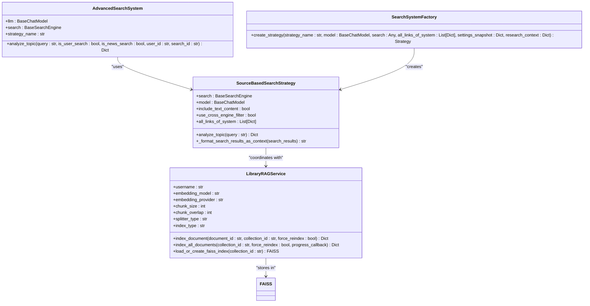
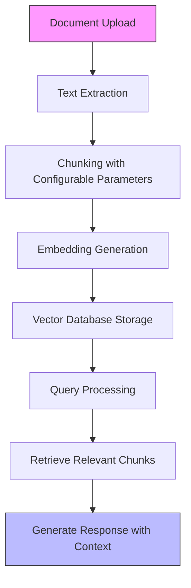
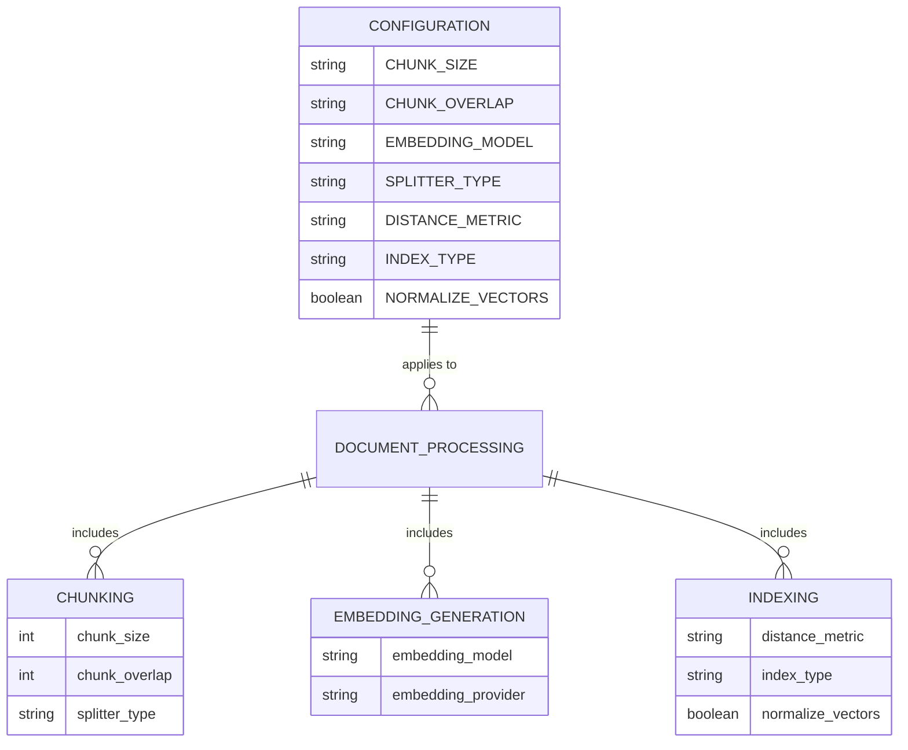
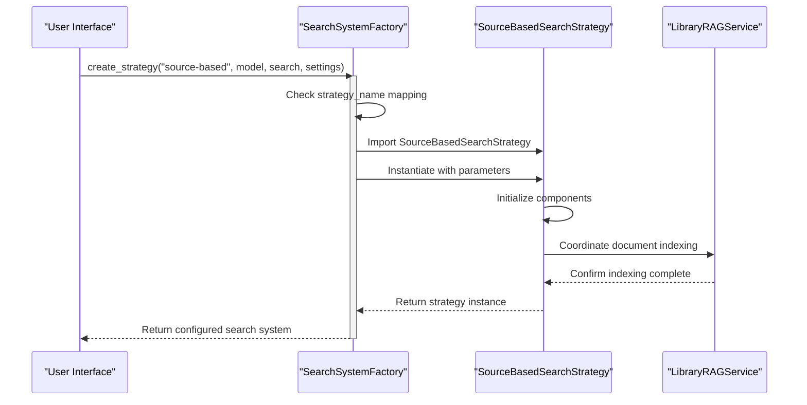
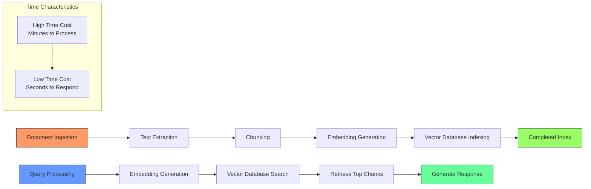

# Document Analysis Mode

<cite>
**Referenced Files in This Document**   
- [source_based_strategy.py](file://src/local_deep_research/advanced_search_system/strategies/source_based_strategy.py)
- [library_rag_service.py](file://src/local_deep_research/research_library/services/library_rag_service.py)
- [search_system_factory.py](file://src/local_deep_research/search_system_factory.py)
- [search_system.py](file://src/local_deep_research/search_system.py)
- [embedding_settings.html](file://src/local_deep_research/web/templates/pages/embedding_settings.html)
- [embedding_settings.js](file://src/local_deep_research/web/static/js/embedding_settings.js)
- [text_splitter_registry.py](file://src/local_deep_research/embeddings/splitters/text_splitter_registry.py)
- [search_engine_local.py](file://src/local_deep_research/web_search_engines/engines/search_engine_local.py)
- [rag_routes.py](file://src/local_deep_research/research_library/routes/rag_routes.py)
</cite>

## Table of Contents
1. [Introduction](#introduction)
2. [Core Components](#core-components)
3. [Document Processing Workflow](#document-processing-workflow)
4. [Configuration Options](#configuration-options)
5. [Search System Factory Integration](#search-system-factory-integration)
6. [Performance Characteristics](#performance-characteristics)
7. [Optimal Use Cases](#optimal-use-cases)

## Introduction
Document Analysis Mode enables users to analyze uploaded documents using Retrieval-Augmented Generation (RAG) techniques. This mode leverages the SourceBasedStrategy class and the library RAG service to process documents through a comprehensive pipeline that includes text extraction, chunking, embedding generation, and query processing against a document vector store. The system integrates with the research library to manage document storage and retrieval, providing a powerful tool for analyzing complex documents such as research papers, contracts, and lengthy articles.

**Section sources**
- [source_based_strategy.py](file://src/local_deep_research/advanced_search_system/strategies/source_based_strategy.py#L22-L461)
- [library_rag_service.py](file://src/local_deep_research/research_library/services/library_rag_service.py#L40-L1443)

## Core Components

The Document Analysis Mode is built around two primary components: the SourceBasedSearchStrategy and the LibraryRAGService. The SourceBasedSearchStrategy coordinates the document analysis process by generating questions based on search results and deferring content analysis until final synthesis. This strategy works in conjunction with the LibraryRAGService, which handles the indexing and searching of library documents using RAG techniques.

The SourceBasedSearchStrategy implements a multi-iteration approach where each iteration generates questions based on previous search results, runs searches in parallel, and filters results for relevance. The strategy maintains state through attributes like questions_by_iteration and all_links_of_system, which track the research progress across iterations.

The LibraryRAGService manages the complete RAG pipeline for library documents, including text chunking, embedding generation, and vector database management. It uses configurable parameters for chunking and embedding that can be customized through the system settings.

**Diagram sources **
- [source_based_strategy.py](file://src/local_deep_research/advanced_search_system/strategies/source_based_strategy.py#L22-L461)
- [library_rag_service.py](file://src/local_deep_research/research_library/services/library_rag_service.py#L40-L1443)
- [search_system.py](file://src/local_deep_research/search_system.py#L20-L377)
- [search_system_factory.py](file://src/local_deep_research/search_system_factory.py#L25-L926)

**Section sources**
- [source_based_strategy.py](file://src/local_deep_research/advanced_search_system/strategies/source_based_strategy.py#L22-L461)
- [library_rag_service.py](file://src/local_deep_research/research_library/services/library_rag_service.py#L40-L1443)

## Document Processing Workflow

The document analysis workflow follows a structured process that begins with document upload and ends with query processing against the document vector store. When a user uploads a document, the system first extracts text content from the document, regardless of its original format (PDF, DOCX, etc.). This text extraction process preserves the document's structure and metadata for later reference.

After text extraction, the document is processed through the chunking pipeline. The text is divided into smaller segments based on the configured chunk_size and chunk_overlap parameters. This chunking process is handled by the text splitter component, which can use different strategies such as recursive, token-based, or semantic splitting. The choice of splitter affects how the text is segmented and can impact the quality of subsequent analysis.

Once the document is chunked, embeddings are generated for each chunk using the configured embedding model. These embeddings are numerical representations of the text that capture its semantic meaning. The embeddings are then stored in a vector database (FAISS index) along with metadata about the original document and chunk position. This creates a searchable index where similar concepts are positioned close together in the vector space.

When a user queries the system, the query is also converted to an embedding and used to search the vector database for the most similar document chunks. The retrieved chunks are then used as context for the language model to generate a response, effectively allowing the model to "read" the relevant portions of the uploaded documents when formulating its answer.

**Diagram sources **
- [library_rag_service.py](file://src/local_deep_research/research_library/services/library_rag_service.py#L40-L1443)
- [source_based_strategy.py](file://src/local_deep_research/advanced_search_system/strategies/source_based_strategy.py#L22-L461)

**Section sources**
- [library_rag_service.py](file://src/local_deep_research/research_library/services/library_rag_service.py#L40-L1443)
- [source_based_strategy.py](file://src/local_deep_research/advanced_search_system/strategies/source_based_strategy.py#L22-L461)

## Configuration Options

The document analysis system provides several configurable options that affect how documents are processed and analyzed. These configuration parameters can be adjusted to optimize performance and accuracy for different types of documents and use cases.

The CHUNK_SIZE parameter determines the number of characters in each text chunk. Larger chunk sizes provide more context to the language model but may exceed token limits, while smaller chunks allow for more precise retrieval but may lack sufficient context. The default value is 1000 characters, but this can be adjusted based on the specific requirements of the analysis task.

The CHUNK_OVERLAP parameter specifies the number of characters that overlap between consecutive chunks. This overlap helps preserve context at chunk boundaries and ensures that concepts spanning multiple chunks are not lost. The default overlap is 200 characters, which represents 20% of the default chunk size.

The EMBEDDING_MODEL configuration determines which model is used to generate vector embeddings for the document chunks. The system supports multiple embedding providers including sentence_transformers, ollama, and OpenAI. The default model is "all-MiniLM-L6-v2", a lightweight sentence transformer model that provides good performance for most use cases.

Additional configuration options include:
- **Splitter Type**: Determines the algorithm used for text segmentation (recursive, token, sentence, or semantic)
- **Distance Metric**: Specifies how similarity is measured between vectors (cosine, L2, or dot product)
- **Index Type**: Configures the FAISS index structure (flat, HNSW, or IVF) for different performance characteristics
- **Normalize Vectors**: Controls whether vectors are normalized with L2 normalization before storage

These configuration options are accessible through the system settings interface and can be customized for each collection or globally for the entire library.

**Diagram sources **
- [embedding_settings.html](file://src/local_deep_research/web/templates/pages/embedding_settings.html#L78-L96)
- [embedding_settings.js](file://src/local_deep_research/web/static/js/embedding_settings.js#L181-L366)
- [text_splitter_registry.py](file://src/local_deep_research/embeddings/splitters/text_splitter_registry.py#L43-L84)
- [library_rag_service.py](file://src/local_deep_research/research_library/services/library_rag_service.py#L40-L1443)

**Section sources**
- [embedding_settings.html](file://src/local_deep_research/web/templates/pages/embedding_settings.html#L78-L96)
- [embedding_settings.js](file://src/local_deep_research/web/static/js/embedding_settings.js#L181-L366)
- [text_splitter_registry.py](file://src/local_deep_research/embeddings/splitters/text_splitter_registry.py#L43-L84)
- [library_rag_service.py](file://src/local_deep_research/research_library/services/library_rag_service.py#L40-L1443)

## Search System Factory Integration

The search system factory plays a crucial role in selecting the appropriate strategy for document analysis. When a document analysis request is made, the factory examines the strategy_name parameter and instantiates the corresponding search strategy. For document analysis, the factory specifically selects the SourceBasedSearchStrategy when the strategy name is "source-based" or any of its variations.

The factory pattern centralizes strategy creation and avoids code duplication across the application. It uses a series of conditional checks to map strategy names to their corresponding classes. When the factory encounters a "source-based" strategy request, it imports the SourceBasedSearchStrategy class and instantiates it with the provided parameters, including the language model, search engine, and configuration settings.

The factory also handles parameter mapping, ensuring that configuration options from the settings snapshot are properly applied to the instantiated strategy. This includes settings for text content inclusion, cross-engine filtering, atomic fact usage, and search original query behavior. The factory passes these parameters to the strategy constructor, allowing for flexible configuration of the document analysis process.

This integration enables seamless switching between different search strategies based on the user's needs. For example, a user might select the "source-based" strategy for detailed document analysis, while choosing other strategies like "rapid" or "parallel" for different types of research tasks. The factory ensures that the correct strategy is instantiated with the appropriate configuration for each use case.

**Diagram sources **
- [search_system_factory.py](file://src/local_deep_research/search_system_factory.py#L25-L926)
- [search_system.py](file://src/local_deep_research/search_system.py#L20-L377)
- [library_rag_service.py](file://src/local_deep_research/research_library/services/library_rag_service.py#L40-L1443)

**Section sources**
- [search_system_factory.py](file://src/local_deep_research/search_system_factory.py#L25-L926)
- [search_system.py](file://src/local_deep_research/search_system.py#L20-L377)

## Performance Characteristics

The document analysis system exhibits distinct performance characteristics during both the initial processing phase and subsequent query operations. The initial document ingestion process is computationally intensive and time-consuming, as it involves text extraction, chunking, embedding generation, and vector database indexing. This processing time scales with the size and number of documents being analyzed, with larger documents requiring more time to process.

During the ingestion phase, the system performs several resource-intensive operations in sequence: text extraction from the document format, text splitting according to the configured parameters, embedding generation using the selected model, and storage in the vector database. The embedding generation step is typically the most time-consuming component, as it requires passing each text chunk through the embedding model. For large collections of documents, this process can take several minutes to complete.

However, once documents are ingested and indexed, subsequent query responses are significantly faster. The vector database allows for rapid similarity searches, typically returning results in seconds. This performance characteristic creates a trade-off between upfront processing cost and ongoing query efficiency - the system invests time during ingestion to enable fast retrieval during analysis.

The system also implements several optimization techniques to improve performance. These include caching of embedding models, reuse of existing chunks when reindexing, and efficient memory management during the indexing process. The FAISS vector database provides additional performance benefits through its optimized similarity search algorithms and support for approximate nearest neighbor search in high-dimensional spaces.

**Diagram sources **
- [library_rag_service.py](file://src/local_deep_research/research_library/services/library_rag_service.py#L40-L1443)
- [search_engine_local.py](file://src/local_deep_research/web_search_engines/engines/search_engine_local.py#L180-L215)

**Section sources**
- [library_rag_service.py](file://src/local_deep_research/research_library/services/library_rag_service.py#L40-L1443)
- [search_engine_local.py](file://src/local_deep_research/web_search_engines/engines/search_engine_local.py#L180-L215)

## Optimal Use Cases

Document Analysis Mode is particularly well-suited for analyzing complex documents that require deep understanding and information extraction. The RAG-based approach excels in scenarios where users need to extract specific information from lengthy texts or synthesize insights from multiple documents.

Research papers represent one of the most effective use cases for this mode. Academic papers often contain specialized terminology, complex arguments, and extensive citations that benefit from the structured analysis approach. The system can help researchers quickly identify key findings, methodology details, and relevant references without requiring them to read the entire paper.

Legal contracts and agreements are another ideal application. These documents typically contain dense language and important clauses that may be difficult to identify through manual review. The document analysis system can help users locate specific provisions, identify potential risks, and compare contract terms across multiple documents.

Technical documentation and manuals also benefit from this analysis mode. Users can query complex technical specifications to find specific implementation details, configuration options, or troubleshooting procedures. The system's ability to understand context and relationships within the text makes it particularly effective for navigating intricate technical content.

The mode is also valuable for analyzing reports and white papers, where users may need to extract data points, identify trends, or summarize key recommendations. Business analysts can use the system to process market research reports, financial statements, or industry analyses to support decision-making.

For all these use cases, the system's ability to maintain context across document sections and preserve the original source information ensures that the analysis is both accurate and verifiable. The integration with the research library allows users to build collections of related documents and perform cross-document analysis, further enhancing the value of the system for complex information tasks.

**Section sources**
- [source_based_strategy.py](file://src/local_deep_research/advanced_search_system/strategies/source_based_strategy.py#L22-L461)
- [library_rag_service.py](file://src/local_deep_research/research_library/services/library_rag_service.py#L40-L1443)