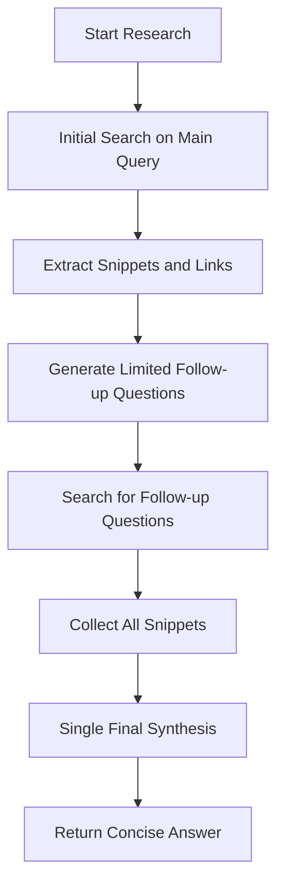
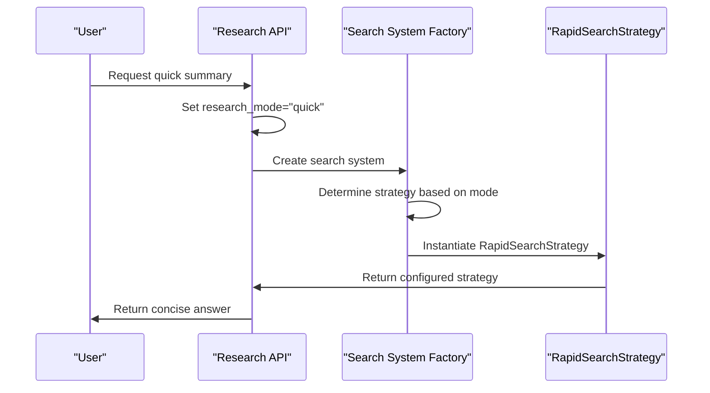

# Quick Summary Mode

<cite>
**Referenced Files in This Document**   
- [rapid_search_strategy.py](file://src/local_deep_research/advanced_search_system/strategies/rapid_search_strategy.py)
- [search_system_factory.py](file://src/local_deep_research/search_system_factory.py)
- [search_system.py](file://src/local_deep_research/search_system.py)
- [research_functions.py](file://src/local_deep_research/api/research_functions.py)
- [settings_search_config.json](file://src/local_deep_research/defaults/settings_search_config.json)
</cite>

## Table of Contents
1. [Introduction](#introduction)
2. [Implementation Details](#implementation-details)
3. [Configuration Options](#configuration-options)
4. [Strategy Selection](#strategy-selection)
5. [Performance Characteristics](#performance-characteristics)
6. [Usage Guidelines](#usage-guidelines)
7. [Conclusion](#conclusion)

## Introduction

Quick Summary mode is the fastest research option designed for straightforward queries requiring concise answers. This mode prioritizes speed and efficiency by performing single-phase retrieval with minimal iteration, making it ideal for simple informational queries and fact-checking tasks. The implementation leverages the RapidSearchStrategy class to deliver rapid responses while maintaining accuracy for uncomplicated research questions.

The primary purpose of Quick Summary mode is to provide users with immediate, direct answers to simple queries without the overhead of extensive research processes. This mode is particularly effective when users need quick confirmation of facts or basic information without requiring comprehensive analysis or multiple sources.

**Section sources**
- [research_functions.py](file://src/local_deep_research/api/research_functions.py#L149-L208)

## Implementation Details

The Quick Summary mode is implemented through the RapidSearchStrategy class, which performs single-phase retrieval with minimal iteration. This strategy is specifically designed for speed, collecting relevant information in a streamlined process that avoids the complexity of multi-phase research.

The implementation follows a three-step process: initial search, limited follow-up questioning, and final synthesis. First, the system performs an initial search on the main query, extracting snippets and relevant links. Then, it generates a small number of follow-up questions (typically three) to gather additional context. Finally, all collected information is synthesized into a concise answer in a single final step.

This approach contrasts with more comprehensive research strategies that perform multiple iterations of questioning and synthesis. By limiting the research process to a single phase with minimal iteration, the RapidSearchStrategy significantly reduces processing time while still providing accurate answers for straightforward queries.

**Diagram sources **
- [rapid_search_strategy.py](file://src/local_deep_research/advanced_search_system/strategies/rapid_search_strategy.py#L51-L297)

**Section sources**
- [rapid_search_strategy.py](file://src/local_deep_research/advanced_search_system/strategies/rapid_search_strategy.py#L19-L297)

## Configuration Options

Quick Summary mode is influenced by several configuration options that affect its behavior and performance. The primary configuration parameters include MAX_ITERATIONS and RESPONSE_TIMEOUT settings, which are critical for maintaining the mode's speed advantages.

The MAX_ITERATIONS parameter is set to a minimal value (typically 1) for Quick Summary mode, ensuring that the research process completes in a single phase. This limitation prevents the system from entering multiple iterative cycles, which would increase response time. The RESPONSE_TIMEOUT setting ensures that the system returns results within an acceptable timeframe, preventing prolonged processing for simple queries.

Additional configuration options include the number of follow-up questions generated (limited to three in this mode) and the snippet collection parameters that determine how much information is gathered from search results. These settings are optimized to balance comprehensiveness with speed, ensuring that the system collects sufficient information to provide accurate answers while maintaining rapid response times.

**Section sources**
- [settings_search_config.json](file://src/local_deep_research/defaults/settings_search_config.json#L1-L15)
- [search_system.py](file://src/local_deep_research/search_system.py#L110-L130)

## Strategy Selection

The search system factory selects the RapidSearchStrategy for Quick Summary mode based on the research context and query characteristics. When a user initiates a quick research request, the system identifies this through the research_mode parameter set to "quick" in the search context.

The selection process occurs in the quick_summary function within the research_functions module, which creates the appropriate search context and invokes the search system factory with the rapid strategy designation. The factory then instantiates the RapidSearchStrategy class, configuring it with the optimized parameters for speed-focused research.

This selection mechanism ensures that simple queries are automatically routed to the most efficient research strategy, while more complex queries can be directed to comprehensive research modes. The factory pattern implementation allows for seamless strategy selection based on the research requirements, providing an optimal balance between speed and depth of analysis.

**Diagram sources **
- [research_functions.py](file://src/local_deep_research/api/research_functions.py#L149-L306)
- [search_system_factory.py](file://src/local_deep_research/search_system_factory.py#L422-L433)

**Section sources**
- [research_functions.py](file://src/local_deep_research/api/research_functions.py#L268-L286)
- [search_system_factory.py](file://src/local_deep_research/search_system_factory.py#L422-L433)

## Performance Characteristics

Quick Summary mode offers significant speed advantages compared to more comprehensive research modes, with response times typically measured in seconds rather than minutes. This performance is achieved through the single-phase retrieval approach and minimal iteration, which reduces the overall processing time required to generate answers.

The primary advantage of this mode is its rapid response time, making it ideal for users who need immediate answers to simple questions. However, this speed comes with limitations in research depth, as the mode does not perform extensive source verification or multi-phase analysis. The trade-off between speed and depth means that while Quick Summary mode excels at providing quick factual answers, it may not be suitable for complex research questions requiring thorough investigation.

Performance benchmarks indicate that Quick Summary mode typically completes research tasks 3-5 times faster than standard research modes, with the exact improvement depending on query complexity and system configuration. The mode's efficiency is further enhanced by optimized snippet collection and single-pass synthesis, minimizing the computational overhead associated with the research process.

**Section sources**
- [rapid_search_strategy.py](file://src/local_deep_research/advanced_search_system/strategies/rapid_search_strategy.py#L51-L297)
- [research_functions.py](file://src/local_deep_research/api/research_functions.py#L149-L306)

## Usage Guidelines

Quick Summary mode is optimally used for fact-checking and simple informational queries where speed is prioritized over comprehensive analysis. Ideal use cases include verifying basic facts, obtaining quick definitions, or answering straightforward questions with clear, concise answers.

For optimal results, users should employ Quick Summary mode when they need immediate answers to questions such as "What is the capital of France?" or "When was the Declaration of Independence signed?" The mode performs exceptionally well with factual queries that have definitive answers available in authoritative sources.

Conversely, more advanced research modes should be used for complex queries requiring in-depth analysis, multiple source verification, or comprehensive topic exploration. When research questions involve nuanced topics, conflicting information, or require extensive evidence gathering, the limitations of Quick Summary mode become apparent, and more sophisticated research strategies are recommended.

Users should consider the trade-off between speed and depth when selecting a research mode, choosing Quick Summary for time-sensitive, straightforward queries and reserving comprehensive modes for detailed investigations.

**Section sources**
- [research_functions.py](file://src/local_deep_research/api/research_functions.py#L149-L306)
- [rapid_search_strategy.py](file://src/local_deep_research/advanced_search_system/strategies/rapid_search_strategy.py#L19-L297)

## Conclusion

Quick Summary mode provides a valuable option for users requiring rapid answers to straightforward queries. By implementing the RapidSearchStrategy with single-phase retrieval and minimal iteration, the system delivers fast, concise responses ideal for fact-checking and simple informational needs.

The configuration options such as MAX_ITERATIONS and RESPONSE_TIMEOUT are carefully tuned to maintain the mode's speed advantages while ensuring reliable performance. The search system factory's intelligent selection process ensures that appropriate strategies are applied based on research requirements, optimizing the balance between speed and depth.

While Quick Summary mode excels at rapid response times, users should be aware of its limitations in research depth and select more comprehensive modes for complex queries requiring thorough analysis. The availability of multiple research modes allows users to choose the appropriate level of investigation based on their specific needs, enhancing the overall effectiveness of the research system.