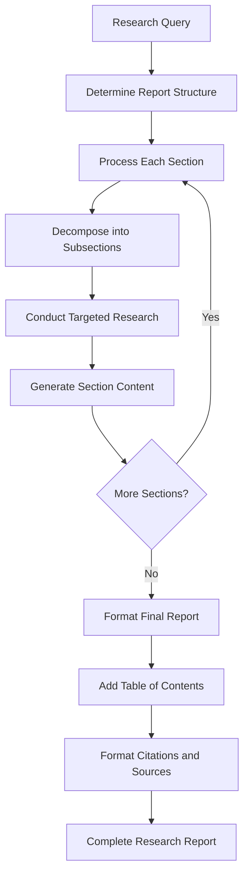
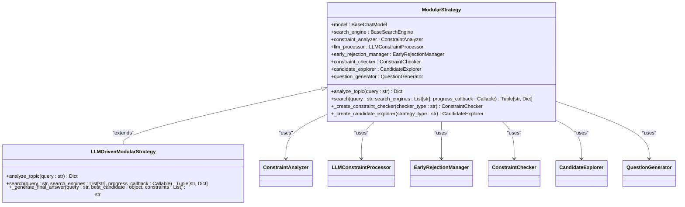
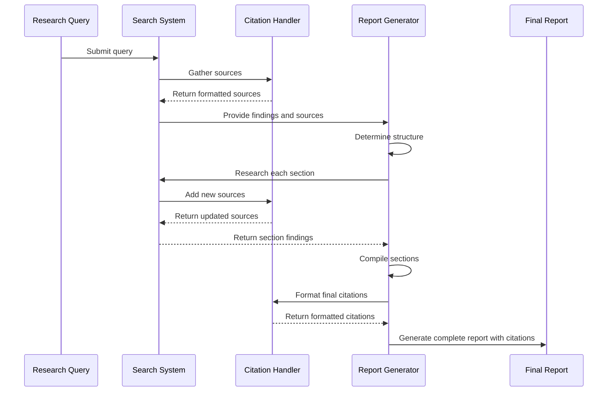

# Report Generation Mode

<cite>
**Referenced Files in This Document**   
- [report_generator.py](file://src/local_deep_research/report_generator.py)
- [search_system_factory.py](file://src/local_deep_research/search_system_factory.py)
- [search_system.py](file://src/local_deep_research/search_system.py)
- [modular_strategy.py](file://src/local_deep_research/advanced_search_system/strategies/modular_strategy.py)
- [llm_driven_modular_strategy.py](file://src/local_deep_research/advanced_search_system/strategies/llm_driven_modular_strategy.py)
- [citation_handler.py](file://src/local_deep_research/citation_handler.py)
- [default_settings.json](file://src/local_deep_research/defaults/default_settings.json)
- [advanced_features_example.py](file://examples/api_usage/programmatic/advanced_features_example.py)
</cite>

## Table of Contents
1. [Introduction](#introduction)
2. [Core Components](#core-components)
3. [Architecture Overview](#architecture-overview)
4. [Detailed Component Analysis](#detailed-component-analysis)
5. [Configuration Options](#configuration-options)
6. [Citation Handling](#citation-handling)
7. [Performance Characteristics](#performance-characteristics)
8. [Usage Examples](#usage-examples)
9. [Optimal Use Cases](#optimal-use-cases)

## Introduction
The Report Generation mode is a sophisticated research functionality designed to create structured, comprehensive reports on complex topics by systematically breaking them into logical sub-topics. This approach enables thorough exploration of multi-faceted queries by decomposing broad research questions into focused sub-questions, researching each component individually, and synthesizing the findings into a cohesive final report. The system leverages advanced search strategies, particularly the ModularStrategy and LLMDrivenModularStrategy classes, which implement a modular architecture for constraint checking and candidate exploration. These strategies work in conjunction with configurable parameters that control report structure, depth, and formatting. The implementation supports various citation styles and ensures proper source attribution throughout the research process. Due to its multi-phase nature involving multiple research iterations for different sections, the report generation process typically requires extended processing time compared to simpler research modes.

## Core Components
The Report Generation mode relies on several core components that work together to produce structured research reports. The IntegratedReportGenerator class serves as the primary orchestrator, coordinating the entire report generation process from structure determination to final formatting. It works in conjunction with specialized search strategies like ModularStrategy and LLMDrivenModularStrategy that decompose complex queries into logical sections for targeted research. The system utilizes a configurable citation framework that ensures proper source attribution according to specified formatting rules. The search system factory dynamically selects appropriate strategies based on query characteristics, while the report generator applies configurable templates to ensure consistent output formatting. These components work together to transform broad, multi-faceted queries into well-structured reports with clear sections, subsections, and properly attributed sources.

**Section sources**
- [report_generator.py](file://src/local_deep_research/report_generator.py#L1-L388)
- [search_system_factory.py](file://src/local_deep_research/search_system_factory.py#L1-L926)
- [modular_strategy.py](file://src/local_deep_research/advanced_search_system/strategies/modular_strategy.py#L1-L1145)
- [llm_driven_modular_strategy.py](file://src/local_deep_research/advanced_search_system/strategies/llm_driven_modular_strategy.py#L1-L866)

## Architecture Overview
The Report Generation mode follows a multi-phase architecture that systematically transforms a research query into a comprehensive report. The process begins with the IntegratedReportGenerator receiving a query and initial findings, then determining the optimal report structure through content analysis. This structure determination phase analyzes the research content to identify main themes and logical groupings, creating a table of contents with sections and subsections. Once the structure is established, the system enters the research phase, where it processes each section and subsection individually, conducting targeted searches to gather relevant information. The modular search strategies decompose the query into logical components, allowing for focused research on each sub-topic. After gathering information for all sections, the system formats the final report by combining the researched content with a table of contents and properly formatted sources. Throughout this process, the citation system tracks sources and ensures proper attribution in the final output.



**Diagram sources**
- [report_generator.py](file://src/local_deep_research/report_generator.py#L55-L69)
- [modular_strategy.py](file://src/local_deep_research/advanced_search_system/strategies/modular_strategy.py#L403-L787)

## Detailed Component Analysis

### Integrated Report Generator
The IntegratedReportGenerator class is the central component responsible for orchestrating the entire report generation process. It begins by analyzing the initial research findings and query to determine an optimal report structure, creating a logical organization of sections and subsections that best represents the content. The generator then coordinates the research of each section by leveraging the underlying search system to conduct targeted investigations. For each section, it configures the search parameters to focus on the specific sub-topic, ensuring depth and relevance of the gathered information. After researching all sections, the generator compiles the content into a cohesive report, adding a table of contents and properly formatted sources. The component is configurable through parameters like searches_per_section, which controls the research depth for each section, allowing users to balance comprehensiveness with processing time.

**Section sources**
- [report_generator.py](file://src/local_deep_research/report_generator.py#L23-L388)

### Modular Strategy Implementation
The ModularStrategy and LLMDrivenModularStrategy classes implement a sophisticated approach to query decomposition and research execution. These strategies break down complex queries into logical sections by analyzing constraints and identifying key components that need investigation. The modular architecture separates concerns into distinct components: constraint checking, candidate exploration, and evidence gathering. The LLMDrivenModularStrategy enhances this approach by using LLMs to intelligently decompose constraints into atomic, searchable elements and generate creative search combinations. This allows the system to explore multiple angles of a research question systematically. The strategies support various exploration approaches, including parallel, adaptive, constraint-guided, and diversity-based exploration, which can be selected based on the nature of the query. Early rejection mechanisms help optimize the search process by quickly eliminating candidates that don't meet basic criteria, improving efficiency.



**Diagram sources**
- [modular_strategy.py](file://src/local_deep_research/advanced_search_system/strategies/modular_strategy.py#L275-L787)
- [llm_driven_modular_strategy.py](file://src/local_deep_research/advanced_search_system/strategies/llm_driven_modular_strategy.py#L364-L787)

### Search System Integration
The search system integration enables the dynamic selection of appropriate research strategies based on query characteristics. The search system factory analyzes the query and context to determine whether a modular approach is suitable for broad, multi-faceted queries. When a comprehensive report is requested, the factory configures the search system with the ModularStrategy or LLMDrivenModularStrategy, setting appropriate parameters for constraint checking, candidate exploration, and early rejection. The integration maintains continuity between research phases by preserving questions and findings from initial research to avoid repetition. The search system coordinates with the report generator, providing access to gathered sources and research metadata that are incorporated into the final report. This seamless integration ensures that the research process is optimized for report generation, with appropriate search depth and breadth for each section of the report.

**Section sources**
- [search_system_factory.py](file://src/local_deep_research/search_system_factory.py#L25-L800)
- [search_system.py](file://src/local_deep_research/search_system.py#L20-L377)

## Configuration Options
The Report Generation mode offers several configuration options that allow users to customize the structure, depth, and formatting of generated reports. These options provide flexibility in balancing research comprehensiveness with processing time and output format preferences.

### Report Structure Template
The REPORT_STRUCTURE_TEMPLATE configuration determines the overall organization and formatting of the generated report. This template defines the hierarchy of sections and subsections, including heading levels, indentation, and organizational principles. It controls how the IntegratedReportGenerator analyzes content to determine the optimal structure, influencing whether the report follows a chronological, thematic, comparative, or other organizational approach. The template also specifies formatting rules for section headers, table of contents entries, and other structural elements, ensuring consistency across generated reports.

### Maximum Subtopics
The MAX_SUBTOPICS parameter controls the maximum number of subsections that can be created within each main section of the report. This setting helps prevent excessive fragmentation of content while ensuring sufficient depth of coverage. A higher value allows for more detailed exploration of complex topics by breaking them into finer subtopics, while a lower value results in broader sections with less granularity. This parameter works in conjunction with the research depth settings to balance comprehensiveness with readability and processing efficiency.

### Citation Style
The CITATION_STYLE configuration determines how sources are attributed within the report. Multiple citation formats are supported, including numbered citations with hyperlinks, domain-based citations, and various combinations of numbering and hyperlinking. The style affects both in-text citations and the final sources section, ensuring consistent formatting throughout the document. Users can select the citation style that best fits their needs, whether for academic writing, professional reports, or general reference purposes.

**Section sources**
- [default_settings.json](file://src/local_deep_research/defaults/default_settings.json#L613-L698)
- [report_generator.py](file://src/local_deep_research/report_generator.py#L51-L53)

## Citation Handling
The citation system ensures proper attribution of sources throughout the research process and in the final report. The CitationHandler class serves as a configurable wrapper that delegates to specific citation implementations based on the selected style. This system tracks all sources encountered during the research process, maintaining a comprehensive record of references that are properly formatted according to the specified citation style. The handler integrates with the report generator to ensure that in-text citations correspond correctly to entries in the sources section. Different citation handlers support various formatting approaches, from simple numbered citations to more sophisticated domain-based attribution. The system prevents duplication of sources and ensures that all cited references are accurately represented in the final output, maintaining academic and professional standards for source attribution.



**Diagram sources**
- [citation_handler.py](file://src/local_deep_research/citation_handler.py#L8-L107)
- [report_generator.py](file://src/local_deep_research/report_generator.py#L357-L369)

## Performance Characteristics
The Report Generation mode exhibits distinct performance characteristics due to its multi-phase, comprehensive research approach. The most notable characteristic is extended processing time, which results from multiple research phases for different sections and subsections of the report. Each section typically requires multiple searches, with the default configuration performing two searches per section, significantly increasing the total research time compared to single-phase queries. The system's modular architecture, while enhancing research quality, adds computational overhead through constraint checking, candidate evaluation, and early rejection mechanisms. Memory usage is higher than simpler research modes due to the need to maintain state across multiple research phases and store intermediate findings for all sections. The performance scales with report complexity, where queries requiring more sections and subsections naturally take longer to process. Despite these demands, the system implements optimization techniques like early rejection of poor candidates and parallel processing where possible to mitigate performance impacts.

**Section sources**
- [report_generator.py](file://src/local_deep_research/report_generator.py#L26-L28)
- [modular_strategy.py](file://src/local_deep_research/advanced_search_system/strategies/modular_strategy.py#L504-L562)

## Usage Examples
The Report Generation mode can be utilized through both programmatic and interactive interfaces. In programmatic usage, the generate_report function provides a straightforward API for creating comprehensive reports. Users specify the research query, optional output file path, and configuration parameters such as searches_per_section to control research depth. The function returns a structured result containing the report content, metadata, and file path if saved. For interactive use, the system integrates with the web interface, where users can initiate report generation through a dedicated mode that guides them through configuration options. The example implementation demonstrates generating a report on "Applications of Machine Learning in Healthcare" with multiple searches per section to ensure depth of coverage. The system automatically handles the entire process from structure determination to final formatting, producing a markdown report with proper citations and sources.

```mermaid
flowchart TD
A[User Input] --> B{Programmatic or UI?}
B --> |Programmatic| C[Call generate_report()]
B --> |Web Interface| D[Select Report Mode]
C --> E[Configure Parameters]
D --> E
E --> F[Generate Report Structure]
F --> G[Research Each Section]
G --> H[Compile Report Content]
H --> I[Format Citations]
I --> J[Save and Return Report]
J --> K[Output: Markdown File]
```

**Diagram sources**
- [advanced_features_example.py](file://examples/api_usage/programmatic/advanced_features_example.py#L23-L78)
- [research_service.py](file://src/local_deep_research/web/services/research_service.py#L1180-L1200)

## Optimal Use Cases
The Report Generation mode is particularly well-suited for complex research tasks that benefit from structured, comprehensive analysis. Literature reviews represent an ideal use case, where the system can systematically explore multiple aspects of a research field, organize findings into thematic sections, and properly attribute all sources. Market analysis reports are another optimal application, as the mode can investigate various market segments, competitive landscapes, and trends, presenting them in a well-organized format. Technical overviews of complex subjects, such as emerging technologies or scientific domains, benefit from the mode's ability to break down intricate topics into manageable sections. Comprehensive summaries of broad subjects, policy analyses, and comparative studies also leverage the strengths of this mode. The structured approach ensures that all relevant aspects of a multifaceted topic are thoroughly investigated and presented in a coherent, easy-to-navigate format, making it invaluable for research that requires depth, organization, and proper source attribution.

**Section sources**
- [advanced_features_example.py](file://examples/api_usage/programmatic/advanced_features_example.py#L23-L78)
- [report_generator.py](file://src/local_deep_research/report_generator.py#L55-L69)