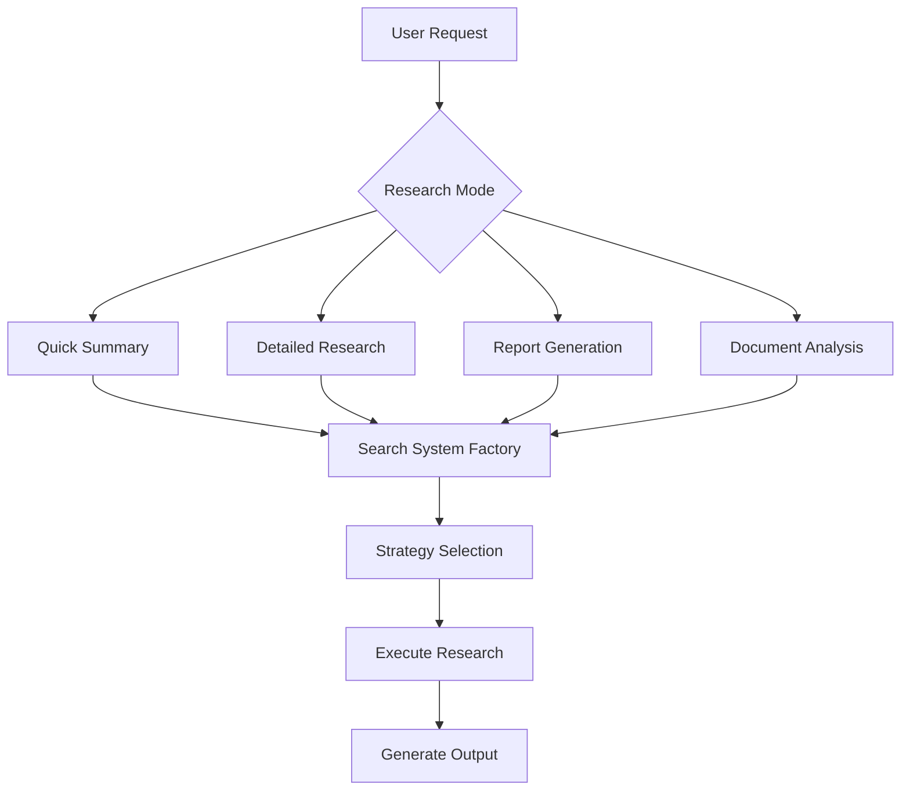
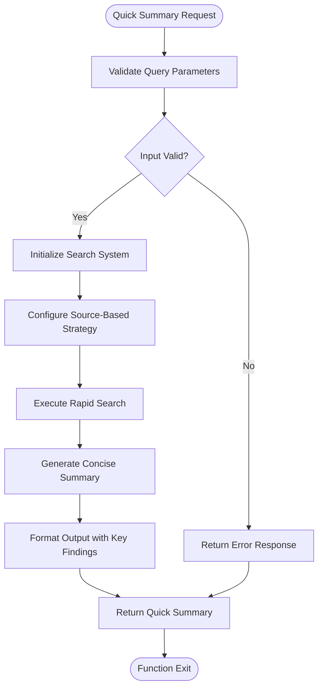
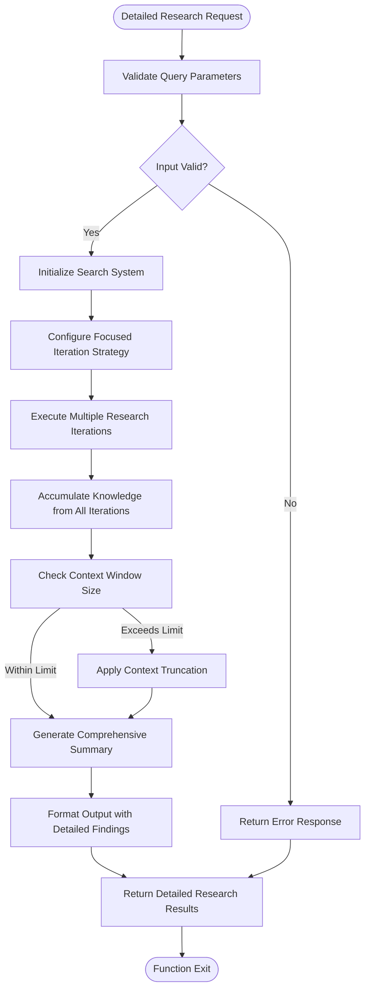
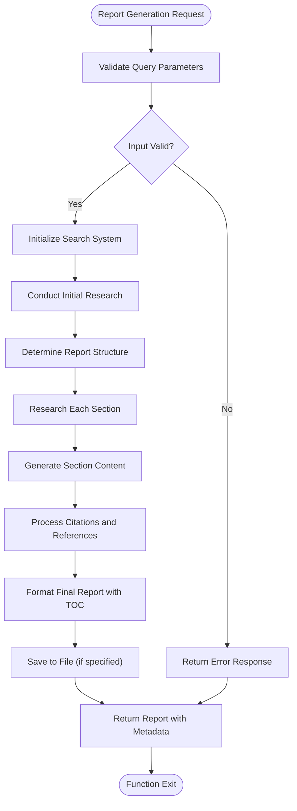
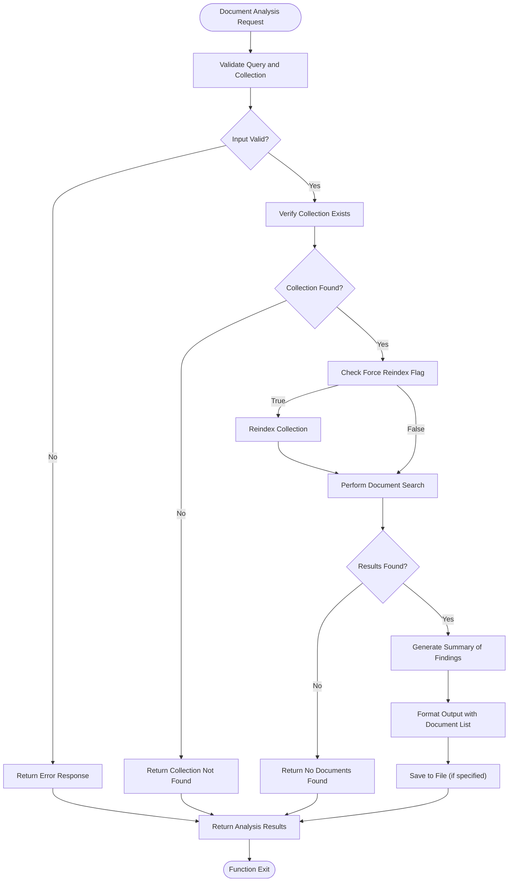
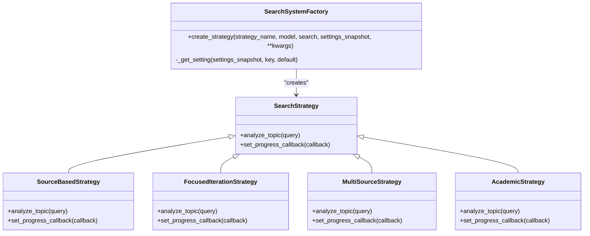
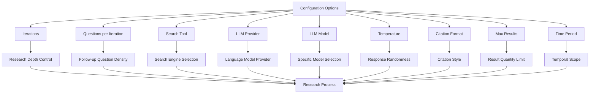
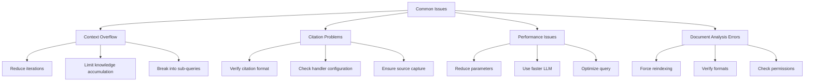

# Research Modes

<cite>
**Referenced Files in This Document**   
- [search_system_factory.py](file://src/local_deep_research/search_system_factory.py)
- [search_system.py](file://src/local_deep_research/search_system.py)
- [research_routes.py](file://src/local_deep_research/web/routes/research_routes.py)
- [research_functions.py](file://src/local_deep_research/api/research_functions.py)
- [report_generator.py](file://src/local_deep_research/report_generator.py)
- [citation_handler.py](file://src/local_deep_research/citation_handler.py)
- [research.html](file://src/local_deep_research/web/templates/pages/research.html)
</cite>

## Table of Contents
1. [Introduction](#introduction)
2. [Research Mode Overview](#research-mode-overview)
3. [Quick Summary Mode](#quick-summary-mode)
4. [Detailed Research Mode](#detailed-research-mode)
5. [Report Generation Mode](#report-generation-mode)
6. [Document Analysis Mode](#document-analysis-mode)
7. [Search System Factory](#search-system-factory)
8. [Configuration Options](#configuration-options)
9. [Performance Characteristics](#performance-characteristics)
10. [Usage Examples](#usage-examples)
11. [Common Issues and Troubleshooting](#common-issues-and-troubleshooting)
12. [Mode Selection Guidance](#mode-selection-guidance)

## Introduction

The Local Deep Research system provides four primary research modes to accommodate different user needs and query complexities. These modes—Quick Summary, Detailed Research, Report Generation, and Document Analysis—offer varying levels of depth, output formats, and performance characteristics. Each mode leverages a sophisticated search system factory that selects appropriate strategies based on the selected mode, configuration options, and user requirements. This document explains the purpose, implementation, and optimal use cases for each research mode, along with configuration options, expected output formats, and performance characteristics.

**Section sources**
- [search_system.py](file://src/local_deep_research/search_system.py#L25-L83)
- [research_routes.py](file://src/local_deep_research/web/routes/research_routes.py#L129-L706)

## Research Mode Overview

The research modes in the Local Deep Research system are designed to provide flexible research capabilities for different use cases. The system implements a factory pattern through the search system factory that creates appropriate search strategies based on the selected mode. Each mode serves a specific purpose:

- **Quick Summary**: Provides rapid, concise answers to simple queries
- **Detailed Research**: Conducts in-depth analysis with comprehensive findings
- **Report Generation**: Creates structured, comprehensive research reports
- **Document Analysis**: Analyzes content within local document collections

These modes are accessible through both the web interface and programmatic API, allowing users to select the appropriate mode based on their specific requirements. The search system factory determines the optimal strategy for each mode, configuring parameters such as iterations, questions per iteration, and citation handling.



**Diagram sources**
- [search_system_factory.py](file://src/local_deep_research/search_system_factory.py#L25-L800)
- [search_system.py](file://src/local_deep_research/search_system.py#L25-L83)

**Section sources**
- [search_system_factory.py](file://src/local_deep_research/search_system_factory.py#L25-L800)
- [research.html](file://src/local_deep_research/web/templates/pages/research.html#L51-L71)

## Quick Summary Mode

Quick Summary mode is designed for generating concise, rapid responses to straightforward queries. This mode prioritizes speed and efficiency, making it ideal for users who need quick answers without extensive analysis. The mode is accessible through the web interface with a lightning bolt icon, indicating its fast nature.

When invoked, Quick Summary mode uses the `quick_summary` function from the research API, which initializes the search system with minimal iterations and a focus on rapid response generation. The mode typically completes within a few minutes, as indicated in the web interface. It employs a source-based strategy by default, focusing on extracting key information from relevant sources without extensive follow-up questions.

The output format consists of a concise summary text, along with basic findings, iterations performed, and generated questions. This mode is particularly effective for factual queries, definitions, and simple informational requests where depth is less important than speed.



**Diagram sources**
- [research_functions.py](file://src/local_deep_research/api/research_functions.py#L149-L247)
- [research.html](file://src/local_deep_research/web/templates/pages/research.html#L51-L58)

**Section sources**
- [research_functions.py](file://src/local_deep_research/api/research_functions.py#L149-L247)
- [research.html](file://src/local_deep_research/web/templates/pages/research.html#L51-L58)

## Detailed Research Mode

Detailed Research mode provides in-depth analysis for complex queries requiring comprehensive exploration. This mode is designed for users who need thorough investigation of a topic, with multiple iterations of research and extensive follow-up questions. The web interface represents this mode with a microscope icon, symbolizing its detailed nature.

When activated, Detailed Research mode uses the `detailed_research` function from the research API, which configures the search system for comprehensive analysis. The mode typically employs a focused iteration strategy with multiple iterations and questions per iteration, allowing for deep exploration of the topic. It maintains a persistent knowledge base throughout the research process, accumulating information from each iteration.

The output format includes a detailed summary, comprehensive findings, iteration count, generated questions, formatted findings, and all source links. This mode is particularly effective for complex topics, research questions requiring synthesis of multiple sources, and analytical queries that benefit from iterative refinement.

A key consideration for this mode is context overflow, which can occur when the accumulated knowledge exceeds the LLM's context window. The system implements safeguards to manage context size, but users should be aware of this limitation when researching extensive topics.



**Diagram sources**
- [research_functions.py](file://src/local_deep_research/api/research_functions.py#L444-L526)
- [research.html](file://src/local_deep_research/web/templates/pages/research.html#L60-L67)

**Section sources**
- [research_functions.py](file://src/local_deep_research/api/research_functions.py#L444-L526)
- [research.html](file://src/local_deep_research/web/templates/pages/research.html#L60-L67)

## Report Generation Mode

Report Generation mode creates structured, comprehensive research reports suitable for formal documentation and presentation. This mode goes beyond simple summarization by organizing findings into a coherent report with a table of contents, sections, and proper citations. The output follows a markdown format that can be easily converted to other document formats.

The mode leverages the `generate_report` function from the research API, which utilizes the `IntegratedReportGenerator` class to create structured reports. The process begins with initial research to gather comprehensive information, followed by analysis to determine the optimal report structure. The system then conducts targeted research for each section and subsection, ensuring depth and relevance.

A critical aspect of this mode is citation handling, which is managed through the citation handler system. The report generator automatically formats citations according to the configured citation format (number hyperlinks, domain hyperlinks, etc.) and includes a sources section with all referenced materials. Users can configure the citation format in the settings, with options including number hyperlinks, domain hyperlinks, and no hyperlinks.

The output format includes the full report content in markdown, metadata with generation timestamp and query information, and optionally a file path if the report is saved to disk. This mode is particularly effective for academic research, business reports, and any scenario requiring formal documentation.



**Diagram sources**
- [research_functions.py](file://src/local_deep_research/api/research_functions.py#L309-L441)
- [report_generator.py](file://src/local_deep_research/report_generator.py#L23-L381)

**Section sources**
- [research_functions.py](file://src/local_deep_research/api/research_functions.py#L309-L441)
- [report_generator.py](file://src/local_deep_research/report_generator.py#L23-L381)

## Document Analysis Mode

Document Analysis mode specializes in searching and analyzing content within local document collections. This mode is designed for users who need to extract information from their own document repositories, such as research papers, technical documentation, or business records.

The mode is implemented through the `analyze_documents` function in the research API, which searches specified collections and generates summaries of the findings. Users specify the query and collection name, with options to control the number of results, LLM temperature for summary generation, and whether to force reindexing of the collection.

When executed, the mode first retrieves the specified document collection and performs a search using the provided query. It then uses the LLM to generate a concise summary of the key information found in the documents. The output includes the summary text, a list of matching documents with their content and metadata, and collection information.

This mode is particularly effective for knowledge management, literature reviews, and information retrieval from personal or organizational document repositories. It supports various document formats and can be configured to automatically index new documents as they are added to the collection.



**Diagram sources**
- [research_functions.py](file://src/local_deep_research/api/research_functions.py#L528-L657)

**Section sources**
- [research_functions.py](file://src/local_deep_research/api/research_functions.py#L528-L657)

## Search System Factory

The search system factory is a central component that creates and configures appropriate search strategies based on the selected research mode. Implemented in the `search_system_factory.py` file, this factory pattern provides a centralized way to instantiate different search strategies while avoiding code duplication.

The factory's `create_strategy` function accepts parameters including the strategy name, language model, search engine instance, and settings snapshot. Based on the strategy name, it imports and instantiates the appropriate strategy class with configuration parameters derived from the settings snapshot and provided arguments.

For Quick Summary mode, the factory typically creates a source-based strategy with minimal iterations. For Detailed Research mode, it creates a focused iteration strategy with higher iteration counts. Report Generation mode may use a specialized strategy that supports structured output, while Document Analysis mode uses collection-specific search strategies.

The factory also handles strategy-specific configuration options, such as adaptive questions, knowledge summary limits, and snippet truncation lengths. These parameters are read from the settings snapshot with the ability to override via function arguments, providing flexibility in strategy configuration.



**Diagram sources**
- [search_system_factory.py](file://src/local_deep_research/search_system_factory.py#L25-L800)

**Section sources**
- [search_system_factory.py](file://src/local_deep_research/search_system_factory.py#L25-L800)

## Configuration Options

Each research mode supports various configuration options that allow users to customize the research process according to their specific needs. These options can be set through the web interface or programmatically via the API.

Key configuration parameters include:
- **Iterations**: Controls the number of research cycles to perform
- **Questions per iteration**: Determines how many follow-up questions are generated in each cycle
- **Search tool**: Specifies the search engine to use (e.g., searxng, google, wikipedia)
- **LLM provider and model**: Selects the language model provider and specific model
- **Temperature**: Controls the randomness of LLM responses (0.0-1.0)
- **Citation format**: Configures how citations are formatted in the output

These options are accessible in the advanced options panel of the web interface and can be passed as parameters to the API functions. The system uses a settings snapshot mechanism to capture the complete configuration state, ensuring consistency across different components of the research process.



**Section sources**
- [research.html](file://src/local_deep_research/web/templates/pages/research.html#L154-L163)
- [research_functions.py](file://src/local_deep_research/api/research_functions.py#L23-L42)

## Performance Characteristics

Each research mode exhibits distinct performance characteristics in terms of execution time, resource usage, and output quality. Understanding these characteristics helps users select the appropriate mode for their specific requirements.

**Quick Summary mode** offers the fastest performance, typically completing within a few minutes. It uses minimal iterations and focuses on rapid response generation, resulting in lower token consumption and faster response times. This mode is ideal for simple queries where speed is prioritized over depth.

**Detailed Research mode** requires significantly more time and resources due to its multiple iterations and comprehensive analysis. Execution time can range from several minutes to over an hour for complex topics. This mode consumes more tokens and requires more computational resources but provides deeper insights and more thorough analysis.

**Report Generation mode** has performance characteristics similar to Detailed Research mode but with additional overhead for structuring the output and formatting citations. The time required depends on the number of sections and the depth of research needed for each section.

**Document Analysis mode** performance varies based on the size of the document collection and whether reindexing is required. Searching an already-indexed collection is relatively fast, while reindexing large collections can be time-consuming.

```mermaid
graph TD
A[Performance Characteristics] --> B[Quick Summary]
A --> C[Detailed Research]
A --> D[Report Generation]
A --> E[Document Analysis]
B --> F[Speed: Fast (minutes)]
B --> G[Tokens: Low]
B --> H[Depth: Shallow]
B --> I[Use Case: Simple queries]
C --> J[Speed: Slow (minutes to hours)]
C --> K[Tokens: High]
C --> L[Depth: Deep]
C --> M[Use Case: Complex analysis]
D --> N[Speed: Slow (minutes to hours)]
D --> O[Tokens: High]
D --> P[Depth: Deep]
D --> Q[Use Case: Formal reports]
E --> R[Speed: Variable]
E --> S[Tokens: Medium]
E --> T[Depth: Collection-dependent]
E --> U[Use Case: Document repositories]
```

**Section sources**
- [metrics/token_counter.py](file://src/local_deep_research/metrics/token_counter.py#L1578-L1601)
- [research.html](file://src/local_deep_research/web/templates/pages/research.html#L56-L66)

## Usage Examples

The research modes can be invoked through both the web interface and programmatic API. The following examples demonstrate how to use each mode:

**Web Interface Usage:**
- Quick Summary: Select the lightning bolt icon and enter a query
- Detailed Research: Select the microscope icon and enter a complex query
- Report Generation: Use the advanced options to configure report parameters
- Document Analysis: Specify a collection name in the search parameters

**Programmatic API Usage:**

```python
# Quick Summary example
result = quick_summary(
    query="What is quantum computing?",
    iterations=1,
    search_tool="wikipedia",
    programmatic_mode=True
)

# Detailed Research example
result = detailed_research(
    query="Impact of climate change on agriculture",
    iterations=5,
    questions_per_iteration=3,
    programmatic_mode=True
)

# Report Generation example
report = generate_report(
    query="Future of artificial intelligence",
    output_file="ai_future_report.md",
    searches_per_section=2,
    programmatic_mode=True
)

# Document Analysis example
analysis = analyze_documents(
    query="machine learning algorithms",
    collection_name="research_papers",
    max_results=10,
    output_file="ml_analysis.md"
)
```

These examples demonstrate the flexibility of the API, allowing users to customize parameters such as iterations, search tools, and output destinations according to their specific needs.

**Section sources**
- [research_functions.py](file://src/local_deep_research/api/research_functions.py#L149-L657)
- [simple_programmatic_example.py](file://examples/api_usage/programmatic/simple_programmatic_example.py#L42-L79)

## Common Issues and Troubleshooting

Users may encounter several common issues when using the research modes, particularly in Detailed Research and Report Generation modes.

**Context Overflow in Detailed Research Mode:**
This occurs when the accumulated knowledge exceeds the LLM's context window. Symptoms include truncated responses or errors during the research process. Solutions include:
- Reducing the number of iterations
- Using the `knowledge_summary_limit` parameter to limit knowledge accumulation
- Breaking complex queries into smaller sub-queries

**Citation Handling in Report Generation Mode:**
Issues may arise with citation formatting or missing sources. These can be addressed by:
- Verifying the citation format setting in the configuration
- Ensuring the citation handler is properly configured
- Checking that all sources are properly captured in the research process

**Performance Issues:**
Slow execution or timeouts can occur with complex queries. Mitigation strategies include:
- Reducing iterations and questions per iteration
- Using a faster LLM provider
- Optimizing the query for better search results

**Document Analysis Issues:**
Problems with document indexing or search results can be resolved by:
- Forcing reindexing of the collection
- Verifying document formats are supported
- Checking file permissions for the document repository



**Section sources**
- [test_context_overflow.js](file://tests/ui_tests/test_context_overflow.js)
- [citation_handler.py](file://src/local_deep_research/citation_handler.py#L8-L107)

## Mode Selection Guidance

Selecting the appropriate research mode depends on several factors including query complexity, desired output depth, and time constraints. The following guidance helps users choose the most suitable mode:

**Use Quick Summary Mode when:**
- You need a rapid answer to a simple question
- The query is factual or definitional
- Time is a critical factor
- You want a concise overview rather than detailed analysis

**Use Detailed Research Mode when:**
- The query is complex and requires in-depth analysis
- You need comprehensive findings with multiple perspectives
- The topic benefits from iterative exploration
- You are conducting thorough research on a subject

**Use Report Generation Mode when:**
- You need a structured, formal document
- The output will be shared with others
- You require proper citations and references
- The research will be used for academic or professional purposes

**Use Document Analysis Mode when:**
- You need to search within your own document collections
- The information is contained in local files rather than web sources
- You are conducting literature reviews or knowledge management
- You need to analyze specific documents or papers

The system's search strategy selection also plays a role in mode effectiveness. Source-based strategies work well for comprehensive research, while focused iteration strategies are better for precise Q&A. Users should consider both the mode and underlying strategy when planning their research approach.

**Section sources**
- [research.html](file://src/local_deep_research/web/templates/pages/research.html#L51-L67)
- [search_system.py](file://src/local_deep_research/search_system.py#L47-L68)