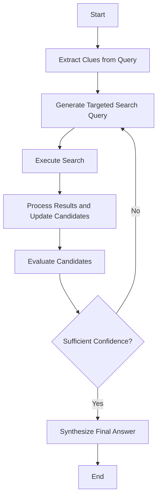
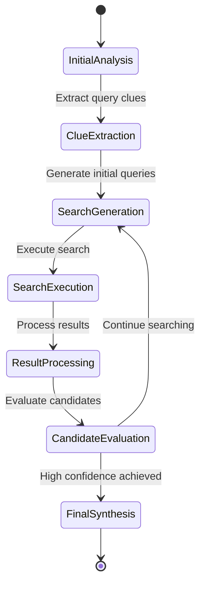
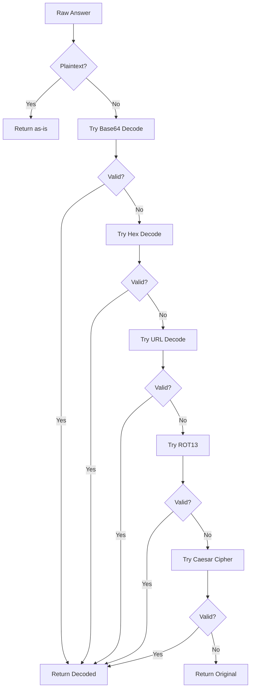
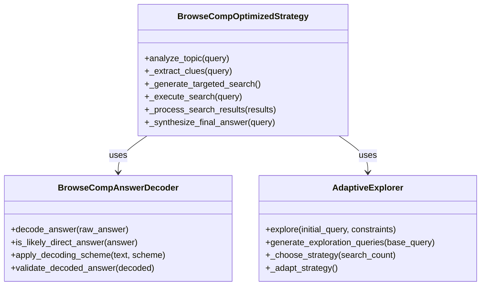
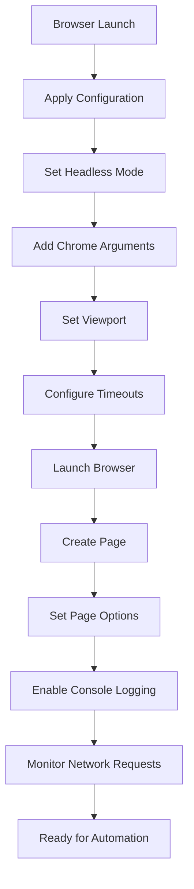
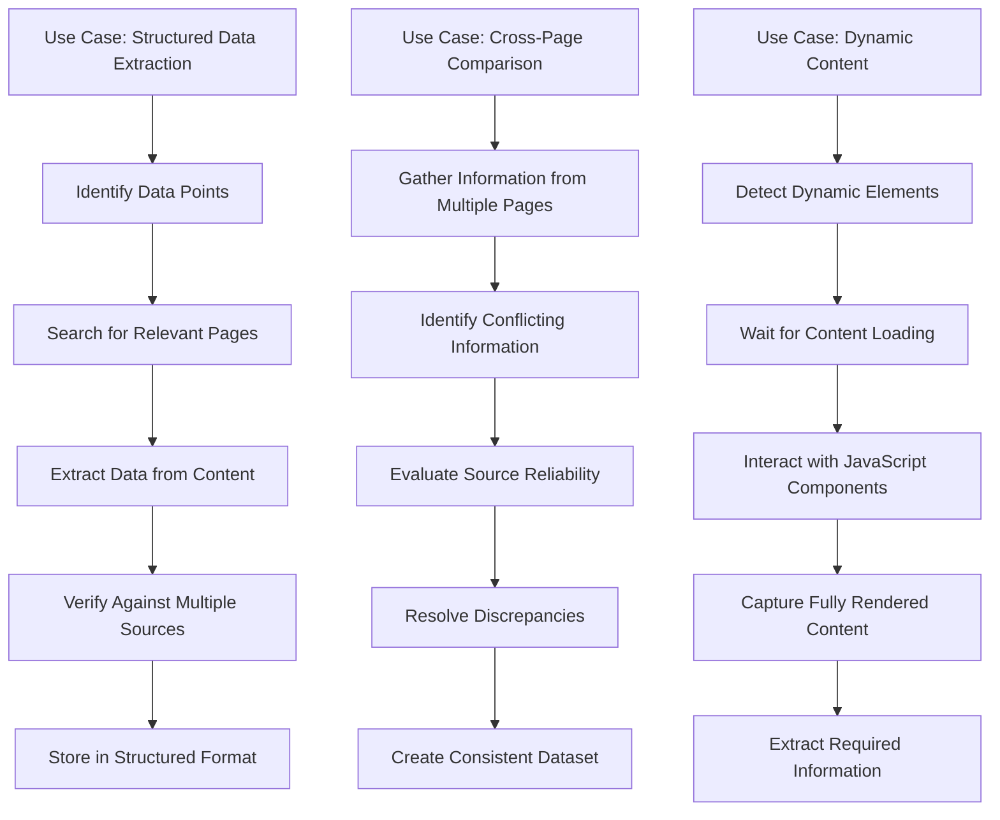
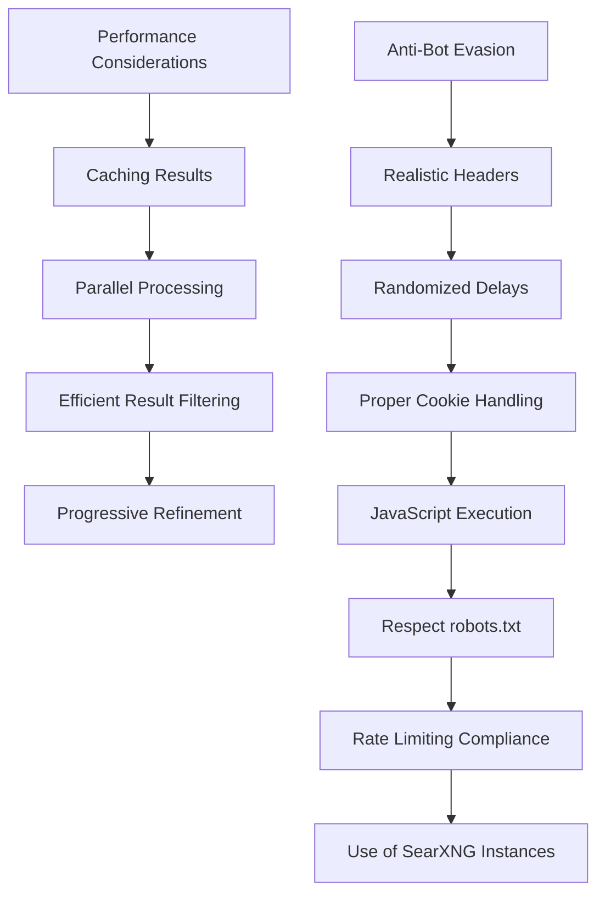

# BrowseComp Optimized Strategy

<cite>
**Referenced Files in This Document**   
- [browsecomp_optimized_strategy.py](file://src/local_deep_research/advanced_search_system/strategies/browsecomp_optimized_strategy.py)
- [browsecomp_answer_decoder.py](file://src/local_deep_research/advanced_search_system/answer_decoding/browsecomp_answer_decoder.py)
- [adaptive_explorer.py](file://src/local_deep_research/advanced_search_system/candidate_exploration/adaptive_explorer.py)
- [browsecomp_question.py](file://src/local_deep_research/advanced_search_system/questions/browsecomp_question.py)
- [search_engine_factory.py](file://src/local_deep_research/web_search_engines/search_engine_factory.py)
- [search_engine_searxng.py](file://src/local_deep_research/web_search_engines/engines/search_engine_searxng.py)
</cite>

## Table of Contents
1. [Introduction](#introduction)
2. [Core Components](#core-components)
3. [Navigation and State Management](#navigation-and-state-management)
4. [Content Extraction and Answer Decoding](#content-extraction-and-answer-decoding)
5. [Integration with browsecomp_answer_decoder and adaptive_explorer](#integration-with-browsecomp_answer_decoder-and-adaptive_explorer)
6. [Browser Automation and Configuration](#browser-automation-and-configuration)
7. [Use Cases](#use-cases)
8. [Performance Considerations and Anti-Bot Evasion](#performance-considerations-and-anti-bot-evasion)
9. [Conclusion](#conclusion)

## Introduction
The BrowseComp Optimized Strategy is a specialized approach designed to solve complex web browsing and information extraction challenges. This strategy systematically analyzes queries, extracts specific clues, and conducts targeted searches to identify precise answers. It is particularly effective for puzzle-style queries that require matching multiple clues to find a location, person, or event.

The strategy integrates with various components including the `browsecomp_answer_decoder` for handling encoded answers and the `adaptive_explorer` for dynamically adjusting search approaches based on success rates. It also incorporates browser automation settings and timeout management to ensure robust web interactions.

**Section sources**
- [browsecomp_optimized_strategy.py](file://src/local_deep_research/advanced_search_system/strategies/browsecomp_optimized_strategy.py#L1-L780)

## Core Components
The BrowseComp Optimized Strategy consists of several key components that work together to solve complex queries:

1. **QueryClues**: Extracts specific clues from the query including location, temporal, numerical, name, incident, and comparison clues.
2. **Main Search Loop**: Conducts systematic searches using progressively refined queries based on accumulated knowledge.
3. **Candidate Management**: Tracks potential answers with confidence scores and matched clues.
4. **Final Answer Synthesis**: Generates a comprehensive final answer with explanation and confidence rating.

The strategy follows a structured approach with an initial analysis phase, followed by iterative search cycles, and concludes with final answer synthesis. Each iteration builds upon previous findings to progressively narrow down candidates.

**Diagram sources**
- [browsecomp_optimized_strategy.py](file://src/local_deep_research/advanced_search_system/strategies/browsecomp_optimized_strategy.py#L1-L780)

**Section sources**
- [browsecomp_optimized_strategy.py](file://src/local_deep_research/advanced_search_system/strategies/browsecomp_optimized_strategy.py#L1-L780)

## Navigation and State Management
The BrowseComp Optimized Strategy employs a systematic approach to navigation and state management across web pages. It maintains several state variables throughout the search process:

- **search_history**: Tracks all search queries executed
- **candidates**: Maintains a list of potential answers with confidence scores
- **confirmed_info**: Stores verified facts that match query clues
- **iteration**: Counts the number of search iterations completed

The strategy uses a progressive refinement approach, starting with broad searches and gradually narrowing the focus based on findings. Each search iteration builds upon the previous one, incorporating new information to generate more targeted queries.

State transitions occur through the main search loop, which continues until sufficient confidence is achieved or the maximum number of iterations is reached. The strategy evaluates candidates based on confidence scores and the proportion of clues matched, allowing it to determine when a satisfactory answer has been found.

**Diagram sources**
- [browsecomp_optimized_strategy.py](file://src/local_deep_research/advanced_search_system/strategies/browsecomp_optimized_strategy.py#L1-L780)

**Section sources**
- [browsecomp_optimized_strategy.py](file://src/local_deep_research/advanced_search_system/strategies/browsecomp_optimized_strategy.py#L1-L780)

## Content Extraction and Answer Decoding
The BrowseComp Optimized Strategy includes sophisticated content extraction and answer decoding capabilities. When processing search results, it extracts specific information about potential answers, including:

- **Specific names**: Place names, trail names, or landmarks mentioned
- **Confirmed facts**: Facts that match the query clues
- **New candidates**: Potential answers with confidence scores
- **Eliminated candidates**: Answers that can be ruled out

The strategy works in conjunction with the `browsecomp_answer_decoder` component, which handles encoded answers found in BrowseComp datasets. This decoder supports multiple encoding schemes including base64, hex, URL encoding, ROT13, and Caesar cipher. It automatically detects the encoding type and attempts to decode the answer, validating the decoded text to ensure it appears to be a reasonable answer.

The answer decoding process involves:
1. Checking if the answer appears to be plaintext
2. Attempting to decode using various schemes
3. Validating the decoded answer for readability and reasonableness
4. Returning the original answer if decoding fails

**Diagram sources**
- [browsecomp_answer_decoder.py](file://src/local_deep_research/advanced_search_system/answer_decoding/browsecomp_answer_decoder.py#L1-L423)
- [browsecomp_optimized_strategy.py](file://src/local_deep_research/advanced_search_system/strategies/browsecomp_optimized_strategy.py#L1-L780)

**Section sources**
- [browsecomp_answer_decoder.py](file://src/local_deep_research/advanced_search_system/answer_decoding/browsecomp_answer_decoder.py#L1-L423)
- [browsecomp_optimized_strategy.py](file://src/local_deep_research/advanced_search_system/strategies/browsecomp_optimized_strategy.py#L1-L780)

## Integration with browsecomp_answer_decoder and adaptive_explorer
The BrowseComp Optimized Strategy integrates seamlessly with the `browsecomp_answer_decoder` and `adaptive_explorer` components to enhance its web interaction capabilities.

The integration with `browsecomp_answer_decoder` ensures that encoded answers are properly decoded before being presented as final results. This is particularly important for BrowseComp datasets where answers may appear in encoded form (e.g., "Y00Qh+ep"). The strategy automatically passes potential answers through the decoder to extract the actual answer content.

The integration with `adaptive_explorer` enables dynamic adjustment of search strategies based on performance. The adaptive explorer tracks the success rate of different search approaches and adapts future searches accordingly. It tries various search strategies such as direct search, synonym expansion, category exploration, and related terms, tracking which approaches yield the most candidates.

The strategy uses the adaptive explorer to:
- Generate exploration queries using the most productive approaches
- Track strategy performance metrics (attempts, candidates found, quality)
- Adapt the current strategy based on success rates
- Focus effort on the most effective search methods

This integration allows the BrowseComp Optimized Strategy to learn from its search results and continuously improve its effectiveness throughout the search process.

**Diagram sources**
- [browsecomp_optimized_strategy.py](file://src/local_deep_research/advanced_search_system/strategies/browsecomp_optimized_strategy.py#L1-L780)
- [browsecomp_answer_decoder.py](file://src/local_deep_research/advanced_search_system/answer_decoding/browsecomp_answer_decoder.py#L1-L423)
- [adaptive_explorer.py](file://src/local_deep_research/advanced_search_system/candidate_exploration/adaptive_explorer.py#L1-L330)

**Section sources**
- [browsecomp_optimized_strategy.py](file://src/local_deep_research/advanced_search_system/strategies/browsecomp_optimized_strategy.py#L1-L780)
- [browsecomp_answer_decoder.py](file://src/local_deep_research/advanced_search_system/answer_decoding/browsecomp_answer_decoder.py#L1-L423)
- [adaptive_explorer.py](file://src/local_deep_research/advanced_search_system/candidate_exploration/adaptive_explorer.py#L1-L330)

## Browser Automation and Configuration
The BrowseComp Optimized Strategy incorporates comprehensive browser automation settings and timeout management to ensure robust web interactions. The system uses Puppeteer for browser automation with specific configurations to prevent interruptions and optimize performance.

Key browser automation settings include:
- **Headless mode**: Configurable based on environment (headless in CI, non-headless otherwise)
- **Chrome arguments**: Various flags to disable features that could interrupt automation
- **Viewport settings**: Consistent screen size for reliable rendering
- **Timeout management**: Configurable timeouts for page loading and operations

The browser configuration disables various Chrome features that could interfere with automation, such as:
- Bookmark prompts
- Password saving bubbles
- Popup blocking
- Background networking
- Crash reporting

Timeout settings are carefully managed to balance responsiveness with the need to wait for dynamic content to load. The system uses network idle detection rather than fixed timeouts to ensure pages are fully loaded before proceeding.

**Diagram sources**
- [browsecomp_optimized_strategy.py](file://src/local_deep_research/advanced_search_system/strategies/browsecomp_optimized_strategy.py#L1-L780)
- [search_engine_factory.py](file://src/local_deep_research/web_search_engines/search_engine_factory.py#L1-L619)
- [search_engine_searxng.py](file://src/local_deep_research/web_search_engines/engines/search_engine_searxng.py#L1-L300)

**Section sources**
- [browsecomp_optimized_strategy.py](file://src/local_deep_research/advanced_search_system/strategies/browsecomp_optimized_strategy.py#L1-L780)
- [search_engine_factory.py](file://src/local_deep_research/web_search_engines/search_engine_factory.py#L1-L619)
- [search_engine_searxng.py](file://src/local_deep_research/web_search_engines/engines/search_engine_searxng.py#L1-L300)

## Use Cases
The BrowseComp Optimized Strategy is designed for several key use cases involving web browsing and information extraction:

### Extracting Structured Data from Websites
The strategy excels at extracting structured data from websites by systematically identifying and verifying specific pieces of information. It can extract data such as:
- Statistical figures and numerical data
- Temporal information (dates, time periods)
- Geographical locations and landmarks
- Names of people, organizations, or entities
- Relationships between different data points

For example, when asked to find information about a specific event, the strategy extracts all relevant clues from the query, searches for pages containing these clues, and verifies the information against multiple sources.

### Comparing Information Across Pages
The strategy can compare information across multiple pages to identify consistent facts and resolve discrepancies. It maintains a knowledge base of confirmed facts and evaluates new information against this base. When conflicting information is found, the strategy can:
- Prioritize information from more authoritative sources
- Consider the recency of the information
- Evaluate the context in which the information appears
- Use confidence scores to weigh conflicting claims

### Handling Dynamic Content
The strategy is equipped to handle dynamic content that loads asynchronously or requires user interaction. It uses browser automation to:
- Wait for dynamic content to load
- Interact with JavaScript elements
- Navigate through pagination
- Handle modal dialogs and popups

The system can detect when content is loaded via AJAX calls and wait for the network to become idle before proceeding, ensuring that all dynamic content is captured.

**Diagram sources**
- [browsecomp_optimized_strategy.py](file://src/local_deep_research/advanced_search_system/strategies/browsecomp_optimized_strategy.py#L1-L780)
- [browsecomp_question.py](file://src/local_deep_research/advanced_search_system/questions/browsecomp_question.py#L1-L374)

**Section sources**
- [browsecomp_optimized_strategy.py](file://src/local_deep_research/advanced_search_system/strategies/browsecomp_optimized_strategy.py#L1-L780)
- [browsecomp_question.py](file://src/local_deep_research/advanced_search_system/questions/browsecomp_question.py#L1-L374)

## Performance Considerations and Anti-Bot Evasion
The BrowseComp Optimized Strategy incorporates several performance optimizations and anti-bot evasion techniques to ensure efficient and undetectable web interactions.

### Performance Optimizations
- **Caching**: Results are cached to avoid redundant searches for the same information
- **Parallel Processing**: Multiple searches can be conducted in parallel when appropriate
- **Result Filtering**: Irrelevant results are filtered out early to reduce processing overhead
- **Progressive Refinement**: The strategy starts with broad searches and narrows focus, minimizing unnecessary exploration

### Anti-Bot Evasion Techniques
The system employs various techniques to avoid detection as an automated bot:

- **Browser-like Headers**: Requests include realistic User-Agent strings and other headers that mimic a real browser
- **Randomized Delays**: Small random delays are introduced between requests to avoid predictable patterns
- **Cookie Management**: Cookies are properly handled and maintained across sessions
- **JavaScript Execution**: The system can execute JavaScript to access content that is only available after client-side processing

The strategy also respects robots.txt files and adheres to rate limiting to avoid overwhelming target servers. It monitors response codes and adjusts its behavior if it detects that it is being rate-limited or blocked.

Additionally, the system uses SearXNG instances as intermediaries for searches, which provides an additional layer of anonymity and helps distribute requests across multiple sources.

**Diagram sources**
- [browsecomp_optimized_strategy.py](file://src/local_deep_research/advanced_search_system/strategies/browsecomp_optimized_strategy.py#L1-L780)
- [search_engine_searxng.py](file://src/local_deep_research/web_search_engines/engines/search_engine_searxng.py#L1-L300)

**Section sources**
- [browsecomp_optimized_strategy.py](file://src/local_deep_research/advanced_search_system/strategies/browsecomp_optimized_strategy.py#L1-L780)
- [search_engine_searxng.py](file://src/local_deep_research/web_search_engines/engines/search_engine_searxng.py#L1-L300)

## Conclusion
The BrowseComp Optimized Strategy provides a comprehensive solution for complex web browsing and information extraction challenges. By systematically analyzing queries, extracting specific clues, and conducting targeted searches, it can solve puzzle-style questions that require matching multiple pieces of information.

The strategy's integration with the `browsecomp_answer_decoder` and `adaptive_explorer` components enhances its capabilities, allowing it to handle encoded answers and adapt its search approach based on performance. Its robust browser automation settings and anti-bot evasion techniques ensure reliable and undetectable web interactions.

With its ability to extract structured data, compare information across pages, and handle dynamic content, the BrowseComp Optimized Strategy is well-suited for a wide range of information retrieval tasks. The performance optimizations and careful resource management make it efficient and scalable for both simple and complex queries.