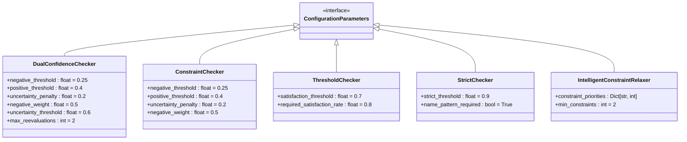

# Constrained Search Strategy

<cite>
**Referenced Files in This Document**   
- [constraint_checker.py](file://src/local_deep_research/advanced_search_system/constraint_checking/constraint_checker.py)
- [intelligent_constraint_relaxer.py](file://src/local_deep_research/advanced_search_system/constraint_checking/intelligent_constraint_relaxer.py)
- [dual_confidence_checker.py](file://src/local_deep_research/advanced_search_system/constraint_checking/dual_confidence_checker.py)
- [base_constraint_checker.py](file://src/local_deep_research/advanced_search_system/constraint_checking/base_constraint_checker.py)
- [evidence_analyzer.py](file://src/local_deep_research/advanced_search_system/constraint_checking/evidence_analyzer.py)
- [rejection_engine.py](file://src/local_deep_research/advanced_search_system/constraint_checking/rejection_engine.py)
- [constraint_satisfaction_tracker.py](file://src/local_deep_research/advanced_search_system/constraint_checking/constraint_satisfaction_tracker.py)
- [cross_constraint_manager.py](file://src/local_deep_research/advanced_search_system/search_optimization/cross_constraint_manager.py)
- [base_constraint.py](file://src/local_deep_research/advanced_search_system/constraints/base_constraint.py)
- [constraint_guided_explorer.py](file://src/local_deep_research/advanced_search_system/candidate_exploration/constraint_guided_explorer.py)
</cite>

## Table of Contents
1. [Introduction](#introduction)
2. [Core Components](#core-components)
3. [Constraint Checker Implementation](#constraint-checker-implementation)
4. [Dual Confidence Checker](#dual-confidence-checker)
5. [Intelligent Constraint Relaxation](#intelligent-constraint-relaxation)
6. [Constraint Validation and Evidence Analysis](#constraint-validation-and-evidence-analysis)
7. [Constraint Types and Configuration](#constraint-types-and-configuration)
8. [Constraint-Guided Exploration](#constraint-guided-exploration)
9. [Cross-Constraint Optimization](#cross-constraint-optimization)
10. [Quality Assurance and Rejection Engine](#quality-assurance-and-rejection-engine)
11. [Configuration and Threshold Management](#configuration-and-threshold-management)
12. [Use Cases and Examples](#use-cases-and-examples)
13. [Conclusion](#conclusion)

## Introduction

The Constrained Search Strategy enforces strict requirements throughout the research process by validating results against predefined rules. This system ensures that only candidates satisfying specific constraints are accepted, with mechanisms for intelligent relaxation when strict matching fails. The architecture centers around constraint validation, evidence analysis, and quality assurance, providing a robust framework for reliable research outcomes.

The strategy implements multiple constraint checking approaches, including dual confidence scoring, threshold-based evaluation, and strict validation. It integrates with exploration systems to guide searches based on constraint importance and uses intelligent relaxation to improve results when perfect matches are unavailable. The system supports various constraint types for business rules, regulatory compliance, and data validation requirements.

**Section sources**
- [constraint_checker.py](file://src/local_deep_research/advanced_search_system/constraint_checking/constraint_checker.py#L1-L224)
- [intelligent_constraint_relaxer.py](file://src/local_deep_research/advanced_search_system/constraint_checking/intelligent_constraint_relaxer.py#L1-L502)

## Core Components

The Constrained Search Strategy comprises several interconnected components that work together to validate candidates against constraints. The core elements include the constraint checker, evidence analyzer, rejection engine, and intelligent constraint relaxer. These components form a comprehensive system for enforcing rules throughout the research pipeline.

The constraint checking system is built on an inheritance-based architecture, with a base constraint checker providing common functionality and abstract methods that concrete implementations must override. This design allows for multiple constraint checking strategies while maintaining a consistent interface. The system integrates with exploration strategies to guide searches based on constraint importance and uses evidence gathering to support validation decisions.


**Diagram sources**
- [base_constraint_checker.py](file://src/local_deep_research/advanced_search_system/constraint_checking/base_constraint_checker.py#L31-L123)
- [constraint_checker.py](file://src/local_deep_research/advanced_search_system/constraint_checking/constraint_checker.py#L30-L224)
- [dual_confidence_checker.py](file://src/local_deep_research/advanced_search_system/constraint_checking/dual_confidence_checker.py#L21-L425)
- [threshold_checker.py](file://src/local_deep_research/advanced_search_system/constraint_checking/threshold_checker.py#L20-L214)
- [strict_checker.py](file://src/local_deep_research/advanced_search_system/constraint_checking/strict_checker.py#L20-L260)

**Section sources**
- [base_constraint_checker.py](file://src/local_deep_research/advanced_search_system/constraint_checking/base_constraint_checker.py#L1-L123)
- [constraint_checker.py](file://src/local_deep_research/advanced_search_system/constraint_checking/constraint_checker.py#L1-L224)

## Constraint Checker Implementation

The ConstraintChecker class serves as the primary interface for validating candidates against constraints. It orchestrates the constraint validation process by gathering evidence, analyzing it with dual confidence scoring, and making rejection decisions based on the evidence. The checker integrates multiple components to provide a comprehensive evaluation of each candidate.

The implementation uses configurable parameters to control the validation process, including negative and positive thresholds, uncertainty penalties, and negative evidence weights. These parameters allow fine-tuning of the constraint checking behavior to match specific requirements. The checker processes each constraint by gathering evidence, analyzing it with dual confidence, and calculating a constraint score that reflects how well the candidate satisfies the constraint.

When evaluating a candidate, the ConstraintChecker first gathers evidence for each constraint using the provided evidence gatherer function. It then analyzes the evidence using dual confidence scoring, which separates positive evidence, negative evidence, and uncertainty. The checker calculates an average score for each constraint and uses these scores to determine whether the candidate should be rejected. If rejection criteria are met, the candidate receives a zero total score; otherwise, a weighted average score is calculated based on the constraint scores and their weights.


**Diagram sources**
- [constraint_checker.py](file://src/local_deep_research/advanced_search_system/constraint_checking/constraint_checker.py#L30-L224)
- [evidence_analyzer.py](file://src/local_deep_research/advanced_search_system/constraint_checking/evidence_analyzer.py#L31-L175)
- [rejection_engine.py](file://src/local_deep_research/advanced_search_system/constraint_checking/rejection_engine.py#L28-L144)

**Section sources**
- [constraint_checker.py](file://src/local_deep_research/advanced_search_system/constraint_checking/constraint_checker.py#L1-L224)

## Dual Confidence Checker

The DualConfidenceChecker implements a sophisticated constraint validation approach using dual confidence scoring. This method evaluates evidence by separating positive confidence (evidence that the constraint is satisfied), negative confidence (evidence that the constraint is not satisfied), and uncertainty (lack of clear evidence). This three-dimensional analysis provides a more nuanced understanding of constraint satisfaction than simple binary evaluation.

The checker includes advanced features such as LLM pre-screening, which evaluates all constraints in a single call to save resources, and re-evaluation for uncertain results. When the uncertainty score exceeds a configurable threshold, the checker performs additional evaluations to reduce uncertainty. This iterative process continues until either the uncertainty decreases below the threshold or the maximum number of re-evaluations is reached.

The dual confidence approach uses configurable thresholds to determine rejection criteria. A candidate is rejected if the negative evidence exceeds the negative threshold or if the positive evidence falls below the positive threshold. These thresholds can be adjusted to make the validation process more or less strict based on the specific requirements. The checker also includes a fast LLM pre-screening mechanism that evaluates the overall quality of the answer candidate before detailed constraint checking.


**Diagram sources**
- [dual_confidence_checker.py](file://src/local_deep_research/advanced_search_system/constraint_checking/dual_confidence_checker.py#L21-L425)

**Section sources**
- [dual_confidence_checker.py](file://src/local_deep_research/advanced_search_system/constraint_checking/dual_confidence_checker.py#L1-L425)

## Intelligent Constraint Relaxation

The IntelligentConstraintRelaxer provides a systematic approach to relaxing constraints when strict matching fails to produce sufficient results. This component implements progressive constraint relaxation based on search results and constraint reliability, allowing the system to find relevant candidates even when perfect matches are unavailable. The relaxer maintains essential identifying constraints while relaxing problematic constraint types first.

The relaxation strategy is based on a priority system that assigns importance levels to different constraint types. NAME_PATTERN constraints have the highest priority (10) and are never relaxed, as they are essential for identification. EXISTENCE and LOCATION constraints have high priority (9 and 8 respectively) and are rarely relaxed. TEMPORAL and PROPERTY constraints have moderate priority (7 and 6), while STATISTIC, RELATIONSHIP, and COMPARISON constraints have lower priority (3, 2, and 1) and are frequently relaxed when needed.

The relaxer generates multiple search attempts with different constraint sets using three main strategies: removing least important constraints progressively, creating variations of difficult constraints, and keeping only high-priority constraints. For each constraint type, specific relaxation strategies are applied. Statistical constraints are relaxed by creating range variations and "approximately" versions. Comparison constraints are relaxed by replacing strict terms with looser ones or removing the comparison altogether. Temporal constraints are relaxed by creating decade ranges or time windows. Property constraints are relaxed by making specific properties more general or removing adjectives.

```mermaid
classDiagram
class IntelligentConstraintRelaxer {
+constraint_priorities : Dict[str, int]
+min_constraints : int
+relaxation_strategies : Dict[str, function]
+relax_constraints_progressively(constraints, candidates_found, target_candidates) List[List[object]]
+_create_constraint_variations(constraints) List[List[object]]
+_relax_statistical_constraint(constraint) List[object]
+_relax_comparison_constraint(constraint) List[object]
+_relax_temporal_constraint(constraint) List[object]
+_relax_property_constraint(constraint) List[object]
+_create_relaxed_constraint(original_constraint, relaxed_text) object
+_get_constraint_type(constraint) str
+analyze_relaxation_impact(original_constraints, relaxed_constraints) Dict
}
IntelligentConstraintRelaxer --> "1" "1..*" Constraint
IntelligentConstraintRelaxer --> "1" "1..*" Candidate
```

**Diagram sources**
- [intelligent_constraint_relaxer.py](file://src/local_deep_research/advanced_search_system/constraint_checking/intelligent_constraint_relaxer.py#L15-L502)

**Section sources**
- [intelligent_constraint_relaxer.py](file://src/local_deep_research/advanced_search_system/constraint_checking/intelligent_constraint_relaxer.py#L1-L502)

## Constraint Validation and Evidence Analysis

The evidence analysis system provides the foundation for constraint validation by extracting dual confidence scores from evidence. The EvidenceAnalyzer class processes evidence using a language model to determine positive confidence (how sure we are the constraint is satisfied), negative confidence (how sure we are the constraint is not satisfied), and uncertainty (how uncertain we are). These three scores should approximately sum to 1.0, providing a balanced assessment of constraint satisfaction.

The analysis process begins with a prompt to the language model that includes the constraint and evidence text. The model responds with three confidence scores in a specific format. The analyzer extracts these scores and normalizes them if needed. If parsing fails or no response is received, default scores are used with high uncertainty. The analyzer also provides a method to evaluate a list of evidence items, calculating overall scores by averaging the confidence values across all evidence.

The ConstraintEvidence dataclass stores the results of evidence analysis, including the three confidence scores, the evidence text, and the source. This structured format allows the constraint checking system to make informed decisions based on the quality and reliability of the evidence. The evidence analyzer is used by multiple constraint checking implementations, including the ConstraintChecker and DualConfidenceChecker, providing a consistent approach to evidence evaluation.


**Diagram sources**
- [evidence_analyzer.py](file://src/local_deep_research/advanced_search_system/constraint_checking/evidence_analyzer.py#L31-L175)

**Section sources**
- [evidence_analyzer.py](file://src/local_deep_research/advanced_search_system/constraint_checking/evidence_analyzer.py#L1-L175)

## Constraint Types and Configuration

The constraint system supports multiple constraint types, each serving a specific purpose in query decomposition and validation. These types are defined in the ConstraintType enum and include PROPERTY, NAME_PATTERN, EVENT, STATISTIC, TEMPORAL, LOCATION, COMPARISON, and EXISTENCE. Each constraint type has specific characteristics and use cases that determine how it should be validated and relaxed.

Constraints are configured with several properties, including an ID, type, description, value, weight, and metadata. The weight parameter determines the importance of the constraint, with higher weights indicating greater importance. Constraints can be marked as critical based on their type or weight, with NAME_PATTERN constraints considered critical regardless of weight. The system uses these properties to prioritize constraints during validation and relaxation.

The constraint configuration supports business rule enforcement, regulatory compliance checks, and data validation requirements by allowing specific rules to be encoded as constraints. For example, a regulatory compliance check might be implemented as a LOCATION constraint requiring entities to be in a specific jurisdiction. A data validation requirement might be implemented as a STATISTIC constraint with a specific value range. Business rules can be encoded as COMPARISON constraints that enforce relationships between entities or properties.


**Diagram sources**
- [base_constraint.py](file://src/local_deep_research/advanced_search_system/constraints/base_constraint.py#L10-L59)

**Section sources**
- [base_constraint.py](file://src/local_deep_research/advanced_search_system/constraints/base_constraint.py#L1-L59)

## Constraint-Guided Exploration

The ConstraintGuidedExplorer uses constraints to guide the search process, prioritizing searches that are likely to find candidates satisfying the constraints. This explorer implements a strategy that focuses on constraint satisfaction over quantity, using constraint-specific search strategies and early validation to improve efficiency and effectiveness.

The exploration process begins by prioritizing constraints based on weight and type. Constraints with higher weights and more important types are explored first. For each constraint, the explorer generates constraint-specific queries that are optimized for finding candidates that satisfy that constraint. These queries are executed, and candidates are extracted from the results. When early validation is enabled, candidates are validated against the current constraint immediately after extraction.

The explorer also performs cross-constraint exploration by combining multiple constraints into a single query. This approach helps find candidates that satisfy multiple constraints simultaneously, improving the quality of results. After collecting candidates from individual and combined constraint searches, the explorer ranks them by constraint alignment and relevance, returning the top candidates. The exploration paths are recorded to provide transparency into the search process.


**Diagram sources**
- [constraint_guided_explorer.py](file://src/local_deep_research/advanced_search_system/candidate_exploration/constraint_guided_explorer.py#L22-L437)

**Section sources**
- [constraint_guided_explorer.py](file://src/local_deep_research/advanced_search_system/candidate_exploration/constraint_guided_explorer.py#L1-L437)

## Cross-Constraint Optimization

The CrossConstraintManager optimizes multi-constraint searches by identifying relationships between constraints and clustering related constraints for efficient searching. This component analyzes pairs of constraints to determine their relationship type (complementary, dependent, or exclusive) and strength, creating a constraint graph that represents these relationships.

The manager creates clusters of related constraints using multiple strategies: type-based clustering groups constraints of the same type, relationship-based clustering groups constraints with strong relationships, and semantic clustering groups constraints based on meaning and intent. These clusters are used to generate optimized search queries that combine multiple constraints in effective ways.

For each constraint cluster, the manager generates several types of queries: combined queries that include all constraints in the cluster, progressive queries that build up constraints gradually, intersection queries that target the common theme among constraints, and validation queries that check for cross-constraint satisfaction. The manager also provides methods for validating candidates across multiple constraints simultaneously, using cluster-based approaches to improve validation accuracy.

```mermaid
classDiagram
class CrossConstraintManager {
+model : BaseChatModel
+relationships : Dict[Tuple[str, str], ConstraintRelationship]
+clusters : List[ConstraintCluster]
+cross_validation_patterns : Dict[str, List[Dict]]
+constraint_graph : Dict[str, Set[str]]
+analyze_constraint_relationships(constraints) Dict[Tuple[str, str], ConstraintRelationship]
+create_constraint_clusters(constraints) List[ConstraintCluster]
+generate_cross_constraint_queries(cluster) List[str]
+validate_candidate_across_constraints(candidate, constraints) Dict[str, float]
+optimize_search_order(clusters) List[ConstraintCluster]
}
class ConstraintRelationship {
+constraint1_id : str
+constraint2_id : str
+relationship_type : str
+strength : float
+evidence : List[str]
}
class ConstraintCluster {
+constraints : List[Constraint]
+cluster_type : str
+coherence_score : float
+search_queries : List[str]
}
CrossConstraintManager --> "1" "0..*" ConstraintRelationship
CrossConstraintManager --> "1" "0..*" ConstraintCluster
ConstraintCluster --> "1" "1..*" Constraint
```

**Diagram sources**
- [cross_constraint_manager.py](file://src/local_deep_research/advanced_search_system/search_optimization/cross_constraint_manager.py#L38-L625)

**Section sources**
- [cross_constraint_manager.py](file://src/local_deep_research/advanced_search_system/search_optimization/cross_constraint_manager.py#L1-L625)

## Quality Assurance and Rejection Engine

The RejectionEngine provides a clear and consistent mechanism for rejecting candidates based on constraint violations. This component uses simple, rule-based logic to determine when candidates should be rejected, ensuring that the decision-making process is transparent and predictable. The engine implements two primary rejection rules: high negative evidence and insufficient positive evidence.

The rejection process begins by calculating average confidence scores across all evidence for a constraint. If the average negative confidence exceeds the negative threshold (default 0.25), the candidate is rejected due to high negative evidence. If the average positive confidence falls below the positive threshold (default 0.4), the candidate is rejected due to insufficient positive evidence. These thresholds can be configured to adjust the strictness of the rejection criteria.

The RejectionEngine processes all constraints for a candidate and returns the first rejection reason found. This approach ensures that candidates are rejected as early as possible when they fail to meet requirements. If no rejections are found, the engine indicates that all constraints are satisfied. The rejection results include detailed information about the rejection reason, constraint value, and confidence scores, providing transparency into the decision-making process.


**Diagram sources**
- [rejection_engine.py](file://src/local_deep_research/advanced_search_system/constraint_checking/rejection_engine.py#L28-L144)

**Section sources**
- [rejection_engine.py](file://src/local_deep_research/advanced_search_system/constraint_checking/rejection_engine.py#L1-L144)

## Configuration and Threshold Management

The constrained search system provides extensive configuration options for managing thresholds and relaxation policies. These settings allow fine-tuning of the constraint checking behavior to match specific requirements and use cases. The configuration parameters are exposed through the constructors of the various constraint checking components, enabling customization of the validation process.

Key configuration parameters include negative and positive thresholds for rejection decisions, uncertainty penalties, negative evidence weights, and re-evaluation limits. The DualConfidenceChecker, for example, allows configuring the negative_threshold (default 0.25), positive_threshold (default 0.4), uncertainty_penalty (default 0.2), negative_weight (default 0.5), uncertainty_threshold (default 0.6), and max_reevaluations (default 2). These parameters control how strictly constraints are enforced and how the system handles uncertain evidence.

The IntelligentConstraintRelaxer provides configuration through its priority system, which determines the order in which constraints are relaxed. The constraint_priorities dictionary assigns importance levels to different constraint types, with higher values indicating greater importance and less likelihood of relaxation. This system can be customized to reflect the specific requirements of different domains or use cases, ensuring that the most critical constraints are preserved while less important ones are relaxed when needed.



**Diagram sources**
- [dual_confidence_checker.py](file://src/local_deep_research/advanced_search_system/constraint_checking/dual_confidence_checker.py#L31-L64)
- [constraint_checker.py](file://src/local_deep_research/advanced_search_system/constraint_checking/constraint_checker.py#L45-L49)
- [threshold_checker.py](file://src/local_deep_research/advanced_search_system/constraint_checking/threshold_checker.py#L33-L35)
- [strict_checker.py](file://src/local_deep_research/advanced_search_system/constraint_checking/strict_checker.py#L31-L34)
- [intelligent_constraint_relaxer.py](file://src/local_deep_research/advanced_search_system/constraint_checking/intelligent_constraint_relaxer.py#L26-L38)

**Section sources**
- [dual_confidence_checker.py](file://src/local_deep_research/advanced_search_system/constraint_checking/dual_confidence_checker.py#L1-L425)
- [constraint_checker.py](file://src/local_deep_research/advanced_search_system/constraint_checking/constraint_checker.py#L1-L224)
- [threshold_checker.py](file://src/local_deep_research/advanced_search_system/constraint_checking/threshold_checker.py#L1-L214)
- [strict_checker.py](file://src/local_deep_research/advanced_search_system/constraint_checking/strict_checker.py#L1-L260)
- [intelligent_constraint_relaxer.py](file://src/local_deep_research/advanced_search_system/constraint_checking/intelligent_constraint_relaxer.py#L1-L502)

## Use Cases and Examples

The Constrained Search Strategy supports various use cases, including business rule enforcement, regulatory compliance checks, and data validation requirements. These use cases demonstrate how the system can be configured and applied to ensure reliable research outcomes in different domains.

For business rule enforcement, constraints can be used to validate that candidates meet specific business criteria. For example, a constraint might require that a company is a multinational corporation headquartered in a specific country. This would be implemented as a combination of PROPERTY and LOCATION constraints with appropriate weights. The system would validate candidates against these constraints, rejecting those that don't meet the criteria.

Regulatory compliance checks can be implemented using constraints that enforce legal or regulatory requirements. For example, a financial compliance check might require that a company's financial ratio is within a specific range. This would be implemented as a STATISTIC constraint with a relaxed range to account for variations in reporting. The intelligent constraint relaxer would automatically create variations of this constraint with different ranges if strict matching fails.

Data validation requirements can be addressed using constraints that verify the accuracy and completeness of information. For example, a data validation constraint might require that a scientific study includes a specific methodology or was conducted during a particular time period. These would be implemented as METHOD and TEMPORAL constraints, with the system validating that candidates meet these requirements before accepting them as valid results.


**Diagram sources**
- [constraint_checker.py](file://src/local_deep_research/advanced_search_system/constraint_checking/constraint_checker.py#L1-L224)
- [intelligent_constraint_relaxer.py](file://src/local_deep_research/advanced_search_system/constraint_checking/intelligent_constraint_relaxer.py#L1-L502)
- [dual_confidence_checker.py](file://src/local_deep_research/advanced_search_system/constraint_checking/dual_confidence_checker.py#L1-L425)

**Section sources**
- [constraint_checker.py](file://src/local_deep_research/advanced_search_system/constraint_checking/constraint_checker.py#L1-L224)
- [intelligent_constraint_relaxer.py](file://src/local_deep_research/advanced_search_system/constraint_checking/intelligent_constraint_relaxer.py#L1-L502)
- [dual_confidence_checker.py](file://src/local_deep_research/advanced_search_system/constraint_checking/dual_confidence_checker.py#L1-L425)

## Conclusion

The Constrained Search Strategy provides a comprehensive framework for enforcing strict requirements throughout the research process. By validating results against predefined rules, the system ensures that only candidates meeting specific criteria are accepted, improving the reliability and quality of research outcomes. The architecture combines multiple constraint checking approaches, evidence analysis, and quality assurance mechanisms to create a robust validation system.

Key components of the strategy include the constraint checker, which orchestrates the validation process; the dual confidence checker, which provides nuanced assessment of constraint satisfaction; and the intelligent constraint relaxer, which improves results when strict matching fails. These components work together to balance strict validation with flexibility, ensuring that the system can adapt to different scenarios while maintaining high standards.

The system supports various constraint types for business rule enforcement, regulatory compliance checks, and data validation requirements. Configuration options allow fine-tuning of thresholds and relaxation policies to match specific needs. The integration with exploration strategies ensures that searches are guided by constraint importance, improving efficiency and effectiveness. Overall, the Constrained Search Strategy provides a powerful tool for ensuring the accuracy and reliability of research results in complex information environments.