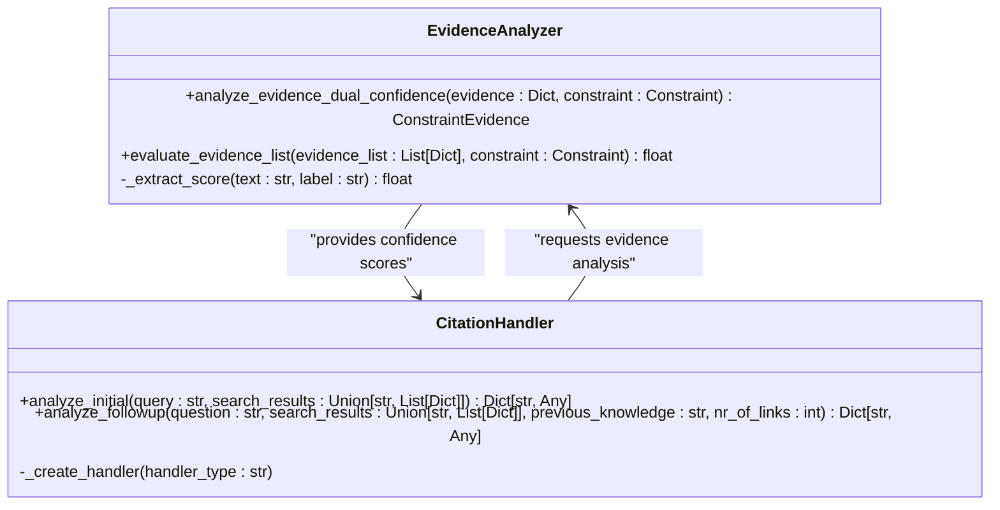
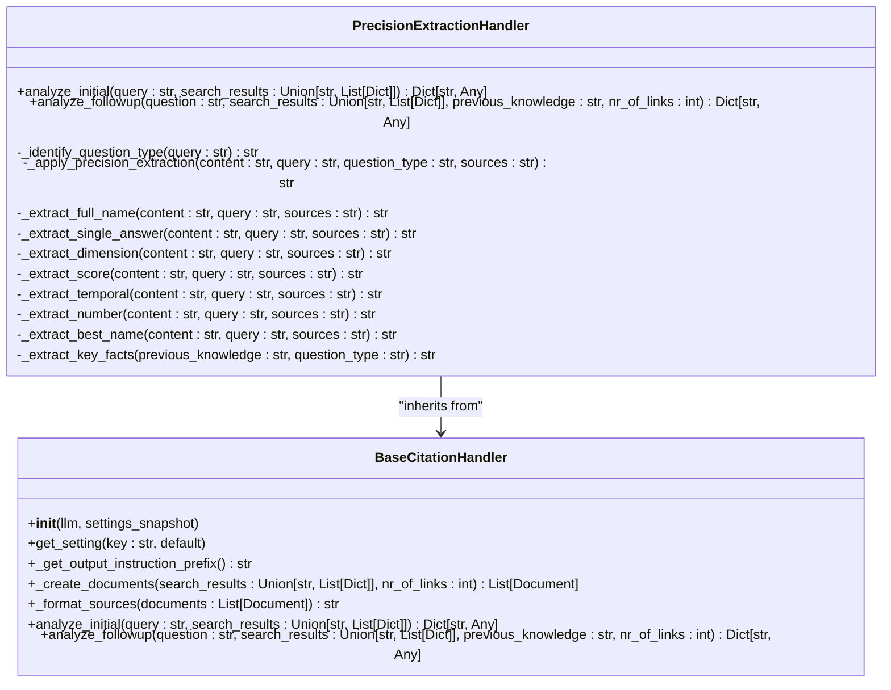
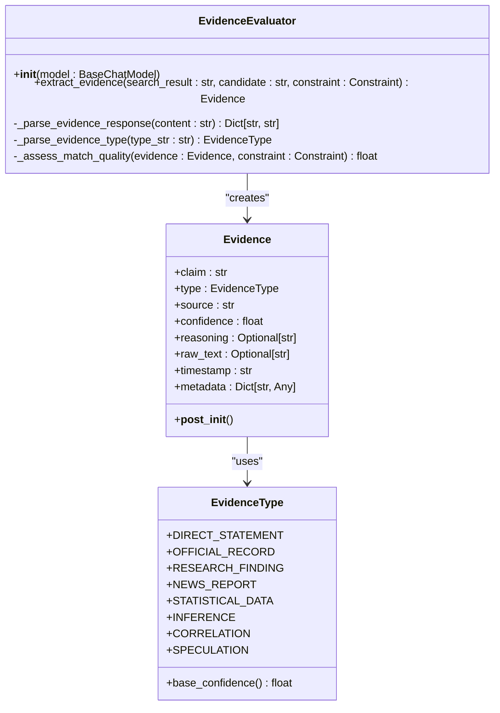
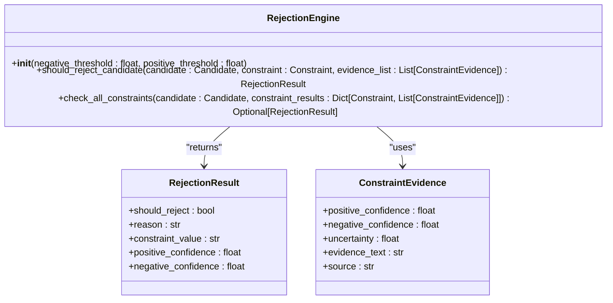

# Evidence-Based Strategy

<cite>
**Referenced Files in This Document**   
- [evidence_analyzer.py](file://src/local_deep_research/advanced_search_system/constraint_checking/evidence_analyzer.py)
- [precision_extraction_handler.py](file://src/local_deep_research/citation_handlers/precision_extraction_handler.py)
- [base_citation_handler.py](file://src/local_deep_research/citation_handlers/base_citation_handler.py)
- [standard_citation_handler.py](file://src/local_deep_research/citation_handlers/standard_citation_handler.py)
- [forced_answer_citation_handler.py](file://src/local_deep_research/citation_handlers/forced_answer_citation_handler.py)
- [rejection_engine.py](file://src/local_deep_research/advanced_search_system/constraint_checking/rejection_engine.py)
- [base_constraint.py](file://src/local_deep_research/advanced_search_system/constraints/base_constraint.py)
- [constraint_analyzer.py](file://src/local_deep_research/advanced_search_system/constraints/constraint_analyzer.py)
- [evaluator.py](file://src/local_deep_research/advanced_search_system/evidence/evaluator.py)
- [base_evidence.py](file://src/local_deep_research/advanced_search_system/evidence/base_evidence.py)
- [requirements.py](file://src/local_deep_research/advanced_search_system/evidence/requirements.py)
- [citation_handler.py](file://src/local_deep_research/citation_handler.py)
</cite>

## Table of Contents
1. [Introduction](#introduction)
2. [Core Components](#core-components)
3. [Evidence Analyzer and Citation Handler Integration](#evidence-analyzer-and-citation-handler-integration)
4. [Precision Extraction Handler for Citation Integrity](#precision-extraction-handler-for-citation-integrity)
5. [Evidence Scoring and Source Reliability Assessment](#evidence-scoring-and-source-reliability-assessment)
6. [Conflict Resolution Between Contradictory Sources](#conflict-resolution-between-contradictory-sources)
7. [Use Cases for High Factual Accuracy](#use-cases-for-high-factual-accuracy)
8. [Trade-offs Between Verification and Research Speed](#trade-offs-between-verification-and-research-speed)
9. [Conclusion](#conclusion)

## Introduction
The Evidence-Based Strategy is a comprehensive framework designed to ensure verifiable sources and citation accuracy throughout the research process. This strategy leverages advanced components such as the evidence_analyzer and citation_handler to validate claims against source material, ensuring high factual accuracy. The integration of the precision_extraction_handler further enhances citation integrity by focusing on extracting precise, complete answers. This document explores the architecture, functionality, and application of these components, providing insights into evidence scoring, source reliability assessment, and conflict resolution. The strategy is particularly suited for use cases requiring high factual accuracy, such as academic or legal research, while also addressing the trade-offs between thorough verification and research speed.

## Core Components

The Evidence-Based Strategy is built on a robust architecture comprising several core components that work in concert to ensure verifiable sources and citation accuracy. These components include the evidence_analyzer, citation_handler, and precision_extraction_handler, each playing a critical role in the research process. The evidence_analyzer evaluates evidence using dual confidence scoring, separating positive evidence, negative evidence, and uncertainty. The citation_handler manages the citation process, ensuring that all claims are supported by verifiable sources. The precision_extraction_handler focuses on extracting precise, complete answers, particularly for SimpleQA-style questions. Together, these components form a cohesive system that enhances the reliability and accuracy of research outcomes.

**Section sources**
- [evidence_analyzer.py](file://src/local_deep_research/advanced_search_system/constraint_checking/evidence_analyzer.py#L1-L175)
- [precision_extraction_handler.py](file://src/local_deep_research/citation_handlers/precision_extraction_handler.py#L1-L585)
- [base_citation_handler.py](file://src/local_deep_research/citation_handlers/base_citation_handler.py#L1-L111)

## Evidence Analyzer and Citation Handler Integration

The integration of the evidence_analyzer and citation_handler is central to the Evidence-Based Strategy, ensuring that all claims are validated against source material. The evidence_analyzer uses dual confidence scoring to evaluate evidence, providing a nuanced assessment of positive, negative, and uncertain evidence. This approach allows for more accurate scoring and better early stopping decisions. The citation_handler, on the other hand, manages the citation process, ensuring that all claims are supported by verifiable sources. The two components work together to validate claims, with the evidence_analyzer providing the confidence scores that the citation_handler uses to determine the reliability of the sources.

**Diagram sources **
- [evidence_analyzer.py](file://src/local_deep_research/advanced_search_system/constraint_checking/evidence_analyzer.py#L31-L175)
- [citation_handler.py](file://src/local_deep_research/citation_handler.py#L40-L106)

**Section sources**
- [evidence_analyzer.py](file://src/local_deep_research/advanced_search_system/constraint_checking/evidence_analyzer.py#L31-L175)
- [citation_handler.py](file://src/local_deep_research/citation_handler.py#L40-L106)

## Precision Extraction Handler for Citation Integrity

The precision_extraction_handler is designed to maintain citation integrity by focusing on extracting precise, complete answers for SimpleQA-style questions. This handler includes specialized extractors for full names, single answers, dimension-aware measurements, and specific entities without extra information. By applying precision extraction based on the question type, the handler ensures that the answers are exact and supported by the sources. The handler also includes mechanisms for handling edge cases and error conditions, ensuring that the citation process remains robust and reliable.

**Diagram sources **
- [precision_extraction_handler.py](file://src/local_deep_research/citation_handlers/precision_extraction_handler.py#L21-L585)
- [base_citation_handler.py](file://src/local_deep_research/citation_handlers/base_citation_handler.py#L11-L111)

**Section sources**
- [precision_extraction_handler.py](file://src/local_deep_research/citation_handlers/precision_extraction_handler.py#L21-L585)

## Evidence Scoring and Source Reliability Assessment

Evidence scoring and source reliability assessment are critical components of the Evidence-Based Strategy, ensuring that the research process is both accurate and reliable. The evidence_analyzer uses dual confidence scoring to evaluate evidence, providing a nuanced assessment of positive, negative, and uncertain evidence. This approach allows for more accurate scoring and better early stopping decisions. The source reliability is assessed based on the type of evidence, with official records and research findings being more reliable than community sources or speculation. The evidence evaluator also adjusts the confidence based on how well the evidence matches the constraint, ensuring that the final score reflects the quality of the evidence.

**Diagram sources **
- [evaluator.py](file://src/local_deep_research/advanced_search_system/evidence/evaluator.py#L15-L160)
- [base_evidence.py](file://src/local_deep_research/advanced_search_system/evidence/base_evidence.py#L1-L58)

**Section sources**
- [evaluator.py](file://src/local_deep_research/advanced_search_system/evidence/evaluator.py#L15-L160)
- [base_evidence.py](file://src/local_deep_research/advanced_search_system/evidence/base_evidence.py#L1-L58)

## Conflict Resolution Between Contradictory Sources

Conflict resolution between contradictory sources is a key aspect of the Evidence-Based Strategy, ensuring that the research process remains accurate and reliable. The rejection_engine plays a critical role in this process, using simple, clear rules to determine when candidates should be rejected based on their constraint evaluation results. The engine uses two primary rules for rejection: high negative evidence and low positive evidence. If the average negative confidence exceeds a threshold, the candidate is rejected. Similarly, if the average positive confidence is below a threshold, the candidate is rejected. This approach ensures that only candidates with strong positive evidence and low negative evidence are accepted.

**Diagram sources **
- [rejection_engine.py](file://src/local_deep_research/advanced_search_system/constraint_checking/rejection_engine.py#L28-L144)
- [evidence_analyzer.py](file://src/local_deep_research/advanced_search_system/constraint_checking/evidence_analyzer.py#L18-L29)

**Section sources**
- [rejection_engine.py](file://src/local_deep_research/advanced_search_system/constraint_checking/rejection_engine.py#L28-L144)

## Use Cases for High Factual Accuracy

The Evidence-Based Strategy is particularly suited for use cases requiring high factual accuracy, such as academic or legal research. In academic research, the strategy ensures that all claims are supported by verifiable sources, enhancing the credibility and reliability of the research. In legal research, the strategy helps to validate claims against source material, ensuring that the research is accurate and defensible. The precision_extraction_handler is particularly useful in these contexts, as it focuses on extracting precise, complete answers, reducing the risk of errors and inaccuracies.

**Section sources**
- [precision_extraction_handler.py](file://src/local_deep_research/citation_handlers/precision_extraction_handler.py#L1-L585)
- [evidence_analyzer.py](file://src/local_deep_research/advanced_search_system/constraint_checking/evidence_analyzer.py#L1-L175)

## Trade-offs Between Verification and Research Speed

While the Evidence-Based Strategy ensures high factual accuracy, it also involves trade-offs between thorough verification and research speed. The dual confidence scoring and evidence evaluation processes are computationally intensive, requiring multiple LLM invocations and complex calculations. This can slow down the research process, particularly for large datasets or complex queries. However, the strategy includes mechanisms for early stopping and parallel processing, which can help to mitigate these delays. The choice of citation handler also affects the research speed, with the precision_extraction_handler being more computationally intensive than the standard_citation_handler.

**Section sources**
- [dual_confidence_strategy.py](file://src/local_deep_research/advanced_search_system/strategies/dual_confidence_strategy.py#L1-L324)
- [standard_citation_handler.py](file://src/local_deep_research/citation_handlers/standard_citation_handler.py#L1-L98)

## Conclusion

The Evidence-Based Strategy provides a comprehensive framework for ensuring verifiable sources and citation accuracy throughout the research process. By integrating the evidence_analyzer, citation_handler, and precision_extraction_handler, the strategy enhances the reliability and accuracy of research outcomes. The dual confidence scoring and evidence evaluation processes provide a nuanced assessment of evidence, while the rejection_engine ensures that only candidates with strong positive evidence and low negative evidence are accepted. The strategy is particularly suited for use cases requiring high factual accuracy, such as academic or legal research, while also addressing the trade-offs between thorough verification and research speed.