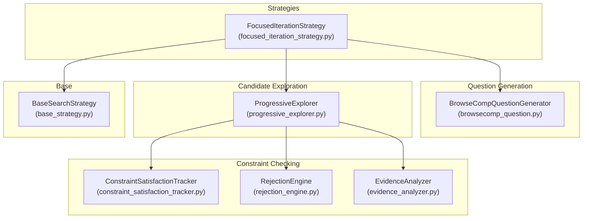
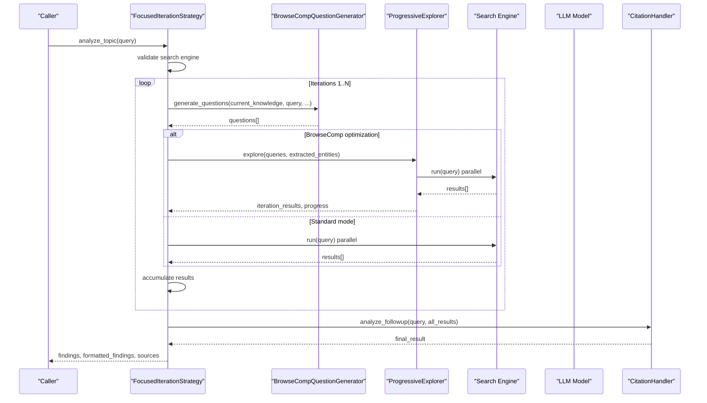
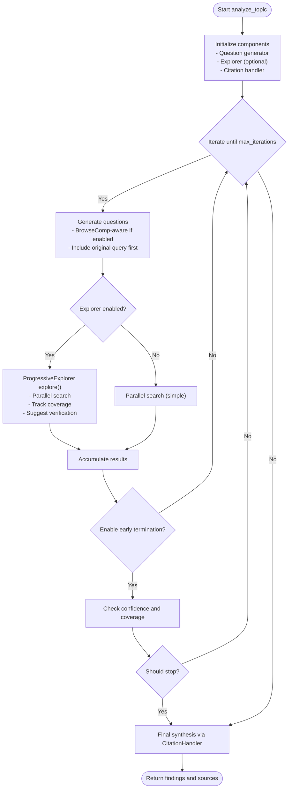
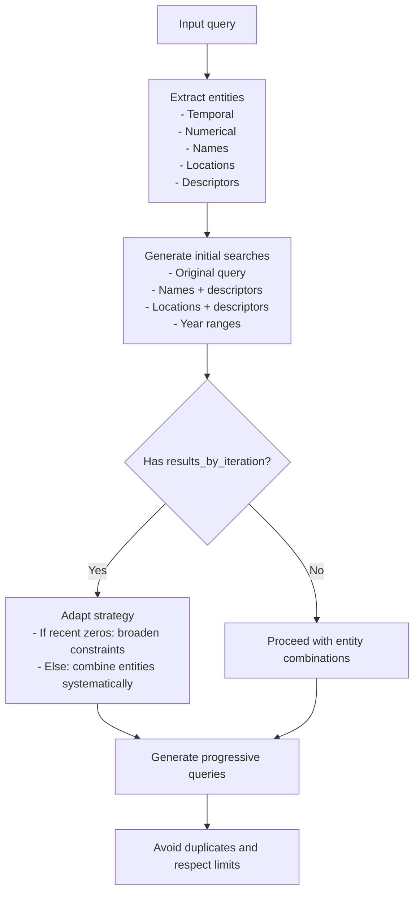
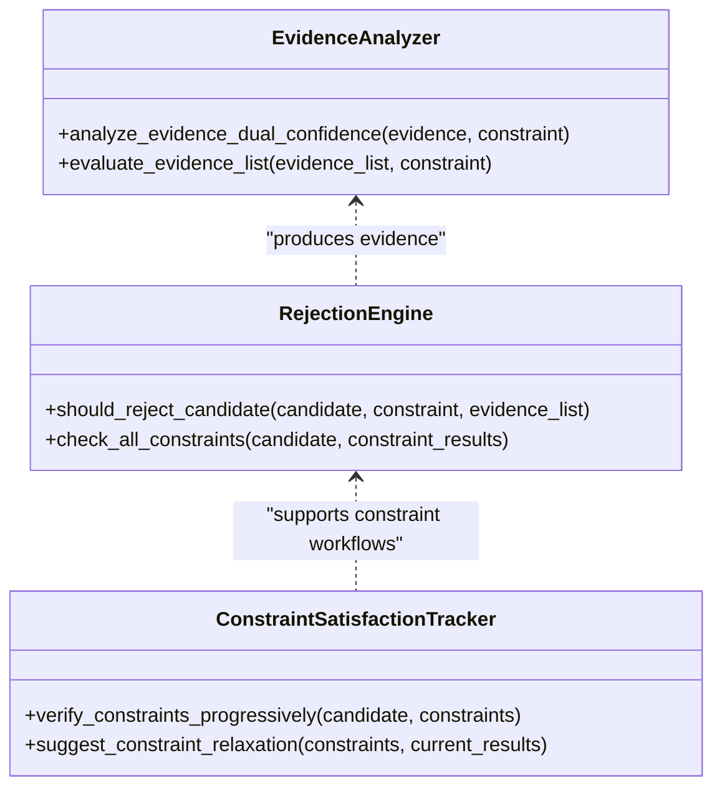
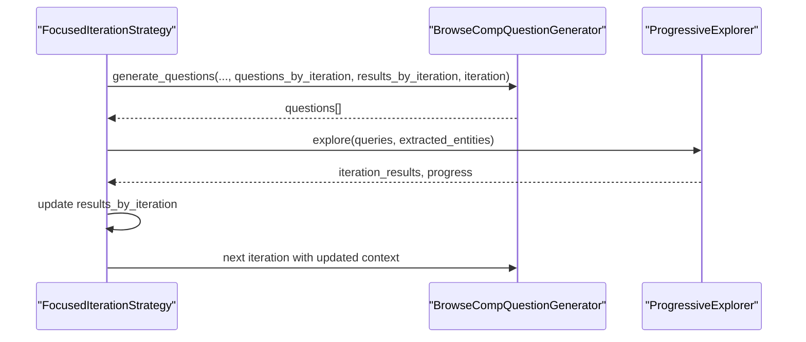
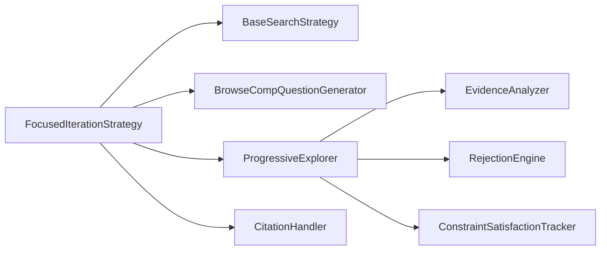

# Focused Iteration Strategy

<cite>
**Referenced Files in This Document**
- [focused_iteration_strategy.py](file://src/local_deep_research/advanced_search_system/strategies/focused_iteration_strategy.py)
- [progressive_explorer.py](file://src/local_deep_research/advanced_search_system/candidate_exploration/progressive_explorer.py)
- [browsecomp_question.py](file://src/local_deep_research/advanced_search_system/questions/browsecomp_question.py)
- [constraint_satisfaction_tracker.py](file://src/local_deep_research/advanced_search_system/constraint_checking/constraint_satisfaction_tracker.py)
- [rejection_engine.py](file://src/local_deep_research/advanced_search_system/constraint_checking/rejection_engine.py)
- [evidence_analyzer.py](file://src/local_deep_research/advanced_search_system/constraint_checking/evidence_analyzer.py)
- [base_strategy.py](file://src/local_deep_research/advanced_search_system/strategies/base_strategy.py)
- [topic_organization_strategy.py](file://src/local_deep_research/advanced_search_system/strategies/topic_organization_strategy.py)
- [search_strategies_example.py](file://examples/api_usage/programmatic/search_strategies_example.py)
- [README.md](file://README.md)
</cite>

## Table of Contents
1. [Introduction](#introduction)
2. [Project Structure](#project-structure)
3. [Core Components](#core-components)
4. [Architecture Overview](#architecture-overview)
5. [Detailed Component Analysis](#detailed-component-analysis)
6. [Dependency Analysis](#dependency-analysis)
7. [Performance Considerations](#performance-considerations)
8. [Troubleshooting Guide](#troubleshooting-guide)
9. [Conclusion](#conclusion)
10. [Appendices](#appendices)

## Introduction
The Focused Iteration Strategy is a proven, high-performance approach for iterative research that progressively narrows scope while maintaining broad exploration in early stages. It balances thoroughness with execution time by:
- Starting broad and progressively focusing on concrete entities
- Generating follow-up questions that adapt to prior findings
- Accumulating all results without early filtering
- Delegating final constraint matching and synthesis to the LLM
- Optionally enabling early termination when sufficient confidence is reached

This document explains the iterative loop, query refinement, evidence evaluation, and termination conditions. It also documents how the strategy integrates with BrowseComp-aware question generation and how it can be combined with broader workflows like topic organization.

## Project Structure
The Focused Iteration Strategy lives in the advanced search system and integrates with:
- Question generation (BrowseComp-aware)
- Candidate exploration (progressive)
- Constraint satisfaction tracking and rejection engine (for advanced constraint-based workflows)
- Base strategy interface and progress callbacks

**Diagram sources**
- [focused_iteration_strategy.py](file://src/local_deep_research/advanced_search_system/strategies/focused_iteration_strategy.py#L39-L360)
- [browsecomp_question.py](file://src/local_deep_research/advanced_search_system/questions/browsecomp_question.py#L13-L374)
- [progressive_explorer.py](file://src/local_deep_research/advanced_search_system/candidate_exploration/progressive_explorer.py#L51-L262)
- [constraint_satisfaction_tracker.py](file://src/local_deep_research/advanced_search_system/constraint_checking/constraint_satisfaction_tracker.py#L31-L387)
- [rejection_engine.py](file://src/local_deep_research/advanced_search_system/constraint_checking/rejection_engine.py#L28-L144)
- [evidence_analyzer.py](file://src/local_deep_research/advanced_search_system/constraint_checking/evidence_analyzer.py#L31-L175)
- [base_strategy.py](file://src/local_deep_research/advanced_search_system/strategies/base_strategy.py#L12-L227)

**Section sources**
- [focused_iteration_strategy.py](file://src/local_deep_research/advanced_search_system/strategies/focused_iteration_strategy.py#L39-L360)
- [browsecomp_question.py](file://src/local_deep_research/advanced_search_system/questions/browsecomp_question.py#L13-L374)
- [progressive_explorer.py](file://src/local_deep_research/advanced_search_system/candidate_exploration/progressive_explorer.py#L51-L262)
- [constraint_satisfaction_tracker.py](file://src/local_deep_research/advanced_search_system/constraint_checking/constraint_satisfaction_tracker.py#L31-L387)
- [rejection_engine.py](file://src/local_deep_research/advanced_search_system/constraint_checking/rejection_engine.py#L28-L144)
- [evidence_analyzer.py](file://src/local_deep_research/advanced_search_system/constraint_checking/evidence_analyzer.py#L31-L175)
- [base_strategy.py](file://src/local_deep_research/advanced_search_system/strategies/base_strategy.py#L12-L227)

## Core Components
- FocusedIterationStrategy: Orchestrates iterative search, question generation, exploration, and synthesis. It supports BrowseComp optimization and optional early termination.
- BrowseCompQuestionGenerator: Extracts concrete entities and generates progressive, entity-focused queries that adapt to prior results.
- ProgressiveExplorer: Executes parallel searches, tracks entity coverage, identifies candidate names, and suggests verification searches.
- ConstraintSatisfactionTracker, RejectionEngine, EvidenceAnalyzer: Provide dual-confidence evidence analysis and progressive constraint verification suitable for advanced workflows.

Key configuration highlights:
- max_iterations and questions_per_iteration control thoroughness and runtime budget.
- use_browsecomp_optimization toggles BrowseComp-aware question generation and progressive exploration.
- enable_early_termination allows early stopping when confidence thresholds are met.

**Section sources**
- [focused_iteration_strategy.py](file://src/local_deep_research/advanced_search_system/strategies/focused_iteration_strategy.py#L53-L127)
- [browsecomp_question.py](file://src/local_deep_research/advanced_search_system/questions/browsecomp_question.py#L43-L71)
- [progressive_explorer.py](file://src/local_deep_research/advanced_search_system/candidate_exploration/progressive_explorer.py#L62-L111)
- [constraint_satisfaction_tracker.py](file://src/local_deep_research/advanced_search_system/constraint_checking/constraint_satisfaction_tracker.py#L31-L133)
- [rejection_engine.py](file://src/local_deep_research/advanced_search_system/constraint_checking/rejection_engine.py#L28-L114)
- [evidence_analyzer.py](file://src/local_deep_research/advanced_search_system/constraint_checking/evidence_analyzer.py#L31-L108)

## Architecture Overview
The strategy follows a clean separation of concerns:
- Strategy layer: orchestrates iterations, progress reporting, and synthesis.
- Question generation: produces entity-focused queries with adaptive guidance.
- Exploration: executes parallel searches and tracks progress.
- Constraint pipeline: optional, for advanced workflows requiring constraint satisfaction.

**Diagram sources**
- [focused_iteration_strategy.py](file://src/local_deep_research/advanced_search_system/strategies/focused_iteration_strategy.py#L134-L359)
- [browsecomp_question.py](file://src/local_deep_research/advanced_search_system/questions/browsecomp_question.py#L43-L71)
- [progressive_explorer.py](file://src/local_deep_research/advanced_search_system/candidate_exploration/progressive_explorer.py#L68-L111)

## Detailed Component Analysis

### Focused Iteration Strategy Lifecycle
The lifecycle consists of initialization, iterative loops, and synthesis:
- Initialization: configure parameters, select question generator and explorer, prepare citation handler and repository.
- Iterative loop:
  - Generate questions (with BrowseComp-aware entity extraction and progressive refinement).
  - Execute parallel searches (or progressive exploration).
  - Accumulate results and track iteration counts.
  - Optional early termination based on confidence and entity coverage.
- Synthesis: delegate final constraint matching and answer synthesis to the LLM via a citation handler.

**Diagram sources**
- [focused_iteration_strategy.py](file://src/local_deep_research/advanced_search_system/strategies/focused_iteration_strategy.py#L134-L359)
- [progressive_explorer.py](file://src/local_deep_research/advanced_search_system/candidate_exploration/progressive_explorer.py#L68-L111)

**Section sources**
- [focused_iteration_strategy.py](file://src/local_deep_research/advanced_search_system/strategies/focused_iteration_strategy.py#L134-L359)

### Query Refinement and Follow-up Question Generation
- Entity extraction: The BrowseComp generator extracts temporal, numerical, names, locations, and descriptors from the query to drive initial broad searches.
- Initial searches: Include the original query plus combinations of top entities (names, locations, descriptors) and year ranges.
- Progressive refinement: Based on prior results, the generator adapts to “too narrow” situations by broadening constraints and suggests combinations that have not yet been tried.

**Diagram sources**
- [browsecomp_question.py](file://src/local_deep_research/advanced_search_system/questions/browsecomp_question.py#L73-L151)
- [browsecomp_question.py](file://src/local_deep_research/advanced_search_system/questions/browsecomp_question.py#L153-L215)
- [browsecomp_question.py](file://src/local_deep_research/advanced_search_system/questions/browsecomp_question.py#L216-L339)

**Section sources**
- [browsecomp_question.py](file://src/local_deep_research/advanced_search_system/questions/browsecomp_question.py#L43-L71)
- [browsecomp_question.py](file://src/local_deep_research/advanced_search_system/questions/browsecomp_question.py#L153-L215)
- [browsecomp_question.py](file://src/local_deep_research/advanced_search_system/questions/browsecomp_question.py#L216-L339)

### Evidence Evaluation and Termination Conditions
While the Focused Iteration Strategy emphasizes keeping all results and delegating final synthesis to the LLM, the underlying constraint checking components support advanced workflows:
- Dual-confidence evidence analysis separates positive, negative, and uncertainty signals.
- Rejection engine applies simple thresholds to decide whether to reject candidates.
- Constraint satisfaction tracker weights constraints by type and difficulty, and adjusts reliability.

Termination logic in the strategy:
- Early termination can be enabled to stop when confidence thresholds are met and entity coverage is adequate.

**Diagram sources**
- [evidence_analyzer.py](file://src/local_deep_research/advanced_search_system/constraint_checking/evidence_analyzer.py#L31-L175)
- [rejection_engine.py](file://src/local_deep_research/advanced_search_system/constraint_checking/rejection_engine.py#L28-L144)
- [constraint_satisfaction_tracker.py](file://src/local_deep_research/advanced_search_system/constraint_checking/constraint_satisfaction_tracker.py#L31-L133)

**Section sources**
- [evidence_analyzer.py](file://src/local_deep_research/advanced_search_system/constraint_checking/evidence_analyzer.py#L41-L108)
- [rejection_engine.py](file://src/local_deep_research/advanced_search_system/constraint_checking/rejection_engine.py#L51-L114)
- [constraint_satisfaction_tracker.py](file://src/local_deep_research/advanced_search_system/constraint_checking/constraint_satisfaction_tracker.py#L64-L133)
- [focused_iteration_strategy.py](file://src/local_deep_research/advanced_search_system/strategies/focused_iteration_strategy.py#L539-L575)

### Integration with Follow-up Question Generation
- The strategy passes iteration results to the question generator to guide adaptive question generation.
- In BrowseComp mode, the explorer tracks entity coverage and suggests verification searches to confirm top candidates.

**Diagram sources**
- [focused_iteration_strategy.py](file://src/local_deep_research/advanced_search_system/strategies/focused_iteration_strategy.py#L177-L217)
- [browsecomp_question.py](file://src/local_deep_research/advanced_search_system/questions/browsecomp_question.py#L216-L339)
- [progressive_explorer.py](file://src/local_deep_research/advanced_search_system/candidate_exploration/progressive_explorer.py#L113-L137)

**Section sources**
- [focused_iteration_strategy.py](file://src/local_deep_research/advanced_search_system/strategies/focused_iteration_strategy.py#L177-L217)
- [browsecomp_question.py](file://src/local_deep_research/advanced_search_system/questions/browsecomp_question.py#L216-L339)
- [progressive_explorer.py](file://src/local_deep_research/advanced_search_system/candidate_exploration/progressive_explorer.py#L113-L137)

### Use Cases and Trade-offs
- Best for complex, multi-aspect queries where incremental refinement improves accuracy (e.g., factual questions, entity-centric tasks).
- Trade-offs:
  - Thoroughness vs. execution time: Increasing max_iterations and questions_per_iteration improves accuracy but increases runtime.
  - Early termination: Can reduce runtime when confidence thresholds are met, but risks missing edge cases.
  - BrowseComp optimization: Improves question quality and entity coverage tracking, especially for SimpleQA-like tasks.

**Section sources**
- [README.md](file://README.md#L420-L433)
- [focused_iteration_strategy.py](file://src/local_deep_research/advanced_search_system/strategies/focused_iteration_strategy.py#L53-L127)

## Dependency Analysis
The strategy depends on:
- BaseSearchStrategy for progress reporting and error handling
- BrowseCompQuestionGenerator for entity extraction and progressive query generation
- ProgressiveExplorer for parallel search execution and entity coverage tracking
- CitationHandler for final synthesis and document collection

**Diagram sources**
- [focused_iteration_strategy.py](file://src/local_deep_research/advanced_search_system/strategies/focused_iteration_strategy.py#L39-L127)
- [base_strategy.py](file://src/local_deep_research/advanced_search_system/strategies/base_strategy.py#L12-L93)
- [browsecomp_question.py](file://src/local_deep_research/advanced_search_system/questions/browsecomp_question.py#L13-L42)
- [progressive_explorer.py](file://src/local_deep_research/advanced_search_system/candidate_exploration/progressive_explorer.py#L51-L83)
- [evidence_analyzer.py](file://src/local_deep_research/advanced_search_system/constraint_checking/evidence_analyzer.py#L31-L60)
- [rejection_engine.py](file://src/local_deep_research/advanced_search_system/constraint_checking/rejection_engine.py#L28-L50)
- [constraint_satisfaction_tracker.py](file://src/local_deep_research/advanced_search_system/constraint_checking/constraint_satisfaction_tracker.py#L31-L63)

**Section sources**
- [focused_iteration_strategy.py](file://src/local_deep_research/advanced_search_system/strategies/focused_iteration_strategy.py#L39-L127)
- [base_strategy.py](file://src/local_deep_research/advanced_search_system/strategies/base_strategy.py#L12-L93)

## Performance Considerations
- Parallelism: The strategy runs multiple queries concurrently to reduce latency. Tune max_workers and questions_per_iteration to balance throughput and cost.
- Early termination: Enabling early termination can cut runtime when confidence thresholds are met.
- Knowledge truncation: Limiting knowledge summaries and snippet lengths reduces prompt size and speeds up LLM inference.
- BrowseComp optimization: Improves question quality and entity coverage, often yielding better accuracy with modest overhead.

[No sources needed since this section provides general guidance]

## Troubleshooting Guide
Common issues and remedies:
- No search engine available: The strategy validates the search engine and emits progress with an error status if unavailable.
- Search failures: Errors during search execution are logged and reported via progress updates; the strategy continues with remaining queries.
- Empty results: If recent iterations yield zero results, the BrowseComp generator advises broadening constraints; consider increasing questions_per_iteration or disabling early termination temporarily.
- Excessive runtime: Reduce max_iterations or questions_per_iteration, or enable early termination.

**Section sources**
- [base_strategy.py](file://src/local_deep_research/advanced_search_system/strategies/base_strategy.py#L94-L137)
- [browsecomp_question.py](file://src/local_deep_research/advanced_search_system/questions/browsecomp_question.py#L243-L255)
- [focused_iteration_strategy.py](file://src/local_deep_research/advanced_search_system/strategies/focused_iteration_strategy.py#L284-L291)

## Conclusion
The Focused Iteration Strategy provides a robust, iterative framework for research tasks that benefit from progressive narrowing and adaptive question generation. By accumulating all results and delegating final synthesis to the LLM, it achieves high accuracy—particularly for factual and entity-centric queries—while offering configurable trade-offs between thoroughness and execution time. Its integration with BrowseComp-aware question generation and optional early termination makes it adaptable to diverse use cases.

[No sources needed since this section summarizes without analyzing specific files]

## Appendices

### Example Usage References
- Programmatic examples demonstrate how to invoke the strategy and compare it with other strategies.

**Section sources**
- [search_strategies_example.py](file://examples/api_usage/programmatic/search_strategies_example.py#L74-L135)
- [search_strategies_example.py](file://examples/api_usage/programmatic/search_strategies_example.py#L138-L203)

### Integration with Topic Organization
- The Topic Organization Strategy can delegate source gathering to the Focused Iteration Strategy for better factual coverage.

**Section sources**
- [topic_organization_strategy.py](file://src/local_deep_research/advanced_search_system/strategies/topic_organization_strategy.py#L110-L145)