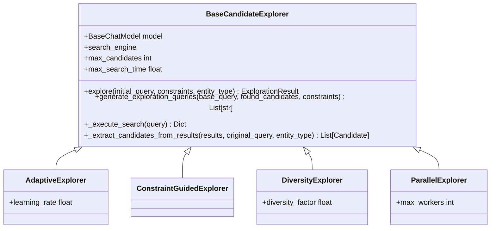
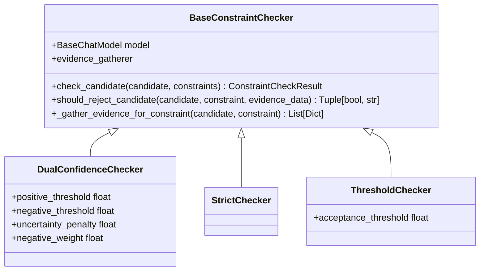
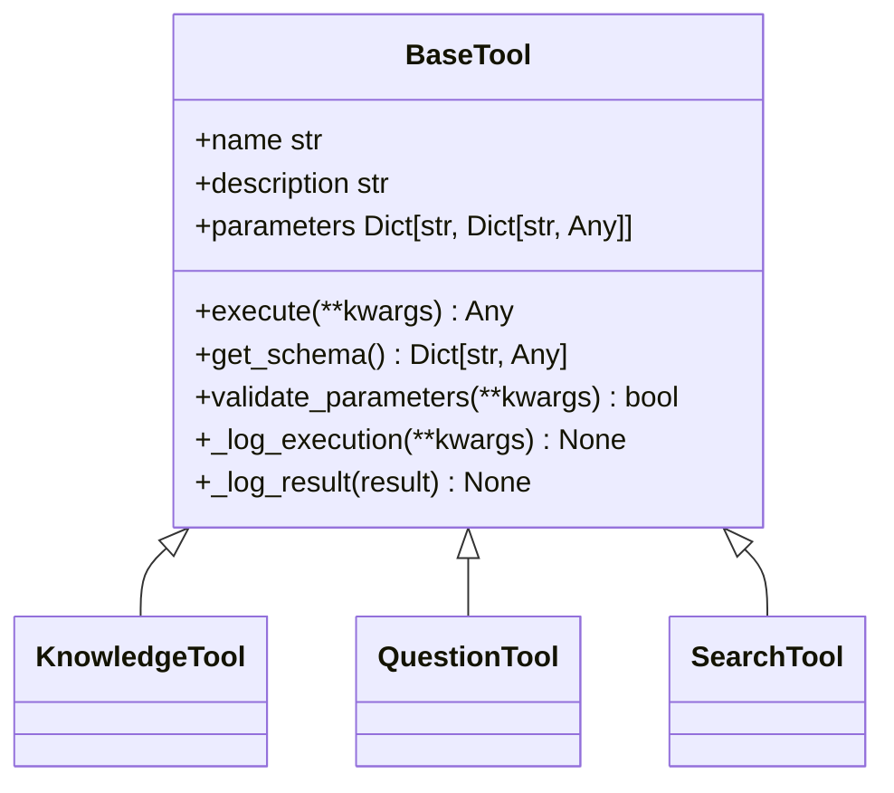
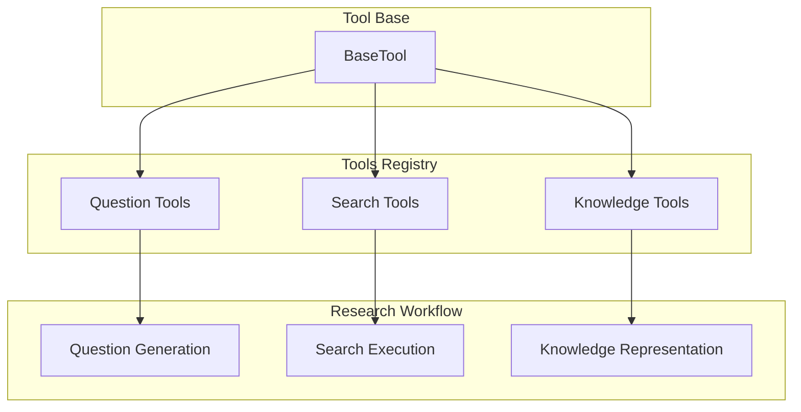
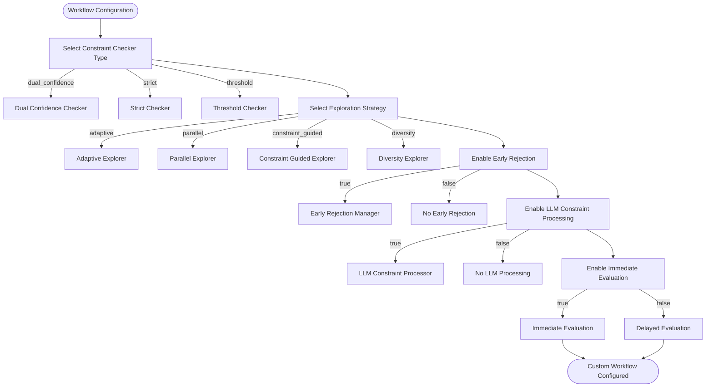
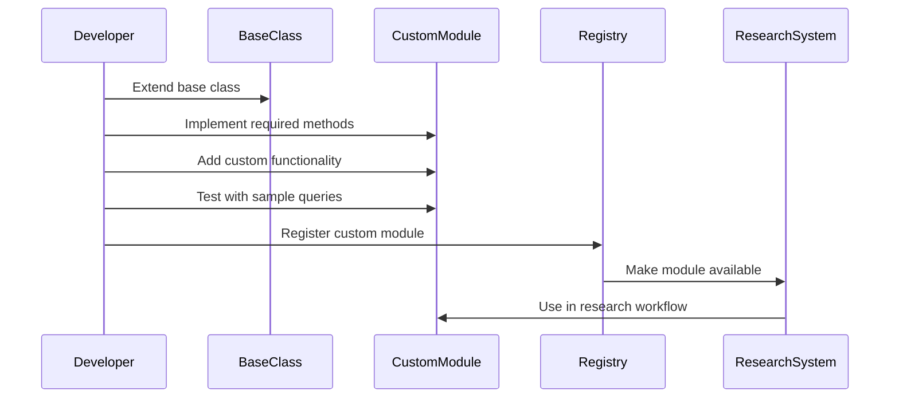

# Modular Strategy

<cite>
**Referenced Files in This Document**   
- [modular_strategy.py](file://src/local_deep_research/advanced_search_system/strategies/modular_strategy.py)
- [base_tool.py](file://src/local_deep_research/advanced_search_system/tools/base_tool.py)
- [knowledge_tools/__init__.py](file://src/local_deep_research/advanced_search_system/tools/knowledge_tools/__init__.py)
- [question_tools/__init__.py](file://src/local_deep_research/advanced_search_system/tools/question_tools/__init__.py)
- [search_tools/__init__.py](file://src/local_deep_research/advanced_search_system/tools/search_tools/__init__.py)
- [base_explorer.py](file://src/local_deep_research/advanced_search_system/candidate_exploration/base_explorer.py)
- [base_constraint_checker.py](file://src/local_deep_research/advanced_search_system/constraint_checking/base_constraint_checker.py)
</cite>

## Table of Contents
1. [Introduction](#introduction)
2. [Plugin Architecture](#plugin-architecture)
3. [Tools Registry System](#tools-registry-system)
4. [Custom Workflow Configurations](#custom-workflow-configurations)
5. [Use Cases](#use-cases)
6. [Developing Custom Modules](#developing-custom-modules)
7. [Conclusion](#conclusion)

## Introduction

The Modular Strategy is a sophisticated research framework that combines multiple specialized components into a customizable workflow. This strategy enables dynamic assembly of explorers, filters, and analyzers through a plugin architecture that leverages a comprehensive tools registry. The system is designed to support complex research processes by allowing the composition of functionality from knowledge_tools, question_tools, and search_tools. This documentation provides a detailed explanation of the architecture, implementation, and application of the Modular Strategy for various research domains.

**Section sources**
- [modular_strategy.py](file://src/local_deep_research/advanced_search_system/strategies/modular_strategy.py#L1-L80)

## Plugin Architecture

The plugin architecture of the Modular Strategy allows for the dynamic assembly of research components, enabling flexible and customizable workflows. This architecture is built around three core components: explorers, filters, and analyzers, each of which can be configured and combined to suit specific research needs.

The explorers component is responsible for candidate exploration and is implemented through the `BaseCandidateExplorer` class. This base class provides the common interface and shared functionality for all candidate explorers, supporting various exploration strategies such as breadth-first, depth-first, constraint-guided, diversity-focused, and adaptive exploration. The architecture allows for the creation of specialized explorers like `AdaptiveExplorer`, `ConstraintGuidedExplorer`, `DiversityExplorer`, and `ParallelExplorer`, each optimized for different research scenarios.

**Diagram sources**
- [base_explorer.py](file://src/local_deep_research/advanced_search_system/candidate_exploration/base_explorer.py#L43-L342)

The filters component is designed to refine and validate research findings through constraint checking. Implemented via the `BaseConstraintChecker` class, this component provides a standardized interface for evaluating candidates against specified constraints. The architecture supports multiple constraint checking strategies, including `DualConfidenceChecker`, `StrictChecker`, and `ThresholdChecker`, each offering different approaches to candidate evaluation.

**Diagram sources**
- [base_constraint_checker.py](file://src/local_deep_research/advanced_search_system/constraint_checking/base_constraint_checker.py#L31-L123)

**Section sources**
- [base_explorer.py](file://src/local_deep_research/advanced_search_system/candidate_exploration/base_explorer.py#L1-L342)
- [base_constraint_checker.py](file://src/local_deep_research/advanced_search_system/constraint_checking/base_constraint_checker.py#L1-L123)

## Tools Registry System

The tools registry system is a core component of the Modular Strategy, enabling the composition of functionality from various tool categories. This system is implemented through a hierarchical structure of tool packages, including knowledge_tools, question_tools, and search_tools, each providing specialized capabilities for different aspects of the research process.

The base tool class, `BaseTool`, defines the common interface and shared functionality for all agent-compatible tools. This abstract base class establishes the fundamental methods and properties that all tools must implement, ensuring consistency across the system. The class includes methods for execution, schema retrieval, parameter validation, and logging, providing a robust foundation for tool development.

**Diagram sources**
- [base_tool.py](file://src/local_deep_research/advanced_search_system/tools/base_tool.py#L24-L124)

The knowledge_tools package provides functionality for managing and processing research knowledge. These tools are designed to handle the storage, retrieval, and analysis of information gathered during the research process. The package includes capabilities for knowledge representation, context management, and information synthesis, enabling the system to build comprehensive understanding of research topics.

The question_tools package focuses on generating and managing research questions. This category of tools is responsible for creating effective search queries, decomposing complex questions, and generating follow-up questions based on research findings. The tools in this package work in conjunction with the LLM to create intelligent question strategies that maximize information retrieval.

The search_tools package contains tools for executing and managing search operations. These tools interface with various search engines and retrieval systems, handling the technical aspects of information gathering. The package includes functionality for query optimization, result processing, and search strategy implementation.

**Diagram sources**
- [base_tool.py](file://src/local_deep_research/advanced_search_system/tools/base_tool.py#L1-L124)
- [knowledge_tools/__init__.py](file://src/local_deep_research/advanced_search_system/tools/knowledge_tools/__init__.py#L1-L2)
- [question_tools/__init__.py](file://src/local_deep_research/advanced_search_system/tools/question_tools/__init__.py#L1-L2)
- [search_tools/__init__.py](file://src/local_deep_research/advanced_search_system/tools/search_tools/__init__.py#L1-L2)

**Section sources**
- [base_tool.py](file://src/local_deep_research/advanced_search_system/tools/base_tool.py#L1-L124)
- [knowledge_tools/__init__.py](file://src/local_deep_research/advanced_search_system/tools/knowledge_tools/__init__.py#L1-L2)
- [question_tools/__init__.py](file://src/local_deep_research/advanced_search_system/tools/question_tools/__init__.py#L1-L2)
- [search_tools/__init__.py](file://src/local_deep_research/advanced_search_system/tools/search_tools/__init__.py#L1-L2)

## Custom Workflow Configurations

The Modular Strategy supports custom workflow configurations for specific research domains through its flexible plugin architecture and tools registry system. This capability enables researchers to tailor the system to their specific needs, creating optimized workflows for different types of research.

For specialized industry analysis, the system can be configured to focus on industry-specific data sources and analytical methods. This involves selecting appropriate search engines, configuring constraint checkers for industry-specific criteria, and using specialized question generation strategies. For example, in financial industry analysis, the workflow might include tools for analyzing financial statements, market trends, and regulatory filings.

For compliance audits, the Modular Strategy can be configured to ensure thorough examination of regulatory requirements and organizational policies. This involves setting up constraint checkers to verify compliance with specific regulations, using question tools to generate audit questions, and employing knowledge tools to maintain audit trails and documentation. The system can be configured to prioritize accuracy and completeness over speed, ensuring comprehensive coverage of compliance requirements.

The configuration process involves several key parameters that can be adjusted to optimize the research workflow:

**Diagram sources**
- [modular_strategy.py](file://src/local_deep_research/advanced_search_system/strategies/modular_strategy.py#L286-L344)

The system also supports the creation of domain-specific question generators, such as the `BrowseCompQuestionGenerator` for BrowseComp-style queries. These specialized generators can be configured to extract concrete entities, generate progressive search combinations, and focus on verifiable facts, optimizing the research process for specific types of questions.

**Section sources**
- [modular_strategy.py](file://src/local_deep_research/advanced_search_system/strategies/modular_strategy.py#L286-L344)

## Use Cases

The Modular Strategy is particularly effective for use cases requiring tailored research processes, such as specialized industry analysis and compliance audits. These applications demonstrate the system's ability to adapt to specific requirements and deliver high-quality research outcomes.

For specialized industry analysis, the Modular Strategy can be configured to address the unique challenges of different sectors. In pharmaceutical research, for example, the system can be set up to focus on clinical trial data, regulatory approvals, and scientific publications. The workflow might include specialized search tools for medical databases, constraint checkers for regulatory requirements, and knowledge tools for synthesizing complex scientific information.

For compliance audits, the system provides a structured approach to verifying adherence to regulations and standards. The workflow can be configured to systematically examine organizational policies, procedures, and practices against regulatory requirements. This involves using constraint checkers to verify compliance, question tools to generate audit questions, and knowledge tools to maintain comprehensive documentation of findings.

The system's flexibility allows for the creation of custom workflows that address specific research challenges. For example, in environmental impact assessments, the workflow might include tools for analyzing geographical data, climate models, and ecological studies. In financial risk assessment, the workflow might incorporate tools for analyzing market trends, economic indicators, and financial statements.

The Modular Strategy also supports research processes that require iterative refinement and validation. By combining different explorers, filters, and analyzers, researchers can create workflows that progressively refine their understanding of a topic, validate findings through multiple sources, and ensure the accuracy and reliability of their conclusions.

**Section sources**
- [modular_strategy.py](file://src/local_deep_research/advanced_search_system/strategies/modular_strategy.py#L403-L800)

## Developing Custom Modules

Developing custom modules for the Modular Strategy involves extending the existing plugin architecture to create specialized components for specific research needs. This process requires understanding the base classes and interfaces provided by the system and implementing new functionality that integrates seamlessly with the existing framework.

To create a custom explorer, developers should extend the `BaseCandidateExplorer` class and implement the required methods. This involves defining the exploration strategy, query generation approach, and candidate extraction logic. The new explorer should be designed to work with the existing constraint checking and knowledge management components, ensuring compatibility with the overall system architecture.

For custom constraint checkers, developers should extend the `BaseConstraintChecker` class and implement the constraint evaluation logic. This involves defining how candidates are assessed against constraints, how evidence is gathered and analyzed, and how rejection decisions are made. The new checker should be designed to work with the existing explorer and knowledge components, providing a consistent interface for candidate evaluation.

When developing custom tools for the tools registry, developers should extend the `BaseTool` class and implement the required methods. This involves defining the tool's functionality, parameters, and execution logic. The new tool should be designed to work with the existing registry system, ensuring that it can be discovered, instantiated, and used by the research workflow.

The development process should follow these steps:

1. Identify the specific research need that the custom module will address
2. Select the appropriate base class to extend (explorer, constraint checker, or tool)
3. Implement the required methods and functionality
4. Test the module with sample research queries
5. Integrate the module into the tools registry
6. Document the module's functionality and usage

**Diagram sources**
- [base_tool.py](file://src/local_deep_research/advanced_search_system/tools/base_tool.py#L24-L124)
- [base_explorer.py](file://src/local_deep_research/advanced_search_system/candidate_exploration/base_explorer.py#L43-L342)
- [base_constraint_checker.py](file://src/local_deep_research/advanced_search_system/constraint_checking/base_constraint_checker.py#L31-L123)

**Section sources**
- [base_tool.py](file://src/local_deep_research/advanced_search_system/tools/base_tool.py#L1-L124)
- [base_explorer.py](file://src/local_deep_research/advanced_search_system/candidate_exploration/base_explorer.py#L1-L342)
- [base_constraint_checker.py](file://src/local_deep_research/advanced_search_system/constraint_checking/base_constraint_checker.py#L1-L123)

## Conclusion

The Modular Strategy represents a powerful and flexible approach to research that combines multiple specialized components into customizable workflows. Through its plugin architecture and tools registry system, the strategy enables the dynamic assembly of explorers, filters, and analyzers, allowing researchers to create tailored workflows for specific domains and use cases.

The system's design emphasizes flexibility, extensibility, and integration, providing a robust foundation for developing custom research solutions. By leveraging the tools registry to compose functionality from knowledge_tools, question_tools, and search_tools, researchers can create sophisticated workflows that address complex research challenges.

The Modular Strategy is particularly well-suited for applications requiring tailored research processes, such as specialized industry analysis and compliance audits. Its ability to adapt to specific requirements and integrate custom modules makes it a valuable tool for researchers across various domains.

As research needs continue to evolve, the Modular Strategy provides a scalable and maintainable framework for developing advanced research capabilities. By following the principles of modularity, composition, and extensibility, the system ensures that it can adapt to future requirements and incorporate new technologies and methodologies.

[No sources needed since this section summarizes without analyzing specific files]