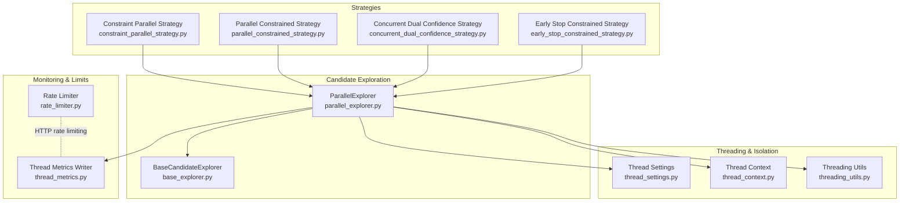
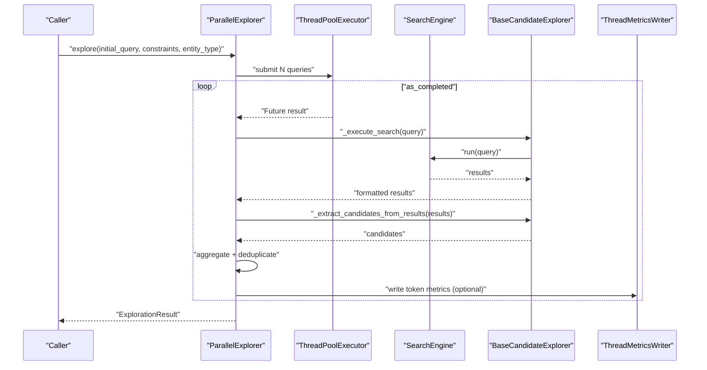
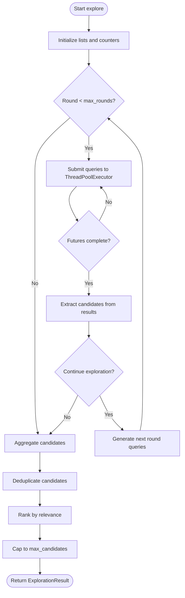
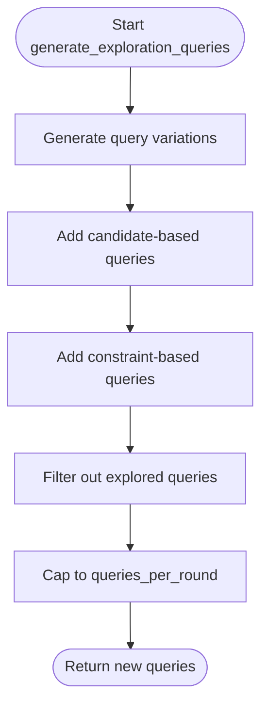
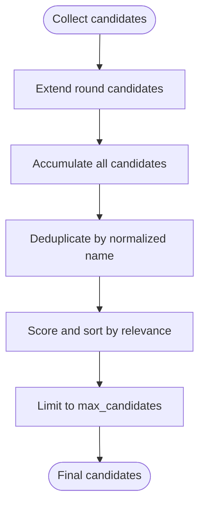
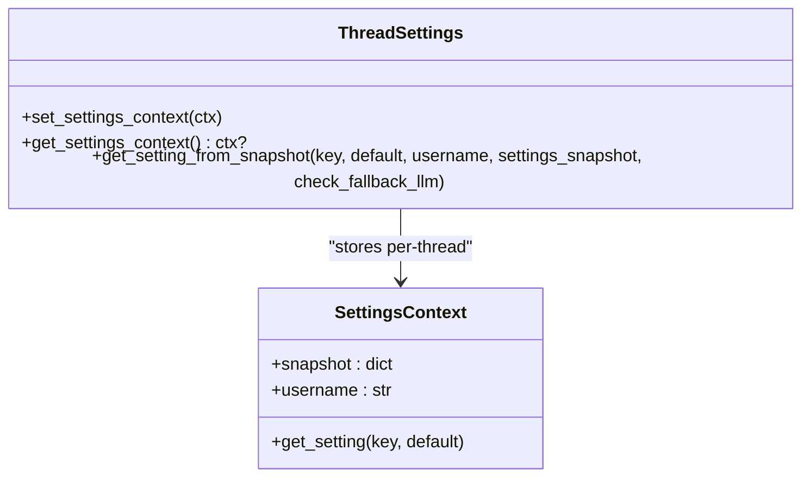
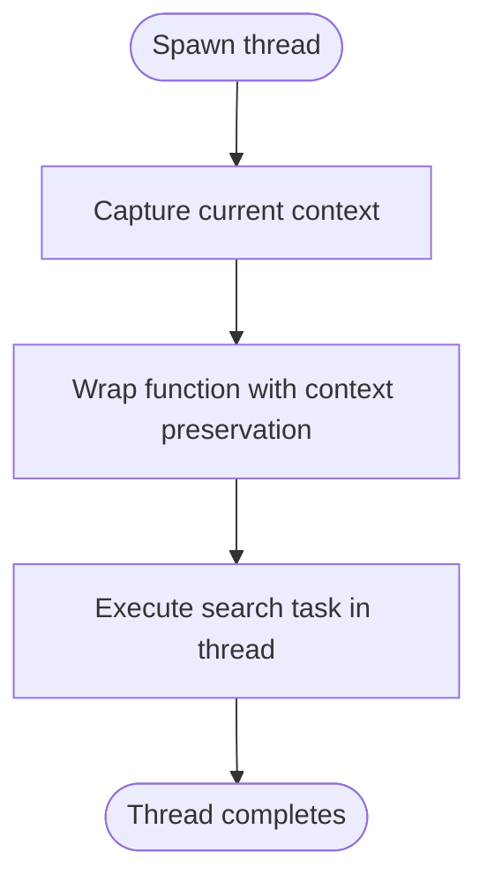
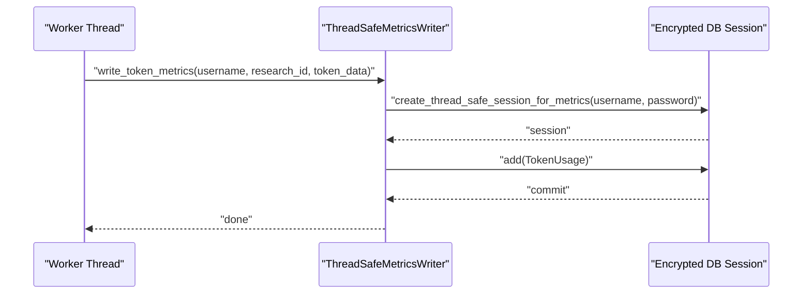
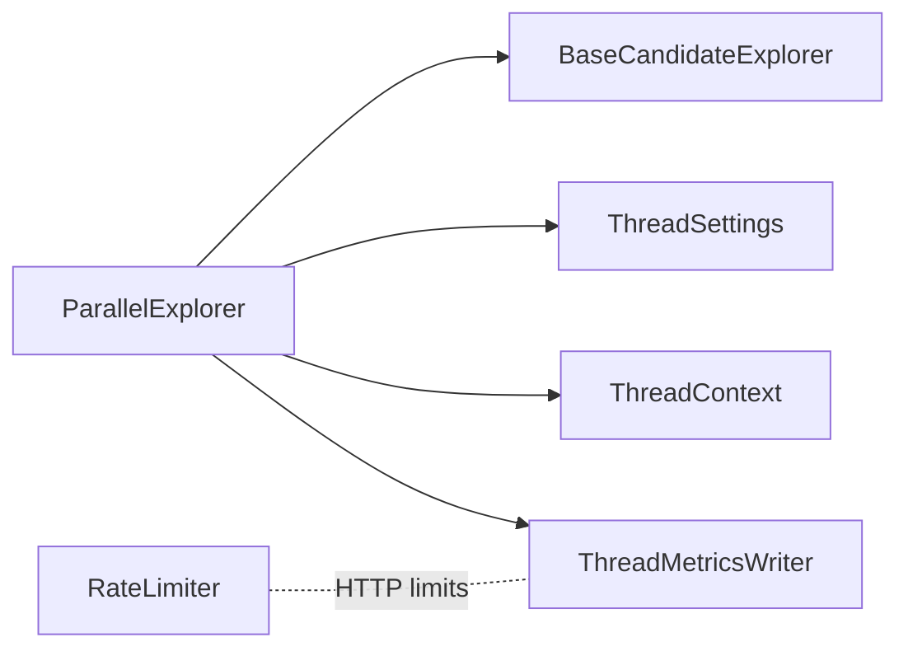

# Parallel Search Strategy

<cite>
**Referenced Files in This Document**
- [parallel_explorer.py](file://src/local_deep_research/advanced_search_system/candidate_exploration/parallel_explorer.py)
- [base_explorer.py](file://src/local_deep_research/advanced_search_system/candidate_exploration/base_explorer.py)
- [thread_settings.py](file://src/local_deep_research/config/thread_settings.py)
- [thread_context.py](file://src/local_deep_research/utilities/thread_context.py)
- [threading_utils.py](file://src/local_deep_research/utilities/threading_utils.py)
- [thread_metrics.py](file://src/local_deep_research/database/thread_metrics.py)
- [rate_limiter.py](file://src/local_deep_research/security/rate_limiter.py)
- [search_config.py](file://src/local_deep_research/config/search_config.py)
- [constraint_parallel_strategy.py](file://src/local_deep_research/advanced_search_system/strategies/constraint_parallel_strategy.py)
- [parallel_constrained_strategy.py](file://src/local_deep_research/advanced_search_system/strategies/parallel_constrained_strategy.py)
- [concurrent_dual_confidence_strategy.py](file://src/local_deep_research/advanced_search_system/strategies/concurrent_dual_confidence_strategy.py)
- [early_stop_constrained_strategy.py](file://src/local_deep_research/advanced_search_system/strategies/early_stop_constrained_strategy.py)
</cite>

## Table of Contents
1. [Introduction](#introduction)
2. [Project Structure](#project-structure)
3. [Core Components](#core-components)
4. [Architecture Overview](#architecture-overview)
5. [Detailed Component Analysis](#detailed-component-analysis)
6. [Dependency Analysis](#dependency-analysis)
7. [Performance Considerations](#performance-considerations)
8. [Troubleshooting Guide](#troubleshooting-guide)
9. [Conclusion](#conclusion)
10. [Appendices](#appendices)

## Introduction
This document explains the Parallel Search Strategy that accelerates discovery by executing multiple search threads simultaneously. It covers the threading model and resource management in the parallel explorer, how results are aggregated and deduplicated across parallel branches, configuration examples for concurrency limits and thread isolation, integration with the rate limiter and thread metrics for performance monitoring, and guidance on optimal use cases and balancing speed with API rate limits and cost considerations.

## Project Structure
The Parallel Search Strategy spans several modules:
- Candidate exploration: parallel_explorer and base_explorer define the breadth-first exploration and shared utilities.
- Threading and isolation: thread_settings, thread_context, and threading_utils provide thread-local settings and context propagation.
- Metrics and rate limiting: thread_metrics and rate_limiter integrate performance monitoring and HTTP request throttling.
- Strategies: additional parallel strategies illustrate broader patterns of concurrent execution.

**Diagram sources**
- [parallel_explorer.py](file://src/local_deep_research/advanced_search_system/candidate_exploration/parallel_explorer.py#L1-L154)
- [base_explorer.py](file://src/local_deep_research/advanced_search_system/candidate_exploration/base_explorer.py#L1-L150)
- [thread_settings.py](file://src/local_deep_research/config/thread_settings.py#L1-L127)
- [thread_context.py](file://src/local_deep_research/utilities/thread_context.py#L1-L100)
- [threading_utils.py](file://src/local_deep_research/utilities/threading_utils.py#L1-L105)
- [thread_metrics.py](file://src/local_deep_research/database/thread_metrics.py#L1-L160)
- [rate_limiter.py](file://src/local_deep_research/security/rate_limiter.py#L1-L152)
- [constraint_parallel_strategy.py](file://src/local_deep_research/advanced_search_system/strategies/constraint_parallel_strategy.py#L1-L39)
- [parallel_constrained_strategy.py](file://src/local_deep_research/advanced_search_system/strategies/parallel_constrained_strategy.py#L1-L49)
- [concurrent_dual_confidence_strategy.py](file://src/local_deep_research/advanced_search_system/strategies/concurrent_dual_confidence_strategy.py#L35-L77)
- [early_stop_constrained_strategy.py](file://src/local_deep_research/advanced_search_system/strategies/early_stop_constrained_strategy.py#L1-L44)

**Section sources**
- [parallel_explorer.py](file://src/local_deep_research/advanced_search_system/candidate_exploration/parallel_explorer.py#L1-L154)
- [base_explorer.py](file://src/local_deep_research/advanced_search_system/candidate_exploration/base_explorer.py#L1-L150)
- [thread_settings.py](file://src/local_deep_research/config/thread_settings.py#L1-L127)
- [thread_context.py](file://src/local_deep_research/utilities/thread_context.py#L1-L100)
- [threading_utils.py](file://src/local_deep_research/utilities/threading_utils.py#L1-L105)
- [thread_metrics.py](file://src/local_deep_research/database/thread_metrics.py#L1-L160)
- [rate_limiter.py](file://src/local_deep_research/security/rate_limiter.py#L1-L152)
- [constraint_parallel_strategy.py](file://src/local_deep_research/advanced_search_system/strategies/constraint_parallel_strategy.py#L1-L39)
- [parallel_constrained_strategy.py](file://src/local_deep_research/advanced_search_system/strategies/parallel_constrained_strategy.py#L1-L49)
- [concurrent_dual_confidence_strategy.py](file://src/local_deep_research/advanced_search_system/strategies/concurrent_dual_confidence_strategy.py#L35-L77)
- [early_stop_constrained_strategy.py](file://src/local_deep_research/advanced_search_system/strategies/early_stop_constrained_strategy.py#L1-L44)

## Core Components
- ParallelExplorer: Executes multiple queries in parallel using a thread pool, aggregates and deduplicates candidates, and ranks by relevance.
- BaseCandidateExplorer: Provides shared utilities for search execution, candidate extraction, deduplication, ranking, and termination checks.
- Thread settings and context: Provide thread-local storage for settings snapshots and propagate research context across threads.
- Metrics writer: Enables background threads to write metrics to the encrypted database using thread-local sessions.
- Rate limiter: Applies HTTP request rate limiting for protection and resource control.

**Section sources**
- [parallel_explorer.py](file://src/local_deep_research/advanced_search_system/candidate_exploration/parallel_explorer.py#L23-L154)
- [base_explorer.py](file://src/local_deep_research/advanced_search_system/candidate_exploration/base_explorer.py#L43-L342)
- [thread_settings.py](file://src/local_deep_research/config/thread_settings.py#L1-L127)
- [thread_context.py](file://src/local_deep_research/utilities/thread_context.py#L1-L100)
- [thread_metrics.py](file://src/local_deep_research/database/thread_metrics.py#L1-L160)
- [rate_limiter.py](file://src/local_deep_research/security/rate_limiter.py#L1-L152)

## Architecture Overview
The Parallel Search Strategy orchestrates breadth-first exploration with parallelism:
- Initialization sets concurrency limits and rounds.
- Each round submits queries to a ThreadPoolExecutor.
- Results are collected as they complete, candidates extracted, and duplicates removed.
- Final ranking and candidate caps produce the result.

**Diagram sources**
- [parallel_explorer.py](file://src/local_deep_research/advanced_search_system/candidate_exploration/parallel_explorer.py#L55-L154)
- [base_explorer.py](file://src/local_deep_research/advanced_search_system/candidate_exploration/base_explorer.py#L118-L192)
- [thread_metrics.py](file://src/local_deep_research/database/thread_metrics.py#L98-L157)

## Detailed Component Analysis

### ParallelExplorer Threading Model and Resource Management
- Concurrency control: Uses a ThreadPoolExecutor with max_workers to cap parallelism.
- Round-based exploration: Iterates up to max_rounds, generating new queries per round from base, candidates, and constraints.
- Termination: Continues while time and candidate limits are not exceeded.
- Resource cleanup: Uses context-managed thread pools; futures are awaited as they complete.

**Diagram sources**
- [parallel_explorer.py](file://src/local_deep_research/advanced_search_system/candidate_exploration/parallel_explorer.py#L55-L154)
- [base_explorer.py](file://src/local_deep_research/advanced_search_system/candidate_exploration/base_explorer.py#L269-L342)

**Section sources**
- [parallel_explorer.py](file://src/local_deep_research/advanced_search_system/candidate_exploration/parallel_explorer.py#L34-L154)
- [base_explorer.py](file://src/local_deep_research/advanced_search_system/candidate_exploration/base_explorer.py#L269-L342)

### Query Generation and Exploration Paths
- Query variations: Generates keyword variants of the base query.
- Candidate-based queries: Builds queries around discovered candidate names.
- Constraint-based queries: Adds queries focused on constraint values.
- Exploration paths: Records per-query candidate counts for auditability.

**Diagram sources**
- [parallel_explorer.py](file://src/local_deep_research/advanced_search_system/candidate_exploration/parallel_explorer.py#L155-L253)

**Section sources**
- [parallel_explorer.py](file://src/local_deep_research/advanced_search_system/candidate_exploration/parallel_explorer.py#L155-L253)

### Results Aggregation and Deduplication
- Aggregation: Extends candidate lists across futures as they complete.
- Deduplication: Removes duplicates by exact name normalization.
- Ranking: Scores candidates by query overlap and result title overlap, then sorts descending.

**Diagram sources**
- [parallel_explorer.py](file://src/local_deep_research/advanced_search_system/candidate_exploration/parallel_explorer.py#L113-L154)
- [base_explorer.py](file://src/local_deep_research/advanced_search_system/candidate_exploration/base_explorer.py#L289-L342)

**Section sources**
- [parallel_explorer.py](file://src/local_deep_research/advanced_search_system/candidate_exploration/parallel_explorer.py#L113-L154)
- [base_explorer.py](file://src/local_deep_research/advanced_search_system/candidate_exploration/base_explorer.py#L289-L342)

### Thread Settings and Thread Isolation
- Thread-local settings: A shared thread-local store holds a settings context per thread, enabling isolated configuration access without database calls.
- Snapshot-based retrieval: get_setting_from_snapshot reads from a provided settings_snapshot or the thread’s context, with fallback behavior controlled by environment flags.
- Thread isolation: Tests confirm that contexts are isolated between threads.

**Diagram sources**
- [thread_settings.py](file://src/local_deep_research/config/thread_settings.py#L1-L127)

**Section sources**
- [thread_settings.py](file://src/local_deep_research/config/thread_settings.py#L1-L127)
- [tests/config/test_thread_settings.py](file://tests/config/test_thread_settings.py#L1-L192)

### Thread Context Propagation
- Research context preservation: A decorator preserves research context (e.g., research_id) across thread boundaries for metrics and logging.
- Thread-local storage: A thread-local container stores and copies context data to ensure each thread has its own copy.

**Diagram sources**
- [thread_context.py](file://src/local_deep_research/utilities/thread_context.py#L72-L100)

**Section sources**
- [thread_context.py](file://src/local_deep_research/utilities/thread_context.py#L1-L100)

### Threading Utilities for App Context and Caching
- App context injection: A decorator wraps thread entry points to push the current Flask app context into worker threads.
- Thread-specific caching: A cache variant ensures cache entries are local to the thread that created them.

**Section sources**
- [threading_utils.py](file://src/local_deep_research/utilities/threading_utils.py#L1-L105)

### Metrics Integration for Performance Monitoring
- Thread-safe metrics writer: Creates per-thread encrypted sessions and writes token usage records with fields covering model, provider, tokens, response time, and context overflow.
- Usage: Can be invoked from background threads to persist metrics without blocking the main request flow.

**Diagram sources**
- [thread_metrics.py](file://src/local_deep_research/database/thread_metrics.py#L1-L160)

**Section sources**
- [thread_metrics.py](file://src/local_deep_research/database/thread_metrics.py#L1-L160)

### Rate Limiter Integration
- HTTP rate limiting: Flask-Limiter applies per-user or per-IP limits with configurable fail-closed behavior via environment variables.
- Production guidance: Use Redis-backed storage for multi-worker deployments; enable fail-closed in production to enforce limits.

**Section sources**
- [rate_limiter.py](file://src/local_deep_research/security/rate_limiter.py#L1-L152)

### Additional Parallel Strategies
- Constraint Parallel Strategy: Runs separate searches for each constraint in parallel and aggregates candidates.
- Parallel Constrained Strategy: Combines constraints in initial searches, runs parallel searches, and progressively relaxes constraints.
- Concurrent Dual Confidence Strategy: Uses a dedicated ThreadPoolExecutor for concurrent candidate evaluation alongside progressive search.
- Early Stop Constrained Strategy: Evaluates candidates immediately upon discovery and stops early when a high-confidence match is found.

**Section sources**
- [constraint_parallel_strategy.py](file://src/local_deep_research/advanced_search_system/strategies/constraint_parallel_strategy.py#L1-L39)
- [parallel_constrained_strategy.py](file://src/local_deep_research/advanced_search_system/strategies/parallel_constrained_strategy.py#L1-L49)
- [concurrent_dual_confidence_strategy.py](file://src/local_deep_research/advanced_search_system/strategies/concurrent_dual_confidence_strategy.py#L35-L77)
- [early_stop_constrained_strategy.py](file://src/local_deep_research/advanced_search_system/strategies/early_stop_constrained_strategy.py#L1-L44)

## Dependency Analysis
- ParallelExplorer depends on BaseCandidateExplorer for shared utilities and on the search engine for query execution.
- Thread settings and context propagate configuration and research context to worker threads.
- Metrics writer depends on encrypted database session creation and SQLAlchemy ORM.
- Rate limiter integrates with Flask-Limiter and environment configuration.

**Diagram sources**
- [parallel_explorer.py](file://src/local_deep_research/advanced_search_system/candidate_exploration/parallel_explorer.py#L23-L154)
- [base_explorer.py](file://src/local_deep_research/advanced_search_system/candidate_exploration/base_explorer.py#L43-L150)
- [thread_settings.py](file://src/local_deep_research/config/thread_settings.py#L1-L127)
- [thread_context.py](file://src/local_deep_research/utilities/thread_context.py#L1-L100)
- [thread_metrics.py](file://src/local_deep_research/database/thread_metrics.py#L1-L160)
- [rate_limiter.py](file://src/local_deep_research/security/rate_limiter.py#L1-L152)

**Section sources**
- [parallel_explorer.py](file://src/local_deep_research/advanced_search_system/candidate_exploration/parallel_explorer.py#L23-L154)
- [base_explorer.py](file://src/local_deep_research/advanced_search_system/candidate_exploration/base_explorer.py#L43-L150)
- [thread_settings.py](file://src/local_deep_research/config/thread_settings.py#L1-L127)
- [thread_context.py](file://src/local_deep_research/utilities/thread_context.py#L1-L100)
- [thread_metrics.py](file://src/local_deep_research/database/thread_metrics.py#L1-L160)
- [rate_limiter.py](file://src/local_deep_research/security/rate_limiter.py#L1-L152)

## Performance Considerations
- Concurrency tuning:
  - max_workers controls parallelism; increase cautiously to avoid API rate limits and cost spikes.
  - queries_per_round balances breadth vs. overhead; too many queries per round increases contention.
  - max_rounds controls depth; reduce for time-sensitive queries.
- Cost and rate limits:
  - Integrate with external API rate limits and monitor via metrics; consider backoff and retries at the search engine level.
  - Use rate_limiter for HTTP endpoints to protect resources.
- Metrics-driven optimization:
  - Track response times, token usage, and context truncation to detect bottlenecks.
  - Use thread-specific caches to avoid redundant computations within a thread.
- Time budgeting:
  - max_search_time prevents runaway exploration; combine with max_candidates to cap work.

[No sources needed since this section provides general guidance]

## Troubleshooting Guide
- Settings context errors:
  - Symptom: No settings context available in thread.
  - Cause: Missing settings_snapshot or thread context.
  - Fix: Provide settings_snapshot to thread-executed functions or set thread context before spawning workers.
- Metrics session errors:
  - Symptom: Cannot determine username or missing password for thread metrics.
  - Cause: Thread did not set user credentials or Flask session not available.
  - Fix: Ensure set_user_password is called per thread and username is available.
- Rate limiting failures:
  - Symptom: Rate limiter not initialized or inconsistent behavior.
  - Cause: Missing init_rate_limiter or environment misconfiguration.
  - Fix: Initialize rate limiter with app and set RATE_LIMIT_FAIL_CLOSED appropriately for production.

**Section sources**
- [thread_settings.py](file://src/local_deep_research/config/thread_settings.py#L120-L127)
- [thread_metrics.py](file://src/local_deep_research/database/thread_metrics.py#L66-L97)
- [rate_limiter.py](file://src/local_deep_research/security/rate_limiter.py#L24-L48)

## Conclusion
The Parallel Search Strategy accelerates discovery through breadth-first exploration with controlled concurrency. It integrates thread-local settings and context propagation, aggregates and deduplicates results across parallel branches, and supports performance monitoring via metrics. By tuning concurrency limits, leveraging rate limiting, and monitoring costs, teams can optimize for speed while respecting API constraints and budget targets.

[No sources needed since this section summarizes without analyzing specific files]

## Appendices

### Configuration Examples and Best Practices
- Concurrency limits:
  - Adjust max_workers to balance throughput and API limits.
  - Reduce queries_per_round for highly competitive or expensive search engines.
  - Lower max_rounds for time-sensitive queries.
- Thread isolation:
  - Provide settings_snapshot to worker threads to avoid database access.
  - Use thread_context decorators to propagate research context.
- Metrics and monitoring:
  - Enable thread metrics writing to track token usage and response times.
  - Monitor context truncation and adjust search parameters accordingly.
- Rate limiting:
  - Apply rate_limiter decorators to HTTP endpoints.
  - Use Redis-backed storage for multi-worker deployments.
  - Enable fail-closed in production environments.

**Section sources**
- [parallel_explorer.py](file://src/local_deep_research/advanced_search_system/candidate_exploration/parallel_explorer.py#L34-L54)
- [thread_settings.py](file://src/local_deep_research/config/thread_settings.py#L35-L127)
- [thread_context.py](file://src/local_deep_research/utilities/thread_context.py#L72-L100)
- [thread_metrics.py](file://src/local_deep_research/database/thread_metrics.py#L1-L160)
- [rate_limiter.py](file://src/local_deep_research/security/rate_limiter.py#L51-L86)