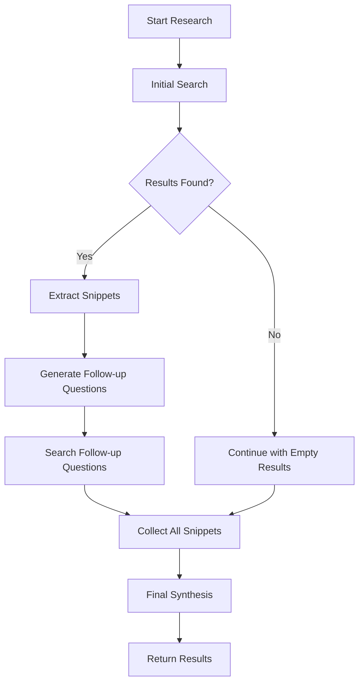
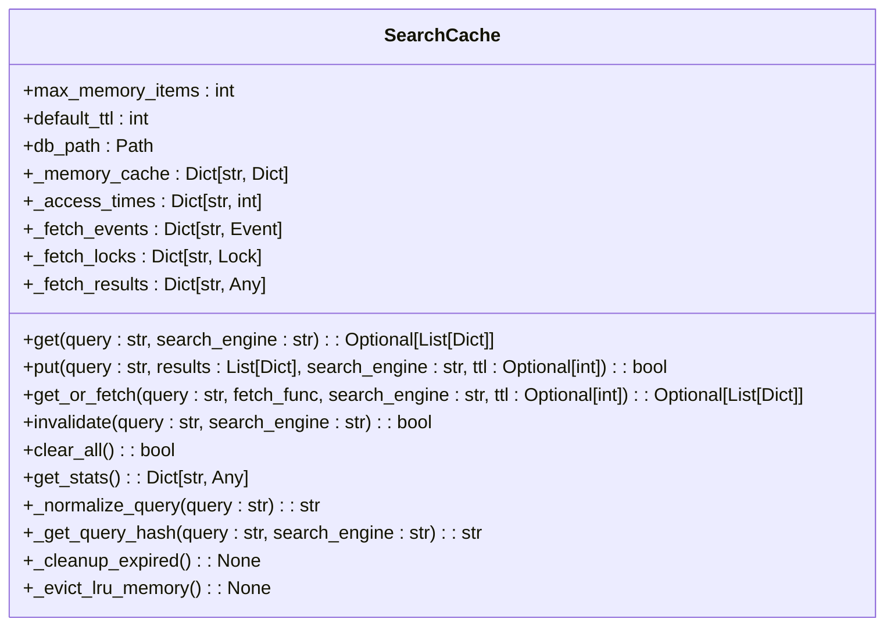
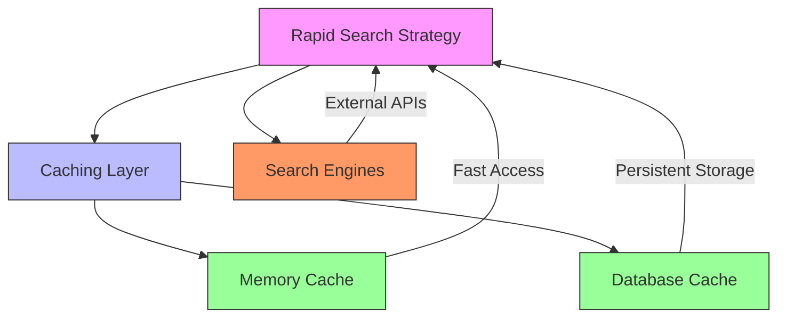

# Rapid Search Strategy

<cite>
**Referenced Files in This Document**   
- [rapid_search_strategy.py](file://src/local_deep_research/advanced_search_system/strategies/rapid_search_strategy.py)
- [search_cache.py](file://src/local_deep_research/utilities/search_cache.py)
- [search_config.py](file://src/local_deep_research/config/search_config.py)
- [search_system_factory.py](file://src/local_deep_research/search_system_factory.py)
</cite>

## Table of Contents
1. [Introduction](#introduction)
2. [Execution Flow](#execution-flow)
3. [Caching Mechanism](#caching-mechanism)
4. [Configuration Options](#configuration-options)
5. [Use Cases](#use-cases)
6. [Performance Implications](#performance-implications)

## Introduction
The Rapid Search Strategy is designed for low-latency responses by minimizing LLM interactions and search depth. This strategy bypasses extensive verification and decomposition processes, focusing on speed through cached results and simple query routing. It is particularly useful when quick, approximate answers are preferred over comprehensive analysis.

**Section sources**
- [rapid_search_strategy.py](file://src/local_deep_research/advanced_search_system/strategies/rapid_search_strategy.py#L1-L25)

## Execution Flow
The Rapid Search Strategy follows a streamlined execution flow that prioritizes speed:
1. Perform an initial search for the main query
2. Generate a limited number of follow-up questions (optional)
3. Execute searches for follow-up questions
4. Collect snippets from all search results
5. Perform a single final synthesis at the end using the citation handler

This approach avoids intermediate synthesis steps and extensive verification, significantly reducing processing time. The strategy always reports a single iteration regardless of the number of searches performed.

**Diagram sources**
- [rapid_search_strategy.py](file://src/local_deep_research/advanced_search_system/strategies/rapid_search_strategy.py#L51-L297)

**Section sources**
- [rapid_search_strategy.py](file://src/local_deep_research/advanced_search_system/strategies/rapid_search_strategy.py#L51-L297)

## Caching Mechanism
The Rapid Search Strategy leverages the search_cache utility for performance optimization. The caching system implements:
- TTL (Time-to-Live) based expiration
- LRU (Least Recently Used) eviction for memory cache
- Query normalization for consistent caching
- Stampede protection to prevent cache thundering herds
- Persistent storage in SQLite database

The cache stores search results with a default TTL of 3600 seconds (1 hour) and maintains both database persistence and in-memory caching for frequently accessed queries.

**Diagram sources**
- [search_cache.py](file://src/local_deep_research/utilities/search_cache.py#L22-L487)

**Section sources**
- [search_cache.py](file://src/local_deep_research/utilities/search_cache.py#L1-L507)

## Configuration Options
The Rapid Search Strategy can be configured through various settings that control timeout thresholds and result quality trade-offs:

| Configuration Option | Default Value | Description |
|----------------------|-------------|-------------|
| search.max_results | 10 | Maximum number of results to return from search engines |
| search.snippets_only | True | Whether to retrieve only snippets or full content |
| search.max_filtered_results | 5 | Maximum number of filtered results to keep |
| search.time_period | "all" | Time period filter for search results |
| search.region | "wt-wt" | Region filter for search results |
| search.safe_search | True | Whether to enable safe search filtering |

These configurations allow users to balance between response speed and result comprehensiveness based on their specific needs.

**Section sources**
- [search_config.py](file://src/local_deep_research/config/search_config.py#L1-L153)

## Use Cases
The Rapid Search Strategy is ideal for scenarios where quick, approximate answers are preferred over comprehensive analysis:

### Initial Exploration
When users are beginning research on a topic and need a quick overview, the Rapid Search Strategy provides immediate insights without the delay of thorough analysis. This allows researchers to rapidly assess whether a topic warrants deeper investigation.

### High-Volume Queries
In situations involving numerous queries, such as batch processing or automated systems, the speed advantage of this strategy enables handling large volumes of requests efficiently. The caching mechanism further enhances performance for repeated or similar queries.

### Time-Sensitive Applications
Applications requiring immediate responses, such as real-time assistance systems or interactive interfaces, benefit from the low-latency characteristics of this strategy. Users receive prompt feedback, improving overall experience.

### Resource-Constrained Environments
When computational resources or API rate limits are concerns, the reduced LLM interactions and simpler processing pipeline of the Rapid Search Strategy help conserve resources while still providing useful information.

**Section sources**
- [rapid_search_strategy.py](file://src/local_deep_research/advanced_search_system/strategies/rapid_search_strategy.py#L21-L23)

## Performance Implications
The Rapid Search Strategy offers significant performance advantages at the cost of thoroughness:

### Advantages
- **Reduced Latency**: By minimizing LLM interactions and avoiding iterative verification, response times are significantly decreased
- **Lower Resource Consumption**: Fewer LLM calls reduce computational costs and API usage
- **High Throughput**: The streamlined process enables handling more queries per unit time
- **Effective Caching**: The multi-layered caching system improves response times for repeated queries

### Trade-offs
- **Reduced Accuracy**: The lack of extensive verification may result in lower precision
- **Limited Depth**: Single-pass processing may miss nuanced information
- **Quality Variance**: Results depend heavily on initial search quality without refinement

The strategy's performance is further enhanced by integration with the search_cache system, which prevents redundant searches and reduces load on external search engines.

**Diagram sources**
- [rapid_search_strategy.py](file://src/local_deep_research/advanced_search_system/strategies/rapid_search_strategy.py#L21-L23)
- [search_cache.py](file://src/local_deep_research/utilities/search_cache.py#L22-L487)

**Section sources**
- [rapid_search_strategy.py](file://src/local_deep_research/advanced_search_system/strategies/rapid_search_strategy.py#L21-L23)
- [search_cache.py](file://src/local_deep_research/utilities/search_cache.py#L1-L507)