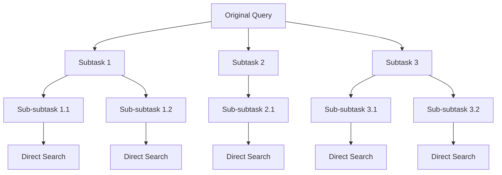
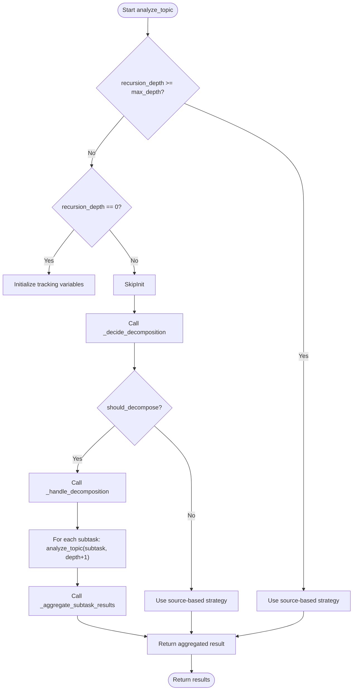
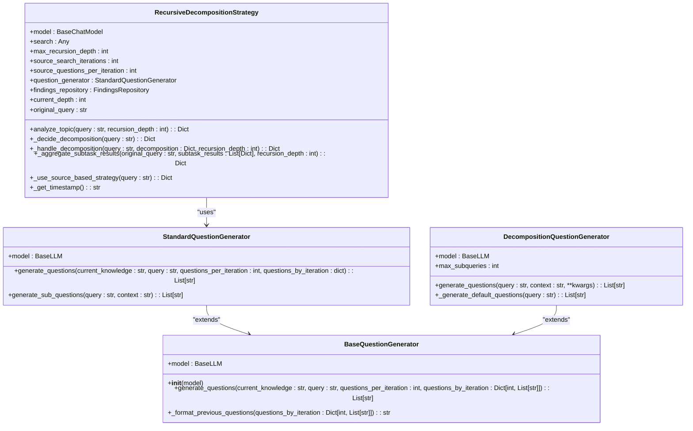
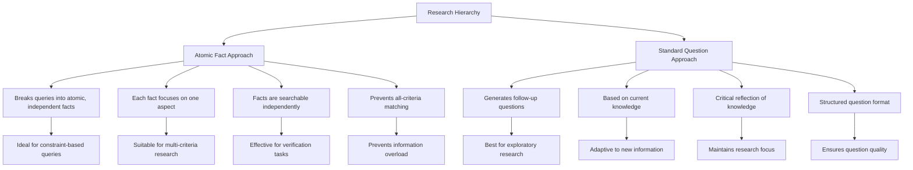
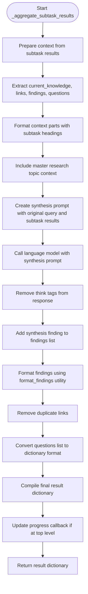
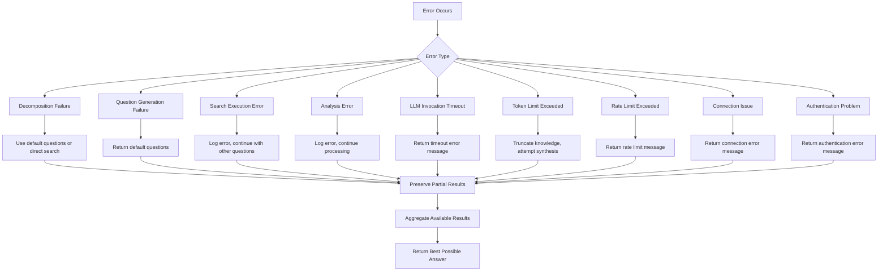

# Recursive Decomposition Strategy

<cite>
**Referenced Files in This Document**   
- [recursive_decomposition_strategy.py](file://src/local_deep_research/advanced_search_system/strategies/recursive_decomposition_strategy.py)
- [decomposition_question.py](file://src/local_deep_research/advanced_search_system/questions/decomposition_question.py)
- [atomic_fact_question.py](file://src/local_deep_research/advanced_search_system/questions/atomic_fact_question.py)
- [standard_question.py](file://src/local_deep_research/advanced_search_system/questions/standard_question.py)
- [base_strategy.py](file://src/local_deep_research/advanced_search_system/strategies/base_strategy.py)
- [source_based_strategy.py](file://src/local_deep_research/advanced_search_system/strategies/source_based_strategy.py)
- [repository.py](file://src/local_deep_research/advanced_search_system/findings/repository.py)
- [base_question.py](file://src/local_deep_research/advanced_search_system/questions/base_question.py)
</cite>

## Table of Contents
1. [Introduction](#introduction)
2. [Tree-Based Decomposition Logic](#tree-based-decomposition-logic)
3. [Traversal Algorithm](#traversal-algorithm)
4. [Integration with Decomposition and Query Generation](#integration-with-decomposition-and-query-generation)
5. [Research Hierarchy Structure](#research-hierarchy-structure)
6. [Termination Conditions and Result Synthesis](#termination-conditions-and-result-synthesis)
7. [Error Propagation in Deep Trees](#error-propagation-in-deep-trees)
8. [Use Cases for Complex Inquiries](#use-cases-for-complex-inquiries)
9. [Computational Overhead Management](#computational-overhead-management)
10. [Conclusion](#conclusion)

## Introduction

The Recursive Decomposition Strategy is a sophisticated approach for handling complex research queries by breaking them down into a hierarchical structure of sub-questions. This strategy enables systematic resolution of multi-faceted inquiries by recursively decomposing complex questions into manageable subtasks, solving each subtask independently, and aggregating results to form a comprehensive answer to the original query. The implementation leverages a tree-based decomposition model where each node represents a research question, and child nodes represent sub-questions that contribute to answering their parent question.

This approach is particularly effective for multi-domain inquiries that require gathering information from various sources and synthesizing it into a coherent response. The strategy incorporates intelligent decision-making to determine when to further decompose a question versus when to search directly, and includes robust mechanisms for result synthesis, error handling, and computational efficiency.

**Section sources**
- [recursive_decomposition_strategy.py](file://src/local_deep_research/advanced_search_system/strategies/recursive_decomposition_strategy.py#L1-L493)
- [base_strategy.py](file://src/local_deep_research/advanced_search_system/strategies/base_strategy.py#L1-L227)

## Tree-Based Decomposition Logic

The Recursive Decomposition Strategy employs a tree-based approach to break down complex queries into hierarchical sub-questions. At the core of this logic is the `RecursiveDecompositionStrategy` class, which inherits from `BaseSearchStrategy` and implements a recursive algorithm for query decomposition. The tree structure begins with the original research query as the root node, with subsequent levels representing increasingly specific sub-questions.

The decomposition process is governed by the `_decide_decomposition` method, which analyzes each query to determine whether it should be further decomposed or searched directly. This decision is based on several factors including whether the query is compound (containing multiple distinct parts), whether it requires information that builds upon other information, and whether breaking it down would lead to more focused, answerable questions. The method uses a language model to generate a structured response that includes a DECISION (DECOMPOSE or SEARCH_DIRECTLY), reasoning for the decision, and if decomposing, a list of SUBTASKS.

When decomposition is warranted, the original query is broken down into 3-5 specific sub-queries that can be answered independently. These sub-queries are designed to be clear, targeted, and contribute to building a comprehensive understanding of the topic. The decomposition process extracts the core subject from question-format queries by removing common question prefixes (e.g., "what is", "how does") and conjunctions, ensuring that each subtask focuses on a single aspect of the research topic.

**Diagram sources**
- [recursive_decomposition_strategy.py](file://src/local_deep_research/advanced_search_system/strategies/recursive_decomposition_strategy.py#L134-L208)
- [decomposition_question.py](file://src/local_deep_research/advanced_search_system/questions/decomposition_question.py#L106-L125)

**Section sources**
- [recursive_decomposition_strategy.py](file://src/local_deep_research/advanced_search_system/strategies/recursive_decomposition_strategy.py#L134-L208)
- [decomposition_question.py](file://src/local_deep_research/advanced_search_system/questions/decomposition_question.py#L106-L125)

## Traversal Algorithm

The traversal algorithm in the Recursive Decomposition Strategy follows a depth-first approach with controlled recursion depth. The `analyze_topic` method serves as the entry point and recursive function that processes queries at different levels of the decomposition tree. Each invocation of this method takes a query and a recursion depth parameter, with the initial call starting at depth 0.

The algorithm begins by checking if the maximum recursion depth has been reached (default is 5 levels). If the depth limit is exceeded, the strategy automatically falls back to direct searching using the `SourceBasedSearchStrategy` to prevent infinite recursion and excessive computational overhead. At the top level (depth 0), the algorithm initializes tracking variables including clearing the links list, resetting questions by iteration, and storing the original query for context preservation throughout the recursive process.

For each query at any depth, the algorithm first determines whether to decompose or search directly using the `_decide_decomposition` method. If decomposition is selected, the `_handle_decomposition` method processes each subtask sequentially. For each subtask, the algorithm recursively calls `analyze_topic` with an incremented recursion depth, effectively traversing down the tree. The results from each subtask are collected and stored with metadata including the subtask text, result, depth, and index.

Progress tracking is integrated throughout the traversal process, with progress callbacks updating the user interface at key points: when starting the analysis, when decomposing a query, when processing each subtask, when synthesizing results, and when completing the analysis. The progress percentage is calculated based on the current depth and position within the subtask processing, providing users with real-time feedback on the research progress.

**Diagram sources**
- [recursive_decomposition_strategy.py](file://src/local_deep_research/advanced_search_system/strategies/recursive_decomposition_strategy.py#L58-L425)
- [base_strategy.py](file://src/local_deep_research/advanced_search_system/strategies/base_strategy.py#L76-L92)

**Section sources**
- [recursive_decomposition_strategy.py](file://src/local_deep_research/advanced_search_system/strategies/recursive_decomposition_strategy.py#L58-L425)

## Integration with Decomposition and Query Generation

The Recursive Decomposition Strategy integrates closely with the decomposition_question and query_generation modules to enable dynamic sub-question creation. The strategy uses the `StandardQuestionGenerator` class to generate sub-questions during the decomposition process, leveraging language model capabilities to break down complex queries into simpler components.

The integration occurs through the `decomposition_question.py` module, which contains the `DecompositionQuestionGenerator` class responsible for creating sub-queries from complex research topics. This generator analyzes the main research topic and creates 3-5 specific sub-queries that can be answered independently, focusing on breaking down complex concepts and identifying key aspects requiring separate investigation. The generator handles various query formats, extracting the core subject from question-format queries by removing common prefixes and conjunctions.

When the recursive strategy determines that a query should be decomposed, it uses the decomposition logic to generate subtasks. The `generate_questions` method in `decomposition_question.py` creates a prompt for the language model that instructs it to decompose the main research topic into specific sub-queries. The prompt includes context information and guidelines to ensure the sub-queries are clear, targeted, and help build a comprehensive understanding of the topic.

The strategy also incorporates fallback mechanisms when the language model fails to generate meaningful sub-queries. In such cases, the `_generate_default_questions` method creates topic-specific default questions based on the query type (security-related, programming-related, short subjects, etc.). This ensures that the decomposition process continues even when the primary language model generation fails.

**Diagram sources**
- [recursive_decomposition_strategy.py](file://src/local_deep_research/advanced_search_system/strategies/recursive_decomposition_strategy.py#L28-L57)
- [decomposition_question.py](file://src/local_deep_research/advanced_search_system/questions/decomposition_question.py#L9-L453)
- [standard_question.py](file://src/local_deep_research/advanced_search_system/questions/standard_question.py#L13-L125)
- [base_question.py](file://src/local_deep_research/advanced_search_system/questions/base_question.py#L10-L62)

**Section sources**
- [recursive_decomposition_strategy.py](file://src/local_deep_research/advanced_search_system/strategies/recursive_decomposition_strategy.py#L28-L57)
- [decomposition_question.py](file://src/local_deep_research/advanced_search_system/questions/decomposition_question.py#L9-L453)
- [standard_question.py](file://src/local_deep_research/advanced_search_system/questions/standard_question.py#L13-L125)

## Research Hierarchy Structure

The research hierarchy in the Recursive Decomposition Strategy is structured around two key components: atomic_fact_question and standard_question, which define different approaches to structuring the research hierarchy based on the nature of the inquiry.

The `AtomicFactQuestionGenerator` creates questions by decomposing complex queries into atomic, independently searchable facts. This approach prevents the system from searching for documents that match all criteria at once, instead finding facts independently and then reasoning about connections. The generator breaks down complex queries into individual facts that can be searched separately, with each fact focusing on one thing only, being searchable on its own, and not depending on other facts. This is particularly effective for queries with multiple constraints or criteria that need to be verified independently.

In contrast, the `StandardQuestionGenerator` takes a more traditional approach, generating follow-up questions based on current knowledge. It creates high-quality internet search questions that remain unanswered in relation to the original query, with a focus on critical reflection of current knowledge. The generator produces questions in a structured format (one per line, prefixed with "Q:") and limits the output to a specified number of questions per iteration.

The hierarchy structure is maintained through the `questions_by_iteration` dictionary, which tracks questions generated at each level of recursion. This allows the system to maintain context across different levels of the decomposition tree and ensures that subsequent questions build upon previously gathered information. The findings from each level are stored in the `findings` list with metadata including the phase, content, subtasks, and timestamp, creating a comprehensive audit trail of the research process.

**Diagram sources**
- [atomic_fact_question.py](file://src/local_deep_research/advanced_search_system/questions/atomic_fact_question.py#L12-L170)
- [standard_question.py](file://src/local_deep_research/advanced_search_system/questions/standard_question.py#L13-L125)

**Section sources**
- [atomic_fact_question.py](file://src/local_deep_research/advanced_search_system/questions/atomic_fact_question.py#L12-L170)
- [standard_question.py](file://src/local_deep_research/advanced_search_system/questions/standard_question.py#L13-L125)

## Termination Conditions and Result Synthesis

The Recursive Decomposition Strategy implements several termination conditions to ensure efficient and effective research. The primary termination condition is reaching the maximum recursion depth, which is configurable but defaults to 5 levels. When this limit is reached, the strategy automatically falls back to direct searching using the `SourceBasedSearchStrategy` to prevent infinite recursion and excessive computational overhead.

Additional termination conditions include:
- When the `_decide_decomposition` method determines that a query should not be decomposed further and can be answered with a direct search
- When the language model fails to generate meaningful sub-queries, triggering the fallback to default questions
- When error conditions occur during the decomposition or search process
- When the original query is already sufficiently simple and focused

Result synthesis occurs in the `_aggregate_subtask_results` method, which combines the findings from all subtasks to create a comprehensive answer to the original query. The synthesis process begins by preparing context from subtask results, extracting key information including current knowledge, links, findings, and questions from each subtask. This information is formatted into a structured context that preserves the hierarchical relationships between the original query and its subtasks.

The strategy then uses the language model to synthesize a final answer by providing a prompt that includes the original query, the subtask results, and instructions to create a comprehensive response. The synthesis prompt asks the model to "synthesize the information to directly answer the original query" while being specific and referencing relevant information from the subtasks. The resulting synthesized answer is then formatted with proper citations and structure.

The final result dictionary includes not only the synthesized answer but also detailed metadata such as the formatted findings, individual findings, questions by iteration, all links encountered, subtask results, and strategy information. This comprehensive output allows for both a concise answer and detailed exploration of the research process.

**Diagram sources**
- [recursive_decomposition_strategy.py](file://src/local_deep_research/advanced_search_system/strategies/recursive_decomposition_strategy.py#L279-L425)
- [repository.py](file://src/local_deep_research/advanced_search_system/findings/repository.py#L168-L480)

**Section sources**
- [recursive_decomposition_strategy.py](file://src/local_deep_research/advanced_search_system/strategies/recursive_decomposition_strategy.py#L279-L425)

## Error Propagation in Deep Trees

The Recursive Decomposition Strategy incorporates robust error handling and propagation mechanisms to maintain reliability in deep recursive trees. The strategy follows a fail-safe approach where errors at any level of the decomposition tree are handled gracefully without terminating the entire research process.

Error handling occurs at multiple levels:
- In the `_decide_decomposition` method, if the language model fails to generate a valid decomposition decision, the strategy defaults to direct searching
- In the `generate_questions` method of question generators, exceptions are caught and handled by returning default questions
- In the `_handle_search_error` and `_handle_analysis_error` methods inherited from `BaseSearchStrategy`, specific error types are logged and progress updates are sent
- In the `_use_source_based_strategy` method, enhanced queries are created with context when falling back from recursive decomposition

When errors occur during recursive processing, they are propagated upward through the call stack, but the strategy ensures that partial results are preserved. For example, if an error occurs while processing a subtask, the results from previously completed subtasks are still included in the final aggregation. This allows the system to provide the best possible answer based on the information it was able to gather, rather than failing completely.

The strategy also includes timeout handling for language model invocations, with different implementations for Windows and Unix systems. On Windows, a threading-based timeout mechanism is used, while on Unix systems, the SIGALRM signal is employed. If a timeout occurs during final answer synthesis, the system returns a specific error message indicating the timeout rather than allowing the process to hang indefinitely.

Error types are categorized and handled appropriately:
- Timeout errors: Indicate the LLM took too long to respond
- Token limit errors: Occur when the accumulated knowledge exceeds the model's context window
- Rate limit errors: Result from exceeding API rate limits
- Connection errors: Indicate network or service availability issues
- Authentication errors: Occur when API keys are invalid or missing

**Diagram sources**
- [recursive_decomposition_strategy.py](file://src/local_deep_research/advanced_search_system/strategies/recursive_decomposition_strategy.py#L298-L301)
- [base_strategy.py](file://src/local_deep_research/advanced_search_system/strategies/base_strategy.py#L115-L156)
- [repository.py](file://src/local_deep_research/advanced_search_system/findings/repository.py#L305-L472)

**Section sources**
- [recursive_decomposition_strategy.py](file://src/local_deep_research/advanced_search_system/strategies/recursive_decomposition_strategy.py#L298-L301)
- [base_strategy.py](file://src/local_deep_research/advanced_search_system/strategies/base_strategy.py#L115-L156)

## Use Cases for Complex Inquiries

The Recursive Decomposition Strategy is particularly well-suited for highly complex, multi-domain inquiries that require gathering and synthesizing information from various sources. Key use cases include:

**Multi-hop reasoning questions** that require connecting information from different domains or sources. For example, a query like "What are the environmental impacts of electric vehicle battery production in South America and how do they compare to the benefits of reduced emissions in urban areas?" requires decomposing into sub-questions about battery production processes, environmental regulations in South American countries, specific environmental impacts (water usage, mining effects, chemical waste), urban emission levels, and comparative analysis.

**Comparative analysis inquiries** that involve evaluating multiple entities or approaches. The strategy can decompose a query like "Compare the effectiveness of different machine learning algorithms for medical image analysis in detecting early-stage cancers" into sub-questions about specific algorithms (CNN, Transformer, etc.), their application to medical imaging, performance metrics, datasets used, and comparative studies.

**Historical trend analysis** that spans multiple time periods and domains. A query such as "How have cybersecurity threats evolved over the past two decades and what factors have influenced this evolution?" can be decomposed into sub-questions about threat types in different eras, technological advancements, regulatory changes, notable cyber attacks, and expert analyses of trends.

**Scientific research synthesis** that requires integrating findings from multiple studies. For example, "What does the current scientific consensus say about the effectiveness of various climate change mitigation strategies?" can be broken down into sub-questions about specific strategies (renewable energy adoption, carbon capture, reforestation), their measured effectiveness, cost-benefit analyses, implementation challenges, and expert consensus.

**Technical troubleshooting** for complex systems. A query like "Why is my distributed database system experiencing latency issues and what configuration changes could improve performance?" can be decomposed into sub-questions about network latency measurement, database query optimization, hardware performance metrics, configuration best practices, and case studies of similar issues.

The strategy excels in these scenarios by maintaining context throughout the recursive process, ensuring that sub-questions remain relevant to the original inquiry while allowing for focused investigation of specific aspects. The hierarchical structure enables comprehensive coverage of complex topics while preventing information overload.

**Section sources**
- [recursive_decomposition_strategy.py](file://src/local_deep_research/advanced_search_system/strategies/recursive_decomposition_strategy.py#L4-L6)
- [smart_decomposition_strategy.py](file://src/local_deep_research/advanced_search_system/strategies/smart_decomposition_strategy.py#L22-L32)

## Computational Overhead Management

The Recursive Decomposition Strategy incorporates several mechanisms to manage computational overhead and ensure efficient resource utilization. The primary mechanism is the configurable maximum recursion depth, which defaults to 5 levels but can be adjusted based on the complexity of the inquiry and available computational resources. This prevents infinite recursion and limits the exponential growth of subtasks that could occur in deep trees.

The strategy also includes fallback mechanisms to switch from recursive decomposition to direct searching when appropriate. When the maximum recursion depth is reached, the strategy automatically falls back to the `SourceBasedSearchStrategy` for direct searching. Additionally, the `_decide_decomposition` method evaluates whether a query should be decomposed or searched directly, preventing unnecessary decomposition of simple queries.

Resource management is further enhanced through several optimization techniques:
- **Progressive refinement**: The strategy processes subtasks sequentially rather than in parallel, reducing memory usage and allowing for early termination if sufficient information is gathered
- **Context window management**: The synthesis process includes knowledge truncation when the accumulated information approaches the language model's token limit, preventing context overflow errors
- **Link deduplication**: The strategy removes duplicate links from results, reducing redundant information and improving efficiency
- **Configurable parameters**: Users can adjust parameters such as `source_search_iterations` and `source_questions_per_iteration` to balance thoroughness with computational cost

The strategy also integrates with the system's progress callback mechanism, providing real-time feedback on resource usage and allowing users to monitor the research process. This transparency helps users understand the computational investment required for complex inquiries and make informed decisions about continuing or modifying their research.

For particularly resource-intensive queries, the strategy can be combined with the `SmartDecompositionStrategy`, which analyzes the query type and chooses the most appropriate decomposition method. This meta-strategy can select between recursive decomposition for hierarchical queries, adaptive decomposition for puzzle-like queries, or direct search for simple factual queries, optimizing computational resources based on the specific characteristics of the inquiry.

**Section sources**
- [recursive_decomposition_strategy.py](file://src/local_deep_research/advanced_search_system/strategies/recursive_decomposition_strategy.py#L33-L35)
- [repository.py](file://src/local_deep_research/advanced_search_system/findings/repository.py#L252-L276)

## Conclusion

The Recursive Decomposition Strategy provides a robust framework for systematically resolving complex, multi-faceted research inquiries through hierarchical question decomposition. By breaking down complex queries into a tree structure of sub-questions, the strategy enables thorough investigation of intricate topics while maintaining focus on the original research objective. The implementation demonstrates sophisticated design patterns including recursive traversal, intelligent decomposition decision-making, comprehensive result synthesis, and resilient error handling.

Key strengths of the strategy include its ability to handle multi-domain inquiries, maintain context across recursive levels, and provide transparent research processes with detailed audit trails. The integration with specialized question generators (atomic_fact_question and standard_question) allows for flexible approaches to research hierarchy construction based on the nature of the inquiry. The strategy's termination conditions and fallback mechanisms ensure reliability even when individual components fail.

For optimal use, researchers should consider the computational overhead of deep recursion and leverage the configurable parameters to balance thoroughness with efficiency. The strategy works particularly well when combined with the SmartDecompositionStrategy, which can automatically select the most appropriate approach based on query characteristics. Future enhancements could include parallel processing of independent subtasks and more sophisticated context management for extremely deep trees.

The Recursive Decomposition Strategy represents a significant advancement in automated research systems, enabling comprehensive investigation of complex topics that would be challenging to address with linear search approaches.

**Section sources**
- [recursive_decomposition_strategy.py](file://src/local_deep_research/advanced_search_system/strategies/recursive_decomposition_strategy.py#L1-L493)
- [smart_decomposition_strategy.py](file://src/local_deep_research/advanced_search_system/strategies/smart_decomposition_strategy.py#L1-L36)
- [base_strategy.py](file://src/local_deep_research/advanced_search_system/strategies/base_strategy.py#L1-L227)