# Research Strategies

<cite>
**Referenced Files in This Document**   
- [search_system_factory.py](file://src/local_deep_research/search_system_factory.py)
- [base_strategy.py](file://src/local_deep_research/advanced_search_system/strategies/base_strategy.py)
- [source_based_strategy.py](file://src/local_deep_research/advanced_search_system/strategies/source_based_strategy.py)
- [focused_iteration_strategy.py](file://src/local_deep_research/advanced_search_system/strategies/focused_iteration_strategy.py)
- [parallel_search_strategy.py](file://src/local_deep_research/advanced_search_system/strategies/parallel_search_strategy.py)
- [rapid_search_strategy.py](file://src/local_deep_research/advanced_search_system/strategies/rapid_search_strategy.py)
- [recursive_decomposition_strategy.py](file://src/local_deep_research/advanced_search_system/strategies/recursive_decomposition_strategy.py)
- [adaptive_decomposition_strategy.py](file://src/local_deep_research/advanced_search_system/strategies/adaptive_decomposition_strategy.py)
- [browsecomp_optimized_strategy.py](file://src/local_deep_research/advanced_search_system/strategies/browsecomp_optimized_strategy.py)
- [evidence_based_strategy_v2.py](file://src/local_deep_research/advanced_search_system/strategies/evidence_based_strategy_v2.py)
- [constrained_search_strategy.py](file://src/local_deep_research/advanced_search_system/strategies/constrained_search_strategy.py)
- [modular_strategy.py](file://src/local_deep_research/advanced_search_system/strategies/modular_strategy.py)
</cite>

## Table of Contents
1. [Introduction](#introduction)
2. [Architectural Pattern Implementation](#architectural-pattern-implementation)
3. [Strategy Selection Logic](#strategy-selection-logic)
4. [Source-Based Strategy](#source-based-strategy)
5. [Focused-Iteration Strategy](#focused-iteration-strategy)
6. [Parallel Strategy](#parallel-strategy)
7. [Rapid Strategy](#rapid-strategy)
8. [Recursive Decomposition Strategy](#recursive-decomposition-strategy)
9. [Adaptive Strategy](#adaptive-strategy)
10. [BrowseComp Optimized Strategy](#browsecomp-optimized-strategy)
11. [Evidence-Based Strategy](#evidence-based-strategy)
12. [Constrained Search Strategy](#constrained-search-strategy)
13. [Modular Strategy](#modular-strategy)
14. [Performance Considerations](#performance-considerations)
15. [Conclusion](#conclusion)

## Introduction
The research system implements a sophisticated strategy pattern architecture that enables flexible and optimized information retrieval. This document details the various research strategies available in the system, their implementation patterns, and the decision logic that governs their selection. The system leverages the Strategy and Factory design patterns to provide a modular approach to research, allowing different search methodologies to be applied based on query characteristics and user requirements. Each strategy is designed to address specific research scenarios, from simple information retrieval to complex puzzle-solving tasks that require multi-step reasoning and constraint satisfaction.

**Section sources**
- [search_system_factory.py](file://src/local_deep_research/search_system_factory.py#L1-L800)

## Architectural Pattern Implementation

The system implements the Strategy and Factory design patterns to provide a flexible and extensible research framework. The Strategy pattern allows different research algorithms to be encapsulated in separate classes that share a common interface, while the Factory pattern provides a centralized mechanism for creating these strategy instances.

```mermaid
classDiagram
class BaseSearchStrategy {
+all_links_of_system : List
+settings_snapshot : Dict
+questions_by_iteration : Dict
+search_original_query : bool
+get_setting(key : str, default : Any) : Any
+set_progress_callback(callback : Callable) : None
+_update_progress(message : str, progress_percent : int, metadata : Dict) : None
+analyze_topic(query : str) : Dict
+_validate_search_engine() : bool
+_handle_search_error(error : Exception, question : str, progress_base : int) : List
+_handle_analysis_error(error : Exception, question : str, progress_base : int) : None
}
class SourceBasedSearchStrategy {
+model : BaseChatModel
+search : Any
+include_text_content : bool
+use_cross_engine_filter : bool
+citation_handler : CitationHandler
+question_generator : QuestionGenerator
+findings_repository : FindingsRepository
+cross_engine_filter : CrossEngineFilter
}
class FocusedIterationStrategy {
+model : BaseChatModel
+search : Any
+max_iterations : int
+questions_per_iteration : int
+use_browsecomp_optimization : bool
+enable_adaptive_questions : bool
+knowledge_summary_limit : int
+knowledge_snippet_truncate : int
+prompt_knowledge_truncate : int
+previous_searches_limit : int
+question_generator : QuestionGenerator
+explorer : ProgressiveExplorer
+citation_handler : CitationHandler
+findings_repository : FindingsRepository
+all_search_results : List
+results_by_iteration : Dict
}
class ParallelSearchStrategy {
+model : BaseChatModel
+search : Any
+include_text_content : bool
+use_cross_engine_filter : bool
+filter_reorder : bool
+filter_reindex : bool
+citation_handler : CitationHandler
+question_generator : QuestionGenerator
+findings_repository : FindingsRepository
+cross_engine_filter : CrossEngineFilter
}
class RapidSearchStrategy {
+model : BaseChatModel
+search : Any
+citation_handler : CitationHandler
+question_generator : QuestionGenerator
+findings_repository : FindingsRepository
}
class RecursiveDecompositionStrategy {
+model : BaseChatModel
+search : Any
+max_iterations : int
+questions_per_iteration : int
+decomposition_depth : int
+question_generator : QuestionGenerator
+findings_repository : FindingsRepository
}
class AdaptiveDecompositionStrategy {
+model : BaseChatModel
+search : Any
+max_steps : int
+min_confidence : float
+source_search_iterations : int
+source_questions_per_iteration : int
+question_generator : QuestionGenerator
+findings_repository : FindingsRepository
}
class BrowseCompOptimizedStrategy {
+model : BaseChatModel
+search : Any
+max_browsecomp_iterations : int
+confidence_threshold : float
+source_max_iterations : int
+source_questions_per_iteration : int
+findings_repository : FindingsRepository
+query_clues : QueryClues
+confirmed_info : Dict
+candidates : List
+search_history : List
+iteration : int
}
class EnhancedEvidenceBasedStrategy {
+model : BaseChatModel
+search : Any
+max_iterations : int
+confidence_threshold : float
+candidate_limit : int
+evidence_threshold : float
+max_search_iterations : int
+questions_per_iteration : int
+min_candidates_threshold : int
+enable_pattern_learning : bool
+query_patterns : Dict[str, QueryPattern]
+source_profiles : Dict[str, SourceProfile]
+failed_queries : Set[str]
+constraint_relationships : Dict[str, List[str]]
}
class ConstrainedSearchStrategy {
+model : BaseChatModel
+search : Any
+max_iterations : int
+confidence_threshold : float
+candidate_limit : int
+evidence_threshold : float
+max_search_iterations : int
+questions_per_iteration : int
+min_candidates_per_stage : int
+constraint_ranking : List[Constraint]
+stage_candidates : Dict[int, List[Candidate]]
+use_direct_search : bool
}
class ModularStrategy {
+model : BaseChatModel
+search_engine : Any
+search_engines : List
+constraint_analyzer : ConstraintAnalyzer
+llm_processor : LLMConstraintProcessor
+early_rejection_manager : EarlyRejectionManager
+constraint_checker : ConstraintChecker
+candidate_explorer : CandidateExplorer
+question_generator : QuestionGenerator
+constraint_checker_type : str
+exploration_strategy : str
+early_rejection : bool
+early_stopping : bool
+llm_constraint_processing : bool
+immediate_evaluation : bool
}
BaseSearchStrategy <|-- SourceBasedSearchStrategy
BaseSearchStrategy <|-- FocusedIterationStrategy
BaseSearchStrategy <|-- ParallelSearchStrategy
BaseSearchStrategy <|-- RapidSearchStrategy
BaseSearchStrategy <|-- RecursiveDecompositionStrategy
BaseSearchStrategy <|-- AdaptiveDecompositionStrategy
BaseSearchStrategy <|-- BrowseCompOptimizedStrategy
BaseSearchStrategy <|-- EnhancedEvidenceBasedStrategy
BaseSearchStrategy <|-- ConstrainedSearchStrategy
BaseSearchStrategy <|-- ModularStrategy
```

**Diagram sources** 
- [base_strategy.py](file://src/local_deep_research/advanced_search_system/strategies/base_strategy.py#L12-L227)
- [source_based_strategy.py](file://src/local_deep_research/advanced_search_system/strategies/source_based_strategy.py#L22-L461)
- [focused_iteration_strategy.py](file://src/local_deep_research/advanced_search_system/strategies/focused_iteration_strategy.py#L40-L586)
- [parallel_search_strategy.py](file://src/local_deep_research/advanced_search_system/strategies/parallel_search_strategy.py#L20-L471)
- [rapid_search_strategy.py](file://src/local_deep_research/advanced_search_system/strategies/rapid_search_strategy.py#L20-L377)
- [recursive_decomposition_strategy.py](file://src/local_deep_research/advanced_search_system/strategies/recursive_decomposition_strategy.py#L20-L447)
- [adaptive_decomposition_strategy.py](file://src/local_deep_research/advanced_search_system/strategies/adaptive_decomposition_strategy.py#L20-L491)
- [browsecomp_optimized_strategy.py](file://src/local_deep_research/advanced_search_system/strategies/browsecomp_optimized_strategy.py#L35-L780)
- [evidence_based_strategy_v2.py](file://src/local_deep_research/advanced_search_system/strategies/evidence_based_strategy_v2.py#L46-L1338)
- [constrained_search_strategy.py](file://src/local_deep_research/advanced_search_system/strategies/constrained_search_strategy.py#L24-L1347)
- [modular_strategy.py](file://src/local_deep_research/advanced_search_system/strategies/modular_strategy.py#L275-L1145)

**Section sources**
- [base_strategy.py](file://src/local_deep_research/advanced_search_system/strategies/base_strategy.py#L12-L227)
- [source_based_strategy.py](file://src/local_deep_research/advanced_search_system/strategies/source_based_strategy.py#L22-L461)
- [focused_iteration_strategy.py](file://src/local_deep_research/advanced_search_system/strategies/focused_iteration_strategy.py#L40-L586)
- [parallel_search_strategy.py](file://src/local_deep_research/advanced_search_system/strategies/parallel_search_strategy.py#L20-L471)
- [rapid_search_strategy.py](file://src/local_deep_research/advanced_search_system/strategies/rapid_search_strategy.py#L20-L377)
- [recursive_decomposition_strategy.py](file://src/local_deep_research/advanced_search_system/strategies/recursive_decomposition_strategy.py#L20-L447)
- [adaptive_decomposition_strategy.py](file://src/local_deep_research/advanced_search_system/strategies/adaptive_decomposition_strategy.py#L20-L491)
- [browsecomp_optimized_strategy.py](file://src/local_deep_research/advanced_search_system/strategies/browsecomp_optimized_strategy.py#L35-L780)
- [evidence_based_strategy_v2.py](file://src/local_deep_research/advanced_search_system/strategies/evidence_based_strategy_v2.py#L46-L1338)
- [constrained_search_strategy.py](file://src/local_deep_research/advanced_search_system/strategies/constrained_search_strategy.py#L24-L1347)
- [modular_strategy.py](file://src/local_deep_research/advanced_search_system/strategies/modular_strategy.py#L275-L1145)

## Strategy Selection Logic

The system uses a factory pattern implemented in `search_system_factory.py` to select and instantiate the appropriate research strategy based on the query characteristics and user preferences. The factory function `create_strategy` examines the strategy name parameter and creates the corresponding strategy instance with appropriate configuration.

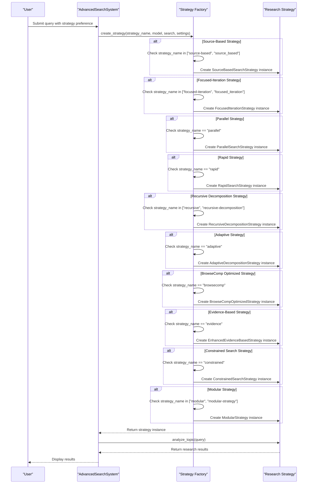

**Diagram sources** 
- [search_system_factory.py](file://src/local_deep_research/search_system_factory.py#L25-L795)

**Section sources**
- [search_system_factory.py](file://src/local_deep_research/search_system_factory.py#L25-L795)

## Source-Based Strategy

The Source-Based Strategy is designed for comprehensive research that requires gathering information from multiple sources before synthesis. This strategy follows a multi-iteration approach where each iteration generates new questions based on previous search results, allowing for progressive exploration of the topic.

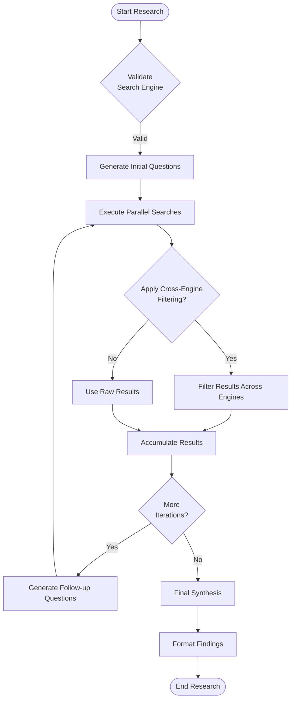

**Diagram sources** 
- [source_based_strategy.py](file://src/local_deep_research/advanced_search_system/strategies/source_based_strategy.py#L22-L461)

**Section sources**
- [source_based_strategy.py](file://src/local_deep_research/advanced_search_system/strategies/source_based_strategy.py#L22-L461)

## Focused-Iteration Strategy

The Focused-Iteration Strategy is optimized for high-performance research, particularly for SimpleQA tasks where it has demonstrated 96.51% accuracy. This strategy combines the simplicity of source-based search with progressive entity-focused exploration, using BrowseComp-optimized progressive exploration when enabled.

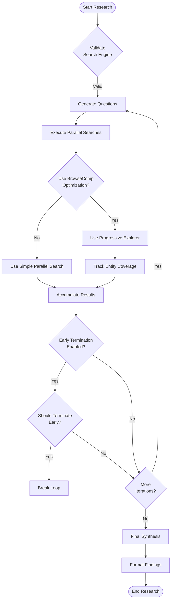

**Diagram sources** 
- [focused_iteration_strategy.py](file://src/local_deep_research/advanced_search_system/strategies/focused_iteration_strategy.py#L40-L586)

**Section sources**
- [focused_iteration_strategy.py](file://src/local_deep_research/advanced_search_system/strategies/focused_iteration_strategy.py#L40-L586)

## Parallel Strategy

The Parallel Strategy is designed for maximum search speed by generating questions and running all searches simultaneously. This approach minimizes the time required for research by eliminating sequential dependencies between search operations.

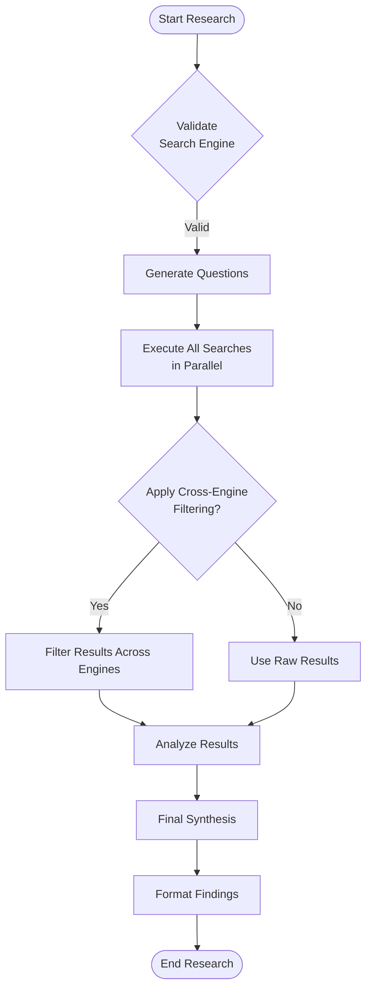

**Diagram sources** 
- [parallel_search_strategy.py](file://src/local_deep_research/advanced_search_system/strategies/parallel_search_strategy.py#L20-L471)

**Section sources**
- [parallel_search_strategy.py](file://src/local_deep_research/advanced_search_system/strategies/parallel_search_strategy.py#L20-L471)

## Rapid Strategy

The Rapid Strategy is designed for quick single-pass research, making it ideal for simple queries that require fast responses. This strategy prioritizes speed over comprehensiveness, executing a minimal number of searches to provide timely answers.

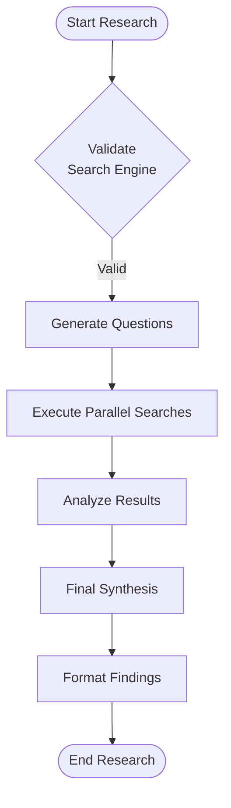

**Diagram sources** 
- [rapid_search_strategy.py](file://src/local_deep_research/advanced_search_system/strategies/rapid_search_strategy.py#L20-L377)

**Section sources**
- [rapid_search_strategy.py](file://src/local_deep_research/advanced_search_system/strategies/rapid_search_strategy.py#L20-L377)

## Recursive Decomposition Strategy

The Recursive Decomposition Strategy is designed for complex queries that require breaking down into smaller, more manageable sub-questions. This approach systematically decomposes the original query into atomic components that can be researched independently.

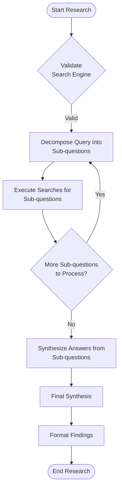

**Diagram sources** 
- [recursive_decomposition_strategy.py](file://src/local_deep_research/advanced_search_system/strategies/recursive_decomposition_strategy.py#L20-L447)

**Section sources**
- [recursive_decomposition_strategy.py](file://src/local_deep_research/advanced_search_system/strategies/recursive_decomposition_strategy.py#L20-L447)

## Adaptive Strategy

The Adaptive Strategy dynamically adjusts its approach based on the research progress and findings. This strategy can switch between different research methodologies to optimize for the specific characteristics of the query and the information discovered during the research process.

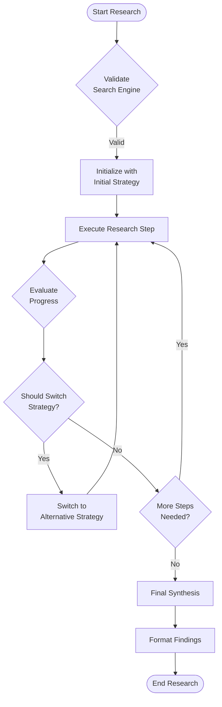

**Diagram sources** 
- [adaptive_decomposition_strategy.py](file://src/local_deep_research/advanced_search_system/strategies/adaptive_decomposition_strategy.py#L20-L491)

**Section sources**
- [adaptive_decomposition_strategy.py](file://src/local_deep_research/advanced_search_system/strategies/adaptive_decomposition_strategy.py#L20-L491)

## BrowseComp Optimized Strategy

The BrowseComp Optimized Strategy is specifically designed to handle complex puzzle queries that require matching specific clues to find a location, person, or event. This strategy extracts clues from the query and systematically searches for combinations of these clues to progressively narrow down candidates.

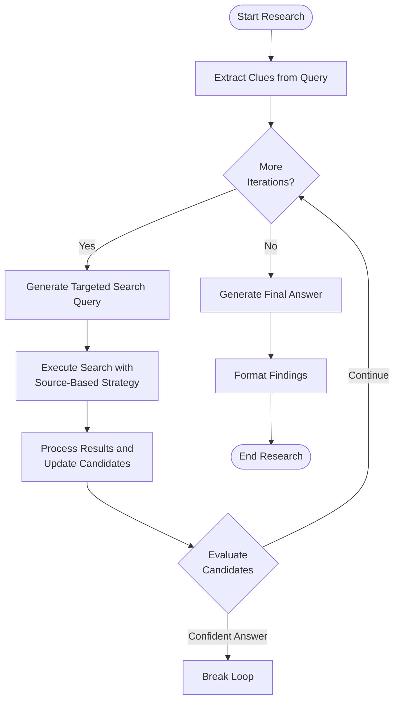

**Diagram sources** 
- [browsecomp_optimized_strategy.py](file://src/local_deep_research/advanced_search_system/strategies/browsecomp_optimized_strategy.py#L35-L780)

**Section sources**
- [browsecomp_optimized_strategy.py](file://src/local_deep_research/advanced_search_system/strategies/browsecomp_optimized_strategy.py#L35-L780)

## Evidence-Based Strategy

The Enhanced Evidence-Based Strategy improves upon traditional evidence-based approaches by implementing multi-stage candidate discovery, adaptive query generation, cross-constraint capabilities, and source diversity tracking. This strategy is particularly effective for complex queries that require comprehensive evidence gathering.

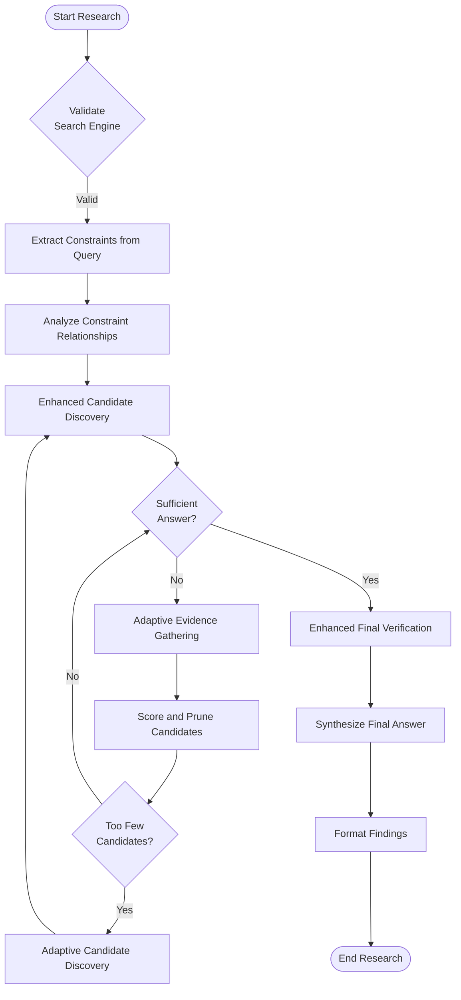

**Diagram sources** 
- [evidence_based_strategy_v2.py](file://src/local_deep_research/advanced_search_system/strategies/evidence_based_strategy_v2.py#L46-L1338)

**Section sources**
- [evidence_based_strategy_v2.py](file://src/local_deep_research/advanced_search_system/strategies/evidence_based_strategy_v2.py#L46-L1338)

## Constrained Search Strategy

The Constrained Search Strategy progressively narrows down candidates by applying constraints in order of restrictiveness. This approach mimics human problem-solving by starting with the most restrictive constraints and gradually incorporating additional constraints to refine the candidate pool.

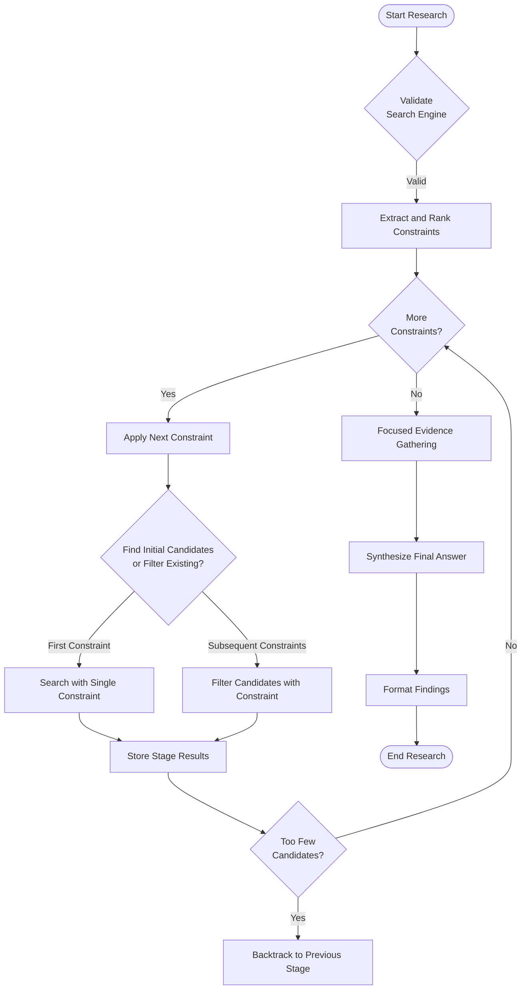

**Diagram sources** 
- [constrained_search_strategy.py](file://src/local_deep_research/advanced_search_system/strategies/constrained_search_strategy.py#L24-L1347)

**Section sources**
- [constrained_search_strategy.py](file://src/local_deep_research/advanced_search_system/strategies/constrained_search_strategy.py#L24-L1347)

## Modular Strategy

The Modular Strategy demonstrates the use of specialized modules for constraint checking and candidate exploration. This strategy incorporates LLM-driven constraint processing, early rejection, immediate evaluation, and a decoupled approach to search execution and candidate evaluation.

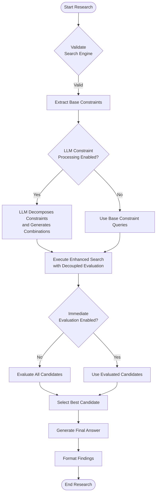

**Diagram sources** 
- [modular_strategy.py](file://src/local_deep_research/advanced_search_system/strategies/modular_strategy.py#L275-L1145)

**Section sources**
- [modular_strategy.py](file://src/local_deep_research/advanced_search_system/strategies/modular_strategy.py#L275-L1145)

## Performance Considerations

Each research strategy has distinct performance characteristics and memory usage patterns that make them suitable for different types of queries and research scenarios. The choice of strategy should consider the trade-offs between comprehensiveness, speed, and resource utilization.

| Strategy | Time Complexity | Memory Usage | Best Use Cases | When to Use |
|---------|----------------|-------------|---------------|------------|
| **Source-Based** | O(n × m) | High | Comprehensive research requiring synthesis from multiple sources | When you need thorough coverage and final synthesis from accumulated knowledge |
| **Focused-Iteration** | O(n × m) | Medium | SimpleQA tasks and BrowseComp-style puzzles | When high accuracy is required for straightforward questions |
| **Parallel** | O(m) | Medium | Maximum search speed with multiple questions | When speed is critical and you need to minimize research time |
| **Rapid** | O(m) | Low | Quick single-pass research for simple queries | When you need fast responses for straightforward information |
| **Recursive Decomposition** | O(n^d) | Medium | Complex queries requiring decomposition into sub-questions | When dealing with multi-faceted questions that can be broken down |
| **Adaptive** | O(n × m × s) | Medium | Dynamic research that may require strategy switching | When the optimal approach is unclear at the start of research |
| **BrowseComp Optimized** | O(i × s) | Medium | Complex puzzle queries with specific clues | When solving BrowseComp-style challenges requiring clue matching |
| **Evidence-Based** | O(n × m × c) | High | Complex queries requiring comprehensive evidence gathering | When you need to verify answers against multiple constraints |
| **Constrained Search** | O(c × k) | Medium | Progressive narrowing of candidates using constraints | When you have multiple constraints to apply in a specific order |
| **Modular** | O(q × e) | High | Flexible research using specialized modules | When you need maximum flexibility and modular component usage |

**Section sources**
- [source_based_strategy.py](file://src/local_deep_research/advanced_search_system/strategies/source_based_strategy.py#L22-L461)
- [focused_iteration_strategy.py](file://src/local_deep_research/advanced_search_system/strategies/focused_iteration_strategy.py#L40-L586)
- [parallel_search_strategy.py](file://src/local_deep_research/advanced_search_system/strategies/parallel_search_strategy.py#L20-L471)
- [rapid_search_strategy.py](file://src/local_deep_research/advanced_search_system/strategies/rapid_search_strategy.py#L20-L377)
- [recursive_decomposition_strategy.py](file://src/local_deep_research/advanced_search_system/strategies/recursive_decomposition_strategy.py#L20-L447)
- [adaptive_decomposition_strategy.py](file://src/local_deep_research/advanced_search_system/strategies/adaptive_decomposition_strategy.py#L20-L491)
- [browsecomp_optimized_strategy.py](file://src/local_deep_research/advanced_search_system/strategies/browsecomp_optimized_strategy.py#L35-L780)
- [evidence_based_strategy_v2.py](file://src/local_deep_research/advanced_search_system/strategies/evidence_based_strategy_v2.py#L46-L1338)
- [constrained_search_strategy.py](file://src/local_deep_research/advanced_search_system/strategies/constrained_search_strategy.py#L24-L1347)
- [modular_strategy.py](file://src/local_deep_research/advanced_search_system/strategies/modular_strategy.py#L275-L1145)

## Conclusion
The research system's strategy implementation provides a comprehensive framework for addressing diverse information retrieval needs. By leveraging the Strategy and Factory design patterns, the system offers flexibility in research methodology while maintaining a consistent interface. Each strategy is optimized for specific research scenarios, from rapid information retrieval to complex puzzle-solving tasks. The factory-based selection mechanism ensures that the appropriate strategy is chosen based on query characteristics and user preferences. Performance considerations should guide the selection of strategies, balancing comprehensiveness, speed, and resource utilization. The modular architecture allows for easy extension and refinement of existing strategies or the addition of new approaches as research requirements evolve.