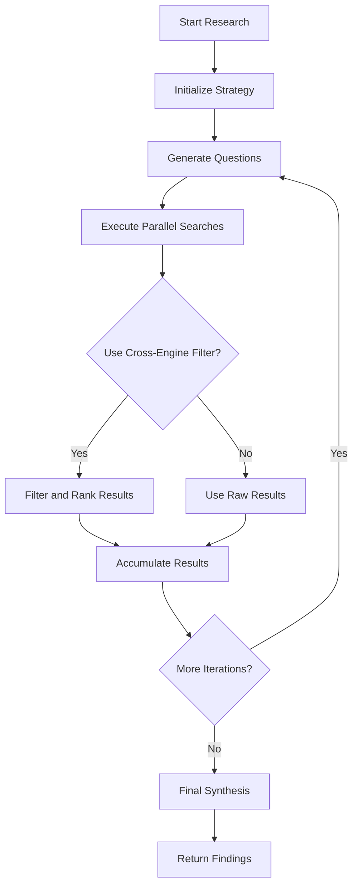
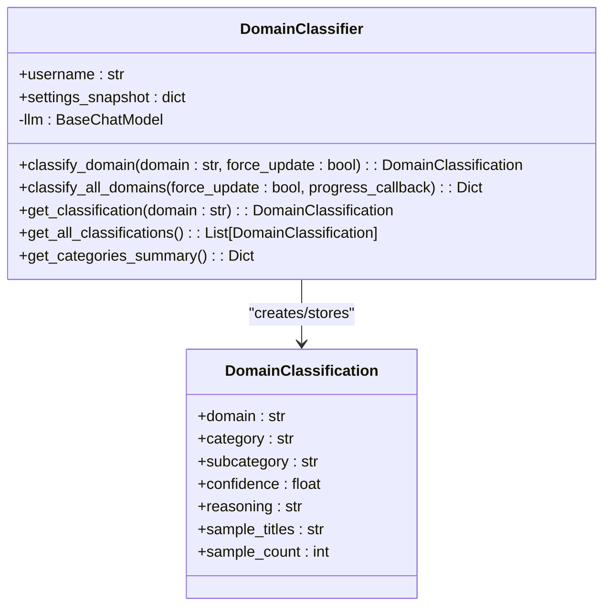
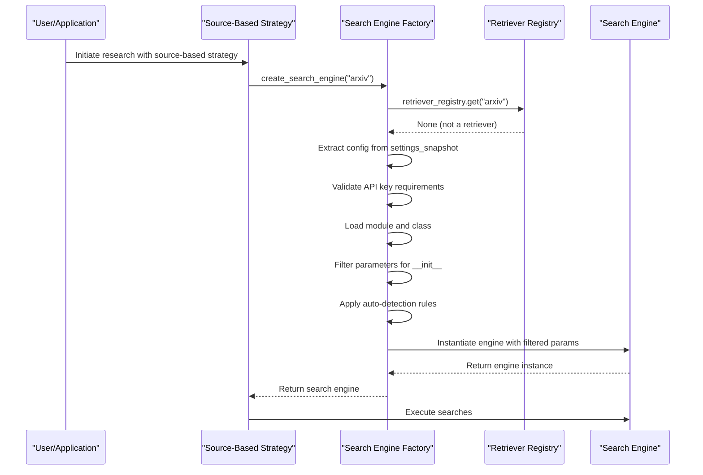
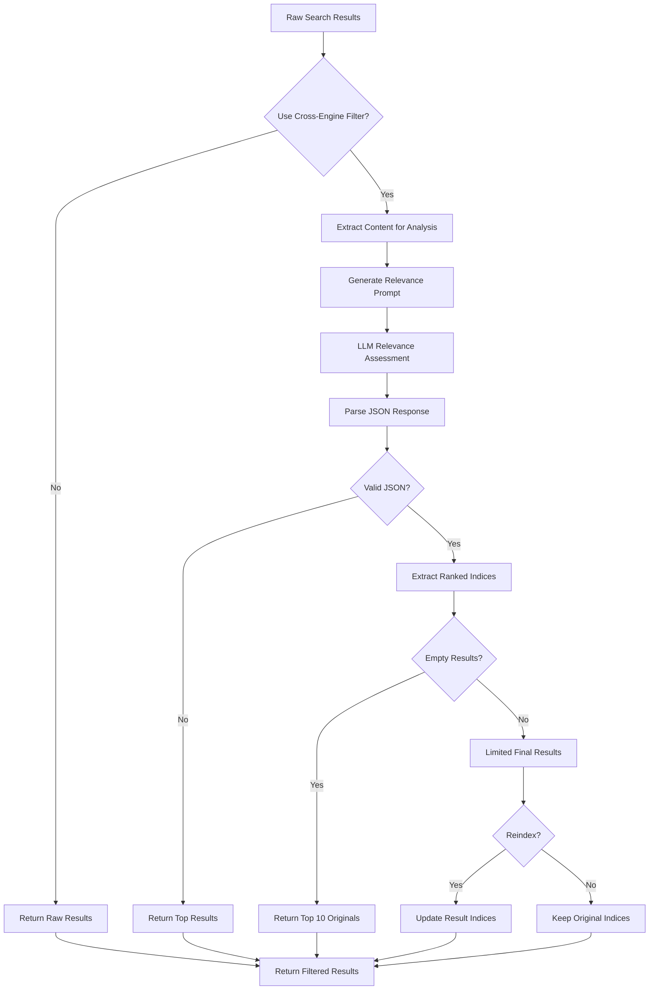
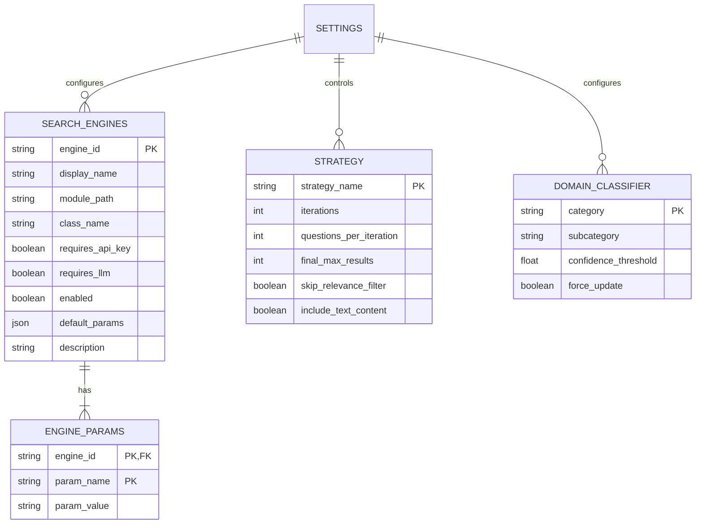

# Source-Based Strategy

<cite>
**Referenced Files in This Document**   
- [source_based_strategy.py](file://src/local_deep_research/advanced_search_system/strategies/source_based_strategy.py)
- [search_engine_factory.py](file://src/local_deep_research/web_search_engines/search_engine_factory.py)
- [search_engines_config.py](file://src/local_deep_research/web_search_engines/search_engines_config.py)
- [classifier.py](file://src/local_deep_research/domain_classifier/classifier.py)
- [retriever_registry.py](file://src/local_deep_research/web_search_engines/retriever_registry.py)
- [cross_engine_filter.py](file://src/local_deep_research/advanced_search_system/filters/cross_engine_filter.py)
</cite>

## Table of Contents
1. [Introduction](#introduction)
2. [Core Implementation](#core-implementation)
3. [Domain Classifier Integration](#domain-classifier-integration)
4. [Search Engine Factory and Retriever Registry](#search-engine-factory-and-retriever-registry)
5. [Source Filtering in Candidate Exploration](#source-filtering-in-candidate-exploration)
6. [Configuration and Settings](#configuration-and-settings)
7. [Performance Implications](#performance-implications)
8. [Use Cases and Applications](#use-cases-and-applications)
9. [Conclusion](#conclusion)

## Introduction

The Source-Based Strategy is a research methodology that prioritizes information gathering from specific, trusted domains or sources. This approach is particularly valuable in scenarios where source authority and reliability are critical, such as academic research, medical inquiries, or fact-checking applications. The strategy systematically identifies, routes, and filters queries to appropriate sources based on domain classification and configured priorities.

This document details the implementation of the Source-Based Strategy within the Local Deep Research system, focusing on its integration with the domain_classifier module, search engine factory, and retriever registry. The strategy enables researchers to limit their scope to authoritative sources, ensuring higher quality and more reliable results.

**Section sources**
- [source_based_strategy.py](file://src/local_deep_research/advanced_search_system/strategies/source_based_strategy.py#L1-L461)

## Core Implementation

The Source-Based Search Strategy is implemented as a class that inherits from the BaseSearchStrategy, providing a structured approach to research that emphasizes source quality and relevance. The strategy operates through multiple iterations of question generation, parallel searching, and result filtering.

The implementation follows a systematic process:
1. **Question Generation**: Using either a standard or atomic fact question generator, the strategy creates targeted queries based on the research topic.
2. **Parallel Search Execution**: Multiple questions are searched simultaneously across configured search engines.
3. **Cross-Engine Filtering**: Results are filtered and ranked using LLM-powered relevance assessment.
4. **Final Synthesis**: All filtered results are synthesized into a comprehensive response with proper citations.

Key parameters that control the strategy's behavior include:
- `include_text_content`: Determines whether full content should be retrieved
- `use_cross_engine_filter`: Enables or disables LLM-based relevance filtering
- `filter_reorder`: Controls whether results should be reordered by relevance
- `cross_engine_max_results`: Limits the number of results after filtering
- `use_atomic_facts`: Determines whether to use atomic fact-based question generation

The strategy is designed to be flexible, allowing configuration through settings snapshots that can be passed during initialization. This enables programmatic control over the research process while maintaining consistency across different execution contexts.



**Diagram sources **
- [source_based_strategy.py](file://src/local_deep_research/advanced_search_system/strategies/source_based_strategy.py#L1-L461)

**Section sources**
- [source_based_strategy.py](file://src/local_deep_research/advanced_search_system/strategies/source_based_strategy.py#L1-L461)

## Domain Classifier Integration

The Source-Based Strategy integrates with the domain_classifier module to identify and route queries to appropriate sources based on domain categorization. The DomainClassifier uses LLM-powered analysis to classify websites into predefined categories such as Academic & Research, News & Media, Reference & Documentation, and others.

The classification process works as follows:
1. **Sample Collection**: The classifier retrieves sample resources from a domain to analyze actual content rather than relying solely on domain names.
2. **Prompt Construction**: A structured prompt is built containing the domain, sample content, and available categories.
3. **LLM Classification**: The LLM analyzes the prompt and returns a JSON response with category, subcategory, confidence score, and reasoning.
4. **Database Storage**: Classification results are stored in the database for future reference and to avoid redundant analysis.

The domain classifier supports multiple classification levels, including:
- **Main Categories**: Broad classifications like "Academic & Research" or "News & Media"
- **Subcategories**: More specific classifications like "Scientific Journal" or "Tech News"
- **Confidence Scoring**: A numerical confidence score between 0 and 1 indicating classification certainty

This integration allows the Source-Based Strategy to make informed decisions about which sources to prioritize based on their domain classification. For example, when researching a medical topic, the strategy can prioritize sources classified as "Healthcare" or "Scientific Journal" while deprioritizing sources from "Social & Community" or "Entertainment & Lifestyle" categories.



**Diagram sources **
- [classifier.py](file://src/local_deep_research/domain_classifier/classifier.py#L1-L489)

**Section sources**
- [classifier.py](file://src/local_deep_research/domain_classifier/classifier.py#L1-L489)

## Search Engine Factory and Retriever Registry

The Source-Based Strategy interacts with the search engine factory and retriever registry to dynamically create and manage search engines based on configuration. This architecture enables flexible integration with various search providers and custom retrieval systems.

### Search Engine Factory

The search engine factory (`create_search_engine`) is responsible for instantiating search engine objects based on configuration. It follows a decision hierarchy:

1. **Special Variants**: Handles special cases like "parallel_scientific" and "parallel" search engines
2. **Retriever Registry**: Checks if the requested engine is a registered LangChain retriever
3. **Configuration Lookup**: Retrieves engine configuration from settings snapshot
4. **Dynamic Instantiation**: Loads the appropriate module and class, then creates an instance with filtered parameters

The factory applies intelligent defaults and auto-detection:
- Scientific engines (arXiv, Semantic Scholar) automatically enable LLM relevance filtering
- Generic engines (Google, Brave, SearXNG) disable LLM filtering as they already use semantic search
- API key requirements are validated before engine creation
- LLM requirements are checked and enforced

### Retriever Registry

The retriever registry provides a thread-safe mechanism for registering and accessing LangChain retrievers as search engines. Key features include:

- **Thread Safety**: Uses locks to ensure safe concurrent access
- **Dynamic Registration**: Allows programmatic registration of retrievers at runtime
- **Multiple Registration**: Supports registering multiple retrievers at once
- **Lifecycle Management**: Provides methods to register, retrieve, unregister, and clear retrievers

The registry integrates with the search engine configuration system, automatically adding registered retrievers as available search engines. This enables users to extend the system's capabilities by adding custom retrieval logic without modifying core code.



**Diagram sources **
- [search_engine_factory.py](file://src/local_deep_research/web_search_engines/search_engine_factory.py#L1-L619)
- [retriever_registry.py](file://src/local_deep_research/web_search_engines/retriever_registry.py#L1-L110)

**Section sources**
- [search_engine_factory.py](file://src/local_deep_research/web_search_engines/search_engine_factory.py#L1-L619)
- [retriever_registry.py](file://src/local_deep_research/web_search_engines/retriever_registry.py#L1-L110)

## Source Filtering in Candidate Exploration

The Source-Based Strategy applies source filtering during candidate exploration through the CrossEngineFilter component. This filter evaluates and ranks search results from multiple engines, ensuring that the most relevant and reliable sources are prioritized.

### Cross-Engine Filtering Process

The filtering process involves several key steps:

1. **Result Aggregation**: Collects results from all search engines used in the current iteration
2. **Relevance Scoring**: Uses the LLM to assess the relevance of each result to the research query
3. **Ranking**: Orders results based on relevance scores
4. **Selection**: Keeps only the top results up to the configured maximum
5. **Indexing**: Reassigns indices to maintain proper ordering

The filter can operate in different modes:
- **Reordering**: Results are reordered by relevance score
- **Reindexing**: Result indices are updated to reflect new ordering
- **Strict Filtering**: Only results passing relevance thresholds are kept

### Diversity Considerations

While the primary focus is on source authority, the strategy also considers diversity through:
- **Source Type Diversity**: Ensuring coverage across different source categories
- **Domain Diversity**: Avoiding over-concentration on a single domain
- **Content Type Diversity**: Balancing between different content formats

The filtering process is applied at multiple stages:
- **Per-Iteration Filtering**: Applied after each iteration's searches
- **Final Filtering**: Applied to all accumulated results before synthesis
- **Configurable Intensity**: Can be enabled/disabled based on strategy parameters

This multi-stage filtering ensures that only the most relevant and authoritative sources contribute to the final research output, while maintaining a balance between depth and breadth of coverage.



**Diagram sources **
- [cross_engine_filter.py](file://src/local_deep_research/advanced_search_system/filters/cross_engine_filter.py#L1-L226)

**Section sources**
- [cross_engine_filter.py](file://src/local_deep_research/advanced_search_system/filters/cross_engine_filter.py#L1-L226)

## Configuration and Settings

The Source-Based Strategy is highly configurable through settings that control its behavior, source selection, and performance characteristics. Configuration is managed through settings snapshots that can be passed to the strategy during initialization.

### Key Configuration Options

#### Strategy Parameters
- `search.iterations`: Number of research iterations to perform
- `search.questions_per_iteration`: Number of questions to generate per iteration
- `search.final_max_results`: Maximum results after final filtering
- `search.skip_relevance_filter`: Global override for LLM relevance filtering

#### Source Selection
- `search.engine.web.[engine].enabled`: Enables/disables specific search engines
- `search.engine.web.[engine].api_key`: API key for engines requiring authentication
- `search.engine.web.[engine].default_params.enable_llm_relevance_filter`: Per-engine control of LLM filtering
- `search.max_results`: Maximum results from individual search engines

#### Domain Classification
- `domain_classifier.categories`: Custom domain categories and subcategories
- `domain_classifier.force_update`: Whether to reclassify already-classified domains

### Configuration Methods

Configuration can be applied through multiple methods:

1. **Settings Snapshot**: Passed directly to the strategy or search system
2. **Environment Variables**: System-wide configuration
3. **Database Settings**: Persistent user preferences
4. **Programmatic Configuration**: Direct parameter passing in code

The system prioritizes configuration sources in the following order:
1. Settings snapshot (highest priority)
2. Per-engine configuration settings
3. Auto-detection based on engine type
4. Global default settings

This hierarchical approach allows for fine-grained control over the research process while maintaining sensible defaults for common use cases.



**Section sources**
- [search_engines_config.py](file://src/local_deep_research/web_search_engines/search_engines_config.py#L1-L367)
- [source_based_strategy.py](file://src/local_deep_research/advanced_search_system/strategies/source_based_strategy.py#L1-L461)

## Performance Implications

The Source-Based Strategy has several performance implications that vary based on configuration and usage patterns. Understanding these implications is crucial for optimizing research efficiency and resource utilization.

### Resource Consumption

#### LLM Usage
- **High**: When LLM relevance filtering is enabled
- **Medium**: When only question generation uses LLM
- **Low**: When using pre-defined questions without filtering

The strategy's LLM usage scales with:
- Number of iterations
- Questions per iteration
- Use of cross-engine filtering
- Depth of content analysis

#### Network Requests
- **High**: When searching multiple engines in parallel
- **Medium**: When using a single comprehensive engine
- **Low**: When using local retrievers or cached results

Network usage is influenced by:
- Number of search engines configured
- Maximum results per engine
- Full content retrieval settings

### Time Complexity

The strategy's time complexity is primarily determined by:
- **O(n×m)**: Where n is the number of iterations and m is the number of questions per iteration
- **O(k)**: Where k is the number of search engines used
- **O(r)**: Where r is the number of results processed by the cross-engine filter

### Optimization Strategies

Several approaches can optimize performance:

1. **Caching**: The domain classifier caches results to avoid redundant LLM calls
2. **Parallel Execution**: Searches are executed in parallel across threads
3. **Early Filtering**: Results are filtered at multiple stages to reduce processing load
4. **Configurable Depth**: Users can control the depth of analysis through settings

### Trade-offs

The strategy involves several key trade-offs:

| Aspect | High Quality Mode | High Performance Mode |
|--------|------------------|---------------------|
| Accuracy | High (multiple sources, filtering) | Medium (fewer sources, less filtering) |
| Speed | Slower (more LLM calls, filtering) | Faster (minimal processing) |
| Resource Usage | High (LLM, network) | Low (efficient) |
| Source Diversity | High (broad exploration) | Lower (focused sources) |

For academic and medical research where accuracy is paramount, the high quality mode is recommended. For exploratory research or rapid prototyping, the high performance mode may be more appropriate.

**Section sources**
- [source_based_strategy.py](file://src/local_deep_research/advanced_search_system/strategies/source_based_strategy.py#L1-L461)
- [search_engine_factory.py](file://src/local_deep_research/web_search_engines/search_engine_factory.py#L1-L619)

## Use Cases and Applications

The Source-Based Strategy is particularly effective in scenarios where source authority and reliability are critical. The following sections outline key use cases and provide guidance on configuring the strategy for optimal results.

### Academic Research

For academic research, the strategy should be configured to prioritize scholarly sources:

```python
settings = {
    "search.tool": "parallel_scientific",  # Focus on academic engines
    "search.iterations": 3,
    "search.questions_per_iteration": 4,
    "search.strategy": "source-based",
    "search.engine.web.arxiv.enabled": True,
    "search.engine.web.semantic_scholar.enabled": True,
    "search.engine.web.google_scholar.enabled": True,
    "search.engine.web.wikipedia.enabled": False,  # Exclude general sources
    "search.final_max_results": 20,
    "search.skip_relevance_filter": False,
}
```

Key benefits for academic research:
- Access to peer-reviewed publications
- Proper citation of scholarly sources
- Focus on high-impact journals
- Elimination of predatory journals through reputation filtering

### Medical Research

Medical research requires the highest standards of source reliability:

```python
settings = {
    "search.tool": "parallel_scientific",
    "search.strategy": "source-based",
    "search.iterations": 4,
    "search.questions_per_iteration": 5,
    "search.engine.web.pubmed.enabled": True,
    "search.engine.web.nih.enabled": True,
    "search.engine.web.cochrane.enabled": True,
    "search.engine.web.wikipedia.enabled": False,
    "search.engine.web.news.enabled": False,
    "search.final_max_results": 15,
    "search.skip_relevance_filter": False,
    "journal_filter.enabled": True,
    "journal_filter.reliability_threshold": 7,
}
```

Critical considerations for medical research:
- Prioritize government health agencies (NIH, CDC, WHO)
- Focus on peer-reviewed medical journals
- Apply journal reputation filtering
- Verify information across multiple authoritative sources

### Fact-Checking and Verification

For fact-checking applications, the strategy should balance breadth and depth:

```python
settings = {
    "search.tool": "parallel",
    "search.strategy": "source-based",
    "search.iterations": 2,
    "search.questions_per_iteration": 6,
    "search.engine.web.reuters.enabled": True,
    "search.engine.web.apnews.enabled": True,
    "search.engine.web.bbc.enabled": True,
    "search.engine.web.wikipedia.enabled": True,
    "search.engine.web.archive.enabled": True,
    "search.final_max_results": 25,
    "search.skip_relevance_filter": False,
    "cross_engine_filter.strictness": "high",
}
```

Effective fact-checking practices:
- Cross-verify claims across multiple reputable news sources
- Check original sources and primary documents
- Use archive services to verify historical claims
- Prioritize sources with strong editorial standards

### General Guidance for Source Prioritization

When configuring source priorities, consider the following principles:

1. **Authority Hierarchy**: Prioritize sources by their domain authority and expertise
2. **Purpose Alignment**: Match source types to research objectives
3. **Temporal Relevance**: Consider the timeliness requirements of the research
4. **Geographic Focus**: Select sources appropriate to the geographic scope

The strategy's flexibility allows researchers to adapt their approach to the specific requirements of each research task, ensuring optimal results across diverse domains and applications.

**Section sources**
- [source_based_strategy.py](file://src/local_deep_research/advanced_search_system/strategies/source_based_strategy.py#L1-L461)
- [classifier.py](file://src/local_deep_research/domain_classifier/classifier.py#L1-L489)

## Conclusion

The Source-Based Strategy provides a robust framework for conducting research that prioritizes information from trusted, authoritative sources. By integrating with the domain_classifier module, search engine factory, and retriever registry, the strategy enables sophisticated source selection, routing, and filtering capabilities.

Key strengths of the implementation include:
- **Flexible Configuration**: Extensive settings allow fine-tuning for different research needs
- **Intelligent Source Selection**: Domain classification ensures appropriate source routing
- **Efficient Processing**: Parallel execution and caching optimize performance
- **Comprehensive Filtering**: Cross-engine filtering enhances result quality
- **Extensible Architecture**: Retriever registry supports custom retrieval systems

The strategy is particularly valuable in domains where source authority is critical, such as academic research, medical inquiries, and fact-checking. By systematically identifying and prioritizing high-quality sources, the strategy helps ensure the reliability and credibility of research outcomes.

For optimal results, users should carefully configure the strategy based on their specific research objectives, balancing the need for comprehensive coverage with performance considerations. The modular design allows for adaptation to evolving research requirements and emerging information sources.