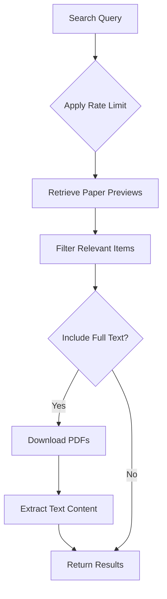
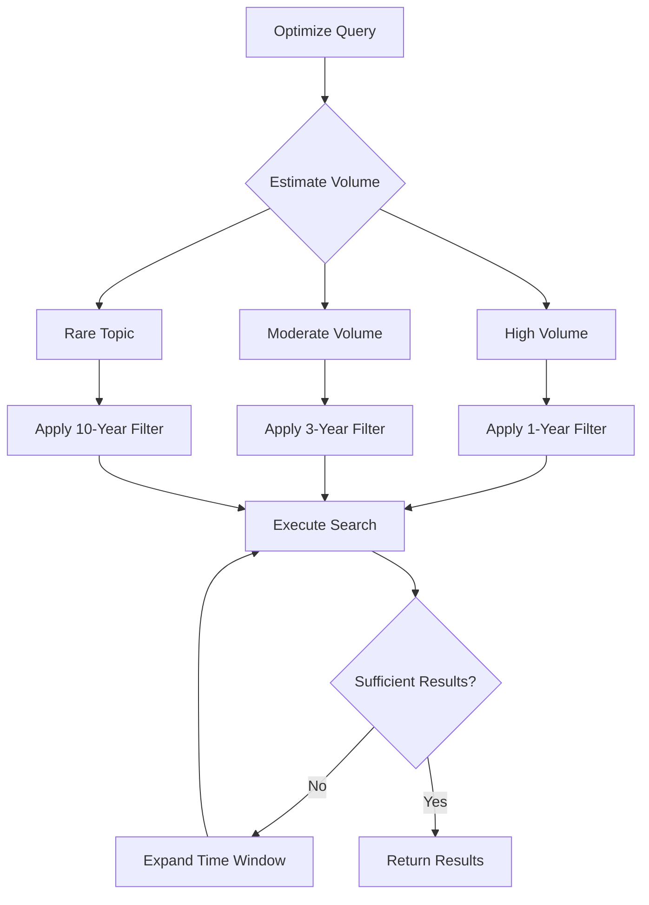
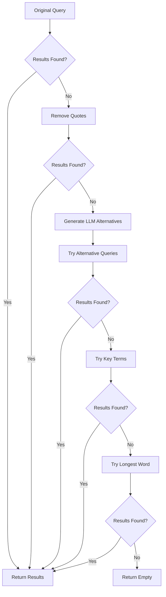
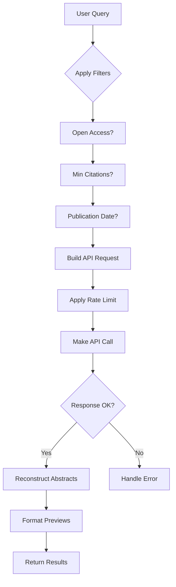
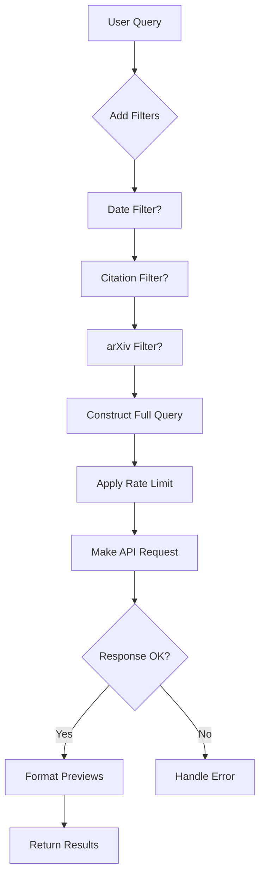
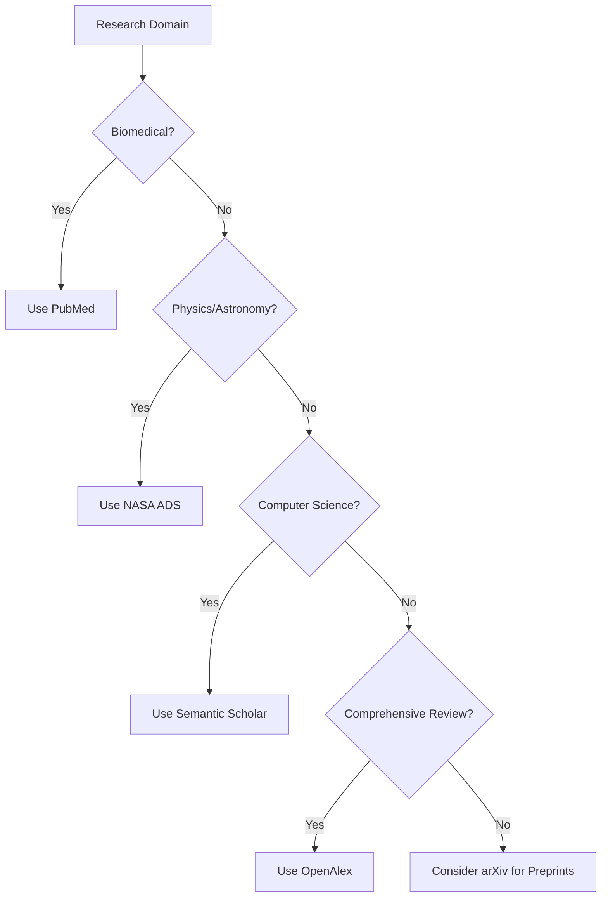
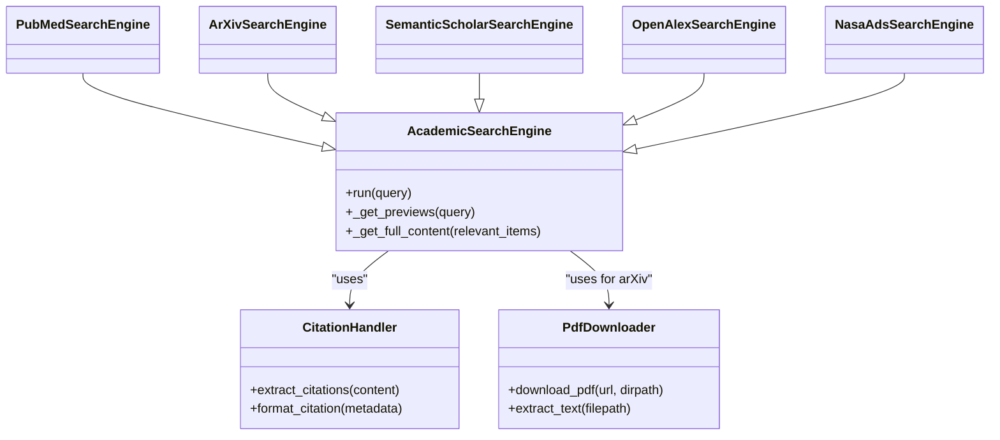

# Academic Sources

<cite>
**Referenced Files in This Document**   
- [search_engine_arxiv.py](file://src/local_deep_research/web_search_engines/engines/search_engine_arxiv.py)
- [search_engine_pubmed.py](file://src/local_deep_research/web_search_engines/engines/search_engine_pubmed.py)
- [search_engine_semantic_scholar.py](file://src/local_deep_research/web_search_engines/engines/search_engine_semantic_scholar.py)
- [search_engine_openalex.py](file://src/local_deep_research/web_search_engines/engines/search_engine_openalex.py)
- [search_engine_nasa_ads.py](file://src/local_deep_research/web_search_engines/engines/search_engine_nasa_ads.py)
- [settings_search_config.json](file://src/local_deep_research/defaults/settings_search_config.json)
</cite>

## Table of Contents
1. [Introduction](#introduction)
2. [arXiv Integration](#arxiv-integration)
3. [PubMed Integration](#pubmed-integration)
4. [Semantic Scholar Integration](#semantic-scholar-integration)
5. [OpenAlex Integration](#openalex-integration)
6. [NASA ADS Integration](#nasa-ads-integration)
7. [Configuration Parameters](#configuration-parameters)
8. [Source Selection Guidance](#source-selection-guidance)
9. [Integration Patterns](#integration-patterns)
10. [Common Issues and Limitations](#common-issues-and-limitations)

## Introduction
This document provides comprehensive documentation for academic search sources including arXiv, PubMed, Semantic Scholar, OpenAlex, and NASA ADS. It details the domain-specific APIs used by each engine, their coverage, metadata availability, authentication mechanisms, rate limiting policies, and result parsing logic for scholarly publications. The document also covers configuration parameters, source selection guidance based on research domain, integration patterns with citation handlers and PDF downloaders, and common issues such as API key requirements and access limitations.

**Section sources**
- [search_engine_arxiv.py](file://src/local_deep_research/web_search_engines/engines/search_engine_arxiv.py#L1-L520)
- [search_engine_pubmed.py](file://src/local_deep_research/web_search_engines/engines/search_engine_pubmed.py#L1-L800)
- [search_engine_semantic_scholar.py](file://src/local_deep_research/web_search_engines/engines/search_engine_semantic_scholar.py#L1-L648)
- [search_engine_openalex.py](file://src/local_deep_research/web_search_engines/engines/search_engine_openalex.py#L1-L427)
- [search_engine_nasa_ads.py](file://src/local_deep_research/web_search_engines/engines/search_engine_nasa_ads.py#L1-L364)

## arXiv Integration
The arXiv search engine implementation provides access to preprints in physics, mathematics, computer science, quantitative biology, quantitative finance, statistics, electrical engineering, systems science, and economics. The integration uses the `arxiv` Python package to interact with the arXiv API.

### API Coverage and Metadata
arXiv offers comprehensive metadata for academic papers including title, authors, abstract, publication date, updated date, categories, journal reference, DOI, and PDF URL. The integration supports downloading PDFs and extracting text content when configured.

### Authentication and Rate Limiting
arXiv does not require API keys for access, making it publicly available. The system implements rate limiting to comply with arXiv's usage policies, with automatic handling of rate limit errors (429 status codes).

### Configuration Parameters
Key configuration parameters include:
- `max_results`: Maximum number of search results (minimum 25)
- `sort_by`: Sorting criteria (relevance, lastUpdatedDate, submittedDate)
- `sort_order`: Sort order (ascending, descending)
- `include_full_text`: Whether to include full paper content by downloading PDFs
- `download_dir`: Directory to download PDFs to
- `max_full_text`: Maximum number of PDFs to download and process

### Result Parsing and Processing
The integration uses a two-phase approach: first retrieving paper previews with basic information, then fetching full content for relevant items. For full content retrieval, it downloads PDFs and attempts text extraction using PyPDF2 or pdfplumber libraries, falling back to the paper summary if extraction fails.

**Diagram sources**
- [search_engine_arxiv.py](file://src/local_deep_research/web_search_engines/engines/search_engine_arxiv.py#L88-L188)
- [search_engine_arxiv.py](file://src/local_deep_research/web_search_engines/engines/search_engine_arxiv.py#L190-L349)

**Section sources**
- [search_engine_arxiv.py](file://src/local_deep_research/web_search_engines/engines/search_engine_arxiv.py#L15-L520)

## PubMed Integration
The PubMed search engine provides access to the biomedical literature database maintained by the National Center for Biotechnology Information (NCBI). It uses the Entrez Programming Utilities (E-utilities) API to retrieve data.

### API Coverage and Metadata
PubMed offers extensive metadata for biomedical literature including title, authors, abstract, publication date, journal information, MeSH terms, keywords, DOI, PMID, and PMC availability. The integration can retrieve article summaries, abstracts, and full text when available in PubMed Central (PMC).

### Authentication and Rate Limiting
While PubMed can be accessed without an API key, using an NCBI API key provides higher rate limits (up to 10 requests per second compared to 3 without a key). The system implements rate limiting with automatic retry mechanisms for rate limit errors.

### Configuration Parameters
Key configuration parameters include:
- `max_results`: Maximum number of search results (minimum 25)
- `api_key`: NCBI API key for higher rate limits
- `days_limit`: Limit results to N days
- `get_abstracts`: Whether to fetch abstracts for all results
- `get_full_text`: Whether to fetch full text content from PMC
- `full_text_limit`: Maximum number of full-text articles to retrieve
- `optimize_queries`: Whether to optimize natural language queries using an LLM

### Adaptive Search Strategy
The integration implements an adaptive search strategy that adjusts based on topic volume and whether the query focuses on historical information. It first estimates the result count, then applies appropriate time filters:
- High volume topics (>5000 results): "last 1 year"
- Common topics (1000-5000 results): "last 3 years"
- Moderate volume (100-1000 results): "last 5 years"
- Rare topics (<100 results): "last 10 years"

If insufficient results are found, the system automatically expands the time window or removes date restrictions.

**Diagram sources**
- [search_engine_pubmed.py](file://src/local_deep_research/web_search_engines/engines/search_engine_pubmed.py#L503-L579)
- [search_engine_pubmed.py](file://src/local_deep_research/web_search_engines/engines/search_engine_pubmed.py#L581-L646)

**Section sources**
- [search_engine_pubmed.py](file://src/local_deep_research/web_search_engines/engines/search_engine_pubmed.py#L14-L800)

## Semantic Scholar Integration
The Semantic Scholar search engine provides access to scientific literature across all fields with advanced features like citation analysis, references, and AI-generated summaries.

### API Coverage and Metadata
Semantic Scholar offers rich metadata including paper ID, external IDs (DOI, PMID, etc.), title, abstract, venue, year, authors, citation count, open access PDF URL, fields of study, and publication types. It also provides AI-generated TLDR (Too Long; Didn't Read) summaries and SPECTER embeddings.

### Authentication and Rate Limiting
The integration supports optional API keys for higher rate limits. Without an API key, the rate limit is approximately 1 request per second. With an API key, the limit increases to 5 requests per second. The system implements exponential backoff retries for rate limit errors.

### Configuration Parameters
Key configuration parameters include:
- `max_results`: Maximum number of search results
- `api_key`: Semantic Scholar API key
- `year_range`: Optional tuple of (start_year, end_year) to filter results
- `get_abstracts`: Whether to fetch abstracts
- `get_references`: Whether to fetch references for papers
- `get_citations`: Whether to fetch citations for papers
- `get_embeddings`: Whether to fetch SPECTER embeddings
- `get_tldr`: Whether to fetch TLDR summaries
- `citation_limit`: Maximum number of citations to fetch per paper
- `reference_limit`: Maximum number of references to fetch per paper
- `fields_of_study`: List of fields of study to filter results
- `publication_types`: List of publication types to filter results

### Query Optimization and Adaptive Search
The integration includes query optimization using an LLM to transform natural language questions into effective search queries. When no results are found, it implements an adaptive fallback strategy:
1. Try removing quotes to broaden the search
2. Use LLM to generate alternative search queries focusing on core concepts
3. Try with key terms (longer words likely to be specific)
4. Try with the single longest word as a last resort

**Diagram sources**
- [search_engine_semantic_scholar.py](file://src/local_deep_research/web_search_engines/engines/search_engine_semantic_scholar.py#L323-L438)
- [search_engine_semantic_scholar.py](file://src/local_deep_research/web_search_engines/engines/search_engine_semantic_scholar.py#L200-L254)

**Section sources**
- [search_engine_semantic_scholar.py](file://src/local_deep_research/web_search_engines/engines/search_engine_semantic_scholar.py#L15-L648)

## OpenAlex Integration
The OpenAlex search engine provides access to a comprehensive index of scholarly works across all domains of research.

### API Coverage and Metadata
OpenAlex offers extensive metadata including work ID, display name, publication year, publication date, DOI, primary location, authorships, citation count, open access status, best open access location, and abstract (in inverted index format). It covers over 200 million works and connects them to authors, institutions, and concepts.

### Authentication and Rate Limiting
OpenAlex uses a "polite pool" system where providing an email address grants access to faster response times. Without an email, requests are processed with lower priority. The system implements standard rate limiting with automatic handling of rate limit errors.

### Configuration Parameters
Key configuration parameters include:
- `max_results`: Maximum number of search results
- `email`: Email for polite pool access (faster responses)
- `sort_by`: Sort order (relevance, cited_by_count, publication_date)
- `filter_open_access`: Only return open access papers
- `min_citations`: Minimum citation count filter
- `from_publication_date`: Filter papers from this date (YYYY-MM-DD)

### Natural Language Support and Abstract Reconstruction
OpenAlex has excellent natural language query support, allowing users to search with plain English questions. The integration handles abstracts stored in inverted index format by reconstructing the original text from word-position mappings.

**Diagram sources**
- [search_engine_openalex.py](file://src/local_deep_research/web_search_engines/engines/search_engine_openalex.py#L112-L249)
- [search_engine_openalex.py](file://src/local_deep_research/web_search_engines/engines/search_engine_openalex.py#L251-L364)

**Section sources**
- [search_engine_openalex.py](file://src/local_deep_research/web_search_engines/engines/search_engine_openalex.py#L16-L427)

## NASA ADS Integration
The NASA Astrophysics Data System (ADS) search engine provides access to literature in physics, astronomy, and astrophysics.

### API Coverage and Metadata
NASA ADS offers specialized metadata for astronomical literature including bibcode, title, authors, year, publication date, abstract, citation count, bibstem (journal abbreviation), DOI, identifier, publication venue, keywords, and affiliations. It includes both peer-reviewed literature and arXiv preprints.

### Authentication and Rate Limiting
NASA ADS requires an API key for full functionality, with a limit of 5000 requests per day per key. Without an API key, access is severely limited. The system implements rate limiting with automatic handling of rate limit errors and provides clear error messages when the API key is missing or invalid.

### Configuration Parameters
Key configuration parameters include:
- `max_results`: Maximum number of search results
- `api_key`: NASA ADS API key (required)
- `sort_by`: Sort order (relevance, citation_count, date)
- `min_citations`: Minimum citation count filter
- `from_publication_date`: Filter papers from this date (YYYY-MM-DD)
- `include_arxiv`: Include arXiv preprints in results

### Query Construction and Filtering
The integration constructs queries by combining the search term with optional filters for publication date, citation count, and arXiv inclusion. It supports Solr-style query syntax for advanced filtering.

**Diagram sources**
- [search_engine_nasa_ads.py](file://src/local_deep_research/web_search_engines/engines/search_engine_nasa_ads.py#L117-L241)
- [search_engine_nasa_ads.py](file://src/local_deep_research/web_search_engines/engines/search_engine_nasa_ads.py#L156-L173)

**Section sources**
- [search_engine_nasa_ads.py](file://src/local_deep_research/web_search_engines/engines/search_engine_nasa_ads.py#L16-L364)

## Configuration Parameters
The academic search engines share a common configuration framework with both global and engine-specific parameters.

### Global Configuration
The system uses a settings framework that allows configuration through JSON files and runtime settings. The base configuration is defined in `settings_search_config.json` which includes parameters like `app.max_user_query_length` that controls the maximum character length for user queries.

### Engine-Specific Configuration
Each academic search engine has its own set of configuration parameters that control its behavior:

#### arXiv Configuration
- `max_results`: Minimum 25, no maximum
- `sort_by`: relevance, lastUpdatedDate, submittedDate
- `include_full_text`: Boolean to enable PDF downloads
- `max_full_text`: Limits PDF processing to conserve resources

#### PubMed Configuration
- `api_key`: Required for optimal performance
- `days_limit`: Temporal filtering
- `get_full_text`: Enables PMC full-text retrieval
- `optimize_queries`: Uses LLM for query optimization

#### Semantic Scholar Configuration
- `api_key`: Recommended for higher rate limits
- `fields_of_study`: Domain-specific filtering
- `get_tldr`: Enables AI-generated summaries
- `get_citations`: Retrieves citing papers

#### OpenAlex Configuration
- `email`: Enables polite pool access
- `filter_open_access`: Focuses on freely available content
- `min_citations`: Quality filtering based on impact

#### NASA ADS Configuration
- `api_key`: Required for functional access
- `include_arxiv`: Controls preprint inclusion
- `sort_by`: citation_count for impact-focused results

**Section sources**
- [settings_search_config.json](file://src/local_deep_research/defaults/settings_search_config.json#L1-L15)
- [search_engine_arxiv.py](file://src/local_deep_research/web_search_engines/engines/search_engine_arxiv.py#L25-L36)
- [search_engine_pubmed.py](file://src/local_deep_research/web_search_engines/engines/search_engine_pubmed.py#L25-L50)
- [search_engine_semantic_scholar.py](file://src/local_deep_research/web_search_engines/engines/search_engine_semantic_scholar.py#L26-L47)
- [search_engine_openalex.py](file://src/local_deep_research/web_search_engines/engines/search_engine_openalex.py#L24-L36)
- [search_engine_nasa_ads.py](file://src/local_deep_research/web_search_engines/engines/search_engine_nasa_ads.py#L24-L36)

## Source Selection Guidance
Selecting the appropriate academic source depends on the research domain, information needs, and access requirements.

### Biomedical Research
For biomedical and life sciences research, **PubMed** is the primary choice due to its comprehensive coverage of MEDLINE content. It should be used when:
- Research focuses on clinical studies, medical treatments, or biological mechanisms
- Access to MeSH (Medical Subject Headings) terminology is needed
- Full text from PubMed Central is required
- The most current biomedical literature is essential

### Physics and Astronomy
For physics, astronomy, and astrophysics research, **NASA ADS** is the preferred source due to its specialized indexing and comprehensive coverage of astronomical literature. It should be used when:
- Research involves astrophysics, cosmology, or space science
- Access to both peer-reviewed journals and arXiv preprints is needed
- Citation analysis within the astronomy community is important
- Bibcode identifiers are required for referencing

### Computer Science and Interdisciplinary Research
For computer science, artificial intelligence, and interdisciplinary research, **Semantic Scholar** offers the most advanced features. It should be used when:
- AI-generated summaries (TLDR) would be beneficial
- Citation and reference networks need to be analyzed
- SPECTER embeddings are needed for similarity analysis
- Research spans multiple disciplines

### Comprehensive Literature Review
For comprehensive literature reviews across all domains, **OpenAlex** provides the broadest coverage. It should be used when:
- Research spans multiple disciplines
- Open access content is prioritized
- Connection between works, authors, and institutions is important
- Natural language queries are preferred

### Preprints and Early Research
For access to the latest research before formal publication, **arXiv** is essential. It should be used when:
- Research in physics, mathematics, or computer science is ongoing
- Access to preprints is needed before peer review
- The most current developments in fast-moving fields are required
- PDFs of papers are needed for detailed analysis

**Diagram sources**
- [search_engine_pubmed.py](file://src/local_deep_research/web_search_engines/engines/search_engine_pubmed.py#L20-L24)
- [search_engine_nasa_ads.py](file://src/local_deep_research/web_search_engines/engines/search_engine_nasa_ads.py#L19-L23)
- [search_engine_semantic_scholar.py](file://src/local_deep_research/web_search_engines/engines/search_engine_semantic_scholar.py#L21-L25)
- [search_engine_openalex.py](file://src/local_deep_research/web_search_engines/engines/search_engine_openalex.py#L19-L23)
- [search_engine_arxiv.py](file://src/local_deep_research/web_search_engines/engines/search_engine_arxiv.py#L18-L23)

**Section sources**
- [search_engine_pubmed.py](file://src/local_deep_research/web_search_engines/engines/search_engine_pubmed.py#L20-L24)
- [search_engine_nasa_ads.py](file://src/local_deep_research/web_search_engines/engines/search_engine_nasa_ads.py#L19-L23)
- [search_engine_semantic_scholar.py](file://src/local_deep_research/web_search_engines/engines/search_engine_semantic_scholar.py#L21-L25)
- [search_engine_openalex.py](file://src/local_deep_research/web_search_engines/engines/search_engine_openalex.py#L19-L23)
- [search_engine_arxiv.py](file://src/local_deep_research/web_search_engines/engines/search_engine_arxiv.py#L18-L23)

## Integration Patterns
The academic search engines follow consistent integration patterns for citation handling and PDF downloading.

### Citation Handler Integration
All academic search engines integrate with the citation handling system through a common interface. The system supports multiple citation handler strategies:
- **Standard Citation Handler**: Extracts citations from search results and formats them appropriately
- **Precision Extraction Handler**: Uses LLMs to precisely extract citation information from full text
- **Forced Answer Citation Handler**: Ensures all responses include proper citations even when information is synthesized

The citation handlers work with the metadata provided by each academic source, normalizing fields like authors, publication year, journal, and DOI across different formats.

### PDF Downloader Integration
The PDF downloading functionality is primarily implemented in the arXiv integration, which can download and process PDFs from arXiv. The system uses multiple extraction libraries:
- **PyPDF2**: Primary PDF text extraction library
- **pdfplumber**: Fallback library for complex PDFs
- **Automatic fallback**: Uses paper summaries when PDF extraction fails

For other sources, the system leverages open access URLs when available (PMC for PubMed, OA locations for OpenAlex, etc.).

**Diagram sources**
- [search_engine_arxiv.py](file://src/local_deep_research/web_search_engines/engines/search_engine_arxiv.py#L15-L37)
- [citation_handler.py](file://src/local_deep_research/citation_handler.py)
- [research_library/download_management](file://src/local_deep_research/research_library/download_management)

**Section sources**
- [search_engine_arxiv.py](file://src/local_deep_research/web_search_engines/engines/search_engine_arxiv.py#L259-L335)
- [citation_handlers](file://src/local_deep_research/citation_handlers)

## Common Issues and Limitations
Several common issues and limitations affect academic source integration and should be considered when using the system.

### API Key Requirements
Several academic sources require API keys for optimal functionality:
- **NASA ADS**: Requires an API key for functional access (otherwise severely limited)
- **PubMed**: Benefits from an API key for higher rate limits (10 req/sec vs 3 req/sec)
- **Semantic Scholar**: Benefits from an API key for higher rate limits (5 req/sec vs 1 req/sec)
- **OpenAlex**: Benefits from an email for polite pool access (faster responses)

Users should register for free API keys at the respective provider websites to ensure optimal performance.

### Metadata Inconsistencies
Metadata availability and quality vary across sources:
- **arXiv**: Comprehensive metadata but limited to preprints
- **PubMed**: Rich biomedical metadata but limited coverage outside life sciences
- **Semantic Scholar**: Good coverage but occasional missing fields
- **OpenAlex**: Broad coverage but abstracts in inverted index format
- **NASA ADS**: Specialized astronomy metadata but less coverage in other fields

The system normalizes metadata fields where possible, but some inconsistencies remain due to source differences.

### Access Limitations
Paywalled content presents significant access limitations:
- **Subscription Journals**: Many papers are behind paywalls with no open access option
- **Publisher Restrictions**: Some publishers restrict API access to metadata only
- **PDF Availability**: Full text PDFs are only available for open access papers or preprints
- **Rate Limiting**: Aggressive rate limiting can prevent comprehensive literature reviews

The system prioritizes open access content when available and provides links to publisher pages for subscription content.

### Error Handling
The system implements robust error handling for common issues:
- **Rate Limiting**: Automatic retry with exponential backoff
- **Network Errors**: Connection retries with increasing delays
- **Parsing Errors**: Graceful degradation when metadata is incomplete
- **Authentication Errors**: Clear error messages for missing API keys

When persistent errors occur, the system falls back to alternative sources or returns partial results with appropriate warnings.

**Section sources**
- [search_engine_nasa_ads.py](file://src/local_deep_research/web_search_engines/engines/search_engine_nasa_ads.py#L110-L116)
- [search_engine_pubmed.py](file://src/local_deep_research/web_search_engines/engines/search_engine_pubmed.py#L643-L646)
- [search_engine_semantic_scholar.py](file://src/local_deep_research/web_search_engines/engines/search_engine_semantic_scholar.py#L190-L193)
- [search_engine_openalex.py](file://src/local_deep_research/web_search_engines/engines/search_engine_openalex.py#L233-L237)
- [search_engine_arxiv.py](file://src/local_deep_research/web_search_engines/engines/search_engine_arxiv.py#L179-L186)