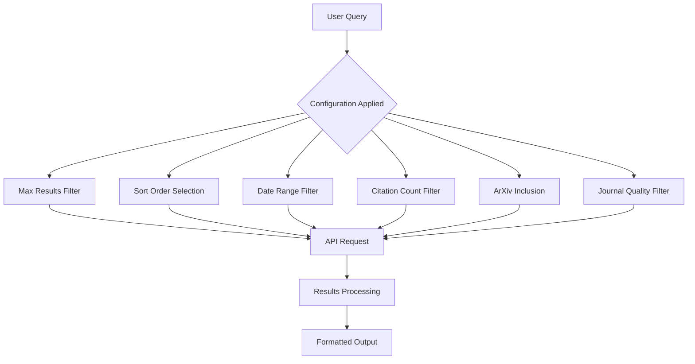
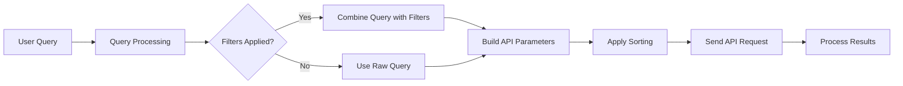
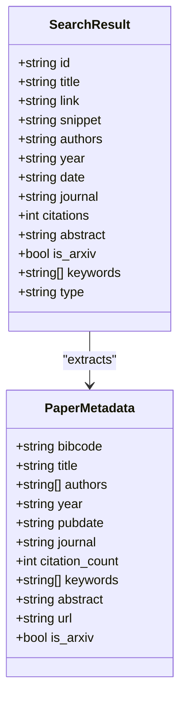
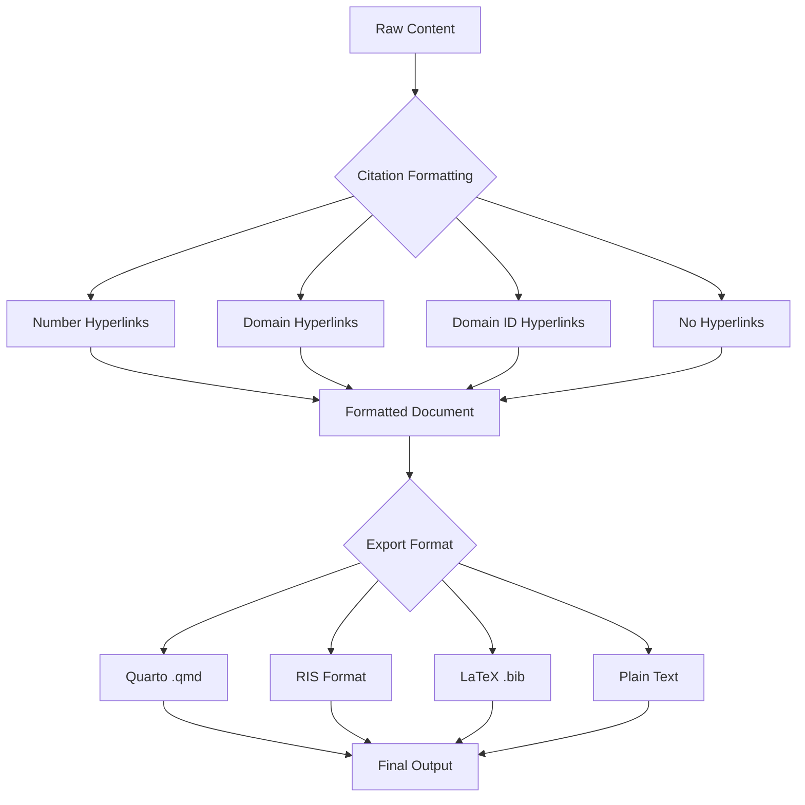
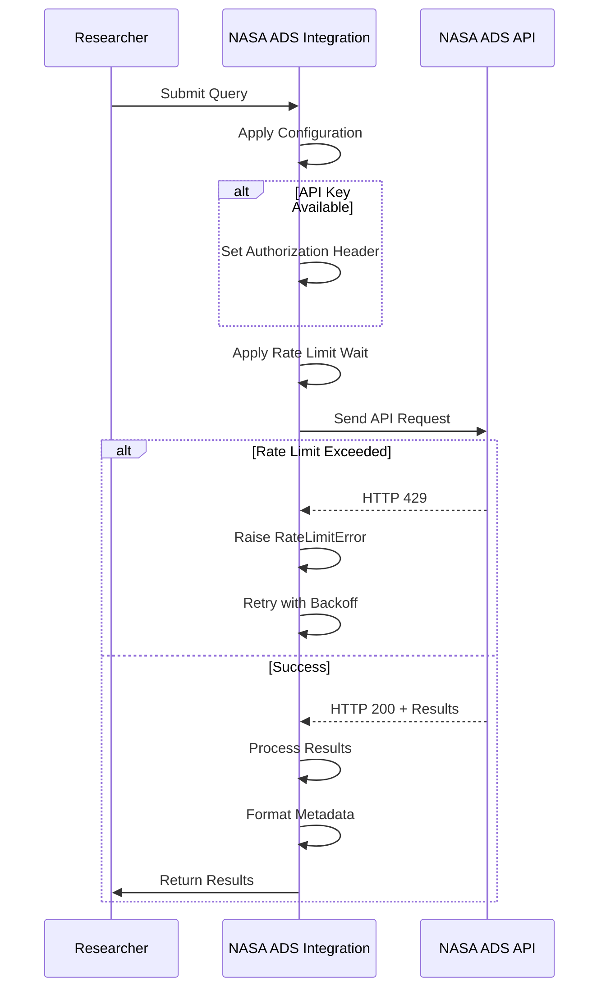

# NASA ADS Integration

<cite>
**Referenced Files in This Document**   
- [search_engine_nasa_ads.py](file://src/local_deep_research/web_search_engines/engines/search_engine_nasa_ads.py)
- [settings_nasa_ads.json](file://src/local_deep_research/defaults/settings_nasa_ads.json)
- [test_search_engine_nasa_ads.py](file://tests/search_engines/test_search_engine_nasa_ads.py)
- [journal_reputation_filter.py](file://src/local_deep_research/advanced_search_system/filters/journal_reputation_filter.py)
- [citation_formatter.py](file://src/local_deep_research/text_optimization/citation_formatter.py)
</cite>

## Table of Contents
1. [Introduction](#introduction)
2. [Core Configuration](#core-configuration)
3. [Query Syntax and Search Parameters](#query-syntax-and-search-parameters)
4. [Metadata Extraction](#metadata-extraction)
5. [Citation Formatting and Export](#citation-formatting-and-export)
6. [Authentication and Rate Limiting](#authentication-and-rate-limiting)
7. [Best Practices for Literature Reviews](#best-practices-for-literature-reviews)
8. [Conclusion](#conclusion)

## Introduction

The NASA Astrophysics Data System (ADS) integration provides a specialized interface for discovering and retrieving astronomical and physics literature through a comprehensive database of journal articles, conference proceedings, technical reports, and preprints. This integration enables researchers to conduct sophisticated literature reviews in astronomy and space sciences by leveraging ADS's extensive indexing capabilities and domain-specific metadata.

The system implements a dedicated search engine class `NasaAdsSearchEngine` that interfaces with the ADS API to retrieve academic papers with high precision. The integration supports advanced query capabilities, metadata extraction, citation formatting, and full-text access, making it a powerful tool for astrophysics research.

**Section sources**
- [search_engine_nasa_ads.py](file://src/local_deep_research/web_search_engines/engines/search_engine_nasa_ads.py#L1-L364)

## Core Configuration

The NASA ADS integration is configured through a comprehensive settings system that allows users to customize search behavior and filtering options. The configuration is defined in the `settings_nasa_ads.json` file, which contains various parameters for controlling search results.

Key configuration options include:

- **Max Results**: Maximum number of results to retrieve (default: 25, maximum: 200)
- **Sort By**: Sorting options including relevance, citation count, and publication date
- **Include ArXiv**: Option to include or exclude ArXiv preprints in search results
- **Minimum Citations**: Filter to return only papers with a minimum citation count
- **From Publication Date**: Filter to return papers published after a specific date (YYYY-MM-DD format)
- **Filter Low-Quality Journals**: Enable journal quality filtering based on reputation assessment

The integration is specifically optimized for astrophysics research areas including astronomy papers, astrophysics research, physics papers, space science, planetary science, cosmology, and high energy physics, while having limited coverage in biomedical content, computer science papers, and social sciences.



**Diagram sources**
- [settings_nasa_ads.json](file://src/local_deep_research/defaults/settings_nasa_ads.json#L1-L255)
- [search_engine_nasa_ads.py](file://src/local_deep_research/web_search_engines/engines/search_engine_nasa_ads.py#L23-L114)

## Query Syntax and Search Parameters

The NASA ADS integration supports sophisticated query syntax that enables precise literature discovery in astrophysics and related fields. The system implements fielded searches that allow users to target specific metadata elements within the ADS database.

### Query Construction

The integration automatically constructs ADS-compatible queries by combining the user's natural language query with specified filters. The query building process follows these steps:

1. The base search query is used directly, as ADS has strong natural language processing capabilities
2. Filters are applied as additional query parameters
3. The combined query is sent to the ADS API with appropriate sorting and result limits

### Fielded Search Capabilities

The system supports the following fielded search parameters:

- **Author**: Search by author name (e.g., `author:"Smith, John"`)
- **Title**: Search within paper titles (e.g., `title:"black holes"`)
- **Abstract**: Search within paper abstracts (e.g., `abstract:"cosmic microwave background"`)
- **Object**: Search by astronomical object (e.g., `object:"M31"`)
- **Bibliographic Codes**: Use ADS bibliographic codes to search by publication (e.g., `bibstem:"ApJ"` for Astrophysical Journal)

### Filter Implementation

The integration implements several domain-specific filters:

- **Publication Date**: Converted from YYYY-MM-DD format to ADS year range format (e.g., `year:2020-9999`)
- **Citation Count**: Implemented as a range query (e.g., `citation_count:[10 TO *]`)
- **ArXiv Inclusion**: Controlled by including or excluding the bibstem filter (e.g., `-bibstem:"arXiv"` to exclude ArXiv preprints)



**Diagram sources**
- [search_engine_nasa_ads.py](file://src/local_deep_research/web_search_engines/engines/search_engine_nasa_ads.py#L132-L153)
- [test_search_engine_nasa_ads.py](file://tests/search_engines/test_search_engine_nasa_ads.py#L498-L520)

## Metadata Extraction

The NASA ADS integration extracts comprehensive domain-specific metadata from retrieved papers, providing researchers with essential information for literature analysis and citation management.

### Core Metadata Fields

The system extracts the following metadata from each paper:

- **Bibcode**: Unique ADS identifier (e.g., "2023ApJ...123..456A")
- **Title**: Paper title (extracted from list format)
- **Authors**: Author list with "et al." truncation for long author lists
- **Publication Year and Date**: Year and full publication date
- **Journal/Source**: Publication venue from either the pub field or bibstem
- **Citation Count**: Number of citations the paper has received
- **Keywords**: Research keywords associated with the paper
- **Abstract**: Full paper abstract

### URL Resolution

The integration implements intelligent URL resolution with the following priority:

1. **DOI Links**: When a DOI is available, the system creates a direct link using the format `https://doi.org/{doi}`
2. **ADS Links**: When no DOI is available, the system creates a link to the ADS abstract page using the bibcode: `https://ui.adsabs.harvard.edu/abs/{bibcode}`

### ArXiv Identification

The system identifies ArXiv preprints by checking the bibstem field for "arXiv" and sets the `is_arxiv` flag accordingly. This allows users to easily distinguish between peer-reviewed journal articles and preprints.



**Diagram sources**
- [search_engine_nasa_ads.py](file://src/local_deep_research/web_search_engines/engines/search_engine_nasa_ads.py#L242-L328)
- [test_search_engine_nasa_ads.py](file://tests/search_engines/test_search_engine_nasa_ads.py#L307-L406)

## Citation Formatting and Export

The NASA ADS integration includes comprehensive citation formatting capabilities that support multiple citation styles and export formats, facilitating proper attribution and reference management in academic writing.

### Citation Formatter

The system uses the `CitationFormatter` class to format citations in various styles:

- **Number Hyperlinks**: Standard numeric citations with hyperlinks (e.g., [1])
- **Domain Hyperlinks**: Citations showing the domain name (e.g., [arxiv.org])
- **Domain ID Hyperlinks**: Citations with domain and ID (e.g., [arxiv.org-1] or [arxiv.org] when unique)
- **No Hyperlinks**: Plain numeric citations without links

The formatter automatically detects citation patterns in the text and replaces them with the appropriate formatted version, supporting both bracketed citations [1] and "Source X" patterns.

### Export Formats

The integration supports multiple export formats for reference management:

#### Quarto Export
Converts documents to Quarto (.qmd) format with proper citation syntax and YAML header:

```yaml
---
title: "Research Report"
author: "Local Deep Research"
date: "2024-01-15"
format:
  html:
    toc: true
    toc-depth: 3
    number-sections: true
  pdf:
    toc: true
    number-sections: true
    colorlinks: true
bibliography: references.bib
csl: apa.csl
---
```

#### RIS Export
Generates RIS format output compatible with reference managers like Zotero, EndNote, and Mendeley:

```
TY  - ELEC
ID  - ref1
TI  - Research Paper Title
AU  - Author One
AU  - Author Two
DO  - 10.1234/example
PY  - 2024
UR  - https://example.com
PB  - Publisher Name
Y1  - 2024
DA  - 2024/01/15
ER  - 
```

#### LaTeX Export
Creates LaTeX-compatible bibliography entries for use in academic papers:

```latex
@misc{ref1,
  title = {Research Paper Title},
  author = {Author, One and Author, Two},
  url = {https://example.com},
  howpublished = {\url{https://example.com}},
  year = {2024},
  note = "Accessed: \today"
}
```



**Diagram sources**
- [citation_formatter.py](file://src/local_deep_research/text_optimization/citation_formatter.py#L23-L800)
- [search_engine_nasa_ads.py](file://src/local_deep_research/web_search_engines/engines/search_engine_nasa_ads.py#L330-L362)

## Authentication and Rate Limiting

The NASA ADS integration implements robust authentication and rate limiting mechanisms to ensure reliable access to the ADS API while respecting usage policies.

### Authentication Requirements

The integration requires an API key for optimal performance and higher rate limits:

- **API Key Configuration**: The API key can be configured through the settings interface or passed programmatically
- **Key Storage**: API keys are stored securely in the application settings
- **Authentication Header**: When an API key is provided, the system includes a Bearer token in the Authorization header: `Authorization: Bearer {api_key}`

Without an API key, the system can still function but with significantly reduced rate limits, potentially impacting search performance and reliability.

### Rate Limiting Implementation

The integration implements a sophisticated rate limiting system that:

- **Tracks Rate Limit Headers**: Monitors `X-RateLimit-Remaining` and `X-RateLimit-Limit` headers from the ADS API
- **Applies Adaptive Waiting**: Implements wait times between requests based on current rate limit status
- **Handles Rate Limit Errors**: Properly handles HTTP 429 responses by raising `RateLimitError` for retry handling
- **Logs Rate Status**: Provides detailed logging of rate limit status for debugging and monitoring

The system uses an adaptive rate limiting tracker that learns from past request patterns to optimize timing and avoid hitting rate limits.

### Journal Reputation Filtering

The integration includes an optional journal reputation filter that assesses the quality of publication venues:

- **LLM-Powered Analysis**: Uses a language model to analyze journal reputation based on web search results
- **Database Caching**: Stores journal quality assessments in a local database to avoid repeated analysis
- **Configurable Threshold**: Allows users to set a minimum reputation threshold (1-10 scale) for filtering results
- **Reanalysis Period**: Configures how frequently journal reputations should be re-evaluated

The journal reputation filter is enabled by default and can be disabled through the settings interface.



**Diagram sources**
- [search_engine_nasa_ads.py](file://src/local_deep_research/web_search_engines/engines/search_engine_nasa_ads.py#L174-L234)
- [journal_reputation_filter.py](file://src/local_deep_research/advanced_search_system/filters/journal_reputation_filter.py#L26-L161)

## Best Practices for Literature Reviews

To maximize the effectiveness of the NASA ADS integration for literature reviews in astronomy and space sciences, researchers should follow these best practices:

### Effective Query Construction

- **Use Specific Keywords**: Focus on precise astronomical terms rather than general concepts
- **Leverage Fielded Searches**: Use fielded search syntax to target specific metadata elements
- **Combine Filters Strategically**: Use date ranges, citation counts, and journal quality filters to refine results
- **Iterative Refinement**: Start with broad queries and gradually narrow based on initial results

### Citation Management

- **Verify Sources**: Always review the full text of important papers rather than relying solely on abstracts
- **Check Citation Networks**: Use citation counts and references to identify seminal papers in a field
- **Distinguish Preprints**: Be aware of the difference between peer-reviewed articles and ArXiv preprints
- **Use Export Features**: Leverage the RIS and BibTeX export options for reference management

### Research Workflow

- **Set Appropriate Date Ranges**: Focus on recent literature for current topics, but include historical papers for foundational concepts
- **Filter by Citation Count**: Use minimum citation filters to identify influential papers
- **Evaluate Journal Quality**: Consider the reputation of publication venues when assessing paper quality
- **Include ArXiv Preprints**: For cutting-edge research, include ArXiv preprints but verify findings in peer-reviewed publications

### Technical Considerations

- **Obtain an API Key**: Register for a free API key at https://ui.adsabs.harvard.edu/user/settings/token to avoid rate limiting issues
- **Monitor Rate Limits**: Be aware of request limits and structure searches to avoid excessive API calls
- **Use Batch Processing**: For comprehensive literature reviews, break queries into smaller batches
- **Save Search Results**: Export and save important results to avoid re-downloading

## Conclusion

The NASA ADS integration provides a powerful and specialized interface for conducting literature reviews in astronomy and space sciences. By leveraging the extensive NASA Astrophysics Data System database, researchers can discover, analyze, and manage astrophysics literature with high precision and efficiency.

The integration's support for advanced query syntax, comprehensive metadata extraction, sophisticated citation formatting, and robust authentication mechanisms makes it an invaluable tool for academic research in astrophysics. By following the best practices outlined in this documentation, researchers can maximize the effectiveness of their literature reviews and contribute to the advancement of knowledge in astronomy and related fields.