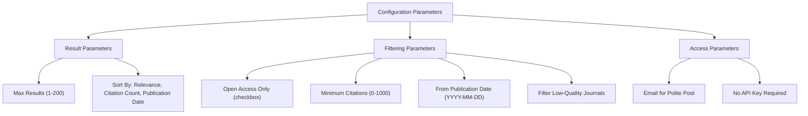
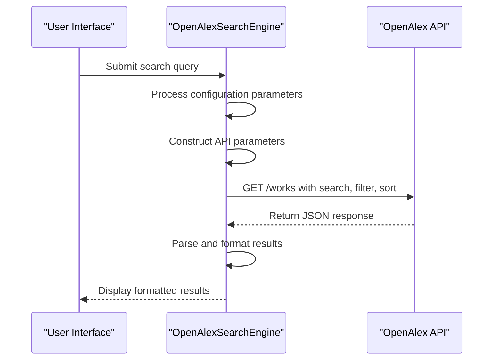
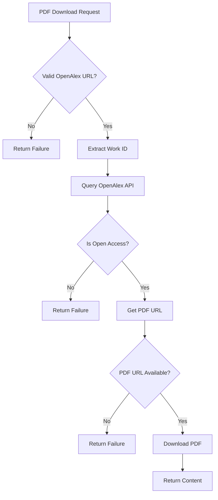

# OpenAlex Integration

<cite>
**Referenced Files in This Document**   
- [settings_openalex.json](file://src/local_deep_research/defaults/settings_openalex.json)
- [search_engine_openalex.py](file://src/local_deep_research/web_search_engines/engines/search_engine_openalex.py)
- [openalex.py](file://src/local_deep_research/research_library/downloaders/openalex.py)
- [test_search_engine_openalex.py](file://tests/search_engines/test_search_engine_openalex.py)
- [test_openalex_downloader.py](file://tests/research_library/downloaders/test_openalex_downloader.py)
</cite>

## Table of Contents
1. [Introduction](#introduction)
2. [Configuration Parameters](#configuration-parameters)
3. [Query Construction and Filtering](#query-construction-and-filtering)
4. [Response Parsing and Data Extraction](#response-parsing-and-data-extraction)
5. [PDF Downloader Integration](#pdf-downloader-integration)
6. [Knowledge Graph Integration](#knowledge-graph-integration)
7. [Rate Limiting and Data Freshness](#rate-limiting-and-data-freshness)
8. [Performance Considerations](#performance-considerations)

## Introduction

The OpenAlex integration provides access to a comprehensive, open catalog of scholarly works across all disciplines, including publications, authors, institutions, and concepts. As an open alternative to proprietary academic databases, OpenAlex offers a RESTful API that enables programmatic access to metadata for over 250 million academic papers. The integration is designed to support natural language queries, allowing users to search for scholarly content without requiring specialized query syntax.

The implementation consists of two primary components: the search engine interface that handles querying and result retrieval, and the PDF downloader that facilitates access to open-access content. The search engine is configured to work seamlessly with the system's knowledge graph, enabling concept-based exploration of academic literature. OpenAlex does not require API keys, making it accessible for all users, and provides high rate limits, especially when accessing through the polite pool with an email address.

**Section sources**
- [settings_openalex.json](file://src/local_deep_research/defaults/settings_openalex.json#L1-L253)
- [search_engine_openalex.py](file://src/local_deep_research/web_search_engines/engines/search_engine_openalex.py#L1-L427)

## Configuration Parameters

The OpenAlex integration is highly configurable through a comprehensive set of parameters that control search behavior, filtering, and display options. These parameters are defined in the system settings and can be customized through the user interface or programmatically.

Key configuration parameters include:

- **Max Results**: Controls the maximum number of results to retrieve from OpenAlex (default: 25, maximum: 200)
- **Sort By**: Determines the sorting order of results with options for relevance, citation count, or publication date
- **Open Access Only**: When enabled, filters results to include only papers that are freely available
- **Minimum Citations**: Sets a threshold for the minimum number of citations a paper must have
- **From Publication Date**: Filters papers to include only those published after a specified date (YYYY-MM-DD format)
- **Email (for Polite Pool)**: Optional email address that grants access to the polite pool, providing faster response times
- **Filter Low-Quality Journals**: Enables journal quality filtering based on reputation metrics

The configuration also includes metadata about the search engine's capabilities, such as its strengths in academic papers, scholarly research, citation analysis, and comprehensive coverage across all disciplines. Conversely, it acknowledges limitations in non-academic content, news articles, general web content, and real-time information.

**Diagram sources**
- [settings_openalex.json](file://src/local_deep_research/defaults/settings_openalex.json#L121-L208)

**Section sources**
- [settings_openalex.json](file://src/local_deep_research/defaults/settings_openalex.json#L1-L253)

## Query Construction and Filtering

The OpenAlex search engine constructs queries using the platform's powerful filtering syntax, which supports natural language queries while also enabling precise filtering through structured parameters. The query construction process begins with the user's natural language input, which is passed directly to the OpenAlex API as the search parameter.

The integration builds API requests with carefully selected parameters to optimize result quality and relevance. The base query includes a "select" parameter that specifies exactly which fields to retrieve, minimizing bandwidth usage while ensuring essential metadata is available. The selected fields include: id, display_name, publication_year, publication_date, doi, primary_location, authorships, cited_by_count, open_access, best_oa_location, and abstract_inverted_index.

Filtering is implemented through the API's filter parameter, which combines multiple criteria into a comma-separated string. The integration supports several filtering options:

- **Open Access Filtering**: When enabled, adds "is_oa:true" to the filter parameter to return only open access papers
- **Citation Count Filtering**: For papers with a minimum citation threshold, adds "cited_by_count:>{min_citations}" to the filter
- **Publication Date Filtering**: Filters papers published after a specific date using "from_publication_date:{date}"
- **Sorting**: Maps user-selected sort options to OpenAlex's sort parameter with appropriate direction (descending)

The integration also handles the polite pool access by including the user's email in the request parameters when provided, which grants access to faster response times. The User-Agent header is customized to include the email address, following OpenAlex's guidelines for polite API usage.

**Diagram sources**
- [search_engine_openalex.py](file://src/local_deep_research/web_search_engines/engines/search_engine_openalex.py#L124-L161)

**Section sources**
- [search_engine_openalex.py](file://src/local_deep_research/web_search_engines/engines/search_engine_openalex.py#L112-L161)

## Response Parsing and Data Extraction

The OpenAlex integration parses JSON responses to extract comprehensive metadata about scholarly works, including titles, authors with institutional affiliations, abstracts, cited references, and open access availability. The response parsing process is designed to handle the unique structure of OpenAlex data, particularly the inverted index format used for abstracts.

When a search request returns results, the integration processes each work object to extract and format relevant information. The parsing workflow includes:

1. **Basic Information Extraction**: Retrieves the work ID, title (display_name), publication year, and publication date
2. **Author Information Processing**: Extracts author names from the authorships array, limiting to the first five authors and appending "et al." if additional authors exist
3. **Venue/Journal Identification**: Extracts the journal or venue name from the primary_location source
4. **Citation Metrics**: Retrieves the cited_by_count for impact assessment
5. **URL Resolution**: Constructs the best available URL, prioritizing DOI links, then OpenAlex URLs
6. **Open Access Status**: Determines if the paper is open access and extracts the best OA location

A key aspect of the response parsing is the reconstruction of abstracts from the inverted index format. OpenAlex provides abstracts in an inverted index structure that maps words to their positions in the text. The integration includes a dedicated method `_reconstruct_abstract` that converts this structure back into readable text by:

1. Creating a position-to-word mapping from the inverted index
2. Sorting positions in ascending order
3. Joining words in the correct sequence to reconstruct the original abstract

The integration also extracts information about cited references when available, though this requires additional API calls for complete data. The parsed metadata is formatted into a standardized preview structure that includes fields for title, link, snippet, authors, year, date, journal, citations, open access status, OA URL, abstract, and type.

**Section sources**
- [search_engine_openalex.py](file://src/local_deep_research/web_search_engines/engines/search_engine_openalex.py#L251-L393)

## PDF Downloader Integration

The OpenAlex PDF downloader integration enables retrieval of open-access content directly from the OpenAlex database. This component works in conjunction with the search engine to provide seamless access to full-text papers when available. The downloader is specifically designed to handle OpenAlex's open access metadata and locate the best available PDF version of a paper.

The PDF downloader operates through a multi-step process:

1. **URL Validation**: The `can_handle` method checks if a URL belongs to OpenAlex by verifying the hostname is "openalex.org" or ends with ".openalex.org"
2. **Work ID Extraction**: The `_extract_work_id` method parses OpenAlex URLs to extract the work ID (e.g., W123456789) from various URL formats, including https://openalex.org/W123456789 and https://openalex.org/works/W123456789
3. **API Lookup**: The `_get_pdf_url` method queries the OpenAlex API using the work ID to retrieve the paper's metadata, specifically looking for open access information
4. **PDF URL Resolution**: The method checks if the paper is open access and retrieves the PDF URL from the best_oa_location field, prioritizing direct PDF links over landing pages
5. **Content Download**: The `download` method retrieves the PDF content from the resolved URL

The downloader supports the polite pool by including the user's email in the User-Agent header when making API requests, which can improve response times. It also validates landing pages that might redirect to PDFs by performing a HEAD request to check the Content-Type header, ensuring the final destination is indeed a PDF file.

The integration handles various edge cases, including papers that are not open access, invalid work IDs, API errors, and network issues. When a PDF is not available, the downloader returns a descriptive skip reason to inform the user why the download could not proceed.

**Diagram sources**
- [openalex.py](file://src/local_deep_research/research_library/downloaders/openalex.py#L35-L94)

**Section sources**
- [openalex.py](file://src/local_deep_research/research_library/downloaders/openalex.py#L1-L214)

## Knowledge Graph Integration

The OpenAlex integration connects with the system's knowledge graph to enable concept-based exploration of academic literature. This integration allows users to move beyond simple keyword searches and discover relationships between concepts, authors, institutions, and publications across disciplines.

The knowledge graph integration works by extracting key entities and concepts from the metadata of retrieved papers and mapping them to nodes in the knowledge graph. When a user searches for a topic, the system not only returns relevant papers but also identifies related concepts that can be explored further. This enables a more comprehensive research experience where users can:

- Discover connections between seemingly unrelated research areas
- Identify key authors and institutions in a field
- Trace the evolution of concepts over time
- Find seminal papers that bridge different domains

The integration leverages the rich metadata provided by OpenAlex, including concept tags, author affiliations, institutional hierarchies, and citation networks. These elements are processed to create a multidimensional view of the academic landscape. For example, when a paper is retrieved, its associated concepts are added to the knowledge graph, and links are established between the paper and its authors, institutions, and cited works.

The system also supports concept-based expansion of queries, where initial search results are analyzed to identify related concepts that might yield additional relevant papers. This approach helps overcome the limitations of keyword-based searching and can uncover valuable research that might be missed with traditional search methods.

**Section sources**
- [search_engine_openalex.py](file://src/local_deep_research/web_search_engines/engines/search_engine_openalex.py#L52-L60)
- [base_knowledge.py](file://src/local_deep_research/advanced_search_system/knowledge/base_knowledge.py#L1-L150)

## Rate Limiting and Data Freshness

The OpenAlex integration includes robust handling of rate limiting and considerations for data freshness to ensure reliable and up-to-date search results. OpenAlex provides generous rate limits, particularly for users who register with an email address through the polite pool, but the integration still implements careful rate limiting to maintain system stability and fairness.

The integration applies rate limiting before making API requests using the system's rate tracking mechanism. It monitors the x-ratelimit-remaining and x-ratelimit-limit headers in API responses to track usage and adjust request timing accordingly. When the rate limit is approached, the system automatically introduces delays between requests to stay within acceptable limits.

For users who provide an email address, the integration grants access to the polite pool, which offers faster response times and higher rate limits. This is implemented by including the email in both the User-Agent header and the mailto parameter of API requests, following OpenAlex's guidelines for responsible API usage.

Regarding data freshness, OpenAlex maintains a comprehensive and regularly updated database of scholarly works. The integration does not implement local caching of results to ensure users always receive the most current information. However, for large result sets, the system efficiently handles pagination through OpenAlex's built-in pagination parameters, allowing retrieval of extensive result sets without overwhelming the API.

The integration also handles various error conditions gracefully, including rate limit exceeded responses (HTTP 429), which trigger retry mechanisms with exponential backoff. Other HTTP errors and network exceptions are caught and logged, with appropriate fallback behaviors to maintain system stability.

**Section sources**
- [search_engine_openalex.py](file://src/local_deep_research/web_search_engines/engines/search_engine_openalex.py#L163-L237)
- [test_search_engine_openalex.py](file://tests/search_engines/test_search_engine_openalex.py#L300-L318)

## Performance Considerations

The OpenAlex integration is designed with performance optimization in mind, particularly when handling large result sets and complex queries. Several strategies are employed to ensure efficient operation:

1. **Selective Field Retrieval**: The integration uses the "select" parameter to request only essential fields, reducing bandwidth usage and parsing time
2. **Result Limiting**: The max_results parameter limits the number of results processed, with a default of 25 and a maximum of 200 per request
3. **Efficient Abstract Reconstruction**: The inverted index to text conversion is optimized for performance, with error handling to prevent failures on malformed data
4. **Parallel Processing**: Search results are processed sequentially but efficiently, with logging to monitor performance
5. **Connection Reuse**: The underlying HTTP client reuses connections to minimize overhead

For large-scale research, the integration efficiently handles the retrieval and processing of substantial result sets by leveraging OpenAlex's pagination capabilities. The system can retrieve multiple pages of results when needed, processing them in batches to manage memory usage effectively.

The integration also considers the performance implications of filtering and sorting operations. While these are handled server-side by OpenAlex, the integration ensures that filter parameters are constructed efficiently to avoid unnecessary complexity. The sorting is also performed server-side, reducing the client-side processing burden.

When integrating with the PDF downloader, performance considerations include the use of streaming downloads for large PDF files and proper error handling to prevent timeouts. The downloader also validates URLs before downloading to avoid unnecessary network requests for unavailable content.

**Section sources**
- [search_engine_openalex.py](file://src/local_deep_research/web_search_engines/engines/search_engine_openalex.py#L124-L131)
- [search_engine_openalex.py](file://src/local_deep_research/web_search_engines/engines/search_engine_openalex.py#L214-L231)